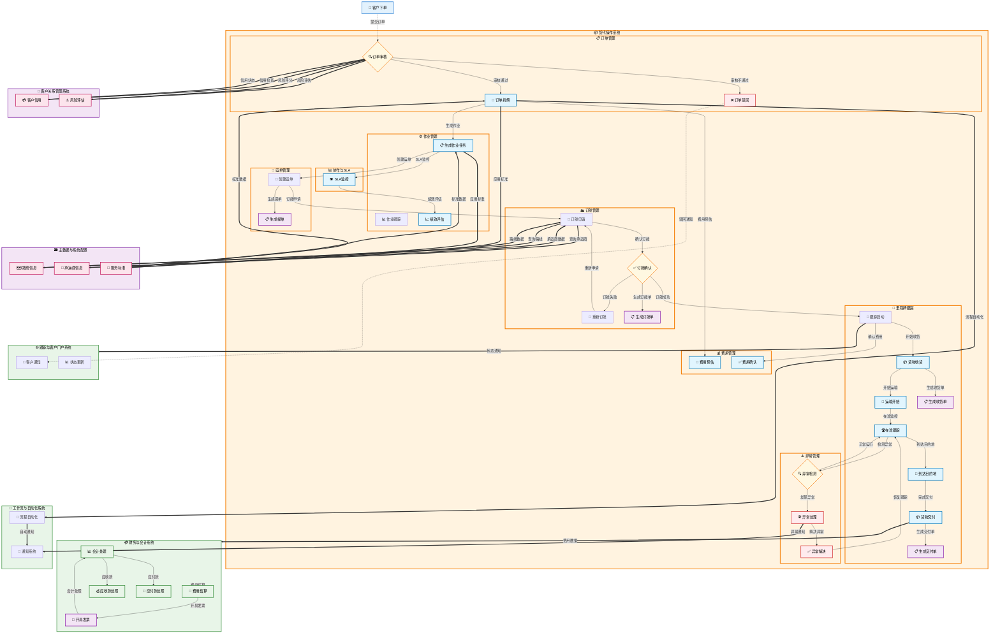

# 货代操作（Freight Forwarding Operations System）

## 📋 新手程序员阅读指南

**欢迎阅读货代操作文档！** 本文档专为新手程序员设计，帮助您快速理解货代业务和系统架构。

### 🎯 阅读建议

1.  **先理解业务背景**：货代（货运代理）是帮助客户处理货物运输的服务商，类似于"物流中介"
2.  **掌握核心概念**：重点理解订单 → 作业 → 运单 → 里程碑的业务流程链条
3.  **关注系统交互**：注意区分系统内流转、跨系统触发、外部系统交互三种不同的集成方式
4.  **参考术语表**：遇到不熟悉的业务术语时，请查阅第 3 章的标准化业务术语表

### 💡 业务场景举例

想象一个简单场景：某公司要从上海运一批电子产品到美国洛杉矶

*   **客户下单**：在系统中创建运输订单，填写货物信息、起止地点等
*   **订单拆解**：系统自动将订单分解为多个具体作业（如：订舱、报关、运输等）
*   **作业执行**：各部门按照作业清单执行具体任务
*   **全程跟踪**：通过里程碑系统实时跟踪货物位置和状态
*   **单证管理**：生成和管理运输过程中的各种单证文件
*   **费用结算**：计算和核算整个运输过程的费用

## 1. 系统概述

货代操作是货代企业的核心业务平台，覆盖从客户订单接收到最终交付的完整业务流程。系统支持海运、空运、陆运及多式联运业务，实现订单管理、作业执行、运单建档、订舱管理、里程碑跟踪、单证管理、费用核算等核心功能的一体化管理。

### 1.1 业务范围

*   **运输方式**：海运（FCL/LCL）、空运、陆运、多式联运
    *   FCL：整箱货（Full Container Load），一个客户独占一个集装箱
    *   LCL：拼箱货（Less than Container Load），多个客户共享一个集装箱
*   **贸易类型**：进口、出口、转运、内贸
*   **服务模式**：门到门、港到港、仓到仓
*   **客户类型**：直客（直接客户）、同行（其他货代公司）、代理

### 1.2 核心价值

*   实现业务流程标准化和自动化
*   提供实时的货物跟踪和状态更新
*   支持精确的成本核算和利润分析
*   确保单证合规和风险控制
*   提升客户服务质量和满意度

## 2. 跨系统触发概念说明

### 2.1 触发类型定义

在货代数字化平台中，业务流程涉及多个系统和模块间的协作。为了准确描述不同层级的系统交互，我们定义了以下触发类型：

| 触发类型       | 定义               | 适用场景                                | 示例                     |
| ---------- | ---------------- | ----------------------------------- | ---------------------- |
| **系统内流转**  | 同一货代操作内部模块间的状态流转 | 货代操作内部的订单管理 → 作业管理 → 运单管理等模块间流转   | 订单管理.订单确认 → 订单管理.拆解引擎  |
| **跨系统触发**  | 不同货代操作间的真正跨系统交互  | 货代操作与关务合规系统、财务与会计系统、仓储系统等独立系统间的交互 | 里程碑跟踪.已到港 → 关务与合规.报关申报 |
| **外部系统交互** | 与第三方外部系统的集成交互    | 与承运商系统、海关系统、银行系统等外部第三方系统的交互         | 订舱管理.订舱申请 → 承运商系统      |

### 2.2 区分标准

#### **判断依据 1：系统架构层级**

*   **系统内流转**：同一系统内的状态变化，无需跨越系统边界
*   **跨系统触发**：不同货代操作间的集成，需要通过系统间接口
*   **外部系统交互**：与企业外部第三方系统的集成

#### **判断依据 2：描述格式**

*   **系统内流转**：通常描述为状态变化或内部处理
*   **跨系统触发**：格式为"系统名.功能名"（如：关务与合规.报关申报）
*   **外部系统交互**：明确标注为外部系统名称

#### **判断依据 3：技术实现方式**

*   **系统内流转**：数据库事务、内存状态变更、内部消息队列、服务间调用
*   **跨系统触发**：REST API、消息中间件、数据同步
*   **外部系统交互**：EDI、Web Service、第三方 API

### 2.3 业务价值

这种分层的触发机制设计具有以下优势：

*   **清晰的职责边界**：明确区分系统内部处理和系统间集成
*   **灵活的架构演进**：支持微服务架构下的独立部署和扩展
*   **标准化的集成模式**：为不同类型的系统交互提供统一的描述规范
*   **便于运维管理**：不同触发类型对应不同的监控和故障处理策略

## 3. 标准化业务术语表

| 中文术语 | 英文字段             | 编号规则             | 说明             | 测试数据示例           |
| ---- | ---------------- | ---------------- | -------------- | ---------------- |
| 客户订单 | Customer\_Order  | ORD-YYYYMMDD-NNN | 客户下达的运输服务需求单据  | ORD-20240315-001 |
| 内部作业 | Internal\_Job    | JOB-YYYYMMDD-NNN | 由订单拆解生成的内部执行任务 | JOB-20240315-001 |
| 运单   | Waybill/Shipment | WAY-YYYYMMDD-NNN | 承运人签发的运输凭证     | WAY-20240315-001 |
| 订舱单  | Booking          | BKG-YYYYMMDD-NNN | 向承运商预订舱位的凭证    | BKG-20240315-001 |
| 提单   | Bill\_of\_Lading | BL-YYYYMMDD-NNN  | 海运货物运输合同凭证     | BL-20240315-001  |
| 主单号  | Master\_Bill     | MBL-NNNNNN       | 承运人签发的主运单号     | MBL-240315001    |
| 分单号  | House\_Bill      | HBL-XXXXNNN      | 货代签发的分运单号      | HBL-SH240315001  |
| 集装箱号 | Container\_No    | AAAA-NNNNNNN-N   | 国际标准集装箱编号      | MSCU-1234567-8   |
| 封条号  | Seal\_No         | SEAL-NNNNNN      | 集装箱封条编号        | SEAL-123456      |
| 里程碑  | Milestone        | MS-YYYYMMDD-NNN  | 运输过程中的关键节点     | MS-20240315-001  |
| 异常单  | Exception        | EXC-YYYYMMDD-NNN | 运输过程中的异常事件记录   | EXC-20240315-001 |
| 费用项  | Charge\_Item     | CHG-YYYYMMDD-NNN | 运输服务相关的费用明细    | CHG-20240315-001 |
| 单证   | Document         | DOC-YYYYMMDD-NNN | 运输相关的各类单证文件    | DOC-20240315-001 |

## 4. 标准状态定义与流转规则

| 状态英文                 | 状态中文   | 业务模块  | 前置条件    | 触发事件     | 输出关键数据           | 自动操作       | 下一环节触发                |
| -------------------- | ------ | ----- | ------- | -------- | ---------------- | ---------- | --------------------- |
| DRAFT                | 草稿     | 订单管理  | 无       | 用户创建订单   | 订单号、客户信息、货物信息    | 数据验证       | **系统内流转**             |
| SUBMITTED            | 已提交    | 订单管理  | 订单信息完整  | 用户提交订单   | 订单号、验证结果         | 信用检查、数据验证  | **系统内流转**             |
| CONFIRMED            | 已确认    | 订单管理  | 通过验证    | 系统或人工确认  | 确认的订单号           | 触发订单拆解     | **系统内流转**：作业管理.创建作业   |
| BREAKDOWN\_COMPLETED | 拆解完成   | 订单管理  | 订单已确认   | 拆解引擎执行   | 生成的作业列表          | 创建内部作业     | **系统内流转**：作业管理.分派作业   |
| PENDING\_ASSIGNMENT  | 待分派    | 作业管理  | 作业已创建   | 从订单拆解接收  | 作业号、作业类型、优先级     | 无          | **系统内流转**             |
| ASSIGNED             | 已分派    | 作业管理  | 作业存在    | 自动或手动分派  | 负责人、分派时间         | 通知负责人      | **系统内流转**             |
| IN\_PROGRESS         | 执行中    | 作业管理  | 作业已分派   | 负责人开始执行  | 开始时间、状态更新        | 创建运单       | **系统内流转**：运单管理.创建运单   |
| WAYBILL\_CREATED     | 运单已建档  | 运单管理  | 作业执行中   | 从作业管理接收  | 运单号、MBL/HBL 号    | 生成运单号      | **系统内流转**             |
| BOOKING\_REQUESTED   | 订舱已申请  | 订舱管理  | 运单已建档   | 从运单管理触发  | 订舱申请号、承运商信息      | 发送订舱请求     | **外部系统交互**：承运商系统      |
| BOOKING\_CONFIRMED   | 订舱已确认  | 订舱管理  | 订舱已申请   | 承运商确认    | 订舱号、舱位信息、ETD/ETA | 更新运单信息     | **系统内流转**：里程碑跟踪.创建节点  |
| MILESTONE\_TRACKING  | 里程碑跟踪中 | 里程碑跟踪 | 订舱已确认   | 从订舱管理接收  | 里程碑节点、计划时间       | 创建标准节点     | **系统内流转**             |
| DEPARTED             | 已起运    | 里程碑跟踪 | 货物装船/装机 | 实际离港     | 实际离港时间、位置信息      | 更新里程碑      | **系统内流转**：单证管理.生成提单   |
| DOCUMENT\_GENERATED  | 单证已生成  | 单证管理  | 货物已起运   | 从里程碑跟踪接收 | 单证编号、文件路径        | 生成提单等单证    | **跨系统触发**：财务与会计（费用添加） |
| ARRIVED              | 已到港    | 里程碑跟踪 | 货物在途    | 实际到港     | 实际到港时间、位置信息      | 更新里程碑、检查偏差 | **跨系统触发**：关务与合规.报关申报  |
| CHARGES\_CALCULATED  | 费用已计算  | 费用管理  | 单证已生成   | 从单证管理接收  | 费用明细、毛利计算        | 计算应收应付     | **跨系统触发**：财务与会计.生成发票  |
| DELIVERED            | 已交付    | 里程碑跟踪 | 货物放行    | 客户签收     | 签收时间、POD 凭证      | 更新最终状态     | **跨系统触发**：财务与会计（费用核销） |
| EXCEPTION\_RAISED    | 异常已登记  | 异常管理  | 任何环节    | 发现异常     | 异常号、类型、严重等级      | 分配处理人、发送通知 | **系统内流转**             |
| EXCEPTION\_RESOLVED  | 异常已解决  | 异常管理  | 异常已登记   | 处理完成     | 解决方案、处理时间        | 更新相关模块状态   | **系统内流转**：恢复原业务流程     |
| COMPLETED            | 已完成    | 作业管理  | 所有子任务完成 | 系统检查     | 完成时间、最终状态        | 生成完成报告     | **跨系统触发**：财务与会计.关账处理  |
| CLOSED               | 已关账    | 订单管理  | 费用已核销   | 财务确认     | 关账时间、最终毛利        | 归档订单       | **系统内完成**             |

## 5. 系统功能架构

### 5.1 一级菜单结构

    货代操作
    ├── 订单管理
    ├── 作业管理
    ├── 运单管理
    ├── 订舱管理
    ├── 里程碑跟踪
    ├── 单证管理
    ├── 费用管理
    ├── 协同与SLA
    ├── 异常管理
    └── 系统设置

### 5.2 货代操作系统总体业务流程

## 6. 详细功能模块

本系统已按功能模块拆分为独立的详细文档，请参考以下文件：

### 6.1 [订单管理](./1.1%20订单管理.md)
- **功能概述**：订单接收、处理和管理客户的运输服务需求
- **核心特性**：智能订单拆解、多渠道接单、风险控制、信用检查
- **主要功能**：订单创建、审核、拆解、查询、统计报表

### 6.2 [作业管理](./1.2%20作业管理.md)
- **功能概述**：管理由订单拆解生成的具体执行任务
- **核心特性**：智能分派、进度跟踪、团队协作、绩效分析
- **主要功能**：作业分派、执行跟踪、质量审核、协作支持

### 6.3 [运单管理](./1.3%20运单管理.md)
- **功能概述**：管理货物运输过程中的所有单证信息
- **核心特性**：标准化单证、自动生成、多式联运、承运商集成
- **主要功能**：运单创建、模板管理、状态跟踪、批量操作

### 6.4 [订舱管理](./1.4%20订舱管理.md)
- **功能概述**：向承运商申请运输舱位，确保货物按计划运输
- **核心特性**：智能舱位匹配、多渠道订舱、实时同步、成本优化
- **主要功能**：订舱申请、承运商对接、舱位管理、订舱统计

### 6.5 [里程碑跟踪](./1.5%20里程碑跟踪.md)
- **功能概述**：监控货物运输全程的关键节点和实时状态
- **核心特性**：全程可视、主动预警、客户通知、数据驱动
- **主要功能**：实时跟踪、异常预警、客户通知、跟踪报表

### 6.6 [单证管理](./1.6%20单证管理.md)
- **功能概述**：生成、管理和流转货运相关的各类单证文件
- **核心特性**：标准化制单、自动化生成、电子签章、合规检查
- **主要功能**：单证生成、模板管理、电子签章、版本控制

### 6.7 [费用管理](./1.7%20费用管理.md)
- **功能概述**：费用收集、分配计算和利润分析
- **核心特性**：精准分配、部门核算、数据集成、透明管理
- **主要功能**：应收应付管理、费用审核、订单费用分配、利润分析

### 6.8 [协作与SLA](./1.8%20协作与SLA.md)
- **功能概述**：服务质量保障和内外部协作管理
- **核心特性**：服务标准化、实时监控、主动预警、持续改进
- **主要功能**：SLA指标管理、实时监控、协作工作台、性能分析

### 6.9 [异常管理](./1.9%20异常管理.md)
- **功能概述**：异常识别、记录、处理和跟踪机制
- **核心特性**：快速响应、风险控制、质量提升、客户满意
- **主要功能**：异常登记、处理跟踪、根因分析、统计改进

## 7. 系统集成与数据流

### 7.1 内部系统集成
- **订单管理 → 作业管理**：订单拆解后自动创建作业任务
- **作业管理 → 运单管理**：作业执行过程中创建运单
- **运单管理 → 订舱管理**：运单建档后触发订舱申请
- **订舱管理 → 里程碑跟踪**：订舱确认后创建跟踪节点
- **里程碑跟踪 → 单证管理**：货物起运后生成相关单证
- **单证管理 → 费用管理**：单证生成后计算相关费用

### 7.2 外部系统集成
- **承运商系统**：订舱申请、舱位确认、运输跟踪
- **关务与合规系统**：报关申报、合规检查
- **财务与会计系统**：费用数据同步、发票生成
- **仓储管理系统**：货物收发、库存管理
- **客户门户系统**：订单提交、状态查询

## 8. 技术架构说明

### 8.1 架构风格
**域驱动设计DDD + 微服务 + 事件驱动（Event-Driven，CQRS 部分应用）+ 湖仓一体（实时/离线结合）+ 前后端分离 + API 网关 + BFF 层（面向门户/运营台）**

- **域驱动设计（DDD）**：以业务领域为核心，构建清晰的领域模型
- **微服务架构**：各功能模块独立部署、扩展和维护
- **事件驱动**：通过事件实现系统间的松耦合通信
- **CQRS**：命令查询职责分离，优化读写性能
- **湖仓一体**：结合数据湖的灵活性和数据仓库的性能
- **前后端分离**：提升开发效率和用户体验
- **API网关**：统一接口管理、安全控制和流量治理
- **BFF层**：针对不同前端提供定制化的后端服务

### 8.2 逻辑架构分层

#### 8.2.1 表现层
- **运营工作台**：内部员工操作界面，支持复杂业务流程
- **客户门户**：客户自助服务平台，订单提交和状态查询
- **移动端**：司机端APP、仓库PDA等移动设备应用

#### 8.2.2 数据与AI层
- **数据采集**：
  - CDC（Change Data Capture）：数据库变更捕获
  - 事件流：实时事件数据收集
  - OCR：文档图像识别和数据提取
- **数据湖与数仓**：统一的数据存储和处理平台
- **特征库**：机器学习特征存储和管理
- **模型服务**：
  - ETA预测：到达时间智能预估
  - 报价模型：智能定价和成本预测
  - 异常检测：业务异常识别和预警
  - 回款预测：应收账款风险评估
- **BI/报表**：商业智能分析和可视化报表

#### 8.2.3 基础设施层
- **API网关**：接口统一管理、安全认证、流量控制
- **消息总线**：事件驱动架构的核心通信机制
- **对象存储**：文件、图片、文档的分布式存储
- **身份与权限**：统一认证授权、RBAC权限控制
- **监控与日志**：系统监控、日志收集、链路追踪
- **CI/CD**：持续集成和持续部署流水线
- **MLOps**：机器学习模型的生命周期管理
- **OTLP**：OpenTelemetry协议的可观测性数据收集

### 8.3 技术栈详情

#### 8.3.1 前端技术栈
- **React**：现代化的前端框架
- **TypeScript**：类型安全的JavaScript超集
- **Vite**：快速的前端构建工具
- **Three.js**：3D图形渲染库，用于货物可视化
- **Blender**：3D建模工具，创建货物和仓库模型
- **React Router**：前端路由管理
- **React Redux**：状态管理
- **CASL React**：权限控制库
- **Ant Design 5**：企业级UI组件库

#### 8.3.2 后端技术栈
- **.NET 9**：现代化的后端开发框架
- **Aspire**：云原生应用开发平台
- **EF Core**：对象关系映射（ORM）框架
- **Dapr**：分布式应用运行时
- **Identity**：身份认证和授权框架

#### 8.3.3 数据流技术
- **Kafka/Pulsar**：分布式事件流平台，作为事件总线
- **Flink/Spark**：流式和批处理数据处理引擎

#### 8.3.4 数据仓库技术
- **S3/OSS**：对象存储服务
- **Iceberg/Delta**：数据湖表格式
- **Doris/ClickHouse**：OLAP分析数据库

#### 8.3.5 数据库技术
- **PostgreSQL/MySQL**：OLTP事务处理数据库
- **Redis**：内存缓存数据库

#### 8.3.6 搜索技术
- **Elasticsearch/OpenSearch**：全文搜索引擎，用于运踪和文档索引

#### 8.3.7 AI技术栈
- **OCR**：光学字符识别
  - LayoutLM：文档布局理解模型
- **机器学习模型**：
  - 回归模型：价格预测、时间预估
  - 树模型：决策支持、分类预测
  - 时序模型：趋势分析、异常检测
- **RAG**：检索增强生成
  - 向量数据库：语义搜索和知识检索
- **通义千问**：大语言模型，智能客服和文档理解

#### 8.3.8 DevOps技术栈
- **Kubernetes**：容器编排平台
- **GitOps**：基于Git的持续部署
- **OpenTelemetry**：可观测性数据收集标准
- **监控栈**：
  - Prometheus：指标收集和存储
  - Grafana：可视化监控面板
  - Loki：日志聚合系统
  - Tempo：分布式链路追踪
  - Jaeger：链路追踪分析

### 8.4 关键技术特性
- **智能拆解引擎**：基于规则引擎和机器学习的订单自动拆解
- **实时跟踪**：GPS、IoT设备的数据采集和处理
- **电子签章**：数字证书和电子签名技术
- **AI辅助**：智能验证、异常识别、预警分析
- **事件溯源**：完整的业务事件记录和回放能力
- **多租户架构**：支持多客户、多组织的数据隔离
- **弹性伸缩**：基于负载的自动扩缩容机制

---

**📚 文档说明**：本文档为货代操作系统的总览文档，详细功能说明请参考各子模块的专门文档。如需了解具体功能的实现细节、页面设计、API接口等信息，请查阅对应的子文档。

