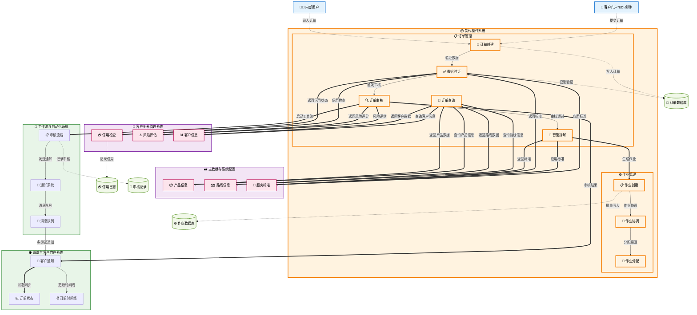

# 订单管理 (Order Management)

## 💡 新手提示：订单管理核心概念

在开始阅读订单管理功能前，请先理解以下关键概念：

*   **订单**：客户的运输需求，是整个业务的起点
*   **订单拆解**：将一个订单分解为多个具体的执行任务（作业）
*   **作业**：由订单拆解产生的具体执行任务，如订舱、报关、运输、仓储等
*   **业务规则**：系统根据预设规则自动进行订单拆解和任务分配

### 订单生命周期
- **草稿**：订单创建但未提交
- **待审核**：已提交等待审核
- **已确认**：审核通过，进入执行阶段
- **执行中**：订单正在处理
- **已完成**：订单执行完毕
- **已取消**：订单被取消

### 订单类型

#### A. 综合运输服务类
- **海运出口**：从国内港口出口的海运业务
- **海运进口**：从国外港口进口的海运业务  
- **空运出口**：从国内机场出口的空运业务
- **空运进口**：从国外机场进口的空运业务
- **陆运/公路运输**：包括整车运输(FTL)、零担运输(LTL)
- **铁路运输**：铁路货运服务
- **内陆运输**：港口到内陆目的地的运输
- **多式联运**：结合多种运输方式的综合物流服务

#### B. 单项专业服务类
- **单独报关服务**：客户仅委托报关业务，货物由客户自行运输或委托其他承运商
- **单独仓储服务**：客户仅使用仓储服务，包括货物存储、分拣、包装等增值服务
- **单证代理服务**：仅提供单证制作、审核、递交等文档处理服务
- **保险代理服务**：仅提供货运保险的咨询、投保、理赔等代理服务
- **咨询服务**：提供贸易合规咨询、物流方案设计、成本优化等专业咨询服务

> **💡 业务说明**：单项专业服务类订单通常具有以下特点：
> - 服务范围明确，不涉及货物运输
> - 可与其他服务商的服务组合使用
> - 计费方式多样化（按票计费、按时间计费、按价值比例计费等）
> - 需要与客户签署专门的服务协议

## 功能概述

订单管理是整个货代操作的起点，负责接收、处理和管理客户的运输服务需求和单项专业服务需求。系统支持多种订单来源（客户门户、EDI、邮件、电话等），提供智能订单拆解功能，自动生成内部作业任务。

**🔍 业务价值说明**：

*   **标准化接单**：统一的订单格式和流程，减少人工错误
*   **智能验证**：自动检查订单信息完整性和合规性
*   **风险控制**：集成信用检查和风险评估机制
*   **高效拆解**：根据业务规则自动生成作业清单
*   **服务多样化**：支持综合运输服务和单项专业服务的统一管理
*   **灵活计费**：支持不同服务类型的多样化计费模式

**核心功能模块**：

*   **订单创建与编辑**：支持多渠道订单录入和修改，涵盖运输服务和单项服务
*   **订单审核与风险控制**：自动化审核流程和风险评估
*   **智能订单拆解**：基于规则引擎的自动拆解，支持复合服务和单项服务
*   **订单查询与跟踪**：全方位的订单信息查询和状态跟踪

> **💡 单项服务特色功能**：
> - **独立服务管理**：单独报关、仓储等服务可独立管理，不依赖运输环节
> - **灵活服务组合**：客户可根据需要选择单项或组合服务
> - **专业化流程**：针对不同单项服务设计专门的业务流程和SLA标准
> - **成本透明化**：单项服务的成本和收费更加透明，便于客户理解和接受

## 菜单结构

    订单管理
    ├── 订单列表                    # 显示所有订单的汇总信息
    ├── 新建订单                    # 创建新的运输订单
    ├── 订单查询                    # 多条件搜索和筛选订单
    ├── 订单审核                    # 对订单进行审核和风险评估
    ├── 订单拆解                    # 将订单分解为具体作业任务
    ├── 拆解规则配置                # 配置订单拆解的业务规则
    └── 订单统计报表                # 订单相关的统计分析报表


## 订单管理数据流转图



## 页面原型设计

### 📋 订单列表页面

    +------------------------------------------------------------------+
    |  订单管理 > 订单列表                      [新建订单] [批量操作] [导出] |
    +------------------------------------------------------------------+
    | 搜索条件：                                                        |
    | 订单号：[________] 客户：[________] 业务员：[________]              |
    | 服务分类：[全部 ▼] 订单类型：[全部 ▼] 状态：[全部 ▼]              |
    | 日期范围：[开始日期] 至 [结束日期]                  [搜索] [重置]   |
    +------------------------------------------------------------------+
    | 订单号   | 客户名称 | 服务分类 | 订单类型   | 服务内容    | 状态  | 金额   | 操作 |
    |---------|---------|---------|-----------|------------|-------|-------|------|
    | ORD-001 | ABC公司  | 综合运输 | 海运出口   | 上海→洛杉矶 | 已确认 | 15,000| [详情][编辑][拆解] |
    | ORD-002 | XYZ公司  | 综合运输 | 空运进口   | 法兰克福→北京| 草稿  | 8,500 | [详情][编辑][删除] |
    | ORD-003 | DEF公司  | 单项服务 | 单独报关   | 出口报关服务 | 执行中 | 2,800 | [详情][编辑][跟踪] |
    | ORD-004 | GHI公司  | 单项服务 | 仓储+报关  | 保税仓储30天 | 已确认 | 5,200 | [详情][编辑][拆解] |
    | ORD-005 | JKL公司  | 单项服务 | 单证代理   | 提单制作    | 完成  | 800   | [详情][归档][复制] |
    +------------------------------------------------------------------+
    | 共 156 条记录，第 1/16 页        [首页][上页][下页][末页]          |
    +------------------------------------------------------------------+
    
    <!-- 快速筛选标签 -->
    | 快速筛选：[全部(156)] [综合运输(89)] [单项服务(67)]              |
    |          [待审核(12)] [执行中(45)] [已完成(78)] [异常(3)]        |
    +------------------------------------------------------------------+

### 🆕 新建订单页面（完整版）

    +------------------------------------------------------------------+
    |  订单管理 > 新建订单                          [保存草稿] [预览] [提交] |
    +------------------------------------------------------------------+
    | 🔹 服务选择                                                       |
    | 服务分类：(*) 综合运输服务 ( ) 单项专业服务                        |
    | 订单类型：[请先选择服务分类_________________▼]                     |
    +------------------------------------------------------------------+
    
    <!-- 综合运输服务区域 -->
    | 🚢 综合运输服务配置（当选择"综合运输服务"时显示）                   |
    | 运输类型：(*) 海运出口 ( ) 海运进口 ( ) 空运出口 ( ) 空运进口       |
    |          ( ) 陆运运输 ( ) 铁路运输 ( ) 内陆运输 ( ) 多式联运       |
    | 路线信息：起运地 [上海港___________] → 目的地 [洛杉矶港__________] |
    | 时间安排：预计发货 [2024-03-20] 要求到货 [2024-04-15]            |
    +------------------------------------------------------------------+
    
    <!-- 单项专业服务区域 -->
    | 🎯 单项专业服务配置（当选择"单项专业服务"时显示）                   |
    | 服务类型：[ ] 单独报关 [ ] 单独仓储 [ ] 单证代理                   |
    |          [ ] 保险代理 [ ] 咨询服务                               |
    | 服务地点：[上海保税区仓库___________] [选择地点]                   |
    | 服务时间：开始日期 [2024-03-20] 预计完成 [2024-03-25]            |
    +------------------------------------------------------------------+
    
    | 👤 客户信息                                                       |
    | 客户名称：[下拉选择客户________________] [新增客户] [客户详情]       |
    | 联系人：[张经理_______] 电话：[138****8888] 邮箱：[zhang@abc.com] |
    | 贸易条款：[FOB ▼] 货币：[USD ▼] 信用额度：[500,000] 可用：[320,000]|
    +------------------------------------------------------------------+
    
    | 📦 货物信息                                                       |
    | 货物品名：[电子产品________________________] HS编码：[8543709990] |
    | 重量：[5,000] KG 体积：[20] CBM 件数：[100] 货值：[100,000] USD  |
    | 包装方式：[纸箱 ▼] 包装要求：[易碎品，需要防震包装_______________] |
    | 危险品：( ) 是 (*) 否  温控要求：( ) 冷藏 ( ) 冷冻 (*) 常温       |
    +------------------------------------------------------------------+
    
    <!-- 单项专业服务详细配置 -->
    | 📋 单独报关服务（当选择"单独报关"时显示）                          |
    | 报关类型：(*) 出口报关 ( ) 进口报关 ( ) 转关报关                  |
    | 贸易方式：[一般贸易 ▼] 征免性质：[一般征税 ▼]                    |
    | 申报要素：[品牌类型:无品牌;出口享惠情况:无___________________]     |
    | 单证要求：[√] 发票 [√] 装箱单 [√] 合同 [ ] 许可证 [ ] 3C证书    |
    +------------------------------------------------------------------+
    
    | 🏪 单独仓储服务（当选择"单独仓储"时显示）                          |
    | 仓储类型：(*) 保税仓储 ( ) 普通仓储 ( ) 监管仓储                  |
    | 仓库选择：[上海保税区A仓库_____________] [查看仓库详情]            |
    | 存储期限：[30] 天  存储面积：[100] 平方米                        |
    | 增值服务：[√] 分拣 [√] 包装 [ ] 贴标 [ ] 质检                   |
    +------------------------------------------------------------------+
    
    | 📄 单证代理服务（当选择"单证代理"时显示）                          |
    | 单证类型：[√] 提单制作 [√] 发票制作 [ ] 保险单 [ ] 原产地证       |
    | 交付方式：(*) 电子版 ( ) 纸质版 ( ) 电子+纸质                    |
    | 特殊要求：[提单需要显示唛头信息_________________________]        |
    +------------------------------------------------------------------+
    
    | 🛡️ 保险代理服务（当选择"保险代理"时显示）                         |
    | 保险类型：(*) 货物运输险 ( ) 仓储险 ( ) 责任险                   |
    | 保险金额：[100,000] USD  费率：[0.3%] 保费：[300] USD          |
    | 保险条款：[ICC(A) ▼] 免赔额：[500] USD                         |
    +------------------------------------------------------------------+
    
    | 💼 咨询服务（当选择"咨询服务"时显示）                             |
    | 咨询类型：[√] 贸易合规 [ ] 税务筹划 [ ] 供应链优化               |
    | 服务形式：(*) 在线咨询 ( ) 现场服务 ( ) 报告提供                 |
    | 预计工时：[8] 小时  服务费率：[500] USD/小时                     |
    +------------------------------------------------------------------+
    
    | 🔄 服务组合配置（支持多选服务时显示）                             |
    | 已选服务：                                                      |
    | ┌─────────────────────────────────────────────────────────┐   |
    | │ 1. 单独报关 - 出口报关服务        预估费用：2,800 USD      │   |
    | │ 2. 单独仓储 - 保税仓储30天        预估费用：3,000 USD      │   |
    | │ 3. 保险代理 - 货物运输险          预估费用：300 USD        │   |
    | └─────────────────────────────────────────────────────────┘   |
    | 服务总计：6,100 USD  [重新计算] [服务优化建议]                   |
    +------------------------------------------------------------------+
    
    | 💰 费用信息                                                      |
    | 计费方式：(*) 固定费用 ( ) 按比例 ( ) 按工时 ( ) 组合计费         |
    | 预估总费用：[6,100] USD  币种：[USD ▼]                          |
    | 付款条件：[预付50% ▼] 信用期：[30] 天                           |
    | 费用明细：[查看详细报价] [费用对比] [历史价格]                    |
    +------------------------------------------------------------------+
    
    | 📝 备注信息                                                      |
    | 特殊要求：[客户要求加急处理，需要在3个工作日内完成报关手续_______] |
    | 内部备注：[客户为VIP客户，优先处理_____________________________] |
    | 风险提示：[货物涉及3C认证，需要提前准备相关证书________________] |
    +------------------------------------------------------------------+
    
    | 📋 表单验证与交互逻辑                                            |
    | 1. 服务分类选择后，动态显示对应的配置区域                         |
    | 2. 单项服务支持多选，自动计算组合费用                            |
    | 3. 必填字段验证：                                               |
    |    - 综合运输：客户、货物、路线信息为必填                        |
    |    - 单项服务：客户、服务类型、服务地点为必填                    |
    | 4. 智能提示：根据历史数据提供费用预估和服务建议                   |
    +------------------------------------------------------------------+

### 订单查询页面

    +----------------------------------------------------------+
    |  订单管理 > 订单查询                          [高级搜索] [导出] |
    +----------------------------------------------------------+
    | 快速搜索：                                                  |
    | 订单号：[ORD-20240315-001_______] [搜索]                   |
    +----------------------------------------------------------+
    | 高级搜索条件：                                              |
    | 客户名称：[ABC公司______________] 业务员：[销售小李_______]  |
    | 订单类型：[海运出口 ▼] 订单状态：[已确认 ▼]                |
    | 创建日期：[2024-03-01] 至 [2024-03-31]                    |
    | 起运地：[上海港_____________] 目的地：[洛杉矶港____________] |
    | 货物品名：[电子产品____________] HS编码：[8543709990______] |
    |                                           [搜索] [重置] |
    +----------------------------------------------------------+
    | 搜索结果：                                                  |
    | 订单号     | 客户名称 | 业务员 | 订单类型 | 状态 | 创建日期 | 操作 |
    |-----------|---------|-------|---------|------|---------|------|
    | ORD-001   | ABC公司  | 小李   | 海运出口 | 已确认| 03-15   | [详情][跟踪] |
    | ORD-002   | XYZ公司  | 小王   | 空运进口 | 执行中| 03-16   | [详情][跟踪] |
    +----------------------------------------------------------+
    | 共找到 25 条记录，第 1/3 页      [首页][上页][下页][末页]    |
    +----------------------------------------------------------+

### 🎯 单项服务管理页面

    +------------------------------------------------------------------+
    |  订单管理 > 单项服务管理                  [新建服务] [批量操作] [导出] |
    +------------------------------------------------------------------+
    | 服务筛选：                                                        |
    | 服务类型：[全部 ▼] 服务状态：[全部 ▼] 客户：[全部客户__________]   |
    | 服务地点：[全部地点__________] 日期范围：[开始] 至 [结束] [筛选]    |
    +------------------------------------------------------------------+
    | 服务ID  | 客户名称 | 服务类型 | 服务内容      | 状态   | 费用   | 操作    |
    |---------|---------|---------|--------------|-------|-------|---------|
    | SRV-001 | ABC公司  | 单独报关 | 出口报关服务  | 进行中 | 2,800 | [详情][编辑] |
    | SRV-002 | DEF公司  | 单独仓储 | 保税仓储30天  | 已完成 | 3,000 | [详情][结算] |
    | SRV-003 | GHI公司  | 单证代理 | 提单制作     | 待开始 | 500   | [详情][开始] |
    | SRV-004 | JKL公司  | 保险代理 | 货物运输险   | 已完成 | 300   | [详情][归档] |
    +------------------------------------------------------------------+
    
### 🔧 服务配置管理页面

    +------------------------------------------------------------------+
    |  系统管理 > 服务配置                      [新增配置] [批量导入] [导出] |
    +------------------------------------------------------------------+
    | 配置分类：                                                        |
    | [报关配置] [仓储配置] [单证配置] [保险配置] [咨询配置]              |
    +------------------------------------------------------------------+
    
    <!-- 报关配置示例 -->
    | 📋 报关服务配置                                                   |
    | 配置名称：[标准出口报关配置_________________] 状态：[启用 ▼]       |
    | 适用范围：[√] 一般贸易 [√] 加工贸易 [ ] 保税贸易                  |
    | 基础费用：[2,000] USD  加急费用：[500] USD                       |
    | 必需单证：[√] 发票 [√] 装箱单 [√] 合同 [√] 报关委托书             |
    | 可选单证：[ ] 许可证 [ ] 3C证书 [ ] 原产地证                     |
    | 处理时效：标准：[3] 工作日  加急：[1] 工作日                      |
    | 适用港口：[上海港] [宁波港] [青岛港] [深圳港]                     |
    +------------------------------------------------------------------+
    
    | 🏪 仓储服务配置                                                   |
    | 配置名称：[标准保税仓储配置_________________] 状态：[启用 ▼]       |
    | 仓库类型：(*) 保税仓库 ( ) 普通仓库 ( ) 监管仓库                  |
    | 计费方式：(*) 按天计费 ( ) 按面积计费 ( ) 按货值计费              |
    | 基础费用：[100] USD/天  面积费用：[5] USD/平方米/天               |
    | 增值服务：分拣：[50] USD  包装：[30] USD  贴标：[20] USD         |
    | 免费期限：[7] 天  超期费率：[150%]                               |
    +------------------------------------------------------------------+
    
### 📊 服务组合模板页面

    +------------------------------------------------------------------+
    |  订单管理 > 服务组合模板                  [新建模板] [批量操作] [导出] |
    +------------------------------------------------------------------+
    | 模板筛选：                                                        |
    | 模板名称：[搜索模板名称__________] 适用场景：[全部 ▼] [搜索] [重置] |
    +------------------------------------------------------------------+
    | 模板ID | 模板名称        | 包含服务           | 适用场景 | 使用次数 | 操作 |
    |--------|----------------|-------------------|---------|---------|------|
    | TPL-01 | 标准进口套餐    | 报关+仓储+保险     | 进口贸易 | 156     | [详情][编辑][复制] |
    | TPL-02 | 出口全程服务    | 报关+单证+保险     | 出口贸易 | 89      | [详情][编辑][停用] |
    | TPL-03 | 仓储增值服务    | 仓储+分拣+包装     | 电商物流 | 234     | [详情][编辑][复制] |
    +------------------------------------------------------------------+
    
    | 📋 模板详情（标准进口套餐）                                        |
    | 模板名称：[标准进口套餐___________________] 状态：[启用 ▼]        |
    | 适用场景：[进口贸易] 推荐客户：[一般客户] 优惠等级：[标准]         |
    | 包含服务：                                                       |
    | ┌─────────────────────────────────────────────────────────┐    |
    | │ 1. 进口报关服务    基础费用：3,000 USD  时效：3工作日      │    |
    | │ 2. 保税仓储服务    费用：150 USD/天     免费期：7天        │    |
    | │ 3. 货物运输险      费率：0.3%          最低保费：200 USD   │    |
    | └─────────────────────────────────────────────────────────┘    |
    | 套餐优惠：总费用9.5折  VIP客户9折                                |
    | 服务承诺：[√] 全程跟踪 [√] 异常预警 [√] 专人服务                 |
    +------------------------------------------------------------------+

### 📈 服务绩效分析页面

    +------------------------------------------------------------------+
    |  报表分析 > 服务绩效分析                  [自定义报表] [导出] [打印] |
    +------------------------------------------------------------------+
    | 分析维度：                                                        |
    | 时间范围：[2024-03-01] 至 [2024-03-31] 服务类型：[全部 ▼]        |
    | 客户分组：[全部 ▼] 业务员：[全部 ▼]              [生成报表] [重置] |
    +------------------------------------------------------------------+
    | 服务类型统计：                                                    |
    | ┌─────────────────────────────────────────────────────────┐    |
    | │ 单独报关：156单  收入：436,800 USD  平均时效：2.8天        │    |
    | │ 单独仓储：89单   收入：267,000 USD  平均时效：15天         │    |
    | │ 单证代理：234单  收入：117,000 USD  平均时效：1.5天        │    |
    | │ 保险代理：178单  收入：53,400 USD   平均时效：0.5天        │    |
    | │ 咨询服务：45单   收入：225,000 USD  平均时效：5天          │    |
    | └─────────────────────────────────────────────────────────┘    |
    | 总计：702单  总收入：1,099,200 USD  平均客单价：1,566 USD        |
    +------------------------------------------------------------------+
    
    | 客户满意度分析：                                                  |
    | 整体满意度：★★★★☆ (4.2/5.0)  响应及时性：★★★★★ (4.8/5.0)      |
    | 服务质量：★★★★☆ (4.1/5.0)    价格合理性：★★★☆☆ (3.8/5.0)      |
    | 改进建议：[查看详细反馈] [客户投诉处理] [服务优化建议]             |
    +------------------------------------------------------------------+

### 订单审核页面

    +----------------------------------------------------------+
    |  订单管理 > 订单审核                          [批量审核] [导出] |
    +----------------------------------------------------------+
    | 待审核订单筛选：                                            |
    | 提交日期：[2024-03-15] 至 [2024-03-20]                    |
    | 客户等级：[VIP客户 ▼] 订单金额：[≥50000] USD              |
    | 业务员：[全部 ▼] 紧急程度：[普通 ▼]          [筛选] [重置] |
    +----------------------------------------------------------+
    | 待审核订单列表：                                            |
    | [√] | 订单号 | 客户名称 | 订单金额 | 提交人 | 提交时间 | 操作 |
    |-----|-------|---------|---------|-------|---------|------|
    | [√] | ORD-003| DEF公司 | 85,000  | 小张   | 03-18 10:30| [审核] |
    | [ ] | ORD-004| GHI公司 | 120,000 | 小李   | 03-18 14:20| [审核] |
    +----------------------------------------------------------+
    | 订单详情（ORD-003）：                                       |
    | 客户：DEF公司 | 联系人：张经理 | 信用额度：500,000 USD      |
    | 已用额度：320,000 USD | 可用额度：180,000 USD             |
    | 货物：机械设备 | 重量：8,500 KG | 体积：45 CBM              |
    | 路线：青岛港 → 汉堡港 | 要求ETD：2024-03-25               |
    +----------------------------------------------------------+
    | 审核意见：                                                  |
    | 审核结果：(*) 通过 ( ) 驳回 ( ) 需补充资料                  |
    | 审核备注：[客户信用良好，货物信息完整，可以通过_____________] |
    |                                           [提交审核] [取消] |
    +----------------------------------------------------------+

### 订单拆解页面

    +----------------------------------------------------------+
    |  订单管理 > 订单拆解                          [批量拆解] [规则管理] |
    +----------------------------------------------------------+
    | 待拆解订单：                                                |
    | 订单号：ORD-20240315-001 | 客户：ABC公司 | 状态：已确认     |
    | 订单类型：海运出口 | 路线：上海港 → 洛杉矶港                |
    +----------------------------------------------------------+
    | 拆解规则选择：                                              |
    | 适用规则：[√] 海运出口标准流程                              |
    |          [√] 门到门服务流程                                |
    |          [ ] 危险品处理流程                                |
    |          [√] 保险服务流程                                  |
    +----------------------------------------------------------+
    | 预览拆解结果：                                              |
    | 序号 | 作业类型 | 作业名称     | 预计工期 | 负责部门 | 优先级 |
    |------|---------|-------------|---------|---------|-------|
    | 1    | 货运作业 | 海运出口运输 | 30天     | 海运部   | 高    |
    | 2    | 报关作业 | 出口报关     | 3天      | 报关部   | 高    |
    | 3    | 仓储作业 | 货物装箱     | 2天      | 仓储部   | 中    |
    | 4    | 保险作业 | 货物保险     | 1天      | 客服部   | 低    |
    +----------------------------------------------------------+
    | 拆解参数调整：                                              |
    | 总工期：[35] 天 | 开始日期：[2024-03-20]                   |
    | 特殊要求：[易碎品需要特殊包装处理___________________]        |
    |                                           [执行拆解] [取消] |
    +----------------------------------------------------------+

### 拆解规则配置页面

    +----------------------------------------------------------+
    |  订单管理 > 拆解规则配置                      [新建规则] [导入] |
    +----------------------------------------------------------+
    | 规则列表：                                                  |
    | 规则名称         | 适用类型 | 状态 | 最后修改 | 操作        |
    |-----------------|---------|------|---------|-------------|
    | 海运出口标准流程  | 海运出口 | 启用 | 03-15   | [编辑][复制][停用] |
    | 空运进口快速流程  | 空运进口 | 启用 | 03-10   | [编辑][复制][停用] |
    | 危险品处理流程   | 全部     | 启用 | 03-08   | [编辑][复制][停用] |
    +----------------------------------------------------------+
    | 规则详情（海运出口标准流程）：                               |
    | 规则名称：[海运出口标准流程_______________]                  |
    | 适用条件：订单类型 = 海运出口                               |
    | 生成作业：                                                  |
    | 1. 货运作业（必须）| 负责部门：海运部 | 工期：30天 | 优先级：高 |
    | 2. 报关作业（必须）| 负责部门：报关部 | 工期：3天  | 优先级：高 |
    | 3. 仓储作业（可选）| 负责部门：仓储部 | 工期：2天  | 优先级：中 |
    +----------------------------------------------------------+
    | 条件设置：                                                  |
    | IF 订单类型 = "海运出口" AND 贸易条款 = "FOB"               |
    | THEN 生成作业：货运作业 + 报关作业                          |
    | IF 服务要求包含"门到门" THEN 添加作业：仓储作业 + 配送作业   |
    |                                           [保存] [测试] [取消] |
    +----------------------------------------------------------+

### 订单统计报表页面

    +----------------------------------------------------------+
    |  订单管理 > 订单统计报表                      [自定义报表] [导出] |
    +----------------------------------------------------------+
    | 报表筛选条件：                                              |
    | 统计周期：(*) 本月 ( ) 本季度 ( ) 本年度 ( ) 自定义        |
    | 自定义时间：[2024-03-01] 至 [2024-03-31]                  |
    | 业务类型：[全部 ▼] 客户类型：[全部 ▼] 业务员：[全部 ▼]     |
    |                                           [生成报表] [重置] |
    +----------------------------------------------------------+
    | 订单概况统计：                                              |
    | +----------------+----------------+----------------+       |
    | | 总订单数       | 已完成订单     | 进行中订单     |       |
    | | 156 单         | 89 单 (57%)    | 45 单 (29%)    |       |
    | +----------------+----------------+----------------+       |
    | | 总金额         | 平均订单金额   | 客户满意度     |       |
    | | $2,580,000     | $16,538        | 4.8/5.0        |       |
    | +----------------+----------------+----------------+       |
    +----------------------------------------------------------+
    | 订单趋势分析：                                              |
    | [订单数量趋势图 - 折线图显示每日订单数量变化]                |
    | [订单金额分布 - 柱状图显示不同金额区间的订单分布]            |
    +----------------------------------------------------------+
    | 业务类型分析：                                              |
    | 业务类型   | 订单数量 | 占比   | 总金额      | 平均金额    |
    |-----------|---------|-------|-------------|-------------|
    | 海运出口   | 78      | 50%   | $1,560,000  | $20,000     |
    | 海运进口   | 35      | 22%   | $580,000    | $16,571     |
    | 空运出口   | 28      | 18%   | $320,000    | $11,429     |
    | 空运进口   | 15      | 10%   | $120,000    | $8,000      |
    +----------------------------------------------------------+
    | 客户排行榜：                                                |
    | 排名 | 客户名称    | 订单数量 | 订单金额    | 增长率      |
    |------|-----------|---------|-------------|-------------|
    | 1    | ABC公司    | 25      | $520,000    | +15%        |
    | 2    | XYZ公司    | 18      | $380,000    | +8%         |
    | 3    | DEF公司    | 15      | $290,000    | +22%        |
    +----------------------------------------------------------+

### 📄 订单详情页面（增强版）

    +------------------------------------------------------------------+
    |  订单管理 > 订单详情 > ORD-20240315-001           [编辑] [复制] [删除] |
    +------------------------------------------------------------------+
    | 📊 订单概览                                                       |
    | 订单号：ORD-20240315-001  状态：[执行中]  创建时间：2024-03-15 10:30 |
    | 服务分类：单项专业服务    订单类型：仓储+报关组合                    |
    | 客户：ABC贸易公司        业务员：张经理    预计完成：2024-03-25      |
    | 订单金额：5,800 USD      已付款：2,900 USD  待付款：2,900 USD      |
    +------------------------------------------------------------------+
    
    | 👤 客户信息                                                       |
    | 客户名称：ABC贸易公司           客户等级：VIP                      |
    | 联系人：李总                   电话：138-0000-8888                |
    | 邮箱：li@abc-trade.com        地址：上海市浦东新区张江高科技园区     |
    | 信用额度：500,000 USD         已用额度：320,000 USD              |
    | 可用额度：180,000 USD         信用状态：良好                      |
    +------------------------------------------------------------------+
    
    <!-- 综合运输服务详情 -->
    | 🚢 综合运输服务详情（当为综合运输订单时显示）                        |
    | 运输类型：海运出口             贸易条款：FOB 上海                   |
    | 起运地：上海港                目的地：洛杉矶港                      |
    | 预计发货：2024-03-20          要求到货：2024-04-15                |
    | 货物信息：电子产品 5,000KG 20CBM  货值：100,000 USD              |
    | 包装要求：易碎品防震包装       危险品：否                          |
    +------------------------------------------------------------------+
    
    <!-- 单项专业服务详情 -->
    | 🎯 单项专业服务详情（当为单项服务订单时显示）                        |
    | 服务组合：仓储服务 + 报关服务                                      |
    | 服务地点：上海保税区A仓库      服务周期：2024-03-15 至 2024-03-25   |
    | 
    | 📋 报关服务详情：                                                 |
    | 报关类型：出口报关            贸易方式：一般贸易                    |
    | 征免性质：一般征税            申报要素：品牌类型:无品牌;出口享惠情况:无 |
    | 必需单证：✓发票 ✓装箱单 ✓合同 ✓报关委托书                        |
    | 处理状态：已受理              预计完成：2024-03-18                 |
    | 服务费用：2,800 USD          负责人：报关部-王专员                 |
    |                                                                  |
    | 🏪 仓储服务详情：                                                 |
    | 仓储类型：保税仓储            存储期限：30天                       |
    | 存储面积：100平方米           增值服务：✓分拣 ✓包装               |
    | 入库时间：2024-03-16          预计出库：2024-04-15                |
    | 服务费用：3,000 USD          负责人：仓储部-李主管                 |
    +------------------------------------------------------------------+
    
    | 💰 费用明细                                                       |
    | 费用项目              | 单价      | 数量 | 小计      | 状态    |
    |---------------------|----------|------|----------|---------|
    | 出口报关服务         | 2,800    | 1    | 2,800    | 已确认   |
    | 保税仓储服务(30天)   | 100/天   | 30   | 3,000    | 已确认   |
    | 服务组合优惠         | -200     | 1    | -200     | 已应用   |
    | 合计                |          |      | 5,600    |         |
    | 税费(6%)            |          |      | 336      |         |
    | 总计                |          |      | 5,936    |         |
    +------------------------------------------------------------------+
    
    | 📋 服务进度跟踪                                                   |
    | 阶段          | 服务内容     | 开始时间    | 完成时间    | 状态   | 负责人 |
    |--------------|-------------|------------|------------|--------|-------|
    | 1. 订单确认   | 合同签署     | 03-15 10:30| 03-15 14:20| ✓完成  | 张经理 |
    | 2. 货物入库   | 仓储接收     | 03-16 09:00| 03-16 15:30| ✓完成  | 李主管 |
    | 3. 报关申报   | 单证准备     | 03-17 08:00| 03-17 17:00| ✓完成  | 王专员 |
    | 4. 海关审核   | 报关审核     | 03-18 09:00| 进行中      | 🔄进行中| 王专员 |
    | 5. 货物分拣   | 仓储作业     | 待开始      | 待开始      | ⏳待开始| 李主管 |
    | 6. 货物出库   | 完成交付     | 待开始      | 待开始      | ⏳待开始| 李主管 |
    +------------------------------------------------------------------+
    
    | 📞 沟通记录                                                       |
    | 时间        | 沟通方式 | 参与人员      | 内容摘要                | 操作   |
    |------------|---------|--------------|------------------------|--------|
    | 03-15 11:00| 电话     | 张经理↔李总   | 确认服务需求和时间安排    | [详情] |
    | 03-16 14:30| 邮件     | 李主管→李总   | 货物入库确认通知         | [详情] |
    | 03-17 16:45| 微信     | 王专员↔李总   | 报关单证补充说明         | [详情] |
    | 03-18 09:15| 电话     | 张经理↔李总   | 进度汇报和后续安排       | [详情] |
    +------------------------------------------------------------------+
    
    | 📎 相关文档                                                       |
    | 文档类型     | 文档名称              | 上传时间    | 大小   | 操作      |
    |-------------|---------------------|------------|--------|----------|
    | 合同文件     | 服务合同-ABC公司.pdf   | 03-15 14:20| 2.3MB  | [下载][预览] |
    | 发票         | 商业发票-INV001.pdf   | 03-16 10:30| 856KB  | [下载][预览] |
    | 装箱单       | 装箱单-PKL001.pdf     | 03-16 10:35| 445KB  | [下载][预览] |
    | 报关委托书   | 报关委托书-ABC.pdf     | 03-17 08:15| 1.2MB  | [下载][预览] |
    | 入库单       | 入库单-WH001.pdf      | 03-16 15:45| 678KB  | [下载][预览] |
    +------------------------------------------------------------------+
    
    | 🔔 异常预警                                                       |
    | 预警类型 | 预警内容                    | 风险等级 | 预警时间    | 处理状态 |
    |---------|---------------------------|---------|------------|---------|
    | 时效预警 | 报关审核超过预期时间1天      | 中等     | 03-18 18:00| 已关注   |
    | 费用预警 | 仓储费用可能超出预算200USD   | 低等     | 03-17 12:00| 已处理   |
    +------------------------------------------------------------------+
    
    | 📊 服务评价                                                       |
    | 评价维度     | 客户评分 | 客户反馈                        | 改进建议     |
    |-------------|---------|-------------------------------|-------------|
    | 服务质量     | ★★★★☆   | 报关服务专业，响应及时           | 继续保持     |
    | 沟通效率     | ★★★★★   | 沟通顺畅，信息透明              | 无           |
    | 价格合理性   | ★★★☆☆   | 价格偏高，希望有更多优惠         | 考虑VIP折扣  |
    | 整体满意度   | ★★★★☆   | 总体满意，会继续合作            | 优化定价策略 |
    +------------------------------------------------------------------+

## 业务流程

### 💡 新手提示：业务流程阅读指南

以下业务流程描述了订单从创建到完成的完整生命周期。每个步骤都包含：

*   **业务动作**：具体要执行的操作
*   **系统交互**：涉及的系统间调用和数据传递
*   **决策点**：需要人工判断或系统自动判断的关键节点
*   **异常处理**：可能出现的问题和解决方案

### 📋 订单创建流程

1.  **订单录入**：用户通过系统界面、客户门户、EDI接口、邮件等方式创建订单
    > **新手说明**：这是整个业务的起点，客户可以通过多种方式提交运输需求
    *   **🔗 跨系统触发**：客户跟踪与客户门户 → 货代操作 **【写入数据】**
        *   **调用方式**：RESTful API (POST /api/order/create)
        *   **调用时机**：客户在跟踪与客户门户提交订单后立即触发
        *   **数据操作**：
            *   **数据写入**：向货代操作的 orders (订单主表) 表写入新订单记录
            *   **数据存储**：在货代操作的 order_details (订单详情表) 表中存储订单详细信息
            *   **数据关联**：在货代操作的 customer_orders (客户订单关联表) 表中建立客户与订单的关联关系
        *   **入参**：`{customer_id, order_info, contact_details, service_requirements}`
            *   `customer_id` (客户ID): string，客户在系统中的唯一标识符，用于关联客户基础信息
            *   `order_info` (订单信息): object，包含货物详情、运输路线、服务类型等核心订单数据
            *   `contact_details` (联系信息): object，发货人、收货人的详细联系方式和地址信息
            *   `service_requirements` (服务需求): object，客户特殊要求，如时效要求、包装要求、保险需求等
        *   **出参**：`{order_no, status, validation_result, estimated_cost}`
            *   `order_no` (订单号): string，系统生成的唯一订单编号，用于后续跟踪和管理
            *   `status` (订单状态): enum (待审核/已确认/处理中)，订单当前处理状态
            *   `validation_result` (验证结果): object，订单信息完整性和合规性检查结果
            *   `estimated_cost` (预估费用): object，基于订单信息计算的初步费用估算和币种信息

2.  **数据验证**：系统自动验证订单信息完整性和准确性
    > **新手说明**：系统会检查必填字段、数据格式、业务规则等，确保订单信息准确无误
    *   **系统内流转**：订单数据完整性校验

3.  **信用检查**：对新客户或超信用额度的订单进行信用审核
    > **新手说明**：这是风险控制的重要环节，防止坏账和信用风险
    *   **🔗 跨系统触发**：货代操作 → 客户关系管理 **【查询数据】**
        *   **调用方式**：RESTful API (POST /api/customer/credit-check)
        *   **调用时机**：订单验证通过后，系统自动判断是否需要信用检查
        *   **数据操作**：
            *   **数据读取**：从客户关系管理的 customer_credit (客户信用表) 表、credit_history (信用历史表) 表读取客户信用记录和历史数据
            *   **数据写入**：向客户关系管理的 credit_check_logs (信用检查日志表) 表写入本次信用检查记录
            *   **数据更新**：更新客户关系管理的 customer_risk_profile (客户风险档案表) 表中的风险评估结果
            *   **数据计算**：在客户关系管理的 risk_calculation_engine (风险计算引擎表) 中执行风险评估算法
        *   **入参**：`{customer_id, order_amount, credit_check_type}`
            *   `customer_id` (客户ID): string，需要进行信用检查的客户唯一标识符
            *   `order_amount` (订单金额): decimal，本次订单的总金额，用于评估信用风险
            *   `credit_check_type` (检查类型): enum (标准检查/深度检查/快速检查)，信用检查级别
        *   **出参**：`{credit_status, available_limit, risk_level, approval_required}`
            *   `credit_status` (信用状态): enum (良好/一般/风险/黑名单)，客户当前信用状况
            *   `available_limit` (可用额度): decimal，客户剩余可用信用额度
            *   `risk_level` (风险等级): enum (低/中/高)，本次交易的风险评级
            *   `approval_required` (需要审批): boolean，是否需要人工审批标识

4.  **订单确认**：审核通过后，订单状态更新为"已确认"
    > **新手说明**：这标志着订单正式进入执行阶段，系统会通知客户并开始后续作业安排
    *   **🔗 跨系统触发**：货代操作 → 客户跟踪与客户门户 **【写入数据】**
        *   **调用方式**：RESTful API (POST /api/customer/order-confirmation)
        *   **调用时机**：订单通过所有验证和审核后自动触发
        *   **数据操作**：
            *   **数据读取**：从货代操作的 orders (订单主表) 表读取订单确认信息
            *   **数据写入**：向客户跟踪与客户门户的 order_status_updates (订单状态更新表) 表写入状态更新记录
            *   **数据更新**：更新客户跟踪与客户门户的 customer_notifications (客户通知表) 表中的通知状态
            *   **数据同步**：在客户跟踪与客户门户的 order_timeline (订单时间线表) 表中同步订单时间线信息
        *   **入参**：`{order_no, confirmation_status, estimated_timeline}`
            *   `order_no` (订单号): string，已确认订单的唯一编号
            *   `confirmation_status` (确认状态): enum (已确认/待补充资料/已拒绝)，订单确认结果
            *   `estimated_timeline` (预估时间线): object，订单各阶段的预计完成时间安排
        *   **出参**：`{notification_sent, customer_acknowledged}`
            *   `notification_sent` (通知发送状态): boolean，确认通知是否成功发送给客户
            *   `customer_acknowledged` (客户确认状态): boolean，客户是否已查看并确认收到通知

5.  **智能拆解**：系统根据预设规则自动拆解订单，生成内部作业并统一写入作业管理系统
    > **新手说明**：这是货代业务的核心环节，将客户的运输需求分解为具体的执行任务，如订舱、报关、运输、仓储等，所有作业统一由作业管理系统进行调度分配
    
    **🔄 完整拆解流程**：订单确认后，系统根据业务类型、服务范围、货物特性等因素，智能生成多类作业任务并统一写入作业管理系统，由作业管理系统负责后续的分配和调度
    
    *   **🔄 系统内流转**：订单管理 → 作业管理 **【写入数据】**
        *   **调用方式**：RESTful API (POST /api/job-management/create-jobs-batch)
        *   **调用时机**：订单确认后立即触发智能拆解，生成所有作业并统一写入作业管理
        *   **数据操作**：
            *   **数据读取**：从货代操作的 orders (订单主表) 表、order_details (订单详情表) 表、breakdown_rules (拆解规则表) 表读取订单信息和拆解规则
            *   **数据写入**：向作业管理的 jobs (作业主表) 表批量写入多类作业任务
            *   **数据创建**：在作业管理的 job_dependencies (作业依赖关系表) 表中创建作业依赖关系
            *   **数据生成**：在作业管理的 job_coordination_plan (作业协调计划表) 表中生成协调计划
        *   **业务逻辑**：根据订单类型、服务范围、客户要求等智能生成5大类作业任务
        *   **数据格式**：JSON 格式，UTF-8 编码
        *   **入参**：`{order_no, service_scope, customer_requirements, timeline_constraints, breakdown_rules}`
            *   `order_no` (订单号): string，订单唯一标识符
            *   `service_scope` (服务范围): object，包含运输、仓储、通关等服务内容
            *   `customer_requirements` (客户要求): object，特殊处理需求和服务标准
            *   `timeline_constraints` (时间约束): object，各环节的时间要求和截止日期
            *   `breakdown_rules` (拆解规则): object，适用的业务拆解规则和逻辑
        *   **出参**：`{breakdown_id, job_list, coordination_plan, exception_handling}`
            *   `breakdown_id` (拆解ID): string，本次拆解的唯一标识符
            *   `job_list` (作业清单): array，生成的所有作业任务详情，包含5大类作业
            *   `coordination_plan` (协调计划): object，作业间的依赖关系和协调机制
            *   `exception_handling` (异常处理): object，异常情况的处理预案

    **📋 拆解生成的作业类型**：

    1. **订舱作业 (BOOKING_JOB)**
        *   **作业内容**：向船公司/航空公司申请舱位、确认舱位、获取配舱回单
        *   **目标模块**：订舱管理
        *   **包含环节**：舱位申请 → 舱位确认 → 配舱通知 → SO获取
        *   **优先级**：根据船期/航班时效要求确定
        *   **资源需求**：订舱员、承运商关系、舱位资源

    2. **运单作业 (WAYBILL_JOB)**
        *   **作业内容**：制作海运提单/空运单、审核单据信息、签发运输单据
        *   **目标模块**：运单管理
        *   **包含环节**：单据制作 → 信息核对 → 内部审核 → 正式签发
        *   **优先级**：根据开船/起飞时间确定
        *   **资源需求**：单证员、审核员、签章权限

    3. **拖车作业 (TRUCKING_JOB)**
        *   **作业内容**：安排拖车提货、货物运输、送达仓库/场站
        *   **目标系统**：运输管理
        *   **包含环节**：车辆调度 → 提货执行 → 运输跟踪 → 送达确认
        *   **优先级**：根据截关时间和仓库要求确定
        *   **资源需求**：拖车资源、司机、GPS跟踪

    4. **关务作业 (CUSTOMS_JOB)**
        *   **作业内容**：报关报检、合规审查、证书办理、清关跟踪
        *   **目标系统**：关务与合规
        *   **包含环节**：单证准备 → 报关申报 → 查验配合 → 放行确认
        *   **优先级**：根据货物性质和监管要求确定
        *   **资源需求**：报关员、检验机构、政府部门协调

    5. **仓储作业 (WAREHOUSE_JOB)**
        *   **作业内容**：货物收发、存储管理、库内操作、出入库单据
        *   **目标系统**：仓储管理
        *   **包含环节**：入库验收 → 存储管理 → 出库配送 → 库存盘点
        *   **优先级**：根据货物特性和存储要求确定
        *   **资源需求**：仓位、设备、操作人员

    6. **单证作业 (DOCUMENT_JOB)**
        *   **作业内容**：贸易单证制作、审核签发、客户交付
        *   **目标模块**：单证管理
        *   **包含环节**：单证制作 → 内部审核 → 客户确认 → 正式签发
        *   **优先级**：根据贸易条款和客户要求确定
        *   **资源需求**：单证员、审核员、签章权限

### 📋 订单拆解规则

> **新手说明**：拆解规则是预先配置的业务逻辑，系统根据这些规则自动判断需要创建哪些作业任务

*   **根据运输方式（海运/空运/陆运）生成订舱作业**
    > **业务逻辑**：不同运输方式需要向不同承运商申请舱位资源
    *   **🔄 系统内流转**：订单管理 → 作业管理 **【写入数据】**
        *   **调用方式**：RESTful API (POST /api/job/create-booking-job)
        *   **调用时机**：订单拆解时根据运输方式自动触发
        *   **数据操作**：
            *   **数据读取**：从订单管理的 order_breakdown_rules (订单拆解规则表) 表读取运输方式拆解规则
            *   **数据写入**：向作业管理的 jobs (作业主表) 表写入订舱作业记录
            *   **数据分配**：在作业管理的 job_assignments (作业分派表) 表中分配订舱员资源
            *   **数据生成**：在作业管理的 job_priorities (作业优先级表) 表中生成作业优先级
        *   **入参**：
            *   `transport_mode` (string, 必填): 运输模式标识
                *   描述：运输方式类型
                *   枚举值：SEA（海运）、AIR（空运）、LAND（陆运）
                *   示例：`"SEA"`
            *   `route` (object, 必填): 运输路线信息
                *   描述：起始港口/机场到目的港口/机场的具体路线
                *   示例：`{"origin": "CNSHA", "destination": "USLAX", "transit_ports": ["HKHKG"]}`
            *   `cargo_type` (string, 必填): 货物类型
                *   描述：货物分类标识
                *   枚举值：GENERAL（普货）、DANGEROUS（危险品）、REEFER（冷藏货）
                *   示例：`"GENERAL"`
            *   `service_level` (string, 必填): 服务等级
                *   描述：服务标准级别
                *   枚举值：STANDARD（标准）、EXPRESS（加急）、VIP（VIP）
                *   示例：`"STANDARD"`
        *   **出参**：
            *   `booking_job_id` (string): 订舱作业唯一标识
                *   描述：生成的订舱作业ID
                *   示例：`"BJ202401150001"`
            *   `target_system` (string): 目标系统标识
                *   描述：作业分派的目标系统
                *   示例：`"订舱管理"`
            *   `priority_level` (string): 作业优先级
                *   描述：根据服务等级确定的优先级
                *   示例：`"HIGH"`

*   **根据运输单据需求生成运单作业**
    > **业务逻辑**：根据运输方式和贸易条款确定需要制作的运输单据类型
    *   **🔄 系统内流转**：订单管理 → 作业管理 **【写入数据】**
        *   **调用方式**：RESTful API (POST /api/job/create-waybill-job)
        *   **调用时机**：识别到需要运输单据时自动触发
        *   **数据操作**：
            *   **数据读取**：从订单管理的 order_breakdown_rules (订单拆解规则表) 表读取单据类型拆解规则
            *   **数据写入**：向作业管理的 jobs (作业主表) 表写入运单作业记录
            *   **数据关联**：在作业管理的 job_dependencies (作业依赖关系表) 表中建立与订舱作业的依赖关系
        *   **入参**：
            *   `transport_mode` (string, 必填): 运输方式
                *   描述：决定运单类型（海运提单/空运单/陆运单）
                *   示例：`"SEA"`
            *   `trade_terms` (string, 必填): 贸易条款
                *   描述：影响运单签发方式和责任
                *   示例：`"FOB"`
            *   `document_requirements` (array, 必填): 单据要求
                *   描述：客户要求的单据类型和份数
                *   示例：`[{"type": "ORIGINAL_BL", "copies": 3}]`
        *   **出参**：
            *   `waybill_job_id` (string): 运单作业唯一标识
            *   `target_system` (string): 目标系统（运单管理）
            *   `dependency_jobs` (array): 依赖的前置作业

*   **根据货物特性和路线生成拖车作业**
    > **业务逻辑**：需要内陆运输服务时生成拖车调度作业
    *   **🔄 系统内流转**：订单管理 → 作业管理 **【写入数据】**
        *   **调用方式**：RESTful API (POST /api/job/create-trucking-job)
        *   **调用时机**：订单包含内陆运输需求时触发
        *   **数据操作**：
            *   **数据读取**：从订单管理的 order_breakdown_rules (订单拆解规则表) 表读取拖车服务拆解规则
            *   **数据写入**：向作业管理的 jobs (作业主表) 表写入拖车作业记录
            *   **数据分配**：在作业管理的 resource_requirements (资源需求表) 表中记录车辆和司机需求
        *   **入参**：
            *   `pickup_location` (object, 必填): 提货地点
            *   `delivery_location` (object, 必填): 送货地点
            *   `cargo_info` (object, 必填): 货物信息（重量、体积、特殊要求）
            *   `time_requirements` (object, 必填): 时间要求（提货时间、送达时间）
        *   **出参**：
            *   `trucking_job_id` (string): 拖车作业唯一标识
            *   `target_system` (string): 目标系统（运输管理）
            *   `resource_requirements` (object): 资源需求（车型、司机资质等）

*   **根据贸易类型（进口/出口）生成关务作业**
    *   **🔄 系统内流转**：订单管理 → 作业管理 **【写入数据】**
        *   **调用方式**：RESTful API (POST /api/job/create-customs-job)
        *   **调用时机**：识别到需要报关服务时自动触发
        *   **数据操作**：
            *   **数据读取**：从订单管理的 order_breakdown_rules (订单拆解规则表) 表读取贸易类型拆解规则
            *   **数据写入**：向作业管理的 jobs (作业主表) 表写入关务作业记录
            *   **数据生成**：在作业管理的 compliance_requirements (合规要求表) 表中生成合规要求
        *   **入参**：
            *   `trade_type` (string, 必填): 贸易类型标识
                *   描述：贸易方向类型
                *   枚举值：IMPORT（进口）、EXPORT（出口）
                *   示例：`"EXPORT"`
            *   `hs_code` (string, 必填): 商品编码
            *   `origin_country` (string, 必填): 原产国代码
            *   `destination_country` (string, 必填): 目的国代码
        *   **出参**：
            *   `customs_job_id` (string): 关务作业唯一标识
            *   `target_system` (string): 目标系统（关务与合规）
            *   `compliance_requirements` (object): 合规要求清单

*   **根据服务要求生成仓储作业**
    *   **🔄 系统内流转**：订单管理 → 作业管理 **【写入数据】**
        *   **调用方式**：RESTful API (POST /api/job/create-warehouse-job)
        *   **调用时机**：订单包含仓储服务需求时触发
        *   **数据操作**：
            *   **数据读取**：从订单管理的 order_breakdown_rules (订单拆解规则表) 表读取仓储服务拆解规则
            *   **数据写入**：向作业管理的 jobs (作业主表) 表写入仓储作业记录
            *   **数据分配**：在作业管理的 facility_requirements (设施需求表) 表中记录仓储设施需求
        *   **入参**：
            *   `warehouse_service_type` (string): 仓储服务类型
            *   `storage_requirements` (object): 存储要求
            *   `handling_instructions` (array): 操作指令
        *   **出参**：
            *   `warehouse_job_id` (string): 仓储作业唯一标识
            *   `target_system` (string): 目标系统（仓储管理）
            *   `facility_requirements` (object): 设施需求

*   **根据单证要求生成单证作业**
    *   **🔄 系统内流转**：订单管理 → 作业管理 **【写入数据】**
        *   **调用方式**：RESTful API (POST /api/job/create-document-job)
        *   **调用时机**：订单包含单证制作需求时触发
        *   **数据操作**：
            *   **数据读取**：从订单管理的 order_breakdown_rules (订单拆解规则表) 表读取单证类型拆解规则
            *   **数据写入**：向作业管理的 jobs (作业主表) 表写入单证作业记录
            *   **数据关联**：在作业管理的 document_templates (单证模板表) 表中关联单证模板
        *   **入参**：
            *   `document_types` (array): 需要制作的单证类型
            *   `trade_terms` (string): 贸易条款
            *   `customer_requirements` (object): 客户特殊要求
        *   **出参**：
            *   `document_job_id` (string): 单证作业唯一标识
            *   `target_system` (string): 目标系统（单证管理）
            *   `document_templates` (array): 适用的单证模板

#### 🔧 单项专业服务拆解规则

> **业务说明**：单项专业服务订单的拆解逻辑与综合运输服务不同，通常只生成单一类型的作业任务，不涉及复杂的作业协调

*   **单独报关服务拆解**
    > **业务逻辑**：客户仅委托报关业务，货物运输由客户自行安排或委托其他承运商
    *   **🔄 系统内流转**：订单管理 → 作业管理 **【写入数据】**
        *   **调用方式**：RESTful API (POST /api/job/create-customs-only-job)
        *   **调用时机**：识别为单独报关服务订单时触发
        *   **数据操作**：
            *   **数据读取**：从订单管理的 order_breakdown_rules (订单拆解规则表) 表读取单独报关服务拆解规则
            *   **数据写入**：向作业管理的 jobs (作业主表) 表写入关务作业记录
            *   **数据生成**：在作业管理的 standalone_service_jobs (单项服务作业表) 表中生成独立服务作业
        *   **入参**：
            *   `customs_type` (string, 必填): 报关类型
                *   描述：报关业务类型
                *   枚举值：IMPORT_CLEARANCE（进口清关）、EXPORT_CLEARANCE（出口报关）、TRANSIT_CLEARANCE（转关）
                *   示例：`"IMPORT_CLEARANCE"`
            *   `cargo_location` (object, 必填): 货物位置信息
                *   描述：货物当前所在位置（港口、机场、保税区等）
                *   示例：`{"location_type": "PORT", "location_code": "CNSHA", "warehouse": "W001"}`
            *   `customer_transport_info` (object, 可选): 客户运输信息
                *   描述：客户自行安排的运输信息，用于协调报关时间
                *   示例：`{"carrier": "客户自提", "eta": "2024-01-20T10:00:00Z"}`
        *   **出参**：
            *   `customs_job_id` (string): 关务作业唯一标识
            *   `target_system` (string): 目标系统（关务与合规）
            *   `service_scope` (object): 服务范围（仅报关，不含运输）

*   **单独仓储服务拆解**
    > **业务逻辑**：客户仅使用仓储服务，包括货物存储、分拣、包装等增值服务
    *   **🔄 系统内流转**：订单管理 → 作业管理 **【写入数据】**
        *   **调用方式**：RESTful API (POST /api/job/create-warehouse-only-job)
        *   **调用时机**：识别为单独仓储服务订单时触发
        *   **数据操作**：
            *   **数据读取**：从订单管理的 order_breakdown_rules (订单拆解规则表) 表读取单独仓储服务拆解规则
            *   **数据写入**：向作业管理的 jobs (作业主表) 表写入仓储作业记录
            *   **数据分配**：在作业管理的 warehouse_capacity (仓储容量表) 表中分配仓储资源
        *   **入参**：
            *   `storage_type` (string, 必填): 仓储类型
                *   描述：仓储服务类型
                *   枚举值：GENERAL_STORAGE（普通仓储）、BONDED_STORAGE（保税仓储）、COLD_STORAGE（冷藏仓储）
                *   示例：`"GENERAL_STORAGE"`
            *   `service_duration` (object, 必填): 服务期限
                *   描述：仓储服务的开始和结束时间
                *   示例：`{"start_date": "2024-01-15", "end_date": "2024-03-15", "renewable": true}`
            *   `value_added_services` (array, 可选): 增值服务
                *   描述：除基本仓储外的增值服务
                *   示例：`["SORTING", "PACKAGING", "LABELING", "QUALITY_CHECK"]`
        *   **出参**：
            *   `warehouse_job_id` (string): 仓储作业唯一标识
            *   `target_system` (string): 目标系统（仓储管理）
            *   `allocated_resources` (object): 分配的仓储资源

*   **单证代理服务拆解**
    > **业务逻辑**：仅提供单证制作、审核、递交等文档处理服务
    *   **🔄 系统内流转**：订单管理 → 作业管理 **【写入数据】**
        *   **调用方式**：RESTful API (POST /api/job/create-document-only-job)
        *   **调用时机**：识别为单证代理服务订单时触发
        *   **入参**：
            *   `document_services` (array, 必填): 单证服务清单
            *   `urgency_level` (string, 必填): 紧急程度
            *   `delivery_method` (string, 必填): 交付方式
        *   **出参**：
            *   `document_job_id` (string): 单证作业唯一标识
            *   `target_system` (string): 目标系统（单证管理）

*   **保险代理服务拆解**
    > **业务逻辑**：仅提供货运保险的咨询、投保、理赔等代理服务
    *   **🔄 系统内流转**：订单管理 → 作业管理 **【写入数据】**
        *   **调用方式**：RESTful API (POST /api/job/create-insurance-job)
        *   **调用时机**：识别为保险代理服务订单时触发
        *   **入参**：
            *   `insurance_type` (string, 必填): 保险类型
            *   `coverage_amount` (decimal, 必填): 保险金额
            *   `risk_assessment` (object, 必填): 风险评估信息
        *   **出参**：
            *   `insurance_job_id` (string): 保险作业唯一标识
            *   `target_system` (string): 目标系统（保险管理）

*   **咨询服务拆解**
    > **业务逻辑**：提供贸易合规咨询、物流方案设计、成本优化等专业咨询服务
    *   **🔄 系统内流转**：订单管理 → 作业管理 **【写入数据】**
        *   **调用方式**：RESTful API (POST /api/job/create-consulting-job)
        *   **调用时机**：识别为咨询服务订单时触发
        *   **入参**：
            *   `consulting_type` (string, 必填): 咨询类型
            *   `project_scope` (object, 必填): 项目范围
            *   `deliverables` (array, 必填): 交付成果
        *   **出参**：
            *   `consulting_job_id` (string): 咨询作业唯一标识
            *   `target_system` (string): 目标系统（项目管理）

*   **考虑客户等级和服务标准分配作业优先级**
    *   **🔗 跨系统触发**：货代操作 → 客户关系管理 **【查询数据】**
        *   **调用方式**：RESTful API (GET /api/customer/service-level)
        *   **调用时机**：作业分配时查询客户服务等级
        *   **数据操作**：
            *   **数据读取**：从客户关系管理的 customer_profiles (客户档案表) 表、service_agreements (服务协议表) 表读取客户服务等级和优先级信息
            *   **数据查询**：在客户关系管理的 sla_configurations (SLA配置表) 表中查询服务等级协议配置
            *   **数据返回**：向货代操作返回 priority_levels (优先级表) 表中的优先级设置和 escalation_rules (升级规则表) 表中的升级规则
        *   **入参**：`{customer_id, service_level_agreement}`
            *   `customer_id` (客户 ID): 客户在系统中的唯一标识符
            *   `service_level_agreement` (服务等级协议): 与客户签订的 SLA 协议内容
        *   **出参**：`{priority_level, service_standards, escalation_rules}`
            *   `priority_level` (优先级等级): 客户对应的作业优先级（高、中、低）
            *   `service_standards` (服务标准): 该客户适用的服务标准和要求
            *   `escalation_rules` (升级规则): 异常情况下的处理升级机制

### 📋 订单查询流程

> **新手说明**：查询功能帮助用户快速找到需要的订单信息，支持简单和复杂的查询需求

1.  **快速查询**：通过订单号进行精确查找
    > **使用场景**：当用户知道确切订单号时，可以快速定位到具体订单
    *   **系统内流转**：订单数据库查询

2.  **高级查询**：支持多条件组合查询（客户、日期、状态、路线等）
    *   **🔗 跨系统触发**：货代操作 → 客户关系管理 **【查询数据】**
        *   **调用方式**：RESTful API (POST /api/customer/query-info)
        *   **调用时机**：用户执行高级查询时触发
        *   **数据操作**：
            *   **数据读取**：从客户关系管理的 customer_profiles (客户档案表) 表、customer_history (客户历史表) 表读取客户相关信息
            *   **数据查询**：在客户关系管理的 order_records (订单记录表) 表中查询客户历史订单记录
            *   **数据返回**：向货代操作返回 customer_details (客户详情表) 表、order_history (订单历史表) 表和 relationship_info (关系信息表) 表中的匹配信息
        *   **入参**：`{customer_filter, date_range, status_filter}`
            *   `customer_filter` (客户筛选): 客户相关的筛选条件（客户名称、类型、等级等）
            *   `date_range` (日期范围): 查询的时间范围（开始日期、结束日期）
            *   `status_filter` (状态筛选): 订单状态筛选条件（进行中、已完成、已取消等）
        *   **出参**：`{customer_details, order_history, relationship_info}`
            *   `customer_details` (客户详情): 匹配客户的基本信息和联系方式
            *   `order_history` (订单历史): 客户的历史订单记录和交易情况
            *   `relationship_info` (关系信息): 客户关系状态、信用等级、合作历史等

3.  **结果展示**：分页显示查询结果，支持排序和筛选
    *   **系统内流转**：查询结果处理和展示

4.  **详情查看**：点击订单可查看完整订单信息和跟踪状态
    *   **🔗 跨系统触发**：货代操作 → 跟踪与客户门户 **【查询数据】**
        *   **调用方式**：RESTful API (GET /api/tracking/order-details)
        *   **调用时机**：用户点击查看订单详情时触发
        *   **数据操作**：
            *   **数据读取**：从跟踪与客户门户的 order_tracking (订单跟踪表) 表、milestone_records (里程碑记录表) 表读取订单跟踪信息、location_updates (位置更新表) 表中查询实时位置信息；从货代操作返回 milestone_status (里程碑状态表) 表、real_time_location (实时位置表) 表和 eta_updates (预计到达时间更新表) 表中的详细信息；
        *   **入参**：`{order_no, tracking_level}`
            *   `order_no` (订单号): 要查看详情的订单唯一标识
            *   `tracking_level` (跟踪级别): 跟踪详细程度（基础、详细、实时）
        *   **出参**：`{milestone_status, real_time_location, eta_updates}`
            *   `milestone_status` (里程碑状态): 订单各个关键节点的完成状态
            *   `real_time_location` (实时位置): 货物当前的地理位置信息
            *   `eta_updates` (预计到达时间): 各节点的预计到达时间更新

### 📋 订单审核流程

> **新手说明**：审核是风险控制的关键环节，确保每个订单都符合公司政策和法规要求。**并非所有订单都需要审核**，系统会根据预设规则智能判断。

#### 🔍 审核规则配置

**免审核条件**（满足以下所有条件的订单可自动通过）：
- **客户信用**：信用等级为A级或以上，且无逾期记录
- **订单金额**：单笔订单金额≤50,000 USD（或等值其他货币）
- **货物类型**：普通货物，非危险品、非高价值货物
- **客户类型**：合作超过1年的老客户
- **风险评分**：系统风险评分≤30分（满分100分）
- **合规状态**：客户合规状态为"COMPLIANT"

**必须审核条件**（满足任一条件需人工审核）：
- **新客户**：首次合作或合作不足6个月
- **高金额**：单笔订单金额>100,000 USD
- **特殊货物**：危险品、冷藏货物、超重超尺寸货物
- **信用风险**：客户信用等级为C级或以下
- **超额度**：订单金额超过客户可用信用额度
- **合规问题**：客户存在未解决的合规问题

**审核级别分类**：
- **自动审核**：<50,000 USD，普通货物，A级客户
- **快速审核**：50,000-100,000 USD，普通货物，A级客户
- **标准审核**：100,000-500,000 USD，或B级客户订单
- **高级审核**：>500,000 USD，或涉及特殊货物、新客户
- **特殊审核**：危险品、超大件货物、政府管制货物

1.  **审核触发**：新订单提交或订单修改后系统自动判断是否需要审核
    > **自动化机制**：系统根据预设规则自动判断哪些订单需要审核，无需人工干预
    *   **🔗 跨系统触发**：货代操作 → 工作流与自动化系统 **【写入数据】**
        *   **调用方式**：RESTful API (POST /api/workflow/start-audit)
        *   **调用时机**：订单状态变更为"待审核"时自动触发
        *   **数据操作**：
            *   **数据写入**：向工作流与自动化系统的 workflow_instances (工作流实例表) 表写入审核流程实例
            *   **数据创建**：在工作流与自动化系统的 audit_tasks (审核任务表) 表中创建审核任务记录
            *   **数据分配**：在工作流与自动化系统的 reviewer_assignments (审核人员分配表) 表中分配审核人员
        *   **业务逻辑**：根据订单类型和金额自动匹配审核流程模板，分配审核人员
        *   **数据格式**：JSON 格式，包含完整订单信息和审核配置
        *   **入参**：
            *   `order_no` (string, 必填): 订单唯一标识
                *   描述：需要审核的订单号
                *   格式：字母数字组合，长度8-20位
                *   示例：`"ORD202401150001"`
            *   `audit_type` (string, 必填): 审核类型
                *   描述：审核级别分类
                *   枚举值：AUTO_APPROVE（自动通过）、QUICK（快速审核）、STANDARD（标准审核）、ADVANCED（高级审核）、SPECIAL（特殊审核）
                *   示例：`"STANDARD"`
            *   `trigger_event` (string, 必填): 触发事件
                *   描述：触发审核的具体事件类型
                *   枚举值：CREATE（新建）、MODIFY（修改）、AMOUNT_CHANGE（金额变更）
                *   示例：`"CREATE"`
        *   **出参**：
            *   `workflow_instance_id` (string): 工作流实例唯一标识
                *   描述：创建的审核工作流ID
                *   示例：`"WF202401150001"`
            *   `approval_flow` (object): 审批流程配置
                *   描述：具体的审批步骤和顺序安排
                *   示例：`{"steps": [{"step_id": 1, "reviewer_role": "SUPERVISOR", "required": true}], "parallel": false}`
            *   `assigned_reviewers` (array): 指定审核员列表
                *   描述：分配的审核人员列表和权限
                *   示例：`[{"user_id": "U001", "role": "SUPERVISOR", "permissions": ["APPROVE", "REJECT"]}]`

    #### 📋 审核规则配置示例

    **配置文件示例**（JSON格式）：
    ```json
    {
    "audit_rules": {                                    // 审核规则配置
        "auto_approve_conditions": {                      // 自动通过条件
        "customer_credit_grade": ["AAA", "AA", "A"],    // 客户信用等级
        "max_order_amount": 50000,                      // 最大订单金额（美元）
        "customer_cooperation_months": 12,              // 客户合作月数
        "max_risk_score": 30,                          // 最大风险评分
        "allowed_cargo_types": ["GENERAL"],             // 允许的货物类型
        "compliance_status": "COMPLIANT",               // 合规状态
        "no_overdue_records": true                      // 无逾期记录
        },
        "mandatory_audit_conditions": {                   // 必须审核条件
        "new_customer_months": 6,                       // 新客户月数阈值
        "high_amount_threshold": 100000,                // 高金额阈值（美元）
        "special_cargo_types": ["DANGEROUS", "REEFER", "OVERSIZED", "HIGH_VALUE"], // 特殊货物类型
        "low_credit_grades": ["C", "D"],                // 低信用等级
        "compliance_issues": ["NON_COMPLIANT", "PENDING"] // 合规问题状态
        },
        "audit_levels": {                                 // 审核级别配置
        "QUICK": {                                      // 快速审核
            "amount_range": [50000, 100000],              // 金额范围（美元）
            "customer_grades": ["A", "AA", "AAA"],        // 客户等级
            "cargo_types": ["GENERAL"],                   // 货物类型
            "approval_time_limit": "2_hours"              // 审批时限
        },
        "STANDARD": {                                   // 标准审核
            "amount_range": [100000, 500000],             // 金额范围（美元）
            "customer_grades": ["B", "A", "AA", "AAA"],   // 客户等级
            "approval_time_limit": "24_hours"             // 审批时限
        },
        "ADVANCED": {                                   // 高级审核
            "amount_range": [500000, null],               // 金额范围（美元，null表示无上限）
            "special_conditions": ["new_customer", "special_cargo"], // 特殊条件
            "approval_time_limit": "72_hours"             // 审批时限
        },
        "SPECIAL": {                                    // 特殊审核
            "cargo_types": ["DANGEROUS", "GOVERNMENT_CONTROLLED"], // 货物类型
            "approval_time_limit": "168_hours",           // 审批时限
            "requires_specialist": true                   // 需要专家审核
        }
        }
    }
    }
    ```

    **业务场景示例**：

    **场景1：自动通过**
    - 客户：ABC公司（A级信用，合作2年）
    - 订单：普通货物，金额35,000 USD
    - 结果：系统自动通过，无需人工审核

    **场景2：快速审核**
    - 客户：DEF公司（A级信用，合作1.5年）
    - 订单：普通货物，金额75,000 USD
    - 结果：进入快速审核队列，2小时内完成

    **场景3：标准审核**
    - 客户：GHI公司（B级信用）
    - 订单：普通货物，金额150,000 USD
    - 结果：标准审核流程，24小时内完成

    **场景4：特殊审核**
    - 客户：新客户JKL公司
    - 订单：危险品货物，金额80,000 USD
    - 结果：特殊审核，需要危险品专员参与

2.  **风险评估**：系统自动检查客户信用、订单金额、货物类型等风险因素
    > **智能评估**：系统会综合多个维度的数据进行风险评分，为审核员提供决策依据
    *   **🔗 跨系统触发**：货代操作 → 客户关系管理 **【查询数据】**
        *   **调用方式**：RESTful API (POST /api/customer/risk-assessment)
        *   **调用时机**：审核流程启动后立即进行风险评估
        *   **数据操作**：
            *   **数据读取**：从客户关系管理的 customer_credit (客户信用表) 表、customer_history (客户历史表) 表读取客户历史记录和信用信息
            *   **数据计算**：在客户关系管理的 risk_assessment_engine (风险评估引擎表) 中计算综合风险评分
            *   **数据返回**：向货代操作返回 risk_scores (风险评分表) 表中的风险评估结果
        *   **业务逻辑**：综合客户历史记录、当前信用状况、订单特征进行风险评分
        *   **数据格式**：JSON 格式，包含客户信息、订单详情和风险评估参数
        *   **入参**：
            *   `customer_id` (string, 必填): 客户唯一标识
                *   描述：客户在系统中的唯一标识符
                *   格式：字母数字组合，长度6-12位
                *   示例：`"CUST001234"`
            *   `order_value` (decimal, 必填): 订单价值
                *   描述：订单的总金额，用于风险等级判断
                *   单位：美元（USD）
                *   示例：`50000.00`
            *   `cargo_classification` (string, 必填): 货物分类
                *   描述：货物的风险分类标识
                *   枚举值：GENERAL（普通）、DANGEROUS（危险品）、HIGH_VALUE（高价值）
                *   示例：`"GENERAL"`
        *   **出参**：
            *   `risk_score` (integer): 风险评分
                *   描述：综合风险评分，分数越高风险越大
                *   范围：0-100
                *   示例：`25`
            *   `credit_rating` (string): 信用评级
                *   描述：客户当前信用等级
                *   枚举值：AAA、AA、A、B、C
                *   示例：`"AA"`
            *   `compliance_status` (string): 合规状态
                *   描述：客户合规检查结果
                *   枚举值：COMPLIANT（合规）、PENDING（待确认）、NON_COMPLIANT（不合规）
                *   示例：`"COMPLIANT"`

3.  **人工审核**：审核员查看订单详情，评估业务风险和可行性
    > **人工判断**：虽然系统提供了风险评估，但最终决策需要审核员结合业务经验进行判断
    *   **系统内流转**：审核员操作界面

4.  **审核决策**：通过、驳回或要求补充资料
    > **三种结果**：通过（订单可以执行）、驳回（订单不符合要求）、待补充（需要客户提供更多信息）
    *   **🔗 跨系统触发**：货代操作 → 客户跟踪与客户门户 **【写入数据】**
        *   **调用方式**：RESTful API (POST /api/customer/audit-notification)
        *   **调用时机**：审核员完成审核决策后立即触发
        *   **数据操作**：
            *   **数据读取**：从客户跟踪与客户门户的 customer_orders (客户订单表) 表、audit_records (审核记录表) 表读取订单信息和历史审核记录
            *   **数据写入**：在客户跟踪与客户门户的 audit_records (审核记录表) 表中插入新的审核记录，更新 customer_orders (客户订单表) 表的审核状态
            *   **数据更新**：更新 customer_orders (客户订单表) 表的订单状态、审核时间和审核员信息
            *   **通知创建**：在 customer_notifications (客户通知表) 表中创建客户通知记录，设置响应期限和通知状态
            *   **历史记录**：在 order_status_history (订单状态历史表) 表中记录订单状态变更的完整历史轨迹
        *   **业务逻辑**：根据审核结果生成相应的通知内容，设置客户响应期限
        *   **数据格式**：JSON 格式，包含审核结果、反馈信息和后续要求
        *   **入参**：
            *   `order_no` (string, 必填): 订单唯一标识
                *   描述：审核完成的订单号
                *   格式：字母数字组合，长度8-20位
                *   示例：`"ORD202401150001"`
            *   `decision` (string, 必填): 审核决策
                *   描述：审核结果类型
                *   枚举值：APPROVED（通过）、REJECTED（驳回）、PENDING（待补充）
                *   示例：`"APPROVED"`
            *   `feedback_message` (string, 可选): 反馈信息
                *   描述：审核员的详细反馈和建议
                *   最大长度：1000字符
                *   示例：`"订单信息完整，符合审核标准，予以通过"`
            *   `required_documents` (array, 可选): 所需文件清单
                *   描述：如需补充时列出的具体文件清单
                *   示例：`[{"document_type": "COMMERCIAL_INVOICE", "description": "商业发票副本"}]`
        *   **出参**：
            *   `notification_status` (string): 通知状态
                *   描述：通知发送状态
                *   枚举值：SENT（已发送）、FAILED（发送失败）、PENDING（待发送）
                *   示例：`"SENT"`
            *   `customer_response_deadline` (string): 客户响应期限
                *   描述：客户需要响应或补充资料的截止时间
                *   格式：ISO 8601日期时间格式
                *   示例：`"2024-01-22T18:00:00Z"`

5.  **结果通知**：审核结果自动通知相关人员和客户
    *   **🔗 外部系统交互**：货代操作 → 邮件/短信工作流与自动化 **【写入数据】**
        *   **调用方式**：RESTful API (POST /api/notification/send-multi-channel)
        *   **调用时机**：审核决策确认后，根据通知规则自动触发
        *   **数据操作**：
            *   **数据读取**：从工作流与自动化的 notification_templates (通知模板表) 表、recipient_preferences (收件人偏好表) 表读取消息模板和收件人偏好设置
            *   **数据写入**：在工作流与自动化的 message_queue (消息队列表) 表中创建待发送消息记录，记录发送任务详情
            *   **数据更新**：更新 notification_logs (通知日志表) 表的消息发送状态和 delivery_status (投递状态表) 表的投递结果
            *   **状态跟踪**：在 message_tracking (消息跟踪表) 表中记录消息的阅读回执和用户响应情况
            *   **统计记录**：在 notification_statistics (通知统计表) 表中更新各渠道的发送成功率和响应率统计
        *   **业务逻辑**：根据收件人偏好和消息重要性选择通知渠道，支持多渠道并发发送
        *   **数据格式**：JSON 格式，包含收件人信息、消息内容和发送配置

## 核心功能扩展

### 订单智能推荐

基于历史数据和客户偏好，系统可以为客户推荐最优的运输方案：

*   **路线推荐**：根据货物特性和时效要求推荐最佳运输路线
*   **服务推荐**：基于客户历史选择推荐相关增值服务
*   **价格预测**：利用机器学习算法预测运输成本趋势

### 订单批量处理

支持批量操作提高工作效率：

*   **批量导入**：支持 Excel、CSV 格式的订单批量导入
*   **批量审核**：对符合条件的订单进行批量审核处理
*   **批量拆解**：同时对多个订单执行拆解操作

### 订单协作功能

增强团队协作和客户沟通：

*   **内部协作**：订单相关人员可以添加备注和讨论
*   **客户沟通**：直接在订单页面与客户进行沟通交流
*   **文档共享**：订单相关文档的集中管理和共享

## 性能优化

### 数据库优化

*   **索引优化**：为常用查询字段建立合适的索引
*   **分区策略**：按时间或客户对订单表进行分区
*   **缓存机制**：对热点数据使用 Redis 缓存

### 查询优化

*   **分页查询**：大数据量查询使用分页机制
*   **异步处理**：耗时操作使用异步处理机制
*   **预加载**：相关数据的预加载减少查询次数

## 业务价值

### 直接价值
- **业务标准化**：统一订单处理流程，提高操作效率
- **风险控制**：通过审核机制控制业务风险
- **客户服务**：提供透明的订单跟踪和状态更新

### 间接价值
- **数据分析**：积累业务数据，支持决策分析
- **成本控制**：优化资源配置，降低运营成本
- **合规管理**：确保业务操作符合法规要求


### 智能订单推荐引擎

```python
class OrderRecommendationEngine:
    """智能订单推荐引擎"""
    
    def __init__(self):
        self.ml_model = None
        self.rule_engine = None
        
    def get_route_recommendations(self, cargo_info, customer_preferences):
        """获取路线推荐"""
        # 基于历史数据和机器学习模型推荐最优路线
        historical_routes = self.get_historical_routes(cargo_info)
        cost_analysis = self.analyze_route_costs(historical_routes)
        time_analysis = self.analyze_transit_times(historical_routes)
        
        recommendations = []
        for route in historical_routes:
            score = self.calculate_route_score(route, cost_analysis, time_analysis)
            recommendations.append({
                'route': route,
                'score': score,
                'estimated_cost': cost_analysis[route['id']],
                'estimated_time': time_analysis[route['id']],
                'confidence': self.calculate_confidence(route)
            })
            
        return sorted(recommendations, key=lambda x: x['score'], reverse=True)
    
    def get_service_recommendations(self, order_details):
        """获取服务推荐"""
        # 基于订单特征推荐合适的服务
        cargo_type = order_details.get('cargo_type')
        value = order_details.get('cargo_value')
        urgency = order_details.get('urgency_level')
        
        recommended_services = []
        
        # 保险推荐
        if value > 50000:
            recommended_services.append({
                'service': 'cargo_insurance',
                'reason': '货值较高，建议购买货物保险',
                'priority': 'high'
            })
            
        # 包装推荐
        if cargo_type in ['electronics', 'fragile']:
            recommended_services.append({
                'service': 'special_packaging',
                'reason': '易损货物，建议使用特殊包装',
                'priority': 'medium'
            })
            
        return recommended_services
```

### 订单风险评估系统

```python
class OrderRiskAssessment:
    """订单风险评估系统"""
    
    def __init__(self):
        self.risk_rules = self.load_risk_rules()
        self.ml_model = self.load_risk_model()
        
    def assess_order_risk(self, order_data):
        """评估订单风险"""
        risk_factors = []
        risk_score = 0
        
        # 客户风险评估
        customer_risk = self.assess_customer_risk(order_data['customer_id'])
        risk_factors.append(customer_risk)
        risk_score += customer_risk['score']
        
        # 货物风险评估
        cargo_risk = self.assess_cargo_risk(order_data['cargo_info'])
        risk_factors.append(cargo_risk)
        risk_score += cargo_risk['score']
        
        # 路线风险评估
        route_risk = self.assess_route_risk(order_data['route_info'])
        risk_factors.append(route_risk)
        risk_score += route_risk['score']
        
        # 时间风险评估
        timing_risk = self.assess_timing_risk(order_data['schedule'])
        risk_factors.append(timing_risk)
        risk_score += timing_risk['score']
        
        # 综合风险等级
        risk_level = self.calculate_risk_level(risk_score)
        
        return {
            'overall_risk_score': risk_score,
            'risk_level': risk_level,
            'risk_factors': risk_factors,
            'recommendations': self.generate_risk_recommendations(risk_factors),
            'approval_required': risk_level in ['high', 'critical']
        }
    
    def assess_customer_risk(self, customer_id):
        """评估客户风险"""
        customer_history = self.get_customer_history(customer_id)
        
        # 计算客户信用评分
        payment_history = customer_history.get('payment_history', [])
        overdue_rate = len([p for p in payment_history if p['overdue']]) / len(payment_history) if payment_history else 0
        
        # 计算风险评分
        risk_score = overdue_rate * 30  # 逾期率权重
        
        if customer_history.get('blacklist', False):
            risk_score += 50
            
        return {
            'type': 'customer_risk',
            'score': min(risk_score, 100),
            'factors': {
                'overdue_rate': overdue_rate,
                'blacklist': customer_history.get('blacklist', False),
                'credit_rating': customer_history.get('credit_rating', 'unknown')
            }
        }
```

## API接口设计
<!-- 订单管理模块的API接口设计，包含订单的创建、查询、更新等核心功能接口 -->

### 订单创建接口
<!-- 用于创建新订单的API接口，支持海运、空运等多种运输方式 -->

```json
POST /api/orders
{
  "customer_id": "CUST001",        // 客户ID
  "order_type": "sea_export",      // 订单类型：海运出口
  "cargo_info": {                  // 货物信息
    "description": "电子产品",      // 货物描述
    "hs_code": "8543709990",       // 海关编码
    "weight": 5000,                // 重量(公斤)
    "volume": 20,                  // 体积(立方米)
    "value": 100000,               // 货值
    "currency": "USD"              // 币种
  },
  "route_info": {                  // 路线信息
    "origin": "上海港",             // 起运港
    "destination": "洛杉矶港",      // 目的港
    "etd": "2024-03-20",           // 预计离港时间
    "eta": "2024-04-15"            // 预计到港时间
  },
  "service_requirements": {        // 服务要求
    "insurance": true,             // 是否需要保险
    "customs_clearance": true,     // 是否需要清关服务
    "door_to_door": true           // 是否需要门到门服务
  }
}
```

### 订单查询接口

```json
GET /api/orders/{order_id}
Response:
{
  "order_id": "ORD-20240315-001",    // 订单ID
  "status": "confirmed",             // 订单状态
  "customer_info": {                 // 客户信息
    "customer_id": "CUST001",        // 客户ID
    "company_name": "ABC公司"        // 公司名称
  },
  "cargo_info": {...},              // 货物信息
  "route_info": {...},              // 路线信息
  "timeline": [                     // 时间线
    {
      "stage": "order_created",      // 阶段
      "timestamp": "2024-03-15T10:00:00Z",  // 时间戳
      "description": "订单创建"      // 描述
    }
  ],
  "estimated_cost": 15000,          // 预估费用
  "actual_cost": null               // 实际费用
}
```

## 测试用例

### 功能测试用例

| 测试场景 | 测试步骤 | 预期结果 |
|---------|---------|---------|
| 订单创建 | 1. 填写完整订单信息<br>2. 提交订单 | 订单创建成功，生成订单号 |
| 订单审核 | 1. 提交待审核订单<br>2. 审核人员审核 | 审核通过，订单状态更新 |
| 订单拆解 | 1. 确认订单<br>2. 执行自动拆解 | 生成对应作业任务 |

### 异常处理测试

| 异常场景 | 测试方法 | 预期处理 |
|---------|---------|---------|
| 必填字段缺失 | 提交不完整订单 | 显示验证错误信息 |
| 客户信用不足 | 超额度订单提交 | 触发人工审核流程 |
| 异常 | 模拟系统故障 | 显示友好错误页面 |

### 性能测试用例

| 测试指标 | 测试条件 | 性能要求 |
|---------|---------|---------|
| 订单创建响应时间 | 并发100用户 | < 2秒 |
| 订单查询响应时间 | 10万订单数据 | < 1秒 |
| 批量导入性能 | 1000条订单 | < 30秒 |

## 数据模型设计
<!-- 订单管理模块的数据库表结构设计，包含订单主表、订单详情表等核心数据模型 -->

### 订单主表 (orders)
<!-- 存储订单基本信息的主表，包含订单状态、客户信息、金额等核心字段 -->

```sql
CREATE TABLE orders (
    order_id VARCHAR(50) PRIMARY KEY,                                                                    -- 订单ID，主键
    customer_id VARCHAR(50) NOT NULL,                                                                    -- 客户ID，不能为空
    order_type ENUM('sea_export', 'sea_import', 'air_export', 'air_import') NOT NULL,                  -- 订单类型：海运出口/进口，空运出口/进口
    status ENUM('draft', 'pending', 'confirmed', 'in_progress', 'completed', 'cancelled') NOT NULL,    -- 订单状态：草稿/待审核/已确认/进行中/已完成/已取消
    total_amount DECIMAL(15,2),                                                                          -- 订单总金额
    currency VARCHAR(3) DEFAULT 'USD',                                                                   -- 币种，默认美元
    created_at TIMESTAMP DEFAULT CURRENT_TIMESTAMP,                                                      -- 创建时间
    updated_at TIMESTAMP DEFAULT CURRENT_TIMESTAMP ON UPDATE CURRENT_TIMESTAMP,                         -- 更新时间
    created_by VARCHAR(50),                                                                              -- 创建人
    INDEX idx_customer_id (customer_id),                                                                 -- 客户ID索引
    INDEX idx_status (status),                                                                           -- 状态索引
    INDEX idx_created_at (created_at)                                                                    -- 创建时间索引
);
```

### 订单详情表 (order_details)

```sql
CREATE TABLE order_details (
    detail_id VARCHAR(50) PRIMARY KEY,        -- 详情ID，主键
    order_id VARCHAR(50) NOT NULL,            -- 订单ID，外键
    cargo_description TEXT,                   -- 货物描述
    hs_code VARCHAR(20),                      -- 海关编码
    weight DECIMAL(10,2),                     -- 重量(公斤)
    volume DECIMAL(10,2),                     -- 体积(立方米)
    pieces INT,                               -- 件数
    cargo_value DECIMAL(15,2),                -- 货值
    origin VARCHAR(100),                      -- 起运地
    destination VARCHAR(100),                 -- 目的地
    etd DATE,                                 -- 预计离港日期
    eta DATE,                                 -- 预计到港日期
    special_requirements TEXT,                -- 特殊要求
    FOREIGN KEY (order_id) REFERENCES orders(order_id)  -- 外键约束
);
```

## 系统集成

### 与客户跟踪与客户门户集成
- **订单同步**：实时同步订单状态到客户门户
- **通知推送**：关键节点自动推送通知给客户
- **文档共享**：订单相关文档的在线查看和下载

### 与财务与会计集成
- **费用计算**：自动计算订单相关费用
- **发票生成**：根据订单信息自动生成发票
- **收款跟踪**：跟踪订单收款状态

### 与运输管理集成
- **作业创建**：订单确认后自动创建运输作业
- **资源分配**：根据订单要求分配运输资源
- **进度同步**：实时同步运输进度到订单系统

## 总结

订单管理模块作为货代业务的核心入口，通过标准化的流程设计、智能化的推荐系统和完善的风险控制机制，实现了从订单创建到完成的全生命周期管理。系统不仅提高了业务处理效率，还通过数据分析和智能推荐为业务决策提供了有力支持。

### 核心价值
- **业务流程标准化**：统一的订单处理流程确保服务质量
- **智能化决策支持**：基于数据的路线和服务推荐
- **全面风险控制**：多维度的风险评估和预警机制
- **无缝系统集成**：与各货代操作的深度集成

### 技术特色
- **微服务架构**：模块化设计，易于扩展和维护
- **智能推荐引擎**：机器学习驱动的业务推荐
- **实时数据同步**：跨系统的实时数据交换
- **完善的监控体系**：全方位的性能和业务监控

---

## 文档版本信息

| 版本 | 日期 | 修改内容 | 修改人 |
|------|------|----------|--------|
| 1.0 | 2024-03-15 | 初始版本创建 | 系统架构师 |
| 1.1 | 2024-03-20 | 增加智能推荐功能 | 产品经理 |
| 1.2 | 2024-03-25 | 完善业务流程描述 | 业务分析师 |

## 相关文档链接

*   [1.2 作业管理](./1.2%20作业管理.md)
*   [1.3 运单管理](./1.3%20运单管理.md)
*   [1.4 订舱管理](./1.4%20订舱管理.md)


