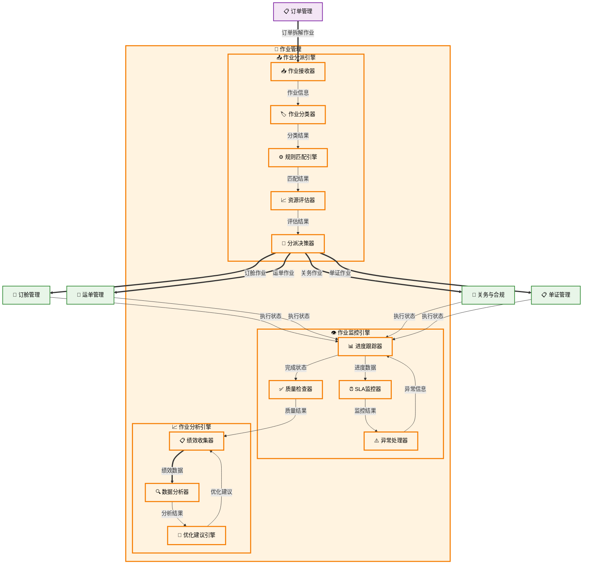

# 作业管理

## 新手提示：作业管理核心概念

### 作业
作业是货代业务执行的基本单元，由订单拆解生成，包含具体的执行任务、时间要求、资源分配和质量标准。

### 作业类型
- **订舱作业 (BOOKING_JOB)**：向船公司/航空公司申请舱位、确认舱位、获取配舱回单
- **运单作业 (WAYBILL_JOB)**：制作海运提单/空运单、审核单据信息、签发运输单据
- **拖车作业 (TRUCKING_JOB)**：安排拖车提货、货物运输、送达仓库/场站
- **关务作业 (CUSTOMS_JOB)**：报关报检、合规审查、证书办理、清关跟踪
- **仓储作业 (WAREHOUSE_JOB)**：货物收发、存储管理、库内操作、出入库单据
- **单证作业 (DOCUMENT_JOB)**：贸易单证制作、审核签发、客户交付

### 作业状态
- **待分配**：作业已创建，等待分配执行人员
- **进行中**：作业正在执行
- **待审核**：作业完成，等待质量审核
- **已完成**：作业执行完毕并通过审核
- **异常**：作业执行过程中出现问题
- **已取消**：作业被取消

### 作业协同
多个作业之间的依赖关系和协调机制，确保整个业务流程的顺畅执行。

## 功能概述

### 业务价值说明
- **中央调度**：作为智能拆解后的作业统一接收和分派中心
- **执行标准化**：统一作业执行标准，提高服务质量
- **资源优化**：合理分配人员和设备资源，提高效率
- **进度可控**：实时跟踪作业进度，及时发现和解决问题
- **质量保证**：通过审核机制确保作业质量
- **数据积累**：收集执行数据，支持流程优化

### 核心功能模块

- **作业接收管理**：从货代操作系统的订单管理模块智能拆解功能接收作业清单，统一管理
- **作业分派管理**：智能分派算法和手动分派调整
  > **重要说明**：此处的作业分派是**系统级分派**，负责将不同类型的作业分派给相应的业务系统或功能模块（如关务作业分派给关务与合规子系统，订舱作业分派给订舱管理模块等）。这是第一级分派，属于系统间路由。各业务系统内部还会有第二级分派，即将作业分派给具体的业务人员。
- **作业执行跟踪**：实时进度监控和异常预警机制
- **团队协作支持**：团队工作台和协作支援机制
- **绩效分析优化**：个人绩效评估和SLA达成监控

## 菜单结构

```
作业管理
├── 作业列表                    # 显示所有作业任务的汇总信息
├── 作业分派                    # 将作业任务分配给相应的业务系统或功能模块（系统级分派）
├── 我的作业                    # 个人工作台，查看分配给自己的作业
├── 团队作业                    # 团队工作台，管理团队内的作业分配
├── 作业监控                    # 实时监控作业执行状态和SLA达成情况
├── 分派规则配置                # 配置作业自动分派的业务规则
└── 作业绩效分析                # 作业执行效率和绩效统计分析
```

## 作业管理数据流转图




## 页面原型设计

### 作业列表页面

```
+----------------------------------------------------------+
|  作业管理 > 作业列表                    [自动分派] [手动分派] |
+----------------------------------------------------------+
| 筛选条件：                                                  |
| 作业类型：[全部 ▼] 状态：[全部 ▼] 负责人：[全部 ▼]          |
| 优先级：[全部 ▼] 创建日期：[开始] 至 [结束]    [搜索] [重置] |
+----------------------------------------------------------+
| 作业号 | 类型 | 关联订单 | 负责人 | 优先级 | 状态 | 截止时间 | 操作 |
|-------|------|---------|-------|-------|------|---------|------|
| JOB-001| 订舱作业| ORD-001| 小王 | 高 | 执行中| 03-25 | [详情][更新] |
| JOB-002| 关务作业| ORD-001| 小李 | 中 | 待分派| 03-20 | [分派][详情] |
+----------------------------------------------------------+
| 待分派：15  执行中：28  已完成：156  超期：3              |
+----------------------------------------------------------+
```

### 作业详情页面

```
+----------------------------------------------------------+
|  作业管理 > 作业详情 > JOB-20240315-001        [编辑] [更新状态] |
+----------------------------------------------------------+
| 基本信息                                                   |
| 作业编号：JOB-20240315-001    作业类型：订舱作业            |
| 关联订单：ORD-20240315-001    优先级：高                   |
| 负责人：操作员小王            创建时间：2024-03-15 15:00    |
| 截止时间：2024-03-25 18:00    当前状态：执行中             |
+----------------------------------------------------------+
| 作业内容                                                   |
| 作业描述：处理上海至洛杉矶海运出口业务                        |
| 具体任务：                                                 |
| □ 运单建档    □ 订舱申请    □ 单证制作    □ 费用核算        |
| ☑ 客户确认    ☑ 承运商联系                                |
+----------------------------------------------------------+
| 执行记录                                                   |
| 2024-03-15 15:30  小王  开始执行作业                       |
| 2024-03-16 09:00  小王  完成运单建档                       |
| 2024-03-16 14:00  小王  提交订舱申请                       |
+----------------------------------------------------------+
| 关联信息                                                   |
| 生成运单：WAY-20240315-001                                |
| 订舱记录：BKG-20240315-001                                |
+----------------------------------------------------------+
```

### 作业分派页面

```
+----------------------------------------------------------+
|  作业管理 > 作业分派                      [批量分派] [分派规则] |
+----------------------------------------------------------+
| 待分派作业列表                                              |
| 筛选：作业类型[全部▼] 优先级[全部▼] 客户等级[全部▼] [搜索]    |
+----------------------------------------------------------+
| ☑ | 作业号 | 类型 | 订单号 | 优先级 | 客户 | 预计工期 | 操作 |
|---|-------|------|-------|-------|------|---------|------|
| ☑ | JOB-001| 货运 | ORD-001| 高 | ABC公司| 30天 | [分派] |
| ☑ | JOB-002| 报关 | ORD-002| 中 | XYZ公司| 15天 | [分派] |
+----------------------------------------------------------+
| 团队资源状态                                                |
| 操作团队A：当前负荷 75% (15/20)  可用成员：小王、小李、小张   |
| 操作团队B：当前负荷 60% (12/20)  可用成员：小陈、小刘、小赵   |
+----------------------------------------------------------+
| 分派操作                                                   |
| 选择负责人：[操作员小王 ▼]  预计完成时间：[2024-03-25]      |
| 分派理由：[根据专业能力和工作负荷自动推荐]     [确认分派]     |
+----------------------------------------------------------+
```

### 我的作业页面

```
+----------------------------------------------------------+
|  作业管理 > 我的作业                        [刷新] [导出] |
+----------------------------------------------------------+
| 个人工作台 - 操作员小王                                     |
| 今日待办：3项  本周计划：8项  超期提醒：1项                  |
+----------------------------------------------------------+
| 筛选：状态[全部▼] 优先级[全部▼] 截止时间[本周▼] [搜索]      |
+----------------------------------------------------------+
| 作业号 | 类型 | 订单号 | 优先级 | 进度 | 截止时间 | 状态 | 操作 |
|-------|------|-------|-------|------|---------|------|------|
| JOB-001| 货运 | ORD-001| 高 | 65% | 03-25 | 执行中| [更新][详情] |
| JOB-003| 单证 | ORD-003| 中 | 30% | 03-28 | 执行中| [更新][详情] |
| JOB-005| 费用 | ORD-005| 低 | 0% | 04-01 | 待开始| [开始][详情] |
+----------------------------------------------------------+
| 快速操作                                                   |
| [更新进度] [添加备注] [申请延期] [请求协助] [完成作业]       |
+----------------------------------------------------------+
```

### 团队作业页面

```
+----------------------------------------------------------+
|  作业管理 > 团队作业                    [团队切换▼] [导出] |
+----------------------------------------------------------+
| 操作团队A - 团队负责人：主管张三                            |
| 团队状态：负荷75% 成员5人 本周完成12项 超期2项              |
+----------------------------------------------------------+
| 成员工作分布                                               |
| 小王：5项作业(3执行中,1待开始,1超期) 负荷90% [查看详情]      |
| 小李：3项作业(2执行中,1待开始) 负荷60% [查看详情]           |
| 小张：4项作业(3执行中,1已完成) 负荷80% [查看详情]           |
+----------------------------------------------------------+
| 团队作业列表                                               |
| 筛选：负责人[全部▼] 状态[全部▼] 优先级[全部▼] [搜索]        |
+----------------------------------------------------------+
| 作业号 | 负责人 | 类型 | 优先级 | 进度 | 状态 | 截止时间 | 操作 |
|-------|-------|------|-------|------|------|---------|------|
| JOB-001| 小王 | 货运 | 高 | 65% | 执行中| 03-25 | [协助][详情] |
| JOB-002| 小李 | 报关 | 中 | 80% | 执行中| 03-20 | [协助][详情] |
+----------------------------------------------------------+
| 团队协作                                                   |
| [重新分派] [负荷均衡] [技能匹配] [紧急支援]                 |
+----------------------------------------------------------+
```

### 作业监控页面

```
+----------------------------------------------------------+
|  作业管理 > 作业监控                      [实时刷新] [告警设置] |
+----------------------------------------------------------+
| 监控仪表板                                                 |
| 总作业数：156  执行中：28  待分派：15  已完成：110  超期：3  |
| 平均完成时间：18.5天  按时完成率：92%  客户满意度：4.6分     |
+----------------------------------------------------------+
| 实时告警                                                   |
| 🔴 JOB-008 超期2天未完成 - 负责人：小陈 [立即处理]          |
| 🟡 JOB-012 即将超期(剩余6小时) - 负责人：小刘 [提醒]        |
| 🟢 JOB-015 提前完成 - 负责人：小王 [查看详情]               |
+----------------------------------------------------------+
| 性能指标趋势图                                             |
| [作业完成趋势] [团队效率对比] [客户满意度] [资源利用率]      |
+----------------------------------------------------------+
| 异常作业列表                                               |
| 作业号 | 负责人 | 异常类型 | 超期天数 | 影响等级 | 操作 |
|-------|-------|---------|---------|---------|------|
| JOB-008| 小陈 | 超期未完成| 2天 | 高 | [催办][重派] |
| JOB-010| 小赵 | 进度停滞 | - | 中 | [跟进][协助] |
+----------------------------------------------------------+
```

### 分派规则配置页面

```
+----------------------------------------------------------+
|  作业管理 > 分派规则配置                  [新建规则] [导入规则] |
+----------------------------------------------------------+
| 规则列表                                                   |
| 筛选：规则类型[全部▼] 状态[全部▼] [搜索规则名称]            |
+----------------------------------------------------------+
| 规则名称 | 类型 | 优先级 | 状态 | 最后修改 | 操作 |
|---------|------|-------|------|---------|------|
| 订舱作业自动分派| 自动分派| 1 | 启用 | 03-15 | [编辑][测试] |
| VIP客户优先处理| 优先级调整| 2 | 启用 | 03-10 | [编辑][测试] |
| 技能匹配规则 | 能力匹配| 3 | 启用 | 03-08 | [编辑][测试] |
+----------------------------------------------------------+
| 规则详情配置                                               |
| 规则名称：[订舱作业自动分派规则]                            |
| 触发条件：                                                 |
| ☑ 作业类型 = 订舱作业                                     |
| ☑ 客户等级 ≥ VIP                                         |
| ☑ 工作时间内创建                                          |
| 分派逻辑：                                                 |
| 1. 检查团队成员专业技能匹配度                               |
| 2. 评估当前工作负荷 (≤80%)                                |
| 3. 考虑历史绩效评分 (≥4.0)                                |
| 4. 优先分派给评分最高的可用人员                             |
+----------------------------------------------------------+
| [保存规则] [测试规则] [启用/禁用] [删除规则]                |
+----------------------------------------------------------+
```

### 作业绩效分析页面

```
+----------------------------------------------------------+
|  作业管理 > 作业绩效分析              [时间范围▼] [导出报告] |
+----------------------------------------------------------+
| 分析维度选择                                               |
| 时间范围：[本月▼] 分析对象：[全部团队▼] 作业类型：[全部▼]   |
+----------------------------------------------------------+
| 关键绩效指标                                               |
| 作业完成率：92.5% ↑2.3%  平均完成时间：18.5天 ↓1.2天      |
| 按时完成率：89.2% ↑1.8%  客户满意度：4.6分 ↑0.2分         |
| 资源利用率：75.8% ↑3.5%  重工率：3.2% ↓0.8%              |
+----------------------------------------------------------+
| 团队绩效排名                                               |
| 排名 | 团队 | 完成数量 | 按时率 | 满意度 | 效率分 | 趋势 |
|------|------|---------|-------|-------|-------|------|
| 1 | 操作团队A| 45 | 94% | 4.8 | 92.5 | ↑ |
| 2 | 操作团队B| 38 | 91% | 4.5 | 88.2 | ↑ |
| 3 | 操作团队C| 33 | 87% | 4.3 | 85.1 | → |
+----------------------------------------------------------+
| 个人绩效排名                                               |
| 排名 | 姓名 | 完成数量 | 按时率 | 满意度 | 效率分 | 操作 |
|------|------|---------|-------|-------|-------|------|
| 1 | 小王 | 18 | 96% | 4.9 | 95.2 | [详情] |
| 2 | 小李 | 15 | 93% | 4.7 | 91.8 | [详情] |
| 3 | 小张 | 12 | 89% | 4.5 | 87.5 | [详情] |
+----------------------------------------------------------+
| 趋势分析图表                                               |
| [完成率趋势] [效率对比] [满意度变化] [负荷分布]             |
+----------------------------------------------------------+
```

## 业务流程

### 作业分派流程

#### 作业接收
从货代操作系统的订单管理模块智能拆解功能接收作业清单，作为中央调度器统一管理和分派

**货代操作系统订单管理模块智能拆解数据来源**：
- **调用方式**：RESTful API (POST /api/job-management/receive-jobs)
- **调用时机**：智能拆解完成后立即推送作业清单
- **数据来源**：货代操作系统的订单管理模块智能拆解功能

**接收的作业类型**：
1. **订舱作业 (BOOKING_JOB)**：向船公司/航空公司申请舱位、确认舱位、获取配舱回单
2. **运单作业 (WAYBILL_JOB)**：制作海运提单/空运单、审核单据信息、签发运输单据
3. **拖车作业 (TRUCKING_JOB)**：安排拖车提货、货物运输、送达仓库/场站
4. **关务作业 (CUSTOMS_JOB)**：报关报检、合规审查、证书办理、清关跟踪
5. **仓储作业 (WAREHOUSE_JOB)**：货物收发、存储管理、库内操作、出入库单据
6. **单证作业 (DOCUMENT_JOB)**：贸易单证制作、审核签发、客户交付

**中央调度机制**：
> **分派层级说明**：本模块执行的是**第一级分派（系统级分派）**，负责将作业路由到相应的业务系统。各业务系统接收作业后，会在系统内部执行**第二级分派（人员级分派）**，将作业分配给具体的业务人员。

作业管理系统接收货代操作系统订单管理模块智能拆解功能的作业清单后，作为中央调度器：
1. **统一接收**：接收货代操作系统订单管理模块智能拆解功能推送的完整作业清单
2. **分类管理**：按作业类型进行分类和优先级排序
3. **智能分派**：根据业务规则自动分派给相应的系统模块执行（如订舱作业分派给货代操作系统的订舱管理模块，关务作业分派给关务与合规子系统）
4. **状态跟踪**：实时跟踪各系统模块的作业执行状态
5. **协调管理**：处理跨系统模块之间的作业依赖和协调问题

**统一数据操作**：
- **数据来源**：接收货代操作系统订单管理模块智能拆解功能直接写入的作业记录
- **数据分派**：根据作业类型和业务规则，为作业记录添加分派信息和执行目标
- **数据更新**：更新作业分派状态，同步各业务系统执行进度
- **业务逻辑**：验证作业清单完整性，根据作业类型确定目标执行系统
- **数据格式**：JSON 格式，UTF-8 编码

**入参**：
- `order_no` (string, 必填): 订单唯一标识符
  - 描述：需要拆解生成作业的订单号
  - 格式：字母数字组合，长度8-20位
  - 示例：`"ORD202401150001"`
- `job_type` (string, 必填): 作业类型
  - 描述：根据订单需求确定的作业类型
  - 枚举值：BOOKING_JOB（订舱作业）、WAYBILL_JOB（运单作业）、TRUCKING_JOB（拖车作业）、CUSTOMS_JOB（关务作业）、WAREHOUSE_JOB（仓储作业）、DOCUMENT_JOB（单证作业）
  - 示例：`"BOOKING_JOB"`
- `service_requirements` (object, 必填): 服务要求
  - 描述：包含特殊处理需求、时效要求、质量标准等服务规格
  - 示例：`{"special_handling": "fragile", "time_requirement": "urgent", "quality_standard": "premium"}`
- `priority_level` (string, 必填): 优先级
  - 描述：基于客户等级和业务紧急程度确定的处理优先级
  - 枚举值：HIGH（高）、MEDIUM（中）、LOW（低）
  - 示例：`"HIGH"`

**出参**：
- `job_id` (string): 作业唯一标识符
  - 描述：系统生成的作业ID，用于后续跟踪和管理
  - 示例：`"JOB202401150001"`
- `assignment_queue_status` (string): 分派队列状态
  - 描述：作业在分派系统中的当前状态
  - 枚举值：PENDING（待分派）、ASSIGNING（分派中）、ASSIGNED（已分派）
  - 示例：`"PENDING"`
- `resource_requirements` (object): 资源需求
  - 描述：包含所需技能、人员数量、设备要求等资源配置信息
  - 示例：`{"required_skills": ["customs_clearance"], "personnel_count": 2, "equipment": ["scanner"]}`
- `estimated_duration` (number): 预估时长
  - 描述：基于作业类型和复杂度估算的完成时间
  - 单位：小时
  - 示例：`24`

#### 规则匹配
根据作业类型、客户等级、地区等匹配分派规则

**🔗 跨系统触发**：货代操作 → 主数据与系统配置
- **调用方式**：RESTful API (GET /api/assignment-rules/match)
- **调用时机**：作业进入分派队列时
- **数据操作**：
  - **数据读取**：从主数据与系统配置的 assignment_rules 表（分派规则表）和 rule_conditions 表（规则条件表）查询匹配规则
  - **数据写入**：将匹配结果写入货代操作的 job_rule_matches 表（作业规则匹配表）
  - **数据更新**：更新货代操作的 jobs 表（作业主表）中的 rule_match_status 字段
- **业务逻辑**：根据作业属性匹配最适合的分派规则，支持多规则组合

**入参**：
- `job_attributes` (object, 必填): 作业属性
  - 描述：包含作业类型、紧急程度、复杂度等关键属性信息
  - 示例：`{"job_type": "FREIGHT", "urgency": "HIGH", "complexity": "MEDIUM"}`
- `customer_tier` (string, 必填): 客户等级
  - 描述：客户在系统中的分级，影响服务优先级
  - 枚举值：VIP、REGULAR（普通）、NEW（新客户）
  - 示例：`"VIP"`
- `geographic_zone` (string, 必填): 地理区域
  - 描述：作业涉及的地理区域标识
  - 枚举值：EAST_CHINA（华东）、SOUTH_CHINA（华南）、NORTH_CHINA（华北）
  - 示例：`"EAST_CHINA"`
- `service_type` (string, 必填): 服务类型
  - 描述：运输服务的具体类型
  - 枚举值：SEA（海运）、AIR（空运）、LAND（陆运）、MULTIMODAL（多式联运）
  - 示例：`"SEA"`

**出参**：
- `matched_rules` (array): 匹配规则列表
  - 描述：匹配到的分派规则列表，包含规则ID和匹配度评分
  - 示例：`[{"rule_id": "RULE001", "match_score": 95, "rule_name": "VIP客户优先规则"}]`
- `assignment_criteria` (object): 分派标准
  - 描述：包含技能要求、经验要求、工作负荷等分派标准
  - 示例：`{"required_skills": ["sea_freight"], "min_experience": 2, "max_workload": 80}`
- `priority_weights` (object): 优先级权重
  - 描述：各维度的权重分配，用于综合评估最佳分派方案
  - 示例：`{"skill_weight": 0.4, "experience_weight": 0.3, "workload_weight": 0.3}`
- `rule_confidence` (number): 规则置信度
  - 描述：规则匹配的置信度评分，反映匹配准确性
  - 范围：0-100
  - 示例：`92`

#### 资源检查
检查团队成员工作负荷和专业能力

**🔗 跨系统触发**：货代操作 → 员工管理（查询员工信息）
- **调用方式**：RESTful API (GET /api/employee/info-query)
- **调用时机**：规则匹配完成后
- **数据操作**：
  - **数据读取**：从员工管理系统的 employees 表（员工基本信息表）、employee_skills 表（员工技能表）查询员工基本信息和技能信息
  - **数据读取**：从货代操作系统的 employee_workload 表（员工工作负荷表）查询当前工作负荷状态
  - **数据写入**：将资源检查结果写入货代操作系统的 resource_availability 表（资源可用性表）
- **业务逻辑**：评估员工技能匹配度，检查工作负荷是否超限，考虑休假等因素，生成可用性评估报告

**入参**：
- `employee_ids` (array, 可选): 员工ID列表
  - 描述：指定查询的员工ID，如不提供则查询所有员工
  - 示例：`["EMP001", "EMP002", "EMP003"]`
- `skill_types` (array, 可选): 技能类型筛选
  - 描述：按技能类型筛选员工信息
  - 示例：`["customs_clearance", "documentation", "transport_coordination"]`
- `department` (string, 可选): 部门筛选
  - 描述：按部门筛选员工信息
  - 示例：`"操作部"`

**出参**：
- `employees` (array): 员工信息列表
  - 描述：员工基本信息和技能信息
  - 示例：`[{"employee_id": "EMP001", "name": "张三", "department": "操作部", "skills": [{"skill": "customs_clearance", "level": "intermediate"}]}]`
- `total_count` (number): 员工总数
  - 描述：查询结果的员工总数
  - 示例：`15`

#### 自动分派
系统自动分配给最合适的负责人

**系统内流转**：智能分派算法执行
- **调用方式**：内部算法引擎调用
- **调用时机**：资源检查完成后立即执行
- **数据操作**：
  - **数据读取**：从货代操作的 resource_availability 表（资源可用性表）和 job_rule_matches 表（作业规则匹配表）读取分析数据
  - **数据写入**：将分派结果写入货代操作的 job_assignments 表（作业分派表）
  - **数据更新**：更新货代操作的 jobs 表（作业主表）中的 assigned_to 和 assignment_status 字段
- **业务逻辑**：综合考虑技能匹配、工作负荷、历史绩效等因素，选择最优分派方案，工作负荷统计延迟到执行计划确认后更新

**入参**：
- `candidate_list` (array, 必填): 候选人列表
  - 描述：包含员工信息和评分的候选人数组
  - 示例：`[{"employee_id": "EMP001", "score": 95, "skills": ["customs", "transport"]}]`
- `assignment_rules` (object, 必填): 分派规则
  - 描述：包含规则逻辑和权重配置的对象
  - 示例：`{"skill_weight": 0.4, "workload_weight": 0.3, "performance_weight": 0.3}`
- `optimization_criteria` (object, 必填): 优化标准
  - 描述：包含效率、质量、成本等目标的优化标准
  - 示例：`{"efficiency": 0.5, "quality": 0.3, "cost": 0.2}`

**出参**：
- `assigned_personnel` (object): 分派的人员
  - 描述：包含员工ID和分派理由的对象
  - 示例：`{"employee_id": "EMP001", "reason": "最高技能匹配度", "confidence": 0.95}`
- `assignment_score` (number): 分派评分
  - 描述：表示分派方案优劣的数值评分
  - 范围：0-100
  - 示例：`92.5`
- `backup_options` (array): 备选方案
  - 描述：包含其他可行分派选项的数组
  - 示例：`[{"employee_id": "EMP002", "score": 87, "rank": 2}]`

#### 手动调整
支持主管手动调整分派结果

**🔗 系统内操作**：货代操作系统内部处理
- **调用方式**：内部服务调用 (PUT /api/jobs/assignment-direct-override)
- **调用时机**：主管需要直接调整自动分派结果时
- **数据操作**：
  - **读取数据**：从货代操作的 job_assignments（作业分派表） 表读取原始分派信息
  - **写入数据**：将调整记录写入货代操作的 assignment_audit_logs（分派调整审计表） 表
  - **更新数据**：直接更新货代操作的 job_assignments（作业分派表） 表中的分派信息和 jobs（作业主表） 表中的 assigned_to 字段
  - **条件更新**：仅当原作业已进入执行计划阶段时，更新货代操作的 employee_workload 表（员工工作负荷表），原负责人减少负荷，新负责人增加负荷
  - **通知数据**：向货代操作的 internal_notifications（内部通知表） 表写入调整通知信息
- **业务逻辑**：验证主管权限，记录调整原因和操作轨迹，直接执行调整，根据作业执行状态有条件地更新双方员工的工作负荷统计

**入参**：
- `original_assignment` (object, 必填): 原始分派
  - 描述：包含原分派人员和分派时间的对象
  - 示例：`{"employee_id": "EMP001", "assigned_at": "2024-01-15T10:00:00Z", "job_id": "JOB001"}`
- `new_assignment` (object, 必填): 新分派信息
  - 描述：包含新分派人员和相关信息的对象
  - 示例：`{"employee_id": "EMP002", "reason": "技能更匹配", "priority": "normal"}`
- `adjustment_reason` (string, 必填): 调整原因
  - 描述：用于审计的调整原因说明
  - 示例：`"员工临时请假，需要重新分派"`
- `supervisor_override` (object, 必填): 主管覆盖信息
  - 描述：包含主管ID和权限级别的对象
  - 示例：`{"supervisor_id": "SUP001", "authority_level": "DEPARTMENT_HEAD"}`

**出参**：
- `updated_assignment` (object): 更新后的分派
  - 描述：包含新的分派信息的对象
  - 示例：`{"employee_id": "EMP002", "assigned_at": "2024-01-15T11:00:00Z", "job_id": "JOB001", "status": "assigned"}`
- `adjustment_record` (object): 调整记录
  - 描述：完整的调整记录信息
  - 示例：`{"record_id": "ADJ-20240115-001", "status": "completed", "processed_at": "2024-01-15T11:00:00Z"}`
- `audit_trail` (object): 审计轨迹
  - 描述：包含操作时间、操作人、操作内容的审计信息
  - 示例：`{"timestamp": "2024-01-15T11:00:00Z", "operator": "SUP001", "action": "assignment_override", "impact": "immediate"}`

#### 通知确认
向负责人发送作业通知

**🔗 外部系统交互**：货代操作 → 集成与连接系统
- **调用方式**：RESTful API (POST /api/integration/notification/send-multi-channel)
- **调用时机**：作业分派完成后立即发送
- **数据操作**：
  - **读取数据**：从货代操作的 job_assignments（作业分派表） 表和员工管理的 employee_contacts（员工联系方式表） 表读取通知信息
  - **写入数据**：将通知记录写入集成与连接的 notification_logs（通知日志表） 表
  - **更新数据**：更新货代操作的 jobs（作业主表） 表中的 notification_status 字段
- **业务逻辑**：根据紧急程度选择通知渠道（邮件/短信/微信/飞书等），支持多渠道并发发送，失败重试机制

**入参**：
- `notification_request` (object, 必填): 通知请求信息
  - `business_type` (string, 必填): 业务类型标识
    - 描述：标识通知来源的业务类型
    - 示例：`"job_assignment"`
  - `template_code` (string, 必填): 通知模板代码
    - 描述：在集成与连接系统中预配置的模板标识
    - 示例：`"JOB_ASSIGNMENT_NOTIFICATION"`
  - `channels` (array, 可选): 指定发送渠道
    - 描述：指定使用的通知渠道，不指定则根据紧急程度自动选择
    - 枚举值：["email", "sms", "wechat", "feishu", "push"]
    - 示例：`["email", "sms"]`
  - `priority` (string, 必填): 优先级
    - 描述：通知优先级，影响发送策略和渠道选择
    - 枚举值：HIGH（高）、MEDIUM（中）、LOW（低）
    - 示例：`"MEDIUM"`
- `recipients` (array, 必填): 接收人列表
  - 描述：支持多个接收人的通知发送
  - 示例：`[{"employee_id": "EMP001", "name": "张三", "email": "zhangsan@company.com", "phone": "+86-13800138000"}]`
- `template_variables` (object, 必填): 模板变量
  - 描述：用于模板参数替换的动态数据
  - 示例：`{"job_id": "JOB001", "job_type": "报关作业", "deadline": "2024-01-20 18:00", "assignee": "张三", "urgent_flag": false}`
- `callback_config` (object, 可选): 回调配置
  - `callback_url` (string): 状态回调地址
  - `events` (array): 关注的事件类型
  - 示例：`{"callback_url": "/api/jobs/notification-callback", "events": ["sent", "delivered", "read"]}`

**出参**：
- `notification_result` (object): 通知发送结果
  - `task_id` (string): 通知任务ID
    - 描述：集成与连接系统生成的唯一任务标识
    - 示例：`"NTASK_20240115_001"`
  - `status` (string): 整体发送状态
    - 描述：本次通知请求的整体处理状态
    - 枚举值：SUCCESS（成功）、PARTIAL_SUCCESS（部分成功）、FAILED（失败）、QUEUED（已排队）
    - 示例：`"SUCCESS"`
  - `channel_results` (array): 各渠道发送结果
    - 描述：每个通知渠道的详细发送状态
    - 示例：`[{"channel": "email", "status": "SUCCESS", "message_id": "MSG_EMAIL_001", "sent_at": "2024-01-15T11:05:00Z"}, {"channel": "sms", "status": "SUCCESS", "message_id": "MSG_SMS_001", "sent_at": "2024-01-15T11:05:01Z"}]`
  - `recipient_results` (array): 各接收人发送结果
    - 描述：每个接收人的通知发送状态
    - 示例：`[{"employee_id": "EMP001", "name": "张三", "status": "SUCCESS", "channels_sent": ["email", "sms"], "failed_channels": []}]`
  - `retry_info` (object, 可选): 重试信息
    - `retry_count` (integer): 当前重试次数
    - `next_retry_at` (string): 下次重试时间
    - `max_retries` (integer): 最大重试次数
    - 示例：`{"retry_count": 0, "next_retry_at": null, "max_retries": 3}`
  - `tracking_info` (object): 跟踪信息
    - `created_at` (string): 任务创建时间
    - `estimated_delivery` (string): 预计送达时间
    - `callback_registered` (boolean): 是否注册了回调
    - 示例：`{"created_at": "2024-01-15T11:00:00Z", "estimated_delivery": "2024-01-15T11:10:00Z", "callback_registered": true}`

### 作业执行流程

#### 作业接收
负责人确认接收作业任务

**🔗 系统内操作**：货代操作系统内部处理
- **调用方式**：内部API (POST /api/jobs/acceptance)
- **调用时机**：作业分派完成后，等待员工确认接收
- **数据操作**：
  - **数据写入**：记录接收状态到货代操作的 job_acceptance_logs（作业接收日志表） 表
  - **数据更新**：更新货代操作的 job_assignments（作业分派表） 表中的接收状态和确认时间
  - **数据触发**：接收成功时启动执行流程，更新作业状态为执行中；拒绝时触发重新分派流程
- **业务逻辑**：基于本地员工权限缓存验证权限，检查作业时间冲突，支持拒绝和重新分派，工作负荷统计延迟到执行计划确认后更新

**入参**：
- `job_id` (string, 必填): 作业标识符
  - 描述：作业的唯一标识符
  - 示例：`"JOB202401150001"`
- `assigned_personnel` (object, 必填): 分派人员
  - 描述：包含员工ID和基本信息的对象
  - 示例：`{"employee_id": "EMP001", "name": "张三", "department": "操作部"}`
- `acceptance_deadline` (string, 必填): 接收截止时间
  - 描述：员工必须响应接收确认的截止时间
  - 格式：ISO 8601日期时间格式
  - 示例：`"2024-01-15T18:00:00Z"`
- `acceptance_response` (string, 必填): 接收响应
  - 描述：员工的接收决定
  - 枚举值：ACCEPTED（接受）、REJECTED（拒绝）
  - 示例：`"ACCEPTED"`

**出参**：
- `acceptance_status` (string): 接收状态
  - 描述：员工对作业分派的响应状态
  - 枚举值：ACCEPTED（已接收）、REJECTED（已拒绝）、TIMEOUT（超时未响应）
  - 示例：`"ACCEPTED"`
- `acceptance_timestamp` (string): 接收确认时间
  - 描述：员工确认接收的具体时间
  - 格式：ISO 8601日期时间格式
  - 示例：`"2024-01-15T14:30:00Z"`
- `next_step` (string): 下一步操作
  - 描述：根据接收结果确定的下一步流程
  - 枚举值：PROCEED_TO_PLANNING（进入执行计划）、REASSIGN（重新分派）
  - 示例：`"PROCEED_TO_PLANNING"`
- `workload_update_pending` (boolean): 工作负荷更新待处理
  - 描述：标识工作负荷统计是否需要在执行计划阶段更新
  - 示例：`true`

#### 执行计划
制定详细的执行计划和时间安排

**系统内流转**：作业计划制定和资源调度
- **调用方式**：内部服务调用 + 算法引擎
- **调用时机**：作业接收确认后立即制定计划
- **数据操作**：
  - **数据生成**：生成详细执行计划到货代操作的 execution_plans（执行计划表） 表
  - **数据分配**：分配资源信息到货代操作的 resource_allocations（资源分配表） 表
  - **数据设置**：设置里程碑到货代操作的 job_milestones（作业里程碑表） 表
  - **数据更新**：确认执行计划后，更新货代操作的 employee_workload 表（员工工作负荷表）增加实际工作负荷
- **业务逻辑**：考虑资源约束，优化时间安排，设置检查点，执行计划确认后正式增加员工工作负荷统计

**入参**：
```json
{
  "job_requirements": "作业要求（对象，包含技能需求和质量标准）",
  "available_resources": "可用资源（数组，包含人员、设备、时间等）",
  "timeline_constraints": "时间约束（对象，包含开始时间、截止时间等）"
}
```

**出参**：
```json
{
  "execution_plan": "执行计划（对象，包含详细步骤和时间安排）",
  "milestone_schedule": "里程碑时间表（数组，包含关键节点和时间）",
  "resource_allocation": "资源分配（对象，包含资源使用计划）"
}
```

#### 过程跟踪
实时更新作业执行状态和进度

**🔗 跨系统触发**：货代操作 →   跟踪与客户门户
- **调用方式**：RESTful API (PUT /api/tracking/progress-update) + WebSocket 推送
- **调用时机**：执行过程中实时更新，关键节点必须更新
- **数据操作**：
  - **数据更新**：更新进度状态到货代操作的 job_progress（作业进度表） 表
  - **数据记录**：记录执行轨迹到货代操作的 execution_logs（执行日志表） 表
  - **数据推送**：推送客户通知到客户跟踪与客户门户的 notifications（通知表） 表
- **业务逻辑**：支持批量更新，自动计算 ETA，异常情况告警

**入参**：
```json
{
  "job_id": "作业 ID（字符串，唯一标识）",
  "progress_updates": "进度更新（对象，包含完成百分比和当前状态）",
  "milestone_completion": "里程碑完成情况（数组，包含已完成的里程碑）",
  "status_changes": "状态变更（对象，包含状态变更和变更原因）"
}
```

**出参**：
```json
{
  "tracking_record": "跟踪记录（对象，包含完整的执行轨迹）",
  "customer_notification": "客户通知（对象，包含通知内容和发送状态）",
  "eta_updates": "ETA 更新（对象，包含预计到达时间和置信度）"
}
```

#### 质量检查
在货代作业执行过程中的关键节点进行质量检查和确认，确保服务质量符合标准

## 📋 **质量检查的主要内容**

### **1. 单证质量检查**
- **检查项目**：提单、发票、装箱单等单证的完整性和准确性
- **检查标准**：单证信息与订单信息一致性、格式规范性、必填项完整性
- **检查时机**：单证制作完成后、发送给客户前

### **2. 操作流程检查**
- **检查项目**：订舱确认、货物装载、运输安排等操作步骤
- **检查标准**：是否按照SOP执行、时间节点是否达标、资源配置是否合理
- **检查时机**：每个关键操作节点完成后

### **3. 客户服务检查**
- **检查项目**：客户沟通记录、问题响应时间、服务满意度
- **检查标准**：响应时效性、沟通专业性、问题解决完整性
- **检查时机**：客户互动后、作业完成前

## 🎯 **具体实际示例**

### **示例场景：出口海运作业质量检查**

**背景**：客户A委托出口一批电子产品到美国，货值5万美元，重量2.5吨，体积15立方米，作业编号JOB202401150001

#### **检查点1：单证制作完成后的质量检查**

**检查内容**：
- **提单检查**：核实货物描述是否与实际货物一致，收发货人信息是否完整准确，运费条款是否正确标注
- **商业发票检查**：验证货值USD 50,000是否与合同一致，HS编码8471.30.01是否正确，数量100台是否与装箱单匹配
- **装箱单检查**：确认毛重2,500kg、体积15CBM、纸箱包装等信息的准确性
- **原产地证检查**：核实原产地信息是否符合目的国要求

**发现问题**：
在单证审核过程中，质检员发现提单上的收货人地址信息不完整，缺少邮政编码，这可能导致目的港清关延误。

**处理措施**：
立即联系客户确认收货人完整地址信息，要求单证员在当天下午4点前完成提单修改，确保单证信息的完整性和准确性。

#### **检查点2：货物装载完成后的操作检查**

**检查内容**：
- **重量核实**：实际装载重量2,480kg与申报重量2,500kg的差异在合理范围内（差异率0.8%，符合±2%标准）
- **体积确认**：实际体积14.8CBM与申报体积15CBM基本一致
- **集装箱状态**：检查集装箱TEMU1234567的完好性，确认封条SL789456的完整性
- **时间管控**：原计划上午10点装载，实际10点30分完成，延误30分钟

**发现问题**：
装载作业比计划延误了30分钟，虽然在可接受的时间范围内，但需要分析延误原因。

**处理措施**：
操作主管分析延误原因为货物到达仓库时间略晚，建议在后续作业中为装载环节预留更多缓冲时间，优化整体作业计划的时间安排。

#### **检查点3：客户服务质量检查**

**检查内容**：
- **沟通及时性**：上午9点发送装载开始通知，客户在5分钟内收到并确认；上午11点发送装载完成确认，客户即时回复
- **问题响应**：客户在作业过程中提出2次询问，平均响应时间15分钟，远优于30分钟的服务标准
- **服务专业性**：客服人员提供的信息准确、完整，解答专业到位

**服务表现**：
整个作业过程中，客户服务团队表现优异，响应及时，问题解决彻底，客户满意度很高。

**持续要求**：
继续保持当前的优质服务水平，将此次服务作为标准案例，在团队内部分享服务经验和最佳实践。

## 🔧 **系统技术实现**

**🔗 跨系统触发**：货代操作 → 质量与异常系统
- **调用方式**：RESTful API (POST /api/quality/checkpoint-inspection)
- **调用时机**：到达预设检查点时自动触发
- **数据操作**：
  - **数据执行**：执行质量检查，读取质量标准配置
  - **数据记录**：记录检查结果到质量与异常的 quality_check_results（质量检查结果表） 表
  - **数据触发**：触发纠正措施，更新异常处理流程状态
- **业务逻辑**：自动质量评估，支持人工复核，异常自动升级

**入参**：
```json
{
  "job_id": "作业 ID（字符串，唯一标识）",
  "checkpoint_data": "检查点数据（对象，包含检查项目和实际情况）",
  "quality_criteria": "质量标准（对象，包含评判标准和阈值）",
  "inspection_requirements": "检查要求（对象，包含检查方式和频率）"
}
```

**出参**：
```json
{
  "quality_score": "质量评分（数值，0-100 分制）",
  "compliance_status": "合规状态（枚举值：合规/不合规/需要改进）",
  "exception_alerts": "异常告警（数组，包含异常类型和严重程度）",
  "corrective_actions": "纠正措施（数组，包含建议的改进行动）"
}
```

#### 完成确认
作业完成后更新状态并生成报告

**🔗 跨系统触发**：货代操作 → 报表与分析
- **调用方式**：RESTful API (POST /api/reporting/job-completion)
- **调用时机**：作业完成确认后立即生成报告
- **数据操作**：
  - **数据更新**：更新货代操作的 jobs（作业表） 表中的作业状态为"已完成"
  - **数据写入**：向货代操作的 job_completion_logs（作业完成日志表） 表写入完成记录
  - **数据推送**：向报表与分析的 job_completion_metrics（作业完成指标表） 表推送绩效数据
  - **数据同步**：同步更新报表与分析的 operational_kpis（运营KPI表） 表中的作业完成率指标
- **业务逻辑**：自动生成多维度报告，计算绩效指标，提取经验教训

**入参**：
```json
{
  "job_id": "作业 ID（字符串，唯一标识）",
  "completion_data": "完成数据（对象，包含完成时间、实际耗时和交付物）",
  "performance_metrics": "绩效指标（对象，包含效率、质量、成本、资源利用率等）",
  "outcome_summary": "结果摘要（对象，包含成果描述、客户反馈和满意度评分）",
  "completion_status": "完成状态（枚举值：正常完成/延期完成/异常完成）"
}
```

**出参**：
```json
{
  "job_status_update": "作业状态更新结果（对象，包含更新状态和时间戳）",
  "completion_log_id": "完成日志ID（字符串，记录在作业完成日志表中的ID）",
  "analytics_sync_result": "分析系统同步结果（对象，包含推送状态和同步确认）",
  "kpi_update_status": "KPI更新状态（对象，包含更新的指标项和计算结果）"
}
```

### 作业分派管理流程

#### 作业分派需求识别
系统自动识别待分派作业或手动创建分派任务

**系统内流转**：作业队列监控和需求识别
- **调用方式**：定时任务 + 事件驱动机制
- **调用时机**：每 5 分钟扫描一次待分派队列，新作业创建时立即触发
- **数据操作**：
  - **数据扫描**：扫描待分派作业，读取货代操作的 pending_jobs（待分派作业表） 表
  - **数据分析**：分析优先级，计算作业紧急程度和重要性
  - **数据计算**：计算资源需求，评估所需技能和时间成本
- **业务逻辑**：根据作业类型和紧急程度自动分类，支持手动创建分派任务

**入参**：
```json
{
  "pending_jobs": "待分派作业列表（数组，包含作业 ID 和基本信息）",
  "priority_rules": "优先级规则（对象，包含评分标准和权重）",
  "capacity_thresholds": "产能阈值（对象，包含团队和个人产能限制）"
}
```

**出参**：
```json
{
  "assignment_requirements": "分派需求（对象，包含技能要求和时间要求）",
  "urgency_classification": "紧急程度分类（枚举值：紧急/高优先级/普通/低优先级）",
  "resource_needs": "资源需求（对象，包含人力和设备需求）"
}
```

#### 作业资源评估
评估团队成员工作负荷、技能匹配度和可用时间

**🔗 系统内部操作**：货代操作系统内部数据处理
- **调用方式**：内部服务调用 + WebSocket 实时推送
- **调用时机**：每 10 分钟自动监控一次，关键事件发生时立即更新
- **数据操作**：
  - **读取数据**：从货代操作的 employee_workload（员工工作负荷表） 表和 jobs（作业表） 表读取团队工作负荷状态
  - **写入数据**：将监控结果写入货代操作的 team_monitoring_logs（团队监控日志表） 表
  - **更新数据**：更新货代操作的 team_dashboard（团队仪表板表） 表中的实时状态信息
- **业务逻辑**：实时计算团队负荷，识别瓶颈和风险，预警异常情况

**入参**：
```json
{
  "team_id": "团队 ID（字符串，团队唯一标识）",
  "monitoring_period": "监控周期（对象，包含开始和结束时间）",
  "workload_metrics": "负荷指标（数组，指定需要计算的负荷类型）",
  "alert_thresholds": "告警阈值（对象，包含各项指标的告警线）"
}
```

**出参**：
```json
{
  "monitoring_log_id": "监控日志ID（字符串，写入team_monitoring_logs表的记录ID）",
  "dashboard_update_status": "仪表板更新状态（对象，包含更新结果和时间戳）",
  "team_workload_summary": "团队负荷汇总（对象，包含整体负荷分布和统计）",
  "risk_alerts": "风险告警（数组，包含识别的瓶颈和预警信息）"
}
```

#### 作业负荷均衡
识别工作负荷不均，进行任务重新分配

**🔗 跨系统触发**：货代操作 → AI优化与智能应用
- **调用方式**：RESTful API (POST /api/ai/workload-balancing)
- **调用时机**：检测到负荷不均时自动触发，或主管手动触发
- **数据操作**：
  - **读取数据**：从货代操作的 team_monitoring_logs（团队监控日志表） 表读取负荷分析数据
  - **写入数据**：将均衡方案写入 AI 系统的 optimization_results（优化结果表） 表
  - **更新数据**：更新货代操作的 job_assignments（作业分派表） 表中的分派信息
- **业务逻辑**：使用智能算法优化任务分配，考虑技能匹配和效率最大化

**入参**：
```json
{
  "current_workloads": "当前工作负荷（对象，包含团队成员的负荷分布）",
  "rebalancing_constraints": "重新平衡约束（对象，包含不可移动的任务和时间限制）",
  "optimization_goals": "优化目标（对象，包含效率、公平性等目标权重）"
}
```

**出参**：
```json
{
  "rebalancing_plan": "重新平衡计划（对象，包含任务重新分配方案）",
  "impact_analysis": "影响分析（对象，包含变更对效率和质量的影响）",
  "implementation_timeline": "实施时间线（对象，包含变更的执行计划）"
}
```

#### 作业协作支援
为遇到困难的成员提供技术支持和资源协助

**🔗 跨系统触发**：货代操作 → AI优化与智能应用
- **调用方式**：RESTful API (POST /api/knowledge/collaboration-support)
- **调用时机**：收到协助请求时立即响应
- **数据操作**：
  - **读取数据**：从AI优化与智能应用的 expertise_directory（专家目录表） 表和 solution_library（解决方案库表） 表查找专家和解决方案
  - **写入数据**：将协作记录写入货代操作的 collaboration_logs（协作日志表） 表
  - **更新数据**：更新AI优化与智能应用的 knowledge_sharing_stats（知识分享统计表） 表，记录知识分享活动
- **业务逻辑**：快速匹配专家资源，提供解决方案，促进知识传递

**入参**：
```json
{
  "support_request": "支援请求（对象，包含请求详情和紧急程度）",
  "expertise_requirements": "专业技能要求（数组，包含所需的专业领域）",
  "collaboration_preferences": "协作偏好（对象，包含协作方式和时间安排）"
}
```

**出参**：
```json
{
  "expert_matching": "专家匹配（对象，包含匹配的专家和联系方式）",
  "solution_recommendations": "解决方案推荐（数组，包含相关的解决方案和最佳实践）",
  "collaboration_setup": "协作设置（对象，包含协作工具和沟通渠道）"
}
```

#### 作业经验分享
组织团队经验分享和最佳实践交流

**🔗 跨系统触发**：货代操作 → AI优化与智能应用
- **调用方式**：RESTful API (POST /api/knowledge/experience-sharing)
- **调用时机**：定期组织（每周一次）或项目完成后
- **数据操作**：
  - **读取数据**：从货代操作的 completion_reports（完成报告表） 表和 lessons_learned（经验教训表） 表提取经验
  - **写入数据**：将分享内容写入AI优化与智能应用的 best_practices（最佳实践表） 表和 case_studies（案例研究表） 表
  - **更新数据**：更新员工管理的 skill_development（技能发展表） 表，记录学习成果
- **业务逻辑**：结构化经验提取，建立知识库，促进团队学习

**入参**：
```json
{
  "sharing_session": "分享会话（对象，包含主题、参与者、时间等）",
  "experience_content": "经验内容（对象，包含成功案例、失败教训等）",
  "knowledge_categories": "知识分类（数组，包含经验所属的知识领域）"
}
```

**出参**：
```json
{
  "knowledge_artifacts": "知识产物（对象，包含文档、视频、模板等）",
  "learning_outcomes": "学习成果（对象，包含参与者的学习收获）",
  "knowledge_base_updates": "知识库更新（对象，包含新增和更新的知识条目）"
}
```

#### 作业绩效评估
定期评估团队和个人绩效，识别改进机会

**🔗 跨系统触发**：货代操作 → 报表与分析
- **调用方式**：RESTful API (POST /api/analytics/performance-evaluation)
- **调用时机**：每月定期评估，重要项目完成后专项评估
- **数据操作**：
  - **读取数据**：从货代操作的 performance_metrics（绩效指标表） 表和 job_completion_reports（作业完成报告表） 表读取绩效数据
  - **写入数据**：将评估结果写入报表与分析的 performance_evaluations（绩效评估表） 表
  - **更新数据**：更新员工管理的 employee_performance（员工绩效表） 表中的绩效评分
- **业务逻辑**：多维度绩效分析，识别优秀实践和改进点，制定发展计划

**入参**：
```json
{
  "evaluation_period": "评估周期（对象，包含开始和结束时间）",
  "performance_metrics": "绩效指标（对象，包含效率、质量、协作等指标）",
  "evaluation_criteria": "评估标准（对象，包含评分规则和权重分配）"
}
```

**出参**：
```json
{
  "performance_scores": "绩效评分（对象，包含团队和个人评分）",
  "improvement_areas": "改进领域（数组，包含识别的改进机会）",
  "development_plans": "发展计划（对象，包含个人和团队发展建议）"
}
```

## 核心功能扩展

### 智能推荐功能

#### 作业分派智能推荐
基于历史数据和机器学习算法，为作业分派提供智能推荐：

- **技能匹配推荐**：根据作业要求和员工技能矩阵，推荐最匹配的执行人员
- **负荷均衡推荐**：考虑团队成员当前工作负荷，推荐最优分派方案
- **绩效预测推荐**：基于历史绩效数据，预测不同分派方案的成功概率
- **学习成长推荐**：为员工技能发展考虑，推荐有助于能力提升的作业

#### 作业执行路径智能推荐
为作业执行提供最优路径建议：

- **流程优化推荐**：基于历史成功案例，推荐最高效的执行流程
- **资源配置推荐**：根据作业特点，推荐最佳的资源配置方案
- **时间安排推荐**：考虑依赖关系和资源约束，推荐最优的时间安排
- **风险预警推荐**：识别潜在风险点，提供预防措施建议

### 批量处理功能

#### 作业批量分派
支持同时处理多个作业的分派操作：

- **批量规则应用**：将相同的分派规则应用到多个类似作业
- **批量负荷检查**：同时检查多个候选人员的工作负荷状态
- **批量通知发送**：一次性向多个执行人员发送作业通知
- **批量状态更新**：同时更新多个作业的分派状态

#### 作业批量进度更新
支持批量更新作业执行进度：

- **批量里程碑更新**：同时更新多个作业的里程碑完成状态
- **批量状态变更**：批量修改作业状态（如从执行中变更为已完成）
- **批量质量检查**：对同类型作业进行批量质量检查
- **批量报告生成**：同时生成多个作业的完成报告

### 协作增强功能

#### 作业实时协作工具
提供实时协作支持工具：

- **在线协作空间**：为团队提供共享的工作空间
- **实时沟通工具**：集成即时消息和视频会议功能
- **文档协同编辑**：支持多人同时编辑作业相关文档
- **屏幕共享支持**：支持远程技术支持和培训

#### 作业知识共享平台
建立团队知识共享机制：

- **经验库管理**：收集和管理团队作业执行经验
- **最佳实践分享**：分享成功案例和最佳实践
- **问题解决方案库**：建立常见问题的解决方案库
- **技能培训资源**：提供在线培训资源和学习路径

### 智能作业分派引擎

```python
class JobAssignmentEngine:
    """智能作业分派引擎"""
    
    def __init__(self):
        self.skill_matcher = SkillMatcher()
        self.workload_balancer = WorkloadBalancer()
        self.priority_calculator = PriorityCalculator()
        
    def assign_job(self, job_info):
        """智能分派作业"""
        # 获取可用人员
        available_staff = self.get_available_staff(job_info['required_skills'])
        
        # 计算匹配度
        candidates = []
        for staff in available_staff:
            skill_match = self.skill_matcher.calculate_match(
                staff['skills'], job_info['required_skills']
            )
            workload_score = self.workload_balancer.calculate_score(staff['id'])
            priority_bonus = self.priority_calculator.get_bonus(
                staff['performance_history'], job_info['priority']
            )
            
            total_score = skill_match * 0.5 + workload_score * 0.3 + priority_bonus * 0.2
            
            candidates.append({
                'staff_id': staff['id'],
                'staff_name': staff['name'],
                'total_score': total_score,
                'skill_match': skill_match,
                'workload_score': workload_score,
                'estimated_completion': self.estimate_completion_time(staff, job_info)
            })
        
        # 选择最佳候选人
        best_candidate = max(candidates, key=lambda x: x['total_score'])
        
        # 执行分派
        assignment_result = self.execute_assignment(job_info['job_id'], best_candidate)
        
        return {
            'assigned_to': best_candidate['staff_id'],
            'assignment_reason': self.generate_assignment_reason(best_candidate),
            'estimated_completion': best_candidate['estimated_completion'],
            'alternative_candidates': sorted(candidates, key=lambda x: x['total_score'], reverse=True)[1:3]
        }
    
    def get_available_staff(self, required_skills):
        """获取可用人员"""
        # 查询具备所需技能且当前可用的人员
        return self.staff_repository.find_available_by_skills(required_skills)
    
    def estimate_completion_time(self, staff, job_info):
        """估算完成时间"""
        base_time = job_info.get('estimated_hours', 8)
        efficiency_factor = staff.get('efficiency_rating', 1.0)
        complexity_factor = job_info.get('complexity_factor', 1.0)
        
        estimated_hours = base_time * complexity_factor / efficiency_factor
        return estimated_hours
```

### 作业进度基础运维管理

```python
class JobProgressMonitor:
    """作业进度基础运维管理"""
    
    def __init__(self):
        self.sla_monitor = SLAMonitor()
        self.alert_manager = AlertManager()
        self.milestone_tracker = MilestoneTracker()
        
    def monitor_job_progress(self, job_id):
        """监控作业进度"""
        job = self.get_job_details(job_id)
        
        # 检查SLA状态
        sla_status = self.sla_monitor.check_sla_status(job)
        
        # 检查里程碑完成情况
        milestone_status = self.milestone_tracker.check_milestones(job)
        
        # 计算完成进度
        progress_percentage = self.calculate_progress(job, milestone_status)
        
        # 风险评估
        risk_assessment = self.assess_risks(job, sla_status, milestone_status)
        
        # 生成预警
        alerts = self.generate_alerts(job, sla_status, risk_assessment)
        
        return {
            'job_id': job_id,
            'progress_percentage': progress_percentage,
            'sla_status': sla_status,
            'milestone_status': milestone_status,
            'risk_level': risk_assessment['risk_level'],
            'alerts': alerts,
            'next_actions': self.recommend_actions(risk_assessment)
        }
    
    def assess_risks(self, job, sla_status, milestone_status):
        """评估作业风险"""
        risk_factors = []
        risk_score = 0
        
        # SLA风险
        if sla_status['time_remaining_percentage'] < 20:
            risk_factors.append('SLA时间紧张')
            risk_score += 30
            
        # 里程碑延迟风险
        delayed_milestones = [m for m in milestone_status if m['status'] == 'delayed']
        if delayed_milestones:
            risk_factors.append(f'{len(delayed_milestones)}个里程碑延迟')
            risk_score += len(delayed_milestones) * 15
            
        # 资源风险
        if job.get('resource_utilization', 0) > 90:
            risk_factors.append('资源使用率过高')
            risk_score += 20
            
        # 依赖风险
        blocked_dependencies = self.check_dependency_blocks(job)
        if blocked_dependencies:
            risk_factors.append('存在阻塞依赖')
            risk_score += 25
            
        risk_level = 'low'
        if risk_score > 50:
            risk_level = 'high'
        elif risk_score > 25:
            risk_level = 'medium'
            
        return {
            'risk_score': risk_score,
            'risk_level': risk_level,
            'risk_factors': risk_factors,
            'mitigation_suggestions': self.generate_mitigation_suggestions(risk_factors)
        }
```

## API接口设计

### 作业分派接口

```json
POST /api/jobs/assign
{
  "job_id": "JOB-20240315-001",                                    // 作业ID
  "assignment_type": "auto",                                       // 分派类型：自动分派
  "constraints": {                                                 // 约束条件
    "required_skills": ["customs_clearance", "sea_freight"],      // 必需技能
    "priority_level": "high",                                      // 优先级
    "deadline": "2024-03-25T18:00:00Z"                           // 截止时间
  },
  "preferences": {                                                 // 偏好设置
    "preferred_assignee": "EMP001",                               // 首选分派人
    "team_preference": "customs_team"                             // 团队偏好
  }
}
```

### 作业进度更新接口

```json
PUT /api/jobs/{job_id}/progress
{
  "progress_percentage": 75,                                       // 进度百分比
  "milestone_updates": [                                           // 里程碑更新
    {
      "milestone_id": "MS001",                                     // 里程碑ID
      "status": "completed",                                       // 状态：已完成
      "completion_time": "2024-03-20T14:30:00Z"                  // 完成时间
    }
  ],
  "status_notes": "货物已到港，正在办理清关手续",                    // 状态备注
  "attachments": ["document1.pdf", "photo1.jpg"]                  // 附件列表
}
```

## 测试用例

### 功能测试用例

| 测试场景 | 测试步骤 | 预期结果 |
|---------|---------|---------|
| 智能分派 | 1. 创建作业任务<br>2. 执行自动分派 | 系统分派给最合适的人员 |
| 进度更新 | 1. 更新作业进度<br>2. 检查状态变化 | 进度正确更新，通知相关人员 |
| SLA监控 | 1. 设置SLA要求<br>2. 监控执行情况 | 及时预警SLA风险 |
| 作业接收 | 1. 员工查看分派作业<br>2. 确认接收作业 | 作业状态更新为执行中 |
| 执行计划 | 1. 制定执行计划<br>2. 设置里程碑节点 | 计划保存成功，时间合理 |
| 质量检查 | 1. 触发质量检查<br>2. 记录检查结果 | 检查完成，不合格项标记 |
| 团队协作 | 1. 查看团队工作台<br>2. 发起协作支援 | 团队状态清晰，支援及时响应 |
| 负荷均衡 | 1. 检测负荷不均<br>2. 重新分配作业 | 负荷重新分配，效率提升 |
| 实时监控 | 1. 访问监控页面<br>2. 查看实时数据 | 数据实时更新，告警及时 |
| 绩效分析 | 1. 生成绩效报告<br>2. 查看趋势图表 | 报告数据准确，分析有效 |

### 异常处理测试

| 异常场景 | 测试方法 | 预期处理 |
|---------|---------|---------|
| 无可用人员 | 所有人员都忙碌 | 触发升级机制或延期处理 |
| 作业超时 | 模拟作业执行超时 | 自动预警并建议处理方案 |
| 系统故障 | 模拟异常 | 保存进度数据，恢复后继续 |
| 技能不匹配 | 强制分派不匹配员工 | 显示警告，建议重新分派 |
| 数据库异常 | 模拟数据库断开 | 显示友好错误，自动重连 |
| 外部系统故障 | 模拟外部系统不可用 | 使用缓存数据，提供降级方案 |
| 数据格式错误 | 推送错误格式数据 | 验证失败，记录错误日志 |
| 数据冲突 | 多用户同时修改 | 检测冲突，提供合并选项 |
| 权限不足 | 普通员工执行管理操作 | 操作被拒绝，显示权限提示 |
| 会话超时 | 用户长时间无操作 | 会话自动超时，要求重新登录 |

### 性能测试用例

| 测试指标 | 测试条件 | 性能要求 |
|---------|---------|---------|
| 分派响应时间 | 1000个作业同时分派 | < 3秒 |
| 进度查询性能 | 10万作业数据查询 | < 1秒 |
| 监控刷新频率 | 实时监控更新 | 每30秒更新一次 |
| 并发进度更新 | 500个作业同时更新 | 支持500TPS，一致性100% |
| 大数据量查询 | 100万作业历史数据 | 复杂查询<2秒，简单查询<500ms |
| 分页查询 | 10万作业数据分页 | 每页50条，响应<1秒 |
| 报表生成 | 月度绩效报表 | 10万条数据<30秒 |
| 浏览器兼容 | 主流浏览器测试 | 所有浏览器功能正常 |
| 移动端适配 | 移动设备访问 | 操作流畅，功能完整 |
| 系统集成 | 与外部系统交互 | 数据同步准确，接口稳定 |

## 数据模型设计

### 作业主表 (jobs)

```sql
CREATE TABLE jobs (
    job_id VARCHAR(50) PRIMARY KEY,                                                                    -- 作业ID，主键
    order_id VARCHAR(50) NOT NULL,                                                                     -- 订单ID，不能为空
    job_type ENUM('transport', 'customs', 'warehouse', 'documentation', 'customer_service') NOT NULL, -- 作业类型：运输、清关、仓储、单证、客服
    status ENUM('pending', 'assigned', 'in_progress', 'completed', 'cancelled', 'on_hold') NOT NULL,  -- 状态：待处理、已分派、进行中、已完成、已取消、暂停
    priority ENUM('low', 'medium', 'high', 'urgent') NOT NULL,                                         -- 优先级：低、中、高、紧急
    assigned_to VARCHAR(50),                                                                           -- 分派给（员工ID）
    estimated_hours DECIMAL(5,2),                                                                      -- 预估工时
    actual_hours DECIMAL(5,2),                                                                         -- 实际工时
    deadline DATETIME,                                                                                 -- 截止时间
    created_at TIMESTAMP DEFAULT CURRENT_TIMESTAMP,                                                    -- 创建时间
    updated_at TIMESTAMP DEFAULT CURRENT_TIMESTAMP ON UPDATE CURRENT_TIMESTAMP,                       -- 更新时间
    INDEX idx_order_id (order_id),                                                                     -- 订单ID索引
    INDEX idx_assigned_to (assigned_to),                                                               -- 分派人索引
    INDEX idx_status (status),                                                                         -- 状态索引
    INDEX idx_deadline (deadline)                                                                      -- 截止时间索引
);
```

### 作业进度表 (job_progress)

```sql
CREATE TABLE job_progress (
    progress_id VARCHAR(50) PRIMARY KEY,                            -- 进度记录ID，主键
    job_id VARCHAR(50) NOT NULL,                                    -- 作业ID，不能为空
    milestone_name VARCHAR(100),                                    -- 里程碑名称
    progress_percentage DECIMAL(5,2),                               -- 进度百分比
    status_notes TEXT,                                              -- 状态备注
    updated_by VARCHAR(50),                                         -- 更新人
    updated_at TIMESTAMP DEFAULT CURRENT_TIMESTAMP,                 -- 更新时间
    FOREIGN KEY (job_id) REFERENCES jobs(job_id)                    -- 外键关联作业表
);
```

## 系统集成

### 系统内模块集成
- **作业创建**：订单拆解后自动创建作业任务
- **状态同步**：作业状态变化实时同步到订单管理模块

### 员工管理集成
- **人员信息**：获取员工技能和可用性信息
- **绩效数据**：作业完成情况反馈到绩效系统
- **培训需求**：根据作业表现识别培训需求

### 跟踪与客户门户集成
- **实时更新**：作业进度实时推送到跟踪与客户门户
- **里程碑同步**：关键里程碑节点状态同步
- **异常通知**：作业异常信息及时推送给客户

### 质量与异常管理集成
- **质量检查**：作业执行过程中的质量检查点
- **异常上报**：作业异常自动上报到质量与异常系统
- **纠正措施**：质量问题的纠正措施跟踪

### 报表分析集成
- **绩效数据**：作业完成数据推送到报表与分析系统
- **KPI指标**：作业效率指标实时更新
- **趋势分析**：作业执行趋势数据收集

### AI优化与智能应用集成
- **负荷均衡**：智能负荷均衡算法调用
- **绩效预测**：基于历史数据的绩效预测
- **智能分派**：AI驱动的作业分派优化

### 集成与连接系统集成
- **通知推送**：作业状态变更通知推送
- **消息队列**：异步消息处理和传递
- **接口管理**：统一的API接口调用管理

## 总结

作业管理模块通过智能分派、实时监控和团队协作机制，实现了货代业务执行的精细化管理。系统不仅提高了作业执行效率，还通过数据分析和持续优化，为业务流程改进提供了有力支持。

### 核心价值
- **智能化分派**：基于技能匹配和负载均衡的智能分派
- **实时化监控**：全方位的进度跟踪和风险预警
- **协作化执行**：团队协作和知识共享机制
- **数据化决策**：基于执行数据的持续优化

### 技术特色
- **AI驱动分派**：机器学习优化的任务分配算法
- **实时监控引擎**：高频率的状态监控和预警机制
- **移动端支持**：随时随地的作业管理和更新
- **集成化平台**：与各货代操作的深度集成


## 文档版本

| 版本 | 日期 | 修改内容 | 修改人 |
|------|------|----------|--------|
| 1.0 | 2024-03-15 | 初始版本，包含基本功能设计 | 系统架构师 |
| 1.1 | 2024-03-20 | 增加智能推荐和批量处理功能 | 产品经理 |
| 1.2 | 2024-03-25 | 完善安全控制和性能优化方案 | 技术负责人 |
| 1.3 | 2024-03-30 | 增加详细的接口设计和测试用例 | 开发团队 |

## 相关文档链接
- [1.1 订单管理.md](./1.1%20订单管理.md) - 订单管理详细设计
- [1.3 运单管理.md](./1.3%20运单管理.md) - 运单管理功能设计  
- [1.4 订舱管理.md](./1.4%20订舱管理.md) - 订舱管理流程设计
- [1.5 里程碑跟踪.md](./1.5%20里程碑跟踪.md) - 里程碑跟踪机制
- [1.6 单证管理.md](./1.6%20单证管理.md) - 单证管理规范


