# 运单管理

## 新手提示：运单管理核心概念

**运单管理**是货代操作的核心模块，负责管理货物运输过程中的所有单证信息。运单作为货物运输的重要凭证，记录了货物的详细信息、运输路径、承运商信息和跟踪状态。

### 关键术语
- **运单 (Waybill)**：记录货物运输信息的标准化单证，是货物运输的法律凭证
- **主单 (Master Bill of Lading, MBL)**：承运商签发的主运单，代表实际承运关系
- **分单 (House Bill of Lading, HBL)**：货代签发的分运单，面向最终客户的运输凭证
- **运单模板 (Waybill Template)**：标准化的运单格式和字段配置，确保信息完整性
- **运单状态**：运单在运输过程中的实时状态，包括已创建、已确认、运输中、已到达等
- **承运商**：实际执行货物运输的物流公司，如船公司、航空公司等

## 功能概述

### 业务价值说明
运单管理模块通过标准化、自动化和智能化的管理方式，为货代企业提供高效、准确的运单处理能力。系统不仅简化了运单创建和管理流程，还通过与承运商系统的深度集成，实现了运单信息的实时同步和全程跟踪，大幅提升了运营效率和客户满意度。

### 核心功能模块
- **标准化单证管理**：提供符合国际标准的运单格式和模板
- **自动化运单生成**：基于订单信息自动生成运单，减少人工录入错误
- **多式联运支持**：支持海运、空运、陆运等多种运输方式的运单管理
- **承运商系统集成**：与多家承运商系统集成，实现运单信息同步
- **智能验证纠错**：运用AI技术进行运单信息的智能验证和纠错
- **批量处理操作**：支持运单的批量创建、更新和状态同步
- **版本控制管理**：完整的运单变更历史记录和版本管理
- **合规检查系统**：自动检查运单信息是否符合目的地国家的法规要求

## 业务价值

### 直接价值
- **提升效率**：自动化运单生成，减少90%的手工录入时间
- **降低错误**：智能验证机制，将运单错误率降低至0.1%以下
- **标准化管理**：统一的运单格式，提升业务处理标准化程度
- **实时跟踪**：运单状态实时更新，提供全程可视化跟踪

### 间接价值
- **客户满意度**：准确及时的运单信息提升客户服务体验
- **合规保障**：自动合规检查降低贸易风险
- **数据资产**：积累的运单数据为业务分析提供基础
- **成本控制**：精确的运单管理有助于成本核算和控制

## 菜单结构

```
运单管理
├── 运单列表
│   ├── 全部运单
│   ├── 待处理运单
│   ├── 进行中运单
│   └── 已完成运单
├── 新建运单
│   ├── 海运运单
│   ├── 空运运单
│   ├── 陆运运单
│   ├── 铁路运单
├── 运单查询
│   ├── 快速查询
│   ├── 高级查询
│   └── 批量查询
├── 运单模板
│   ├── 模板管理
│   ├── 字段配置
│   └── 验证规则
├── 统计分析
│   ├── 运单统计
│   ├── 时效分析
│   ├── 成本分析
│   └── 趋势预测
└── 归档管理
    ├── 归档策略
    ├── 数据备份
    └── 历史查询
```

## 运单管理数据流转图

```mermaid
graph TB
    %% 上游系统 - 货代操作系统
    subgraph FreightSystem[🚢 货代操作系统]
        OrderMgmt[📋 订单管理]
        TaskMgmt[🎯 作业管理]
    end
    
    %% 核心系统 - 运单管理
    subgraph WaybillMgmt[📄 运单管理]
        subgraph WaybillCreation[🆕 运单创建引擎]
            TemplateSelector[📋 模板选择器]
            InfoInput[📝 信息录入器]
            NumberGenerator[🔢 编号生成器]
            DataValidator[✅ 数据验证器]
            WaybillStorage[💾 运单存储器]
        end
        
        subgraph WaybillMaintenance[🔧 运单维护引擎]
            InfoUpdater[📝 信息更新器]
            StatusTracker[📊 状态跟踪器]
            ExceptionDetector[⚠️ 异常检测器]
            ExceptionHandler[🛠️ 异常处理器]
        end
        
        subgraph DocumentGeneration[📋 单证生成引擎]
            DocumentCreator[📄 单证创建器]
            DocumentValidator[✅ 单证验证器]
        end
    end
    
    %% 下游系统 - 货代操作系统内的其他模块
    subgraph DownstreamModules[🚢 货代操作系统]
        BookingMgmt[🛳️ 订舱管理]
        DocumentMgmt[📋 单证管理]
        MilestoneMgmt[📍 里程碑跟踪]
    end
    
    %% 数据流转关系
    %% 上游数据流入
    OrderMgmt -->|订单信息| TemplateSelector
    TaskMgmt -->|作业信息| InfoInput
    
    %% 运单创建流程
    TemplateSelector --> InfoInput
    InfoInput --> NumberGenerator
    NumberGenerator --> DataValidator
    DataValidator --> WaybillStorage
    
    %% 运单维护流程
    WaybillStorage --> InfoUpdater
    InfoUpdater --> StatusTracker
    StatusTracker --> ExceptionDetector
    ExceptionDetector --> ExceptionHandler
    
    %% 单证生成流程
    WaybillStorage --> DocumentCreator
    DocumentCreator --> DocumentValidator
    
    %% 下游数据流出
    WaybillStorage -->|运单信息| BookingMgmt
    DocumentValidator -->|单证信息| DocumentMgmt
    StatusTracker -->|状态信息| MilestoneMgmt
    
    %% 反馈流程
    BookingMgmt -->|订舱状态| StatusTracker
    MilestoneMgmt -->|里程碑状态| StatusTracker
    
    %% 样式定义
    classDef upstreamStyle fill:#e1f5fe,stroke:#01579b,stroke-width:2px,color:#000
    classDef coreStyle fill:#f3e5f5,stroke:#4a148c,stroke-width:2px,color:#000
    classDef downstreamStyle fill:#e8f5e8,stroke:#1b5e20,stroke-width:2px,color:#000
    classDef engineStyle fill:#fff3e0,stroke:#e65100,stroke-width:2px,color:#000
    classDef componentStyle fill:#fafafa,stroke:#424242,stroke-width:1px,color:#000
    
    %% 应用样式
    class FreightSystem upstreamStyle
    class WaybillMgmt coreStyle
    class DownstreamModules downstreamStyle
    class WaybillCreation,WaybillMaintenance,DocumentGeneration engineStyle
    class TemplateSelector,InfoInput,NumberGenerator,DataValidator,WaybillStorage,InfoUpdater,StatusTracker,ExceptionDetector,ExceptionHandler,DocumentCreator,DocumentValidator componentStyle
```




## 页面原型设计

### 运单列表页面

    +------------------------------------------------------------------------------+
    |  运单管理 > 运单列表                                    [新建运单] [导入] [导出] |
    +------------------------------------------------------------------------------+
    | 搜索条件：                                                                    |
    | 运单号：[________] 订单号：[________] 作业号：[________] 运输方式：[全部 ▼]    |
    | 承运商：[全部 ▼] 状态：[全部 ▼] 日期：[开始] 至 [结束]                        |
    +------------------------------------------------------------------------------+
    | 运单号 | 订单号 | 作业号 | 主单号 | 运输方式 | 承运商 | 起运地 | 目的地 | 状态 | 操作 |
    |-------|-------|-------|-------|---------|-------|-------|-------|------|------|
    | WAY-001| ORD-001| JOB-001| MBL-001| 海运 | COSCO | 上海港 | 洛杉矶港| 已建档| [详情][编辑] |
    | WAY-002| ORD-002| JOB-002| AWB-002| 空运 | 国航 | 浦东机场| 洛杉矶机场| 草稿| [详情][删除] |
    +------------------------------------------------------------------------------+

### 新建运单页面

    +----------------------------------------------------------+
    |  运单管理 > 新建运单                          [保存] [提交审核] |
    +----------------------------------------------------------+
    | 基本信息                                                   |
    | 运输方式：(*) 海运 ( ) 空运 ( ) 陆运                        |
    | 关联作业：[JOB-20240315-001 ▼]                           |
    | 承运商：[COSCO ▼]                                        |
    +----------------------------------------------------------+
    | 运输信息（海运）                                            |
    | 船名：[MSC OSCAR] 航次：[240315E]                         |
    | 预计开船：[2024-03-20] 预计到港：[2024-04-15]             |
    | 起运港：[上海港] 目的港：[洛杉矶港]                         |
    +----------------------------------------------------------+
    | 单号信息                                                   |
    | 主单号(MBL)：[COSU240315001] (承运商提供)                 |
    | 分单号(HBL)：[SH240315001] (自动生成)                     |
    +----------------------------------------------------------+
    | 集装箱信息                                                 |
    | 箱型：[40HQ ▼] 数量：[2] 箱号：[MSCU1234567]              |
    | 封条号：[SEAL123456] 危险品：[否]                         |
    +----------------------------------------------------------+
    | 货物信息                                                   |
    | 品名：[电子产品] 件数：[100] 毛重：[5000] KG               |
    | 体积：[20] CBM 货值：[100000] USD                         |
    +----------------------------------------------------------+

### 运单查询页面

    +----------------------------------------------------------+
    |  运单管理 > 运单查询                          [高级查询] [导出] |
    +----------------------------------------------------------+
    | 快速查询：                                                  |
    | 运单号：[________] [查询]                                  |
    | 主单号：[________] [查询]                                  |
    | 分单号：[________] [查询]                                  |
    +----------------------------------------------------------+
    | 高级查询条件：                                              |
    | 运输方式：[全部 ▼] 承运商：[全部 ▼] 状态：[全部 ▼]          |
    | 创建日期：[开始] 至 [结束] 开船日期：[开始] 至 [结束]        |
    | 起运地：[________] 目的地：[________]                      |
    | 客户：[全部 ▼] 操作员：[全部 ▼]                            |
    +----------------------------------------------------------+
    | 查询结果：                                                  |
    | 运单号 | 主单号 | 运输方式 | 承运商 | 起运地 | 目的地 | 状态 | 操作 |
    |-------|-------|---------|-------|-------|-------|------|------|
    | WAY-001| MBL-001| 海运 | COSCO | 上海港 | 洛杉矶港| 已建档| [详情][跟踪] |
    +----------------------------------------------------------+

### 运单模板页面

    +----------------------------------------------------------+
    |  运单管理 > 运单模板                          [新建模板] [导入] |
    +----------------------------------------------------------+
    | 模板分类：                                                  |
    | 运输方式：[全部 ▼] 模板类型：[全部 ▼] 状态：[全部 ▼]        |
    +----------------------------------------------------------+
    | 模板名称 | 运输方式 | 模板类型 | 创建人 | 创建时间 | 状态 | 操作 |
    |---------|---------|---------|-------|---------|------|------|
    | 海运标准模板| 海运 | 标准模板 | 张三 | 2024-03-15| 启用| [编辑][复制][删除] |
    | 空运快递模板| 空运 | 快递模板 | 李四 | 2024-03-10| 启用| [编辑][复制][删除] |
    | 陆运零担模板| 陆运 | 零担模板 | 王五 | 2024-03-08| 停用| [编辑][启用][删除] |
    +----------------------------------------------------------+
    | 模板详情：                                                  |
    | 基本信息 | 字段配置 | 验证规则 | 打印设置 |                  |
    | 模板名称：[海运标准模板]                                     |
    | 运输方式：[海运] 模板类型：[标准模板]                        |
    | 描述：[适用于标准海运业务的运单模板]                          |
    +----------------------------------------------------------+

### 运单统计页面

    +----------------------------------------------------------+
    |  运单管理 > 运单统计                          [导出报表] [打印] |
    +----------------------------------------------------------+
    | 统计维度：                                                  |
    | 时间范围：[本月 ▼] 自定义：[开始] 至 [结束]                  |
    | 统计类型：[运单数量 ▼] 分组方式：[运输方式 ▼]               |
    +----------------------------------------------------------+
    | 运单数量统计（按运输方式）                                   |
    | 运输方式 | 运单数量 | 占比 | 环比增长 | 同比增长 |              |
    |---------|---------|------|---------|---------|              |
    | 海运     | 1,250   | 65%  | +5.2%   | +12.8%  |              |
    | 空运     | 450     | 23%  | +2.1%   | +8.5%   |              |
    | 陆运     | 230     | 12%  | -1.5%   | +15.2%  |              |
    | 合计     | 1,930   | 100% | +3.8%   | +11.9%  |              |
    +----------------------------------------------------------+
    | 运单状态分布                                                |
    | [饼图显示] 草稿:15% 已建档:45% 运输中:25% 已完成:15%        |
    +----------------------------------------------------------+
    | 承运商业务量排行                                            |
    | 排名 | 承运商 | 运单数量 | 占比 | 平均时效 |                   |
    |------|-------|---------|------|---------|                   |
    | 1    | COSCO | 580     | 30%  | 18天    |                   |
    | 2    | MSC   | 420     | 22%  | 20天    |                   |
    | 3    | CMA   | 250     | 13%  | 19天    |                   |
    +----------------------------------------------------------+

### 运单归档页面

    +----------------------------------------------------------+
    |  运单管理 > 运单归档                          [批量归档] [导出] |
    +----------------------------------------------------------+
    | 归档条件：                                                  |
    | 完成时间：[开始] 至 [结束] 运输方式：[全部 ▼]               |
    | 归档状态：[全部 ▼] 客户：[全部 ▼]                          |
    +----------------------------------------------------------+
    | 待归档运单列表：                                            |
    | 运单号 | 主单号 | 运输方式 | 承运商 | 完成时间 | 状态 | 操作 |    |
    |-------|-------|---------|-------|---------|------|------|    |
    | WAY-001| MBL-001| 海运 | COSCO | 2024-02-15| 已完成| [归档][详情] |
    | WAY-002| AWB-002| 空运 | 国航 | 2024-02-10| 已完成| [归档][详情] |
    +----------------------------------------------------------+
    | 已归档运单查询：                                            |
    | 运单号：[________] 归档时间：[开始] 至 [结束]               |
    | 运单号 | 主单号 | 运输方式 | 归档时间 | 归档人 | 操作 |        |
    |-------|-------|---------|---------|-------|------|        |
    | WAY-100| MBL-100| 海运 | 2024-01-30| 张三 | [查看][恢复] |   |
    +----------------------------------------------------------+
    | 归档统计：                                                  |
    | 本月归档：[156]票 本年归档：[1,890]票                      |
    | 存储空间：已使用[2.5GB] 总容量[10GB]                       |
    +----------------------------------------------------------+

## 业务流程设计

### 运单创建流程

#### 作业关联
**流程说明**：将运单与相关作业进行关联，确保运输计划的一致性

**🔗 跨系统触发**：货代操作(作业管理) → 货代操作（运单管理）
- **调用方式**：同步API调用
- **调用时机**：运单创建开始时触发作业关联检查
- **数据操作**：
  - **数据读取**：从货代操作的job_assignments(作业分派表)表读取相关作业信息
  - **数据写入**：向货代操作的waybill_job_mapping(运单作业关联表)表写入关联关系
  - **数据更新**：更新货代操作的jobs(作业表)表中的作业状态
  - **数据存储**：在货代操作的association_log(关联日志表)表中存储关联日志
  - **业务逻辑**：验证作业存在性，检查作业状态，建立关联关系，更新作业进度
  - **数据格式**：JSON格式，包含作业信息、关联规则和状态更新
  - **入参**：`{job_id, waybill_requirements, association_rules}`
    - `job_id` (作业ID): 需要关联的作业编号
    - `waybill_requirements` (运单要求): 运单创建的具体要求
    - `association_rules` (关联规则): 作业与运单的关联规则
  - **出参**：`{association_result, job_updates, validation_status}`
    - `association_result` (关联结果): 作业关联的执行结果
    - `job_updates` (作业更新): 作业状态的更新信息
    - `validation_status` (验证状态): 关联验证的状态结果

#### 2. 模板选择
**流程说明**：根据运输方式和业务需求选择合适的运单模板

**系统内流转**：模板选择引擎
- **调用方式**：内部模板匹配
- **调用时机**：作业关联完成后进行模板选择
- **数据操作**：
  - **数据读取**：从货代操作的template_library(模板库表)表读取可用模板
  - **数据查询**：查询货代操作的template_rules(模板规则表)表匹配选择规则
  - **数据更新**：更新货代操作的template_usage(模板使用统计表)表中的使用统计
  - **数据存储**：在货代操作的selection_log(选择日志表)表中存储选择记录
- **业务逻辑**：分析运输需求，匹配模板特征，推荐最佳模板，记录选择依据
- **数据格式**：JSON格式，包含模板信息、匹配度和推荐理由
- **入参**：`{transport_mode, cargo_type, route_info, special_requirements}`
  - `transport_mode` (运输方式): 海运、空运、陆运等运输方式
  - `cargo_type` (货物类型): 货物的分类和特性
  - `route_info` (路线信息): 起运地和目的地信息
  - `special_requirements` (特殊要求): 温控、危险品等特殊处理要求
- **出参**：`{recommended_templates, match_scores, selection_reasons}`
  - `recommended_templates` (推荐模板): 系统推荐的模板列表
  - `match_scores` (匹配分数): 各模板的匹配度评分
  - `selection_reasons` (选择理由): 推荐模板的具体原因

#### 3. 信息录入
**流程说明**：录入运单的详细信息，包括货物、客户、运输等信息

**🔗 跨系统触发**：货代操作 → 客户关系管理
- **调用方式**：实时数据验证
- **调用时机**：用户录入客户信息时实时触发验证
- **数据操作**：
  - **数据读取**：从客户关系管理的customer_profiles(客户档案表)表读取客户档案信息
  - **数据验证**：验证客户关系管理的customer_status(客户状态表)表中的客户状态
  - **数据更新**：更新货代操作的customer_references(客户引用表)表中的客户引用
  - **数据存储**：在货代操作的input_validation(录入验证表)表中存储验证结果
- **业务逻辑**：验证客户信息真实性，检查客户信用状态，自动填充客户详情，记录验证过程
- **数据格式**：JSON格式，包含客户信息、验证结果和自动填充数据
- **入参**：`{customer_info, cargo_details, transport_requirements}`
  - `customer_info` (客户信息): 发货人和收货人的详细信息
  - `cargo_details` (货物详情): 货物的品名、数量、重量等信息
  - `transport_requirements` (运输要求): 运输方式、时效要求等
- **出参**：`{validation_results, auto_filled_data, input_suggestions}`
  - `validation_results` (验证结果): 信息验证的详细结果
  - `auto_filled_data` (自动填充数据): 系统自动填充的信息
  - `input_suggestions` (录入建议): 系统提供的录入建议和提示

#### 4. 自动编号生成
**流程说明**：系统自动生成运单号、分单号、跟踪号等编号，主单号由承运商提供

**🔗 跨系统触发**：货代操作 → 主数据与系统配置
- **调用方式**：同步编号生成
- **调用时机**：运单信息录入完成后触发编号生成
- **数据操作**：
  - **数据读取**：从主数据与系统配置的numbering_rules(编号规则表)表读取编号规则
  - **数据写入**：向货代操作的waybill_numbers(运单编号表)表写入生成的编号
  - **数据更新**：更新主数据与系统配置的sequence_counters(序列计数器表)表中的序列计数器
  - **数据存储**：在货代操作的number_generation_log(编号生成日志表)表中存储生成日志
- **业务逻辑**：根据编号规则生成运单号、分单号、跟踪号等唯一编号，检查编号重复性，更新序列计数器，记录生成历史；主单号由承运商在订舱确认后提供，系统负责接收和存储
- **数据格式**：JSON格式，包含生成的编号、规则信息和序列状态
- **入参**：`{numbering_rules, template_rules, sequence_parameters, business_date}`
  - `numbering_rules` (编号规则): 运单编号的生成规则和格式
  - `template_rules` (模板规则): 编号生成的模板规则和格式要求
  - `sequence_parameters` (序列参数): 序列号生成的参数配置
  - `business_date` (业务日期): 业务发生日期，影响编号生成规则
- **出参**：`{waybill_no, mbl_no, hbl_no, tracking_no}`
  - `waybill_no` (运单号): 系统生成的运单编号
  - `mbl_no` (主单号): 承运商提供的主运单号（手动录入）
  - `hbl_no` (分单号): 货代分运单号
  - `tracking_no` (跟踪号): 货物跟踪号码

#### 5. 数据验证
**流程说明**：验证运单信息的完整性和准确性

**🔗 跨系统触发**：货代操作 → 质量与异常系统
- **调用方式**：同步验证接口
- **调用时机**：运单数据录入完成后进行验证检查
- **数据操作**：
  - **数据读取**：从质量与异常系统的validation_rules(验证规则表)表、business_constraints(业务约束表)表读取验证规则和业务约束
  - **数据写入**：向质量与异常系统的validation_results(验证结果表)表写入验证结果信息
  - **数据更新**：更新质量与异常系统的compliance_status(合规状态表)表中的合规状态
  - **数据存储**：在质量与异常系统的error_log(错误日志表)表中存储错误日志信息
- **业务逻辑**：验证运单数据完整性，检查业务规则符合性，评估合规风险，生成验证报告
- **数据格式**：JSON格式，包含验证结果、错误详情和合规状态
- **入参**：`{waybill_data, validation_rules, business_constraints}`
  - `waybill_data` (运单数据): 需要验证的运单完整数据
  - `validation_rules` (验证规则): 数据验证的规则和标准
  - `business_constraints` (业务约束): 业务层面的约束条件和限制
- **出参**：`{validation_results, error_list, compliance_status}`
  - `validation_results` (验证结果): 数据验证的详细结果
  - `error_list` (错误列表): 发现的错误和问题清单
  - `compliance_status` (合规状态): 合规性检查的状态结果

#### 6. 运单数据入库
**流程说明**：将验证通过的运单信息写入运单主表和相关业务表

**系统内流转**：数据库事务处理
- **调用方式**：数据库事务提交
- **调用时机**：数据验证通过后立即执行数据入库操作
- **数据操作**：
  - **数据写入**：向货代操作的waybill（运单表）表写入运单主要信息
  - **数据写入**：向货代操作的waybill_details（运单详情表）表写入运单详细信息
  - **数据写入**：向货代操作的waybill_cargo(运单货物表)表写入货物信息
  - **数据写入**：向货代操作的waybill_parties(运单参与方表)表写入相关方信息
  - **数据写入**：向货代操作的waybill_transport(运单运输表)表写入运输信息
  - **数据存储**：在货代操作的waybill_audit_log(运单审计日志表)表中存储创建审计日志
- **业务逻辑**：执行数据库事务，确保数据一致性，建立表间关联关系，记录创建时间戳
- **数据格式**：关系型数据库记录，包含完整的运单信息结构
- **入参**：`{validated_waybill_data, user_info, creation_timestamp}`
  - `validated_waybill_data` (已验证运单数据): 通过验证的完整运单数据
  - `user_info` (用户信息): 创建运单的用户身份信息
  - `creation_timestamp` (创建时间戳): 运单创建的精确时间
- **出参**：`{waybill_id, table_insert_results, transaction_status}`
  - `waybill_id` (运单ID): 数据库生成的运单主键ID
  - `table_insert_results` (表插入结果): 各相关表的插入操作结果
  - `transaction_status` (事务状态): 数据库事务的执行状态

#### 7. 运单确认
**流程说明**：确认运单信息并更新状态

**🔗 跨系统触发**：货代操作 → 跟踪与客户门户
- **调用方式**：异步状态同步
- **调用时机**：运单验证通过并确认后触发状态更新
- **数据操作**：
  - **数据读取**：从货代操作的waybill（运单表）表读取运单基础信息
  - **数据写入**：向跟踪与客户门户的tracking_status(跟踪状态表)表写入跟踪状态信息
  - **数据更新**：更新跟踪与客户门户的milestone_progress(里程碑进度表)表中的里程碑进度
  - **数据存储**：在跟踪与客户门户的notification_queue(通知队列表)表中存储客户通知队列
- **业务逻辑**：确认运单信息完整性，激活跟踪功能，生成客户通知，更新运单状态
- **数据格式**：JSON格式，包含运单确认信息、跟踪配置和通知设置
- **入参**：`{waybill_no, confirmation_status, milestone_setup}`
  - `waybill_no` (运单号): 需要确认的运单编号
  - `confirmation_status` (确认状态): 运单确认的状态信息
  - `milestone_setup` (里程碑设置): 跟踪里程碑的配置信息
- **出参**：`{tracking_activation, customer_notification, status_updates}`
  - `tracking_activation` (跟踪激活): 跟踪功能的激活状态
  - `customer_notification` (客户通知): 发送给客户的通知信息
  - `status_updates` (状态更新): 运单状态的更新结果

### 运单维护流程

#### 1. 信息更新
**流程说明**：根据实际情况更新运输信息

**系统内流转**：运单信息更新接口
- **调用方式**：同步更新接口
- **调用时机**：运输信息发生变化或用户手动更新时触发
- **数据操作**：
  - **数据读取**：从货代操作的waybill（运单表）表、change_history(变更历史表)表读取原始信息和变更历史
  - **数据写入**：向货代操作的change_log(变更日志表)表写入变更日志信息
  - **数据更新**：更新货代操作的waybill（运单表）表中的修改内容
  - **数据存储**：在货代操作的audit_trail(审计跟踪表)表中存储审计跟踪记录
- **业务逻辑**：验证更新权限，检查数据一致性，记录变更历史，触发相关通知
- **数据格式**：JSON格式，包含更新内容、变更记录和审计信息
- **入参**：`{waybill_no, update_fields, new_values, operator_info}`
  - `waybill_no` (运单号): 需要更新的运单编号
  - `update_fields` (更新字段): 需要更新的字段列表
  - `new_values` (新值): 字段对应的新值信息
  - `operator_info` (操作员信息): 执行更新操作的用户信息
- **出参**：`{update_confirmation, validation_results, change_log}`
  - `update_confirmation` (更新确认): 更新操作的确认结果
  - `validation_results` (验证结果): 数据验证的结果信息
  - `change_log` (变更日志): 详细的变更记录日志

#### 2. 状态跟踪
**流程说明**：跟踪运单在各个环节的状态变化

**🔗 跨系统触发**：货代操作 → 跟踪与客户门户
- **调用方式**：实时状态推送
- **调用时机**：运单状态发生变化时自动触发
- **数据操作**：
  - **数据读取**：从货代操作的waybill_status(运单状态表)表、milestone_events(里程碑事件表)表读取状态信息和里程碑事件
  - **数据写入**：向跟踪与客户门户的tracking_records(跟踪记录表)表写入跟踪记录
  - **数据更新**：更新跟踪与客户门户的status_history(状态历史表)表中的状态历史
  - **数据存储**：在跟踪与客户门户的notification_log(通知日志表)表中存储通知日志
- **业务逻辑**：实时监控状态变化，自动更新跟踪记录，触发客户通知，生成预警信息
- **数据格式**：JSON格式，包含状态变化、时间戳和位置信息
- **入参**：`{waybill_no, status_updates, milestone_events, location_data}`
  - `waybill_no` (运单号): 需要跟踪的运单编号
  - `status_updates` (状态更新): 运单状态的变化信息
  - `milestone_events` (里程碑事件): 重要节点的事件信息
  - `location_data` (位置数据): 货物当前位置信息
- **出参**：`{tracking_updates, customer_notifications, alert_triggers}`
  - `tracking_updates` (跟踪更新): 跟踪信息的更新结果
  - `customer_notifications` (客户通知): 发送给客户的通知内容
  - `alert_triggers` (警报触发器): 触发的警报和提醒信息

#### 3. 异常处理
**流程说明**：处理运输过程中的异常情况

**🔗 跨系统触发**：货代操作 → 质量与异常系统
- **调用方式**：异步异常处理
- **调用时机**：检测到异常情况或接收异常报告时触发
- **数据操作**：
  - **数据读取**：从货代操作的exception_alerts(异常警报表)表、impact_analysis(影响分析表)表读取异常信息和影响分析
  - **数据写入**：向质量与异常系统的exception_records(异常记录表)表写入异常记录
  - **数据更新**：更新质量与异常系统的resolution_status(解决状态表)表中的处理状态
- **业务逻辑**：识别异常类型，评估影响程度，启动处理流程，跟踪解决进度
- **数据格式**：JSON格式，包含异常详情、处理方案和升级规则
- **入参**：`{waybill_no, exception_type, impact_assessment, resolution_plan}`
  - `waybill_no` (运单号): 发生异常的运单编号
  - `exception_type` (异常类型): 异常的分类和性质
  - `impact_assessment` (影响评估): 异常对业务的影响程度
  - `resolution_plan` (解决方案): 处理异常的具体方案
- **出参**：`{exception_record, workflow_trigger, escalation_rules}`
  - `exception_record` (异常记录): 详细的异常处理记录
  - `workflow_trigger` (工作流触发器): 启动的处理工作流
  - `escalation_rules` (升级规则): 异常升级的处理规则

#### 4. 单证生成
**流程说明**：基于运单信息生成相关单证

**🔧 系统内流转**：运单管理 → 单证管理
- **调用方式**：内部模块调用
- **调用时机**：运单确认后或用户请求生成单证时触发
- **数据操作**：
  - **数据读取**：从运单管理模块的waybill_data(运单数据表)表读取运单信息，从文档与电子单证系统的document_templates(单证模板表)表读取单证模板
  - **数据写入**：向单证管理模块的generated_documents(生成文档表)表写入生成的单证文件
  - **数据更新**：更新单证管理模块的generation_status(生成状态表)表中的生成状态
- **业务逻辑**：运单管理模块调用内部单证管理模块，由单证管理模块根据运单信息选择合适模板，自动填充数据，生成标准单证，执行质量检查，必要时单证管理模块再调用外部"文档与电子单证系统"进行最终处理
- **数据格式**：JSON格式，包含单证内容、格式规范和审批流程
- **入参**：`{waybill_data, document_templates, generation_rules}`
  - `waybill_data` (运单数据): 用于生成单证的运单完整信息
  - `document_templates` (单证模板): 各类单证的标准模板
  - `generation_rules` (生成规则): 单证生成的业务规则和要求
- **出参**：`{document_list, generation_status, approval_requirements}`
  - `document_list` (单证列表): 生成的单证文件清单
  - `generation_status` (生成状态): 单证生成的状态信息
  - `approval_requirements` (审批要求): 单证需要的审批流程要求

## 核心功能扩展

### 智能运单推荐系统
基于机器学习算法，分析历史运单数据和客户偏好，为用户推荐最优的运单配置方案。

**技术实现**：
- 使用协同过滤算法分析客户行为模式
- 集成路线优化算法推荐最佳运输方案
- 实时学习用户反馈，持续优化推荐准确性

**业务价值**：
- 提升运单创建效率50%以上
- 降低运输成本15-20%
- 提高客户满意度和忠诚度

### 智能运单生成引擎

```python
class IntelligentWaybillGenerator:
    """智能运单生成引擎"""
    
    def __init__(self):
        self.template_manager = TemplateManager()
        self.validation_engine = ValidationEngine()
        self.carrier_integrator = CarrierIntegrator()
        self.compliance_checker = ComplianceChecker()
        
    def generate_waybill(self, order_info, transport_mode):
        """智能生成运单"""
        # 选择最适合的运单模板
        template = self.template_manager.select_optimal_template(
            transport_mode, order_info['destination_country']
        )
        
        # 自动填充运单信息
        waybill_data = self.auto_populate_fields(order_info, template)
        
        # 智能验证和纠错
        validation_result = self.validation_engine.validate_and_correct(waybill_data)
        
        # 合规性检查
        compliance_result = self.compliance_checker.check_compliance(
            waybill_data, order_info['destination_country']
        )
        
        # 生成运单号
        waybill_number = self.generate_waybill_number(transport_mode, order_info)
        
        # 与承运商系统集成
        carrier_response = self.carrier_integrator.create_waybill(
            waybill_data, order_info['preferred_carrier']
        )
        
        return {
            'waybill_number': waybill_number,
            'waybill_data': waybill_data,
            'validation_result': validation_result,
            'compliance_status': compliance_result,
            'carrier_confirmation': carrier_response,
            'estimated_transit_time': self.calculate_transit_time(order_info)
        }
    
    def auto_populate_fields(self, order_info, template):
        """自动填充运单字段"""
        waybill_data = {}
        
        # 基础信息映射
        field_mapping = {
            'shipper_name': order_info.get('shipper_company'),
            'shipper_address': order_info.get('shipper_address'),
            'consignee_name': order_info.get('consignee_company'),
            'consignee_address': order_info.get('consignee_address'),
            'cargo_description': order_info.get('cargo_description'),
            'total_weight': order_info.get('total_weight'),
            'total_volume': order_info.get('total_volume'),
            'incoterms': order_info.get('trade_terms')
        }
        
        # 智能推断缺失信息
        for field, value in field_mapping.items():
            if value:
                waybill_data[field] = value
            else:
                waybill_data[field] = self.infer_missing_field(field, order_info)
        
        # 特殊字段处理
        waybill_data['service_type'] = self.determine_service_type(order_info)
        waybill_data['special_instructions'] = self.generate_special_instructions(order_info)
        
        return waybill_data
    
    def calculate_transit_time(self, order_info):
        """计算预估运输时间"""
        origin = order_info['origin_port']
        destination = order_info['destination_port']
        transport_mode = order_info['transport_mode']
        
        # 基于历史数据和实时信息计算
        base_time = self.get_base_transit_time(origin, destination, transport_mode)
        
        # 考虑季节性因素
        seasonal_factor = self.get_seasonal_factor(order_info['shipping_date'])
        
        # 考虑货物特性
        cargo_factor = self.get_cargo_complexity_factor(order_info['cargo_type'])
        
        estimated_days = base_time * seasonal_factor * cargo_factor
        
        return {
            'estimated_days': round(estimated_days),
            'confidence_level': self.calculate_confidence_level(origin, destination),
            'factors_considered': ['historical_data', 'seasonal_trends', 'cargo_complexity']
        }
```

## API接口设计
<!-- 运单管理模块的API接口设计，包含运单创建、状态查询、跟踪更新等功能接口 -->

### 运单创建接口
<!-- 用于创建新运单的API接口，支持多种运输方式和运单类型 -->

```json
POST /api/waybills/create
{
  "order_id": "ORD-20240315-001",                                    // 订单ID
  "transport_mode": "sea_freight",                                   // 运输方式：海运
  "waybill_type": "house_bill",                                      // 运单类型：货代单
  "shipper_info": {                                                  // 发货人信息
    "company_name": "ABC Trading Co.",                               // 公司名称
    "address": "123 Business St, Shanghai, China",                   // 地址
    "contact_person": "John Smith",                                  // 联系人
    "phone": "+86-21-12345678"                                       // 电话
  },
  "consignee_info": {                                                // 收货人信息
    "company_name": "XYZ Import Ltd.",                               // 公司名称
    "address": "456 Commerce Ave, Los Angeles, USA",                 // 地址
    "contact_person": "Jane Doe",                                    // 联系人
    "phone": "+1-213-9876543"                                        // 电话
  },
  "cargo_details": {                                                 // 货物详情
    "description": "Electronic Components",                          // 货物描述
    "weight": 1500.5,                                               // 重量（公斤）
    "volume": 12.8,                                                  // 体积（立方米）
    "pieces": 50,                                                    // 件数
    "dangerous_goods": false                                         // 是否危险品
  },
  "route_info": {                                                    // 路线信息
    "origin_port": "CNSHA",                                          // 起运港
    "destination_port": "USLAX",                                     // 目的港
    "preferred_carrier": "COSCO"                                     // 首选承运商
  }
}
```

### 运单状态查询接口

```json
GET /api/waybills/{waybill_number}/tracking
{
  "waybill_number": "HBL-20240315-001",
  "current_status": "in_transit",
  "location": {
    "current_port": "SGSIN",
    "coordinates": {
      "latitude": 1.2966,
      "longitude": 103.7764
    },
    "updated_at": "2024-03-20T14:30:00Z"
  },
  "milestones": [
    {
      "milestone": "cargo_loaded",
      "status": "completed",
      "timestamp": "2024-03-15T08:00:00Z",
      "location": "CNSHA"
    },
    {
      "milestone": "vessel_departure",
      "status": "completed", 
      "timestamp": "2024-03-16T18:00:00Z",
      "location": "CNSHA"
    }
  ],
  "eta": "2024-03-28T12:00:00Z"
}
```

## 测试用例

### 功能测试用例

| 测试场景 | 测试步骤 | 预期结果 |
|---------|---------|---------|
| 运单自动生成 | 1. 输入订单信息<br>2. 选择运输方式<br>3. 执行生成 | 成功生成符合标准的运单 |
| 状态实时跟踪 | 1. 输入运单号<br>2. 查询跟踪信息 | 返回最新的运输状态和位置 |
| 异常检测 | 1. 模拟运输延迟<br>2. 系统检测异常 | 及时发现并预警异常情况 |

### 异常处理测试

| 异常场景 | 测试方法 | 预期处理 |
|---------|---------|---------|
| 承运商API故障 | 模拟API不可用 | 使用备用数据源或缓存数据 |
| 运单信息不完整 | 提交缺失字段的运单 | 智能推断或提示补充信息 |
| 合规检查失败 | 提交不符合规定的运单 | 阻止创建并提供修改建议 |

### 性能测试用例

| 测试指标 | 测试条件 | 性能要求 |
|---------|---------|---------|
| 运单生成速度 | 1000个运单并发生成 | < 2秒 |
| 状态查询响应 | 10万运单状态查询 | < 1秒 |
| 批量更新性能 | 5000个运单状态批量更新 | < 5秒 |

## 数据模型设计

### 运单主表 (waybills)

```sql
CREATE TABLE waybills (
    waybill_id VARCHAR(50) PRIMARY KEY,                                                                -- 运单ID，主键
    waybill_number VARCHAR(50) UNIQUE NOT NULL,                                                        -- 运单号，唯一且不能为空
    order_id VARCHAR(50) NOT NULL,                                                                     -- 订单ID，不能为空
    waybill_type ENUM('master_bill', 'house_bill') NOT NULL,                                           -- 运单类型：主单、分单
    transport_mode ENUM('sea_freight', 'air_freight', 'land_transport', 'multimodal') NOT NULL,       -- 运输方式：海运、空运、陆运、多式联运
    status ENUM('draft', 'confirmed', 'in_transit', 'delivered', 'cancelled') NOT NULL,               -- 状态：草稿、已确认、运输中、已交付、已取消
    shipper_company VARCHAR(200),                                                                      -- 发货人公司
    shipper_address TEXT,                                                                              -- 发货人地址
    consignee_company VARCHAR(200),                                                                    -- 收货人公司
    consignee_address TEXT,                                                                            -- 收货人地址
    origin_port VARCHAR(10),                                                                           -- 起运港
    destination_port VARCHAR(10),                                                                      -- 目的港
    carrier_code VARCHAR(20),                                                                          -- 承运商代码
    vessel_voyage VARCHAR(50),                                                                         -- 船名航次
    etd DATETIME,                                                                                      -- 预计离港时间
    eta DATETIME,                                                                                      -- 预计到港时间
    created_at TIMESTAMP DEFAULT CURRENT_TIMESTAMP,                                                    -- 创建时间
    updated_at TIMESTAMP DEFAULT CURRENT_TIMESTAMP ON UPDATE CURRENT_TIMESTAMP,                       -- 更新时间
    INDEX idx_waybill_number (waybill_number),                                                         -- 运单号索引
    INDEX idx_order_id (order_id),                                                                     -- 订单ID索引
    INDEX idx_status (status),                                                                         -- 状态索引
    INDEX idx_carrier (carrier_code)                                                                   -- 承运商索引
);
```

### 运单跟踪表 (waybill_tracking)

```sql
CREATE TABLE waybill_tracking (
    tracking_id VARCHAR(50) PRIMARY KEY,                                                               -- 跟踪ID，主键
    waybill_id VARCHAR(50) NOT NULL,                                                                   -- 运单ID，不能为空
    event_type VARCHAR(50),                                                                            -- 事件类型
    event_description TEXT,                                                                            -- 事件描述
    location_code VARCHAR(10),                                                                         -- 位置代码
    coordinates JSON,                                                                                  -- 坐标信息（JSON格式）
    event_timestamp DATETIME,                                                                          -- 事件时间戳
    data_source VARCHAR(50),                                                                           -- 数据来源
    created_at TIMESTAMP DEFAULT CURRENT_TIMESTAMP,                                                    -- 创建时间，默认当前时间
    FOREIGN KEY (waybill_id) REFERENCES waybills(waybill_id),                                         -- 外键约束，关联运单表
    INDEX idx_waybill_id (waybill_id),                                                                 -- 运单ID索引
    INDEX idx_event_timestamp (event_timestamp)                                                       -- 事件时间戳索引
);
```

## 系统集成

### 与货代操作集成
- **运单生成**：基于订单信息自动创建运单
- **状态同步**：运单状态变化实时反馈到订单管理模块
- **费用关联**：运单费用信息与订单成本核算集成

### 与承运商系统集成
- **运单创建**：通过API向承运商系统提交运单
- **状态跟踪**：实时获取承运商的货物跟踪信息
- **费用结算**：自动获取运输费用和附加费用

### 与客户门户集成
- **运单查询**：客户可通过门户查询运单状态
- **文档下载**：提供运单和相关单证的下载服务
- **通知推送**：关键节点自动推送状态更新

## 总结

运单管理模块通过智能化生成、实时跟踪和全面集成，为货代企业提供了高效、准确的运单管理解决方案。系统不仅简化了运单处理流程，还通过与各方系统的深度集成，实现了信息的实时同步和全程可视化管理。

### 核心价值
- **智能化生成**：基于AI的运单自动生成和验证
- **实时化跟踪**：多源数据整合的全程跟踪
- **标准化管理**：符合国际标准的运单格式
- **集成化平台**：与承运商和客户系统的无缝集成

### 技术特色
- **多模式支持**：海运、空运、陆运全覆盖
- **智能推断**：缺失信息的自动补全
- **异常预警**：基于机器学习的异常检测
- **移动优化**：随时随地的运单管理和查询


## 文档版本

| 版本 | 日期 | 修改内容 | 修改人 |
|------|------|----------|--------|
| 1.0 | 2024-03-15 | 初始版本，包含基本功能设计 | 系统架构师 |
| 1.1 | 2024-03-20 | 增加智能推荐和批量处理功能 | 产品经理 |
| 1.2 | 2024-03-25 | 完善安全控制和性能优化方案 | 技术负责人 |
| 1.3 | 2024-03-30 | 增加详细的接口设计和测试用例 | 开发团队 |

## 相关文档链接
- [1.1 订单管理.md](./1.1%20订单管理.md) - 订单管理详细设计
- [1.3 运单管理.md](./1.3%20运单管理.md) - 运单管理功能设计  
- [1.4 订舱管理.md](./1.4%20订舱管理.md) - 订舱管理流程设计
- [1.5 里程碑跟踪.md](./1.5%20里程碑跟踪.md) - 里程碑跟踪机制
- [1.6 单证管理.md](./1.6%20单证管理.md) - 单证管理规范

