# 订舱管理（Booking Management）

## 💡 新手提示：订舱管理核心概念

在开始阅读订舱管理功能前，请先理解以下关键概念：

*   **订舱**：向承运商申请运输舱位的过程，是货物运输的重要环节
*   **舱位/运输空间**：承运商提供的货物装载空间，包括船舶舱位、飞机货舱、铁路车皮、集装箱位置等，资源有限且需要提前预订
*   **承运商**：提供运输服务的企业，包括船公司（如 COSCO、MAERSK）、航空公司、铁路运输公司、多式联运经营人等
*   **EDI 对接**：与承运商系统的电子数据交换，实现订舱信息自动传输
*   **班期/时刻表**：承运商发布的运输计划，包括船舶航行计划（开船时间、到港时间）、航班时刻表、铁路班列时刻表等

## 功能概述

订舱管理是货代操作中的关键环节，负责向承运商申请运输舱位，确保货物能够按计划运输。系统支持海运、空运、铁路运输等多种运输方式的订舱，提供多种订舱方式（EDI、API、邮件、电话等），智能舱位匹配功能，自动选择最优承运商和船期。

**🆕 新增功能：提箱计划管理**
- **提箱计划生成**：订舱确认后自动生成提箱计划，包含集装箱需求、提箱地点、时间安排等
- **跨系统协作**：与运输管理系统和仓储管理系统协同，实现提箱到装货的全流程管控
- **智能调度**：基于承运商要求、客户需求和资源可用性优化提箱计划

### 🔍 业务价值说明

*   **高效订舱**：自动化订舱流程，减少人工操作和等待时间
*   **智能匹配**：根据货物特性和客户需求自动匹配最优舱位/车皮
*   **实时同步**：与承运商系统实时对接，确保信息准确性
*   **🆕 全程管控**：从订舱到提箱装货的端到端流程管理
*   **🆕 协同作业**：多系统协作，提高操作效率和准确性
*   **成本优化**：比较不同承运商价格和服务，选择最佳方案
*   **风险控制**：提前预警舱位紧张，避免订舱失败风险
*   **客户满意**：提供透明的订舱进度跟踪，提升客户体验
*   **数据驱动**：基于历史数据优化订舱策略，提高成功率
*   **合规保障**：确保订舱信息符合各国海关和监管要求
*   **多式联运**：支持海运、空运、铁路运输的无缝衔接和统一管理

## 菜单结构

```
订舱管理
├── 订舱列表                    # 显示所有订舱申请的汇总信息
├── 新建订舱                    # 创建新的订舱申请
├── 订舱查询                    # 多条件搜索和筛选订舱记录
├── 提箱计划管理              # 管理订舱确认后的提箱计划
│   ├── 提箱计划列表            # 显示所有提箱计划及状态
│   ├── 提箱计划生成            # 基于订舱信息自动生成提箱计划
│   ├── 提箱计划调整            # 调整提箱时间、地点等计划信息
│   └── 提箱进度跟踪            # 跟踪提箱执行进度和状态
├── 承运商对接                  # 管理与承运商的系统对接配置
├── 舱位管理                    # 查看和管理可用舱位信息
├── 订舱统计                    # 订舱相关的统计分析报表
└── 订舱模板                    # 配置和管理订舱申请模板
```

### 订舱管理数据流转图

```mermaid
graph TB
    %% 外部系统
    CarrierSystem[🚢 承运商系统]
    EmailSystem[📧 邮件系统]
    DepotSystem[🏭 场站系统]
    
    %% 上游系统 - 货代操作系统
    subgraph FreightOpsUpstream[🚢 货代操作系统 - 上游]
        WaybillMgmt[📄 运单管理]
        JobMgmt[📋 作业管理]
    end
    
    %% 核心系统 - 订舱管理
    subgraph BookingMgmt[🛳️ 订舱管理]
        subgraph BookingRequest[📝 订舱申请引擎]
            BookingTemplate[📄 订舱模板]
            BookingApplication[📋 订舱申请]
            BookingStatus[📊 状态管理]
        end
        
        subgraph CarrierSelection[🎯 承运商选择引擎]
            CarrierQuery[🔍 承运商查询]
            RateComparison[💰 费率对比]
            ServiceValidation[✅ 服务验证]
            CarrierDecision[🎯 承运商决策]
        end
        
        subgraph SpaceManagement[📦 舱位管理引擎]
            SpaceInventory[📊 舱位库存]
            SpaceAllocation[🎯 舱位分配]
            ReservationConfirm[✅ 预订确认]
        end
        
        subgraph BookingSubmission[📤 订舱提交引擎]
            BookingConfirm[✅ 订舱确认]
            BookingTracking[📍 订舱跟踪]
        end
        
        subgraph PickupPlanMgmt[🚛 提箱计划管理引擎]
            PlanGeneration[🎯 计划生成]
            IntelligentOptimization[🧠 智能优化]
            PlanValidation[✅ 计划验证]
            CrossSystemPush[📤 跨系统推送]
            ProgressTracking[📊 进度跟踪]
        end
    end
    
    %% 下游系统 - 货代操作系统
    subgraph FreightOpsDownstream[🚢 货代操作系统 - 下游]
        MilestoneMgmt[📍 里程碑跟踪]
        DocumentMgmt[📋 单证管理]
        ExpenseMgmt[💰 费用管理]
    end
    
    %% 外部协作系统
    subgraph TransportationMgmt[🚚 运输管理系统]
        PickupExecution[🚛 提箱执行]
        EIRManagement[📋 EIR管理]
        VehicleScheduling[🚛 车辆调度]
        StatusSync[🔄 状态同步]
    end
    
    subgraph WarehouseMgmt[🏭 仓储管理系统]
        LoadingExecution[📦 装货执行]
        ContainerLoading[📦 集装箱装货]
        SealManagement[🔒 铅封管理]
        WeightMonitoring[⚖️ 重量监控]
    end
    
    %% 支撑系统
    subgraph SupplierMgmt[🤝 供应商管理系统]
        CarrierInfo[🏢 承运商信息]
        RateMatrix[💰 费率矩阵]
        ServiceScope[🌐 服务范围]
    end
    
    subgraph CustomerMgmt[👥 客户关系管理系统]
        CustomerPriority[⭐ 客户优先级]
    end
    
    subgraph FinanceSystem[💳 财务与会计系统]
        PaymentConfig[💰 付款配置]
        FeeRecording[📊 费用记录]
    end
    
    %% 数据流转关系
    %% 上游数据流入
    WaybillMgmt -->|运单信息| BookingTemplate
    JobMgmt -->|作业分派| BookingApplication
    
    %% 订舱申请流程
    BookingTemplate --> BookingApplication
    BookingApplication --> BookingStatus
    
    %% 承运商选择流程
    BookingApplication -->|查询需求| CarrierQuery
    CarrierQuery -->|承运商信息| CarrierInfo
    CarrierInfo -->|费率查询| RateMatrix
    RateMatrix -->|费率对比| RateComparison
    RateComparison -->|服务验证| ServiceValidation
    ServiceValidation -->|验证服务范围| ServiceScope
    ServiceScope -->|选择决策| CarrierDecision
    CarrierDecision -->|选择结果| BookingApplication
    
    %% 舱位管理流程
    CarrierDecision -->|舱位查询| CarrierSystem
    CarrierSystem -->|舱位信息| SpaceInventory
    SpaceInventory -->|舱位分配| SpaceAllocation
    CustomerPriority -->|优先级规则| SpaceAllocation
    SpaceAllocation -->|预订确认| ReservationConfirm
    PaymentConfig -->|付款配置| ReservationConfirm
    
    %% 订舱提交流程
    ReservationConfirm -->|提交订舱| CarrierSystem
    CarrierSystem -->|邮件提交| EmailSystem
    CarrierSystem -->|确认信息| BookingConfirm
    
    %% 状态跟踪流程
    CarrierSystem -->|状态更新| BookingTracking
    BookingTracking -->|状态变更| BookingStatus
    
    %% 下游数据流出
    BookingConfirm -->|里程碑创建| MilestoneMgmt
    BookingConfirm -->|生成单证| DocumentMgmt
    BookingConfirm -->|费用计算| ExpenseMgmt
    RateMatrix -->|运费信息| FeeRecording
    
    %% 🆕 提箱计划管理流程
    BookingConfirm -->|触发计划生成| PlanGeneration
    PlanGeneration -->|订舱信息| BookingApplication
    PlanGeneration -->|场站信息| DepotSystem
    PlanGeneration -->|承运商要求| CarrierSystem
    PlanGeneration -->|智能优化| IntelligentOptimization
    IntelligentOptimization -->|优化算法| PlanValidation
    PlanValidation -->|验证通过| CrossSystemPush
    
    %% 🆕 跨系统协作数据流
    CrossSystemPush -->|提箱计划推送| PickupExecution
    CrossSystemPush -->|任务分配| VehicleScheduling
    PickupExecution -->|执行状态| StatusSync
    StatusSync -->|状态回传| ProgressTracking
    ProgressTracking -->|进度更新| BookingStatus
    
    %% 🆕 EIR与装货协作流程
    PickupExecution -->|EIR生成| EIRManagement
    EIRManagement -->|装货通知| LoadingExecution
    LoadingExecution -->|装货安排| ContainerLoading
    ContainerLoading -->|铅封管理| SealManagement
    ContainerLoading -->|重量监控| WeightMonitoring
    
    %% 🆕 异常处理与反馈流程
    PickupExecution -->|异常上报| ProgressTracking
    LoadingExecution -->|装货异常| ProgressTracking
    ProgressTracking -->|异常处理| PlanValidation
    PlanValidation -->|计划调整| IntelligentOptimization
    
    %% 样式定义
    classDef external fill:#e3f2fd,stroke:#1976d2,stroke-width:2px,color:#000
    classDef upstream fill:#f3e5f5,stroke:#7b1fa2,stroke-width:2px,color:#000
    classDef core fill:#fff3e0,stroke:#f57c00,stroke-width:3px,color:#000
    classDef downstream fill:#e8f5e8,stroke:#388e3c,stroke-width:2px,color:#000
    classDef support fill:#fce4ec,stroke:#c2185b,stroke-width:2px,color:#000
    classDef collaboration fill:#e1f5fe,stroke:#0277bd,stroke-width:2px,color:#000
    classDef engineStyle fill:#fff8e1,stroke:#f9a825,stroke-width:2px,color:#000
    classDef componentStyle fill:#fafafa,stroke:#424242,stroke-width:1px,color:#000
    
    %% 应用样式
    class CarrierSystem,EmailSystem,DepotSystem external
    class FreightOpsUpstream upstream
    class BookingMgmt core
    class FreightOpsDownstream downstream
    class SupplierMgmt,CustomerMgmt,FinanceSystem support
    class TransportationMgmt,WarehouseMgmt collaboration
    class BookingRequest,CarrierSelection,SpaceManagement,BookingSubmission,PickupPlanMgmt engineStyle
    class BookingTemplate,BookingApplication,BookingStatus,CarrierQuery,RateComparison,ServiceValidation,CarrierDecision,SpaceInventory,SpaceAllocation,ReservationConfirm,BookingConfirm,BookingTracking,PlanGeneration,IntelligentOptimization,PlanValidation,CrossSystemPush,ProgressTracking,PickupExecution,EIRManagement,VehicleScheduling,StatusSync,LoadingExecution,ContainerLoading,SealManagement,WeightMonitoring componentStyle
```



## 页面原型设计

### 订舱列表页面

```
+----------------------------------------------------------+
|  订舱管理 > 订舱列表                    [新建订舱] [批量操作] |
+----------------------------------------------------------+
| 筛选条件：                                                  |
| 订舱号：[________] 承运商：[全部 ▼] 状态：[全部 ▼]          |
| 开船/发车日期：[开始] 至 [结束] 航线：[全部 ▼]      [搜索] [重置] |
+----------------------------------------------------------+
| 订舱号 | 承运商 | 船名航次/班列号 | 航线 | 箱型箱量 | 状态 | 确认日期 | 操作 |
|-------|-------|---------------|------|---------|------|---------|------|
| BKG-001| COSCO | MSC/240315E| 上海-洛杉矶| 40HQ*2| 已确认| 03-16| [详情][修改] |
| BKG-002| MAERSK| AE7/240320W| 上海-汉堡| 20GP*1| 待确认| - | [详情][催促] |
| BKG-003| 中铁集装箱| X8001/240322| 郑州-汉堡| 40HQ*3| 已确认| 03-18| [详情][修改] |
+----------------------------------------------------------+
| 今日到期：5  待确认：12  已确认：45  已取消：3              |
+----------------------------------------------------------+
```

### 订舱申请页面

```
+----------------------------------------------------------+
|  订舱管理 > 新建订舱                          [保存] [提交申请] |
+----------------------------------------------------------+
| 基本信息                                                   |
| 关联运单：[WAY-20240315-001 ▼]                           |
| 承运商：[COSCO ▼] 联系人：[张经理] 电话：[138****1234]     |
+----------------------------------------------------------+
| 航线信息                                                   |
| 起运港：[上海港] 目的港：[洛杉矶港]                         |
| 要求开船日：[2024-03-20] 要求到港日：[2024-04-15]          |
| 服务类型：[CY-CY ▼] 运输条款：[FCL ▼]                     |
+----------------------------------------------------------+
| 箱量信息                                                   |
| 箱型：[40HQ ▼] 数量：[2] 重量：[5000] KG                  |
| 危险品：[否] 超限货：[否] 冷藏：[否]                        |
+----------------------------------------------------------+
| 货物信息                                                   |
| 品名：[电子产品] HS编码：[8543709990]                      |
| 件数：[100] 毛重：[5000] KG 体积：[20] CBM                |
+----------------------------------------------------------+
| 特殊要求                                                   |
| 备注：[货物易碎，请小心装卸_________________]                |
| 附件：[选择文件] 装箱单.pdf                                |
+----------------------------------------------------------+
```

### 订舱查询页面

```
+----------------------------------------------------------+
|  订舱管理 > 订舱查询                    [高级查询] [导出Excel] |
+----------------------------------------------------------+
| 查询条件：                                                  |
| 订舱号：[________] 运单号：[________] 客户：[全部 ▼]        |
| 承运商：[全部 ▼] 状态：[全部 ▼] 航线：[全部 ▼]             |
| 申请日期：[开始] 至 [结束] 开船/发车日期：[开始] 至 [结束]    |
| 操作员：[全部 ▼] 确认状态：[全部 ▼]        [搜索] [重置]    |
+----------------------------------------------------------+
| 查询结果：                                                  |
| 订舱号 | 运单号 | 客户 | 承运商 | 航线 | 状态 | 申请日期 | 操作 |
|-------|-------|------|-------|------|------|---------|------|
| BKG-001| WAY-001| ABC公司| COSCO| 上海-LA| 已确认| 03-15| [详情] |
| BKG-002| WAY-002| XYZ公司| MAERSK| 深圳-NY| 待确认| 03-16| [详情] |
| BKG-003| WAY-003| DEF公司| 中铁集装箱| 郑州-汉堡| 已确认| 03-17| [详情] |
+----------------------------------------------------------+
| 统计汇总：                                                  |
| 查询结果：156条 | 已确认：89 | 待确认：45 | 已取消：12 | 其他：10 |
+----------------------------------------------------------+
```

### 承运商对接页面

```
+----------------------------------------------------------+
|  订舱管理 > 承运商对接              [新增对接] [批量同步] [设置] |
+----------------------------------------------------------+
| 承运商列表：                                                |
| 承运商 | 对接方式 | 连接状态 | 最后同步 | 成功率 | 操作      |
|-------|---------|---------|---------|-------|-----------|
| COSCO | EDI     | 正常    | 10:30   | 98.5% | [测试][配置] |
| MAERSK| API     | 正常    | 10:25   | 97.2% | [测试][配置] |
| MSC   | 邮件    | 异常    | 昨天    | 85.0% | [重连][配置] |
| 中铁集装箱| API  | 正常    | 10:20   | 96.8% | [测试][配置] |
| OOCL  | 手工    | -       | -       | -     | [升级][配置] |
+----------------------------------------------------------+
| 对接详情：[COSCO - EDI对接]                                |
| 连接信息：                                                  |
| 服务地址：[edi.cosco.com:8080] 用户名：[SHFREIGHT001]      |
| 认证方式：[数字证书] 状态：[已连接] 最后测试：[10:30 成功]   |
+----------------------------------------------------------+
| 消息统计：                                                  |
| 今日发送：45 | 成功：44 | 失败：1 | 待处理：3              |
| 本月发送：1,256 | 成功：1,235 | 失败：21 | 平均响应：2.3秒  |
+----------------------------------------------------------+
| 错误日志：                                                  |
| 时间     | 消息类型 | 错误信息                | 状态      |
|---------|---------|------------------------|-----------|
| 10:15   | 订舱申请 | 连接超时               | 已重试    |
| 09:45   | 状态查询 | 认证失败               | 已解决    |
+----------------------------------------------------------+
```

### 舱位管理页面

```
+----------------------------------------------------------+
|  订舱管理 > 舱位管理                [舱位预订] [批量分配] [导入] |
+----------------------------------------------------------+
| 筛选条件：                                                  |
| 承运商：[全部 ▼] 航线：[全部 ▼] 船期：[本周 ▼]             |
| 箱型：[全部 ▼] 状态：[全部 ▼]              [搜索] [重置]    |
+----------------------------------------------------------+
| 舱位总览：                                                  |
| 承运商 | 船名航次/班列号 | 航线 | 开船/发车日 | 总舱位 | 已订 | 可用 | 操作 |
|-------|---------------|------|-----------|-------|------|------|------|
| COSCO | MSC/240320E| 上海-LA| 03-20| 200| 156| 44| [详情][预订] |
| MAERSK| AE7/240322W| 深圳-NY| 03-22| 180| 145| 35| [详情][预订] |
| MSC   | MSC/240325E| 宁波-汉堡| 03-25| 220| 89| 131| [详情][预订] |
| 中铁集装箱| X8002/240326| 重庆-杜伊斯堡| 03-26| 150| 95| 55| [详情][预订] |
+----------------------------------------------------------+
| 舱位详情：[COSCO MSC/240320E 上海-洛杉矶]                  |
| 箱型分布：                                                  |
| 20GP: 总计50 已订38 可用12 | 40GP: 总计80 已订65 可用15     |
| 40HQ: 总计70 已订53 可用17 | 45HQ: 总计0  已订0  可用0      |
+----------------------------------------------------------+
```

### 订舱统计页面

```
+----------------------------------------------------------+
|  订舱管理 > 订舱统计              [自定义报表] [导出] [订阅推送] |
+----------------------------------------------------------+
| 统计条件：                                                  |
| 时间范围：[本月 ▼] 自定义：[开始] 至 [结束]                 |
| 维度选择：☑承运商 ☑航线 ☑客户 ☑操作员 ☑箱型              |
| 指标选择：☑订舱量 ☑确认率 ☑取消率 ☑平均响应时间           |
+----------------------------------------------------------+
| 总体概况：                                                  |
| 本月订舱总量：1,256票 | 确认率：89.5% | 取消率：8.2%       |
| 平均确认时间：4.2小时 | 异常订舱：28票 | 客户满意度：4.6/5   |
+----------------------------------------------------------+
| 承运商统计：                                                |
| 承运商 | 订舱量 | 确认率 | 平均确认时间 | 取消率 | 评分      |
|-------|-------|-------|-------------|-------|-----------|
| COSCO | 456   | 92.1% | 3.8小时     | 6.5%  | 4.7/5     |
| MAERSK| 389   | 88.7% | 4.1小时     | 8.9%  | 4.5/5     |
| MSC   | 234   | 85.2% | 5.2小时     | 12.1% | 4.2/5     |
| 中铁集装箱| 177| 91.5% | 3.5小时     | 7.3%  | 4.6/5     |
+----------------------------------------------------------+
| 航线统计：                                                  |
| 航线     | 订舱量 | 平均舱位利用率 | 热门箱型 | 平均运价    |
|---------|-------|---------------|---------|-------------|
| 上海-洛杉矶| 234  | 87.5%         | 40HQ    | $2,850/TEU  |
| 深圳-纽约| 189   | 92.3%         | 40HQ    | $3,120/TEU  |
| 宁波-汉堡| 156   | 78.9%         | 40GP    | $2,650/TEU  |
| 郑州-汉堡| 89    | 85.2%         | 40HQ    | $1,980/TEU  |
+----------------------------------------------------------+
| 趋势分析图表：                                              |
| [订舱量趋势图] [确认率趋势图] [承运商对比图] [航线分布图]    |
+----------------------------------------------------------+
```

### 订舱模板页面

```
+----------------------------------------------------------+
|  订舱管理 > 订舱模板                [新建模板] [导入] [批量操作] |
+----------------------------------------------------------+
| 模板列表：                                                  |
| 模板名称 | 适用航线 | 承运商 | 使用次数 | 更新时间 | 操作      |
|---------|---------|-------|---------|---------|-----------|
| 美西标准模板| 上海-LA| COSCO| 156     | 03-15   | [编辑][复制] |
| 欧洲标准模板| 上海-汉堡| MSC | 89      | 03-10   | [编辑][复制] |
| 中欧班列模板| 郑州-汉堡| 中铁集装箱| 45| 03-12   | [编辑][复制] |
| 危险品模板| 通用    | 通用  | 23      | 03-08   | [编辑][复制] |
| 冷藏货模板| 通用    | 通用  | 34      | 03-12   | [编辑][复制] |
+----------------------------------------------------------+
| 模板详情：[美西标准模板]                                    |
| 基本设置：                                                  |
| 模板名称：[美西标准模板] 适用范围：[上海-洛杉矶航线]         |
| 默认承运商：[COSCO] 服务类型：[CY-CY] 运输条款：[FCL]       |
+----------------------------------------------------------+
| 字段配置：                                                  |
| 字段名称     | 是否必填 | 默认值 | 验证规则              |
|-------------|---------|-------|----------------------|
| 起运港      | 是      | 上海港 | 限制港口列表          |
| 目的港      | 是      | -     | 限制港口列表          |
| 箱型        | 是      | 40HQ  | 20GP,40GP,40HQ,45HQ  |
| 危险品标识  | 否      | 否    | 是/否                |
| 货物描述    | 是      | -     | 最少10字符           |
+----------------------------------------------------------+
| 审批流程：                                                  |
| 订舱金额 < $5000：操作员直接提交                           |
| 订舱金额 ≥ $5000：需要主管审批                             |
| 危险品货物：需要安全主管审批                               |
+----------------------------------------------------------+
| 通知设置：                                                  |
| ☑ 订舱确认后通知客户 ☑ 开船前24小时提醒                    |
| ☑ 异常情况立即通知   ☑ 到港后通知客户                      |
+----------------------------------------------------------+
```

### 🆕 提箱计划列表页面

```
+----------------------------------------------------------+
|  订舱管理 > 提箱计划管理 > 提箱计划列表    [生成计划] [批量推送] |
+----------------------------------------------------------+
| 筛选条件：                                                  |
| 计划号：[________] 订舱号：[________] 承运商：[全部 ▼]      |
| 计划状态：[全部 ▼] 提箱日期：[开始] 至 [结束]    [搜索] [重置] |
+----------------------------------------------------------+
| 计划号 | 订舱号 | 承运商 | 场站 | 计划提箱日 | 箱数 | 状态 | 推送状态 | 操作 |
|-------|-------|-------|------|-----------|------|------|---------|------|
| PKP-001| BKG-001| COSCO| 外高桥| 03-18| 2| 已确认| 已推送| [详情][调整] |
| PKP-002| BKG-002| MAERSK| 洋山港| 03-19| 1| 草稿| 待推送| [编辑][推送] |
| PKP-003| BKG-003| 中铁集装箱| 郑州站| 03-20| 3| 执行中| 已推送| [详情][跟踪] |
+----------------------------------------------------------+
| 今日计划：8  待推送：3  执行中：12  已完成：25              |
+----------------------------------------------------------+
```

### 🆕 提箱计划生成页面

```
+----------------------------------------------------------+
|  订舱管理 > 提箱计划管理 > 提箱计划生成      [智能生成] [保存] |
+----------------------------------------------------------+
| 订舱信息                                                   |
| 订舱号：[BKG-20240315-001] 承运商：[COSCO]                |
| 船名航次：[MSC OSCAR / 240320E] 开船日期：[2024-03-20]    |
| 航线：[上海港 → 洛杉矶港] 箱型箱量：[40HQ × 2]             |
+----------------------------------------------------------+
| 提箱安排                                                   |
| 提箱场站：[外高桥堆场 ▼] 场站地址：[上海市浦东新区...]      |
| 计划提箱日期：[2024-03-18] 计划提箱时间：[09:00]          |
| 截止时间：[2024-03-18 16:00] 预计用时：[120] 分钟         |
+----------------------------------------------------------+
| 集装箱需求                                                 |
| 序号 | 箱型 | 数量 | 箱况要求 | 特殊要求                    |
|------|------|------|---------|----------------------------|
| 1    | 40HQ | 2    | 适货    | 无损坏，清洁                |
| [+添加需求]                                               |
+----------------------------------------------------------+
| 联系信息                                                   |
| 联系人：[张师傅] 联系电话：[138****1234]                   |
| 联系邮箱：[zhang@company.com]                             |
+----------------------------------------------------------+
| 特殊指示                                                   |
| 备注：[请提前联系确认提箱时间，货物较重请注意安全___________] |
+----------------------------------------------------------+
| 智能优化建议：                                             |
| ✓ 建议提箱时间调整为08:30，可避开场站高峰期                |
| ✓ 该场站周三交通拥堵，建议预留额外30分钟                   |
| ✓ 承运商要求提前2小时预约，已自动设置提醒                  |
+----------------------------------------------------------+
```

### 🆕 提箱计划详情页面

```
+----------------------------------------------------------+
|  订舱管理 > 提箱计划管理 > 计划详情 [PKP-20240315-001]     |
|                                    [编辑] [推送] [取消] [打印] |
+----------------------------------------------------------+
| 基本信息                                                   |
| 计划编号：PKP-20240315-001    创建时间：2024-03-15 14:30   |
| 关联订舱：BKG-20240315-001    创建人员：李操作员           |
| 计划状态：已确认              推送状态：已推送             |
| 优化评分：92.5分              运输任务：TMS-240315-001     |
+----------------------------------------------------------+
| 订舱信息                                                   |
| 承运商：COSCO                 船名航次：MSC OSCAR/240320E  |
| 航线：上海港 → 洛杉矶港       开船日期：2024-03-20        |
| 服务类型：CY-CY               运输条款：FCL               |
+----------------------------------------------------------+
| 提箱安排                                                   |
| 提箱场站：外高桥堆场          场站代码：CNSHA-WGQ          |
| 场站地址：上海市浦东新区外高桥保税区富特北路211号           |
| 计划日期：2024-03-18          计划时间：09:00-11:00       |
| 截止时间：2024-03-18 16:00    预计用时：120分钟           |
+----------------------------------------------------------+
| 集装箱需求明细                                             |
| 序号 | 箱型 | 尺寸 | 数量 | 箱况 | 温控 | 危险品 | 特殊要求    |
|------|------|------|------|------|------|-------|------------|
| 1    | 40HQ | 40尺 | 2    | 适货 | 否   | 否    | 清洁无异味  |
| 合计：2个集装箱                                           |
+----------------------------------------------------------+
| 联系信息                                                   |
| 联系人：张师傅                联系电话：138****1234       |
| 联系邮箱：zhang@company.com   备用电话：021-58****567     |
+----------------------------------------------------------+
| 执行跟踪                                                   |
| 推送时间：2024-03-15 15:30    推送结果：成功              |
| 运输任务：TMS-240315-001      任务状态：已接收            |
| 最新状态：等待执行            更新时间：2024-03-15 16:00   |
+----------------------------------------------------------+
| 操作日志                                                   |
| 时间        | 操作人员 | 操作类型 | 操作内容              |
|------------|---------|---------|----------------------|
| 15:30      | 系统    | 推送    | 推送至运输管理系统     |
| 15:00      | 李操作员 | 确认    | 确认提箱计划          |
| 14:30      | 系统    | 生成    | 自动生成提箱计划      |
+----------------------------------------------------------+
```

### 🆕 提箱进度跟踪页面

```
+----------------------------------------------------------+
|  订舱管理 > 提箱计划管理 > 进度跟踪        [刷新] [导出] [设置] |
+----------------------------------------------------------+
| 跟踪概览                                                   |
| 今日计划：15个 | 进行中：8个 | 已完成：5个 | 异常：2个     |
| 明日计划：12个 | 本周计划：45个 | 完成率：78.5%          |
+----------------------------------------------------------+
| 实时跟踪列表                                               |
| 计划号 | 订舱号 | 场站 | 计划时间 | 当前状态 | 进度 | 预计完成 | 操作 |
|-------|-------|------|---------|---------|------|---------|------|
| PKP-001| BKG-001| 外高桥| 09:00| 提箱中| 60%| 10:30| [详情][联系] |
| PKP-002| BKG-002| 洋山港| 10:00| 排队中| 20%| 11:45| [详情][催促] |
| PKP-003| BKG-003| 郑州站| 14:00| 已完成| 100%| 已完成| [详情][EIR] |
| PKP-004| BKG-004| 外高桥| 15:00| 异常| 0%| 待处理| [详情][处理] |
+----------------------------------------------------------+
| 详细跟踪：[PKP-001 - 提箱执行中]                           |
| 执行时间轴：                                               |
| 08:45 ✓ 车辆到达场站        司机：王师傅 车牌：沪A12345     |
| 09:00 ✓ 开始办理提箱手续    办理人：场站操作员             |
| 09:15 ✓ 集装箱检查完成      箱号：COSU1234567             |
| 09:30 → 正在装载集装箱      预计完成：10:00               |
| 10:00   预计离开场站        目的地：装货仓库               |
+----------------------------------------------------------+
| 异常处理：                                                 |
| 异常类型：场站系统故障      发生时间：14:30               |
| 影响范围：PKP-004等3个计划  预计恢复：16:00               |
| 处理措施：联系场站技术部门，协调备用通道                   |
| 责任人：李主管             联系电话：138****5678          |
+----------------------------------------------------------+
```

### 🆕 提箱计划调整页面

```
+----------------------------------------------------------+
|  订舱管理 > 提箱计划管理 > 计划调整 [PKP-20240315-001]     |
|                                    [保存调整] [重新优化] [取消] |
+----------------------------------------------------------+
| 原计划信息                                                 |
| 提箱日期：2024-03-18          提箱时间：09:00-11:00       |
| 提箱场站：外高桥堆场          联系人：张师傅               |
| 集装箱：40HQ × 2             状态：已确认                 |
+----------------------------------------------------------+
| 调整原因                                                   |
| 调整类型：[时间调整 ▼]                                     |
| 调整原因：[场站通知系统维护，需要延期 ▼]                   |
| 详细说明：[场站通知3月18日上午系统维护，建议下午提箱_______] |
+----------------------------------------------------------+
| 新计划安排                                                 |
| 新提箱日期：[2024-03-18 ▼]   新提箱时间：[14:00] - [16:00] |
| 提箱场站：[外高桥堆场 ▼]     联系人：[张师傅]              |
| 联系电话：[138****1234]      联系邮箱：[zhang@company.com] |
+----------------------------------------------------------+
| 影响分析                                                   |
| 对订舱影响：无影响，仍可按时装船                           |
| 对客户影响：装货时间需相应调整                             |
| 费用影响：无额外费用                                       |
| 风险评估：低风险，已与场站确认新时间可行                   |
+----------------------------------------------------------+
| 通知设置                                                   |
| ☑ 通知运输管理系统更新执行计划                             |
| ☑ 通知相关操作人员时间变更                                 |
| ☑ 通知客户提箱时间调整                                     |
| ☑ 更新相关系统的时间安排                                   |
+----------------------------------------------------------+
| 审批流程                                                   |
| 当前审批人：李主管            审批状态：待审批             |
| 审批意见：[同意调整，已确认新时间段场站可用________________] |
| 审批时间：待审批              下一审批人：无               |
+----------------------------------------------------------+
```


## 业务流程

### 💡 新手提示：业务流程阅读指南

以下业务流程描述了订舱从申请到确认的完整生命周期。每个步骤都包含：

*   **业务动作**：具体要执行的操作
*   **系统交互**：涉及的系统间调用和数据传递
*   **决策点**：需要人工判断或系统自动判断的关键节点
*   **异常处理**：可能出现的问题和解决方案

### 📋 订舱申请流程

1.  **运单关联**：基于已建档的运单创建订舱申请
    > **新手说明**：这是订舱业务的起点，必须先有运单才能进行订舱申请，确保货物信息完整准确
    *   **🔗 跨系统触发**：货代操作(运单管理) → 货代操作(订舱管理) **【数据同步】**
        *   **调用方式**：内部 API 调用
        *   **调用时机**：运单状态变更为"已确认"时自动触发
        *   **数据操作**：
            *   **数据读取**：从货代操作的 waybill（运单表）表、transport_config（运输配置表）表读取运单基础信息和运输配置
            *   **数据写入**：向货代操作的 booking_template（订舱模板表）表写入模板信息
            *   **数据更新**：更新货代操作的 booking_status（订舱状态表）表中的状态信息
            *   **数据存储**：在货代操作的 booking_history（订舱历史表）表中存储操作历史
        *   **业务逻辑**：根据运单信息自动匹配合适的订舱模板，预填充基础信息，减少人工录入工作量
        *   **数据格式**：JSON 格式，支持嵌套对象结构，包含完整的运单和客户关联信息
        *   **入参**：`{waybill_no, transport_requirements, cargo_details, customer_info}`
            *   `waybill_no` (运单号): 运单的唯一标识符
            *   `transport_requirements` (运输要求): 运输方式、时效要求等
            *   `cargo_details` (货物详情): 货物名称、重量、体积等信息
            *   `customer_info` (客户信息): 发货人和收货人详细信息
        *   **出参**：`{booking_template, default_values, validation_rules}`
            *   `booking_template` (订舱模板): 预配置的订舱申请模板
            *   `default_values` (默认值): 根据运单信息预填充的字段值
            *   `validation_rules` (验证规则): 数据验证和业务规则配置

2.  **承运商选择**：根据航线、价格、服务选择合适的承运商
    > **新手说明**：系统会根据运输需求自动筛选合适的承运商，并提供多维度对比，帮助选择最优方案
    *   **🔗 跨系统触发**：货代操作（订舱管理） → 供应商管理 **【查询数据】**
        *   **调用方式**：RESTful API 调用
        *   **调用时机**：用户选择航线和服务要求后实时查询
        *   **数据操作**：
            *   **数据读取**：从供应商管理的 carrier_info（承运商信息表）表、rate_matrix（费率矩阵表）表、service_scope（服务范围表）表读取承运商信息和费率数据
            *   **数据写入**：向货代操作的 carrier_selection（承运商选择表）表写入选择记录
                - *业务意义*：记录用户的承运商选择决策，建立订舱申请与承运商的关联关系，为后续流程提供数据基础
            *   **数据更新**：更新供应商管理的 query_statistics（查询统计表）表中的查询统计
                - *业务意义*：累计承运商查询和选择次数，用于分析承运商受欢迎程度和市场表现，优化推荐算法
            *   **数据存储**：在货代操作的 selection_history（选择历史表）表中存储选择历史
                - *业务意义*：完整记录选择历史轨迹，为类似订舱提供参考经验，满足审计追溯和合规要求
        *   **业务逻辑**：基于多维度评估算法（价格、服务质量、准时率、舱位可用性）为用户推荐最优承运商组合
        *   **数据格式**：JSON 格式，包含承运商详细信息、费率结构、服务条款等完整数据
        *   **入参**：`{route_requirements, service_criteria, price_preferences, capacity_needs}`
            *   `route_requirements` (航线要求): 起运港、目的港、中转港等路线信息
            *   `service_criteria` (服务标准): 运输时效、服务等级要求
            *   `price_preferences` (价格偏好): 价格敏感度和预算范围
            *   `capacity_needs` (舱位需求): 货物体积、重量和舱位类型需求
        *   **出参**：`{carrier_options, rate_comparison, service_capabilities, availability_status}`
            *   `carrier_options` (承运商选项): 符合条件的承运商列表和详细信息
            *   `rate_comparison` (费率对比): 各承运商的价格对比和费用明细
            *   `service_capabilities` (服务能力): 承运商的服务范围和能力评估
            *   `availability_status` (可用性状态): 舱位可用性和预订状态信息

3.  **申请创建**：基于选定承运商创建正式订舱申请记录
    > **新手说明**：在提交给承运商之前，系统会先创建内部订舱申请记录，确保所有信息完整并生成唯一申请编号
    *   **🔗 内部系统处理**：货代操作（订舱管理） → 货代操作（订舱管理） **【数据创建】**
        *   **调用方式**：内部业务逻辑处理
        *   **调用时机**：用户确认承运商选择并填写完整申请信息后
        *   **数据操作**：
            *   **数据读取**：从货代操作的 carrier_selection（承运商选择表）表、booking_template（订舱模板表）表读取选择结果和模板信息
            *   **数据写入**：向货代操作的 booking_master（订舱主表）表写入主记录信息
                - *业务意义*：创建订舱业务的核心主记录，包含订舱编号、客户信息、承运商信息、基本状态等关键数据，作为整个订舱流程的数据中心
            *   **数据写入**：向货代操作的 cargo_manifest（货物清单表）表写入详细货物信息
                - *业务意义*：记录货物的详细信息，包括品名、重量、体积、包装等，为承运商提供准确的货物数据
            *   **数据写入**：向货代操作的 booking_tracking（订舱跟踪表）表写入初始跟踪记录
                - *业务意义*：建立订舱跟踪的基础数据结构，记录初始状态和时间戳，为后续状态更新提供数据基础
            *   **数据更新**：更新货代操作的 booking_status（订舱状态表）表状态为"申请已创建"
            *   **数据存储**：在货代操作的 booking_history（订舱历史表）表中存储创建历史
        *   **业务逻辑**：验证申请信息完整性，生成唯一申请编号，设置初始状态，准备提交数据
        *   **数据格式**：JSON 格式，包含完整的申请信息、货物清单、承运商信息等
        *   **入参**：`{carrier_selection, cargo_details, booking_requirements, customer_preferences}`
            *   `carrier_selection` (承运商选择): 选定的承运商和服务信息
            *   `cargo_details` (货物详情): 完整的货物信息和特殊要求
            *   `booking_requirements` (订舱要求): 时效、服务等级等具体要求
            *   `customer_preferences` (客户偏好): 客户的特殊需求和偏好设置
        *   **出参**：`{booking_master_id, booking_number, validation_result, next_steps}`
            *   `booking_master_id` (订舱主ID): 系统生成的唯一主记录标识符
            *   `booking_number` (订舱编号): 面向用户和承运商的订舱编号
            *   `validation_result` (验证结果): 数据验证和完整性检查结果
            *   `next_steps` (下一步骤): 后续操作指引和注意事项

4.  **申请提交**：向承运商提交订舱申请（EDI/邮件/电话）
    > **新手说明**：系统支持多种提交方式，会根据承运商的接口类型自动选择最合适的通信方式
    *   **🌐 外部系统交互**：货代操作（订舱管理） → 承运商系统 **【数据提交】**
        *   **调用方式**：EDI 报文传输/HTTPS API 调用/邮件发送
        *   **调用时机**：用户确认订舱信息并点击提交后立即执行
        *   **数据操作**：
            *   **数据读取**：从货代操作的 booking_master（订舱主表）表、cargo_manifest（货物清单表）表读取完整申请信息
            *   **数据写入**：向外部接口日志表 external_api_log（外部接口日志表）写入交互记录
            *   **数据更新**：更新货代操作的 booking_status（订舱状态表）表状态为"已提交"
            *   **数据存储**：在货代操作的 submission_log（提交日志表）表中存储提交日志和响应信息
        *   **业务逻辑**：根据承运商接口类型选择合适的通信方式，确保申请信息完整准确传输，建立跟踪机制
        *   **数据格式**：根据承运商要求的格式（EDI X12、EDIFACT、JSON、XML等）
        *   **入参**：`{booking_request, carrier_config, submission_method, priority_level}`
            *   `booking_request` (订舱申请): 完整的订舱申请信息
            *   `carrier_config` (承运商配置): 承运商接口配置和认证信息
            *   `submission_method` (提交方式): EDI/API/EMAIL等提交方式
            *   `priority_level` (优先级): 申请处理优先级
        *   **出参**：`{submission_id, confirmation_status, tracking_number, estimated_response_time}`
            *   `submission_id` (提交ID): 本次提交的唯一标识符
            *   `confirmation_status` (确认状态): 提交是否成功的状态
            *   `tracking_number` (跟踪号): 承运商返回的跟踪编号
            *   `estimated_response_time` (预计响应时间): 承运商预计回复时间

5.  **状态跟踪**：跟踪订舱申请的处理状态
    > **新手说明**：系统会持续监控订舱申请状态，及时获取承运商的回复和确认信息
    *   **🌐 外部系统交互**：货代操作(订舱管理) → 承运商系统 **【状态查询】**
        *   **调用方式**：定时轮询/Webhook回调/EDI状态报文
        *   **调用时机**：提交后定时查询或接收承运商主动推送
        *   **数据操作**：
            *   **数据读取**：从货代操作的 booking_master（订舱主表）表、booking_tracking（订舱跟踪表）表读取跟踪配置
            *   **数据写入**：向货代操作的 status_updates（状态更新表）表写入状态更新记录
                - 向货代操作的 booking_confirmations（订舱确认表）表写入承运商确认信息
                - *业务意义*：当承运商回复订舱确认时，记录确认详情、舱位信息、运输条款等，为订舱确认步骤提供数据源
            *   **数据更新**：更新货代操作的 booking_master（订舱主表）表中的最新状态
            *   **数据存储**：在货代操作的 tracking_history（跟踪历史表）表中存储跟踪历史
        *   **业务逻辑**：建立多渠道状态监控机制，确保及时获取状态变更，触发相应业务流程
        *   **入参**：`{tracking_number, carrier_id, query_type}`
            *   `tracking_number` (跟踪号): 订舱申请的跟踪编号
            *   `carrier_id` (承运商ID): 承运商系统标识
            *   `query_type` (查询类型): 状态查询/详情查询/历史查询
        *   **出参**：`{current_status, status_history, next_milestone, carrier_response}`
            *   `current_status` (当前状态): 订舱申请的最新状态
            *   `status_history` (状态历史): 状态变更的完整历史记录
            *   `next_milestone` (下一里程碑): 预期的下一个状态节点
            *   `carrier_response` (承运商回复): 承运商的详细回复信息

6.  **订舱确认**：接收承运商的订舱确认信息
    > **新手说明**：承运商确认订舱后，系统会更新订舱状态并触发后续业务流程
    *   **🔗 系统内流转**：订舱管理 → 里程碑跟踪 **【创建节点】**
        *   **调用方式**：内部服务调用
        *   **调用时机**：接收到承运商确认信息后立即触发
        *   **数据操作**：
            *   **数据读取**：从货代操作的 booking_confirmations（订舱确认表）表读取确认信息
            *   **数据写入**：向货代操作的 milestone_nodes（里程碑节点表）表写入里程碑节点
            *   **数据更新**：更新货代操作的 shipment_schedule（货物船期表）表中的船期信息
            *   **数据存储**：在货代操作的 confirmation_history（确认历史表）表中存储确认历史
        *   **业务逻辑**：根据确认信息创建标准里程碑节点，建立运输时间线，启动货物跟踪流程
        *   **入参**：`{booking_confirmation, vessel_schedule, container_details}`
            *   `booking_confirmation` (订舱确认): 承运商确认的订舱信息
            *   `vessel_schedule` (船期信息): 船舶/航班的详细时刻表
            *   `container_details` (箱子详情): 分配的集装箱或舱位信息
        *   **出参**：`{milestone_plan, tracking_enabled, notification_sent}`
            *   `milestone_plan` (里程碑计划): 生成的标准里程碑节点计划
            *   `tracking_enabled` (跟踪启用): 货物跟踪功能是否已启用
            *   `notification_sent` (通知发送): 确认通知是否已发送给相关方

### 📋 舱位管理流程

1.  **舱位查询**：从承运商系统获取最新的舱位信息
    > **新手说明**：系统定期从承运商获取舱位信息，为订舱决策提供实时数据支持
    *   **🌐 外部系统交互**：货代操作（订舱管理） → 承运商系统 **【数据查询】**
        *   **调用方式**：定时批量查询/实时API调用
        *   **调用时机**：每日定时更新或用户主动查询时触发
        *   **数据操作**：
            *   **数据读取**：从货代操作的 route_master（航线主表）表读取航线配置信息，从货代操作的 service_config（服务配置表）表读取服务类型配置，从集成与连接的 carrier_api_config（承运商API配置表）表读取承运商接口配置和认证信息，从货代操作的 space_query_log（舱位查询日志表）表读取上次查询记录实现增量更新
            *   **数据写入**：向货代操作的 space_inventory（舱位库存表）表写入最新舱位信息
            *   **数据更新**：更新货代操作的 schedule_cache（船期缓存表）表中的船期缓存数据
            *   **数据存储**：在货代操作的 rate_history（费率历史表）表中存储历史费率数据
        *   **业务逻辑**：建立舱位信息的实时同步机制，确保数据准确性和时效性
        *   **入参**：`{route_filter, date_range, service_type, container_type}`
            *   `route_filter` (航线筛选): 需要查询的航线范围
            *   `date_range` (日期范围): 查询的船期日期范围
            *   `service_type` (服务类型): FCL/LCL等服务类型
            *   `container_type` (箱型): 20GP/40GP/40HQ等箱型要求
        *   **出参**：`{space_availability, rate_information, schedule_details, booking_deadline}`
            *   `space_availability` (舱位可用性): 各航线的舱位余量信息
            *   `rate_information` (费率信息): 最新的运价和附加费信息
            *   `schedule_details` (船期详情): 详细的船期和港口信息
            *   `booking_deadline` (订舱截止): 各船期的订舱截止时间

2.  **舱位分配**：根据订舱需求分配合适的舱位
    > **新手说明**：系统根据客户优先级、货物特性等因素智能分配最优舱位
    *   **🔄 系统内流转**：舱位分配引擎根据业务规则自动分配最优舱位
        *   **调用方式**：舱位分配算法调用
        *   **调用时机**：订舱申请提交后自动触发分配流程
        *   **数据操作**：
            *   **数据读取**：从货代操作的 booking_master（订舱主表）表读取订舱信息，从客户关系管理的 customer_priority（客户优先级表）表读取客户优先级信息，从主数据与系统配置的 allocation_rules（分配规则表）表读取舱位分配规则
            *   **数据写入**：向货代操作的 space_allocation（舱位分配表）表写入舱位分配记录
            *   **数据更新**：更新货代操作的 space_inventory（舱位库存表）表中的舱位占用状态
            *   **数据存储**：在货代操作的 allocation_history（分配历史表）表中存储分配历史记录
        *   **业务逻辑**：基于多维度评估（客户等级、货物紧急程度、利润贡献等）进行智能舱位分配
        *   **入参**：`{booking_master_id, customer_profile, cargo_priority, allocation_rules}`
            *   `booking_master_id` (订舱主ID): 订舱主记录的唯一标识符
            *   `customer_profile` (客户档案): 客户等级和历史表现
            *   `cargo_priority` (货物优先级): 货物的紧急程度和特殊要求
            *   `allocation_rules` (分配规则): 舱位分配的业务规则
        *   **出参**：`{allocated_space, allocation_reason, alternative_options, hold_duration}`
            *   `allocated_space` (分配舱位): 分配给客户的具体舱位信息
            *   `allocation_reason` (分配原因): 选择该舱位的决策依据
            *   `alternative_options` (备选方案): 其他可选的舱位方案
            *   `hold_duration` (保留时长): 舱位保留的有效期限

3.  **舱位预订**：向承运商预订指定的舱位
    > **新手说明**：确认舱位分配后，系统向承运商正式预订舱位并获取预订确认
    *   **🌐 外部系统交互**：货代操作（订舱管理） → 承运商系统 **【舱位预订】**
        *   **调用方式**：EDI/API接口调用
        *   **调用时机**：舱位分配完成后向承运商确认预订，或用户主动请求确认
        *   **数据操作**：
            *   **数据读取**：从货代操作的 space_allocation（舱位分配表）表、payment_config（付款配置表）表读取分配信息和付款配置
            *   **数据写入**：向货代操作的 reservation_confirmations（舱位预订确认表）表写入预订确认信息
                - *业务意义*：记录承运商对舱位预订请求的确认结果，包括预订号、确认状态、付款条件等，为后续订舱确认提供基础数据
            *   **数据更新**：更新货代操作的 booking_master（订舱主表）表中的预订状态
            *   **数据存储**：在货代操作的 reservation_history（预订历史表）表中存储预订历史记录
        *   **业务逻辑**：向承运商发送正式预订请求，建立预订跟踪机制，确保舱位锁定
        *   **入参**：`{space_allocation, payment_terms, booking_conditions, contact_info}`
            *   `space_allocation` (舱位分配): 已分配的舱位详细信息
            *   `payment_terms` (付款条件): 运费支付方式和条件
            *   `booking_conditions` (订舱条件): 特殊要求和服务条件
            *   `contact_info` (联系信息): 紧急联系人和通讯方式
        *   **出参**：`{reservation_number, confirmation_status, payment_deadline, cancellation_policy}`
            *   `reservation_number` (预订号): 承运商分配的预订编号
            *   `confirmation_status` (确认状态): 预订确认的状态信息
            *   `payment_deadline` (付款截止): 运费支付的截止时间
            *   `cancellation_policy` (取消政策): 预订取消的条件和费用

### 📋 提箱计划生成流程

1.  **订舱确认触发**：订舱确认后自动触发提箱计划生成
    > **新手说明**：当承运商确认订舱后，系统自动启动提箱计划生成流程，确保后续提箱作业的顺利进行
    *   **🔗 内部系统处理**：货代操作（订舱管理） → 货代操作（订舱管理） **【计划生成】**
        *   **调用方式**：事件驱动的内部业务逻辑处理
        *   **调用时机**：订舱状态更新为"已确认"时自动触发
        *   **数据操作**：
            *   **数据读取**：从货代操作的 booking_confirmations（订舱确认表）表、container_requirements（集装箱需求表）表读取确认信息和集装箱需求
            *   **数据写入**：向货代操作的 pickup_plans（提箱计划表）表写入计划主记录
                - *业务意义*：创建提箱计划的核心记录，包含计划编号、关联订舱、提箱要求等基础信息，作为后续提箱执行的数据基础
            *   **数据写入**：向货代操作的 pickup_requirements（提箱需求表）表写入详细需求信息
                - *业务意义*：记录具体的集装箱提箱需求，包括箱型、数量、特殊要求等，为运输系统提供准确的执行依据
            *   **数据更新**：更新货代操作的 booking_master（订舱主表）表中的流程状态为"提箱计划已生成"
        *   **业务逻辑**：基于订舱信息自动生成提箱计划，包含时间安排、地点选择、资源分配等
        *   **入参**：`{booking_confirmation, container_requirements, delivery_schedule, customer_preferences}`
            *   `booking_confirmation` (订舱确认): 承运商确认的订舱详细信息
            *   `container_requirements` (集装箱需求): 所需集装箱的类型、数量和规格
            *   `delivery_schedule` (交货计划): 客户要求的交货时间和地点
            *   `customer_preferences` (客户偏好): 客户的特殊要求和偏好设置
        *   **出参**：`{pickup_plan_id, pickup_schedule, container_allocation, next_actions}`
            *   `pickup_plan_id` (提箱计划ID): 系统生成的唯一计划标识符
            *   `pickup_schedule` (提箱时间表): 详细的提箱时间安排
            *   `container_allocation` (集装箱分配): 分配的具体集装箱信息
            *   `next_actions` (后续操作): 下一步需要执行的操作指引

2.  **智能调度优化**：基于多维度因素优化提箱计划
    > **新手说明**：系统会综合考虑承运商要求、客户需求、资源可用性等因素，自动优化提箱时间和路线安排
    *   **🔗 内部系统处理**：货代操作（订舱管理） → 货代操作（订舱管理） **【计划优化】**
        *   **调用方式**：智能算法引擎处理
        *   **调用时机**：提箱计划生成后立即执行优化
        *   **数据操作**：
            *   **数据读取**：从货代操作的 pickup_plans（提箱计划表）表、resource_availability（资源可用性表）表、traffic_conditions（交通状况表）表读取计划和约束信息
            *   **数据更新**：更新货代操作的 pickup_plans（提箱计划表）表中的优化后计划信息
            *   **数据写入**：向货代操作的 optimization_logs（优化日志表）表写入优化过程和结果
        *   **业务逻辑**：运用智能调度算法，考虑时间窗口、资源约束、成本优化等因素
        *   **入参**：`{pickup_plan, resource_constraints, optimization_objectives, business_rules}`
            *   `pickup_plan` (提箱计划): 初始生成的提箱计划信息
            *   `resource_constraints` (资源约束): 车辆、司机、时间等资源限制
            *   `optimization_objectives` (优化目标): 成本最小化、时间最优化等目标
            *   `business_rules` (业务规则): 企业的业务规则和政策约束
        *   **出参**：`{optimized_plan, optimization_score, alternative_plans, risk_assessment}`
            *   `optimized_plan` (优化计划): 经过优化的最终提箱计划
            *   `optimization_score` (优化评分): 计划优化程度的量化评分
            *   `alternative_plans` (备选方案): 其他可选的计划方案
            *   `risk_assessment` (风险评估): 计划执行的风险评估结果

3.  **跨系统推送**：将提箱计划推送到运输管理系统
    > **新手说明**：提箱计划生成并优化后，系统会自动推送到运输管理系统，启动具体的提箱执行流程
    *   **🌐 跨系统交互**：货代操作（订舱管理） → 运输管理系统 **【计划推送】**
        *   **调用方式**：RESTful API 调用
        *   **调用时机**：提箱计划优化完成后自动推送
        *   **数据操作**：
            *   **数据读取**：从货代操作的 pickup_plans（提箱计划表）表、pickup_requirements（提箱需求表）表读取完整计划信息
            *   **数据写入**：向货代操作的 system_integration_logs（系统集成日志表）表写入推送记录
            *   **数据更新**：更新货代操作的 pickup_plans（提箱计划表）表中的推送状态
        *   **业务逻辑**：格式化提箱计划数据，调用运输系统API，建立跟踪机制
        *   **入参**：`{pickup_plan, integration_config, retry_policy, notification_settings}`
            *   `pickup_plan` (提箱计划): 完整的提箱计划信息
            *   `integration_config` (集成配置): 系统间集成的配置参数
            *   `retry_policy` (重试策略): API调用失败时的重试策略
            *   `notification_settings` (通知设置): 推送结果的通知配置
        *   **出参**：`{push_result, transport_task_id, tracking_info, error_details}`
            *   `push_result` (推送结果): 推送操作的成功或失败状态
            *   `transport_task_id` (运输任务ID): 运输系统生成的任务标识符
            *   `tracking_info` (跟踪信息): 后续跟踪所需的关键信息
            *   `error_details` (错误详情): 推送失败时的详细错误信息

## 核心功能扩展

### 智能推荐系统

#### 承运商智能推荐

**功能描述**：基于历史数据和机器学习算法，为客户推荐最适合的承运商

**技术实现**：
- 多维度评分算法：价格竞争力、服务质量、准时率、客户满意度
- 机器学习模型：基于历史订舱数据训练推荐模型
- 实时更新：承运商表现数据实时更新推荐权重

**业务价值**：
- 提高订舱成功率
- 优化运输成本
- 提升客户满意度
- 减少人工决策时间

#### 最优船期推荐

**功能描述**：根据客户需求和约束条件，推荐最优的船期安排

**推荐因素**：
- 客户时效要求
- 成本预算限制
- 舱位可用性
- 季节性因素
- 港口拥堵情况

### 自动化订舱

#### 批量订舱处理

**功能描述**：支持批量处理多个订舱申请，提高操作效率

**处理流程**：
1. 批量导入订舱需求
2. 自动匹配承运商和船期
3. 批量提交订舱申请
4. 统一跟踪处理结果
5. 异常订舱单独处理

#### 定时自动订舱

**功能描述**：根据预设规则，定时自动执行订舱操作

**应用场景**：
- 长期合作客户的固定航线订舱
- 季节性货物的提前订舱
- 紧急货物的优先订舱

### 风险预警系统

#### 舱位紧张预警

**预警条件**：
- 舱位利用率超过85%
- 热门航线舱位不足
- 节假日前舱位紧张

**预警措施**：
- 提前通知客户
- 推荐替代方案
- 启动应急预案

#### 承运商风险预警

**监控指标**：
- 承运商财务状况
- 服务质量下降
- 延误率上升
- 客户投诉增加

## 协作增强

### 实时协作工具

#### 订舱协作看板

**功能特性**：
- 可视化订舱进度
- 团队任务分配
- 实时状态更新
- 协作消息通知

#### 多人协作编辑

**协作功能**：
- 同时编辑订舱信息
- 实时同步修改内容
- 版本冲突解决
- 操作历史追踪

### 智能舱位推荐引擎
```python
class BookingRecommendationEngine:
    """智能订舱推荐引擎"""
    
    def __init__(self):
        self.ml_model = self.load_recommendation_model()
        self.carrier_evaluator = CarrierEvaluator()
    
    def recommend_booking_options(self, booking_request):
        """
        基于历史数据和实时舱位信息推荐最优订舱方案
        
        Args:
            booking_request: 订舱需求信息
            
        Returns:
            推荐的订舱方案列表
        """
        # 获取可用舱位
        available_spaces = self.get_available_spaces(booking_request)
        
        # 承运商评分
        carrier_scores = self.carrier_evaluator.evaluate_carriers(
            booking_request.route,
            booking_request.cargo_type
        )
        
        # 价格预测
        price_predictions = self.predict_prices(booking_request)
        
        # 综合推荐
        recommendations = []
        for space in available_spaces:
            score = self.calculate_recommendation_score(
                space, carrier_scores, price_predictions
            )
            recommendations.append({
                'carrier': space.carrier,
                'vessel': space.vessel,
                'etd': space.etd,
                'eta': space.eta,
                'price': space.price,
                'score': score,
                'reasons': self.generate_recommendation_reasons(space, score)
            })
        
        return sorted(recommendations, key=lambda x: x['score'], reverse=True)

### 订舱风险评估系统
```python
class BookingRiskAssessment:
    """订舱风险评估系统"""
    
    def assess_booking_risk(self, booking_data):
        """
        评估订舱风险等级
        
        Args:
            booking_data: 订舱数据
            
        Returns:
            风险评估结果
        """
        risk_factors = {
            'carrier_reliability': self.assess_carrier_risk(booking_data.carrier),
            'route_stability': self.assess_route_risk(booking_data.route),
            'seasonal_impact': self.assess_seasonal_risk(booking_data.etd),
            'cargo_complexity': self.assess_cargo_risk(booking_data.cargo),
            'documentation': self.assess_document_risk(booking_data.documents)
        }
        
        # 计算综合风险分数
        total_risk = sum(risk_factors.values()) / len(risk_factors)
        
        # 生成风险报告
        risk_report = {
            'risk_level': self.categorize_risk(total_risk),
            'risk_score': total_risk,
            'risk_factors': risk_factors,
            'mitigation_suggestions': self.generate_mitigation_plan(risk_factors),
            'monitoring_points': self.identify_monitoring_points(booking_data)
        }
        
        return risk_report
```

## 系统集成接口

### 外部系统接口

#### 承运商系统接口

**EDI接口示例**：

**1. 订舱申请报文 (IFTMBF)**：
```edifact
UNB+UNOA:2+SENDER:ZZZ+MAERSK:ZZZ+240315:1200+BKG240315001'
// 交换头部：UNOA语法版本2，发送方SENDER，接收方MAERSK，日期时间240315:1200，控制编号BKG240315001

UNH+BKG240315001+IFTMBF:D:03B:UN'
// 报文头部：报文编号BKG240315001，报文类型IFTMBF（订舱申请），版本D:03B:UN

BGM+340+BKG-20240315-001+9'
// 业务开始：文档类型340（订舱申请），文档编号BKG-20240315-001，功能代码9（原始）

DTM+137:20240320:102'
// 日期时间：限定符137（文档日期），日期20240320，格式102（CCYYMMDD）

NAD+CZ+++ABC COMPANY LTD'
// 名称地址：限定符CZ（发货人），公司名称ABC COMPANY LTD

NAD+CN+++XYZ TRADING CO'
// 名称地址：限定符CN（收货人），公司名称XYZ TRADING CO

LOC+57+USNYC::6:NEW YORK'
// 地点：限定符57（目的港），代码USNYC，类型6（UN/LOCODE），名称NEW YORK

LOC+73+CNSHA:139:6:SHANGHAI'
// 地点：限定符73（装货港），代码CNSHA，机构139，类型6，名称SHANGHAI

GID+1+100:CT'
// 货物标识：组1，数量100，类型CT（集装箱）

FTX+AAA+++ELECTRONICS'
// 自由文本：类型AAA（货物描述），内容ELECTRONICS（电子产品）

MEA+AAE+WT+KGM:15000'
// 测量：类型AAE（实际），属性WT（重量），单位KGM（公斤），数值15000

MEA+AAE+AAW+MTQ:68.5'
// 测量：类型AAE（实际），属性AAW（体积），单位MTQ（立方米），数值68.5

UNT+12+BKG240315001'
// 报文尾部：段数12，报文编号BKG240315001

UNZ+1+BKG240315001'
// 交换尾部：报文数1，控制编号BKG240315001
```

**2. 订舱确认报文 (IFTMIN)**：
```edifact
UNB+UNOA:2+MAERSK:ZZZ+CUSTOMER:ZZZ+240318:1143+240318001'
// 交换头部：UNOA语法版本2，发送方MAERSK，接收方CUSTOMER，日期时间240318:1143，控制编号240318001

UNH+240318001+IFTMIN:D:99B:UN'
// 报文头部：报文编号240318001，报文类型IFTMIN（运输指令），版本D:99B:UN

BGM+335+MAEU123456SO+9'
// 业务开始：文档类型335（运输指令），文档编号MAEU123456SO，功能代码9（原始）

DTM+137:202403181143:203'
// 日期时间：限定符137（文档日期），日期时间202403181143，格式203（CCYYMMDDHHNN）

TSR+30+2'
// 运输服务要求：服务类型30（码头到码头），优先级2

FTX+AAI+++FREIGHT COLLECT Payable AT NEW YORK'
// 自由文本：类型AAI（一般信息），内容：运费到付，在纽约支付

CNT+7:15000:KGM'
// 计数：类型7（总重量），数值15000，单位KGM（公斤）

CNT+11:100'
// 计数：类型11（包装总数），数值100

CNT+15:68.5:MTQ'
// 计数：类型15（总体积），数值68.5，单位MTQ（立方米）

CNT+16:1'
// 计数：类型16（设备总数），数值1

LOC+57+USNYC::6:NEW YORK'
// 地点：限定符57（目的港），代码USNYC，类型6（UN/LOCODE），名称NEW YORK

LOC+73+CNSHA:139:6:SHANGHAI'
// 地点：限定符73（装货港），代码CNSHA，机构139，类型6，名称SHANGHAI

RFF+BN:MAEU123456'
// 参考：类型BN（订舱编号），编号MAEU123456

RFF+BM:MAEU123456'
// 参考：类型BM（提单编号），编号MAEU123456

RFF+CT:BKG240315001'
// 参考：类型CT（合同编号），编号BKG240315001

TDT+20+344W+1++MAEU:172+++:::MSC VESSEL'
// 运输详情：阶段20（主运输），航次344W，运输方式1（海运），承运人MAEU，代码172，船名MSC VESSEL

LOC+88+CNSHA:139:6:SHANGHAI'
// 地点：限定符88（装货地），代码CNSHA，机构139，类型6，名称SHANGHAI

DTM+133:20240325:102'
// 日期时间：限定符133（预计离港时间），日期20240325，格式102（CCYYMMDD）

LOC+11+USNYC::6:NEW YORK'
// 地点：限定符11（卸货港），代码USNYC，类型6，名称NEW YORK

NAD+CZ+++ABC COMPANY LTD'
// 名称地址：限定符CZ（发货人），公司名称ABC COMPANY LTD

NAD+CN+++XYZ TRADING CO'
// 名称地址：限定符CN（收货人），公司名称XYZ TRADING CO

NAD+CA+MAEU:160:86++MAERSK LINE'
// 名称地址：限定符CA（承运人），代码MAEU，机构160:86，名称MAERSK LINE（马士基航运）

GID+1+100:CT::6'
// 货物标识：组1，数量100，类型CT（集装箱），包装级别6

FTX+AAA+++ELECTRONICS'
// 自由文本：类型AAA（货物描述），内容ELECTRONICS（电子产品）

MEA+AAE+WT+KGM:15000'
// 测量：类型AAE（实际），属性WT（重量），单位KGM（公斤），数值15000

MEA+AAE+AAW+MTQ:68.5'
// 测量：类型AAE（实际），属性AAW（体积），单位MTQ（立方米），数值68.5

EQD+CN++40GP'
// 设备详情：类型CN（集装箱），尺寸类型40GP（40英尺标准柜）

EQN+1'
// 设备数量：数量1

UNT+28+240318001'
// 报文尾部：段数28，报文编号240318001

UNZ+1+240318001'
// 交换尾部：报文数1，控制编号240318001
```
## API接口设计

### 订舱申请接口
```json
POST /api/v1/bookings
Content-Type: application/json

{
  "order_id": "ORD-20240315-001",  // 订单ID
  "shipper": {  // 发货人信息
    "company": "ABC贸易公司",  // 公司名称
    "contact": "张经理",  // 联系人
    "phone": "13800138000"  // 电话
  },
  "consignee": {  // 收货人信息
    "company": "XYZ Import LLC",  // 公司名称
    "contact": "John Smith",  // 联系人
    "phone": "+1-555-0123"  // 电话
  },
  "cargo": {  // 货物信息
    "description": "电子产品",  // 货物描述
    "weight": 15000,  // 重量(kg)
    "volume": 68,  // 体积(m³)
    "container_type": "20GP",  // 集装箱类型
    "quantity": 2  // 数量
  },
  "route": {  // 路线信息
    "pol": "CNSHA",  // 起运港
    "pod": "USLAX",  // 目的港
    "preferred_etd": "2024-03-25"  // 预计开船日期
  },
  "requirements": {  // 特殊要求
    "temperature_controlled": false,  // 是否需要温控
    "hazardous": false,  // 是否危险品
    "special_handling": []  // 特殊处理要求
  }
}

Response:
{
  "success": true,  // 请求是否成功
  "data": {  // 返回数据
    "booking_id": "BKG-20240315-001",  // 订舱ID
    "booking_number": "COSCO123456789",  // 订舱号
    "status": "confirmed",  // 订舱状态：confirmed-已确认
    "vessel": {  // 船舶信息
      "name": "COSCO SHANGHAI",  // 船名
      "voyage": "024E"  // 航次
    },
    "schedule": {  // 船期信息
      "etd": "2024-03-25T14:00:00Z",  // 预计开船时间
      "eta": "2024-04-20T08:00:00Z"  // 预计到港时间
    },
    "container_allocation": [  // 集装箱分配信息
      {
        "container_number": "COSU1234567",  // 集装箱号
        "type": "20GP",  // 集装箱类型
        "seal_number": "SL789456"  // 封条号
      }
    ]
  }
}
```

### 舱位查询接口
```json
GET /api/v1/spaces/search?pol=CNSHA&pod=USLAX&etd_from=2024-03-20&etd_to=2024-03-30

Response:
{
  "success": true,  // 请求是否成功
  "data": {  // 返回数据
    "spaces": [  // 舱位信息列表
      {
        "carrier": "COSCO",  // 承运商
        "vessel": "COSCO SHANGHAI",  // 船名
        "voyage": "024E",  // 航次
        "etd": "2024-03-25T14:00:00Z",  // 预计开船时间
        "eta": "2024-04-20T08:00:00Z",  // 预计到港时间
        "available_containers": {  // 可用集装箱数量
          "20GP": 50,  // 20尺普通柜数量
          "40GP": 30,  // 40尺普通柜数量
          "40HQ": 20  // 40尺高柜数量
        },
        "rates": {  // 运费报价
          "20GP": 2800,  // 20尺普通柜运费
          "40GP": 4200,  // 40尺普通柜运费
          "40HQ": 4500  // 40尺高柜运费
        }
      }
    ],
    "total_count": 15,  // 总记录数
    "page": 1,  // 当前页码
    "page_size": 10  // 每页记录数
  }
}
```
## 测试用例

### 功能测试用例

| 测试场景 | 测试步骤 | 预期结果 |
|---------|---------|---------|
| 订舱申请创建 | 1. 选择关联运单<br>2. 填写完整订舱信息<br>3. 选择承运商<br>4. 提交申请 | 订舱申请创建成功，生成订舱号，状态为"已提交" |
| 承运商选择 | 1. 输入航线信息<br>2. 设置服务要求<br>3. 查询可用承运商<br>4. 对比价格和服务 | 显示符合条件的承运商列表，包含价格、服务等详细信息 |
| 舱位查询 | 1. 选择查询航线<br>2. 设置日期范围<br>3. 选择箱型要求<br>4. 执行查询 | 返回最新舱位可用性信息，包含价格和船期详情 |
| 舱位分配 | 1. 确认订舱需求<br>2. 系统自动分配舱位<br>3. 检查分配结果 | 根据客户优先级和业务规则成功分配合适舱位 |
| 舱位预订 | 1. 确认分配的舱位<br>2. 向承运商发送预订请求<br>3. 等待确认回复 | 承运商确认预订，返回预订号和付款条件 |
| 订舱确认 | 1. 接收承运商确认<br>2. 更新订舱状态<br>3. 创建里程碑节点 | 订舱状态更新为"已确认"，自动创建运输跟踪节点 |
| 状态跟踪 | 1. 查询订舱状态<br>2. 接收状态更新<br>3. 通知相关人员 | 实时显示订舱处理进度，及时推送状态变更通知 |
| 订舱修改 | 1. 选择待修改订舱<br>2. 修改相关信息<br>3. 重新提交申请 | 修改成功，生成修改记录，通知承运商变更 |
| 订舱取消 | 1. 选择需取消订舱<br>2. 填写取消原因<br>3. 确认取消操作 | 订舱状态更新为"已取消"，释放占用舱位 |
| 批量订舱 | 1. 导入订舱数据文件<br>2. 验证数据格式<br>3. 批量提交处理 | 批量创建订舱申请，生成处理结果报告 |

### 异常处理测试

| 异常场景 | 测试方法 | 预期处理 |
|---------|---------|---------|
| 必填字段缺失 | 提交不完整订舱申请 | 显示详细的字段验证错误信息，阻止提交 |
| 承运商接口异常 | 模拟承运商系统故障 | 显示友好错误提示，记录异常日志，启用重试机制 |
| 舱位不足 | 申请超出可用舱位 | 提示舱位不足，推荐替代方案或等待列表 |
| 网络连接中断 | 模拟网络故障 | 自动重连机制，保存草稿数据，恢复后继续处理 |
| 数据格式错误 | 输入非法数据格式 | 实时验证并提示正确格式，阻止错误数据提交 |
| 权限不足 | 无权限用户操作 | 显示权限不足提示，记录未授权访问日志 |
| 重复订舱 | 同一运单重复订舱 | 检测重复申请，提示用户确认或修改现有订舱 |
| 承运商拒绝 | 承运商拒绝订舱申请 | 记录拒绝原因，推荐其他承运商选项 |
| 超时处理 | 长时间无响应 | 设置超时机制，自动转为人工处理流程 |
| 系统维护 | 承运商系统维护期间 | 显示维护通知，提供离线申请选项 |

### 性能测试用例

| 测试指标 | 测试条件 | 性能要求 |
|---------|---------|---------|
| 订舱申请响应时间 | 并发100用户同时创建申请 | < 3秒 |
| 舱位查询响应时间 | 查询10万条舱位数据 | < 2秒 |
| 承运商接口调用 | 同时调用50个承运商接口 | < 5秒 |
| 批量导入性能 | 导入1000条订舱记录 | < 60秒 |
| 状态更新处理 | 处理1000个状态更新 | < 30秒 |
| 数据库查询性能 | 复杂条件查询订舱记录 | < 1秒 |
| 报表生成速度 | 生成月度订舱统计报表 | < 10秒 |
| 系统并发处理 | 500用户同时在线操作 | 系统稳定运行，响应时间不超过5秒 |
| 数据同步性能 | 同步10个承运商舱位数据 | < 15分钟 |
| 内存使用效率 | 长时间运行系统 | 内存使用率不超过80%，无内存泄漏 |

## 数据模型设计

### 1. 订舱主表 (booking_master)

```sql
CREATE TABLE booking_master (
    id BIGINT PRIMARY KEY AUTO_INCREMENT,                                                              -- 主键ID，自增
    booking_number VARCHAR(50) UNIQUE NOT NULL COMMENT '订舱号',                                        -- 订舱号，唯一且不能为空
    order_id BIGINT NOT NULL COMMENT '关联订单ID',                                                      -- 关联订单ID，不能为空
    waybill_no VARCHAR(50) COMMENT '运单号',                                                            -- 运单号
    carrier_id BIGINT NOT NULL COMMENT '承运商ID',                                                      -- 承运商ID，不能为空
    vessel_name VARCHAR(100) COMMENT '船名/航班号',                                                      -- 船名或航班号
    voyage VARCHAR(20) COMMENT '航次',                                                                  -- 航次
    pol_code VARCHAR(10) NOT NULL COMMENT '起运港代码',                                                 -- 起运港代码，不能为空
    pod_code VARCHAR(10) NOT NULL COMMENT '目的港代码',                                                 -- 目的港代码，不能为空
    etd DATETIME COMMENT '预计开船时间',                                                                 -- 预计开船时间
    eta DATETIME COMMENT '预计到港时间',                                                                 -- 预计到港时间
    transport_mode ENUM('sea', 'air', 'rail', 'road') NOT NULL COMMENT '运输方式',                     -- 运输方式
    service_type VARCHAR(50) COMMENT '服务类型',                                                        -- 服务类型
    status ENUM('draft', 'submitted', 'confirmed', 'cancelled', 'completed') DEFAULT 'draft',          -- 状态
    priority_level ENUM('normal', 'urgent', 'emergency') DEFAULT 'normal',                             -- 优先级
    total_containers INT DEFAULT 0 COMMENT '总箱数',                                                    -- 总箱数
    total_weight DECIMAL(10,2) DEFAULT 0 COMMENT '总重量(KG)',                                          -- 总重量
    total_volume DECIMAL(10,2) DEFAULT 0 COMMENT '总体积(CBM)',                                         -- 总体积
    booking_date DATETIME DEFAULT CURRENT_TIMESTAMP COMMENT '订舱日期',                                 -- 订舱日期
    submission_method ENUM('edi', 'api', 'email', 'phone', 'manual') COMMENT '提交方式',               -- 提交方式
    tracking_number VARCHAR(50) COMMENT '跟踪号',                                                       -- 跟踪号
    reservation_number VARCHAR(50) COMMENT '预订号',                                                    -- 预订号
    special_requirements TEXT COMMENT '特殊要求',                                                       -- 特殊要求
    booking_conditions TEXT COMMENT '订舱条件',                                                         -- 订舱条件
    created_by BIGINT COMMENT '创建人ID',                                                               -- 创建人ID
    created_at DATETIME DEFAULT CURRENT_TIMESTAMP,                                                     -- 创建时间
    updated_at DATETIME DEFAULT CURRENT_TIMESTAMP ON UPDATE CURRENT_TIMESTAMP,                        -- 更新时间
    
    INDEX idx_booking_number (booking_number),                                                         -- 订舱号索引
    INDEX idx_order_id (order_id),                                                                     -- 订单ID索引
    INDEX idx_waybill_no (waybill_no),                                                                 -- 运单号索引
    INDEX idx_carrier_vessel (carrier_id, vessel_name, voyage),                                        -- 承运商、船名、航次复合索引
    INDEX idx_route_date (pol_code, pod_code, etd),                                                    -- 航线和开船时间复合索引
    INDEX idx_status_priority (status, priority_level),                                               -- 状态和优先级复合索引
    INDEX idx_tracking_number (tracking_number),                                                      -- 跟踪号索引
    INDEX idx_created_date (created_at)                                                               -- 创建时间索引
) COMMENT='订舱主表';
```

### 2. 订舱模板表 (booking_template)

```sql
CREATE TABLE booking_template (
    id BIGINT PRIMARY KEY AUTO_INCREMENT,                                                              -- 主键ID
    template_name VARCHAR(100) NOT NULL COMMENT '模板名称',                                             -- 模板名称
    template_code VARCHAR(50) UNIQUE NOT NULL COMMENT '模板代码',                                       -- 模板代码
    transport_mode ENUM('sea', 'air', 'rail', 'road') NOT NULL COMMENT '运输方式',                     -- 运输方式
    carrier_id BIGINT COMMENT '默认承运商ID',                                                           -- 默认承运商ID
    route_config JSON COMMENT '航线配置',                                                               -- 航线配置(JSON格式)
    field_config JSON COMMENT '字段配置',                                                               -- 字段配置(JSON格式)
    validation_rules JSON COMMENT '验证规则',                                                           -- 验证规则(JSON格式)
    approval_workflow JSON COMMENT '审批流程',                                                          -- 审批流程配置
    notification_config JSON COMMENT '通知配置',                                                        -- 通知配置
    is_active BOOLEAN DEFAULT TRUE COMMENT '是否启用',                                                  -- 是否启用
    created_at DATETIME DEFAULT CURRENT_TIMESTAMP,                                                     -- 创建时间
    updated_at DATETIME DEFAULT CURRENT_TIMESTAMP ON UPDATE CURRENT_TIMESTAMP,                        -- 更新时间
    
    INDEX idx_template_code (template_code),                                                           -- 模板代码索引
    INDEX idx_transport_mode (transport_mode),                                                         -- 运输方式索引
    INDEX idx_carrier_id (carrier_id)                                                                 -- 承运商ID索引
) COMMENT='订舱模板表';
```

### 3. 货物清单表 (cargo_manifest)

```sql
CREATE TABLE cargo_manifest (
    id BIGINT PRIMARY KEY AUTO_INCREMENT,                                                              -- 主键ID
    booking_id BIGINT NOT NULL COMMENT '订舱ID',                                                        -- 订舱ID
    cargo_name VARCHAR(200) NOT NULL COMMENT '货物名称',                                                -- 货物名称
    hs_code VARCHAR(20) COMMENT 'HS编码',                                                               -- HS编码
    cargo_description TEXT COMMENT '货物描述',                                                          -- 货物描述
    package_type VARCHAR(50) COMMENT '包装类型',                                                        -- 包装类型
    package_quantity INT COMMENT '包装数量',                                                            -- 包装数量
    gross_weight DECIMAL(10,2) COMMENT '毛重(KG)',                                                      -- 毛重
    net_weight DECIMAL(10,2) COMMENT '净重(KG)',                                                        -- 净重
    volume DECIMAL(10,2) COMMENT '体积(CBM)',                                                           -- 体积
    value DECIMAL(12,2) COMMENT '货值',                                                                 -- 货值
    currency VARCHAR(3) COMMENT '货币代码',                                                             -- 货币代码
    dangerous_goods BOOLEAN DEFAULT FALSE COMMENT '是否危险品',                                         -- 是否危险品
    temperature_controlled BOOLEAN DEFAULT FALSE COMMENT '是否需要温控',                                -- 是否需要温控
    special_requirements TEXT COMMENT '特殊要求',                                                       -- 特殊要求
    created_at DATETIME DEFAULT CURRENT_TIMESTAMP,                                                     -- 创建时间
    
    FOREIGN KEY (booking_id) REFERENCES booking_master(id) ON DELETE CASCADE,                          -- 外键约束
    INDEX idx_booking_id (booking_id),                                                                 -- 订舱ID索引
    INDEX idx_hs_code (hs_code),                                                                       -- HS编码索引
    INDEX idx_dangerous_goods (dangerous_goods)                                                        -- 危险品索引
) COMMENT='货物清单表';
```

### 4. 集装箱分配表 (booking_containers)

```sql
CREATE TABLE booking_containers (
    id BIGINT PRIMARY KEY AUTO_INCREMENT,                                                              -- 主键ID
    booking_id BIGINT NOT NULL COMMENT '订舱ID',                                                        -- 订舱ID
    container_type VARCHAR(10) NOT NULL COMMENT '箱型',                                                 -- 箱型(20GP, 40GP, 40HQ等)
    container_size VARCHAR(10) COMMENT '箱尺寸',                                                        -- 箱尺寸
    container_number VARCHAR(20) COMMENT '箱号',                                                        -- 箱号
    seal_number VARCHAR(20) COMMENT '封条号',                                                           -- 封条号
    weight DECIMAL(10,2) COMMENT '重量(KG)',                                                            -- 重量
    volume DECIMAL(10,2) COMMENT '体积(CBM)',                                                           -- 体积
    soc_coc ENUM('SOC', 'COC') COMMENT '自备箱/货主箱',                                                 -- 自备箱/货主箱
    special_equipment BOOLEAN DEFAULT FALSE COMMENT '是否特种设备',                                     -- 是否特种设备
    temperature_setting VARCHAR(20) COMMENT '温度设置',                                                 -- 温度设置
    status ENUM('allocated', 'loaded', 'in_transit', 'discharged', 'returned') DEFAULT 'allocated',   -- 状态
    pickup_location VARCHAR(100) COMMENT '提箱地点',                                                    -- 提箱地点
    return_location VARCHAR(100) COMMENT '还箱地点',                                                    -- 还箱地点
    created_at DATETIME DEFAULT CURRENT_TIMESTAMP,                                                     -- 创建时间
    updated_at DATETIME DEFAULT CURRENT_TIMESTAMP ON UPDATE CURRENT_TIMESTAMP,                        -- 更新时间
    
    FOREIGN KEY (booking_id) REFERENCES booking_master(id) ON DELETE CASCADE,                          -- 外键约束
    INDEX idx_booking_container (booking_id, container_type),                                          -- 订舱ID和箱型复合索引
    INDEX idx_container_number (container_number),                                                     -- 箱号索引
    INDEX idx_status (status)                                                                          -- 状态索引
) COMMENT='订舱集装箱分配表';
```

### 5. 订舱跟踪表 (booking_tracking)

```sql
CREATE TABLE booking_tracking (
    id BIGINT PRIMARY KEY AUTO_INCREMENT,                                                              -- 主键ID
    booking_id BIGINT NOT NULL COMMENT '订舱ID',                                                        -- 订舱ID
    tracking_number VARCHAR(50) COMMENT '跟踪号',                                                       -- 跟踪号
    carrier_tracking_number VARCHAR(50) COMMENT '承运商跟踪号',                                         -- 承运商跟踪号
    current_status VARCHAR(50) COMMENT '当前状态',                                                      -- 当前状态
    status_description TEXT COMMENT '状态描述',                                                         -- 状态描述
    location VARCHAR(100) COMMENT '当前位置',                                                           -- 当前位置
    estimated_arrival DATETIME COMMENT '预计到达时间',                                                  -- 预计到达时间
    actual_arrival DATETIME COMMENT '实际到达时间',                                                     -- 实际到达时间
    next_milestone VARCHAR(100) COMMENT '下一里程碑',                                                   -- 下一里程碑
    carrier_response JSON COMMENT '承运商回复',                                                         -- 承运商回复(JSON格式)
    last_update_time DATETIME COMMENT '最后更新时间',                                                   -- 最后更新时间
    created_at DATETIME DEFAULT CURRENT_TIMESTAMP,                                                     -- 创建时间
    updated_at DATETIME DEFAULT CURRENT_TIMESTAMP ON UPDATE CURRENT_TIMESTAMP,                        -- 更新时间
    
    FOREIGN KEY (booking_id) REFERENCES booking_master(id) ON DELETE CASCADE,                          -- 外键约束
    INDEX idx_booking_id (booking_id),                                                                 -- 订舱ID索引
    INDEX idx_tracking_number (tracking_number),                                                       -- 跟踪号索引
    INDEX idx_carrier_tracking (carrier_tracking_number),                                             -- 承运商跟踪号索引
    INDEX idx_current_status (current_status)                                                         -- 当前状态索引
) COMMENT='订舱跟踪表';
```

### 6. 订舱确认表 (booking_confirmations)

```sql
CREATE TABLE booking_confirmations (
    id BIGINT PRIMARY KEY AUTO_INCREMENT,                                                              -- 主键ID
    booking_id BIGINT NOT NULL COMMENT '订舱ID',                                                        -- 订舱ID
    confirmation_number VARCHAR(50) COMMENT '确认号',                                                   -- 确认号
    carrier_confirmation_number VARCHAR(50) COMMENT '承运商确认号',                                     -- 承运商确认号
    confirmation_status ENUM('pending', 'confirmed', 'rejected', 'cancelled') COMMENT '确认状态',      -- 确认状态
    vessel_schedule JSON COMMENT '船期信息',                                                            -- 船期信息(JSON格式)
    container_details JSON COMMENT '箱子详情',                                                          -- 箱子详情(JSON格式)
    booking_conditions TEXT COMMENT '订舱条件',                                                         -- 订舱条件
    special_instructions TEXT COMMENT '特殊说明',                                                       -- 特殊说明
    confirmation_document LONGBLOB COMMENT '确认文档',                                                  -- 确认文档(二进制)
    document_type VARCHAR(20) COMMENT '文档类型',                                                       -- 文档类型
    confirmed_by VARCHAR(100) COMMENT '确认人',                                                         -- 确认人
    confirmed_at DATETIME COMMENT '确认时间',                                                           -- 确认时间
    created_at DATETIME DEFAULT CURRENT_TIMESTAMP,                                                     -- 创建时间
    
    FOREIGN KEY (booking_id) REFERENCES booking_master(id) ON DELETE CASCADE,                          -- 外键约束
    INDEX idx_booking_id (booking_id),                                                                 -- 订舱ID索引
    INDEX idx_confirmation_number (confirmation_number),                                               -- 确认号索引
    INDEX idx_carrier_confirmation (carrier_confirmation_number),                                      -- 承运商确认号索引
    INDEX idx_confirmation_status (confirmation_status)                                               -- 确认状态索引
) COMMENT='订舱确认表';
```

### 7. 状态更新表 (status_updates)

```sql
CREATE TABLE status_updates (
    id BIGINT PRIMARY KEY AUTO_INCREMENT,                                                              -- 主键ID
    booking_id BIGINT NOT NULL COMMENT '订舱ID',                                                        -- 订舱ID
    old_status VARCHAR(50) COMMENT '原状态',                                                            -- 原状态
    new_status VARCHAR(50) NOT NULL COMMENT '新状态',                                                   -- 新状态
    status_reason TEXT COMMENT '状态变更原因',                                                          -- 状态变更原因
    update_source ENUM('system', 'carrier', 'manual', 'api') COMMENT '更新来源',                       -- 更新来源
    operator_id BIGINT COMMENT '操作员ID',                                                              -- 操作员ID
    carrier_response JSON COMMENT '承运商回复',                                                         -- 承运商回复(JSON格式)
    notification_sent BOOLEAN DEFAULT FALSE COMMENT '是否已发送通知',                                  -- 是否已发送通知
    created_at DATETIME DEFAULT CURRENT_TIMESTAMP,                                                     -- 创建时间
    
    FOREIGN KEY (booking_id) REFERENCES booking_master(id) ON DELETE CASCADE,                          -- 外键约束
    INDEX idx_booking_id (booking_id),                                                                 -- 订舱ID索引
    INDEX idx_new_status (new_status),                                                                 -- 新状态索引
    INDEX idx_update_source (update_source),                                                           -- 更新来源索引
    INDEX idx_created_at (created_at)                                                                  -- 创建时间索引
) COMMENT='状态更新表';
```

### 8. 历史记录表

#### 订舱历史表 (booking_history)
```sql
CREATE TABLE booking_history (
    id BIGINT PRIMARY KEY AUTO_INCREMENT,                                                              -- 主键ID
    booking_id BIGINT NOT NULL COMMENT '订舱ID',                                                        -- 订舱ID
    operation_type ENUM('create', 'update', 'delete', 'submit', 'confirm', 'cancel') COMMENT '操作类型', -- 操作类型
    operation_description TEXT COMMENT '操作描述',                                                      -- 操作描述
    old_data JSON COMMENT '变更前数据',                                                                 -- 变更前数据(JSON格式)
    new_data JSON COMMENT '变更后数据',                                                                 -- 变更后数据(JSON格式)
    operator_id BIGINT COMMENT '操作员ID',                                                              -- 操作员ID
    operator_name VARCHAR(100) COMMENT '操作员姓名',                                                    -- 操作员姓名
    ip_address VARCHAR(45) COMMENT 'IP地址',                                                           -- IP地址
    user_agent TEXT COMMENT '用户代理',                                                                 -- 用户代理
    created_at DATETIME DEFAULT CURRENT_TIMESTAMP,                                                     -- 创建时间
    
    FOREIGN KEY (booking_id) REFERENCES booking_master(id) ON DELETE CASCADE,                          -- 外键约束
    INDEX idx_booking_id (booking_id),                                                                 -- 订舱ID索引
    INDEX idx_operation_type (operation_type),                                                         -- 操作类型索引
    INDEX idx_operator_id (operator_id),                                                               -- 操作员ID索引
    INDEX idx_created_at (created_at)                                                                  -- 创建时间索引
) COMMENT='订舱历史表';
```

#### 跟踪历史表 (tracking_history)
```sql
CREATE TABLE tracking_history (
    id BIGINT PRIMARY KEY AUTO_INCREMENT,                                                              -- 主键ID
    booking_id BIGINT NOT NULL COMMENT '订舱ID',                                                        -- 订舱ID
    tracking_event VARCHAR(100) COMMENT '跟踪事件',                                                     -- 跟踪事件
    event_description TEXT COMMENT '事件描述',                                                          -- 事件描述
    event_location VARCHAR(100) COMMENT '事件位置',                                                     -- 事件位置
    event_time DATETIME COMMENT '事件时间',                                                             -- 事件时间
    data_source ENUM('carrier', 'system', 'manual') COMMENT '数据来源',                                -- 数据来源
    raw_data JSON COMMENT '原始数据',                                                                   -- 原始数据(JSON格式)
    created_at DATETIME DEFAULT CURRENT_TIMESTAMP,                                                     -- 创建时间
    
    FOREIGN KEY (booking_id) REFERENCES booking_master(id) ON DELETE CASCADE,                          -- 外键约束
    INDEX idx_booking_id (booking_id),                                                                 -- 订舱ID索引
    INDEX idx_event_time (event_time),                                                                 -- 事件时间索引
    INDEX idx_data_source (data_source)                                                               -- 数据来源索引
) COMMENT='跟踪历史表';
```

### 🆕 9. 提箱计划表 (pickup_plans)

```sql
CREATE TABLE pickup_plans (
    id BIGINT PRIMARY KEY AUTO_INCREMENT,                                                              -- 主键ID，自增
    plan_number VARCHAR(50) UNIQUE NOT NULL COMMENT '提箱计划号',                                       -- 提箱计划号，唯一且不能为空
    booking_id BIGINT NOT NULL COMMENT '关联订舱ID',                                                    -- 关联订舱ID，不能为空
    carrier_id BIGINT NOT NULL COMMENT '承运商ID',                                                      -- 承运商ID，不能为空
    depot_code VARCHAR(20) NOT NULL COMMENT '提箱场站代码',                                             -- 提箱场站代码，不能为空
    depot_name VARCHAR(100) COMMENT '提箱场站名称',                                                     -- 提箱场站名称
    depot_address TEXT COMMENT '场站地址',                                                              -- 场站地址
    planned_pickup_date DATE NOT NULL COMMENT '计划提箱日期',                                           -- 计划提箱日期，不能为空
    planned_pickup_time TIME COMMENT '计划提箱时间',                                                    -- 计划提箱时间
    cutoff_time DATETIME COMMENT '截止时间',                                                            -- 截止时间
    total_containers INT DEFAULT 0 COMMENT '总箱数',                                                    -- 总箱数
    plan_status ENUM('draft', 'confirmed', 'pushed', 'in_progress', 'completed', 'cancelled') DEFAULT 'draft', -- 计划状态
    priority_level ENUM('normal', 'urgent', 'emergency') DEFAULT 'normal',                             -- 优先级
    special_instructions TEXT COMMENT '特殊指示',                                                       -- 特殊指示
    contact_person VARCHAR(100) COMMENT '联系人',                                                       -- 联系人
    contact_phone VARCHAR(20) COMMENT '联系电话',                                                       -- 联系电话
    contact_email VARCHAR(100) COMMENT '联系邮箱',                                                      -- 联系邮箱
    estimated_duration INT COMMENT '预计用时(分钟)',                                                    -- 预计用时
    optimization_score DECIMAL(5,2) COMMENT '优化评分',                                                -- 优化评分
    push_status ENUM('pending', 'success', 'failed', 'retry') DEFAULT 'pending',                      -- 推送状态
    push_time DATETIME COMMENT '推送时间',                                                              -- 推送时间
    transport_task_id VARCHAR(50) COMMENT '运输任务ID',                                                 -- 运输任务ID
    created_by BIGINT COMMENT '创建人ID',                                                               -- 创建人ID
    created_at DATETIME DEFAULT CURRENT_TIMESTAMP,                                                     -- 创建时间
    updated_at DATETIME DEFAULT CURRENT_TIMESTAMP ON UPDATE CURRENT_TIMESTAMP,                        -- 更新时间
    
    FOREIGN KEY (booking_id) REFERENCES booking_master(id) ON DELETE CASCADE,                          -- 外键约束
    INDEX idx_plan_number (plan_number),                                                               -- 计划号索引
    INDEX idx_booking_id (booking_id),                                                                 -- 订舱ID索引
    INDEX idx_carrier_depot (carrier_id, depot_code),                                                  -- 承运商和场站复合索引
    INDEX idx_pickup_date (planned_pickup_date),                                                       -- 提箱日期索引
    INDEX idx_plan_status (plan_status),                                                               -- 计划状态索引
    INDEX idx_push_status (push_status),                                                               -- 推送状态索引
    INDEX idx_transport_task (transport_task_id)                                                       -- 运输任务ID索引
) COMMENT='提箱计划表';
```

### 🆕 10. 提箱需求表 (pickup_requirements)

```sql
CREATE TABLE pickup_requirements (
    id BIGINT PRIMARY KEY AUTO_INCREMENT,                                                              -- 主键ID，自增
    pickup_plan_id BIGINT NOT NULL COMMENT '提箱计划ID',                                                -- 提箱计划ID，不能为空
    container_type VARCHAR(20) NOT NULL COMMENT '集装箱类型',                                           -- 集装箱类型，不能为空
    container_size VARCHAR(10) NOT NULL COMMENT '集装箱尺寸',                                           -- 集装箱尺寸，不能为空
    quantity INT NOT NULL DEFAULT 1 COMMENT '数量',                                                     -- 数量，不能为空
    container_condition ENUM('new', 'cargo_worthy', 'wind_water_tight') DEFAULT 'cargo_worthy',       -- 集装箱状态
    special_requirements TEXT COMMENT '特殊要求',                                                       -- 特殊要求
    temperature_controlled BOOLEAN DEFAULT FALSE COMMENT '是否需要温控',                                -- 是否需要温控
    temperature_range VARCHAR(50) COMMENT '温度范围',                                                   -- 温度范围
    dangerous_goods BOOLEAN DEFAULT FALSE COMMENT '是否危险品',                                         -- 是否危险品
    un_number VARCHAR(10) COMMENT 'UN编号',                                                             -- UN编号
    imdg_class VARCHAR(10) COMMENT 'IMDG分类',                                                          -- IMDG分类
    weight_limit DECIMAL(10,2) COMMENT '重量限制(KG)',                                                  -- 重量限制
    inspection_required BOOLEAN DEFAULT FALSE COMMENT '是否需要检验',                                   -- 是否需要检验
    cleaning_required BOOLEAN DEFAULT FALSE COMMENT '是否需要清洗',                                     -- 是否需要清洗
    repair_required BOOLEAN DEFAULT FALSE COMMENT '是否需要维修',                                       -- 是否需要维修
    created_at DATETIME DEFAULT CURRENT_TIMESTAMP,                                                     -- 创建时间
    updated_at DATETIME DEFAULT CURRENT_TIMESTAMP ON UPDATE CURRENT_TIMESTAMP,                        -- 更新时间
    
    FOREIGN KEY (pickup_plan_id) REFERENCES pickup_plans(id) ON DELETE CASCADE,                       -- 外键约束
    INDEX idx_pickup_plan_id (pickup_plan_id),                                                         -- 提箱计划ID索引
    INDEX idx_container_type_size (container_type, container_size),                                    -- 集装箱类型和尺寸复合索引
    INDEX idx_special_flags (temperature_controlled, dangerous_goods, inspection_required)            -- 特殊标志复合索引
) COMMENT='提箱需求表';
```

### 🆕 11. 系统集成日志表 (system_integration_logs)

```sql
CREATE TABLE system_integration_logs (
    id BIGINT PRIMARY KEY AUTO_INCREMENT,                                                              -- 主键ID，自增
    log_type ENUM('pickup_push', 'status_sync', 'data_exchange', 'error_handling') NOT NULL,          -- 日志类型，不能为空
    source_system VARCHAR(50) NOT NULL COMMENT '源系统',                                               -- 源系统，不能为空
    target_system VARCHAR(50) NOT NULL COMMENT '目标系统',                                             -- 目标系统，不能为空
    business_id VARCHAR(50) COMMENT '业务ID',                                                           -- 业务ID
    business_type VARCHAR(50) COMMENT '业务类型',                                                       -- 业务类型
    operation_type ENUM('create', 'update', 'delete', 'query', 'push', 'pull') NOT NULL,             -- 操作类型，不能为空
    request_data JSON COMMENT '请求数据',                                                               -- 请求数据(JSON格式)
    response_data JSON COMMENT '响应数据',                                                              -- 响应数据(JSON格式)
    status ENUM('success', 'failed', 'timeout', 'retry', 'cancelled') NOT NULL,                       -- 状态，不能为空
    error_code VARCHAR(20) COMMENT '错误代码',                                                          -- 错误代码
    error_message TEXT COMMENT '错误信息',                                                              -- 错误信息
    retry_count INT DEFAULT 0 COMMENT '重试次数',                                                       -- 重试次数
    execution_time INT COMMENT '执行时间(毫秒)',                                                        -- 执行时间
    created_at DATETIME DEFAULT CURRENT_TIMESTAMP,                                                     -- 创建时间
    
    INDEX idx_log_type (log_type),                                                                     -- 日志类型索引
    INDEX idx_systems (source_system, target_system),                                                  -- 系统复合索引
    INDEX idx_business (business_id, business_type),                                                   -- 业务复合索引
    INDEX idx_status_time (status, created_at),                                                        -- 状态和时间复合索引
    INDEX idx_error_code (error_code)                                                                 -- 错误代码索引
) COMMENT='系统集成日志表';
```

### 🆕 12. 优化日志表 (optimization_logs)

```sql
CREATE TABLE optimization_logs (
    id BIGINT PRIMARY KEY AUTO_INCREMENT,                                                              -- 主键ID，自增
    pickup_plan_id BIGINT NOT NULL COMMENT '提箱计划ID',                                                -- 提箱计划ID，不能为空
    optimization_type ENUM('route', 'time', 'cost', 'resource', 'comprehensive') NOT NULL,            -- 优化类型，不能为空
    original_plan JSON COMMENT '原始计划',                                                              -- 原始计划(JSON格式)
    optimized_plan JSON COMMENT '优化后计划',                                                           -- 优化后计划(JSON格式)
    optimization_algorithm VARCHAR(50) COMMENT '优化算法',                                             -- 优化算法
    optimization_parameters JSON COMMENT '优化参数',                                                    -- 优化参数(JSON格式)
    improvement_metrics JSON COMMENT '改进指标',                                                        -- 改进指标(JSON格式)
    optimization_score DECIMAL(5,2) COMMENT '优化评分',                                                -- 优化评分
    execution_time INT COMMENT '执行时间(毫秒)',                                                        -- 执行时间
    created_at DATETIME DEFAULT CURRENT_TIMESTAMP,                                                     -- 创建时间
    
    FOREIGN KEY (pickup_plan_id) REFERENCES pickup_plans(id) ON DELETE CASCADE,                       -- 外键约束
    INDEX idx_pickup_plan_id (pickup_plan_id),                                                         -- 提箱计划ID索引
    INDEX idx_optimization_type (optimization_type),                                                   -- 优化类型索引
    INDEX idx_optimization_score (optimization_score),                                                 -- 优化评分索引
    INDEX idx_created_at (created_at)                                                                 -- 创建时间索引
) COMMENT='优化日志表';
```


## 业务价值

### 直接价值
- **效率提升**：自动化订舱流程，减少人工操作时间60%以上
- **成本控制**：智能舱位推荐，降低运输成本15-20%
- **服务质量**：标准化操作流程，提升客户满意度
- **风险管控**：实时舱位监控，降低订舱失败风险

### 间接价值
- **数据积累**：建立承运商评价体系，优化供应商管理
- **业务洞察**：通过数据分析发现市场机会和业务优化点
- **竞争优势**：专业的订舱服务提升企业市场竞争力


## 系统集成

### 与货代操作集成
- **数据同步**：订单确认后自动触发订舱流程
- **状态更新**：订舱状态变更实时同步到订单系统
- **费用关联**：订舱费用自动关联到对应订单

### 与承运商系统集成
- **EDI对接**：通过EDI标准与主要承运商系统对接
- **API集成**：支持RESTful API与现代化承运商平台集成
- **数据标准**：遵循SMDG、DCSA等国际标准

### 与客户门户集成
- **订舱申请**：客户可通过门户直接提交订舱申请
- **状态查询**：实时查询订舱状态和船期信息
- **文档下载**：在线下载订舱确认书等相关文档

## 总结

货代操作作为货代业务的核心环节，通过标准化的订舱流程、智能化的舱位推荐和自动化的承运商对接，显著提升了订舱效率和服务质量。系统支持海运、空运、铁路运输等多种运输方式，实现了真正的多式联运管理。系统的核心价值体现在：

**核心价值**：
- 自动化订舱流程，减少人工操作60%以上
- 智能舱位推荐，降低运输成本15-20%
- 实时承运商对接，提升订舱成功率
- 标准化操作流程，确保服务质量一致性
- 多式联运支持，满足复杂运输需求

**技术特色**：
- 基于机器学习的智能推荐算法
- 多承运商EDI/API统一对接平台
- 实时舱位监控和预警机制
- 完整的订舱生命周期管理
- 多运输方式统一管理平台

**铁路运输特色**：
- 支持中欧班列等国际铁路运输
- 车皮和集装箱位置智能分配
- 铁路班列时刻表实时同步
- 铁路运输特殊要求处理

通过持续的技术创新和业务优化，货代操作将为企业提供更加高效、智能的订舱服务，助力企业在激烈的市场竞争中保持领先优势。

## 文档版本

| 版本号 | 更新日期 | 更新内容 | 更新人 |
|--------|----------|----------|--------|
| 1.0.0  | 2024-03-15 | 初始版本，包含基础订舱管理功能 | 系统架构师 |
| 1.1.0  | 2024-03-20 | 增加智能推荐和自动化订舱功能 | 产品经理 |
| 1.2.0  | 2024-03-25 | 完善性能优化和安全控制方案 | 技术负责人 |
| 1.3.0  | 2024-03-30 | 补充系统集成接口和测试用例 | 开发团队 |
| 1.4.0  | 2024-04-01 | 扩展支持铁路运输，增加多式联运功能 | 产品经理 |

## 相关文档链接

*   [1.1 订单管理.md](./1.1%20订单管理.md) - 订单与订舱的业务关联
*   [1.2 作业管理.md](./1.2%20作业管理.md) - 作业执行与订舱协调
*   [1.3 运单管理.md](./1.3%20运单管理.md) - 运单与订舱的数据同步
*   [1.5 里程碑跟踪.md](./1.5%20里程碑跟踪.md) - 订舱后的跟踪管理
*   [1.6 单证管理.md](./1.6%20单证管理.md) - 订舱相关单证处理
*   [1.7 费用管理.md](./1.7%20费用管理.md) - 订舱费用核算管理


