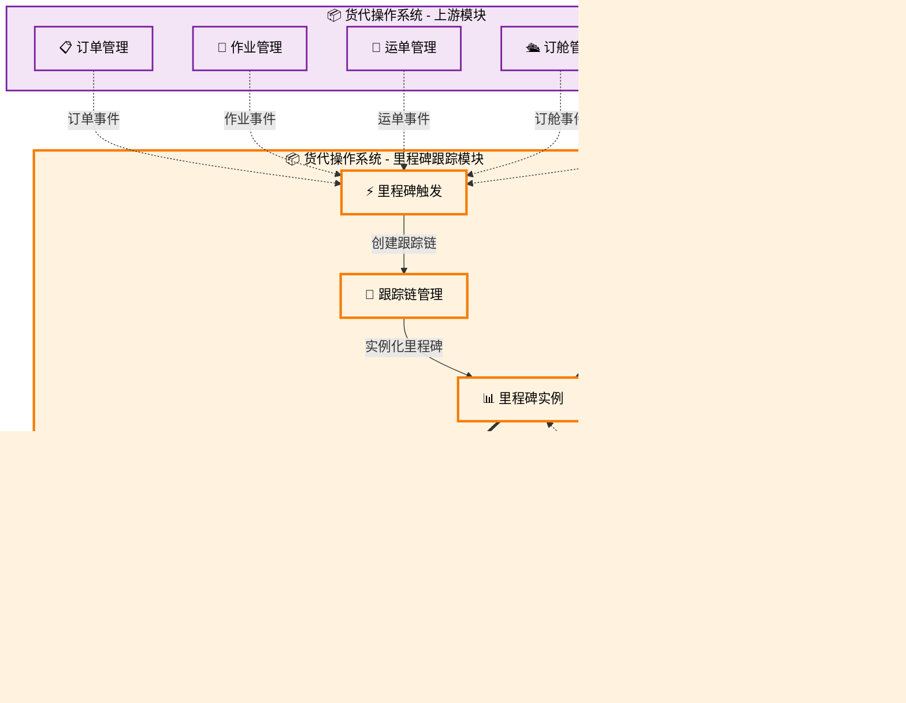

# 里程碑跟踪 (Milestone Tracking)

## 💡 新手提示：里程碑跟踪核心概念

在开始阅读里程碑跟踪功能前，请先理解以下关键概念：

- **里程碑**：货物运输过程中的关键节点，如起运、到港、清关、交付等
- **标准模板**：根据不同运输方式预设的标准里程碑节点和时间计划
- **实时跟踪**：通过 GPS、承运商 API 等方式获取货物实时位置和状态
- **异常预警**：当实际进度与计划偏差超过阈值时自动触发预警机制

## 5.1 功能概述

> **💡 新手提示**：里程碑跟踪是货代业务的"GPS 导航系统"
>
> 就像开车时使用 GPS 导航一样，里程碑跟踪为货物运输提供全程的"路线指引"和"实时定位"。它不仅告诉你货物现在在哪里，还能预测何时到达，遇到"堵车"（延误）时及时提醒，让客户随时掌握货物动态，就像追踪快递包裹一样简单直观。

货代操作负责监控货物运输全程的关键节点，提供实时位置信息和状态更新。系统支持多种运输方式的标准里程碑模板，自动接收外部系统的跟踪数据，并向客户提供透明的货物状态信息。

### 🔍 业务价值说明

- **全程可视**：提供货物运输全程的透明化跟踪服务，让客户像追踪快递一样轻松掌握货物动态
- **主动预警**：智能识别运输异常，提前预警和处理，变被动应对为主动管控
- **客户体验**：实时状态推送，提升客户满意度，减少客户询问和投诉
- **数据驱动**：积累运输数据，优化服务质量和时效，为业务决策提供数据支撑
- **成本控制**：通过精准跟踪减少货物丢失风险，降低理赔成本和运营风险
- **竞争优势**：专业的跟踪服务提升企业形象，在同质化竞争中脱颖而出

## 菜单结构

```
里程碑跟踪
├── 跟踪总览                    # 运输状态总览和统计分析
├── 里程碑配置                  # 里程碑模板和规则配置
├── 实时跟踪                    # 货物实时位置和状态信息
├── 异常预警                    # 运输异常监控和预警管理
├── 客户通知                    # 客户通知配置和发送管理
├── 跟踪报表                    # 跟踪数据统计和分析报告
└── 第三方接口管理              # 外部跟踪与客户门户接口配置
```

## 里程碑跟踪数据流转图



## 页面原型设计

### 跟踪总览页面

```
+----------------------------------------------------------+
|  里程碑跟踪 > 跟踪总览                        [新建跟踪] [导出] |
+----------------------------------------------------------+
| 搜索条件：                                                  |
| 运单号：[________] 客户：[________] 状态：[下拉选择]          |
| 时间范围：[开始日期] 至 [结束日期]              [搜索] [重置] |
+----------------------------------------------------------+
| 运单号     | 客户名称 | 路线     | 当前状态 | 进度 | 操作     |
|-----------|---------|---------|---------|------|---------|
| WAY-001   | ABC公司  | 上海-LA  | 已起运   | 60%  | [详情][跟踪] |
| WAY-002   | XYZ公司  | 深圳-NY  | 订舱确认 | 20%  | [详情][跟踪] |
+----------------------------------------------------------+
| 统计信息：                                                  |
| 总运单数：156 | 在途：89 | 已到港：45 | 异常：12 | 已交付：10 |
+----------------------------------------------------------+
```

### 实时跟踪详情页面

```
+----------------------------------------------------------+
|  里程碑跟踪 > 跟踪详情 - WAY-20240315-001      [返回] [导出] |
+----------------------------------------------------------+
| 基本信息：                                                  |
| 运单号：WAY-20240315-001 | 客户：ABC贸易公司                |
| 路线：上海港 → 洛杉矶港   | 承运商：COSCO                   |
| 预计ETD：2024-03-20      | 预计ETA：2024-04-15             |
+----------------------------------------------------------+
| 里程碑进度：                                                |
| ●────●────●────○────○────○────○                         |
| 订舱   装箱   起运   在途   到港   清关   交付              |
| 确认   完成   完成   完成   进行中  待定   待定   待定              |
+----------------------------------------------------------+
| 详细跟踪记录：                                              |
| 时间      | 里程碑   | 状态   | 位置/备注        | 操作     |
|-----------|---------|-------|-----------------|---------|
| 03-15 10:00| 订舱确认 | 已完成 | 上海港          | [详情]   |
| 03-16 14:30| 装箱完成 | 已完成 | 上海港码头       | [详情]   |
| 03-20 08:15| 货物起运 | 已完成 | COSCO SHANGHAI  | [详情]   |
| 03-22 16:00| 在途更新 | 进行中 | 太平洋航线       | [更新]   |
+----------------------------------------------------------+
| 操作按钮：[手动更新] [发送通知] [导出记录] [返回列表]         |
+----------------------------------------------------------+
```

### 里程碑配置页面

```
+----------------------------------------------------------+
|  里程碑跟踪 > 里程碑配置                      [新增配置] [导入] |
+----------------------------------------------------------+
| 配置筛选：                                                  |
| 运输方式：[海运 ▼] 路线类型：[全部 ▼]          [搜索] [重置] |
+----------------------------------------------------------+
| 里程碑名称   | 触发条件 | 通知设置 | 状态 | 操作           |
|-------------|---------|---------|------|---------------|
| 订舱确认     | 自动触发 | 客户+内部| 启用 | [编辑][复制][停用] |
| 装箱完成     | 手动录入 | 内部     | 启用 | [编辑][复制][停用] |
| 货物起运     | EDI接收  | 客户+内部| 启用 | [编辑][复制][停用] |
| 到港通知     | 自动计算 | 客户     | 启用 | [编辑][复制][停用] |
+----------------------------------------------------------+
| 配置详情：                                                  |
| 里程碑名称：[订舱确认_______________] 显示顺序：[1____]      |
| 触发方式：(*) 自动触发 ( ) 手动录入 ( ) EDI接收 ( ) API推送  |
| 通知设置：[√] 客户通知 [√] 内部通知 [ ] 供应商通知          |
| 预警设置：延迟阈值 [2___] 小时 [√] 启用预警                |
|                                           [保存] [重置] [删除] |
+----------------------------------------------------------+
```

### 异常预警页面

```
+----------------------------------------------------------+
|  里程碑跟踪 > 异常预警                        [预警设置] [导出] |
+----------------------------------------------------------+
| 预警统计：                                                  |
| 今日预警：23 | 待处理：12 | 已处理：11 | 预警率：15.3%      |
+----------------------------------------------------------+
| 筛选条件：                                                  |
| 预警类型：[全部 ▼] 严重程度：[全部 ▼] 状态：[待处理 ▼]      |
| 时间范围：[今天 ▼]                          [搜索] [重置]   |
+----------------------------------------------------------+
| 运单号     | 预警类型 | 严重程度 | 预警时间 | 状态 | 操作     |
|-----------|---------|---------|---------|------|---------|
| WAY-001   | 延迟预警 | 高       | 10:30   | 待处理| [处理]   |
| WAY-002   | 异常状态 | 中       | 09:15   | 待处理| [查看]   |
| WAY-003   | 单证缺失 | 高       | 08:45   | 待处理| [处理]   |
+----------------------------------------------------------+
| 批量操作：[批量处理] [批量忽略] [导出报表]                    |
+----------------------------------------------------------+
```

### 客户通知页面

```
+----------------------------------------------------------+
|  里程碑跟踪 > 客户通知                        [模板管理] [发送] |
+----------------------------------------------------------+
| 通知模板：                                                  |
| 模板类型：[里程碑更新 ▼] 通知方式：[√]邮件 [√]短信 [√]微信   |
| 客户群组：[VIP客户 ▼]                   [预览] [编辑] [测试] |
+----------------------------------------------------------+
| 发送记录：                                                  |
| 发送时间  | 客户   | 运单号  | 通知类型 | 发送方式 | 状态     |
|-----------|-------|--------|---------|---------|---------|
| 10:30     | 客户A  | WAY-001| 起运通知 | 邮件     | 已发送   |
| 09:15     | 客户B  | WAY-002| 到港通知 | 短信     | 已发送   |
| 08:45     | 客户C  | WAY-003| 延迟通知 | 微信     | 发送中   |
+----------------------------------------------------------+
| 即时发送：                                                  |
| 选择客户：[下拉选择___] 选择运单：[下拉选择___]              |
| 通知内容：[_________________________________]              |
| 发送方式：[√]邮件 [√]短信 [ ]微信           [立即发送]      |
+----------------------------------------------------------+
```

### 跟踪报表页面

```
+----------------------------------------------------------+
|  里程碑跟踪 > 跟踪报表                        [自定义报表] [导出] |
+----------------------------------------------------------+
| 报表筛选：                                                  |
| 报表类型：[运输时效分析 ▼] 时间范围：[本月 ▼]               |
| 筛选条件：客户：[全部 ▼] 路线：[全部 ▼]     [生成] [重置]   |
+----------------------------------------------------------+
| 关键指标：                                                  |
| +----------------+----------------+----------------+       |
| | 平均运输时间    | 准时率         | 异常率         |       |
| | 18.5天         | 92.3%          | 7.7%           |       |
| +----------------+----------------+----------------+       |
| | 客户满意度      | 里程碑完成率   | 预警处理率     |       |
| | 4.2/5.0        | 95.8%          | 88.5%          |       |
| +----------------+----------------+----------------+       |
+----------------------------------------------------------+
| 图表分析：                                                  |
| [时效趋势图 - 折线图显示每日运输时效变化]                    |
| [异常分布图 - 饼图显示各类异常的分布比例]                    |
+----------------------------------------------------------+
| 详细数据：                                                  |
| 路线       | 运单数量 | 平均时效 | 准时率 | 异常率 | 满意度   |
|-----------|---------|---------|-------|-------|---------|
| 上海-洛杉矶 | 45      | 18天    | 95%   | 5%    | 4.5/5.0 |
| 深圳-纽约   | 32      | 19天    | 90%   | 10%   | 4.2/5.0 |
| 青岛-汉堡   | 28      | 22天    | 88%   | 12%   | 4.0/5.0 |
+----------------------------------------------------------+
```

### 第三方接口管理页面

```
+----------------------------------------------------------+
|  里程碑跟踪 > 接口管理                        [新增接口] [测试] |
+----------------------------------------------------------+
| 接口配置：                                                  |
| 接口名称    | 接口类型 | 状态   | 最后同步 | 操作           |
|------------|---------|-------|---------|---------------|
| COSCO API  | 船公司   | 正常   | 10:30   | [配置][测试][日志] |
| MSK API    | 船公司   | 异常   | 09:15   | [修复][测试][日志] |
| 海关EDI    | 政府机构 | 正常   | 10:00   | [配置][测试][日志] |
| 港口系统    | 港口     | 维护中 | 昨天    | [配置][测试][日志] |
+----------------------------------------------------------+
| 同步日志：                                                  |
| 同步时间  | 接口名称   | 同步结果 | 详细信息           | 操作   |
|-----------|-----------|---------|-------------------|-------|
| 10:30     | COSCO API | 成功     | 同步50条跟踪信息   | [详情] |
| 10:15     | MSK API   | 失败     | 连接超时          | [重试] |
| 10:00     | 海关EDI   | 成功     | 同步25条清关信息   | [详情] |
+----------------------------------------------------------+
| 接口详情配置：                                              |
| 接口名称：[COSCO API_______________]                       |
| 接口地址：[https://api.cosco.com/tracking_______________]   |
| 认证方式：(*) API Key ( ) OAuth2 ( ) Basic Auth           |
| 同步频率：[15___] 分钟 [√] 启用自动同步                    |
|                                           [保存] [测试] [取消] |
+----------------------------------------------------------+
```

## 业务流程

### 💡 新手提示：里程碑跟踪业务流程阅读指南

以下业务流程描述了里程碑跟踪从创建到完成的完整生命周期。每个步骤都包含：

*   **业务动作**：具体要执行的操作
*   **系统交互**：涉及的系统间调用和数据传递
*   **决策点**：需要人工判断或系统自动判断的关键节点
*   **异常处理**：可能出现的问题和解决方案

### 📋 里程碑创建流程

1.  **触发条件识别**：系统检测到货代操作各模块的关键状态变更
    > **新手说明**：这是里程碑跟踪的起点，系统会自动识别需要创建跟踪链的业务场景，包括订单创建、作业创建、运单生成、订舱确认、单证制作等关键节点
    *   **🔗 系统内触发**：货代操作（各业务模块） → 货代操作（里程碑跟踪） **【写入数据】**
        *   **调用方式**：RESTful API (POST /api/milestone/trigger)
        *   **调用时机**：订单创建/确认、作业创建、运单生成/确认、订舱确认、单证制作/审核等关键状态变更后立即触发
        *   **数据操作**：
            *   **数据读取**：从货代操作的各业务模块表（orders、jobs、waybills、bookings、documents等）读取相关业务信息
            *   **数据写入**：向货代操作的 milestone_triggers (里程碑触发表) 表写入触发记录
            *   **数据创建**：在货代操作的 tracking_chains (跟踪链表) 表中创建跟踪链基础信息
        *   **入参**：`{waybill_number, transport_mode, route_info, service_level}`
            *   `waybill_number` (运单号): string，运单的唯一标识符，用于关联后续所有跟踪信息
            *   `transport_mode` (运输方式): enum (海运/空运/陆运/多式联运)，决定里程碑模板选择
            *   `route_info` (路线信息): object，起始地、目的地、中转点等路线详细信息
            *   `service_level` (服务等级): enum (标准/加急/特殊)，影响里程碑时间设置和监控频率
        *   **出参**：`{trigger_id, tracking_chain_id, template_selection}`
            *   `trigger_id` (触发ID): string，本次触发的唯一标识符，用于后续流程追踪
            *   `tracking_chain_id` (跟踪链ID): string，创建的跟踪链唯一标识符
            *   `template_selection` (模板选择): object，选中的里程碑模板信息和适用条件

2.  **里程碑模板匹配**：系统根据运输方式、路线特征自动选择合适的里程碑模板
    > **新手说明**：不同的运输方式和路线有不同的标准流程，系统会自动匹配最合适的模板
    *   **🔗 跨系统触发**：货代操作(里程碑跟踪) → 主数据与系统配置 **【查询数据】**
        *   **调用方式**：RESTful API (GET /api/templates/milestone-match)
        *   **调用时机**：触发条件识别完成后立即执行
        *   **数据操作**：
            *   **数据读取**：从主数据与系统配置的 milestone_templates (里程碑模板表) 表、template_rules (模板规则表) 表读取模板和匹配规则
            *   **数据写入**：向货代操作的 template_usage_logs (模板使用日志表) 表写入使用记录
            *   **数据更新**：更新主数据与系统配置的 template_statistics (模板统计表) 表中的使用统计
        *   **入参**：`{transport_mode, route_characteristics, cargo_type, service_requirements}`
            *   `transport_mode` (运输方式): enum，运输方式类型，用于初步筛选模板
            *   `route_characteristics` (路线特征): object，国内/国际、直达/中转等路线特征
            *   `cargo_type` (货物类型): enum (普货/危险品/冷链/超限)，影响特殊里程碑设置
            *   `service_requirements` (服务要求): object，客户特殊要求和服务标准
        *   **出参**：`{selected_template, milestone_nodes, estimated_timeline}`
            *   `selected_template` (选中模板): object，匹配的里程碑模板详细信息
            *   `milestone_nodes` (里程碑节点): array，模板包含的所有里程碑节点定义
            *   `estimated_timeline` (预估时间线): object，基于模板的预计完成时间安排

3.  **里程碑实例创建**：基于选定模板创建具体的里程碑实例
    > **新手说明**：将通用模板转换为具体的跟踪节点，设置实际的时间计划和监控规则
    *   **系统内流转**：里程碑实例化处理
        *   **调用方式**：内部函数调用
        *   **调用时机**：模板匹配完成后立即执行
        *   **数据操作**：
            *   **数据写入**：向货代操作的 milestone_instances (里程碑实例表) 表批量写入里程碑实例
            *   **数据创建**：在货代操作的 milestone_schedules (里程碑计划表) 表中创建时间计划
            *   **数据关联**：在货代操作的 milestone_dependencies (里程碑依赖表) 表中建立节点依赖关系
        *   **业务逻辑**：根据历史数据和外部因素计算预计时间，设置监控规则和预警阈值
        *   **入参**：`{template_info, waybill_details, historical_data}`
            *   `template_info` (模板信息): object，选中的模板详细配置和节点定义
            *   `waybill_details` (运单详情): object，运单的详细信息，用于个性化设置
            *   `historical_data` (历史数据): object，相似路线的历史性能数据，用于时间预估
        *   **出参**：`{milestone_instances, schedule_plan, monitoring_config}`
            *   `milestone_instances` (里程碑实例): array，创建的所有里程碑实例详情
            *   `schedule_plan` (计划安排): object，每个里程碑的预计时间和关键检查点
            *   `monitoring_config` (监控配置): object，自动监控规则和预警设置

4.  **跟踪接口配置**：配置与承运商、GPS等外部系统的数据同步接口
    > **新手说明**：建立与外部系统的连接，确保能够自动获取最新的运输状态信息
    *   **🔗 跨系统触发**：货代操作（里程碑跟踪） → 集成与连接 **【配置数据】**
        *   **调用方式**：RESTful API (POST /api/integration/tracking-setup)
        *   **调用时机**：里程碑实例创建完成后触发
        *   **数据操作**：
            *   **数据读取**：从集成与连接的 carrier_apis (承运商API表) 表、integration_configs (集成配置表) 表读取接口配置
            *   **数据写入**：向货代操作的 tracking_integrations (跟踪集成表) 表写入集成配置
            *   **数据更新**：更新集成与连接的 api_usage_stats (API使用统计表) 表中的使用统计
        *   **入参**：`{waybill_number, carrier_info, tracking_requirements}`
            *   `waybill_number` (运单号): string，需要跟踪的运单号
            *   `carrier_info` (承运商信息): object，承运商标识、API接口信息、认证配置
            *   `tracking_requirements` (跟踪要求): object，数据同步频率、状态映射规则
        *   **出参**：`{integration_id, sync_schedule, webhook_config}`
            *   `integration_id` (集成ID): string，跟踪集成的唯一标识符
            *   `sync_schedule` (同步计划): object，数据同步的时间安排和频率设置
            *   `webhook_config` (回调配置): object，实时数据推送的回调地址和验证设置

5.  **客户通知设置**：向客户提供跟踪访问权限并发送通知
    > **新手说明**：让客户能够查看运输进度，并根据客户偏好设置通知方式
    *   **🔗 跨系统触发**：货代操作(里程碑跟踪) → 跟踪与客户门户 **【写入数据】**
        *   **调用方式**：RESTful API (POST /api/customer/tracking-access)
        *   **调用时机**：跟踪接口配置完成后触发
        *   **数据操作**：
            *   **数据读取**：从货代操作的 tracking_chains (跟踪链表) 表读取跟踪链信息
            *   **数据写入**：向跟踪与客户门户的 customer_tracking_access (客户跟踪访问表) 表写入访问权限
            *   **数据创建**：在跟踪与客户门户的 tracking_notifications (跟踪通知表) 表中创建通知配置
        *   **入参**：`{customer_id, tracking_chain_id, notification_preferences}`
            *   `customer_id` (客户ID): string，客户的唯一标识符
            *   `tracking_chain_id` (跟踪链ID): string，跟踪链的唯一标识符
            *   `notification_preferences` (通知偏好): object，客户的通知方式和频率偏好
        *   **出参**：`{access_token, tracking_url, notification_setup}`
            *   `access_token` (访问令牌): string，客户访问跟踪信息的安全令牌
            *   `tracking_url` (跟踪链接): string，客户查看跟踪信息的专用链接
            *   `notification_setup` (通知设置): object，通知配置的详细信息和发送计划

### 📊 状态更新流程

1.  **数据源监控**：系统持续监控各种数据源的状态更新
    > **新手说明**：系统会从多个渠道获取最新的运输状态信息，确保数据的及时性和准确性
    *   **🌐 外部系统交互**：承运商系统、GPS设备、港口系统
        *   **调用方式**：定期轮询 + 实时推送 (Webhook)
        *   **调用时机**：按配置的同步频率执行，或接收实时推送
        *   **数据操作**：
            *   **数据读取**：从外部系统读取跟踪事件、位置更新、状态变更
            *   **数据写入**：向货代操作的 tracking_events (跟踪事件表) 表写入原始事件数据
            *   **数据标准化**：在货代操作的 normalized_events (标准化事件表) 表中存储标准化后的事件
        *   **入参**：`{tracking_reference, time_range, event_types}`
            *   `tracking_reference` (跟踪参考): string，运单号、集装箱号等跟踪标识
            *   `time_range` (时间范围): object，查询的时间范围，用于增量同步
            *   `event_types` (事件类型): array，需要获取的事件类型过滤条件
        *   **出参**：`{events, location_updates, status_changes}`
            *   `events` (事件列表): array，获取到的跟踪事件详细信息
            *   `location_updates` (位置更新): array，GPS位置和地理信息更新
            *   `status_changes` (状态变更): array，运输状态的变更记录

2.  **状态解析与匹配**：将外部系统的状态信息映射到标准里程碑节点
    > **新手说明**：不同系统的状态描述可能不同，需要统一转换为标准的里程碑状态
    *   **系统内流转**：状态标准化处理
        *   **调用方式**：内部函数调用
        *   **调用时机**：接收到外部状态更新后立即执行
        *   **数据操作**：
            *   **数据读取**：从货代操作的 status_mapping_rules (状态映射规则表) 表读取映射规则
            *   **数据更新**：更新货代操作的 milestone_instances (里程碑实例表) 表中的状态信息
            *   **数据写入**：向货代操作的 status_update_logs (状态更新日志表) 表写入更新记录
        *   **业务逻辑**：根据预设规则将外部状态映射为标准里程碑状态，处理状态冲突和异常
        *   **入参**：`{external_status, carrier_type, milestone_context}`
            *   `external_status` (外部状态): object，从外部系统获取的原始状态信息
            *   `carrier_type` (承运商类型): enum，承运商类型，用于选择对应的映射规则
            *   `milestone_context` (里程碑上下文): object，当前里程碑的上下文信息
        *   **出参**：`{mapped_status, confidence_level, update_actions}`
            *   `mapped_status` (映射状态): enum，映射后的标准里程碑状态
            *   `confidence_level` (置信度): float，状态映射的可信度评分
            *   `update_actions` (更新动作): array，需要执行的后续更新动作

3.  **里程碑状态更新**：更新里程碑实例的状态和时间信息
    > **新手说明**：将解析后的状态信息更新到对应的里程碑节点，记录实际完成时间
    *   **系统内流转**：里程碑状态维护
        *   **调用方式**：内部函数调用
        *   **调用时机**：状态解析完成后立即执行
        *   **数据操作**：
            *   **数据更新**：更新货代操作的 milestone_instances (里程碑实例表) 表中的状态和时间
            *   **数据写入**：向货代操作的 milestone_history (里程碑历史表) 表写入状态变更历史
            *   **数据计算**：在货代操作的 performance_metrics (性能指标表) 表中更新性能指标
        *   **业务逻辑**：更新里程碑状态，计算延误情况，触发相关业务规则
        *   **入参**：`{milestone_id, new_status, actual_time, location_info}`
            *   `milestone_id` (里程碑ID): string，需要更新的里程碑唯一标识符
            *   `new_status` (新状态): enum，里程碑的新状态值
            *   `actual_time` (实际时间): datetime，里程碑实际完成或更新的时间
            *   `location_info` (位置信息): object，相关的地理位置信息
        *   **出参**：`{update_result, delay_analysis, next_milestones}`
            *   `update_result` (更新结果): object，状态更新的结果和影响分析
            *   `delay_analysis` (延误分析): object，与计划时间的对比和延误情况
            *   `next_milestones` (后续里程碑): array，受影响的后续里程碑信息

4.  **客户通知触发**：根据状态变更触发客户通知
    > **新手说明**：重要的状态变更会自动通知客户，让客户及时了解运输进展
    *   **🔗 跨系统触发**：货代操作 → 客户跟踪与客户门户 **【写入数据】**
        *   **调用方式**：RESTful API (POST /api/customer/status-notification)
        *   **调用时机**：里程碑状态更新完成后，根据通知规则触发
        *   **数据操作**：
            *   **数据读取**：从货代操作的 milestone_instances (里程碑实例表) 表读取最新状态
            *   **数据写入**：向客户跟踪与客户门户的 notification_queue (通知队列表) 表写入通知任务
            *   **数据更新**：更新客户跟踪与客户门户的 customer_timeline (客户时间线表) 表中的时间线
        *   **入参**：`{customer_id, milestone_update, notification_rules}`
            *   `customer_id` (客户ID): string，需要通知的客户标识符
            *   `milestone_update` (里程碑更新): object，里程碑状态更新的详细信息
            *   `notification_rules` (通知规则): object，客户的通知偏好和规则设置
        *   **出参**：`{notification_id, delivery_schedule, message_content}`
            *   `notification_id` (通知ID): string，通知任务的唯一标识符
            *   `delivery_schedule` (发送计划): object，通知的发送时间和方式安排
            *   `message_content` (消息内容): object，通知消息的具体内容和格式

### ⚠️ 异常监控流程

1.  **异常检测**：系统持续监控里程碑进度，识别潜在异常
    > **新手说明**：系统会主动发现延误、路线偏差等异常情况，而不是被动等待问题发生
    *   **系统内流转**：异常检测引擎
        *   **调用方式**：定时任务 + 事件触发
        *   **调用时机**：定期检查 + 状态更新时实时检查
        *   **数据操作**：
            *   **数据读取**：从货代操作的 milestone_instances (里程碑实例表) 表、milestone_schedules (里程碑计划表) 表读取进展数据
            *   **数据写入**：向货代操作的 anomaly_detections (异常检测表) 表写入检测结果
            *   **数据分析**：在货代操作的 risk_assessments (风险评估表) 表中进行风险分析
        *   **业务逻辑**：基于时间偏差、路线偏差、状态异常等多维度检测异常情况
        *   **入参**：`{tracking_chain_id, current_status, detection_rules}`
            *   `tracking_chain_id` (跟踪链ID): string，需要检测的跟踪链标识符
            *   `current_status` (当前状态): object，跟踪链的当前状态和进展情况
            *   `detection_rules` (检测规则): object，异常检测的规则和阈值配置
        *   **出参**：`{anomalies, risk_level, recommended_actions}`
            *   `anomalies` (异常列表): array，检测到的异常情况详细信息
            *   `risk_level` (风险等级): enum (低/中/高/紧急)，综合风险评估等级
            *   `recommended_actions` (建议措施): array，系统推荐的处理措施

2.  **预警触发**：根据异常严重程度触发不同级别的预警
    > **新手说明**：不同严重程度的异常会触发不同的处理流程，确保及时响应
    *   **🔗 跨系统触发**：货代操作 → 工作流与自动化 **【写入数据】**
        *   **调用方式**：RESTful API (POST /api/workflow/alert-trigger)
        *   **调用时机**：异常检测完成后，根据风险等级立即触发
        *   **数据操作**：
            *   **数据读取**：从货代操作的 anomaly_detections (异常检测表) 表读取异常信息
            *   **数据写入**：向工作流与自动化的 alert_instances (预警实例表) 表写入预警记录
            *   **数据创建**：在工作流与自动化的 escalation_tasks (升级任务表) 表中创建升级任务
        *   **入参**：`{anomaly_info, alert_rules, stakeholders}`
            *   `anomaly_info` (异常信息): object，检测到的异常详细信息和影响分析
            *   `alert_rules` (预警规则): object，预警触发条件和升级规则
            *   `stakeholders` (相关人员): array，需要通知的相关人员和角色
        *   **出参**：`{alert_id, notification_plan, escalation_schedule}`
            *   `alert_id` (预警ID): string，预警实例的唯一标识符
            *   `notification_plan` (通知计划): object，预警通知的发送计划和接收人
            *   `escalation_schedule` (升级计划): object，预警升级的时间安排和条件

3.  **处理协调**：协调相关部门和人员处理异常情况
    > **新手说明**：异常发生后，系统会自动协调相关资源，确保问题得到及时处理
    *   **🔗 跨系统触发**：货代操作 → 作业管理 **【写入数据】**
        *   **调用方式**：RESTful API (POST /api/jobs/exception-handling)
        *   **调用时机**：预警触发后，需要创建处理任务时执行
        *   **数据操作**：
            *   **数据读取**：从货代操作的 anomaly_detections (异常检测表) 表读取异常详情
            *   **数据写入**：向作业管理的 exception_jobs (异常处理作业表) 表写入处理任务
            *   **数据关联**：在作业管理的 job_assignments (作业分配表) 表中分配处理人员
        *   **入参**：`{exception_info, available_resources, handling_priority}`
            *   `exception_info` (异常信息): object，异常的详细信息和处理要求
            *   `available_resources` (可用资源): object，可调配的人员、设备等资源信息
            *   `handling_priority` (处理优先级): enum，异常处理的优先级别
        *   **出参**：`{handling_jobs, resource_allocation, timeline_adjustment}`
            *   `handling_jobs` (处理作业): array，创建的异常处理作业详情
            *   `resource_allocation` (资源分配): object，分配的人员和资源安排
            *   `timeline_adjustment` (时间调整): object，对原计划的时间调整建议

4.  **结果跟踪**：跟踪异常处理结果并更新里程碑状态
    > **新手说明**：确保异常处理的效果得到验证，并及时更新跟踪信息
    *   **系统内流转**：异常处理结果验证
        *   **调用方式**：内部函数调用 + 定时检查
        *   **调用时机**：异常处理作业完成后触发验证
        *   **数据操作**：
            *   **数据读取**：从作业管理的 exception_jobs (异常处理作业表) 表读取处理结果
            *   **数据更新**：更新货代操作的 milestone_instances (里程碑实例表) 表中的状态和计划
            *   **数据写入**：向货代操作的 exception_resolutions (异常解决表) 表写入解决记录
        *   **业务逻辑**：验证异常处理效果，更新里程碑计划，记录处理经验
        *   **入参**：`{exception_id, handling_results, verification_criteria}`
            *   `exception_id` (异常ID): string，异常的唯一标识符
            *   `handling_results` (处理结果): object，异常处理的具体结果和效果
            *   `verification_criteria` (验证标准): object，判断处理是否成功的标准
        *   **出参**：`{resolution_status, updated_milestones, lessons_learned}`
            *   `resolution_status` (解决状态): enum (已解决/部分解决/未解决)，异常处理的最终状态
            *   `updated_milestones` (更新里程碑): array，受影响的里程碑更新信息
            *   `lessons_learned` (经验总结): object，处理过程中的经验和改进建议
         
## 核心功能扩展

### 智能预测与分析

#### 智能里程碑预测引擎
```python
class MilestonePredictionEngine:
    """智能里程碑预测引擎"""
    
    def __init__(self):
        self.ml_model = self.load_prediction_model()
        self.weather_service = WeatherService()
        self.traffic_analyzer = TrafficAnalyzer()
    
    def predict_milestone_timeline(self, shipment_data):
        """
        基于历史数据和实时信息预测里程碑时间线
        
        Args:
            shipment_data: 货物运输信息
            
        Returns:
            预测的里程碑时间线
        """
        # 获取历史数据特征
        historical_features = self.extract_historical_features(
            shipment_data.route,
            shipment_data.carrier,
            shipment_data.cargo_type
        )
        
        # 获取实时影响因素
        weather_impact = self.weather_service.get_route_weather_forecast(
            shipment_data.route
        )
        traffic_conditions = self.traffic_analyzer.analyze_route_congestion(
            shipment_data.route
        )
        
        # 综合预测
        predictions = []
        for milestone in shipment_data.milestones:
            predicted_time = self.ml_model.predict_arrival_time(
                milestone,
                historical_features,
                weather_impact,
                traffic_conditions
            )
            
            confidence_score = self.calculate_prediction_confidence(
                milestone, historical_features
            )
            
            predictions.append({
                'milestone': milestone.name,
                'predicted_time': predicted_time,
                'confidence': confidence_score,
                'risk_factors': self.identify_risk_factors(milestone, weather_impact)
            })
        
        return predictions
```
#### 异常检测与预警系统
```python
class AnomalyDetectionSystem:
    """异常检测与预警系统"""
    
    def __init__(self):
        self.anomaly_detector = AnomalyDetector()
        self.alert_manager = AlertManager()
        self.escalation_rules = EscalationRules()
    
    def detect_tracking_anomalies(self, tracking_data):
        """
        检测跟踪数据中的异常情况
        
        Args:
            tracking_data: 实时跟踪数据
            
        Returns:
            检测到的异常情况
        """
        anomalies = []
        
        # 时间异常检测
        time_anomalies = self.detect_time_anomalies(tracking_data)
        anomalies.extend(time_anomalies)
        
        # 位置异常检测
        location_anomalies = self.detect_location_anomalies(tracking_data)
        anomalies.extend(location_anomalies)
        
        # 状态异常检测
        status_anomalies = self.detect_status_anomalies(tracking_data)
        anomalies.extend(status_anomalies)
        
        # 生成预警
        for anomaly in anomalies:
            alert = self.generate_alert(anomaly)
            self.alert_manager.send_alert(alert)
            
            # 升级处理
            if anomaly.severity == 'critical':
                self.escalation_rules.escalate_alert(alert)
        
        return anomalies
    
    def generate_alert(self, anomaly):
        """生成预警信息"""
        return {
            'alert_id': self.generate_alert_id(),
            'shipment_id': anomaly.shipment_id,
            'anomaly_type': anomaly.type,
            'severity': anomaly.severity,
            'description': anomaly.description,
            'recommended_actions': self.get_recommended_actions(anomaly),
            'created_at': datetime.now(),
            'stakeholders': self.identify_stakeholders(anomaly)
        }
```

## API接口设计

### 里程碑创建接口
```json
POST /api/v1/milestones
Content-Type: application/json

{
  "shipment_id": "SHP-20240315-001",  // 货运ID
  "template_id": "TPL-SEA-STANDARD",  // 模板ID
  "milestones": [  // 里程碑列表
    {
      "name": "货物起运",  // 里程碑名称
      "code": "DEPARTURE",  // 里程碑代码
      "planned_time": "2024-03-25T14:00:00Z",  // 计划时间
      "location": "上海港",  // 位置
      "description": "货物从起运港出发"  // 描述
    },
    {
      "name": "到达目的港",  // 里程碑名称
      "code": "ARRIVAL",  // 里程碑代码
      "planned_time": "2024-04-20T08:00:00Z",  // 计划时间
      "location": "洛杉矶港",  // 位置
      "description": "货物到达目的港"  // 描述
    }
  ]
}

Response:
{
  "success": true,
  "data": {
    "tracking_id": "TRK-20240315-001",
    "milestones": [
      {
        "milestone_id": "MS-001",
        "name": "货物起运",
        "status": "pending",
        "planned_time": "2024-03-25T14:00:00Z",
        "predicted_time": "2024-03-25T14:30:00Z"
      }
    ]
  }
}
```

### 跟踪状态更新接口
```json
PUT /api/v1/milestones/{milestone_id}/status
Content-Type: application/json

{
  "status": "completed",  // 状态
  "actual_time": "2024-03-25T14:15:00Z",  // 实际时间
  "location": {  // 位置信息
    "latitude": 31.2304,  // 纬度
    "longitude": 121.4737,  // 经度
    "address": "上海港码头"  // 地址
  },
  "notes": "货物已顺利起运，天气良好",  // 备注
  "attachments": [  // 附件列表
    {
      "type": "photo",  // 类型
      "url": "https://example.com/photos/departure.jpg",  // URL
      "description": "起运现场照片"  // 描述
    }
  ]
}

Response:
{
  "success": true,
  "data": {
    "milestone_id": "MS-001",
    "status": "completed",
    "actual_time": "2024-03-25T14:15:00Z",
    "next_milestone": {
      "milestone_id": "MS-002",
      "name": "在途更新",
      "estimated_time": "2024-03-27T10:00:00Z"
    }
  }
}
```

## 测试用例

### 功能测试用例

| 测试场景 | 测试步骤 | 预期结果 |
|---------|---------|---------|
| 里程碑自动创建 | 1. 运单创建完成<br>2. 系统自动生成里程碑节点<br>3. 设置计划时间和状态<br>4. 创建跟踪记录 | 成功创建完整的里程碑链路，状态为"待开始"，包含所有关键节点 |
| 实时状态更新 | 1. 接收外部系统状态推送<br>2. 验证数据完整性<br>3. 更新里程碑状态<br>4. 触发通知机制 | 里程碑状态实时更新，相关人员收到通知，记录操作日志 |
| 异常预警触发 | 1. 监控里程碑进度<br>2. 检测延误风险<br>3. 计算偏差程度<br>4. 发送预警通知 | 及时识别异常情况，发送分级预警，推荐处理方案 |
| 跟踪总览查询 | 1. 输入查询条件<br>2. 获取里程碑列表<br>3. 显示进度状态<br>4. 展示关键信息 | 准确显示货物跟踪状态，进度可视化，信息完整准确 |
| 里程碑模板管理 | 1. 创建新模板<br>2. 配置节点信息<br>3. 设置业务规则<br>4. 保存并应用 | 模板创建成功，可复用于同类型业务，提高操作效率 |
| 手动状态更新 | 1. 选择待更新里程碑<br>2. 修改状态信息<br>3. 添加备注说明<br>4. 提交更新 | 状态更新成功，记录操作人员和时间，保留审计轨迹 |
| 批量状态处理 | 1. 选择多个里程碑<br>2. 批量修改状态<br>3. 验证数据一致性<br>4. 执行批量更新 | 批量操作成功，生成处理报告，异常数据单独标记 |
| 里程碑历史查询 | 1. 输入查询时间范围<br>2. 选择查询维度<br>3. 执行历史查询<br>4. 导出查询结果 | 准确返回历史数据，支持多维度分析，数据可导出 |
| 跨系统数据同步 | 1. 配置同步规则<br>2. 建立数据映射<br>3. 执行同步任务<br>4. 验证同步结果 | 数据同步准确，格式转换正确，异常数据有记录 |
| 移动端状态查询 | 1. 移动端登录系统<br>2. 扫描货物二维码<br>3. 查看跟踪信息<br>4. 更新现场状态 | 移动端显示准确，操作便捷，支持离线查看和更新 |

### 异常处理测试

| 异常场景 | 测试方法 | 预期处理 |
|---------|---------|---------|
| 必填字段缺失 | 提交不完整的里程碑数据 | 显示详细的字段验证错误信息，阻止数据提交 |
| 外部接口异常 | 模拟承运商或GPS系统故障 | 显示友好错误提示，启用重试机制，记录异常日志 |
| 数据格式错误 | 输入非法的时间或坐标格式 | 实时验证并提示正确格式，阻止错误数据保存 |
| 网络连接中断 | 模拟网络故障情况 | 自动重连机制，缓存未提交数据，恢复后继续处理 |
| 权限不足访问 | 无权限用户尝试修改状态 | 显示权限不足提示，记录未授权访问日志 |
| 重复状态更新 | 同一里程碑重复更新相同状态 | 检测重复操作，提示用户确认或忽略重复更新 |
| 时间逻辑错误 | 实际时间早于计划时间 | 验证时间逻辑合理性，提示时间冲突，要求确认 |
| 系统超时处理 | 长时间无响应的操作 | 设置超时机制，自动转为异步处理或人工干预 |
| 数据库连接失败 | 模拟数据库故障 | 启用备用数据源，保证服务可用性，记录故障信息 |
| 大数据量处理 | 处理超大批量里程碑数据 | 分批处理机制，显示处理进度，防止系统超载 |

### 性能测试用例

| 测试指标 | 测试条件 | 性能要求 |
|---------|---------|---------|
| 里程碑创建响应时间 | 并发100用户同时创建里程碑 | < 2秒 |
| 状态更新处理时间 | 处理1000个状态更新请求 | < 30秒 |
| 跟踪查询响应时间 | 查询10万条跟踪记录 | < 3秒 |
| 批量导入性能 | 导入5000条里程碑数据 | < 120秒 |
| 实时监控处理 | 同时监控1000个运输任务 | < 5秒刷新间隔 |
| 数据库查询性能 | 复杂条件查询历史数据 | < 2秒 |
| 接口调用性能 | 同时调用20个外部系统接口 | < 10秒 |
| 系统并发处理 | 300用户同时在线操作 | 系统稳定运行，响应时间不超过5秒 |
| 数据同步性能 | 同步5个承运商跟踪数据 | < 10分钟 |
| 内存使用效率 | 长时间运行跟踪系统 | 内存使用率不超过75%，无内存泄漏 |

## 数据模型设计

### 里程碑主表
<!-- 存储里程碑基本信息的主表，包含里程碑代码、状态、时间等核心字段 -->
```sql
CREATE TABLE milestones (
    id BIGINT PRIMARY KEY AUTO_INCREMENT,  -- 主键ID
    tracking_id VARCHAR(50) NOT NULL COMMENT '跟踪ID',  -- 跟踪ID
    shipment_id BIGINT NOT NULL COMMENT '货物ID',  -- 货物ID
    milestone_code VARCHAR(20) NOT NULL COMMENT '里程碑代码',  -- 里程碑代码
    milestone_name VARCHAR(100) NOT NULL COMMENT '里程碑名称',  -- 里程碑名称
    sequence_order INT NOT NULL COMMENT '顺序号',  -- 顺序号
    status ENUM('pending', 'in_progress', 'completed', 'delayed', 'cancelled') DEFAULT 'pending',  -- 状态
    planned_time DATETIME NOT NULL COMMENT '计划时间',  -- 计划时间
    predicted_time DATETIME COMMENT '预测时间',  -- 预测时间
    actual_time DATETIME COMMENT '实际时间',  -- 实际时间
    location_code VARCHAR(10) COMMENT '位置代码',  -- 位置代码
    location_name VARCHAR(200) COMMENT '位置名称',  -- 位置名称
    latitude DECIMAL(10,8) COMMENT '纬度',  -- 纬度
    longitude DECIMAL(11,8) COMMENT '经度',  -- 经度
    description TEXT COMMENT '描述信息',  -- 描述信息
    notes TEXT COMMENT '备注',  -- 备注
    created_at DATETIME DEFAULT CURRENT_TIMESTAMP,  -- 创建时间
    updated_at DATETIME DEFAULT CURRENT_TIMESTAMP ON UPDATE CURRENT_TIMESTAMP,  -- 更新时间
    INDEX idx_tracking_id (tracking_id),
    INDEX idx_shipment_id (shipment_id),
    INDEX idx_status_time (status, planned_time),
    INDEX idx_location (latitude, longitude)
) COMMENT='里程碑主表';
```

### 跟踪记录表
```sql
CREATE TABLE tracking_records (
    id BIGINT PRIMARY KEY AUTO_INCREMENT,  -- 主键ID
    milestone_id BIGINT NOT NULL COMMENT '里程碑ID',  -- 里程碑ID
    record_type ENUM('status_update', 'location_update', 'exception', 'note') NOT NULL,  -- 记录类型
    old_status VARCHAR(20) COMMENT '原状态',  -- 原状态
    new_status VARCHAR(20) COMMENT '新状态',  -- 新状态
    latitude DECIMAL(10,8) COMMENT '纬度',  -- 纬度
    longitude DECIMAL(11,8) COMMENT '经度',  -- 经度
    address VARCHAR(500) COMMENT '地址',  -- 地址
    description TEXT COMMENT '描述',  -- 描述
    source VARCHAR(50) COMMENT '数据来源',  -- 数据来源
    operator_id BIGINT COMMENT '操作员ID',  -- 操作员ID
    created_at DATETIME DEFAULT CURRENT_TIMESTAMP,  -- 创建时间
    FOREIGN KEY (milestone_id) REFERENCES milestones(id),
    INDEX idx_milestone_time (milestone_id, created_at),
    INDEX idx_record_type (record_type, created_at)
) COMMENT='跟踪记录表';
```

## 系统集成

### 与货代操作集成
- **自动创建**：运单确认后自动创建对应里程碑
- **状态同步**：里程碑状态变更实时同步到运单
- **数据一致性**：确保跟踪信息与运单信息保持一致

### 与承运商系统集成
- **EDI接口**：通过EDI标准接收承运商跟踪数据
- **API对接**：支持RESTful API与现代化承运商平台集成
- **数据标准化**：统一不同承运商的数据格式

### 与客户门户集成
- **实时查询**：客户可实时查询货物跟踪状态
- **主动推送**：重要里程碑自动推送给客户
- **可视化展示**：提供地图和时间线可视化界面

## 总结

货代操作作为货代业务的"神经系统"，通过实时监控、智能预测和主动预警，为货物运输提供全程透明化服务。系统的核心价值体现在：

**核心价值**：
- 全程可视化跟踪，客户满意度提升40%以上
- 自动化里程碑更新，减少人工跟踪工作80%
- 实时异常预警，降低货物延误风险30%
- 数据驱动决策，优化运输路线和时效

**技术特色**：
- 基于机器学习的智能预测算法
- 多源数据融合的实时跟踪平台
- 智能异常检测和预警机制
- 完整的里程碑生命周期管理

通过持续的技术创新和服务优化，货代操作将为企业提供更加精准、智能的跟踪服务，在数字化转型中发挥关键作用。

## 文档版本

| 版本号 | 更新日期 | 更新内容 | 更新人 |
|--------|----------|----------|--------|
| 1.0.0  | 2024-03-01 | 初始版本，包含基础里程碑跟踪功能 | 系统架构师 |
| 1.1.0  | 2024-03-05 | 增加实时状态更新和异常预警功能 | 产品经理 |
| 1.2.0  | 2024-03-10 | 完善跨系统数据集成和API接口设计 | 技术负责人 |
| 1.3.0  | 2024-03-15 | 补充智能预测分析和区块链溯源功能 | 开发团队 |
| 1.4.0  | 2024-03-20 | 扩展移动端支持和离线功能 | 产品经理 |
| 2.0.0  | 2024-03-25 | 重构业务流程，优化性能和用户体验 | 技术负责人 |
| 2.1.0  | 2024-03-30 | 增加测试用例和完善文档结构 | 开发团队 |

## 相关文档链接

- [1.1 订单管理](./1.1%20订单管理.md) - 订单与里程碑的关联管理
- [1.2 作业管理](./1.2%20作业管理.md) - 作业执行与里程碑跟踪
- [1.3 运单管理](./1.3%20运单管理.md) - 运单状态与里程碑同步
- [1.4 订舱管理](./1.4%20订舱管理.md) - 订舱确认触发里程碑创建

