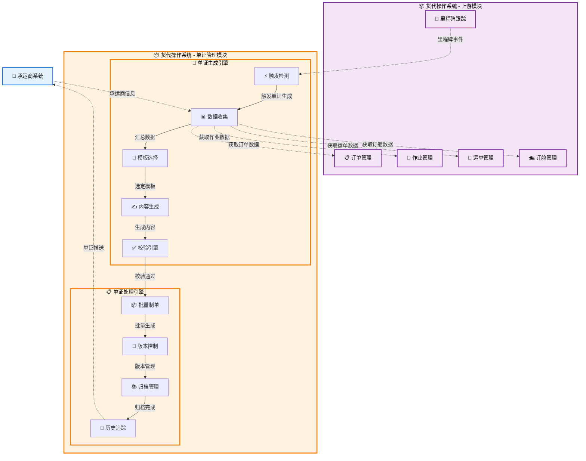

# 单证管理

## 💡 新手提示：单证管理核心概念

在开始阅读单证管理功能前，请先理解以下关键概念：

- **单证**：货运过程中的各类文件凭证，如提单、发票、装箱单等
- **电子签章**：使用数字证书对电子单证进行签名认证
- **版本控制**：管理单证的修改历史和版本变更
- **模板管理**：预设的单证格式模板，支持自动填充数据
- **合规检查**：确保单证符合各国法规和行业标准的验证过程

## 功能概述

单证管理是货代操作的重要环节，负责生成、管理和流转货运相关的各类单证文件，包括提单、发票、装箱单、原产地证等。系统支持电子单证和纸质单证的混合管理，提供单证模板配置、自动生成、电子签章、版本控制等功能。

### 🔍 业务价值说明

- **标准化制单**：统一的单证格式和生成流程，确保单证规范性
- **自动化生成**：基于运单数据自动填充单证内容，提高效率90%
- **电子化管理**：支持电子签章和在线审核，减少纸质流转80%
- **合规保障**：内置合规检查规则，确保单证符合法规要求
- **版本追溯**：完整的版本控制和修改历史，支持审计追踪
- **多语言支持**：支持中英文等多语言单证生成

### 🎯 核心功能

- **智能生成**：基于AI的单证内容智能填充和校验
- **实时协作**：多人协作编辑和审核单证
- **区块链存证**：重要单证的区块链存证和防篡改
- **OCR识别**：纸质单证的OCR识别和电子化转换
- **API集成**：与海关、银行等外部系统的API对接

## 2. 菜单结构

```
单证管理
├── 单证概览                    # 单证管理总览和快速操作
├── 单证列表                    # 显示所有单证的汇总信息
├── 单证生成                    # 创建新的单证文件
├── 单证查询                    # 多条件搜索和筛选单证
├── 单证审核                    # 对单证进行审核和确认
├── 模板管理                    # 管理单证模板和格式配置
├── 电子签章                    # 电子签章管理和证书配置
├── 版本控制                    # 单证版本管理和历史追踪
├── 单证归档                    # 单证归档和长期存储管理
├── 合规检查                    # 单证合规性检查和验证
├── 批量操作                    # 批量生成、审核、签发单证
├── 第三方接口                  # 外部系统接口管理
└── 单证统计报表                # 单证相关的统计分析报表
```


## 单证管理数据流转图




## 页面原型设计

### 单证概览页面

```
+----------------------------------------------------------+
|  单证管理 > 单证概览                          [刷新] [设置] |
+----------------------------------------------------------+
| 今日概况                                                   |
| ┌─────────────┬─────────────┬─────────────┬─────────────┐ |
| │ 待生成单证   │ 待审核单证   │ 已签发单证   │ 异常单证     │ |
| │    15       │    8        │    42       │    3        │ |
| │ [查看详情]   │ [立即审核]   │ [查看列表]   │ [处理异常]   │ |
| └─────────────┴─────────────┴─────────────┴─────────────┘ |
+----------------------------------------------------------+
| 快速操作                                                   |
| [新建提单] [新建发票] [新建装箱单] [批量生成] [模板管理]     |
+----------------------------------------------------------+
| 最近单证                                                   |
| 单证编号   | 类型   | 运单号   | 状态   | 更新时间 | 操作      |
|-----------|-------|---------|-------|---------|----------|
| DOC-001   | 提单   | WAY-001 | 已签发 | 10:30   | [查看][下载] |
| DOC-002   | 发票   | WAY-002 | 待审核 | 09:45   | [审核][编辑] |
| DOC-003   | 装箱单 | WAY-003 | 生成中 | 09:20   | [查看进度]   |
+----------------------------------------------------------+
| 统计图表                                                   |
| ┌─────────────────────────────────────────────────────┐   |
| │ 本月单证生成趋势图                                    │   |
| │ [折线图显示每日单证生成数量]                          │   |
| └─────────────────────────────────────────────────────┘   |
+----------------------------------------------------------+
```

### 单证列表页面

```
+----------------------------------------------------------+
|  单证管理 > 单证列表                          [新建单证] [导出] |
+----------------------------------------------------------+
| 搜索条件：                                                  |
| 单证编号：[________] 运单号：[________] 类型：[下拉选择]      |
| 日期范围：[开始日期] 至 [结束日期]              [搜索] [重置] |
| 状态筛选：[全部 ▼] 客户：[全部 ▼] 承运商：[全部 ▼]          |
+----------------------------------------------------------+
| 批量操作：[√] 全选 [批量审核] [批量签发] [批量下载]          |
+----------------------------------------------------------+
| [√] | 单证编号 | 类型 | 运单号   | 客户名称 | 状态 | 创建时间 | 操作 |
|-----|---------|------|---------|---------|------|---------|------|
| [√] | DOC-001 | 提单 | WAY-001 | ABC公司  | 已签发| 03-15   | [详情][编辑][下载] |
| [ ] | DOC-002 | 发票 | WAY-002 | XYZ公司  | 待审核| 03-16   | [详情][审核][编辑] |
| [√] | DOC-003 | 装箱单| WAY-003| DEF公司  | 草稿 | 03-17   | [详情][编辑][删除] |
+----------------------------------------------------------+
| 共 245 条记录，第 1/25 页    [首页][上页][下页][末页]        |
+----------------------------------------------------------+
```

### 单证生成页面

```
+----------------------------------------------------------+
|  单证管理 > 单证生成                          [保存草稿] [提交] |
+----------------------------------------------------------+
| 基本信息                                                   |
| 单证类型：(*) 提单 ( ) 发票 ( ) 装箱单 ( ) 原产地证         |
| 运单号：[下拉选择运单________________] [查看运单]            |
| 模板选择：[海运提单模板 ▼]  生成方式：[自动生成 ▼]          |
| 优先级：[普通 ▼] 截止时间：[2024-03-20 18:00]              |
+----------------------------------------------------------+
| 发货人信息                                                 |
| 公司名称：[ABC贸易有限公司________________________]         |
| 地址：[上海市浦东新区张江高科技园区___________________]      |
| 联系人：[张经理] 电话：[021-12345678]                      |
| 邮箱：[zhang@abc.com] 税号：[91310000123456789X]           |
+----------------------------------------------------------+
| 收货人信息                                                 |
| 公司名称：[XYZ TRADING LLC________________________]        |
| 地址：[123 Main St, Los Angeles, CA 90001___________]      |
| 联系人：[John Smith] 电话：[+1-213-1234567]                |
| 邮箱：[john@xyz.com] 税号：[US123456789]                   |
+----------------------------------------------------------+
| 货物信息                                                   |
| 品名：[电子产品________________________]                   |
| 数量：[100] 箱 重量：[2500] KG 体积：[45.5] CBM           |
| 包装：[纸箱] 唛头：[ABC-001] 备注：[易碎品]                |
| HS编码：[8517120000] 货值：[USD 50,000]                   |
+----------------------------------------------------------+
| 运输信息                                                   |
| 起运港：[上海港] 目的港：[洛杉矶港]                        |
| 船名：[COSCO SHANGHAI] 航次：[024E]                       |
| 开船日期：[2024-03-20] 预计到港：[2024-04-15]             |
+----------------------------------------------------------+
| 附件上传                                                   |
| [选择文件] 已上传：装箱单.pdf (2.5MB) [预览] [删除]        |
| [选择文件] 已上传：发票.pdf (1.8MB) [预览] [删除]          |
+----------------------------------------------------------+
```

### 单证查询页面

```
+----------------------------------------------------------+
|  单证管理 > 单证查询                          [高级搜索] [导出] |
+----------------------------------------------------------+
| 快速搜索：                                                  |
| 单证编号：[DOC-20240315-001_______] [搜索]                 |
+----------------------------------------------------------+
| 高级搜索条件：                                              |
| 运单号：[WAY-001______________] 客户名称：[ABC公司_______]   |
| 单证类型：[提单 ▼] 单证状态：[已签发 ▼]                    |
| 创建日期：[2024-03-01] 至 [2024-03-31]                    |
| 起运港：[上海港_____________] 目的港：[洛杉矶港____________] |
| 承运人：[COSCO____________] 船名：[COSCO SHANGHAI______]    |
| 创建人：[操作员A__________] 审核人：[审核员B____________]    |
|                                           [搜索] [重置] |
+----------------------------------------------------------+
| 搜索结果：                                                  |
| 单证编号   | 类型 | 运单号   | 客户名称 | 状态 | 创建日期 | 操作 |
|-----------|------|---------|---------|------|---------|------|
| DOC-001   | 提单 | WAY-001 | ABC公司  | 已签发| 03-15   | [详情][下载] |
| DOC-002   | 发票 | WAY-002 | XYZ公司  | 待审核| 03-16   | [详情][审核] |
| DOC-003   | 装箱单| WAY-003| DEF公司  | 草稿 | 03-17   | [详情][编辑] |
+----------------------------------------------------------+
| 共找到 35 条记录，第 1/4 页      [首页][上页][下页][末页]    |
+----------------------------------------------------------+
| 导出选项：                                                  |
| 格式：[Excel ▼] 范围：[当前页 ▼] [导出] [取消]             |
+----------------------------------------------------------+
```

### 单证审核页面

```
+----------------------------------------------------------+
|  单证管理 > 单证审核                          [批量审核] [导出] |
+----------------------------------------------------------+
| 待审核单证筛选：                                            |
| 提交日期：[2024-03-15] 至 [2024-03-20]                    |
| 单证类型：[全部 ▼] 紧急程度：[高 ▼]          [筛选] [重置] |
+----------------------------------------------------------+
| 待审核单证列表：                                            |
| [√] | 单证编号 | 类型 | 运单号   | 提交人 | 提交时间 | 操作 |
|-----|---------|------|---------|-------|---------|------|
| [√] | DOC-003 | 提单 | WAY-003 | 操作员A| 03-18 10:30| [审核] |
| [ ] | DOC-004 | 发票 | WAY-004 | 操作员B| 03-18 14:20| [审核] |
| [√] | DOC-005 | 装箱单| WAY-005| 操作员C| 03-18 16:45| [审核] |
+----------------------------------------------------------+
| 单证详情（DOC-003）：                                       |
| 类型：提单 | 运单号：WAY-003 | 客户：DEF公司               |
| 发货人：DEF公司 | 收货人：GHI TRADING                     |
| 货物：机械设备 | 重量：8,500 KG | 体积：45 CBM              |
| 路线：青岛港 → 汉堡港 | 船名：COSCO HAMBURG                |
+----------------------------------------------------------+
| 单证预览：                                                  |
| ┌─────────────────────────────────────────────────────┐   |
| │ [PDF预览区域]                                        │   |
| │ BILL OF LADING                                      │   |
| │ Shipper: DEF Company Ltd.                           │   |
| │ Consignee: GHI TRADING INC.                         │   |
| │ ...                                                 │   |
| └─────────────────────────────────────────────────────┘   |
+----------------------------------------------------------+
| 审核意见：                                                  |
| 审核结果：(*) 通过 ( ) 驳回 ( ) 需修改                      |
| 审核备注：[单证信息完整，格式规范，可以通过_________________] |
| 签章设置：[√] 需要电子签章 签章人：[审核主管 ▼]             |
|                                           [提交审核] [取消] |
+----------------------------------------------------------+
```

### 模板管理页面

```
+----------------------------------------------------------+
|  单证管理 > 模板管理                          [新建模板] [导入] |
+----------------------------------------------------------+
| 模板分类：                                                  |
| [全部] [提单模板] [发票模板] [装箱单模板] [证书模板]         |
+----------------------------------------------------------+
| 模板列表：                                                  |
| 模板名称         | 类型   | 版本 | 状态 | 更新时间 | 操作      |
|-----------------|-------|------|------|---------|----------|
| 海运提单标准模板  | 提单   | v2.1 | 启用 | 03-10   | [编辑][预览][复制] |
| 空运运单模板     | 运单   | v1.5 | 启用 | 03-08   | [编辑][预览][复制] |
| 商业发票模板     | 发票   | v3.0 | 启用 | 03-05   | [编辑][预览][复制] |
| 装箱单标准模板   | 装箱单 | v1.8 | 停用 | 02-28   | [编辑][启用][删除] |
+----------------------------------------------------------+
| 模板详情（海运提单标准模板）：                               |
| ┌─────────────────────────────────────────────────────┐   |
| │ 模板预览区域                                         │   |
| │ [显示模板的可视化设计界面]                            │   |
| │ 字段：发货人、收货人、货物描述、重量体积等             │   |
| └─────────────────────────────────────────────────────┘   |
+----------------------------------------------------------+
| 字段配置：                                                  |
| 字段名称     | 数据源       | 必填 | 格式验证 | 操作        |
|-------------|-------------|------|---------|-------------|
| 发货人名称   | 客户资料     | 是   | 文本     | [编辑][删除] |
| 货物重量     | 运单信息     | 是   | 数字     | [编辑][删除] |
| 起运港      | 订舱信息     | 是   | 选择     | [编辑][删除] |
+----------------------------------------------------------+
```

### 电子签章页面

```
+----------------------------------------------------------+
|  单证管理 > 电子签章                          [证书管理] [设置] |
+----------------------------------------------------------+
| 待签章单证：                                                |
| 单证编号   | 类型 | 运单号   | 审核状态 | 提交时间 | 操作      |
|-----------|------|---------|---------|---------|----------|
| DOC-006   | 提单 | WAY-006 | 已通过   | 03-19   | [签章][详情] |
| DOC-007   | 发票 | WAY-007 | 已通过   | 03-19   | [签章][详情] |
+----------------------------------------------------------+
| 签章操作（DOC-006）：                                       |
| 单证信息：提单 | WAY-006 | ABC公司                         |
| 签章类型：(*) 公司签章 ( ) 个人签章                         |
| 证书选择：[公司电子证书 ▼]                                  |
| 签章位置：[右下角 ▼] 签章样式：[标准样式 ▼]                 |
+----------------------------------------------------------+
| 签章预览：                                                  |
| ┌─────────────────────────────────────────────────────┐   |
| │ [单证预览，显示签章位置]                              │   |
| │                                                     │   |
| │                           [电子签章图标]             │   |
| │                           ABC货代公司                │   |
| │                           2024-03-19                │   |
| └─────────────────────────────────────────────────────┘   |
+----------------------------------------------------------+
| 签章验证：                                                  |
| 证书状态：[有效] 有效期：2024-12-31                         |
| 签章权限：[已验证] 操作人：[签章主管]                       |
|                                           [确认签章] [取消] |
+----------------------------------------------------------+
```

### 版本控制页面

```
+----------------------------------------------------------+
|  单证管理 > 版本控制                          [版本对比] [导出] |
+----------------------------------------------------------+
| 单证选择：                                                  |
| 单证编号：[DOC-001______________] [查询]                   |
+----------------------------------------------------------+
| 版本历史（DOC-001）：                                       |
| 版本号 | 修改时间      | 修改人   | 修改说明     | 操作        |
|-------|--------------|---------|-------------|-------------|
| v1.3  | 03-19 15:30  | 操作员A  | 更新收货地址 | [查看][回滚] |
| v1.2  | 03-18 10:20  | 操作员B  | 修正货物重量 | [查看][回滚] |
| v1.1  | 03-17 14:15  | 操作员A  | 初始创建     | [查看]      |
+----------------------------------------------------------+
| 版本对比：                                                  |
| 对比版本：[v1.2 ▼] 与 [v1.3 ▼]              [开始对比]     |
+----------------------------------------------------------+
| 差异显示：                                                  |
| ┌─────────────────────────────────────────────────────┐   |
| │ [版本差异显示区域]                                    │   |
| │ 收货人地址：                                          │   |
| │ - v1.2: 123 Main St, LA, CA 90001                   │   |
| │ + v1.3: 123 Main Street, Los Angeles, CA 90001      │   |
| │                                                     │   |
| │ 货物重量：                                            │   |
| │ - v1.2: 2400 KG                                     │   |
| │ + v1.3: 2500 KG                                     │   |
| └─────────────────────────────────────────────────────┘   |
+----------------------------------------------------------+
| 操作按钮：[回滚版本] [导出版本] [版本备注] [关闭]             |
+----------------------------------------------------------+
```

### 单证归档页面

```
+----------------------------------------------------------+
|  单证管理 > 单证归档                          [批量归档] [导出] |
+----------------------------------------------------------+
| 搜索条件：                                                  |
| 归档编号：[ARCH-2024-001____] 单证编号：[________________]   |
| 归档日期：[2024-01-01] 至 [2024-12-31]          [搜索] [重置] |
| 状态：[已归档 ▼] 保管期限：[10年 ▼]                         |
+----------------------------------------------------------+
| 归档列表：                                                  |
| [√] | 归档编号 | 单证编号 | 类型 | 归档日期 | 位置     | 状态 | 操作 |
|-----|---------|---------|------|---------|---------|------|------|
| [√] | ARCH-001| DOC-001 | 提单 | 2024-03-20| A区-01-05| 正常 | [查看][借阅] |
| [ ] | ARCH-002| DOC-002 | 发票 | 2024-03-21| B区-02-03| 借出 | [查看][归还] |
+----------------------------------------------------------+
| 借阅记录（ARCH-002）：                                       |
| 借阅人：[张三] 借阅时间：[2024-03-25] 预计归还：[2024-03-30]   |
+----------------------------------------------------------+
```

### 合规检查页面

```
+----------------------------------------------------------+
|  单证管理 > 合规检查                          [规则配置] [立即检查] |
+----------------------------------------------------------+
| 待检查单证：                                                |
| 单证编号：[DOC-008] 类型：[提单] 目的国：[美国]               |
| 检查状态：[检查中...] 进度：[======= 70% ]                  |
+----------------------------------------------------------+
| 检查结果（DOC-008）：                                       |
| 总体风险等级：[中风险]                                      |
| ┌─────────────────────────────────────────────────────┐   |
| │ [!] 警告：收货人地址格式不符合AMS要求                    │   |
| │     建议：请补全邮编和州名                              │   |
| │ [x] 错误：缺少HS编码                                    │   |
| │     建议：请在货物信息中补充6位HS编码                    │   |
| │ [√] 通过：敏感词筛查                                    │   |
| └─────────────────────────────────────────────────────┘   |
+----------------------------------------------------------+
| 历史检查记录：                                              |
| 时间        | 单证    | 结果   | 风险等级 | 操作           |
|------------|---------|--------|---------|----------------|
| 03-19 10:00| DOC-006 | 通过   | 低风险   | [查看报告]      |
| 03-19 09:30| DOC-005 | 未通过 | 高风险   | [查看报告]      |
+----------------------------------------------------------+
```

### 批量操作页面

```
+----------------------------------------------------------+
|  单证管理 > 批量操作                          [查看任务] [设置] |
+----------------------------------------------------------+
| 操作类型：                                                  |
| (*) 批量生成 ( ) 批量审核 ( ) 批量签发 ( ) 批量打印           |
+----------------------------------------------------------+
| 任务配置：                                                  |
| 1. 选择数据源：[导入Excel文件...] 或 [选择系统运单...]         |
|    已选：25个运单                                           |
| 2. 选择模板：[海运提单通用模板 ▼]                            |
| 3. 生成设置：[√] 自动合并同收发货人  [√] 生成后自动校验        |
|                                            [开始执行]       |
+----------------------------------------------------------+
| 执行进度：                                                  |
| 总体进度：[==================== 100% ] 完成                |
| 成功：23  失败：2                                           |
| ┌─────────────────────────────────────────────────────┐   |
| │ [成功] WAY-001 -> 生成 DOC-101                          │   |
| │ [成功] WAY-002 -> 生成 DOC-102                          │   |
| │ [失败] WAY-003 -> 缺少发货人信息                         │   |
| └─────────────────────────────────────────────────────┘   |
|                                            [下载结果报告]   |
+----------------------------------------------------------+
```

### 第三方接口页面

```
+----------------------------------------------------------+
|  单证管理 > 第三方接口                        [接口配置] [日志] |
+----------------------------------------------------------+
| 接口状态概览：                                              |
| [海关总署API] [正常]  [Maersk订舱] [异常]  [银行结算] [正常]   |
+----------------------------------------------------------+
| 接口列表：                                                  |
| 接口名称       | 服务商   | 类型   | 状态 | 调用次数 | 成功率 |
|---------------|---------|--------|------|---------|-------|
| 舱单发送       | US Customs| EDI    | 正常 | 1,250   | 99.8% |
| 电子提单上传    | CargoX    | API    | 正常 | 500     | 100%  |
| 汇率获取       | 汇丰银行   | API    | 正常 | 3,000   | 99.9% |
+----------------------------------------------------------+
| 接口监控（舱单发送）：                                       |
| ┌─────────────────────────────────────────────────────┐   |
| │ [响应时间趋势图]                                      │   |
| │ 平均耗时：250ms                                       │   |
| └─────────────────────────────────────────────────────┘   |
| 最近调用日志：                                              |
| 10:00:01 [INFO] Send manifest data for WAY-001... Success |
| 09:55:23 [ERROR] Connection timeout... Retrying           |
+----------------------------------------------------------+
```

### 单证统计报表页面

```
+----------------------------------------------------------+
|  单证管理 > 统计报表                          [导出PDF] [设置] |
+----------------------------------------------------------+
| 统计维度：                                                  |
| 时间：[本月 ▼] 部门：[操作一部 ▼] 客户：[全部 ▼]              |
+----------------------------------------------------------+
| 关键指标：                                                  |
| ┌─────────────┬─────────────┬─────────────┬─────────────┐ |
| │ 制单总量     │ 自动生成率   │ 一次审核通过率 │ 平均耗时     │ |
| │    1,250    │    85%      │    92%      │   15 min    │ |
| └─────────────┴─────────────┴─────────────┴─────────────┘ |
+----------------------------------------------------------+
| 图表分析：                                                  |
| ┌───────────────────────┐  ┌───────────────────────┐      |
| │ 单证类型分布            │  │ 每日制单量趋势            │      |
| │ [饼图]                 │  │ [柱状图]                 │      |
| │ 提单 45% 发票 30% ...   │  │                         │      |
| └───────────────────────┘  └───────────────────────┘      |
+----------------------------------------------------------+
| 详细数据：                                                  |
| 日期       | 制单量 | 自动生成 | 审核通过 | 异常数 | 详情      |
|-----------|-------|---------|---------|-------|-----------|
| 2024-03-20| 120   | 100     | 115     | 5     | [查看]    |
| 2024-03-19| 115   | 95      | 110     | 5     | [查看]    |
+----------------------------------------------------------+
```

## 业务流程

### 💡 新手提示：单证管理业务流程阅读指南

以下业务流程描述了单证从生成到签发的完整生命周期。每个步骤都包含：

*   **业务动作**：具体要执行的操作
*   **系统交互**：涉及的系统间调用和数据传递
*   **决策点**：需要人工判断或系统自动判断的关键节点
*   **异常处理**：可能出现的问题和解决方案

### 📋 提单自动生成流程

1. **触发条件检测**：货物已起运，里程碑状态为"DEPARTED"时自动触发单证生成
    > **新手说明**：这是单证生成的起点，系统监控货物运输状态，确保在合适时机生成单证
    *   **🔗 系统内触发：**：货代操作（运单管理） → 货代操作（单证管理） **【写入数据】**
        *   **调用方式**：RESTful API (POST /api/document/trigger-generation)
        *   **调用时机**：货物起运状态确认后立即触发
        *   **数据操作**：
            *   **数据读取**：从货代操作（运单管理） 的 milestone_tracking（货物起运状态信息） 表读取货物起运状态信息
            *   **数据写入**：向货代操作（单证管理） 的 document_generation_queue（单证生成队列） 表写入生成任务
            *   **数据更新**：更新货代操作（单证管理） 的 document_status（单证状态） 表中的触发状态
        *   **入参**：`{milestone_status, waybill_no, departure_confirmation, trigger_conditions}`
            *   `milestone_status` (里程碑状态): enum (DEPARTED/LOADED/IN_TRANSIT)，当前货物运输的里程碑状态
            *   `waybill_no` (运单号): string，唯一标识运单的编号，用于关联相关业务数据
            *   `departure_confirmation` (起运确认信息): object，包含起运时间、地点、承运商等详细确认信息
            *   `trigger_conditions` (触发条件): object，包含触发单证生成的具体条件和规则配置
        *   **出参**：`{document_generation_trigger, template_selection_criteria, generation_priority, estimated_completion}`
            *   `document_generation_trigger` (单证生成触发器): boolean，表示是否成功触发单证生成流程
            *   `template_selection_criteria` (模板选择条件): object，包含选择合适单证模板的条件参数
            *   `generation_priority` (生成优先级): enum (高/中/低)，基于业务紧急程度确定的生成优先级
            *   `estimated_completion` (预计完成时间): datetime，预估的单证生成完成时间

2. **数据收集**：从各系统收集生成单证所需的完整数据
    > **新手说明**：这是数据准备阶段，系统自动从相关模块收集运单、船期、客户、货物等信息
    *   **🔗 系统内触发：**：货代操作（单证管理） → 货代操作（运单管理） **【读取数据】**
        *   **调用方式**：RESTful API (GET /api/waybill/details)
        *   **调用时机**：单证生成流程启动后，首先获取运单基础数据
        *   **数据操作**：
            *   **数据读取**：从货代操作（运单管理） 的 waybill（运单表） 表、waybill_details（运单详情表） 表读取运单基本信息和运单详情信息
            *   **数据缓存**：在货代操作（单证管理） 的 temp_data_cache（临时数据缓存） 表中临时存储获取的数据
            *   **数据验证**：验证运单数据的完整性和有效性
        *   **入参**：`{waybill_no, data_requirements, field_mapping, data_validation_level}`
            *   `waybill_no` (运单号): string，用于查询特定运单信息的唯一标识符
            *   `data_requirements` (数据需求): array，指定需要获取的数据字段清单和优先级
            *   `field_mapping` (字段映射): object，定义运单数据字段与单证模板字段的映射关系
            *   `data_validation_level` (数据验证级别): enum (基础/标准/严格)，数据完整性验证的严格程度
        *   **出参**：`{waybill_data, cargo_details, transport_info, data_completeness}`
            *   `waybill_data` (运单数据): object，包含运单的基本信息、发货人、收货人等核心数据
            *   `cargo_details` (货物详情): array，包含货物的详细描述、规格、数量等信息
            *   `transport_info` (运输信息): object，包含运输方式、路线、承运商等运输相关信息
            *   `data_completeness` (数据完整性): object，包含数据完整性评分和缺失字段清单

3. **单证生成**：根据收集的数据和选定模板生成完整的单证文件
    > **新手说明**：这是核心生成阶段，系统智能选择模板、填充数据、生成编号并创建PDF文件
    *   **🔗 跨系统触发**：货代操作（单证管理） → 主数据与系统配置（模板管理） **【读取数据】**
        *   **调用方式**：RESTful API (GET /api/template/select)
        *   **调用时机**：收集完所有必要数据后，根据业务规则选择合适的模板
        *   **数据操作**：
            *   **数据读取**：从主数据与系统配置的 template_master（模板主表） 表、template_rules（模板规则） 表读取模板信息
            *   **数据匹配**：根据承运商、单证类型、客户偏好等条件匹配最适合的模板
            *   **数据缓存**：将选中的模板信息缓存到货代操作（单证管理） 的 template_cache（模板缓存） 表中
        *   **入参**：`{document_type, carrier_requirements, business_rules, customer_preferences}`
            *   `document_type` (单证类型): string，如"BILL_OF_LADING"表示提单类型
            *   `carrier_requirements` (承运商要求): object，包含承运商对单证格式的特殊要求
            *   `business_rules` (业务规则): object，包含公司内部的单证生成规则
            *   `customer_preferences` (客户偏好): object，包含客户对单证格式的偏好设置
        *   **出参**：`{template_id, template_metadata, field_mappings, rendering_rules}`
            *   `template_id` (模板ID): string，选中模板的唯一标识符
            *   `template_metadata` (模板元数据): object，包含模板的基本信息和属性
            *   `field_mappings` (字段映射): object，定义数据字段与模板字段的映射关系
            *   `rendering_rules` (渲染规则): object，包含模板渲染的具体规则和条件

4. **审核流程**：对生成的单证进行质量审核和合规性检查
    > **新手说明**：这是质量保证阶段，系统根据审核策略自动判断是否需要人工审核，支持自动审核、加急审核和标准审核等多种模式
    *   **🔗 跨系统触发**：货代操作（单证管理） → 工作流与自动化 **【条件性写入数据】**
        *   **调用方式**：RESTful API (POST /api/approval/evaluate-strategy)
        *   **调用时机**：PDF文件生成完成后，首先进行审核策略评估，根据评估结果决定后续流程
        *   **调用条件**：仅当审核策略评估结果为需要人工审核时才调用审批权限系统
        *   **数据操作**：
            *   **策略评估**：从审核策略配置中读取规则，评估单证是否满足自动审核条件
            *   **条件性写入**：仅当需要人工审核时，向工作流与自动化的 approval_workflow（审批工作流） 表写入审核任务
            *   **状态更新**：根据审核策略结果更新单证状态（"自动通过"、"待审核"或"加急审核"）
        *   **入参**：`{document_info, customer_info, risk_assessment, approval_strategy}`
            *   `document_info` (单证信息): object，包含单证类型、金额、模板类型等基本信息
            *   `customer_info` (客户信息): object，包含客户等级、信用状况、优先级等信息
            *   `risk_assessment` (风险评估): object，包含合规状态、风险等级等评估结果
            *   `approval_strategy` (审核策略): object，包含审核规则和条件配置
        *   **出参**：`{strategy_result, workflow_type, auto_approved, manual_review_required}`
            *   `strategy_result` (策略结果): string，审核策略评估结果（AUTO_APPROVE/EXPEDITED/STANDARD）
            *   `workflow_type` (工作流类型): string，确定的审核流程类型
            *   `auto_approved` (自动审核通过): boolean，是否已自动审核通过
            *   `manual_review_required` (需要人工审核): boolean，是否需要启动人工审核流程

5. **电子签章**：对审核通过的单证进行数字签名和正式签发
    > **新手说明**：这是最终签发阶段，系统使用数字证书对单证进行电子签章，确保法律效力
    *   **🔗 跨系统触发**：货代操作（单证管理） → 安全与审计（电子签章） **【更新数据】**
        *   **调用方式**：RESTful API (POST /api/signature/apply)
        *   **调用时机**：审核通过后（包括自动审核通过或人工审核通过），立即执行电子签章操作
        *   **数据操作**：
            *   **数据读取**：从货代系统（单证管理）的 document_status（单证状态） 表读取审核结果状态，支持多种审核通过状态（"自动通过"、"人工审核通过"等）
            *   **数据处理**：使用数字证书对单证进行电子签章
            *   **数据更新**：更新货代系统（单证管理）的 document_status（单证状态） 表，将状态更改为"已签发"
            *   **数据存储**：将签章后的单证文件存储并生成新的访问链接
        *   **入参**：`{document_id, approval_status, certificate_info, signature_settings}`
            *   `document_id` (单证ID): string，需要签章的单证标识符
            *   `approval_status` (审核状态): string，审核通过的具体状态（AUTO_APPROVED/MANUAL_APPROVED）
            *   `certificate_info` (证书信息): object，包含用于签章的数字证书信息
            *   `signature_settings` (签章设置): object，定义签章的位置、样式等设置
        *   **出参**：`{signed_document_url, signature_verification, issuance_status, legal_validity}`
            *   `signed_document_url` (签章后单证URL): string，签章后单证文件的访问地址
            *   `signature_verification` (签章验证): object，包含签章的验证信息和有效性
            *   `issuance_status` (签发状态): object，表示单证签发的最终状态
            *   `legal_validity` (法律效力): object，包含单证法律效力的确认信息

### 📋 单证审核管理流程

1. **审核任务分配**：根据单证类型和审核规则自动分配审核人员
    > **新手说明**：这是审核流程的起始阶段，系统智能分配合适的审核人员，确保审核效率和质量
    *   **🔗 跨系统触发**：货代操作（单证管理） → 工作流与自动化 **【写入数据】**
        *   **调用方式**：RESTful API (POST /api/approval/assign-reviewer)
        *   **调用时机**：单证提交审核时自动触发
        *   **数据操作**：
            *   **数据读取**：从货代系统（单证管理）的 document_master（单证主表） 表、审核规则配置表读取单证信息和审核规则
            *   **数据写入**：向工作流与自动化的 approval_tasks（审批任务） 表写入分配的审核任务
            *   **数据更新**：更新审核人员工作负载统计表，平衡工作分配
        *   **入参**：`{document_info, assignment_rules, reviewer_availability, priority_settings}`
            *   `document_info` (单证信息): object，包含单证的基本信息和审核要求
            *   `assignment_rules` (分配规则): object，定义审核人员分配的规则和条件
            *   `reviewer_availability` (审核人员可用性): array，当前可用的审核人员列表和工作负载
            *   `priority_settings` (优先级设置): object，定义不同类型单证的审核优先级
        *   **出参**：`{assigned_reviewer, review_deadline, priority_level, workflow_id}`
            *   `assigned_reviewer` (分配的审核员): object，包含审核员的详细信息和联系方式
            *   `review_deadline` (审核截止时间): datetime，审核任务的截止时间
            *   `priority_level` (优先级): enum (高/中/低)，审核任务的优先级别
            *   `workflow_id` (工作流ID): string，审核工作流的唯一标识符

2. **审核执行**：审核人员对单证进行详细审核和质量检查
    > **新手说明**：这是核心审核阶段，审核人员使用专业工具对单证进行全面检查
    *   **📝 内部数据操作**：货代操作（单证管理） **【更新数据】**
        *   **调用方式**：Web界面操作 (PUT /api/document/review)
        *   **调用时机**：审核人员开始审核时
        *   **数据操作**：
            *   **数据读取**：从货代系统（单证管理）读取完整的单证信息和相关资料
            *   **数据写入**：记录审核过程和审核意见到 review_records（审核记录） 表
            *   **数据更新**：更新单证状态和审核进度到 document_status（单证状态） 表
        *   **入参**：`{review_task, document_content, review_checklist, reviewer_tools}`
            *   `review_task` (审核任务): object，包含待审核的任务信息和要求
            *   `document_content` (单证内容): object，完整的单证数据和附件信息
            *   `review_checklist` (审核清单): array，审核检查项目列表和标准
            *   `reviewer_tools` (审核工具): object，提供给审核人员的专业工具和资源
        *   **出参**：`{review_result, review_comments, approval_status, quality_score}`
            *   `review_result` (审核结果): object，包含审核的最终结果和详细评估
            *   `review_comments` (审核意见): string，详细的审核意见和改进建议
            *   `approval_status` (审批状态): enum (通过/驳回/需修改)，审核的最终状态
            *   `quality_score` (质量评分): number，单证质量的量化评分

3. **审核结果处理**：根据审核结果执行相应的后续操作和流程
    > **新手说明**：这是审核流程的收尾阶段，系统根据审核结果自动执行后续操作
    *   **🔗 跨系统触发**：货代操作（单证管理） → 消息通知系统 **【写入数据】**
        *   **调用方式**：RESTful API (POST /api/notification/send)
        *   **调用时机**：审核人员提交审核结果后
        *   **数据操作**：
            *   **数据读取**：从审核结果表（review_records）读取审核结论和处理要求
            *   **数据写入**：根据审核结果更新货代系统（单证管理）的 document_master（单证主表） 表
            *   **数据通知**：向消息通知系统发送审核结果通知
        *   **入参**：`{review_result, document_id, processing_rules, notification_settings}`
            *   `review_result` (审核结果): object，审核的最终结果和处理要求
            *   `document_id` (单证ID): string，被审核单证的唯一标识符
            *   `processing_rules` (处理规则): object，不同审核结果的处理规则和流程
            *   `notification_settings` (通知设置): object，通知的接收人和方式设置
        *   **出参**：`{next_action, notification_sent, status_updated, process_completion}`
            *   `next_action` (下一步操作): string，根据审核结果确定的下一步操作
            *   `notification_sent` (通知发送状态): boolean，是否成功发送通知
            *   `status_updated` (状态更新): boolean，单证状态是否成功更新
            *   `process_completion` (流程完成度): object，整个审核流程的完成情况

### 📋 模板管理流程

1. **模板创建**：创建新的单证模板和字段配置
    > **新手说明**：这是模板设计阶段，用户使用可视化工具创建符合业务需求的单证模板
    *   **🔗 跨系统触发**：货代操作（单证管理） → 主数据系统配置 **【写入数据】**
        *   **调用方式**：RESTful API (POST /api/template/create)
        *   **调用时机**：用户创建新模板时
        *   **数据操作**：
            *   **数据写入**：向主数据系统配置的 template_master（模板主表） 表写入新模板信息
            *   **数据存储**：保存模板设计文件和配置信息到文件存储系统
            *   **数据验证**：验证模板格式和字段配置的正确性和完整性
        *   **入参**：`{template_design, field_definitions, template_metadata, validation_rules}`
            *   `template_design` (模板设计): object，包含模板的可视化设计信息和布局
            *   `field_definitions` (字段定义): array，模板中各字段的定义、类型和验证规则
            *   `template_metadata` (模板元数据): object，模板的基本信息、分类和使用范围
            *   `validation_rules` (验证规则): object，模板和字段的验证规则和约束条件
        *   **出参**：`{template_id, validation_result, creation_status, template_version}`
            *   `template_id` (模板ID): string，新创建模板的唯一标识符
            *   `validation_result` (验证结果): object，模板验证的结果和错误信息
            *   `creation_status` (创建状态): enum (成功/失败/部分成功)，模板创建的状态
            *   `template_version` (模板版本): string，模板的初始版本号

2. **模板版本管理**：管理模板的版本变更和历史记录
    > **新手说明**：这是版本控制阶段，系统自动管理模板版本，支持版本对比和回滚操作
    *   **🔗 跨系统触发**：货代操作（单证管理） → 主数据系统配置 **【更新数据】**
        *   **调用方式**：RESTful API (PUT /api/template/version)
        *   **调用时机**：模板内容发生变更时
        *   **数据操作**：
            *   **数据读取**：从主数据系统配置的 template_master（模板主表） 读取当前模板版本和历史记录
            *   **数据写入**：创建新的模板版本记录到 template_versions（模板版本） 表
            *   **数据备份**：备份旧版本模板数据到版本存储系统
        *   **入参**：`{template_id, change_description, updated_content, version_settings}`
            *   `template_id` (模板ID): string，需要版本管理的模板标识符
            *   `change_description` (变更说明): string，本次变更的详细说明和原因
            *   `updated_content` (更新内容): object，模板的更新内容和修改项
            *   `version_settings` (版本设置): object，版本管理的配置和策略
        *   **出参**：`{version_number, change_log, backup_status, rollback_available}`
            *   `version_number` (版本号): string，新版本的版本号
            *   `change_log` (变更日志): object，详细的变更记录和对比信息
            *   `backup_status` (备份状态): boolean，旧版本是否成功备份
            *   `rollback_available` (回滚可用性): boolean，是否支持回滚到此版本

### 📋 电子签章流程

1. **数字证书验证**：验证数字证书的有效性和签章权限
    > **新手说明**：这是安全验证阶段，系统严格验证数字证书确保签章的法律效力
    *   **🔗 跨系统触发**：货代操作（单证管理） → 安全与审计 **【读取数据】**
        *   **调用方式**：RESTful API (GET /api/security/verify-certificate)
        *   **调用时机**：执行电子签章前进行证书验证
        *   **数据操作**：
            *   **数据读取**：从安全与审计系统的 certificate_store（证书存储） 表读取证书信息
            *   **数据验证**：验证证书的有效期、权限和完整性
            *   **数据记录**：记录证书验证的结果和过程到 security_logs（安全日志） 表
        *   **入参**：`{certificate_id, signing_authority, validation_rules, security_level}`
            *   `certificate_id` (证书ID): string，需要验证的数字证书标识符
            *   `signing_authority` (签章权限): object，签章所需的权限要求和级别
            *   `validation_rules` (验证规则): object，证书验证的规则和安全标准
            *   `security_level` (安全级别): enum (标准/高级/最高)，验证的安全级别要求
        *   **出参**：`{certificate_status, authority_check, expiry_date, security_rating}`
            *   `certificate_status` (证书状态): enum (有效/过期/吊销/暂停)，证书的有效性状态
            *   `authority_check` (权限检查): boolean，是否具有所需的签章权限
            *   `expiry_date` (到期日期): datetime，证书的到期时间
            *   `security_rating` (安全评级): object，证书的安全评级和风险评估

2. **签章执行**：对单证执行电子签章操作
    > **新手说明**：这是签章操作阶段，系统使用验证通过的数字证书对单证进行加密签章
    *   **🔗 跨系统触发**：货代操作（单证管理） → 安全与审计（电子签章）-> 文档与电子单证 **【更新数据】**
        *   **调用方式**：RESTful API (POST /api/document/sign)
        *   **调用时机**：数字证书验证通过后
        *   **数据操作**：
            *   **数据读取**：从货代操作（单证管理） 读取待签章的单证文件
            *   **数据处理**：使用数字证书对单证进行加密签章处理
            *   **数据存储**：保存签章后的单证文件到文档与电子单证的 document_store（文档存储） 表
        *   **入参**：`{document_file, certificate_data, signature_config, timestamp_settings}`
            *   `document_file` (单证文件): object，需要签章的单证文件信息和内容
            *   `certificate_data` (证书数据): object，用于签章的数字证书数据和密钥
            *   `signature_config` (签章配置): object，签章的位置、样式和格式配置
            *   `timestamp_settings` (时间戳设置): object，时间戳服务的配置和要求
        *   **出参**：`{signed_document, signature_info, signing_timestamp, file_hash}`
            *   `signed_document` (签章后单证): object，完成签章的单证文件信息
            *   `signature_info` (签章信息): object，签章的详细信息和验证数据
            *   `signing_timestamp` (签章时间戳): datetime，签章操作的精确时间戳
            *   `file_hash` (文件哈希): string，签章后文件的哈希值用于完整性验证

3. **签章验证**：验证电子签章的有效性和完整性
    > **新手说明**：这是验证确认阶段，系统验证签章的完整性确保单证未被篡改
    *   **🔗 跨系统触发**：货代操作（单证管理） → 安全与审计（电子签章） **【写入数据】**
        *   **调用方式**：RESTful API (POST /api/security/verify-signature)
        *   **调用时机**：签章操作完成后或需要验证签章时
        *   **数据操作**：
            *   **数据读取**：从单证文件中提取签章信息和验证数据
            *   **数据验证**：验证签章的完整性和有效性
            *   **数据记录**：记录验证结果和过程到安全审计系统
        *   **入参**：`{signed_document, verification_rules, security_requirements, audit_settings}`
            *   `signed_document` (签章后单证): object，需要验证的签章单证
            *   `verification_rules` (验证规则): object，签章验证的规则和标准
            *   `security_requirements` (安全要求): object，验证的安全要求和标准
            *   `audit_settings` (审计设置): object，审计记录的配置和要求
        *   **出参**：`{verification_result, integrity_check, signature_details, audit_record}`
            *   `verification_result` (验证结果): boolean，签章是否有效和可信
            *   `integrity_check` (完整性检查): boolean，单证是否完整未被篡改
            *   `signature_details` (签章详情): object，签章的详细信息和技术参数
            *   `audit_record` (审计记录): object，完整的验证过程审计记录

## 核心功能扩展

### 智能单证生成

#### AI内容填充

```python
# AI智能内容填充示例
import openai
from typing import Dict, Any

class AIDocumentFiller:
    def __init__(self, api_key: str):
        self.client = openai.OpenAI(api_key=api_key)
    
    def intelligent_fill(self, template_data: Dict[str, Any], 
                        source_data: Dict[str, Any]) -> Dict[str, Any]:
        """
        使用AI智能填充单证内容
        """
        prompt = f"""
        基于以下运输数据，智能填充单证模板：
        
        运输数据：{source_data}
        模板结构：{template_data}
        
        请返回完整填充的单证数据，确保：
        1. 所有必填字段都有值
        2. 数据格式符合国际标准
        3. 货物描述准确详细
        4. 地址信息完整规范
        """
        
        response = self.client.chat.completions.create(
            model="gpt-4",
            messages=[{"role": "user", "content": validation_prompt}],
            temperature=0.1
        )
        
        return self._parse_validation_result(response.choices[0].message.content)
```

#### OCR识别集成

```python
# OCR识别功能示例
import cv2
import pytesseract
from PIL import Image
import numpy as np

class DocumentOCR:
    def __init__(self):
        self.supported_formats = ['.pdf', '.jpg', '.png', '.tiff']
    
    def extract_text_from_image(self, image_path: str) -> Dict[str, Any]:
        """
        从图像中提取文本信息
        """
        # 图像预处理
        image = cv2.imread(image_path)
        gray = cv2.cvtColor(image, cv2.COLOR_BGR2GRAY)
        
        # 降噪处理
        denoised = cv2.medianBlur(gray, 5)
        
        # 二值化处理
        _, binary = cv2.threshold(denoised, 0, 255, 
                                cv2.THRESH_BINARY + cv2.THRESH_OTSU)
        
        # OCR识别
        text = pytesseract.image_to_string(binary, lang='eng+chi_sim')
        
        # 结构化数据提取
        structured_data = self._extract_structured_data(text)
        
        return {
            'raw_text': text,
            'structured_data': structured_data,
            'confidence': self._calculate_confidence(text)
        }
    
    def _extract_structured_data(self, text: str) -> Dict[str, str]:
        """
        从OCR文本中提取结构化数据
        """
        import re
        
        patterns = {
            'bill_of_lading_no': r'B/L\s*NO[:\s]*([A-Z0-9\-]+)',
            'vessel_name': r'VESSEL[:\s]*([A-Z\s]+)',
            'voyage_no': r'VOYAGE[:\s]*([A-Z0-9]+)',
            'port_of_loading': r'PORT\s*OF\s*LOADING[:\s]*([A-Z\s,]+)',
            'port_of_discharge': r'PORT\s*OF\s*DISCHARGE[:\s]*([A-Z\s,]+)',
            'shipper': r'SHIPPER[:\s]*([A-Z\s,.\n]+?)(?=CONSIGNEE|$)',
            'consignee': r'CONSIGNEE[:\s]*([A-Z\s,.\n]+?)(?=NOTIFY|$)'
        }
        
        extracted_data = {}
        for field, pattern in patterns.items():
            match = re.search(pattern, text, re.IGNORECASE | re.MULTILINE)
            if match:
                extracted_data[field] = match.group(1).strip()
        
        return extracted_data
```

#### 区块链存证

```python
# 区块链存证功能示例
import hashlib
import json
from datetime import datetime
from typing import Dict, Any

class BlockchainNotarization:
    def __init__(self, blockchain_api_key: str):
        self.api_key = blockchain_api_key
        self.blockchain_endpoint = "https://api.blockchain-service.com"
    
    def create_document_hash(self, document_data: Dict[str, Any]) -> str:
        """
        创建单证数据的哈希值
        """
        # 标准化数据格式
        normalized_data = self._normalize_document_data(document_data)
        
        # 生成SHA-256哈希
        document_string = json.dumps(normalized_data, sort_keys=True)
        hash_value = hashlib.sha256(document_string.encode()).hexdigest()
        
        return hash_value
    
    def submit_to_blockchain(self, document_hash: str, 
                           metadata: Dict[str, Any]) -> Dict[str, Any]:
        """
        将单证哈希提交到区块链
        """
        notarization_data = {
            'document_hash': document_hash,
            'timestamp': datetime.utcnow().isoformat(),
            'document_type': metadata.get('document_type'),
            'document_id': metadata.get('document_id'),
            'issuer': metadata.get('issuer'),
            'metadata': metadata
        }
        
        # 提交到区块链网络
        response = self._submit_to_network(notarization_data)
        
        return {
            'transaction_id': response.get('tx_id'),
            'block_number': response.get('block_number'),
            'confirmation_time': response.get('timestamp'),
            'blockchain_proof': response.get('proof')
        }
    
    def verify_document_integrity(self, document_data: Dict[str, Any], 
                                blockchain_proof: str) -> bool:
        """
        验证单证完整性
        """
        current_hash = self.create_document_hash(document_data)
        stored_hash = self._get_hash_from_blockchain(blockchain_proof)
        
        return current_hash == stored_hash
```

### 多语言支持

#### 自动翻译

```python
# 多语言翻译功能示例
from googletrans import Translator
from typing import Dict, List, Any

class DocumentTranslator:
    def __init__(self):
        self.translator = Translator()
        self.supported_languages = {
            'zh-cn': '中文简体',
            'zh-tw': '中文繁体', 
            'en': 'English',
            'ja': '日本語',
            'ko': '한국어',
            'es': 'Español',
            'fr': 'Français',
            'de': 'Deutsch'
        }
    
    def translate_document(self, document_data: Dict[str, Any], 
                         target_language: str) -> Dict[str, Any]:
        """
        翻译单证内容
        """
        translated_data = document_data.copy()
        
        # 定义需要翻译的字段
        translatable_fields = [
            'cargo_description', 'shipper_name', 'consignee_name',
            'port_of_loading', 'port_of_discharge', 'remarks'
        ]
        
        for field in translatable_fields:
            if field in document_data and document_data[field]:
                try:
                    translated_text = self.translator.translate(
                        document_data[field], 
                        dest=target_language
                    ).text
                    translated_data[field] = translated_text
                except Exception as e:
                    print(f"翻译字段 {field} 时出错: {e}")
        
        return translated_data
    
    def create_multilingual_template(self, template_id: str, 
                                   languages: List[str]) -> Dict[str, Any]:
        """
        创建多语言模板
        """
        base_template = self._get_template(template_id)
        multilingual_template = {}
        
        for lang in languages:
            multilingual_template[lang] = self.translate_template_labels(
                base_template, lang
            )
        
        return multilingual_template
```

### 合规检查引擎

#### 自动合规验证

```python
# 合规检查功能示例
import re
from typing import Dict, List, Any, Tuple

class ComplianceChecker:
    def __init__(self):
        self.compliance_rules = self._load_compliance_rules()
    
    def check_document_compliance(self, document_data: Dict[str, Any], 
                                document_type: str) -> Dict[str, Any]:
        """
        检查单证合规性
        """
        compliance_result = {
            'is_compliant': True,
            'violations': [],
            'warnings': [],
            'suggestions': []
        }
        
        # 获取适用的合规规则
        applicable_rules = self.compliance_rules.get(document_type, [])
        
        for rule in applicable_rules:
            violation = self._check_rule(document_data, rule)
            if violation:
                compliance_result['violations'].append(violation)
                compliance_result['is_compliant'] = False
        
        # 检查特定字段格式
        format_checks = self._check_field_formats(document_data)
        compliance_result['warnings'].extend(format_checks)
        
        return compliance_result
    
    def _check_rule(self, document_data: Dict[str, Any], 
                   rule: Dict[str, Any]) -> Dict[str, Any]:
        """
        检查单个合规规则
        """
        rule_type = rule.get('type')
        
        if rule_type == 'required_field':
            return self._check_required_field(document_data, rule)
        elif rule_type == 'format_validation':
            return self._check_format_validation(document_data, rule)
        elif rule_type == 'business_logic':
            return self._check_business_logic(document_data, rule)
        
        return None
    
    def _check_required_field(self, document_data: Dict[str, Any], 
                            rule: Dict[str, Any]) -> Dict[str, Any]:
        """
        检查必填字段
        """
        field_name = rule.get('field')
        if not document_data.get(field_name):
            return {
                'rule_id': rule.get('id'),
                'severity': 'error',
                'message': f"必填字段 '{field_name}' 缺失",
                'field': field_name
            }
        return None
    
    def _check_format_validation(self, document_data: Dict[str, Any], 
                               rule: Dict[str, Any]) -> Dict[str, Any]:
        """
        检查字段格式
        """
        field_name = rule.get('field')
        pattern = rule.get('pattern')
        field_value = document_data.get(field_name)
        
        if field_value and not re.match(pattern, str(field_value)):
            return {
                'rule_id': rule.get('id'),
                'severity': 'error',
                'message': f"字段 '{field_name}' 格式不正确",
                'field': field_name,
                'expected_format': rule.get('description')
            }
        return None
```
## API接口设计

### 单证生成接口
```json
POST /api/v1/documents
Content-Type: application/json

{
  "document_type": "bill_of_lading",  // 单证类型
  "shipment_id": "SHP-20240315-001",  // 货运ID
  "template_id": "TPL-BL-STANDARD",  // 模板ID
  "data": {  // 数据
    "shipper": {  // 发货人信息
      "company": "ABC贸易公司",  // 公司名称
      "address": "上海市浦东新区张江路123号",  // 地址
      "contact": "张经理",  // 联系人
      "phone": "13800138000"  // 电话
    },
    "consignee": {  // 收货人信息
      "company": "XYZ Import LLC",  // 公司名称
      "address": "123 Main St, Los Angeles, CA 90001",  // 地址
      "contact": "John Smith",  // 联系人
      "phone": "+1-555-0123"  // 电话
    },
    "cargo": {  // 货物信息
      "description": "电子产品",  // 货物描述
      "packages": 100,  // 包装数量
      "weight": 15000,  // 重量
      "volume": 68  // 体积
    },
    "vessel": {  // 船舶信息
      "name": "COSCO SHANGHAI",  // 船名
      "voyage": "024E"  // 航次
    }
  },
  "options": {  // 选项
    "auto_sign": false,  // 自动签名
    "send_notification": true,  // 发送通知
    "blockchain_proof": true  // 区块链证明
  }
}

Response:
{
  "success": true,
  "data": {
    "document_id": "DOC-20240315-001",
    "document_number": "BL-COSCO-20240315-001",
    "status": "draft",
    "document_url": "https://docs.example.com/documents/DOC-20240315-001.pdf",
    "preview_url": "https://docs.example.com/preview/DOC-20240315-001",
    "blockchain_proof": {
      "transaction_hash": "0x1234567890abcdef",
      "document_hash": "sha256:abcdef1234567890"
    },
    "created_at": "2024-03-15T10:30:00Z"
  }
}
```

### 单证状态更新接口
```json
PUT /api/v1/documents/{document_id}/status
Content-Type: application/json

{
  "status": "approved",
  "signature": {
    "signer": "张经理",
    "certificate_id": "CERT-001",
    "signature_data": "base64_encoded_signature"
  },
  "comments": "单证内容已确认无误",
  "notify_parties": ["shipper", "consignee", "carrier"]
}

Response:
{
  "success": true,
  "data": {
    "document_id": "DOC-20240315-001",
    "status": "approved",
    "signed_at": "2024-03-15T14:30:00Z",
    "signature_hash": "sha256:signature_hash_value",
    "next_actions": [
      {
        "action": "send_to_carrier",
        "description": "发送给承运商确认",
        "due_date": "2024-03-16T10:00:00Z"
      }
    ]
  }
}
```
## 测试用例

### 功能测试用例

| 测试场景 | 测试步骤 | 预期结果 |
|---------|---------|---------|
| 单证自动生成 | 1. 运单状态变更为已起运<br>2. 系统自动触发单证生成<br>3. 收集相关业务数据<br>4. 选择合适模板并生成PDF | 成功生成完整单证，状态为"待审核"，包含所有必要信息 |
| 模板智能选择 | 1. 输入货物和路线信息<br>2. 系统分析业务类型<br>3. 匹配最佳模板<br>4. 应用模板生成单证 | 准确选择符合业务需求的模板，生成内容完整准确 |
| 单证内容校验 | 1. 生成单证内容<br>2. 执行格式验证<br>3. 检查必填字段<br>4. 验证数据一致性 | 及时发现内容错误，提供详细校验报告，阻止错误单证提交 |
| 审核流程管理 | 1. 提交单证审核申请<br>2. 系统分配审核人员<br>3. 执行审核操作<br>4. 处理审核结果 | 审核流程顺畅，状态更新及时，审核意见记录完整 |
| 电子签章操作 | 1. 审核通过的单证<br>2. 验证数字证书<br>3. 执行电子签章<br>4. 生成签章文件 | 签章操作成功，文件具备法律效力，签章信息可验证 |
| 单证版本管理 | 1. 修改已生成单证<br>2. 创建新版本<br>3. 保留历史版本<br>4. 版本对比功能 | 版本管理清晰，支持版本回滚，历史记录完整 |
| 批量单证处理 | 1. 选择多个待处理单证<br>2. 批量执行操作<br>3. 监控处理进度<br>4. 生成处理报告 | 批量操作高效，异常处理得当，结果统计准确 |
| 单证查询检索 | 1. 输入查询条件<br>2. 执行多维度检索<br>3. 显示查询结果<br>4. 导出查询数据 | 查询结果准确，支持复杂条件，数据导出完整 |
| 跨系统数据同步 | 1. 配置同步规则<br>2. 建立数据映射<br>3. 执行同步任务<br>4. 验证同步结果 | 数据同步准确，格式转换正确，异常数据有记录 |
| 区块链存证功能 | 1. 选择需要存证的单证<br>2. 生成文件哈希<br>3. 提交区块链存证<br>4. 获取存证凭证 | 存证操作成功，凭证可验证，确保单证不可篡改 |

### 异常处理测试

| 异常场景 | 测试方法 | 预期处理 |
|---------|---------|---------|
| 必填字段缺失 | 提交不完整的单证数据 | 显示详细的字段验证错误信息，阻止数据提交 |
| 模板文件损坏 | 使用损坏的单证模板 | 检测模板异常，提示模板错误，提供备用模板选择 |
| 数字证书过期 | 使用过期证书进行签章 | 验证证书有效性，提示证书过期，阻止签章操作 |
| 网络连接中断 | 模拟网络故障情况 | 自动重连机制，缓存未提交数据，恢复后继续处理 |
| 权限不足访问 | 无权限用户尝试操作单证 | 显示权限不足提示，记录未授权访问日志 |
| 文件生成失败 | 模拟PDF生成异常 | 检测生成失败，提供重试机制，记录错误详情 |
| 审核超时处理 | 审核任务长时间未处理 | 自动提醒机制，升级处理流程，防止业务阻塞 |
| 系统超时处理 | 长时间无响应的操作 | 设置超时机制，自动转为异步处理或人工干预 |
| 数据库连接失败 | 模拟数据库故障 | 启用备用数据源，保证服务可用性，记录故障信息 |
| 大文件处理异常 | 处理超大单证文件 | 分片处理机制，显示处理进度，防止系统超载 |

### 性能测试用例

| 测试指标 | 测试条件 | 性能要求 |
|---------|---------|---------|
| 单证生成响应时间 | 并发100用户同时生成单证 | < 3秒 |
| 模板加载时间 | 加载复杂单证模板 | < 1秒 |
| 文件上传处理 | 上传10MB单证附件 | < 30秒 |
| 批量导入性能 | 导入1000条单证数据 | < 180秒 |
| 审核流程处理 | 同时处理500个审核任务 | < 5秒响应时间 |
| 数据库查询性能 | 复杂条件查询历史单证 | < 2秒 |
| 电子签章性能 | 批量签章100个单证 | < 60秒 |
| 系统并发处理 | 200用户同时在线操作 | 系统稳定运行，响应时间不超过5秒 |
| 区块链存证性能 | 同时存证50个单证 | < 120秒 |
| 内存使用效率 | 长时间运行单证系统 | 内存使用率不超过70%，无内存泄漏 |


## 数据模型设计

### 单证主表
```sql
CREATE TABLE documents (
    id BIGINT PRIMARY KEY AUTO_INCREMENT,  -- 主键ID
    document_number VARCHAR(50) UNIQUE NOT NULL COMMENT '单证编号',  -- 单证编号
    document_type VARCHAR(20) NOT NULL COMMENT '单证类型',  -- 单证类型
    shipment_id BIGINT NOT NULL COMMENT '货运ID',  -- 货运ID
    template_id BIGINT NOT NULL COMMENT '模板ID',  -- 模板ID
    status ENUM('draft', 'pending_review', 'approved', 'signed', 'cancelled') DEFAULT 'draft',  -- 状态
    version INT DEFAULT 1 COMMENT '版本号',  -- 版本号
    content_url VARCHAR(500) COMMENT '单证文件URL',  -- 单证文件URL
    preview_url VARCHAR(500) COMMENT '预览URL',  -- 预览URL
    blockchain_hash VARCHAR(64) COMMENT '区块链哈希',  -- 区块链哈希
    created_by BIGINT NOT NULL COMMENT '创建人ID',  -- 创建人ID
    approved_by BIGINT COMMENT '审核人ID',  -- 审核人ID
    signed_by BIGINT COMMENT '签发人ID',  -- 签发人ID
    created_at DATETIME DEFAULT CURRENT_TIMESTAMP,  -- 创建时间
    approved_at DATETIME COMMENT '审核时间',  -- 审核时间
    signed_at DATETIME COMMENT '签发时间',  -- 签发时间
    updated_at DATETIME DEFAULT CURRENT_TIMESTAMP ON UPDATE CURRENT_TIMESTAMP,  -- 更新时间
    INDEX idx_document_number (document_number),
    INDEX idx_shipment_id (shipment_id),
    INDEX idx_type_status (document_type, status),
    INDEX idx_created_at (created_at)
) COMMENT='单证主表';
```

### 单证签章表
```sql
CREATE TABLE document_signatures (
    id BIGINT PRIMARY KEY AUTO_INCREMENT,  -- 主键ID
    document_id BIGINT NOT NULL COMMENT '单证ID',  -- 单证ID
    signer_id BIGINT NOT NULL COMMENT '签章人ID',  -- 签章人ID
    certificate_id VARCHAR(50) NOT NULL COMMENT '证书ID',  -- 证书ID
    signature_hash VARCHAR(64) NOT NULL COMMENT '签章哈希',  -- 签章哈希
    signature_data TEXT COMMENT '签章数据',  -- 签章数据
    signature_type ENUM('electronic', 'digital', 'handwritten') DEFAULT 'electronic',  -- 签章类型
    signed_at DATETIME DEFAULT CURRENT_TIMESTAMP,  -- 签章时间
    valid_until DATETIME COMMENT '有效期至',  -- 有效期至
    FOREIGN KEY (document_id) REFERENCES documents(id),
    INDEX idx_document_signer (document_id, signer_id),
    INDEX idx_certificate (certificate_id)
) COMMENT='单证签章表';
```

## 系统集成

### 与货代操作集成
- **自动触发**：运单确认后自动生成相关单证
- **数据同步**：运单信息变更自动更新单证内容
- **状态关联**：单证状态与运单状态保持同步

### 与海关系统集成
- **报关单据**：自动生成符合海关要求的报关单据
- **EDI对接**：通过EDI标准与海关系统交换数据
- **合规检查**：实时验证单证是否符合海关法规

### 与银行系统集成
- **信用证**：支持信用证相关单证的生成和验证
- **付款单据**：自动生成银行付款所需的单证
- **电子签名**：与银行电子签名系统对接

## 总结

文档与电子单证作为货代业务的"文档中枢"，通过智能化生成、电子化管理和区块链存证，为货运业务提供完整的单证解决方案。系统的核心价值体现在：

**核心价值**：
- 自动化单证生成，减少人工制单时间90%以上
- 智能校验和合规检查，降低单证错误率95%
- 电子化管理减少纸质成本，降低运营费用30%
- 区块链存证确保单证真实性和不可篡改性

**技术特色**：
- 基于AI的智能单证生成引擎
- 区块链技术保障单证安全性
- 多语言模板支持国际化业务
- 完整的电子签章和审批流程

通过持续的技术创新和流程优化，文档与电子单证将为企业提供更加高效、安全的单证服务，在数字化转型中发挥重要作用。

## 文档版本

| 版本号 | 更新日期 | 更新内容 | 更新人 |
|--------|----------|----------|--------|
| 1.1.0  | 2024-03-05 | 增加实时状态更新和异常预警功能 | 产品经理 |
| 1.2.0  | 2024-03-10 | 完善跨系统数据集成和API接口设计 | 技术负责人 |
| 1.3.0  | 2024-03-15 | 补充智能预测分析和区块链溯源功能 | 开发团队 |
| 1.4.0  | 2024-03-20 | 扩展移动端支持和离线功能 | 产品经理 |
| 2.0.0  | 2024-03-25 | 重构业务流程，优化性能和用户体验 | 技术负责人 |
| 2.1.0  | 2024-03-30 | 增加测试用例和完善文档结构 | 开发团队 |

## 相关文档链接

- [1.1 订单管理](./1.1%20订单管理.md) - 订单与里程碑的关联管理
- [1.2 作业管理](./1.2%20作业管理.md) - 作业执行与里程碑跟踪
- [1.3 运单管理](./1.3%20运单管理.md) - 运单状态与里程碑同步
- [1.4 订舱管理](./1.4%20订舱管理.md) - 订舱确认触发里程碑创建


