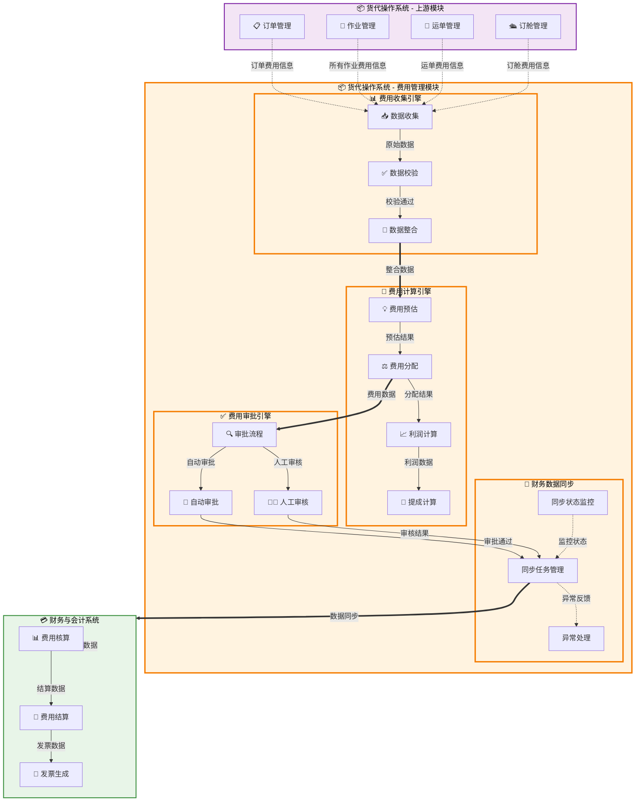

# 费用管理（Cost Management）

## 💡 新手提示：费用管理核心概念

在开始阅读费用管理功能前，请先理解以下关键概念：

- **应收费用**：向客户收取的费用，基于订单和客户合同，是公司的收入来源
- **应付费用**：向供应商支付的费用，基于运单和实际操作，是公司的成本支出
- **费用分层**：订单应收、运单应付、作业成本三层费用管理体系
- **费用核算**：通过应收应付差额计算毛利润，实现精准的盈利分析
- **费率匹配**：系统自动匹配客户合同、供应商协议中的费率标准
- **多币种处理**：支持不同币种的费用计算和汇率转换

##  功能概述

费用管理模块专注于货代业务的费用收集、分配计算和利润分析，通过标准化数据接口与财务与会计系统进行集成。系统支持订单拆分后的精细化部门费用分配，提供多维度的成本核算和利润分析功能。

### 🔍 业务价值说明

- **精准分配**：支持订单拆分后按销售提成、作业权重等维度进行费用分配
- **部门核算**：提供部门级的收入、成本和利润分析
- **数据集成**：通过标准接口向财务系统推送费用数据，确保数据一致性
- **透明管理**：完整的费用分配轨迹和审核流程，提高分配透明度
- **决策支持**：实时的部门利润分析，为管理决策提供数据支撑
- **合规保障**：规范的费用处理流程，支持财务合规要求

### 核心特性

- **多维度费用分配**：支持按销售提成、作业权重、客户等级等维度分配
- **部门利润分析**：提供销售部门、作业部门的独立利润核算
- **灵活分配规则**：可配置的分配权重和计算规则
- **完整审核流程**：多级审核机制确保分配准确性
- **财务数据同步**：标准化接口推送数据到财务与会计系统
- **实时状态跟踪**：同步状态查询和处理结果反馈

##  菜单结构

```
费用管理
├── 费用总览                    # 费用汇总和盈利分析看板
├── 应收费用管理                # 客户费用录入和审核
├── 应付费用管理                # 供应商费用录入和审核
├── 费用审核中心                # 集中审核待处理费用
├── 📊 订单费用分配管理          # 🆕 订单拆分后的费用分配功能
│   ├── 费用分配总览            # 订单拆分后的费用分配展示
│   ├── 分配规则管理            # 权重、系数、提成比例配置和审核
│   │   ├── 规则配置            # 分配规则的创建和编辑
│   │   ├── 规则审核            # 分配规则的审核流程
│   │   └── 规则历史            # 规则变更历史记录
│   ├── 手动调整审核            # 特殊情况的人工调整
│   └── 分配历史记录            # 分配记录查询和追溯
├── 📈 部门利润分析              # 🆕 基于费用分配的部门利润分析
│   ├── 销售部门业绩            # 销售提成和利润分析
│   ├── 作业部门利润            # 各作业部门利润分析  
│   ├── 利润趋势分析            # 时间维度的利润趋势
│   └── 部门绩效对比            # 部门间绩效对比
├── 💾 财务数据同步              # 🆕 与财务系统的数据同步管理
│   ├── 同步状态监控            # 数据同步状态实时监控
│   ├── 同步任务管理            # 同步任务的创建和调度
│   ├── 同步日志查询            # 同步过程的详细日志
│   └── 异常处理中心            # 同步异常的处理和重试
├── 费率配置管理                # 维护客户和供应商费率
├── 毛利分析报表                # 订单和运单盈利分析（可扩展）
├── 费用统计报表                # 费用相关的统计分析报表
├── 汇率管理                    # 汇率配置和历史记录
└── 费用模板管理                # 标准费用模板配置
```

## 费用管理模块数据流转图




##  页面原型设计

###  费用总览页面

```
[页面标题：费用管理总览]
┌─────────────────────────────────────────────────────────────┐
│ 搜索条件：                                                    │
│ 订单号：[________] 运单号：[________] 客户：[________]         │
│ 费用类型：[下拉选择] 时间范围：[日期选择器] 至 [日期选择器]   │
│ [搜索] [重置] [导出Excel] [费用计算]                         │
├─────────────────────────────────────────────────────────────┤
│ 统计卡片：                                                    │
│ ┌─────────────┬─────────────┬─────────────┬─────────────┐    │
│ │ 订单应收    │ 运单应付    │ 毛利润      │ 利润率      │    │
│ │ ¥1,234,567  │ ¥987,654    │ ¥246,913    │ 20.0%       │    │
│ └─────────────┴─────────────┴─────────────┴─────────────┘    │
│ ┌─────────────┬─────────────┬─────────────┬─────────────┐    │
│ │ 待审核应收  │ 待审核应付  │ 本月新增    │ 异常费用    │    │
│ │ ¥156,789    │ ¥89,456     │ ¥345,678    │ 12 项       │    │
│ └─────────────┴─────────────┴─────────────┴─────────────┘    │
├─────────────────────────────────────────────────────────────┤
│ 费用明细表格：                                                │
│ ┌──────┬──────┬──────┬──────┬──────┬──────┬──────┬──────┐   │
│ │订单号│运单号│费用类型│费用名称│金额  │状态  │客户  │操作  │   │
│ ├──────┼──────┼──────┼──────┼──────┼──────┼──────┼──────┤   │
│ │ORD001│WAY001│应收  │海运费│15000 │已确认│客户A │[详情]│   │
│ │ORD001│WAY001│应付  │港杂费│2000  │待审核│供应商B│[审核]│   │
│ │ORD002│WAY002│应收  │文件费│300   │草稿  │客户C │[编辑]│   │
│ └──────┴──────┴──────┴──────┴──────┴──────┴──────┴──────┘   │
│ [批量审核] [批量导出] [费用分析]                              │
└─────────────────────────────────────────────────────────────┘
```

###  销售业绩联动

```
[说明：费用发布/调整后，系统自动向销售业绩模块发布毛利变更事件]
┌─────────────────────────────────────────────────────────────┐
│ 触发条件：                                                    │
│ - 费用项创建/更新/作废                                        │
│ 消息：                                                        │
│ - Topic: cost.updated                                         │
│ - Payload: {job_id,total_revenue,total_cost,gross_profit}     │
│ 下游：                                                        │
│ - 销售业绩与利润分析 → 分润重算与归属锁定                   │
└─────────────────────────────────────────────────────────────┘
```

###  应收费用录入页面

```
[页面标题：订单应收费用录入]
┌─────────────────────────────────────────────────────────────┐
│ 基本信息：                                                    │
│ 订单号：[ORD-20240315-001] 客户：[ABC贸易公司]               │
│ 合同编号：[CONTRACT-001] 币种：[CNY ▼] 汇率：[7.2456]        │
│ 业务员：[张三] 创建时间：[2024-03-15 14:30]                  │
├─────────────────────────────────────────────────────────────┤
│ 费用明细：                                                    │
│ ┌──────┬──────┬──────┬──────┬──────┬──────┬──────┬──────┐   │
│ │费用类型│费用名称│数量  │单价  │金额  │税率  │含税金额│操作│   │
│ ├──────┼──────┼──────┼──────┼──────┼──────┼──────┼──────┤   │
│ │海运费 │海运费 │2     │7500  │15000 │13%   │16950  │[删除]│   │
│ │文件费 │文件费 │1     │300   │300   │6%    │318    │[删除]│   │
│ │港杂费 │港杂费 │1     │2500  │2500  │13%   │2825   │[删除]│   │
│ └──────┴──────┴──────┴──────┴──────┴──────┴──────┴──────┘   │
│ [+ 添加费用项] [从模板导入] [智能匹配费率]                    │
├─────────────────────────────────────────────────────────────┤
│ 费用汇总：                                                    │
│ 不含税总额：¥18,300  税额：¥2,793  含税总额：¥21,093         │
│ 预计毛利：¥6,093 (28.9%)                                     │
├─────────────────────────────────────────────────────────────┤
│ 审核设置：                                                    │
│ 审核级别：[一级审核 ▼] 紧急程度：[普通 ▼]                    │
│ 审核人：[李经理] 预计审核时间：[2024-03-16 10:00]            │
├─────────────────────────────────────────────────────────────┤
│ 备注：[_________________________________________________]    │
│                                                             │
│ [保存草稿] [提交审核] [预览打印] [取消]                       │
└─────────────────────────────────────────────────────────────┘
```

###  费用审核中心页面

```
[页面标题：费用审核中心]
┌─────────────────────────────────────────────────────────────┐
│ 筛选条件：                                                    │
│ 费用类型：[应收 ▼] 状态：[待审核 ▼] 紧急程度：[全部 ▼]      │
│ 提交时间：[日期选择器] 至 [日期选择器] [搜索] [重置]         │
├─────────────────────────────────────────────────────────────┤
│ 待审核统计：                                                  │
│ ┌─────────────┬─────────────┬─────────────┬─────────────┐    │
│ │ 待审核总数  │ 紧急审核    │ 超时风险    │ 今日已审核  │    │
│ │ 25 项       │ 3 项        │ 1 项        │ 18 项       │    │
│ └─────────────┴─────────────┴─────────────┴─────────────┘    │
├─────────────────────────────────────────────────────────────┤
│ 待审核费用列表：                                              │
│ ┌─────┬──────────┬────────┬────────┬──────────┬────────┐    │
│ │选择 │ 订单号    │ 客户   │ 费用金额│ 提交时间  │ 操作   │    │
│ ├─────┼──────────┼────────┼────────┼──────────┼────────┤    │
│ │ □   │ORD-001   │客户A   │¥17,568 │2024-03-15│[审核]  │    │
│ │ □   │ORD-002   │客户B   │¥25,300 │2024-03-15│[审核]  │    │
│ │ □   │ORD-003   │客户C   │¥12,800 │2024-03-14│[审核]  │    │
│ └─────┴──────────┴────────┴────────┴──────────┴────────┘    │
│ [全选] [批量审核通过] [批量驳回] [导出审核报告]               │
└─────────────────────────────────────────────────────────────┘
```

###  毛利分析报表页面

```
[页面标题：毛利分析报表]
┌─────────────────────────────────────────────────────────────┐
│ 分析维度：                                                    │
│ 时间维度：[本月 ▼] 客户维度：[全部客户 ▼] 航线：[全部 ▼]    │
│ 业务员：[全部 ▼] 运输方式：[全部 ▼] [分析] [导出]           │
├─────────────────────────────────────────────────────────────┤
│ 盈利概况：                                                    │
│ ┌─────────────┬─────────────┬─────────────┬─────────────┐    │
│ │ 总收入      │ 总成本      │ 毛利润      │ 平均利润率  │    │
│ │ ¥2,456,789  │ ¥1,987,654  │ ¥469,135    │ 19.1%       │    │
│ └─────────────┴─────────────┴─────────────┴─────────────┘    │
├─────────────────────────────────────────────────────────────┤
│ 利润率趋势图：                                                │
│ ┌─────────────────────────────────────────────────────────┐  │
│ │    25% ┤                                                │  │
│ │    20% ┤     ●─────●                                    │  │
│ │    15% ┤   ●         ●─────●                            │  │
│ │    10% ┤ ●                   ●                          │  │
│ │     5% ┤                       ●                        │  │
│ │     0% └─────┬─────┬─────┬─────┬─────┬─────┬─────┬─────┤  │
│ │        1月   2月   3月   4月   5月   6月   7月   8月    │  │
│ └─────────────────────────────────────────────────────────┘  │
├─────────────────────────────────────────────────────────────┤
│ 客户盈利排行：                                                │
│ ┌──────────┬──────────┬──────────┬──────────┬──────────┐    │
│ │ 客户名称 │ 订单数量 │ 总收入   │ 毛利润   │ 利润率   │    │
│ ├──────────┼──────────┼──────────┼──────────┼──────────┤    │
│ │ ABC贸易  │ 25       │ ¥456,789 │ ¥91,358  │ 20.0%    │    │
│ │ XYZ公司  │ 18       │ ¥345,678 │ ¥62,222  │ 18.0%    │    │
│ │ 123集团  │ 32       │ ¥567,890 │ ¥96,541  │ 17.0%    │    │
│ └──────────┴──────────┴──────────┴──────────┴──────────┘    │
└─────────────────────────────────────────────────────────────┘
```

###  费用分配总览页面

```
[页面标题：订单费用分配总览]
┌─────────────────────────────────────────────────────────────┐
│ 搜索条件：                                                    │
│ 订单号：[________] 客户：[________] 销售员：[________]         │
│ 分配状态：[全部 ▼] 时间范围：[日期选择器] 至 [日期选择器]    │
│ [搜索] [重置] [批量重新分配] [导出分配报告]                   │
├─────────────────────────────────────────────────────────────┤
│ 分配统计：                                                    │
│ ┌─────────────┬─────────────┬─────────────┬─────────────┐    │
│ │ 总订单收入  │ 销售部门收入│ 作业部门收入│ 分配完成率  │    │
│ │ ¥1,234,567  │ ¥246,913    │ ¥987,654    │ 95.2%       │    │
│ └─────────────┴─────────────┴─────────────┴─────────────┘    │
│ ┌─────────────┬─────────────┬─────────────┬─────────────┐    │
│ │ 待分配订单  │ 异常分配    │ 手动调整    │ 本月新增    │    │
│ │ 8 个        │ 3 个        │ 12 个       │ 156 个      │    │
│ └─────────────┴─────────────┴─────────────┴─────────────┘    │
├─────────────────────────────────────────────────────────────┤
│ 订单分配列表：                                                │
│ ┌──────┬──────┬──────┬──────┬──────┬──────┬──────┬──────┐   │
│ │订单号│客户  │总收入│销售收入│作业收入│分配状态│销售员│操作│   │
│ ├──────┼──────┼──────┼──────┼──────┼──────┼──────┼──────┤   │
│ │ORD001│客户A │50000 │10000 │40000 │已分配│张三  │[详情]│   │
│ │ORD002│客户B │75000 │15000 │60000 │已分配│李四  │[详情]│   │
│ │ORD003│客户C │30000 │6000  │24000 │待分配│王五  │[分配]│   │
│ └──────┴──────┴──────┴──────┴──────┴──────┴──────┴──────┘   │
└─────────────────────────────────────────────────────────────┘
```

###  分配规则配置页面

```
[页面标题：费用分配规则配置]
┌─────────────────────────────────────────────────────────────┐
│ 销售部门提成配置：                                            │
│ ┌─────────────────────────────────────────────────────────┐  │
│ │ 客户类型        │ 提成比例 │ 最低提成 │ 最高提成 │ 状态 │  │
│ │ ├─────────────┼────────┼────────┼────────┼────┤  │
│ │ │ 新客户       │ 25%     │ ¥1,000  │ ¥50,000 │ 启用 │  │
│ │ │ 老客户       │ 20%     │ ¥800    │ ¥40,000 │ 启用 │  │
│ │ │ VIP客户      │ 15%     │ ¥1,500  │ ¥60,000 │ 启用 │  │
│ │ └─────────────┴────────┴────────┴────────┴────┘  │
│ └─────────────────────────────────────────────────────────┘  │
├─────────────────────────────────────────────────────────────┤
│ 作业部门基础权重：                                            │
│ ┌─────────────────────────────────────────────────────────┐  │
│ │ 部门名称        │ 基础权重 │ 调整系数 │ 有效权重 │ 状态 │  │
│ │ ├─────────────┼────────┼────────┼────────┼────┤  │
│ │ │ 订舱部       │ 0.25    │ 1.0     │ 0.25    │ 启用 │  │
│ │ │ 操作部       │ 0.30    │ 1.1     │ 0.33    │ 启用 │  │
│ │ │ 单证部       │ 0.20    │ 1.0     │ 0.20    │ 启用 │  │
│ │ │ 关务部       │ 0.25    │ 0.9     │ 0.225   │ 启用 │  │
│ │ └─────────────┴────────┴────────┴────────┴────┘  │
│ └─────────────────────────────────────────────────────────┘  │
├─────────────────────────────────────────────────────────────┤
│ 复杂度调整系数：                                              │
│ ┌─────────────────────────────────────────────────────────┐  │
│ │ SLA达成率       │ 调整系数 │ 说明                        │  │
│ │ ├─────────────┼────────┼──────────────────────────┤  │
│ │ │ 95%以上      │ 1.2     │ 优秀表现，额外奖励20%     │  │
│ │ │ 90-94%       │ 1.0     │ 标准表现，无调整          │  │
│ │ │ 85-89%       │ 0.9     │ 一般表现，减少10%         │  │
│ │ │ 85%以下      │ 0.8     │ 较差表现，减少20%         │  │
│ │ └─────────────┴────────┴──────────────────────────┘  │
│ └─────────────────────────────────────────────────────────┘  │
├─────────────────────────────────────────────────────────────┤
│ [保存配置] [重置] [导入配置] [导出配置] [预览分配效果]        │
└─────────────────────────────────────────────────────────────┘
```

###  销售部门业绩页面

```
[页面标题：销售部门业绩分析]
┌─────────────────────────────────────────────────────────────┐
│ 筛选条件：                                                    │
│ 销售员：[全部 ▼] 客户类型：[全部 ▼] 时间范围：[本月 ▼]      │
│ [查询] [重置] [导出业绩报告]                                 │
├─────────────────────────────────────────────────────────────┤
│ 销售业绩概况：                                                │
│ ┌─────────────┬─────────────┬─────────────┬─────────────┐    │
│ │ 总订单金额  │ 销售提成    │ 销售成本    │ 销售利润    │    │
│ │ ¥2,456,789  │ ¥491,358    │ ¥245,679    │ ¥245,679    │    │
│ └─────────────┴─────────────┴─────────────┴─────────────┘    │
│ ┌─────────────┬─────────────┬─────────────┬─────────────┐    │
│ │ 订单数量    │ 平均订单额  │ 提成率      │ 利润率      │    │
│ │ 156 个      │ ¥15,748     │ 20.0%       │ 50.0%       │    │
│ └─────────────┴─────────────┴─────────────┴─────────────┘    │
├─────────────────────────────────────────────────────────────┤
│ 销售员业绩排行：                                              │
│ ┌──────────┬──────────┬──────────┬──────────┬──────────┐    │
│ │ 销售员   │ 订单数量 │ 订单金额 │ 销售提成 │ 销售利润 │    │
│ ├──────────┼──────────┼──────────┼──────────┼──────────┤    │
│ │ 张三     │ 45       │ ¥756,789 │ ¥151,358 │ ¥75,679  │    │
│ │ 李四     │ 38       │ ¥645,678 │ ¥129,136 │ ¥64,568  │    │
│ │ 王五     │ 42       │ ¥687,890 │ ¥137,578 │ ¥68,789  │    │
│ │ 赵六     │ 31       │ ¥366,432 │ ¥73,286  │ ¥36,643  │    │
│ └──────────┴──────────┴──────────┴──────────┴──────────┘    │
├─────────────────────────────────────────────────────────────┤
│ 月度业绩趋势：                                                │
│ ┌─────────────────────────────────────────────────────────┐  │
│ │ 销售提成(万元)                                           │  │
│ │    50 ┤                                                 │  │
│ │    40 ┤     ●─────●                                     │  │
│ │    30 ┤   ●         ●─────●                             │  │
│ │    20 ┤ ●                   ●                           │  │
│ │    10 ┤                       ●                         │  │
│ │     0 └─────┬─────┬─────┬─────┬─────┬─────┬─────┬─────┤  │
│ │        1月   2月   3月   4月   5月   6月   7月   8月     │  │
│ └─────────────────────────────────────────────────────────┘  │
└─────────────────────────────────────────────────────────────┘
```

###  作业部门利润页面

```
[页面标题：作业部门利润分析]
┌─────────────────────────────────────────────────────────────┐
│ 筛选条件：                                                    │
│ 部门：[全部 ▼] 时间范围：[本月 ▼] 订单类型：[全部 ▼]        │
│ [查询] [重置] [导出部门报告]                                 │
├─────────────────────────────────────────────────────────────┤
│ 作业部门概况：                                                │
│ ┌─────────────┬─────────────┬─────────────┬─────────────┐    │
│ │ 作业分配池  │ 部门总收入  │ 部门总成本  │ 部门利润    │    │
│ │ ¥1,965,431  │ ¥1,965,431  │ ¥1,572,345  │ ¥393,086    │    │
│ └─────────────┴─────────────┴─────────────┴─────────────┘    │
│ ┌─────────────┬─────────────┬─────────────┬─────────────┐    │
│ │ 处理订单数  │ 平均利润率  │ SLA达成率   │ 效率指数    │    │
│ │ 156 个      │ 20.0%       │ 92.3%       │ 1.15        │    │
│ └─────────────┴─────────────┴─────────────┴─────────────┘    │
├─────────────────────────────────────────────────────────────┤
│ 部门利润分析：                                                │
│ ┌──────────┬──────────┬──────────┬──────────┬──────────┐    │
│ │ 部门名称 │ 分配收入 │ 部门成本 │ 部门利润 │ 利润率   │    │
│ ├──────────┼──────────┼──────────┼──────────┼──────────┤    │
│ │ 订舱部   │ ¥491,358 │ ¥393,086 │ ¥98,272  │ 20.0%    │    │
│ │ 操作部   │ ¥589,629 │ ¥471,703 │ ¥117,926 │ 20.0%    │    │
│ │ 单证部   │ ¥393,086 │ ¥314,469 │ ¥78,617  │ 20.0%    │    │
│ │ 关务部   │ ¥491,358 │ ¥393,086 │ ¥98,272  │ 20.0%    │    │
│ └──────────┴──────────┴──────────┴──────────┴──────────┘    │
├─────────────────────────────────────────────────────────────┤
│ 部门效率对比：                                                │
│ ┌─────────────────────────────────────────────────────────┐  │
│ │ 利润率(%)                                                │  │
│ │    25 ┤                                                 │  │
│ │    20 ┤ ████     ████     ████     ████                 │  │
│ │    15 ┤ ████     ████     ████     ████                 │  │
│ │    10 ┤ ████     ████     ████     ████                 │  │
│ │     5 ┤ ████     ████     ████     ████                 │  │
│ │     0 └─────┬─────┬─────┬─────┬─────┬─────┬─────┬─────┤  │
│ │       订舱部  操作部  单证部  关务部                      │  │
│ └─────────────────────────────────────────────────────────┘  │
└─────────────────────────────────────────────────────────────┘
```

###  财务数据同步状态页面

```
[页面标题：财务数据同步状态监控]
┌─────────────────────────────────────────────────────────────┐
│ 筛选条件：                                                    │
│ 同步类型：[全部 ▼] 同步状态：[全部 ▼] 时间范围：[今日 ▼]    │
│ [查询] [重置] [手动同步] [批量重试] [导出日志]               │
├─────────────────────────────────────────────────────────────┤
│ 同步状态概览：                                                │
│ ┌─────────────┬─────────────┬─────────────┬─────────────┐    │
│ │ 今日同步    │ 成功同步    │ 失败同步    │ 待处理      │    │
│ │ 1,234 条    │ 1,156 条    │ 45 条       │ 33 条       │    │
│ └─────────────┴─────────────┴─────────────┴─────────────┘    │
│ ┌─────────────┬─────────────┬─────────────┬─────────────┐    │
│ │ 成功率      │ 平均耗时    │ 最后同步    │ 系统状态    │    │
│ │ 93.6%       │ 2.3秒       │ 2分钟前     │ 🟢 正常     │    │
│ └─────────────┴─────────────┴─────────────┴─────────────┘    │
├─────────────────────────────────────────────────────────────┤
│ 同步任务列表：                                                │
│ ┌──────┬──────────┬──────────┬──────┬──────┬──────┬──────┐   │
│ │任务ID│数据类型  │订单号    │状态  │开始时间│耗时  │操作  │   │
│ ├──────┼──────────┼──────────┼──────┼──────┼──────┼──────┤   │
│ │T001  │费用分配  │ORD20240101│成功  │14:30 │2.1s  │[详情]│   │
│ │T002  │利润数据  │ORD20240102│失败  │14:28 │5.2s  │[重试]│   │
│ │T003  │费用分配  │ORD20240103│进行中│14:32 │-     │[取消]│   │
│ │T004  │利润数据  │ORD20240104│等待  │-     │-     │[启动]│   │
│ └──────┴──────────┴──────────┴──────┴──────┴──────┴──────┘   │
├─────────────────────────────────────────────────────────────┤
│ 同步趋势图：                                                  │
│ ┌─────────────────────────────────────────────────────────┐  │
│ │ 同步成功率(%)                                            │  │
│ │   100 ┤                                                 │  │
│ │    95 ┤ ●─────●─────●                                   │  │
│ │    90 ┤               ●─────●                           │  │
│ │    85 ┤                       ●─────●                   │  │
│ │    80 ┤                               ●                 │  │
│ │     0 └─────┬─────┬─────┬─────┬─────┬─────┬─────┬─────┤  │
│ │        9:00  10:00 11:00 12:00 13:00 14:00 15:00 16:00 │  │
│ └─────────────────────────────────────────────────────────┘  │
└─────────────────────────────────────────────────────────────┘
```

###  分配规则管理页面

```
[页面标题：费用分配规则管理]
┌─────────────────────────────────────────────────────────────┐
│ 筛选条件：                                                    │
│ 规则类型：[全部 ▼] 规则状态：[全部 ▼] 创建人：[全部 ▼]      │
│ [查询] [重置] [新建规则] [批量审核] [导出规则]               │
├─────────────────────────────────────────────────────────────┤
│ 规则状态概览：                                                │
│ ┌─────────────┬─────────────┬─────────────┬─────────────┐    │
│ │ 生效规则    │ 待审核      │ 草稿规则    │ 已停用      │    │
│ │ 15 条       │ 3 条        │ 7 条        │ 12 条       │    │
│ └─────────────┴─────────────┴─────────────┴─────────────┘    │
├─────────────────────────────────────────────────────────────┤
│ 分配规则列表：                                                │
│ ┌──────┬──────────┬──────────┬──────┬──────┬──────┬──────┐   │
│ │规则ID│规则名称  │规则类型  │状态  │创建人│创建时间│操作  │   │
│ ├──────┼──────────┼──────────┼──────┼──────┼──────┼──────┤   │
│ │R001  │海运费分配│权重分配  │生效  │张三  │01-15 │[编辑]│   │
│ │R002  │销售提成  │比例分配  │待审核│李四  │01-16 │[审核]│   │
│ │R003  │操作费用  │固定分配  │草稿  │王五  │01-17 │[编辑]│   │
│ │R004  │港杂费用  │权重分配  │停用  │赵六  │01-10 │[启用]│   │
│ └──────┴──────────┴──────────┴──────┴──────┴──────┴──────┘   │
├─────────────────────────────────────────────────────────────┤
│ 规则详情预览：                                                │
│ ┌─────────────────────────────────────────────────────────┐  │
│ │ 规则名称：海运费分配规则                                 │  │
│ │ 分配方式：按部门权重分配                                 │  │
│ │ ┌─────────┬─────────┬─────────┬─────────┬─────────┐      │  │
│ │ │ 部门    │ 权重    │ 最小值  │ 最大值  │ 状态    │      │  │
│ │ ├─────────┼─────────┼─────────┼─────────┼─────────┤      │  │
│ │ │ 订舱部  │ 25%     │ 1000    │ 50000   │ 生效    │      │  │
│ │ │ 操作部  │ 30%     │ 1500    │ 60000   │ 生效    │      │  │
│ │ │ 单证部  │ 20%     │ 800     │ 40000   │ 生效    │      │  │
│ │ │ 关务部  │ 25%     │ 1000    │ 50000   │ 生效    │      │  │
│ │ └─────────┴─────────┴─────────┴─────────┴─────────┘      │  │
│ └─────────────────────────────────────────────────────────┘  │
└─────────────────────────────────────────────────────────────┘
```

## 业务流程

### 💡 新手提示：业务流程阅读指南

以下业务流程描述了费用从收集、分配到财务同步的完整生命周期。每个步骤都包含：

- **业务动作**：具体要执行的操作
- **系统交互**：涉及的系统间调用和数据传递
- **决策点**：需要人工判断或系统自动判断的关键节点
- **异常处理**：可能出现的问题和解决方案

### 📋 费用数据收集流程

**费用数据获取**：从多个业务系统获取应收应付费用信息

> **新手说明**：这是费用管理的起点，系统需要从订单管理（应收费用）和各业务操作系统（应付费用）获取完整的费用数据

1. **应收费用获取（向客户收款）**
- **🔗 系统内触发：**：货代操作（订单管理） → 货代操作（费用管理） **【读取数据】**
- **调用方式**：RESTful API (GET /api/orders/{order_id}/receivable-costs)
- **调用时机**：订单费用确认后或定期同步时触发
- **数据操作**：
  - **数据读取**：从货代操作（订单管理）的 order_costs（订单费用信息）表读取应收费用记录
  - **数据验证**：验证费用数据的完整性和准确性
  - **数据存储**：在货代操作（费用管理）的 cost_collection（费用收集记录）表中存储费用信息

2. **应付费用获取（向供应商付款）**

- **🔗 系统内触发：**：
  - 货代操作（运单管理） → 货代操作（费用管理） **【读取数据】**
  - 货代操作（订舱管理） → 货代操作（费用管理） **【读取数据】**
  - 运输管理（拖车服务） → 货代操作（费用管理） **【读取数据】**
  - 关务与合规（报关服务） → 货代操作（费用管理） **【读取数据】**
  - 仓储管理（仓储服务） → 货代操作（费用管理） **【读取数据】**
- **调用方式**：RESTful API (GET /api/services/{service_type}/payable-costs)
- **调用时机**：各业务服务完成确认后或定期同步时触发
- **数据操作**：
  - **数据读取**：从各业务系统的服务费用表读取应付费用记录
  - **数据验证**：验证费用数据的完整性和准确性，关联订单信息
  - **数据存储**：在货代操作（费用管理）的 cost_collection（费用收集记录）表中存储费用信息

3. **统一费用数据接口**

- **调用方式**：RESTful API (GET /api/orders/{order_id}/all-costs)
- **入参**：`{order_id, cost_direction, cost_types, period_filter, service_filter}`
  - `order_id` (订单ID): string，需要获取费用的订单唯一标识符
  - `cost_direction` (费用方向): enum，["receivable", "payable", "all"]，费用收付方向
  - `cost_types` (费用类型): array，需要获取的费用类型列表
  - `period_filter` (期间过滤): object，费用发生的时间范围过滤条件
  - `service_filter` (服务过滤): object，按服务类型过滤费用（运单、订舱、拖车等）
- **出参**：`{receivable_costs, payable_costs, cost_summary, currency_info, collection_status}`
  - `receivable_costs` (应收费用): array，向客户收取的费用项目清单
  - `payable_costs` (应付费用): array，向供应商支付的费用项目清单，按服务类型分组
  - `cost_summary` (费用汇总): object，应收应付费用的汇总统计和利润分析
  - `currency_info` (币种信息): object，费用涉及的币种和汇率信息
  - `collection_status` (收集状态): object，各数据源费用收集的完成状态

### 费用数据整理

> **新手说明**：系统会对收集到的费用数据按照应收、应付等维度进行分类整理

- **🔗 系统内触发**：费用管理内部数据处理引擎
- **调用方式**：内部服务调用 (processCollectedCosts)
- **调用时机**：费用数据收集完成后立即自动触发
- **数据操作**：
  - **数据读取**：从 cost_collection（费用收集记录）表读取原始费用数据
    > **说明**：cost_collection 表的数据在上述"费用数据收集"阶段写入，包含从应收费用获取和应付费用获取流程中收集的所有原始费用数据
  - **数据分类**：按应收、应付、费用类型等维度分类存储到 cost_categories（费用分类）表
  - **数据清洗**：去除重复数据，修正异常数据，记录清洗日志
  - **数据标准化**：统一币种、格式等标准化处理，存储到 standardized_costs（标准化费用）表
- **入参**：`{collection_id, processing_rules, validation_config}`
  - `collection_id` (收集ID): string，费用数据收集批次的唯一标识符
  - `processing_rules` (处理规则): object，数据分类和清洗的规则配置
  - `validation_config` (验证配置): object，数据验证和标准化的配置参数
- **出参**：`{processed_costs, category_summary, validation_report, processing_status}`
  - `processed_costs` (处理后费用): array，分类整理后的标准化费用数据
  - `category_summary` (分类汇总): object，各费用类别的统计汇总信息
  - `validation_report` (验证报告): object，数据验证和清洗的详细报告
  - `processing_status` (处理状态): object，数据处理的完成状态和异常信息

### 📋 费用分配流程

1. **分配规则获取**

> **新手说明**：费用分配计算需要从主数据与系统配置模块获取已配置的分配规则

- **🔗 跨系统触发**：费用管理 → 主数据与系统配置 **【读取数据】**
- **调用方式**：RESTful API (GET /api/master-data/allocation-rules/active)
- **调用时机**：费用分配计算开始前自动触发
- **数据操作**：
  - **数据读取**：从主数据与系统配置的 allocation_rules（分配规则）表读取生效的规则配置
  - **数据缓存**：将规则数据缓存到费用管理的 allocation_cache（规则缓存）表
  - **数据验证**：验证规则的有效性和完整性
  - **数据同步**：监听主数据模块的规则变更通知，及时更新缓存
- **入参**：`{rule_type, effective_date, department_filter, client_filter}`
  - `rule_type` (规则类型): string，需要获取的规则类型（部门分配/销售提成等）
  - `effective_date` (生效日期): string，查询指定日期生效的规则版本
  - `department_filter` (部门过滤): array，需要获取规则的部门列表
  - `client_filter` (客户过滤): array，需要获取规则的客户类型列表
- **出参**：`{active_rules, rule_metadata, cache_status, sync_timestamp}`
  - `active_rules` (生效规则): array，当前生效的分配规则配置
  - `rule_metadata` (规则元数据): object，规则的版本、创建时间等元信息
  - `cache_status` (缓存状态): object，规则缓存的状态和有效期信息
  - `sync_timestamp` (同步时间戳): string，最后一次同步规则的时间

2. **费用分配计算**

> **新手说明**：基于获取的分配规则，系统自动计算各部门和人员的费用分配

- **🔗 系统触发**：费用管理内部分配计算引擎
- **调用方式**：分配算法引擎处理 (executeAllocationCalculation)
- **调用时机**：分配规则获取完成后、费用数据整理完成后自动触发或手动触发计算
- **数据操作**：
  - **数据读取**：
    - 从主数据与系统配置的 allocation_cache（规则缓存）表读取分配规则
    - 从货代操作（费用管理）的 standardized_costs（标准化费用）表读取计算数据
  - **数据计算**：在货代操作（费用管理）的 allocation_engine 中执行分配算法，计算各部门分配金额 
  - **数据写入**：将分配结果写入货代操作（费用管理）的 department_allocations（部门费用分配）表 
  - **数据汇总**：生成部门级的收入、成本、利润汇总到财务与会计的 department_summary（部门汇总）表
- **入参**：`{cost_batch_id, rule_cache_id, calculation_mode, department_filter}`
  - `cost_batch_id` (费用批次ID): string，需要分配的费用数据批次标识符
  - `rule_cache_id` (规则缓存ID): string，使用的缓存分配规则标识符
  - `calculation_mode` (计算模式): string，计算模式（自动/手动/重新计算）
  - `department_filter` (部门过滤): array，参与分配的部门列表过滤条件
- **出参**：`{allocation_results, department_summary, calculation_report, validation_status}`
  - `allocation_results` (分配结果): array，各部门的详细费用分配结果
  - `department_summary` (部门汇总): object，部门级的收入、成本、利润汇总数据
  - `calculation_report` (计算报告): object，分配计算过程的详细报告
  - `validation_status` (验证状态): object，分配结果的验证状态和异常信息

3. **分配结果审核**

> **新手说明**：为确保分配结果的准确性，系统会将计算结果提交给相关人员审核

- **🔗 系统触发**：费用管理 → 工作流与自动化 **【写入数据】**
- **调用方式**：RESTful API (POST /api/workflow/submit-allocation-review)
- **调用时机**：费用分配计算完成后自动提交审核
- **数据操作**：
  - **数据读取**：从 货代操作（费用管理）的 department_allocations（部门费用分配）表读取分配结果
  - **数据写入**：向工作流与自动化的 allocation_review_tasks（分配审核任务）表写入审核任务
  - **数据通知**：发送审核通知给相关审核人员，记录到 notification_log（通知日志）表
  - **数据跟踪**：记录审核进度和审核结果到 工作流与自动化的 review_progress（审核进度）表
- **入参**：`{allocation_batch_id, calculation_summary, reviewer_groups, review_deadline}`
  - `allocation_batch_id` (分配批次ID): string，需要审核的分配结果批次标识符
  - `calculation_summary` (计算摘要): object，分配计算的汇总信息和关键指标
  - `reviewer_groups` (审核组): array，参与审核的用户组和审核权限
  - `review_deadline` (审核截止): string，审核任务的截止时间
- **出参**：`{review_task_id, review_workflow, notification_sent, estimated_completion}`
  - `review_task_id` (审核任务ID): string，创建的分配审核任务唯一标识符
  - `review_workflow` (审核流程): object，审核流程的详细步骤和状态
  - `notification_sent` (通知发送): array，已发送的审核通知记录
  - `estimated_completion` (预计完成): string，预计审核完成的时间

### 📋 财务数据同步流程

1. **财务数据推送**

> **新手说明**：审核通过的费用分配数据会自动推送到财务与会计系统进行后续处理

- **🔗 跨系统触发**：费用管理 → 财务与会计 **【写入数据】**
- **调用方式**：RESTful API (POST /api/finance/sync-department-allocation)
- **调用时机**：分配结果审核通过后立即自动触发
- **数据操作**：
  - **数据读取**：从 货代操作（费用管理）的 department_allocations（部门费用分配）表读取审核通过的分配结果
  - **数据推送**：将分配结果推送到财务与会计的 finance_allocations（财务分配）表
  - **状态更新**：更新分配记录的同步状态到 货代操作（费用管理）的 sync_status（同步状态）表
  - **结果跟踪**：跟踪财务与会计的处理结果，记录到 货代操作（费用管理）的 sync_log（同步日志）表
- **入参**：`{allocation_batch_id, sync_mode, target_period, notification_config}`
  - `allocation_batch_id` (分配批次ID): string，需要推送的分配结果批次标识符
  - `sync_mode` (同步模式): string，同步模式（实时/批量/增量）
  - `target_period` (目标期间): string，财务系统的目标会计期间
  - `notification_config` (通知配置): object，推送完成后的通知配置
- **出参**：`{sync_id, push_status, finance_response, estimated_processing_time}`
  - `sync_id` (同步ID): string，创建的同步任务唯一标识符
  - `push_status` (推送状态): object，数据推送的状态和进度信息
  - `finance_response` (财务响应): object，财务系统的接收确认和初步验证结果
  - `estimated_processing_time` (预计处理时间): number，财务系统预计处理完成时间（分钟）

2. **同步状态跟踪**

> **新手说明**：系统会持续跟踪财务与会计的处理进度，确保数据同步成功

- **🔗 跨系统触发**：费用管理 → 财务与会计 **【查询数据】**
- **调用方式**：RESTful API (GET /api/finance/sync-status/{sync_id})
- **调用时机**：数据推送后定期自动查询或手动查询
- **数据操作**：
  - **数据查询**：从财务与会计的 sync_status（同步状态）表查询同步任务处理状态
  - **状态更新**：更新本地的 货代操作（费用管理）的 sync_status（同步状态）表的状态信息
  - **结果获取**：获取处理结果和反馈信息，存储到 货代操作（费用管理）的 sync_result（同步结果）表
  - **异常处理**：处理同步失败或异常情况，记录到 货代操作（费用管理）的 sync_error_log（同步错误日志）表
- **入参**：`{sync_id, query_detail_level, include_error_info}`
  - `sync_id` (同步ID): string，需要查询的同步任务标识符
  - `query_detail_level` (查询详细级别): string，查询的详细程度（简要/详细/完整）
  - `include_error_info` (包含错误信息): boolean，是否包含详细的错误信息
- **出参**：`{processing_status, completion_percentage, result_summary, error_details}`
  - `processing_status` (处理状态): string，财务系统的处理状态（处理中/完成/失败）
  - `completion_percentage` (完成百分比): number，处理进度的百分比
  - `result_summary` (结果摘要): object，处理结果的汇总信息
  - `error_details` (错误详情): array，如果有错误，详细的错误信息列表

3. **实时状态监控**

> **新手说明**：系统提供实时监控界面，显示同步任务的执行状态和异常预警

- **🔗 系统触发**：费用管理内部监控服务
- **调用方式**：实时状态轮询 (monitorSyncStatus) 和事件推送 (WebSocket)
- **调用时机**：同步任务执行期间持续监控
- **数据操作**：
  - **数据采集**：从 货代操作（费用管理）的 sync_status（同步状态）表和 sync_log（同步日志）表采集监控数据
  - **数据分析**：分析同步性能指标和异常模式
  - **数据展示**：将监控数据推送到监控界面和告警系统
  - **数据存储**：将监控指标存储到 货代操作（费用管理）的 monitoring_metrics（监控指标）表
- **入参**：`{monitor_scope, alert_thresholds, dashboard_config, notification_rules}`
  - `monitor_scope` (监控范围): array，需要监控的同步任务范围
  - `alert_thresholds` (告警阈值): object，各类异常情况的告警阈值设置
  - `dashboard_config` (仪表板配置): object，监控界面的显示配置
  - `notification_rules` (通知规则): object，异常告警的通知规则配置
- **出参**：`{real_time_metrics, alert_notifications, performance_report, system_health}`
  - `real_time_metrics` (实时指标): object，同步任务的实时性能指标
  - `alert_notifications` (告警通知): array，触发的异常告警通知列表
  - `performance_report` (性能报告): object，同步性能的统计分析报告
  - `system_health` (系统健康): object，同步系统的整体健康状态评估

## 核心功能扩展

### 多源费用数据收集引擎

```python
class CostDataCollectionEngine:
    """多源费用数据收集引擎"""
    
    def __init__(self):
        self.data_sources = {
            'receivable': {
                'system': '货代操作（订单管理）',
                'api_endpoint': '/api/orders/{order_id}/receivable-costs',
                'table': 'order_costs'
            },
            'payable': {
                'waybill': {'system': '货代操作（运单管理）', 'table': 'waybill_costs'},
                'booking': {'system': '货代操作（订舱管理）', 'table': 'booking_costs'},
                'transport': {'system': '运输管理（拖车服务）', 'table': 'transport_costs'},
                'customs': {'system': '关务与合规（报关服务）', 'table': 'customs_costs'},
                'warehouse': {'system': '仓储管理（仓储服务）', 'table': 'warehouse_costs'}
            }
        }
    
    def collect_all_costs(self, order_id, collection_config):
        """收集订单所有费用数据"""
        collection_result = {
            'order_id': order_id,
            'collection_id': self.generate_collection_id(),
            'receivable_costs': [],
            'payable_costs': [],
            'collection_status': {},
            'validation_errors': []
        }
        
        try:
            # 1. 收集应收费用
            receivable_data = self.collect_receivable_costs(order_id)
            collection_result['receivable_costs'] = receivable_data
            collection_result['collection_status']['receivable'] = 'SUCCESS'
            
            # 2. 收集应付费用
            payable_data = self.collect_payable_costs(order_id, collection_config)
            collection_result['payable_costs'] = payable_data
            collection_result['collection_status']['payable'] = 'SUCCESS'
            
            # 3. 数据验证
            validation_result = self.validate_collected_data(collection_result)
            collection_result['validation_errors'] = validation_result.get('errors', [])
            
            # 4. 存储到收集记录表
            self.store_collection_record(collection_result)
            
            return collection_result
            
        except Exception as e:
            collection_result['collection_status']['error'] = str(e)
            return collection_result
    
    def collect_receivable_costs(self, order_id):
        """收集应收费用"""
        api_client = self.get_api_client('货代操作（订单管理）')
        response = api_client.get(f'/api/orders/{order_id}/receivable-costs')
        
        receivable_costs = []
        for cost_item in response.data:
            receivable_costs.append({
                'cost_id': cost_item['id'],
                'charge_type': cost_item['charge_type'],
                'amount': cost_item['amount'],
                'currency': cost_item['currency'],
                'customer_id': cost_item['customer_id'],
                'billing_date': cost_item['billing_date'],
                'source_system': '货代操作（订单管理）',
                'source_table': 'order_costs'
            })
        
        return receivable_costs
    
    def collect_payable_costs(self, order_id, config):
        """收集应付费用"""
        payable_costs = []
        
        for service_type, source_config in self.data_sources['payable'].items():
            try:
                api_client = self.get_api_client(source_config['system'])
                response = api_client.get(f'/api/services/{service_type}/payable-costs', {
                    'order_id': order_id,
                    'include_details': True
                })
                
                for cost_item in response.data:
                    payable_costs.append({
                        'cost_id': cost_item['id'],
                        'service_type': service_type,
                        'charge_type': cost_item['charge_type'],
                        'amount': cost_item['amount'],
                        'currency': cost_item['currency'],
                        'supplier_id': cost_item['supplier_id'],
                        'service_date': cost_item['service_date'],
                        'source_system': source_config['system'],
                        'source_table': source_config['table']
                    })
                    
            except Exception as e:
                # 记录收集失败的服务类型
                payable_costs.append({
                    'service_type': service_type,
                    'collection_error': str(e),
                    'source_system': source_config['system']
                })
        
        return payable_costs
    
    def standardize_cost_data(self, collection_id):
        """标准化费用数据"""
        # 从收集记录表读取原始数据
        raw_data = self.get_collection_data(collection_id)
        
        standardized_costs = []
        for cost_item in raw_data:
            # 币种标准化
            standard_amount = self.convert_to_standard_currency(
                cost_item['amount'], 
                cost_item['currency']
            )
            
            # 费用类型标准化
            standard_charge_type = self.standardize_charge_type(
                cost_item['charge_type']
            )
            
            standardized_costs.append({
                'original_cost_id': cost_item['cost_id'],
                'standard_charge_type': standard_charge_type,
                'standard_amount': standard_amount,
                'standard_currency': 'CNY',
                'cost_direction': cost_item.get('cost_direction'),
                'standardization_date': datetime.now(),
                'source_system': cost_item['source_system']
            })
        
        # 存储到标准化费用表
        self.store_standardized_costs(collection_id, standardized_costs)
        return standardized_costs
```

### 智能费用分配引擎

```python
class IntelligentAllocationEngine:
    """智能费用分配引擎"""
    
    def __init__(self):
        self.allocation_strategies = {
            'department': 'DepartmentAllocationStrategy',
            'sales_commission': 'SalesCommissionStrategy',
            'cost_center': 'CostCenterAllocationStrategy',
            'project': 'ProjectAllocationStrategy'
        }
    
    def execute_allocation_calculation(self, cost_batch_id, rule_cache_id, config):
        """执行费用分配计算"""
        allocation_result = {
            'batch_id': cost_batch_id,
            'calculation_id': self.generate_calculation_id(),
            'allocation_results': [],
            'department_summary': {},
            'calculation_report': {},
            'validation_status': {}
        }
        
        try:
            # 1. 获取分配规则
            allocation_rules = self.get_cached_allocation_rules(rule_cache_id)
            
            # 2. 获取标准化费用数据
            cost_data = self.get_standardized_costs(cost_batch_id)
            
            # 3. 执行分配计算
            for rule in allocation_rules:
                strategy = self.get_allocation_strategy(rule['rule_type'])
                allocation_results = strategy.calculate_allocation(cost_data, rule)
                
                allocation_result['allocation_results'].extend(allocation_results)
            
            # 4. 生成部门汇总
            department_summary = self.generate_department_summary(
                allocation_result['allocation_results']
            )
            allocation_result['department_summary'] = department_summary
            
            # 5. 验证分配结果
            validation_result = self.validate_allocation_results(allocation_result)
            allocation_result['validation_status'] = validation_result
            
            # 6. 存储分配结果
            self.store_allocation_results(allocation_result)
            
            return allocation_result
            
        except Exception as e:
            allocation_result['calculation_error'] = str(e)
            return allocation_result
    
    def get_cached_allocation_rules(self, rule_cache_id):
        """获取缓存的分配规则"""
        # 从主数据与系统配置的规则缓存表读取
        cache_data = self.query_table('allocation_cache', {
            'cache_id': rule_cache_id,
            'status': 'ACTIVE'
        })
        
        active_rules = []
        for cache_item in cache_data:
            rule_config = json.loads(cache_item['rule_config'])
            active_rules.append({
                'rule_id': cache_item['rule_id'],
                'rule_type': cache_item['rule_type'],
                'rule_name': cache_item['rule_name'],
                'allocation_formula': rule_config['allocation_formula'],
                'conditions': rule_config.get('conditions', []),
                'effective_date': cache_item['effective_date'],
                'source_system': '主数据与系统配置'
            })
        
        return active_rules
    
    def calculate_department_allocation(self, cost_data, allocation_rule):
        """计算部门费用分配"""
        allocation_results = []
        
        # 解析分配公式
        formula = allocation_rule['allocation_formula']
        conditions = allocation_rule.get('conditions', [])
        
        for cost_item in cost_data:
            # 检查分配条件
            if self.check_allocation_conditions(cost_item, conditions):
                # 计算分配比例
                allocation_ratio = self.calculate_allocation_ratio(
                    cost_item, formula
                )
                
                # 按部门分配
                for dept_id, ratio in allocation_ratio.items():
                    allocated_amount = cost_item['standard_amount'] * ratio
                    
                    allocation_results.append({
                        'cost_id': cost_item['original_cost_id'],
                        'department_id': dept_id,
                        'allocation_ratio': ratio,
                        'allocated_amount': allocated_amount,
                        'allocation_rule_id': allocation_rule['rule_id'],
                        'calculation_date': datetime.now(),
                        'target_system': '货代操作（费用管理）',
                        'target_table': 'department_allocations'
                    })
        
        return allocation_results
    
    def generate_department_summary(self, allocation_results):
        """生成部门汇总数据"""
        department_summary = {}
        
        for allocation in allocation_results:
            dept_id = allocation['department_id']
            
            if dept_id not in department_summary:
                department_summary[dept_id] = {
                    'department_id': dept_id,
                    'total_revenue': 0,
                    'total_cost': 0,
                    'gross_profit': 0,
                    'profit_margin': 0,
                    'allocation_count': 0
                }
            
            # 累计部门费用
            if allocation.get('cost_direction') == 'RECEIVABLE':
                department_summary[dept_id]['total_revenue'] += allocation['allocated_amount']
            else:
                department_summary[dept_id]['total_cost'] += allocation['allocated_amount']
            
            department_summary[dept_id]['allocation_count'] += 1
        
        # 计算利润指标
        for dept_id, summary in department_summary.items():
            summary['gross_profit'] = summary['total_revenue'] - summary['total_cost']
            if summary['total_revenue'] > 0:
                summary['profit_margin'] = summary['gross_profit'] / summary['total_revenue']
            
            # 标记目标系统
            summary['target_system'] = '财务与会计'
            summary['target_table'] = 'department_summary'
        
        return department_summary
```

### 跨系统数据同步引擎

```python
class CrossSystemSyncEngine:
    """跨系统数据同步引擎"""
    
    def __init__(self):
        self.sync_targets = {
            'finance': {
                'system_name': '财务与会计',
                'api_endpoint': '/api/finance/sync-department-allocation',
                'target_tables': ['finance_allocations', 'department_summary']
            }
        }
        self.sync_modes = ['REAL_TIME', 'BATCH', 'INCREMENTAL']
    
    def sync_allocation_to_finance(self, allocation_batch_id, sync_config):
        """同步分配结果到财务系统"""
        sync_result = {
            'sync_id': self.generate_sync_id(),
            'batch_id': allocation_batch_id,
            'sync_mode': sync_config.get('sync_mode', 'REAL_TIME'),
            'push_status': {},
            'finance_response': {},
            'estimated_processing_time': 0
        }
        
        try:
            # 1. 读取审核通过的分配结果
            allocation_data = self.get_approved_allocation_data(allocation_batch_id)
            
            # 2. 构建同步数据包
            sync_payload = self.build_sync_payload(allocation_data, sync_config)
            
            # 3. 推送到财务系统
            finance_api = self.get_api_client('财务与会计')
            response = finance_api.post('/api/finance/sync-department-allocation', sync_payload)
            
            sync_result['push_status'] = {
                'status': 'SUCCESS',
                'pushed_records': len(allocation_data),
                'push_timestamp': datetime.now()
            }
            
            sync_result['finance_response'] = {
                'sync_id': response.data.get('sync_id'),
                'status': response.data.get('status'),
                'validation_result': response.data.get('validation_result'),
                'estimated_processing_time': response.data.get('estimated_processing_time', 30)
            }
            
            # 4. 更新本地同步状态
            self.update_sync_status(sync_result)
            
            # 5. 启动状态跟踪
            self.start_sync_monitoring(sync_result['sync_id'])
            
            return sync_result
            
        except Exception as e:
            sync_result['push_status'] = {
                'status': 'FAILED',
                'error_message': str(e),
                'push_timestamp': datetime.now()
            }
            return sync_result
    
    def monitor_sync_status(self, sync_id, monitor_config):
        """监控同步状态"""
        monitoring_result = {
            'sync_id': sync_id,
            'real_time_metrics': {},
            'alert_notifications': [],
            'performance_report': {},
            'system_health': {}
        }
        
        try:
            # 1. 查询财务系统处理状态
            finance_api = self.get_api_client('财务与会计')
            status_response = finance_api.get(f'/api/finance/sync-status/{sync_id}')
            
            # 2. 更新实时指标
            monitoring_result['real_time_metrics'] = {
                'processing_status': status_response.data.get('processing_status'),
                'completion_percentage': status_response.data.get('completion_percentage', 0),
                'processing_duration': status_response.data.get('processing_duration', 0),
                'last_update_time': datetime.now()
            }
            
            # 3. 检查告警条件
            alerts = self.check_alert_conditions(monitoring_result['real_time_metrics'], monitor_config)
            monitoring_result['alert_notifications'] = alerts
            
            # 4. 生成性能报告
            performance_report = self.generate_performance_report(sync_id)
            monitoring_result['performance_report'] = performance_report
            
            # 5. 评估系统健康状态
            system_health = self.assess_system_health(monitoring_result)
            monitoring_result['system_health'] = system_health
            
            # 6. 存储监控数据
            self.store_monitoring_metrics(monitoring_result)
            
            return monitoring_result
            
        except Exception as e:
            monitoring_result['monitoring_error'] = str(e)
            return monitoring_result
    
    def handle_sync_failure_recovery(self, sync_id, recovery_config):
        """处理同步失败恢复"""
        recovery_result = {
            'sync_id': sync_id,
            'recovery_actions': [],
            'retry_attempts': 0,
            'recovery_status': 'INITIATED'
        }
        
        try:
            # 1. 分析失败原因
            failure_analysis = self.analyze_sync_failure(sync_id)
            
            # 2. 确定恢复策略
            recovery_strategy = self.determine_recovery_strategy(failure_analysis)
            
            # 3. 执行恢复操作
            if recovery_strategy == 'RETRY':
                # 重试同步
                retry_result = self.retry_sync_operation(sync_id, recovery_config)
                recovery_result['recovery_actions'].append(retry_result)
                
            elif recovery_strategy == 'PARTIAL_SYNC':
                # 部分数据重新同步
                partial_result = self.execute_partial_sync(sync_id, recovery_config)
                recovery_result['recovery_actions'].append(partial_result)
                
            elif recovery_strategy == 'MANUAL_INTERVENTION':
                # 需要人工干预
                manual_task = self.create_manual_intervention_task(sync_id, failure_analysis)
                recovery_result['recovery_actions'].append(manual_task)
            
            recovery_result['recovery_status'] = 'COMPLETED'
            return recovery_result
            
        except Exception as e:
            recovery_result['recovery_status'] = 'FAILED'
            recovery_result['recovery_error'] = str(e)
            return recovery_result
```
## API接口设计

### 1. 费用数据收集接口

#### 1.1 应收费用获取接口
```json
GET /api/v1/orders/{order_id}/receivable-costs
Content-Type: application/json

Request Parameters:
{
  "order_id": "ORD-20240315-001",           // 订单ID (必填)
  "cost_types": ["OCEAN_FREIGHT", "DOC"],   // 费用类型列表 (可选)
  "period_filter": {                        // 期间过滤条件 (可选)
    "start_date": "2024-03-01",            // 开始日期
    "end_date": "2024-03-31"               // 结束日期
  }
}

Response:
{
  "success": true,                          // 请求成功标识
  "message": "应收费用获取成功",              // 响应消息
  "data": {
    "order_id": "ORD-20240315-001",        // 订单ID
    "customer_info": {                      // 客户信息
      "customer_id": "CUST-001",           // 客户ID
      "customer_name": "ABC贸易公司"        // 客户名称
    },
    "receivable_costs": [                   // 应收费用列表
      {
        "cost_id": "RC-001",               // 费用ID
        "charge_code": "OCEAN_FREIGHT",    // 费用代码
        "charge_name": "海运费",            // 费用名称
        "quantity": 2,                     // 数量
        "unit": "CONTAINER",               // 计费单位
        "unit_price": 15000.00,            // 单价
        "base_amount": 30000.00,           // 基础金额
        "tax_rate": 0.13,                  // 税率
        "tax_amount": 3900.00,             // 税额
        "total_amount": 33900.00,          // 总金额
        "currency": "CNY",                 // 币种
        "status": "confirmed",             // 费用状态
        "billing_date": "2024-03-15",     // 计费日期
        "source_system": "order_management", // 来源系统
        "source_table": "order_costs"      // 来源表
      }
    ],
    "total_receivable": 33900.00,          // 应收费用总额
    "currency": "CNY",                     // 币种
    "collection_status": {                 // 收集状态
      "status": "completed",               // 收集状态
      "collected_at": "2024-03-15T10:30:00Z", // 收集时间
      "data_source": "order_management"    // 数据来源
    }
  }
}
```

#### 1.2 应付费用获取接口
```json
GET /api/v1/services/{service_type}/payable-costs
Content-Type: application/json

Request Parameters:
{
  "service_type": "shipping",               // 服务类型 (必填): shipping/booking/trucking/customs/warehouse
  "order_id": "ORD-20240315-001",          // 订单ID (必填)
  "service_filter": {                       // 服务过滤条件 (可选)
    "waybill_id": "AWB-001",               // 运单ID
    "booking_id": "BKG-001",               // 订舱ID
    "supplier_id": "SUP-001"               // 供应商ID
  },
  "period_filter": {                        // 期间过滤条件 (可选)
    "start_date": "2024-03-01",            // 开始日期
    "end_date": "2024-03-31"               // 结束日期
  }
}

Response:
{
  "success": true,                          // 请求成功标识
  "message": "应付费用获取成功",              // 响应消息
  "data": {
    "service_type": "shipping",            // 服务类型
    "order_id": "ORD-20240315-001",        // 订单ID
    "payable_costs": [                     // 应付费用列表
      {
        "cost_id": "PC-001",               // 费用ID
        "service_id": "AWB-001",           // 服务ID
        "supplier_info": {                  // 供应商信息
          "supplier_id": "SUP-001",        // 供应商ID
          "supplier_name": "中远海运"       // 供应商名称
        },
        "charge_code": "OCEAN_FREIGHT",    // 费用代码
        "charge_name": "海运费",            // 费用名称
        "quantity": 2,                     // 数量
        "unit": "CONTAINER",               // 计费单位
        "unit_price": 12000.00,            // 单价
        "base_amount": 24000.00,           // 基础金额
        "tax_rate": 0.13,                  // 税率
        "tax_amount": 3120.00,             // 税额
        "total_amount": 27120.00,          // 总金额
        "currency": "CNY",                 // 币种
        "status": "confirmed",             // 费用状态
        "service_date": "2024-03-15",     // 服务日期
        "source_system": "shipping_management", // 来源系统
        "source_table": "waybill_costs"    // 来源表
      }
    ],
    "total_payable": 27120.00,             // 应付费用总额
    "currency": "CNY",                     // 币种
    "collection_status": {                 // 收集状态
      "status": "completed",               // 收集状态
      "collected_at": "2024-03-15T10:35:00Z", // 收集时间
      "data_source": "shipping_management" // 数据来源
    }
  }
}
```

#### 1.3 统一费用数据接口
```json
GET /api/v1/orders/{order_id}/all-costs
Content-Type: application/json

Request Parameters:
{
  "order_id": "ORD-20240315-001",          // 订单ID (必填)
  "cost_direction": "all",                 // 费用方向: receivable/payable/all
  "cost_types": ["OCEAN_FREIGHT", "DOC"],  // 费用类型列表 (可选)
  "period_filter": {                       // 期间过滤条件 (可选)
    "start_date": "2024-03-01",           // 开始日期
    "end_date": "2024-03-31"              // 结束日期
  },
  "service_filter": {                      // 服务过滤条件 (可选)
    "service_types": ["shipping", "booking"], // 服务类型列表
    "include_details": true                // 是否包含详细信息
  }
}

Response:
{
  "success": true,                         // 请求成功标识
  "message": "费用数据获取成功",             // 响应消息
  "data": {
    "order_id": "ORD-20240315-001",       // 订单ID
    "receivable_costs": [                  // 应收费用列表
      {
        "cost_id": "RC-001",              // 费用ID
        "charge_code": "OCEAN_FREIGHT",   // 费用代码
        "charge_name": "海运费",           // 费用名称
        "total_amount": 33900.00,         // 总金额
        "currency": "CNY",                // 币种
        "customer_id": "CUST-001",        // 客户ID
        "billing_date": "2024-03-15"     // 计费日期
      }
    ],
    "payable_costs": [                     // 应付费用列表
      {
        "cost_id": "PC-001",              // 费用ID
        "service_type": "shipping",       // 服务类型
        "supplier_name": "中远海运",       // 供应商名称
        "charge_code": "OCEAN_FREIGHT",   // 费用代码
        "charge_name": "海运费",           // 费用名称
        "total_amount": 27120.00,         // 总金额
        "currency": "CNY",                // 币种
        "supplier_id": "SUP-001",         // 供应商ID
        "service_date": "2024-03-15"     // 服务日期
      }
    ],
    "cost_summary": {                      // 费用汇总
      "total_receivable": 33900.00,       // 应收费用总额
      "total_payable": 27120.00,          // 应付费用总额
      "gross_profit": 6780.00,            // 毛利润
      "profit_margin": 20.00,             // 利润率 (%)
      "currency": "CNY"                   // 币种
    },
    "currency_info": {                     // 币种信息
      "base_currency": "CNY",             // 基础币种
      "exchange_rates": {                 // 汇率信息
        "USD": 7.2450,                   // 美元汇率
        "EUR": 7.8520                    // 欧元汇率
      },
      "rate_date": "2024-03-15"          // 汇率日期
    },
    "collection_status": {                 // 收集状态
      "receivable_status": "completed",   // 应收费用收集状态
      "payable_status": "completed",      // 应付费用收集状态
      "overall_status": "completed",      // 整体收集状态
      "last_updated": "2024-03-15T10:40:00Z" // 最后更新时间
    }
  }
}
```

#### 1.4 费用数据整理接口
```json
POST /api/v1/costs/process-collected-data
Content-Type: application/json

Request:
{
  "collection_id": "COLL-20240315-001",   // 收集ID (必填)
  "processing_rules": {                   // 处理规则 (必填)
    "standardize_currency": true,         // 是否标准化币种
    "base_currency": "CNY",              // 基础币种
    "remove_duplicates": true,           // 是否去重
    "validate_amounts": true             // 是否验证金额
  },
  "validation_config": {                  // 验证配置 (可选)
    "min_amount": 0.01,                  // 最小金额
    "max_amount": 1000000.00,            // 最大金额
    "required_fields": ["cost_id", "amount", "currency"] // 必填字段
  }
}

Response:
{
  "success": true,                        // 请求成功标识
  "message": "费用数据整理完成",            // 响应消息
  "data": {
    "processing_id": "PROC-20240315-001", // 处理ID
    "collection_id": "COLL-20240315-001", // 收集ID
    "processed_costs": [                  // 处理后费用
      {
        "original_cost_id": "RC-001",     // 原始费用ID
        "standard_charge_type": "OCEAN_FREIGHT", // 标准费用类型
        "standard_amount": 33900.00,      // 标准金额
        "standard_currency": "CNY",       // 标准币种
        "cost_direction": "RECEIVABLE",   // 费用方向
        "standardization_date": "2024-03-15T11:00:00Z", // 标准化时间
        "source_system": "order_management" // 来源系统
      }
    ],
    "category_summary": {                 // 分类汇总
      "receivable_count": 5,              // 应收费用数量
      "payable_count": 8,                 // 应付费用数量
      "total_amount": 61020.00,           // 总金额
      "currency": "CNY"                   // 币种
    },
    "validation_report": {                // 验证报告
      "total_records": 13,                // 总记录数
      "valid_records": 13,                // 有效记录数
      "invalid_records": 0,               // 无效记录数
      "duplicate_removed": 2,             // 去重数量
      "validation_errors": []             // 验证错误
    },
    "processing_status": {                // 处理状态
      "status": "completed",              // 处理状态
      "processed_at": "2024-03-15T11:05:00Z", // 处理时间
      "processing_duration": 5.2          // 处理耗时(秒)
    }
  }
}
```

### 2. 费用分配接口

#### 2.1 分配规则获取接口
```json
GET /api/v1/master-data/allocation-rules/active
Content-Type: application/json

Request Parameters:
{
  "rule_type": "department_allocation",    // 规则类型 (可选)
  "effective_date": "2024-03-15",         // 生效日期 (可选)
  "department_filter": [101, 102, 103],   // 部门过滤 (可选)
  "client_filter": ["VIP", "GOLD"]        // 客户过滤 (可选)
}

Response:
{
  "success": true,                         // 请求成功标识
  "message": "分配规则获取成功",             // 响应消息
  "data": {
    "active_rules": [                     // 生效规则
      {
        "rule_id": "RULE-20240315-001",   // 规则ID
        "rule_name": "部门费用分配规则",    // 规则名称
        "rule_type": "department_allocation", // 规则类型
        "allocation_formula": {            // 分配公式
          "method": "weighted",           // 分配方法
          "weights": {                    // 权重配置
            "101": 0.35,                 // 海运部权重
            "102": 0.25,                 // 空运部权重
            "103": 0.40                  // 陆运部权重
          }
        },
        "conditions": [                   // 分配条件
          {
            "field": "service_type",      // 条件字段
            "operator": "in",             // 操作符
            "values": ["shipping", "booking"] // 条件值
          }
        ],
        "effective_date": "2024-03-01",  // 生效日期
        "expiry_date": "2024-12-31",     // 失效日期
        "created_by": "ADMIN-001",       // 创建人
        "version": "1.0"                 // 版本号
      }
    ],
    "rule_metadata": {                    // 规则元数据
      "total_rules": 3,                   // 规则总数
      "last_updated": "2024-03-15T09:00:00Z", // 最后更新时间
      "version_info": "v2.1.0"           // 版本信息
    },
    "cache_status": {                     // 缓存状态
      "cached": true,                     // 是否已缓存
      "cache_expiry": "2024-03-15T18:00:00Z", // 缓存过期时间
      "cache_hit_rate": 95.5              // 缓存命中率
    },
    "sync_timestamp": "2024-03-15T10:00:00Z" // 同步时间戳
  }
}
```

#### 2.2 费用分配计算接口
```json
POST /api/v1/allocation/calculate
Content-Type: application/json

Request:
{
  "cost_batch_id": "BATCH-20240315-001",  // 费用批次ID (必填)
  "rule_cache_id": "CACHE-20240315-001",  // 规则缓存ID (必填)
  "calculation_mode": "auto",             // 计算模式: auto/manual/preview
  "department_filter": [101, 102, 103]    // 参与分配的部门列表 (可选)
}

Response:
{
  "success": true,                         // 请求成功标识
  "message": "费用分配计算完成",             // 响应消息
  "data": {
    "calculation_id": "CALC-20240315-001", // 计算ID
    "batch_id": "BATCH-20240315-001",     // 批次ID
    "allocation_results": [                // 分配结果列表
      {
        "cost_id": "RC-001",              // 费用ID
        "department_id": 101,             // 部门ID
        "department_name": "海运部",       // 部门名称
        "allocation_ratio": 0.35,         // 分配比例
        "allocated_amount": 11865.00,     // 分配金额
        "allocation_rule_id": "RULE-20240315-001", // 分配规则ID
        "calculation_date": "2024-03-15T11:30:00Z", // 计算时间
        "target_system": "cost_management", // 目标系统
        "target_table": "department_allocations" // 目标表
      },
      {
        "cost_id": "PC-001",              // 费用ID
        "department_id": 101,             // 部门ID
        "department_name": "海运部",       // 部门名称
        "allocation_ratio": 0.35,         // 分配比例
        "allocated_amount": 9492.00,      // 分配金额
        "allocation_rule_id": "RULE-20240315-001", // 分配规则ID
        "calculation_date": "2024-03-15T11:30:00Z", // 计算时间
        "target_system": "cost_management", // 目标系统
        "target_table": "department_allocations" // 目标表
      }
    ],
    "department_summary": {               // 部门汇总
      "101": {                           // 部门ID
        "department_id": 101,            // 部门ID
        "department_name": "海运部",      // 部门名称
        "total_revenue": 11865.00,       // 总收入
        "total_cost": 9492.00,           // 总成本
        "gross_profit": 2373.00,         // 毛利润
        "profit_margin": 20.00,          // 利润率
        "allocation_count": 2,           // 分配数量
        "target_system": "finance_accounting", // 目标系统
        "target_table": "department_summary" // 目标表
      }
    },
    "calculation_report": {               // 计算报告
      "total_allocated": 61020.00,       // 总分配金额
      "allocation_accuracy": 100.00,     // 分配准确率
      "calculation_duration": 2.5,       // 计算耗时(秒)
      "rules_applied": 1                 // 应用规则数
    },
    "validation_status": {                // 验证状态
      "is_valid": true,                  // 是否有效
      "validation_errors": [],           // 验证错误
      "total_check": 100.00,             // 总额校验
      "balance_check": true              // 平衡校验
    }
  }
}
```

#### 2.3 分配结果审核接口
```json
POST /api/v1/workflow/submit-allocation-review
Content-Type: application/json

Request:
{
  "allocation_batch_id": "BATCH-20240315-001", // 分配批次ID (必填)
  "calculation_summary": {                // 计算摘要 (必填)
    "total_allocated": 61020.00,         // 总分配金额
    "department_count": 3,               // 参与部门数
    "allocation_accuracy": 100.00        // 分配准确率
  },
  "reviewer_groups": [                    // 审核组 (必填)
    {
      "group_id": "FINANCE_MANAGER",     // 审核组ID
      "group_name": "财务经理组",         // 审核组名称
      "required_approvals": 1            // 需要审核数量
    }
  ],
  "review_deadline": "2024-03-16T18:00:00Z" // 审核截止时间 (必填)
}

Response:
{
  "success": true,                        // 请求成功标识
  "message": "分配审核任务创建成功",        // 响应消息
  "data": {
    "review_task_id": "REVIEW-20240315-001", // 审核任务ID
    "allocation_batch_id": "BATCH-20240315-001", // 分配批次ID
    "review_workflow": {                  // 审核流程
      "workflow_id": "WF-20240315-001",   // 流程ID
      "current_step": "FINANCE_REVIEW",   // 当前步骤
      "total_steps": 2,                   // 总步骤数
      "estimated_duration": 24            // 预计耗时(小时)
    },
    "notification_sent": [                // 通知发送记录
      {
        "recipient_id": "USER-001",       // 接收人ID
        "recipient_name": "张财务经理",    // 接收人姓名
        "notification_type": "EMAIL",     // 通知类型
        "sent_at": "2024-03-15T11:45:00Z" // 发送时间
      }
    ],
    "estimated_completion": "2024-03-16T12:00:00Z" // 预计完成时间
  }
}
```

### 3. 数据同步接口

#### 3.1 财务数据推送接口
```json
POST /api/v1/finance/sync-department-allocation
Content-Type: application/json

Request:
{
  "allocation_batch_id": "BATCH-20240315-001", // 分配批次ID (必填)
  "sync_mode": "real_time",               // 同步模式: real_time/batch/incremental
  "target_period": "2024-03",             // 目标期间 (必填)
  "notification_config": {                // 通知配置 (可选)
    "notify_on_completion": true,         // 完成时通知
    "notify_on_error": true,              // 错误时通知
    "recipients": ["finance@company.com"] // 通知接收人
  }
}

Response:
{
  "success": true,                        // 请求成功标识
  "message": "财务数据推送成功",            // 响应消息
  "data": {
    "sync_id": "SYNC-20240315-001",       // 同步ID
    "allocation_batch_id": "BATCH-20240315-001", // 分配批次ID
    "push_status": {                      // 推送状态
      "status": "SUCCESS",                // 推送状态
      "pushed_records": 13,               // 推送记录数
      "push_timestamp": "2024-03-15T12:00:00Z", // 推送时间
      "target_system": "finance_accounting" // 目标系统
    },
    "finance_response": {                 // 财务响应
      "sync_id": "FIN-SYNC-20240315-001", // 财务同步ID
      "status": "RECEIVED",               // 接收状态
      "validation_result": {              // 验证结果
        "is_valid": true,                 // 是否有效
        "validation_errors": []           // 验证错误
      },
      "estimated_processing_time": 30     // 预计处理时间(分钟)
    },
    "estimated_processing_time": 30       // 预计处理时间(分钟)
  }
}
```

#### 3.2 同步状态跟踪接口
```json
GET /api/v1/finance/sync-status/{sync_id}
Content-Type: application/json

Request Parameters:
{
  "sync_id": "SYNC-20240315-001",         // 同步ID (必填)
  "query_detail_level": "detailed",      // 查询详细级别: brief/detailed/complete
  "include_error_info": true              // 是否包含错误信息 (可选)
}

Response:
{
  "success": true,                        // 请求成功标识
  "message": "同步状态查询成功",            // 响应消息
  "data": {
    "sync_id": "SYNC-20240315-001",       // 同步ID
    "processing_status": "PROCESSING",    // 处理状态: PROCESSING/COMPLETED/FAILED
    "completion_percentage": 75.5,        // 完成百分比
    "result_summary": {                   // 结果摘要
      "processed_records": 10,            // 已处理记录数
      "total_records": 13,                // 总记录数
      "success_records": 10,              // 成功记录数
      "failed_records": 0,                // 失败记录数
      "processing_start": "2024-03-15T12:00:00Z", // 处理开始时间
      "last_update": "2024-03-15T12:15:00Z" // 最后更新时间
    },
    "error_details": []                   // 错误详情(如果有)
  }
}
```

#### 3.3 实时状态监控接口
```json
POST /api/v1/sync/monitor-status
Content-Type: application/json

Request:
{
  "monitor_scope": [                      // 监控范围 (必填)
    "SYNC-20240315-001",                 // 同步任务ID
    "SYNC-20240315-002"
  ],
  "alert_thresholds": {                   // 告警阈值 (可选)
    "processing_timeout": 60,             // 处理超时(分钟)
    "error_rate_threshold": 5.0,          // 错误率阈值(%)
    "performance_degradation": 50.0       // 性能下降阈值(%)
  },
  "dashboard_config": {                   // 仪表板配置 (可选)
    "refresh_interval": 30,               // 刷新间隔(秒)
    "display_metrics": ["status", "progress", "errors"] // 显示指标
  },
  "notification_rules": {                 // 通知规则 (可选)
    "critical_alerts": true,              // 关键告警
    "performance_alerts": true,           // 性能告警
    "completion_notifications": false     // 完成通知
  }
}

Response:
{
  "success": true,                        // 请求成功标识
  "message": "监控状态获取成功",            // 响应消息
  "data": {
    "monitor_id": "MON-20240315-001",     // 监控ID
    "real_time_metrics": {                // 实时指标
      "active_syncs": 2,                  // 活跃同步数
      "average_processing_time": 25.5,    // 平均处理时间(分钟)
      "success_rate": 98.5,               // 成功率(%)
      "current_throughput": 120,          // 当前吞吐量(记录/分钟)
      "last_update_time": "2024-03-15T12:20:00Z" // 最后更新时间
    },
    "alert_notifications": [              // 告警通知
      {
        "alert_id": "ALERT-20240315-001", // 告警ID
        "alert_type": "PERFORMANCE",      // 告警类型
        "severity": "WARNING",            // 严重程度
        "message": "同步处理时间超过预期", // 告警消息
        "triggered_at": "2024-03-15T12:18:00Z", // 触发时间
        "sync_id": "SYNC-20240315-001"    // 相关同步ID
      }
    ],
    "performance_report": {               // 性能报告
      "total_syncs_today": 15,            // 今日总同步数
      "average_success_rate": 97.8,       // 平均成功率
      "peak_throughput": 180,             // 峰值吞吐量
      "system_load": "NORMAL"             // 系统负载
    },
    "system_health": {                    // 系统健康
      "overall_status": "HEALTHY",        // 整体状态
      "component_status": {               // 组件状态
        "sync_engine": "HEALTHY",         // 同步引擎
        "database": "HEALTHY",            // 数据库
        "message_queue": "HEALTHY"        // 消息队列
      },
      "health_score": 95.2                // 健康评分
    }
  }
}
```

### 4. 费用管理接口

#### 4.1 费用审核接口
```json
POST /api/v1/costs/submit-for-review
Content-Type: application/json

Request:
{
  "cost_batch_id": "BATCH-20240315-001",  // 费用批次ID (必填)
  "review_type": "cost_validation",       // 审核类型: cost_validation/allocation_review/final_approval
  "reviewer_assignments": [               // 审核人分配 (必填)
    {
      "reviewer_id": "USER-001",          // 审核人ID
      "reviewer_role": "COST_MANAGER",    // 审核人角色
      "review_scope": ["receivable_costs"] // 审核范围
    }
  ],
  "review_deadline": "2024-03-16T18:00:00Z", // 审核截止时间 (必填)
  "review_notes": "请重点关注海运费用的准确性" // 审核备注 (可选)
}

Response:
{
  "success": true,                        // 请求成功标识
  "message": "费用审核任务创建成功",        // 响应消息
  "data": {
    "review_task_id": "REVIEW-20240315-002", // 审核任务ID
    "cost_batch_id": "BATCH-20240315-001", // 费用批次ID
    "review_workflow": {                  // 审核流程
      "workflow_id": "WF-COST-20240315-001", // 流程ID
      "current_step": "COST_VALIDATION",   // 当前步骤
      "total_steps": 3,                   // 总步骤数
      "step_details": [                   // 步骤详情
        {
          "step_name": "COST_VALIDATION", // 步骤名称
          "assignee": "USER-001",         // 分配人
          "status": "PENDING",            // 状态
          "deadline": "2024-03-16T18:00:00Z" // 截止时间
        }
      ]
    },
    "notification_sent": [                // 通知发送记录
      {
        "recipient_id": "USER-001",       // 接收人ID
        "notification_type": "EMAIL",     // 通知类型
        "sent_at": "2024-03-15T12:30:00Z" // 发送时间
      }
    ],
    "estimated_completion": "2024-03-17T10:00:00Z" // 预计完成时间
  }
}
```

#### 4.2 毛利分析接口
```json
GET /api/v1/costs/profit-analysis
Content-Type: application/json

Request Parameters:
{
  "analysis_scope": {                     // 分析范围 (必填)
    "order_ids": ["ORD-20240315-001"],   // 订单ID列表
    "date_range": {                      // 日期范围
      "start_date": "2024-03-01",       // 开始日期
      "end_date": "2024-03-31"          // 结束日期
    },
    "department_filter": [101, 102]      // 部门过滤
  },
  "analysis_dimensions": [                // 分析维度 (可选)
    "department",                        // 按部门
    "customer",                          // 按客户
    "service_type",                      // 按服务类型
    "time_period"                        // 按时间段
  ],
  "include_details": true                 // 是否包含详细信息 (可选)
}

Response:
{
  "success": true,                        // 请求成功标识
  "message": "毛利分析完成",               // 响应消息
  "data": {
    "analysis_id": "ANALYSIS-20240315-001", // 分析ID
    "analysis_period": {                  // 分析期间
      "start_date": "2024-03-01",        // 开始日期
      "end_date": "2024-03-31",          // 结束日期
      "period_type": "MONTHLY"           // 期间类型
    },
    "overall_summary": {                  // 整体汇总
      "total_revenue": 135600.00,         // 总收入
      "total_cost": 108480.00,            // 总成本
      "gross_profit": 27120.00,           // 毛利润
      "profit_margin": 20.00,             // 利润率(%)
      "order_count": 4,                   // 订单数量
      "currency": "CNY"                   // 币种
    },
    "department_analysis": [              // 部门分析
      {
        "department_id": 101,             // 部门ID
        "department_name": "海运部",       // 部门名称
        "revenue": 67800.00,              // 收入
        "cost": 54240.00,                 // 成本
        "gross_profit": 13560.00,         // 毛利润
        "profit_margin": 20.00,           // 利润率(%)
        "order_count": 2,                 // 订单数量
        "market_share": 50.00             // 市场份额(%)
      }
    ],
    "customer_analysis": [                // 客户分析
      {
        "customer_id": "CUST-001",        // 客户ID
        "customer_name": "ABC贸易公司",    // 客户名称
        "revenue": 33900.00,              // 收入
        "cost": 27120.00,                 // 成本
        "gross_profit": 6780.00,          // 毛利润
        "profit_margin": 20.00,           // 利润率(%)
        "order_count": 1,                 // 订单数量
        "customer_tier": "VIP"            // 客户等级
      }
    ],
    "service_type_analysis": [            // 服务类型分析
      {
        "service_type": "shipping",       // 服务类型
        "service_name": "海运服务",        // 服务名称
        "revenue": 101700.00,             // 收入
        "cost": 81360.00,                 // 成本
        "gross_profit": 20340.00,         // 毛利润
        "profit_margin": 20.00,           // 利润率(%)
        "volume_share": 75.00             // 业务量占比(%)
      }
    ],
    "trend_analysis": {                   // 趋势分析
      "profit_trend": "INCREASING",       // 利润趋势
      "margin_trend": "STABLE",           // 利润率趋势
      "volume_trend": "INCREASING",       // 业务量趋势
      "growth_rate": 15.5                 // 增长率(%)
    }
  }
}
```

#### 4.3 费用报表查询接口
```json
GET /api/v1/costs/reports
Content-Type: application/json

Request Parameters:
{
  "report_type": "cost_summary",          // 报表类型: cost_summary/allocation_report/profit_analysis
  "report_period": {                      // 报表期间 (必填)
    "start_date": "2024-03-01",          // 开始日期
    "end_date": "2024-03-31",            // 结束日期
    "period_type": "MONTHLY"             // 期间类型: DAILY/WEEKLY/MONTHLY/QUARTERLY
  },
  "filter_conditions": {                  // 过滤条件 (可选)
    "department_ids": [101, 102],         // 部门ID列表
    "customer_ids": ["CUST-001"],         // 客户ID列表
    "service_types": ["shipping", "booking"], // 服务类型列表
    "cost_status": ["confirmed"]          // 费用状态
  },
  "report_format": "json",                // 报表格式: json/excel/pdf
  "include_charts": true                  // 是否包含图表 (可选)
}

Response:
{
  "success": true,                        // 请求成功标识
  "message": "费用报表生成成功",            // 响应消息
  "data": {
    "report_id": "RPT-20240315-001",      // 报表ID
    "report_type": "cost_summary",        // 报表类型
    "generated_at": "2024-03-15T13:00:00Z", // 生成时间
    "report_period": {                    // 报表期间
      "start_date": "2024-03-01",        // 开始日期
      "end_date": "2024-03-31",          // 结束日期
      "period_description": "2024年3月"   // 期间描述
    },
    "summary_data": {                     // 汇总数据
      "total_orders": 15,                 // 总订单数
      "total_revenue": 542400.00,         // 总收入
      "total_cost": 433920.00,            // 总成本
      "gross_profit": 108480.00,          // 毛利润
      "average_margin": 20.00,            // 平均利润率(%)
      "currency": "CNY"                   // 币种
    },
    "detailed_data": [                    // 详细数据
      {
        "date": "2024-03-15",             // 日期
        "order_count": 4,                 // 订单数量
        "revenue": 135600.00,             // 收入
        "cost": 108480.00,                // 成本
        "profit": 27120.00,               // 利润
        "margin": 20.00                   // 利润率(%)
      }
    ],
    "chart_data": {                       // 图表数据
      "revenue_trend": [                  // 收入趋势
        {"date": "2024-03-01", "value": 120000.00},
        {"date": "2024-03-15", "value": 135600.00},
        {"date": "2024-03-31", "value": 150000.00}
      ],
      "profit_margin_trend": [            // 利润率趋势
        {"date": "2024-03-01", "value": 18.5},
        {"date": "2024-03-15", "value": 20.0},
        {"date": "2024-03-31", "value": 21.2}
      ]
    },
    "export_options": {                   // 导出选项
      "excel_url": "/api/v1/reports/RPT-20240315-001/export/excel", // Excel导出链接
      "pdf_url": "/api/v1/reports/RPT-20240315-001/export/pdf",     // PDF导出链接
      "expires_at": "2024-03-22T13:00:00Z" // 链接过期时间
    }
  }
}
    ],
    "department_summary": {               // 部门汇总
      "total_departments": 3,             // 参与部门数量
      "total_allocated_revenue": 125000.00, // 总分配收入
      "total_allocated_cost": 98000.00,   // 总分配成本
      "total_gross_profit": 27000.00,     // 总毛利润
      "average_profit_margin": 21.60      // 平均利润率 (%)
    },
    "calculation_report": {               // 计算报告
      "calculation_method": "weighted_allocation", // 计算方法
      "base_period": "2024-03",          // 基准期间
      "factors_applied": [                // 应用的因子
        "department_weight",              // 部门权重
        "sla_performance",                // SLA表现
        "job_complexity"                  // 作业复杂度
      ],
      "calculation_time": "2024-03-15T11:15:00Z" // 计算时间
    },
    "validation_status": {                // 验证状态
      "is_valid": true,                   // 是否有效
      "total_check_passed": true,         // 总额检查通过
      "balance_check_passed": true,       // 平衡检查通过
      "validation_errors": []             // 验证错误列表
    }
  }
}
```

### 3. 数据同步接口

#### 3.1 财务数据推送接口
```json
POST /api/v1/finance/sync-department-allocation
Content-Type: application/json

Request:
{
  "allocation_batch_id": "ALLOC-20240315-001", // 分配批次ID (必填)
  "sync_mode": "real_time",               // 同步模式: real_time/batch/incremental
  "target_period": "2024-03",             // 目标期间 (必填)
  "notification_config": {                // 通知配置 (可选)
    "notify_on_completion": true,         // 完成时通知
    "notify_on_error": true,              // 错误时通知
    "notification_recipients": ["finance@company.com"] // 通知接收人
  },
  "sync_options": {                       // 同步选项 (可选)
    "include_details": true,              // 是否包含明细
    "generate_voucher": true,             // 是否生成凭证
    "auto_post": false                    // 是否自动过账
  }
}

Response:
{
  "success": true,                        // 请求成功标识
  "message": "财务数据推送成功",            // 响应消息
  "data": {
    "sync_id": "SYNC-20240315-001",       // 同步ID
    "batch_id": "ALLOC-20240315-001",     // 分配批次ID
    "push_status": {                      // 推送状态
      "status": "in_progress",            // 状态: queued/in_progress/completed/failed
      "progress_percentage": 0,           // 进度百分比
      "records_total": 156,               // 总记录数
      "records_processed": 0,             // 已处理记录数
      "started_at": "2024-03-15T11:30:00Z" // 开始时间
    },
    "finance_response": {                 // 财务响应
      "received_at": "2024-03-15T11:30:05Z", // 接收时间
      "validation_status": "passed",      // 验证状态
      "assigned_processor": "FINANCE-USER-001", // 分配处理人
      "estimated_completion": "2024-03-15T12:00:00Z" // 预计完成时间
    },
    "estimated_processing_time": 30       // 预计处理时间 (分钟)
  }
}
```

#### 3.2 同步状态跟踪接口
```json
GET /api/v1/finance/sync-status/{sync_id}
Content-Type: application/json

Request Parameters:
{
  "sync_id": "SYNC-20240315-001",         // 同步ID (必填)
  "query_detail_level": "detailed",      // 查询详细级别: summary/detailed/full
  "include_error_info": true             // 是否包含错误信息
}

Response:
{
  "success": true,                        // 请求成功标识
  "message": "同步状态查询成功",            // 响应消息
  "data": {
    "sync_id": "SYNC-20240315-001",       // 同步ID
    "processing_status": "completed",     // 处理状态: queued/in_progress/completed/failed
    "completion_percentage": 100,         // 完成百分比
    "result_summary": {                   // 结果摘要
      "total_records": 156,               // 总记录数
      "successful_records": 154,          // 成功记录数
      "failed_records": 2,                // 失败记录数
      "vouchers_generated": 12,           // 生成凭证数
      "total_amount": 2450000.00,         // 总金额
      "currency": "CNY"                   // 币种
    },
    "processing_details": {               // 处理详情
      "started_at": "2024-03-15T11:30:00Z", // 开始时间
      "completed_at": "2024-03-15T11:58:30Z", // 完成时间
      "processing_duration": 1710,        // 处理时长 (秒)
      "processor_id": "FINANCE-USER-001", // 处理人ID
      "processing_steps": [               // 处理步骤
        {
          "step": "data_validation",      // 步骤名称
          "status": "completed",          // 步骤状态
          "duration": 120                 // 步骤时长 (秒)
        },
        {
          "step": "voucher_generation",   // 步骤名称
          "status": "completed",          // 步骤状态
          "duration": 890                 // 步骤时长 (秒)
        }
      ]
    },
    "error_details": [                    // 错误详情 (如果有)
      {
        "record_id": "REC-001",           // 记录ID
        "error_code": "ACCOUNT_NOT_FOUND", // 错误代码
        "error_message": "会计科目不存在", // 错误消息
        "department_id": 105,             // 部门ID
        "amount": 5000.00                 // 涉及金额
      }
    ]
  }
}
```

### 4. 费用计算接口 (保留原有功能并增强)
```json
POST /api/v1/costs/calculate
Content-Type: application/json

Request:
{
  "order_id": "ORD-20240315-001",          // 订单ID (必填)
  "calculation_type": "auto",             // 计算类型: auto/manual/preview
  "cost_items": [                         // 费用项目列表 (必填)
    {
      "charge_code": "OCEAN_FREIGHT",     // 费用代码
      "charge_name": "海运费",             // 费用名称
      "quantity": 2,                      // 数量
      "unit": "CONTAINER",                // 计费单位
      "route": {                          // 路线信息
        "origin": "CNSHA",                // 起运港
        "destination": "USLAX"            // 目的港
      },
      "service_level": "STANDARD"         // 服务级别
    }
  ],
  "options": {                            // 计算选项 (可选)
    "include_tax": true,                  // 是否包含税费
    "base_currency": "CNY",               // 基础币种
    "apply_discounts": true,              // 是否应用折扣
    "use_contract_rates": true            // 是否使用合同费率
  }
}

Response:
{
  "success": true,                        // 请求成功标识
  "message": "费用计算完成",               // 响应消息
  "data": {
    "calculation_id": "CALC-20240315-001", // 计算ID
    "order_id": "ORD-20240315-001",       // 订单ID
    "total_receivable": 32500.00,         // 应收费用总额
    "total_payable": 26800.00,            // 应付费用总额
    "gross_profit": 5700.00,              // 毛利润
    "profit_margin": 17.54,               // 利润率 (%)
    "cost_breakdown": [                   // 费用明细
      {
        "charge_code": "OCEAN_FREIGHT",   // 费用代码
        "charge_name": "海运费",           // 费用名称
        "cost_type": "receivable",        // 费用类型: receivable/payable
        "quantity": 2,                    // 数量
        "unit_price": 15000.00,           // 单价
        "base_amount": 30000.00,          // 基础金额
        "tax_rate": 0.13,                 // 税率
        "tax_amount": 3900.00,            // 税额
        "total_amount": 33900.00,         // 总金额
        "currency": "CNY",                // 币种
        "rate_source": "contract"         // 费率来源: contract/standard/market
      }
    ],
    "recommendations": [                  // 建议列表
      {
        "type": "pricing_optimization",   // 建议类型
        "priority": "medium",             // 优先级: high/medium/low
        "message": "建议适当提高海运费报价以提升利润率", // 建议消息
        "impact_amount": 2000.00          // 影响金额
      }
    ],
    "calculation_metadata": {             // 计算元数据
      "calculated_at": "2024-03-15T12:00:00Z", // 计算时间
      "calculation_method": "auto_rate_matching", // 计算方法
      "rate_effective_date": "2024-03-15", // 费率生效日期
      "exchange_rate_date": "2024-03-15"  // 汇率日期
    }
  }
}
```

### 5. 盈利分析接口 (保留原有功能并增强)
```json
GET /api/v1/costs/profit-analysis/{order_id}
Content-Type: application/json

Request Parameters:
{
  "order_id": "ORD-20240315-001",         // 订单ID (必填)
  "analysis_type": "comprehensive",      // 分析类型: basic/comprehensive/detailed
  "include_benchmark": true,             // 是否包含基准分析
  "include_forecast": false              // 是否包含预测分析
}

Response:
{
  "success": true,                       // 请求成功标识
  "message": "盈利分析完成",              // 响应消息
  "data": {
    "order_id": "ORD-20240315-001",      // 订单ID
    "analysis_date": "2024-03-15T14:30:00Z", // 分析日期
    "financial_summary": {               // 财务摘要
      "total_receivable": 32500.00,      // 应收费用总额
      "total_payable": 26800.00,         // 应付费用总额
      "gross_profit": 5700.00,           // 毛利润
      "profit_margin": 17.54,            // 利润率 (%)
      "currency": "CNY",                 // 币种
      "roi": 21.27                       // 投资回报率 (%)
    },
    "benchmark_analysis": {              // 基准分析
      "industry_average_margin": 15.2,   // 行业平均利润率
      "company_average_margin": 18.5,    // 公司平均利润率
      "performance_vs_industry": 2.34,   // 相对行业表现
      "performance_vs_company": -0.96,   // 相对公司表现
      "ranking_percentile": 68           // 排名百分位
    },
    "cost_structure": {                  // 成本结构
      "receivable_breakdown": [          // 应收费用分解
        {
          "category": "运输费",           // 费用类别
          "amount": 30000.00,            // 金额
          "percentage": 92.3,            // 占比 (%)
          "profit_contribution": 85.2    // 利润贡献 (%)
        }
      ],
      "payable_breakdown": [             // 应付费用分解
        {
          "category": "承运商费用",        // 费用类别
          "amount": 24000.00,            // 金额
          "percentage": 89.6,            // 占比 (%)
          "cost_efficiency": 92.5        // 成本效率 (%)
        }
      ]
    },
    "risk_assessment": {                 // 风险评估
      "risk_level": "LOW",               // 风险级别: LOW/MEDIUM/HIGH
      "risk_score": 25,                  // 风险评分 (0-100)
      "risk_factors": [],                // 风险因子列表
      "mitigation_suggestions": [        // 缓解建议
        {
          "risk_type": "currency_fluctuation", // 风险类型
          "suggestion": "建议锁定汇率以降低汇率风险", // 建议内容
          "priority": "medium"           // 优先级
        }
      ]
    },
    "performance_indicators": {          // 绩效指标
      "cost_efficiency": 88.5,           // 成本效率 (%)
      "revenue_quality": 92.0,           // 收入质量 (%)
      "operational_efficiency": 85.3,    // 运营效率 (%)
      "customer_satisfaction": 4.2       // 客户满意度 (1-5)
    }
  }
}
```
## 测试用例

### 功能测试用例

| 测试场景 | 测试步骤 | 预期结果 |
|---------|---------|---------|
| 应收费用自动生成 | 1. 订单状态变更为已确认<br>2. 系统自动触发费用计算<br>3. 匹配客户费率配置<br>4. 生成应收费用记录 | 成功生成完整应收费用，状态为"待审核"，金额计算准确 |
| 应付费用录入审核 | 1. 录入供应商费用信息<br>2. 系统验证费用合理性<br>3. 提交审核流程<br>4. 审核人员处理审核 | 费用录入准确，审核流程顺畅，状态更新及时 |
| 费用分配计算 | 1. 获取订单拆分信息<br>2. 应用分配规则配置<br>3. 执行智能分配算法<br>4. 生成部门费用明细 | 分配结果准确，各部门费用合计等于总费用，分配逻辑清晰 |
| 多币种费用处理 | 1. 录入外币费用信息<br>2. 系统获取实时汇率<br>3. 执行币种转换<br>4. 生成本位币金额 | 汇率获取准确，转换计算正确，支持多币种并行处理 |
| 费用数据同步 | 1. 费用审核通过<br>2. 触发财务数据推送<br>3. 同步到财务系统<br>4. 返回同步状态 | 数据同步成功，格式转换正确，同步状态实时更新 |
| 费用报表生成 | 1. 设置报表查询条件<br>2. 系统汇总费用数据<br>3. 计算毛利分析<br>4. 生成可视化报表 | 报表数据准确，图表展示清晰，支持多维度分析 |
| 费用审核流程 | 1. 提交费用审核申请<br>2. 系统分配审核人员<br>3. 执行多级审核<br>4. 处理审核结果 | 审核流程规范，权限控制严格，审核意见记录完整 |
| 费率配置管理 | 1. 配置客户费率标准<br>2. 设置生效时间范围<br>3. 验证费率合理性<br>4. 激活费率配置 | 费率配置生效，自动匹配准确，历史版本可追溯 |
| 费用数据查询 | 1. 输入查询条件<br>2. 执行多维度检索<br>3. 显示查询结果<br>4. 导出费用数据 | 查询结果准确，支持复杂条件，数据导出完整 |
| 成本控制预警 | 1. 设置成本预警规则<br>2. 监控费用变化趋势<br>3. 触发预警机制<br>4. 发送预警通知 | 预警触发及时，通知发送准确，风险识别有效 |

### 异常处理测试

| 异常场景 | 测试方法 | 预期处理 |
|---------|---------|---------|
| 费率配置缺失 | 提交无匹配费率的费用 | 显示费率缺失提示，提供手动录入选项，记录异常日志 |
| 汇率获取失败 | 模拟汇率服务不可用 | 使用缓存汇率或手动输入，提示汇率异常，确保业务连续性 |
| 分配规则冲突 | 配置相互冲突的分配规则 | 检测规则冲突，提示冲突详情，阻止规则激活 |
| 审核超时处理 | 审核任务长时间未处理 | 自动提醒机制，升级处理流程，防止业务阻塞 |
| 数据同步失败 | 模拟财务系统连接异常 | 启用重试机制，记录失败详情，提供手动同步选项 |
| 权限不足访问 | 无权限用户尝试操作费用 | 显示权限不足提示，记录未授权访问日志，阻止非法操作 |
| 费用计算异常 | 输入异常的费用参数 | 验证输入参数，提示计算错误，提供修正建议 |
| 大批量数据处理 | 处理超大量费用数据 | 分批处理机制，显示处理进度，防止系统超载 |
| 网络连接中断 | 模拟网络故障情况 | 自动重连机制，缓存未提交数据，恢复后继续处理 |
| 数据库连接失败 | 模拟数据库故障 | 启用备用数据源，保证服务可用性，记录故障信息 |

### 性能测试用例

| 测试指标 | 测试条件 | 性能要求 |
|---------|---------|---------|
| 费用计算响应时间 | 并发100用户同时计算费用 | < 2秒 |
| 费率匹配性能 | 查询复杂费率配置 | < 1秒 |
| 批量费用导入 | 导入5000条费用数据 | < 300秒 |
| 分配计算性能 | 处理1000个订单的费用分配 | < 180秒 |
| 报表生成时间 | 生成年度费用汇总报表 | < 60秒 |
| 数据同步性能 | 同步1000条费用到财务系统 | < 120秒 |
| 审核流程处理 | 同时处理200个审核任务 | < 3秒响应时间 |
| 系统并发处理 | 150用户同时在线操作 | 系统稳定运行，响应时间不超过5秒 |
| 汇率转换性能 | 批量转换500笔外币费用 | < 30秒 |
| 内存使用效率 | 长时间运行费用系统 | 内存使用率不超过75%，无内存泄漏 |

## 13. 数据模型设计

### 费用主表
```sql
CREATE TABLE costs (
    id BIGINT PRIMARY KEY AUTO_INCREMENT,                                                              -- 主键ID，自增
    cost_number VARCHAR(50) UNIQUE NOT NULL COMMENT '费用编号',                                         -- 费用编号，唯一且不能为空
    order_id BIGINT NOT NULL COMMENT '订单ID',                                                         -- 订单ID，不能为空
    waybill_id BIGINT COMMENT '运单ID',                                                                -- 运单ID
    cost_type ENUM('receivable', 'payable') NOT NULL COMMENT '费用类型',                               -- 费用类型：应收、应付
    charge_code VARCHAR(20) NOT NULL COMMENT '费用代码',                                               -- 费用代码，不能为空
    charge_name VARCHAR(100) NOT NULL COMMENT '费用名称',                                              -- 费用名称，不能为空
    entity_id BIGINT NOT NULL COMMENT '客户/供应商ID',                                                 -- 客户/供应商ID，不能为空
    entity_type ENUM('customer', 'supplier') NOT NULL COMMENT '实体类型',                             -- 实体类型：客户、供应商
    quantity DECIMAL(15,4) DEFAULT 1 COMMENT '数量',                                                   -- 数量，默认为1
    unit_price DECIMAL(15,4) NOT NULL COMMENT '单价',                                                  -- 单价，不能为空
    base_amount DECIMAL(15,2) NOT NULL COMMENT '基础金额',                                             -- 基础金额，不能为空
    tax_rate DECIMAL(5,4) DEFAULT 0 COMMENT '税率',                                                    -- 税率，默认为0
    tax_amount DECIMAL(15,2) DEFAULT 0 COMMENT '税额',                                                 -- 税额，默认为0
    total_amount DECIMAL(15,2) NOT NULL COMMENT '总金额',                                              -- 总金额，不能为空
    currency VARCHAR(3) NOT NULL DEFAULT 'CNY' COMMENT '币种',                                         -- 币种，默认为人民币
    exchange_rate DECIMAL(10,6) DEFAULT 1 COMMENT '汇率',                                              -- 汇率，默认为1
    base_currency_amount DECIMAL(15,2) COMMENT '本位币金额',                                           -- 本位币金额
    status ENUM('draft', 'pending', 'approved', 'rejected', 'paid') DEFAULT 'draft',                  -- 状态：草稿、待审、已审、拒绝、已付
    approval_level INT DEFAULT 0 COMMENT '审核级别',                                                   -- 审核级别，默认为0
    created_by BIGINT NOT NULL COMMENT '创建人ID',                                                     -- 创建人ID，不能为空
    approved_by BIGINT COMMENT '审核人ID',                                                             -- 审核人ID
    created_at DATETIME DEFAULT CURRENT_TIMESTAMP,                                                     -- 创建时间
    approved_at DATETIME COMMENT '审核时间',                                                           -- 审核时间
    updated_at DATETIME DEFAULT CURRENT_TIMESTAMP ON UPDATE CURRENT_TIMESTAMP,                        -- 更新时间
    INDEX idx_order_type (order_id, cost_type),                                                        -- 订单类型索引
    INDEX idx_entity (entity_id, entity_type),                                                         -- 实体索引
    INDEX idx_charge_code (charge_code),                                                               -- 费用代码索引
    INDEX idx_status (status),                                                                         -- 状态索引
    INDEX idx_created_at (created_at)                                                                  -- 创建时间索引
) COMMENT='费用主表';
```

### 费率配置表
```sql
CREATE TABLE rate_configurations (
    id BIGINT PRIMARY KEY AUTO_INCREMENT,
    entity_id BIGINT NOT NULL COMMENT '客户/供应商ID',
    entity_type ENUM('customer', 'supplier') NOT NULL COMMENT '实体类型',
    charge_code VARCHAR(20) NOT NULL COMMENT '费用代码',
    origin_port VARCHAR(10) COMMENT '起运港',
    dest_port VARCHAR(10) COMMENT '目的港',
    transport_mode VARCHAR(20) COMMENT '运输方式',
    service_type VARCHAR(20) COMMENT '服务类型',
    container_type VARCHAR(20) COMMENT '箱型',
    unit_price DECIMAL(15,4) NOT NULL COMMENT '单价',
    currency VARCHAR(3) NOT NULL DEFAULT 'CNY' COMMENT '币种',
    calculation_unit VARCHAR(20) DEFAULT 'CONTAINER' COMMENT '计费单位',
    minimum_charge DECIMAL(15,2) COMMENT '最低收费',
    effective_date DATE NOT NULL COMMENT '生效日期',
    expiry_date DATE COMMENT '失效日期',
    status ENUM('ACTIVE', 'INACTIVE', 'EXPIRED') DEFAULT 'ACTIVE' COMMENT '状态',
    priority INT DEFAULT 0 COMMENT '优先级',
    conditions JSON COMMENT '适用条件',
    created_at TIMESTAMP DEFAULT CURRENT_TIMESTAMP,
    updated_at TIMESTAMP DEFAULT CURRENT_TIMESTAMP ON UPDATE CURRENT_TIMESTAMP,
    created_by VARCHAR(50) COMMENT '创建人',
    INDEX idx_entity_charge (entity_id, charge_code),
    INDEX idx_route (origin_port, dest_port),
    INDEX idx_effective_date (effective_date),
    INDEX idx_status (status)
) COMMENT='费率配置表';
```

## 系统集成

### 与货代操作集成
- **自动触发**：订单确认后自动生成应收费用
- **数据同步**：订单信息变更自动更新费用计算
- **状态关联**：费用状态与订单状态保持同步

### 与货代操作集成
- **里程碑触发**：基于运单里程碑自动生成应付费用
- **成本跟踪**：实时跟踪运单执行成本
- **供应商对接**：自动获取供应商费用信息

### 与财务与会计集成
- **凭证生成**：费用审核通过后自动生成财务凭证
- **发票管理**：支持发票开具和收款管理
- **资金管理**：与资金计划和付款流程集成

## 总结

财务与会计作为货代业务的"财务大脑"，通过智能化计算、精细化管理和实时化分析，为企业提供全面的费用管控解决方案。系统的核心价值体现在：

**核心价值**：
- 自动化费用计算减少人工处理时间80%以上
- 实时盈利分析提升利润率10-15%
- 精准成本控制降低运营成本15-20%
- 多币种税务处理确保财务合规性

**技术特色**：
- 基于AI的智能费用报表与分析
- 实时盈利分析和风险预警系统
- 多币种汇率管理和自动转换
- 完整的审核流程和权限控制

通过持续的技术创新和流程优化，财务与会计将为企业提供更加智能、高效的财务管理服务，在数字化转型中发挥重要作用。


## 文档版本

| 版本号 | 更新日期 | 更新内容 | 更新人 |
|--------|----------|----------|--------|
| 1.1.0  | 2024-03-05 | 增加实时状态更新和异常预警功能 | 产品经理 |
| 1.2.0  | 2024-03-10 | 完善跨系统数据集成和API接口设计 | 技术负责人 |
| 1.3.0  | 2024-03-15 | 补充智能预测分析和区块链溯源功能 | 开发团队 |
| 1.4.0  | 2024-03-20 | 扩展移动端支持和离线功能 | 产品经理 |
| 2.0.0  | 2024-03-25 | 重构业务流程，优化性能和用户体验 | 技术负责人 |
| 2.1.0  | 2024-03-30 | 增加测试用例和完善文档结构 | 开发团队 |


## 相关文档链接

- [1.1 订单管理](./1.1%20订单管理.md) - 订单与里程碑的关联管理
- [1.2 作业管理](./1.2%20作业管理.md) - 作业执行与里程碑跟踪
- [1.3 运单管理](./1.3%20运单管理.md) - 运单状态与里程碑同步
- [1.4 订舱管理](./1.4%20订舱管理.md) - 订舱确认触发里程碑创建
