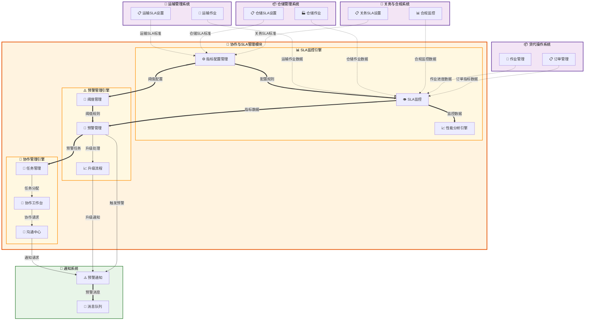

# 协作与SLA管理 (Collaboration & SLA Management)

## 💡 新手提示：协作与SLA管理核心概念

在开始阅读协作与SLA管理功能前，请先理解以下关键概念：

*   **SLA（服务水平协议）**：明确定义的服务质量标准和承诺
*   **协作管理**：内外部团队协作流程和机制
*   **性能监控**：实时监控服务质量指标
*   **预警机制**：主动识别和预防服务质量问题
*   **持续改进**：基于数据分析的服务优化

### SLA指标类型
- **时效性指标**：响应时间、处理时间、交付时间等
- **质量指标**：准确率、完成率、客户满意度等
- **可用性指标**：系统可用率、服务连续性等
- **合规性指标**：法规遵循、标准执行等

### 协作层级
- **内部协作**：部门间、团队间的协作配合
- **外部协作**：与客户、供应商、合作伙伴的协作
- **系统协作**：不同系统间的数据交互和流程衔接
- **跨境协作**：国际业务中的多地协作

## 功能概述

协作与SLA管理是货代操作中的服务质量保障模块，通过建立标准化的服务水平协议和协作机制，确保内外部服务质量的持续改进和客户满意度的提升。

**🔍 业务价值说明**：

*   **服务标准化**：建立统一的服务质量标准和评估体系
*   **实时监控**：及时发现服务质量问题，快速响应
*   **主动预警**：预防性识别潜在风险，降低服务中断
*   **持续改进**：基于数据驱动的服务质量持续优化
*   **客户满意**：提升客户体验和满意度
*   **供应商管理**：优化供应商选择和管理决策

**核心功能模块**：

*   **SLA指标管理**：定义、配置和维护各类服务水平指标
*   **实时监控**：监控SLA指标的实时表现和趋势分析
*   **预警管理**：设置阈值预警和自动通知机制
*   **协作工作台**：提供内外部协作的统一平台
*   **性能分析**：生成SLA报告和性能分析
*   **供应商评估**：基于SLA的供应商绩效评估
*   **客户满意度**：客户服务质量反馈和改进

## 菜单结构

    协作与SLA管理
    ├── SLA概览                     # SLA指标仪表板和实时监控
    ├── 指标配置                    # SLA指标定义和阈值设置
    ├── 实时监控                    # 运营、异常、性能监控
    ├── 预警管理                    # 预警规则和通知设置
    ├── 协作工作台                  # 内外部协作和任务管理
    ├── 性能分析                    # SLA报告和趋势分析
    ├── 供应商评估                  # 绩效评估和排名
    └── 客户满意度                  # 满意度调查和反馈管理


## 协作与SLA管理数据流转图



## 页面原型设计

### SLA概览页面

    +----------------------------------------------------------+
    |  协作与SLA管理 > SLA概览                    [刷新] [导出] [设置] |
    +----------------------------------------------------------+
    | 核心指标概览：                                              |
    | +----------------+----------------+----------------+       |
    | | 整体SLA达成率  | 平均响应时间   | 准时交付率     |       |
    | | 98.5% ↗+0.3%   | 2.3小时 ↘-0.2  | 95.2% ↗+1.1%   |       |
    | +----------------+----------------+----------------+       |
    | | 客户满意度     | 异常处理率     | 供应商达标率   |       |
    | | 4.6/5.0 ↗+0.1  | 92.8% ↗+2.1%   | 89.5% ↘-1.5%   |       |
    | +----------------+----------------+----------------+       |
    +----------------------------------------------------------+
    | ⚠️ 当前预警 (3项)：                                         |
    | • 订单确认及时率低于阈值 (85% < 90%)                        |
    | • 客户投诉响应时间超标 (6小时 > 4小时)                      |
    | • 供应商ABC的准时率下降 (88% < 95%)                         |
    +----------------------------------------------------------+
    | SLA指标详情：                                               |
    | 指标名称       | 目标值 | 当前值 | 达成率 | 趋势 | 状态    |
    |---------------|-------|-------|-------|------|---------|
    | 订单确认及时率 | ≥90%  | 85%   | 94.4% | ↘    | ⚠️预警  |
    | 订舱成功率     | ≥95%  | 97%   | 102.1%| ↗    | ✅正常  |
    | 单证及时率     | ≥98%  | 99%   | 101.0%| ↗    | ✅正常  |
    | 客户投诉响应   | ≤4小时| 6小时 | 66.7% | ↘    | ❌超标  |
    +----------------------------------------------------------+
    | [实时监控图表区域 - 显示关键指标的实时变化趋势]              |
    +----------------------------------------------------------+

### 协作工作台页面

    +----------------------------------------------------------+
    |  协作与SLA管理 > 协作工作台              [新建任务] [会议安排] |
    +----------------------------------------------------------+
    | 工作台视图：[任务看板] [内部协作] [外部协作] [消息中心]      |
    +----------------------------------------------------------+
    | 任务看板：                                                  |
    | 待处理 (5)    | 进行中 (3)    | 待审核 (2)    | 已完成 (8) |
    |---------------|---------------|---------------|-------------|
    | [高] 客户投诉  | [高] 紧急订舱  | [低] 费用审核  | [中] 单证制作|
    | WAY-001延误   | 客户加急处理   | 运单费用审核   | 提单发票完成 |
    | 负责：张三     | 负责：王五     | 提交：赵六     | 完成：孙七   |
    | 截止：今天18:00| 进度：60%     | 2小时前       | 1小时前     |
    |               |               |               |             |
    | [中] 供应商协调| [中] 单证审核  | [中] 价格确认  | [低] 资料归档|
    | 船公司舱位问题 | 提单信息核对   | 客户询价回复   | 订单资料整理 |
    | 负责：李四     | 负责：钱八     | 提交：周九     | 完成：吴十   |
    | 截止：明天12:00| 进度：80%     | 1小时前       | 30分钟前    |
    +----------------------------------------------------------+
    | 协作概况：                                                  |
    | 内部协作：操作部↔客服部(客户需求) 操作部↔财务部(费用核算)   |
    | 外部协作：与船公司(舱位预订) 与拖车公司(提货安排)           |
    +----------------------------------------------------------+

### 性能分析页面

    +----------------------------------------------------------+
    |  协作与SLA管理 > 性能分析                   [自定义] [导出] |
    +----------------------------------------------------------+
    | 分析条件：                                                  |
    | 时间范围：[最近30天 ▼] 业务类型：[全部 ▼] 客户：[全部 ▼]   |
    | 指标类别：[全部 ▼] 对比维度：[同期对比 ▼]    [查询] [重置] |
    +----------------------------------------------------------+
    | 性能趋势图表：                                              |
    | [SLA达成率趋势图 - 30天内各指标达成率变化]                  |
    | [响应时间分布图 - 不同时间段的响应时间分布]                 |
    +----------------------------------------------------------+
    | 详细性能指标：                                              |
    | 指标类别   | 指标名称       | 目标值 | 当前值 | 上期值 | 趋势 | 状态 |
    |-----------|---------------|-------|-------|-------|------|------|
    | 订单处理   | 订单确认及时率 | ≥90%  | 85%   | 88%   | ↘-3% | 未达标|
    |           | 订舱成功率     | ≥95%  | 97%   | 96%   | ↗+1% | 达标  |
    |           | 单证及时率     | ≥98%  | 99%   | 98.5% | ↗+0.5%| 达标 |
    | 客户服务   | 投诉响应时间   | ≤4小时| 6小时 | 5小时 | ↘+1h | 超标  |
    |           | 客户满意度     | ≥4.5  | 4.6   | 4.5   | ↗+0.1| 达标  |
    | 供应商管理 | 供应商准时率   | ≥95%  | 89%   | 92%   | ↘-3% | 未达标|
    +----------------------------------------------------------+
    | 改进建议：                                                  |
    | • 订单确认流程需要优化，建议增加自动化审核环节               |
    | • 客户投诉处理人员需要增加，缩短响应时间                     |
    | • 供应商管理需要加强，建立更严格的考核机制                   |
    +----------------------------------------------------------+

### 预警管理页面

    +----------------------------------------------------------+
    |  协作与SLA管理 > 预警管理                   [新建规则] [批量处理] |
    +----------------------------------------------------------+
    | 预警规则配置：                                              |
    | 规则名称         | 监控指标     | 阈值条件 | 通知方式 | 状态 | 操作 |
    |-----------------|-------------|---------|---------|------|------|
    | 订单确认超时预警 | 订单确认及时率| <90%    | 邮件+短信| 启用 | [编辑][停用] |
    | 客户投诉响应预警 | 投诉响应时间  | >4小时  | 系统通知 | 启用 | [编辑][停用] |
    | 供应商绩效预警   | 供应商准时率  | <95%    | 邮件    | 启用 | [编辑][停用] |
    +----------------------------------------------------------+
    | 当前预警列表：                                              |
    | 预警时间    | 预警类型     | 预警内容           | 严重程度 | 处理状态 | 操作 |
    |------------|-------------|-------------------|---------|---------|------|
    | 10:30      | 订单确认超时 | 订单ORD-001确认超时| 高      | 处理中   | [详情][处理] |
    | 09:45      | 客户投诉响应 | 投诉COMP-002超时  | 中      | 已分配   | [详情][跟进] |
    | 08:20      | 供应商绩效   | 供应商ABC绩效下降 | 中      | 待处理   | [详情][分配] |
    +----------------------------------------------------------+
    | 预警处理：                                                  |
    | 预警ID：ALT-20240315-001 | 类型：订单确认超时              |
    | 触发条件：订单ORD-001在2小时内未确认                        |
    | 影响范围：客户ABC公司，订单金额$50,000                      |
    | 处理建议：立即联系客户确认订单详情，加急处理                 |
    | 分配给：[张三 ▼] 优先级：[高 ▼] 截止时间：[今天18:00]       |
    | 处理备注：[________________________________]               |
    |                                           [分配] [升级] [关闭] |
    +----------------------------------------------------------+

### 供应商评估页面

    +----------------------------------------------------------+
    |  协作与SLA管理 > 供应商评估                 [评估设置] [导出报告] |
    +----------------------------------------------------------+
    | 评估条件：                                                  |
    | 评估周期：[本月 ▼] 供应商类型：[全部 ▼] 业务类型：[全部 ▼]  |
    | 评估维度：[√]准时率 [√]质量 [√]服务 [√]成本    [查询] [重置] |
    +----------------------------------------------------------+
    | 供应商排行榜：                                              |
    | 排名 | 供应商名称   | 综合评分 | 准时率 | 质量评分 | 服务评分 | 成本评分 |
    |------|-------------|---------|-------|---------|---------|---------|
    | 1    | 船公司A      | 92.5    | 95%   | 90      | 95      | 88      |
    | 2    | 拖车公司B    | 89.2    | 92%   | 88      | 90      | 87      |
    | 3    | 报关行C      | 85.8    | 88%   | 85      | 88      | 82      |
    | 4    | 仓储公司D    | 82.3    | 85%   | 82      | 85      | 78      |
    +----------------------------------------------------------+
    | 供应商详细评估（船公司A）：                                  |
    | 基本信息：合作时间3年 | 合作订单1,250单 | 合作金额$2,500,000  |
    | 
    | 评估指标详情：                                              |
    | 指标类别 | 指标名称     | 目标值 | 实际值 | 得分 | 权重 | 加权得分 |
    |---------|-------------|-------|-------|------|------|---------|
    | 时效性   | 准时交付率   | ≥95%  | 95%   | 95   | 30%  | 28.5    |
    |         | 响应及时率   | ≥90%  | 92%   | 92   | 10%  | 9.2     |
    | 质量     | 服务质量评分 | ≥85   | 90    | 90   | 25%  | 22.5    |
    |         | 投诉处理率   | ≥95%  | 98%   | 98   | 15%  | 14.7    |
    | 成本     | 价格竞争力   | 良好   | 良好   | 88   | 20%  | 17.6    |
    | 总分     |             |       |       |      | 100% | 92.5    |
    +----------------------------------------------------------+
    | 改进建议：                                                  |
    | • 建议在价格方面进一步优化，提升成本竞争力                   |
    | • 继续保持优秀的服务质量和准时交付表现                       |
    +----------------------------------------------------------+

### 客户满意度页面

    +----------------------------------------------------------+
    |  协作与SLA管理 > 客户满意度                 [发起调查] [分析报告] |
    +----------------------------------------------------------+
    | 满意度概览：                                                |
    | +----------------+----------------+----------------+       |
    | | 整体满意度     | 本月满意度     | 满意度趋势     |       |
    | | 4.6/5.0        | 4.7/5.0 ↗     | 持续上升 ↗     |       |
    | +----------------+----------------+----------------+       |
    | | 调查回收率     | NPS净推荐值    | 投诉解决率     |       |
    | | 78.5%          | +45           | 96.2%          |       |
    | +----------------+----------------+----------------+       |
    +----------------------------------------------------------+
    | 满意度调查管理：                                            |
    | 调查名称       | 调查类型 | 发送时间 | 回收率 | 平均分 | 状态 | 操作 |
    |---------------|---------|---------|-------|-------|------|------|
    | 3月服务满意度  | 定期调查 | 03-01   | 78.5% | 4.7   | 进行中| [查看][分析] |
    | 订单完成满意度 | 订单调查 | 03-15   | 65.2% | 4.5   | 已完成| [查看][报告] |
    | 投诉处理满意度 | 投诉调查 | 03-10   | 85.0% | 4.2   | 已完成| [查看][改进] |
    +----------------------------------------------------------+
    | 客户反馈分析：                                              |
    | 评价维度     | 平均分 | 满意占比 | 不满意占比 | 主要问题        |
    |-------------|-------|---------|-----------|----------------|
    | 服务及时性   | 4.5   | 85%     | 8%        | 响应时间较慢    |
    | 服务质量     | 4.7   | 92%     | 3%        | 专业度需提升    |
    | 沟通效果     | 4.4   | 82%     | 10%       | 信息更新不及时  |
    | 问题解决     | 4.6   | 88%     | 6%        | 解决方案不够完善|
    | 整体满意度   | 4.6   | 87%     | 7%        | 综合体验待优化  |
    +----------------------------------------------------------+
    | 改进行动计划：                                              |
    | 问题类别     | 改进措施                 | 负责人 | 完成时间 | 状态   |
    |-------------|-------------------------|-------|---------|-------|
    | 响应时间     | 增加客服人员，优化流程   | 李经理 | 03-31   | 进行中 |
    | 信息更新     | 建立自动通知机制         | 王主管 | 04-15   | 计划中 |
    | 专业培训     | 组织业务技能培训         | 张总监 | 04-30   | 计划中 |
    +----------------------------------------------------------+

## 业务流程

### 💡 新手提示：业务流程阅读指南

以下业务流程描述了协作与SLA管理的完整运作机制。每个步骤都包含：

*   **监控动作**：系统自动监控和数据采集
*   **系统交互**：涉及的系统间调用和数据传递
*   **决策点**：需要人工判断或系统自动判断的关键节点
*   **协作机制**：内外部协作的触发和执行过程

### 📋 SLA监控流程

1.  **数据采集**：系统自动采集各业务模块的操作数据和时间戳
    > **新手说明**：这是SLA监控的基础，需要从各个业务系统实时获取数据
    *   **🔗 跨系统触发**：各业务系统 → 协作与SLA管理 **【读取数据】**
        *   **调用方式**：RESTful API (GET /api/sla/data-collection)
        *   **调用时机**：业务操作完成后实时触发数据采集
        *   **数据操作**：
            *   **数据读取**：从订单管理的 orders (订单表)、作业管理的 jobs (作业表)、客户门户的 customer_feedback (客户反馈表) 等表读取业务数据
            *   **数据写入**：向协作与SLA管理的 sla_metrics_data (SLA指标数据表) 表写入采集的指标数据
            *   **数据计算**：在协作与SLA管理的 sla_calculations (SLA计算表) 表中执行指标计算
        *   **入参**：`{business_module, operation_type, timestamp, data_payload}`
            *   `business_module` (业务模块): string，数据来源的业务模块标识
            *   `operation_type` (操作类型): string，具体的业务操作类型
            *   `timestamp` (时间戳): datetime，操作发生的精确时间
            *   `data_payload` (数据载荷): object，包含具体的业务数据内容
        *   **出参**：`{collection_id, metrics_calculated, alert_triggered}`
            *   `collection_id` (采集ID): string，本次数据采集的唯一标识
            *   `metrics_calculated` (指标计算结果): object，计算得出的各项SLA指标值
            *   `alert_triggered` (预警触发状态): boolean，是否触发了预警机制

2.  **指标计算**：根据SLA定义自动计算各项服务水平指标
    > **新手说明**：系统会根据预设的计算规则，实时计算各种SLA指标的达成情况
    *   **系统内流转**：SLA指标计算和更新

3.  **阈值比较**：将计算结果与预设阈值进行比较，判断是否达标
    > **新手说明**：这是判断服务质量是否符合标准的关键环节
    *   **系统内流转**：阈值检查和达标判断

4.  **预警触发**：未达标时自动触发预警机制，发送通知
    > **新手说明**：预警机制能够及时发现问题，避免服务质量进一步恶化
    *   **🔗 跨系统触发**：协作与SLA管理 → 通知系统 **【写入数据】**
        *   **调用方式**：RESTful API (POST /api/notification/send-alert)
        *   **调用时机**：SLA指标未达标时立即触发
        *   **数据操作**：
            *   **数据读取**：从协作与SLA管理的 alert_rules (预警规则表) 表读取预警配置
            *   **数据写入**：向通知系统的 notifications (通知表) 表写入预警通知记录
            *   **数据更新**：更新协作与SLA管理的 alert_history (预警历史表) 表中的预警记录
        *   **入参**：`{alert_type, severity_level, affected_metrics, notification_targets}`
            *   `alert_type` (预警类型): string，预警的具体类型标识
            *   `severity_level` (严重程度): enum (低/中/高/紧急)，预警的严重等级
            *   `affected_metrics` (影响指标): array，受影响的SLA指标列表
            *   `notification_targets` (通知对象): array，需要接收通知的人员列表
        *   **出参**：`{notification_id, delivery_status, escalation_triggered}`
            *   `notification_id` (通知ID): string，预警通知的唯一标识
            *   `delivery_status` (发送状态): object，各种通知渠道的发送状态
            *   `escalation_triggered` (升级触发): boolean，是否触发了升级处理流程

5.  **问题处理**：分配责任人进行问题分析和处理
    > **新手说明**：预警发出后，需要有专人负责分析原因并采取改进措施
    *   **🔗 跨系统触发**：协作与SLA管理 → 协作工作台 **【写入数据】**
        *   **调用方式**：RESTful API (POST /api/collaboration/create-task)
        *   **调用时机**：预警需要人工处理时自动创建协作任务
        *   **数据操作**：
            *   **数据写入**：向协作与SLA管理的 collaboration_tasks (协作任务表) 表写入处理任务
            *   **数据分配**：在协作与SLA管理的 task_assignments (任务分配表) 表中分配责任人
            *   **数据跟踪**：在协作与SLA管理的 task_progress (任务进度表) 表中跟踪处理进度
        *   **入参**：`{alert_id, task_description, priority_level, assigned_to}`
            *   `alert_id` (预警ID): string，关联的预警记录标识
            *   `task_description` (任务描述): string，具体的处理任务内容
            *   `priority_level` (优先级): enum (低/中/高)，任务处理优先级
            *   `assigned_to` (分配给): string，负责处理的人员标识
        *   **出参**：`{task_id, assignment_status, estimated_completion}`
            *   `task_id` (任务ID): string，创建的协作任务唯一标识
            *   `assignment_status` (分配状态): enum (已分配/待确认/已接受)，任务分配状态
            *   `estimated_completion` (预计完成时间): datetime，预估的任务完成时间

### 📋 协作管理流程

1.  **协作需求识别**：系统或用户识别需要协作的业务场景
    > **新手说明**：协作可能由系统自动触发（如预警处理）或用户主动发起（如跨部门协调）
    *   **系统内流转**：协作需求分析和分类

2.  **协作任务创建**：创建具体的协作任务，明确协作目标和参与方
    > **新手说明**：明确的任务定义是协作成功的基础
    *   **系统内流转**：任务创建和初始化

3.  **参与方分配**：根据协作类型和业务需要，分配内外部参与方
    > **新手说明**：合适的人员配置是协作效率的关键
    *   **🔗 跨系统触发**：协作与SLA管理 → 员工管理/供应商管理 **【查询数据】**
        *   **调用方式**：RESTful API (GET /api/resource/get-available-participants)
        *   **调用时机**：创建协作任务时查询可用的参与人员
        *   **数据操作**：
            *   **数据读取**：从员工管理的 employees (员工表) 表、供应商管理的 suppliers (供应商表) 表读取可用资源信息
            *   **数据匹配**：在协作与SLA管理的 collaboration_rules (协作规则表) 表中匹配合适的参与方
        *   **入参**：`{collaboration_type, required_skills, availability_window}`
            *   `collaboration_type` (协作类型): enum (内部协作/外部协作/混合协作)，协作的类型
            *   `required_skills` (所需技能): array，参与协作所需的技能要求
            *   `availability_window` (可用时间窗口): object，协作任务的时间要求
        *   **出参**：`{available_participants, recommended_assignments, skill_matching}`
            *   `available_participants` (可用参与者): array，符合条件的可用人员列表
            *   `recommended_assignments` (推荐分配): object，系统推荐的人员分配方案
            *   `skill_matching` (技能匹配度): object，各参与者的技能匹配评分

4.  **协作执行**：参与方按照协作计划执行具体的协作活动
    > **新手说明**：协作过程中需要实时沟通和进度同步
    *   **系统内流转**：协作进度跟踪和状态更新

5.  **结果确认**：协作完成后，确认协作结果和效果评估
    > **新手说明**：结果确认是协作质量保证和经验积累的重要环节
    *   **系统内流转**：协作结果记录和效果评估

### 📋 性能分析流程

1.  **数据汇总**：定期汇总各项SLA指标数据，生成分析数据集
    > **新手说明**：数据汇总为深入分析提供基础数据支撑
    *   **系统内流转**：数据汇总和预处理

2.  **趋势分析**：分析SLA指标的变化趋势，识别改进或恶化的模式
    > **新手说明**：趋势分析帮助识别服务质量的发展方向
    *   **系统内流转**：趋势计算和模式识别

3.  **对比分析**：与历史数据、行业标准或竞争对手进行对比分析
    > **新手说明**：对比分析提供改进的参考基准
    *   **系统内流转**：对比计算和差异分析

4.  **根因分析**：深入分析SLA未达标的根本原因
    > **新手说明**：找到问题根源是制定有效改进措施的前提
    *   **系统内流转**：根因分析和问题诊断

5.  **改进建议**：基于分析结果，提出具体的改进建议和行动计划
    > **新手说明**：分析的最终目的是指导实际的改进行动
    *   **🔗 跨系统触发**：协作与SLA管理 → 工作流与自动化 **【写入数据】**
        *   **调用方式**：RESTful API (POST /api/workflow/create-improvement-plan)
        *   **调用时机**：性能分析完成后自动生成改进计划
        *   **数据操作**：
            *   **数据写入**：向工作流与自动化的 improvement_plans (改进计划表) 表写入改进方案
            *   **数据创建**：在工作流与自动化的 workflow_instances (工作流实例表) 表中创建改进流程实例
        *   **入参**：`{analysis_results, improvement_recommendations, priority_ranking}`
            *   `analysis_results` (分析结果): object，详细的性能分析结果数据
            *   `improvement_recommendations` (改进建议): array，具体的改进措施建议
            *   `priority_ranking` (优先级排序): array，改进措施的优先级排序
        *   **出参**：`{plan_id, workflow_created, tracking_enabled}`
            *   `plan_id` (计划ID): string，改进计划的唯一标识
            *   `workflow_created` (工作流创建状态): boolean，是否成功创建改进工作流
            *   `tracking_enabled` (跟踪启用状态): boolean，是否启用了改进进度跟踪

## 核心SLA指标体系

### 📊 订单处理指标

| 指标名称 | 定义 | 目标值 | 计算公式 | 监控频率 | 数据来源 |
|---------|------|--------|----------|----------|----------|
| 订单确认及时率 | 在规定时间内确认订单的比例 | ≥90% | (及时确认订单数/总订单数) × 100% | 实时 | 订单管理 |
| 订舱成功率 | 成功订到舱位的订单比例 | ≥95% | (成功订舱数/订舱申请数) × 100% | 每日 | 订舱管理 |
| 单证及时率 | 按时完成单证制作的比例 | ≥98% | (及时完成单证数/总单证数) × 100% | 每日 | 单证管理 |
| 准时到达率 | 货物按计划时间到达的比例 | ≥95% | (准时到达票数/总票数) × 100% | 每周 | 运输管理 |

### 📊 客户服务指标

| 指标名称 | 定义 | 目标值 | 计算公式 | 监控频率 | 数据来源 |
|---------|------|--------|----------|----------|----------|
| 客户投诉响应时间 | 从收到投诉到首次响应的时间 | ≤4小时 | 平均(响应时间 - 投诉时间) | 实时 | 客户门户 |
| 异常处理及时率 | 在规定时间内处理异常的比例 | ≥90% | (及时处理异常数/总异常数) × 100% | 每日 | 异常管理 |
| 客户满意度评分 | 客户对服务质量的综合评价 | ≥4.5 | 加权平均(各维度满意度评分) | 每月 | 客户门户 |
| 问题解决率 | 客户问题得到彻底解决的比例 | ≥95% | (已解决问题数/总问题数) × 100% | 每周 | 客户门户 |

### 📊 供应商管理指标

| 指标名称 | 定义 | 目标值 | 计算公式 | 监控频率 | 数据来源 |
|---------|------|--------|----------|----------|----------|
| 供应商准时率 | 供应商按时完成服务的比例 | ≥95% | (准时完成服务数/总服务数) × 100% | 每日 | 供应商管理 |
| 供应商质量评分 | 供应商服务质量的综合评价 | ≥85分 | 加权平均(质量评价各维度得分) | 每月 | 供应商管理 |
| 供应商响应时间 | 供应商对服务请求的响应时间 | ≤2小时 | 平均(响应时间 - 请求时间) | 实时 | 供应商管理 |
| 合同履约率 | 供应商按合同要求履约的比例 | ≥98% | (履约服务数/合同服务数) × 100% | 每月 | 供应商管理 |

### 📊 系统性能指标

| 指标名称 | 定义 | 目标值 | 计算公式 | 监控频率 | 数据来源 |
|---------|------|--------|----------|----------|----------|
| 系统可用率 | 系统正常运行时间的比例 | ≥99.5% | (正常运行时间/总时间) × 100% | 实时 | 系统监控 |
| 平均响应时间 | 系统处理请求的平均时间 | ≤2秒 | 总响应时间/请求总数 | 实时 | 系统监控 |
| 数据准确率 | 系统数据的准确性比例 | ≥99.9% | (准确数据条数/总数据条数) × 100% | 每日 | 数据质量 |
| 接口成功率 | 系统接口调用成功的比例 | ≥99% | (成功调用次数/总调用次数) × 100% | 实时 | 接口监控 |

## 预警规则配置

### ⚠️ 预警级别定义

*   **🔴 紧急预警**：严重影响业务运营，需要立即处理
    *   触发条件：关键指标严重偏离目标值（偏离度>20%）
    *   通知方式：电话 + 短信 + 邮件 + 系统弹窗
    *   响应时间：15分钟内必须响应
    *   升级机制：30分钟无响应自动升级至高级管理层

*   **🟡 重要预警**：影响服务质量，需要及时关注
    *   触发条件：重要指标偏离目标值（偏离度10%-20%）
    *   通知方式：短信 + 邮件 + 系统通知
    *   响应时间：1小时内必须响应
    *   升级机制：2小时无响应升级至部门主管

*   **🟢 一般预警**：潜在风险，需要监控关注
    *   触发条件：一般指标偏离目标值（偏离度5%-10%）
    *   通知方式：邮件 + 系统通知
    *   响应时间：4小时内响应
    *   升级机制：8小时无响应升级至直接主管

### ⚠️ 预警规则示例

```
规则名称：订单确认超时预警
监控指标：订单确认及时率
触发条件：及时率 < 90%
预警级别：重要预警
通知对象：订单管理员、部门主管
通知方式：短信 + 邮件
处理时限：1小时内响应
升级条件：2小时无响应或及时率 < 80%

规则名称：客户投诉响应超时预警
监控指标：客户投诉响应时间
触发条件：响应时间 > 4小时
预警级别：紧急预警
通知对象：客服经理、运营总监
通知方式：电话 + 短信 + 邮件
处理时限：15分钟内响应
升级条件：30分钟无响应或响应时间 > 8小时
```

## 协作机制设计

### 🤝 内部协作机制

*   **跨部门协作**：建立标准化的跨部门协作流程
    *   **操作部 ↔ 客服部**：客户需求确认、问题反馈处理
    *   **操作部 ↔ 财务部**：费用核算、账期管理
    *   **操作部 ↔ 单证部**：单证制作、审核流程
    *   **操作部 ↔ 关务部**：报关报检、合规确认

*   **协作工具**：提供统一的协作平台和工具
    *   **任务看板**：可视化的任务管理和进度跟踪
    *   **即时通讯**：实时沟通和信息交换
    *   **文档共享**：协作文档的共同编辑和版本管理
    *   **会议系统**：在线会议和远程协作支持

### 🤝 外部协作机制

*   **客户协作**：与客户的协作沟通机制
    *   **需求确认**：订单需求的确认和变更管理
    *   **进度通报**：定期的进度更新和状态通知
    *   **问题处理**：异常情况的及时沟通和处理
    *   **满意度反馈**：服务质量的反馈和改进

*   **供应商协作**：与供应商的协作管理机制
    *   **服务协调**：服务安排的协调和确认
    *   **质量监控**：服务质量的监控和评估
    *   **问题解决**：服务问题的协作解决
    *   **绩效评估**：定期的绩效评估和改进

## 持续改进机制

### 📈 改进流程

1.  **问题识别**：通过SLA监控、客户反馈、内部审核等方式识别改进机会
2.  **根因分析**：深入分析问题的根本原因，制定针对性的改进措施
3.  **改进计划**：制定详细的改进计划，明确改进目标、措施和时间表
4.  **实施执行**：按计划实施改进措施，跟踪执行进度
5.  **效果评估**：评估改进效果，验证是否达到预期目标
6.  **标准化推广**：将有效的改进措施标准化，在全组织推广应用

### 📈 改进方法

*   **PDCA循环**：计划-执行-检查-行动的持续改进循环
*   **六西格玛**：数据驱动的质量改进方法
*   **精益管理**：消除浪费、提升效率的管理方法
*   **标杆学习**：学习行业最佳实践，提升服务水平

### 📈 改进激励

*   **改进奖励**：对提出有效改进建议的员工给予奖励
*   **最佳实践分享**：定期分享改进成功案例和最佳实践
*   **绩效考核**：将持续改进纳入员工和部门的绩效考核
*   **培训发展**：提供改进方法和工具的培训，提升改进能力

## 系统集成接口

### 🔌 数据接口规范

*   **数据格式**：统一使用JSON格式，UTF-8编码
*   **接口协议**：RESTful API，支持HTTP/HTTPS
*   **认证方式**：OAuth 2.0 + JWT Token
*   **数据压缩**：支持GZIP压缩，提升传输效率
*   **错误处理**：标准化的错误码和错误信息

### 🔌 关键接口列表

| 接口名称 | 接口地址 | 请求方式 | 功能描述 | 调用频率 |
|---------|----------|----------|----------|----------|
| SLA数据采集 | /api/sla/data-collection | POST | 采集业务数据用于SLA计算 | 实时 |
| 预警通知发送 | /api/notification/send-alert | POST | 发送SLA预警通知 | 按需 |
| 协作任务创建 | /api/collaboration/create-task | POST | 创建协作任务 | 按需 |
| 性能数据查询 | /api/sla/performance-data | GET | 查询SLA性能数据 | 按需 |
| 客户满意度提交 | /api/satisfaction/submit-feedback | POST | 提交客户满意度反馈 | 按需 |

### 🔌 数据同步机制

*   **实时同步**：关键业务数据的实时同步，确保SLA监控的及时性
*   **批量同步**：历史数据和统计数据的批量同步，提升处理效率
*   **增量同步**：只同步变更的数据，减少网络传输和处理负载
*   **容错机制**：支持断点续传和重试机制，确保数据同步的可靠性

---

## 📊 报表与分析

### 📈 SLA报表

#### 订单处理SLA报表
```sql
-- SLA达成率统计
SELECT 
    DATE_FORMAT(created_date, '%Y-%m') as month,
    COUNT(*) as total_orders,
    SUM(CASE WHEN processing_time <= sla_target THEN 1 ELSE 0 END) as sla_met,
    ROUND(SUM(CASE WHEN processing_time <= sla_target THEN 1 ELSE 0 END) * 100.0 / COUNT(*), 2) as sla_rate
FROM orders 
WHERE created_date >= DATE_SUB(NOW(), INTERVAL 12 MONTH)
GROUP BY DATE_FORMAT(created_date, '%Y-%m')
ORDER BY month;
```

#### 客户服务SLA报表
```sql
-- 客户响应时间分析
SELECT 
    customer_level,
    AVG(response_time) as avg_response_time,
    MAX(response_time) as max_response_time,
    COUNT(*) as total_requests,
    SUM(CASE WHEN response_time <= sla_target THEN 1 ELSE 0 END) as sla_met
FROM customer_service_requests 
WHERE created_date >= DATE_SUB(NOW(), INTERVAL 1 MONTH)
GROUP BY customer_level;
```

### 📊 协作效率分析

#### 部门协作效率
```sql
-- 跨部门协作时间分析
SELECT 
    from_department,
    to_department,
    AVG(collaboration_time) as avg_time,
    COUNT(*) as collaboration_count,
    SUM(CASE WHEN collaboration_time <= standard_time THEN 1 ELSE 0 END) as efficient_count
FROM department_collaborations 
WHERE created_date >= DATE_SUB(NOW(), INTERVAL 3 MONTH)
GROUP BY from_department, to_department;
```

#### 供应商协作分析
```sql
-- 供应商响应效率
SELECT 
    supplier_id,
    supplier_name,
    AVG(response_time) as avg_response,
    COUNT(*) as total_requests,
    AVG(service_quality_score) as avg_quality
FROM supplier_collaborations sc
JOIN suppliers s ON sc.supplier_id = s.id
WHERE sc.created_date >= DATE_SUB(NOW(), INTERVAL 6 MONTH)
GROUP BY supplier_id, supplier_name
ORDER BY avg_quality DESC;
```

---

## 总结

协作与SLA管理模块作为货代业务的服务质量保障核心，通过标准化的SLA指标体系、智能化的协作机制和完善的监控预警系统，实现了从服务承诺到交付的全过程质量管控。系统不仅提升了内外部协作效率，还通过数据驱动的持续改进为业务优化提供了有力支撑。

### 核心价值
- **服务质量标准化**：统一的SLA指标确保服务水平一致性
- **协作效率提升**：智能化协作机制优化跨部门和供应商协作
- **全面监控预警**：实时监控和智能预警确保问题及时发现和处理
- **数据驱动改进**：基于数据分析的持续改进机制

### 技术特色
- **微服务架构**：模块化设计，支持灵活扩展和独立部署
- **智能监控引擎**：AI驱动的异常检测和预警机制
- **实时数据处理**：流式数据处理确保监控指标实时更新
- **完善的集成能力**：与各业务系统深度集成，数据无缝流转

---

## 文档版本信息

| 版本 | 日期 | 修改内容 | 修改人 |
|------|------|----------|--------|
| 1.0 | 2024-03-15 | 初始版本创建 | 系统架构师 |
| 1.1 | 2024-03-20 | 增加智能预警功能 | 产品经理 |
| 1.2 | 2024-03-25 | 完善协作机制设计 | 业务分析师 |

## 相关文档链接

* [1.1 订单管理](./1.1%20订单管理.md)
* [1.2 作业管理](./1.2%20作业管理.md)
* [1.5 里程碑跟踪](./1.5%20里程碑跟踪.md)
* [1.9 异常管理](./1.9%20异常管理.md)
* [7. 客户关系管理](../7.%20客户关系管理.md)
* [8. 供应商管理](../8.%20供应商管理.md)

```


