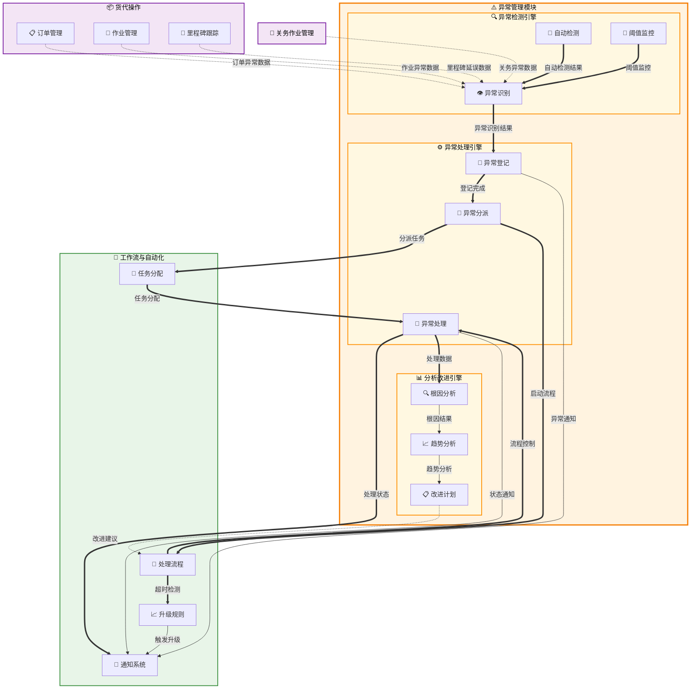

# 异常管理 (Exception Management)

## 💡 新手提示：异常管理核心概念

在开始阅读异常管理功能前，请先理解以下关键概念：

*   **异常事件**：偏离正常业务流程或标准的事件，需要特殊处理
*   **异常分类**：按业务类型、严重程度、影响范围对异常进行分类管理
*   **处理流程**：标准化的异常处理步骤和责任分工机制
*   **根因分析**：深入分析异常产生的根本原因，制定预防措施

### 异常生命周期
- **发现**：异常事件被识别和上报
- **登记**：记录异常详细信息
- **分派**：分配给相应处理人员
- **处理**：执行解决方案
- **验证**：确认异常已解决
- **关闭**：异常处理完成

### 异常类型
- **运输异常**：货物延误、损坏、丢失等运输过程中的问题
- **单证异常**：提单错误、报关单不符、证书缺失等文档问题
- **费用异常**：费用争议、计费错误、付款延迟等财务问题
- **系统异常**：系统故障、数据错误、接口异常等技术问题
- **客户异常**：客户投诉、服务不满、沟通问题等客服问题
- **供应商异常**：供应商服务问题、合作纠纷等外部合作问题

## 功能概述

异常管理是货代操作中的风险控制和质量保障模块，通过建立完善的异常识别、记录、处理和跟踪机制，确保业务流程的稳定性和客户服务质量的持续改进。

**🔍 业务价值说明**：

*   **快速响应**：及时发现和处理异常，减少业务影响
*   **风险控制**：降低异常事件对业务和客户的影响
*   **质量提升**：通过异常分析持续改进服务质量
*   **客户满意**：快速解决客户问题，提升客户体验

**核心功能模块**：

*   **异常识别与登记**：自动检测和人工上报异常事件
*   **异常处理与跟踪**：标准化处理流程和实时状态跟踪
*   **根因分析与预防**：深入分析异常原因，制定预防措施
*   **统计分析与改进**：异常趋势分析和持续改进机制

## 菜单结构

    异常管理
    ├── 异常概览                    # 异常仪表板和实时监控
    ├── 异常登记                    # 手动登记和自动检测异常
    ├── 异常处理                    # 异常处理和进度跟踪
    ├── 异常分析                    # 根因分析和影响评估
    ├── 预警设置                    # 预警规则和阈值配置
    ├── 处理流程配置                # 流程定义和责任分工
    └── 统计报表                    # 异常统计和趋势分析


## 异常管理数据流转图



## 页面原型设计

### 异常概览页面

    +----------------------------------------------------------+
    |  异常管理 > 异常概览                          [刷新] [导出] |
    +----------------------------------------------------------+
    | 核心指标：                                                  |
    | +----------------+----------------+----------------+       |
    | | 待处理异常     | 平均处理时间   | 及时处理率     |       |
    | | 23 个 (↗+5)    | 2.5小时 (↘-0.3)| 95.2% (↘-1.2%) |       |
    | +----------------+----------------+----------------+       |
    | | 本月异常总数   | 重复异常率     | 客户满意度     |       |
    | | 156 个 (↗+12)  | 8.5% (↘-2.1%)  | 4.6/5.0 (↗+0.2)|       |
    | +----------------+----------------+----------------+       |
    +----------------------------------------------------------+
    | 异常分布统计：                                              |
    | [按类型分布饼图]          [按严重程度分布柱状图]             |
    | 运输异常: 45%             高: 15个                          |
    | 单证异常: 25%             中: 28个                          |
    | 费用异常: 20%             低: 42个                          |
    | 系统异常: 10%                                               |
    +----------------------------------------------------------+
    | 异常趋势分析：                                              |
    | [异常数量趋势折线图 - 显示最近30天的异常数量变化]            |
    +----------------------------------------------------------+
    | 最新异常事件：                                              |
    | 异常编号     | 类型     | 严重程度 | 状态   | 处理人 | 操作 |
    |-------------|---------|---------|-------|-------|------|
    | EXC-001     | 货物延误 | 高       | 处理中 | 张三   | [详情] |
    | EXC-002     | 单证错误 | 中       | 待处理 | -      | [分派] |
    | EXC-003     | 费用争议 | 低       | 已解决 | 李四   | [查看] |
    +----------------------------------------------------------+

### 异常登记页面

    +----------------------------------------------------------+
    |  异常管理 > 异常登记                          [保存草稿] [提交] |
    +----------------------------------------------------------+
    | 基本信息                                                   |
    | 异常标题：[货物延误导致客户投诉___________________] *       |
    | 异常类型：[运输异常 ▼] 子类型：[货物延误 ▼]                |
    | 严重程度：(*) 高 ( ) 中 ( ) 低 ( ) 紧急                    |
    +----------------------------------------------------------+
    | 关联信息                                                   |
    | 关联订单：[ORD-20240315-001_______] [选择订单]             |
    | 关联作业：[JOB-20240315-001_______] [选择作业]             |
    | 影响客户：[ABC公司________________] [选择客户]             |
    +----------------------------------------------------------+
    | 异常详情                                                   |
    | 发生时间：[2024-03-15 14:30] 发现时间：[2024-03-15 15:00]  |
    | 异常描述：[由于恶劣天气影响，船舶延误3天到港，影响客户ABC公司] |
    |          [的紧急订单交付，客户表示强烈不满_______________] |
    | 影响评估：[延误3天，可能产生滞期费5000USD，客户关系受损___] |
    +----------------------------------------------------------+
    | 附件上传                                                   |
    | [点击上传或拖拽文件] 支持图片、文档等格式，单个文件≤10MB    |
    | 已上传：客户投诉邮件.pdf (2.5MB) [删除]                    |
    +----------------------------------------------------------+
    | 初步处理                                                   |
    | 紧急措施：[已联系船公司确认延误原因，通知客户延误情况_____] |
    | 预计解决时间：[2024-03-18 18:00]                          |
    +----------------------------------------------------------+

### 异常处理页面

    +----------------------------------------------------------+
    |  异常管理 > 异常处理                          [批量操作] [导出] |
    +----------------------------------------------------------+
    | 处理状态筛选：                                              |
    | (*) 待处理 (23) ( ) 处理中 (15) ( ) 已完成 (156) ( ) 我的任务 (8) |
    +----------------------------------------------------------+
    | 筛选条件：                                                  |
    | 异常类型：[全部 ▼] 严重程度：[全部 ▼] 处理人：[全部 ▼]     |
    | 日期范围：[2024-03-01] 至 [2024-03-31]      [筛选] [重置] |
    +----------------------------------------------------------+
    | 异常列表：                                                  |
    | [√] | 异常编号 | 标题     | 类型 | 严重程度 | 状态 | 处理人 | 操作 |
    |-----|---------|---------|------|---------|------|-------|------|
    | [√] | EXC-001 | 货物延误 | 运输 | 高       | 待处理| -     | [接受][分派] |
    | [ ] | EXC-002 | 单证错误 | 单证 | 中       | 处理中| 张三   | [详情][跟进] |
    +----------------------------------------------------------+
    | 异常详情（EXC-001）：                                       |
    | 标题：货物延误导致客户投诉                                   |
    | 描述：由于恶劣天气影响，船舶延误3天到港...                   |
    | 关联：订单 ORD-001 | 客户 ABC公司 | 发生时间 03-15 14:30    |
    +----------------------------------------------------------+
    | 处理进度：                                                  |
    | ████████░░ 80% 已完成                                      |
    | ✓ 15:00 异常上报 - 张三                                    |
    | ✓ 15:30 联系船公司 - 李四                                  |
    | ✓ 16:00 通知客户 - 李四                                    |
    | ○ 待处理：协调替代方案                                      |
    +----------------------------------------------------------+
    | 处理操作：                                                  |
    | 处理方案：[协调其他船期，安排加急运输___________________]    |
    | 预计完成：[2024-03-18 18:00] 处理人：[李四 ▼]              |
    |                                           [更新] [完成处理] |
    +----------------------------------------------------------+

### 异常分析页面

    +----------------------------------------------------------+
    |  异常管理 > 异常分析                          [生成报告] [导出] |
    +----------------------------------------------------------+
    | 分析条件：                                                  |
    | 分析周期：(*) 本月 ( ) 本季度 ( ) 本年度 ( ) 自定义        |
    | 异常类型：[全部 ▼] 严重程度：[全部 ▼]                      |
    | 分析维度：[√] 根因分析 [√] 趋势分析 [√] 影响评估            |
    |                                           [开始分析] [重置] |
    +----------------------------------------------------------+
    | 根因分析：                                                  |
    | 主要原因分布：                                              |
    | 1. 天气因素 (35%) - 恶劣天气导致运输延误                    |
    | 2. 供应商问题 (25%) - 供应商服务质量不稳定                  |
    | 3. 系统故障 (20%) - 系统异常影响业务流程                    |
    | 4. 人为错误 (15%) - 操作失误导致异常                        |
    | 5. 其他原因 (5%)                                           |
    +----------------------------------------------------------+
    | 趋势分析：                                                  |
    | [异常趋势图表 - 显示各类异常的月度变化趋势]                  |
    | 关键发现：                                                  |
    | • 运输异常呈上升趋势，主要集中在3-4月                       |
    | • 单证异常有所下降，系统优化效果显著                         |
    | • 费用异常波动较大，需要加强费用管控                         |
    +----------------------------------------------------------+
    | 改进建议：                                                  |
    | 1. 建立天气预警机制，提前制定应急预案                        |
    | 2. 加强供应商管理，建立供应商评估体系                        |
    | 3. 完善系统监控，提高系统稳定性                             |
    | 4. 加强员工培训，减少人为操作错误                           |
    +----------------------------------------------------------+

### 预警设置页面

    +----------------------------------------------------------+
    |  异常管理 > 预警设置                          [新建规则] [导入] |
    +----------------------------------------------------------+
    | 预警规则列表：                                              |
    | 规则名称         | 类型     | 状态 | 最后修改 | 操作        |
    |-----------------|---------|------|---------|-------------|
    | 货物延误预警     | 运输异常 | 启用 | 03-15   | [编辑][停用] |
    | 费用超标预警     | 费用异常 | 启用 | 03-10   | [编辑][停用] |
    | 客户投诉预警     | 客户异常 | 停用 | 03-08   | [编辑][启用] |
    +----------------------------------------------------------+
    | 规则详情（货物延误预警）：                                   |
    | 规则名称：[货物延误预警___________________]                  |
    | 触发条件：                                                  |
    | IF 实际到货时间 > 计划到货时间 + 24小时                     |
    | AND 货物价值 > 50000 USD                                   |
    | THEN 触发高级别预警                                        |
    +----------------------------------------------------------+
    | 预警设置：                                                  |
    | 预警级别：(*) 高 ( ) 中 ( ) 低                             |
    | 通知方式：[√] 邮件 [√] 短信 [√] 系统消息 [ ] 微信           |
    | 通知对象：[√] 业务员 [√] 部门经理 [ ] 客户                  |
    | 升级规则：超过 [4] 小时未处理自动升级                       |
    +----------------------------------------------------------+
    | 阈值配置：                                                  |
    | 延误时间阈值：[24] 小时                                     |
    | 货物价值阈值：[50000] USD                                  |
    | 客户等级：[VIP客户 ▼] 以上触发预警                          |
    |                                           [保存] [测试] [取消] |
    +----------------------------------------------------------+

### 统计报表页面

    +----------------------------------------------------------+
    |  异常管理 > 统计报表                          [自定义报表] [导出] |
    +----------------------------------------------------------+
    | 报表筛选条件：                                              |
    | 统计周期：(*) 本月 ( ) 本季度 ( ) 本年度 ( ) 自定义        |
    | 自定义时间：[2024-03-01] 至 [2024-03-31]                  |
    | 异常类型：[全部 ▼] 严重程度：[全部 ▼] 处理人：[全部 ▼]     |
    |                                           [生成报表] [重置] |
    +----------------------------------------------------------+
    | 异常概况统计：                                              |
    | +----------------+----------------+----------------+       |
    | | 异常总数       | 已解决异常     | 处理中异常     |       |
    | | 156 个         | 128 个 (82%)   | 28 个 (18%)    |       |
    | +----------------+----------------+----------------+       |
    | | 平均处理时间   | 及时处理率     | 重复异常率     |       |
    | | 2.5 小时       | 95.2%          | 8.5%           |       |
    | +----------------+----------------+----------------+       |
    +----------------------------------------------------------+
    | 异常类型分析：                                              |
    | 异常类型   | 数量 | 占比   | 平均处理时间 | 及时处理率      |
    |-----------|------|-------|-------------|----------------|
    | 运输异常   | 70   | 45%   | 3.2小时      | 92%            |
    | 单证异常   | 39   | 25%   | 1.8小时      | 98%            |
    | 费用异常   | 31   | 20%   | 2.1小时      | 96%            |
    | 系统异常   | 16   | 10%   | 4.5小时      | 88%            |
    +----------------------------------------------------------+
    | 处理效率分析：                                              |
    | [异常处理时间分布图 - 显示不同时间段的异常处理效率]          |
    | [处理人员效率排行 - 显示各处理人员的处理效率和质量]          |
    +----------------------------------------------------------+
    | 客户影响分析：                                              |
    | 客户名称    | 异常数量 | 处理及时率 | 满意度评分 | 改进建议   |
    |-----------|---------|-----------|-----------|-----------|
    | ABC公司    | 12      | 95%       | 4.8       | 继续保持   |
    | XYZ公司    | 8       | 88%       | 4.2       | 提升响应速度|
    | DEF公司    | 15      | 92%       | 4.5       | 加强沟通   |
    +----------------------------------------------------------+

## 业务流程

### 💡 新手提示：业务流程阅读指南

以下业务流程描述了异常从发现到解决的完整生命周期。每个步骤都包含：

*   **业务动作**：具体要执行的操作
*   **系统交互**：涉及的系统间调用和数据传递
*   **决策点**：需要人工判断或系统自动判断的关键节点
*   **异常处理**：可能出现的问题和解决方案

### 📋 异常识别与登记流程

1.  **异常发现**：通过自动监控、人工发现或客户反馈识别异常事件
    > **新手说明**：这是异常管理的起点，可以通过多种渠道发现异常
    *   **🔗 跨系统触发**：作业管理 → 异常管理 **【写入数据】**
        *   **调用方式**：RESTful API (POST /api/exception/auto-detect)
        *   **调用时机**：作业状态异常或超时时自动触发
        *   **数据操作**：
            *   **数据写入**：向异常管理的 exceptions (异常主表) 表写入新异常记录
            *   **数据存储**：在异常管理的 exception_details (异常详情表) 表中存储异常详细信息
            *   **数据关联**：在异常管理的 exception_relations (异常关联表) 表中建立与订单、作业的关联关系
        *   **入参**：`{job_id, exception_type, severity_level, description}`
            *   `job_id` (作业ID): string，发生异常的作业唯一标识符
            *   `exception_type` (异常类型): enum (运输异常/单证异常/费用异常/系统异常)，异常分类
            *   `severity_level` (严重程度): enum (低/中/高/紧急)，异常严重程度评级
            *   `description` (异常描述): string，异常的详细描述信息
        *   **出参**：`{exception_id, status, assigned_to, estimated_resolution_time}`
            *   `exception_id` (异常ID): string，系统生成的唯一异常编号
            *   `status` (异常状态): enum (待处理/处理中/已解决)，异常当前处理状态
            *   `assigned_to` (分派给): string，负责处理该异常的人员ID
            *   `estimated_resolution_time` (预计解决时间): datetime，基于异常类型和严重程度估算的解决时间

2.  **异常登记**：记录异常的详细信息，包括类型、严重程度、影响范围等
    > **新手说明**：完整准确的异常信息是后续处理的基础
    *   **系统内流转**：异常信息完整性校验和分类

3.  **异常分派**：根据异常类型和严重程度自动分派给相应的处理人员
    > **新手说明**：确保异常能够及时分配给最合适的处理人员
    *   **🔗 跨系统触发**：异常管理 → 工作流与自动化 **【触发流程】**
        *   **调用方式**：RESTful API (POST /api/workflow/exception-assignment)
        *   **调用时机**：异常登记完成后立即触发分派流程
        *   **数据操作**：
            *   **数据读取**：从工作流与自动化的 assignment_rules (分派规则表) 表读取分派规则
            *   **数据写入**：向工作流与自动化的 workflow_instances (工作流实例表) 表创建处理流程实例
            *   **数据更新**：更新异常管理的 exceptions 表中的处理人员和状态信息
        *   **入参**：`{exception_id, exception_type, severity_level, customer_level}`
            *   `exception_id` (异常ID): string，需要分派的异常唯一标识符
            *   `exception_type` (异常类型): enum，异常分类，用于匹配处理规则
            *   `severity_level` (严重程度): enum，严重程度，影响分派优先级
            *   `customer_level` (客户等级): enum (普通/VIP/战略)，客户重要程度
        *   **出参**：`{assigned_to, workflow_id, sla_deadline, escalation_rules}`
            *   `assigned_to` (分派给): string，被分派的处理人员ID和姓名
            *   `workflow_id` (工作流ID): string，创建的处理流程实例ID
            *   `sla_deadline` (SLA截止时间): datetime，根据异常级别确定的处理截止时间
            *   `escalation_rules` (升级规则): object，超时升级的规则和通知设置

### 📋 异常处理与跟踪流程

1.  **异常处理**：处理人员执行具体的解决方案，更新处理进度
    > **新手说明**：这是解决异常的核心环节，需要及时有效的处理措施
    *   **🔗 跨系统触发**：异常管理 → 客户跟踪与客户门户 **【通知更新】**
        *   **调用方式**：RESTful API (POST /api/customer/exception-notification)
        *   **调用时机**：异常处理状态更新时触发客户通知
        *   **数据操作**：
            *   **数据读取**：从客户跟踪与客户门户的 customer_preferences (客户偏好表) 表读取通知设置
            *   **数据写入**：向客户跟踪与客户门户的 notifications (通知记录表) 表写入通知记录
            *   **数据更新**：更新客户跟踪与客户门户的 order_status (订单状态表) 表中的异常状态
        *   **入参**：`{exception_id, customer_id, status_update, resolution_details}`
            *   `exception_id` (异常ID): string，处理中的异常唯一标识符
            *   `customer_id` (客户ID): string，受影响客户的唯一标识符
            *   `status_update` (状态更新): object，异常处理的最新状态和进度信息
            *   `resolution_details` (解决方案详情): object，采取的解决措施和预期结果
        *   **出参**：`{notification_sent, customer_response, satisfaction_score}`
            *   `notification_sent` (通知已发送): boolean，客户通知是否成功发送
            *   `customer_response` (客户响应): object，客户对处理方案的反馈和响应
            *   `satisfaction_score` (满意度评分): decimal，客户对异常处理的满意度评分

2.  **进度跟踪**：实时跟踪异常处理进度，确保按时解决
    > **新手说明**：通过系统化跟踪确保异常得到及时有效的处理
    *   **系统内流转**：处理进度更新和状态同步

3.  **异常验证**：确认异常已经得到彻底解决，客户满意
    > **新手说明**：验证环节确保异常真正解决，避免重复发生
    *   **🔗 跨系统触发**：异常管理 → 质量与异常 **【质量评估】**
        *   **调用方式**：RESTful API (POST /api/quality/exception-evaluation)
        *   **调用时机**：异常处理完成后进行质量评估
        *   **数据操作**：
            *   **数据读取**：从质量与异常的 quality_standards (质量标准表) 表读取评估标准
            *   **数据写入**：向质量与异常的 quality_assessments (质量评估表) 表写入评估结果
            *   **数据分析**：在质量与异常的 exception_analysis (异常分析表) 表中进行根因分析
        *   **入参**：`{exception_id, resolution_method, customer_feedback, processing_time}`
            *   `exception_id` (异常ID): string，已处理异常的唯一标识符
            *   `resolution_method` (解决方法): object，采用的解决方案和处理步骤
            *   `customer_feedback` (客户反馈): object，客户对处理结果的反馈意见
            *   `processing_time` (处理时间): integer，异常从发现到解决的总耗时
        *   **出参**：`{quality_score, improvement_suggestions, prevention_measures}`
            *   `quality_score` (质量评分): decimal，异常处理质量的综合评分
            *   `improvement_suggestions` (改进建议): array，基于分析结果的改进建议
            *   `prevention_measures` (预防措施): array，防止类似异常再次发生的预防措施

### 📋 根因分析与改进流程

1.  **根因分析**：深入分析异常产生的根本原因，识别系统性问题
    > **新手说明**：通过科学分析找出异常的根本原因，制定有效的预防措施
    *   **系统内流转**：异常数据分析和模式识别

2.  **改进措施制定**：基于根因分析结果制定具体的改进措施
    > **新手说明**：将分析结果转化为可执行的改进行动计划
    *   **🔗 跨系统触发**：异常管理 → 工作流与自动化 **【流程优化】**
        *   **调用方式**：RESTful API (POST /api/workflow/process-improvement)
        *   **调用时机**：根因分析完成后触发流程改进
        *   **数据操作**：
            *   **数据读取**：从工作流与自动化的 process_definitions (流程定义表) 表读取现有流程
            *   **数据写入**：向工作流与自动化的 improvement_tasks (改进任务表) 表创建改进任务
            *   **数据更新**：更新工作流与自动化的 process_versions (流程版本表) 表中的流程版本
        *   **入参**：`{analysis_results, affected_processes, improvement_priority}`
            *   `analysis_results` (分析结果): object，根因分析的详细结果和发现
            *   `affected_processes` (受影响流程): array，需要改进的业务流程列表
            *   `improvement_priority` (改进优先级): enum (高/中/低)，改进任务的优先级
        *   **出参**：`{improvement_plan, implementation_timeline, responsible_parties}`
            *   `improvement_plan` (改进计划): object，详细的改进实施计划和步骤
            *   `implementation_timeline` (实施时间线): object，改进措施的实施时间安排
            *   `responsible_parties` (责任方): array，负责实施改进措施的人员和部门

3.  **效果跟踪**：跟踪改进措施的实施效果，确保持续改进
    > **新手说明**：通过持续跟踪确保改进措施真正发挥作用
    *   **系统内流转**：改进效果评估和反馈循环

## 数据模型

### 异常主表 (exceptions)
| 字段名 | 类型 | 说明 | 约束 |
|--------|------|------|------|
| exception_id | VARCHAR(50) | 异常ID | 主键 |
| exception_no | VARCHAR(100) | 异常编号 | 唯一，非空 |
| title | VARCHAR(200) | 异常标题 | 非空 |
| exception_type | ENUM | 异常类型 | 非空 |
| sub_type | VARCHAR(100) | 异常子类型 | |
| severity_level | ENUM | 严重程度 | 非空 |
| status | ENUM | 处理状态 | 非空 |
| description | TEXT | 异常描述 | |
| impact_assessment | TEXT | 影响评估 | |
| occurred_at | DATETIME | 发生时间 | |
| discovered_at | DATETIME | 发现时间 | |
| reported_by | VARCHAR(50) | 报告人 | |
| assigned_to | VARCHAR(50) | 处理人 | |
| estimated_resolution | DATETIME | 预计解决时间 | |
| actual_resolution | DATETIME | 实际解决时间 | |
| created_at | DATETIME | 创建时间 | 非空 |
| updated_at | DATETIME | 更新时间 | |

### 异常处理记录表 (exception_processes)
| 字段名 | 类型 | 说明 | 约束 |
|--------|------|------|------|
| process_id | VARCHAR(50) | 处理记录ID | 主键 |
| exception_id | VARCHAR(50) | 异常ID | 外键 |
| process_step | VARCHAR(100) | 处理步骤 | 非空 |
| process_description | TEXT | 处理描述 | |
| processor | VARCHAR(50) | 处理人 | |
| process_time | DATETIME | 处理时间 | |
| status | ENUM | 步骤状态 | 非空 |
| attachments | JSON | 附件信息 | |
| remarks | TEXT | 备注 | |
| created_at | DATETIME | 创建时间 | 非空 |

### 异常关联表 (exception_relations)
| 字段名 | 类型 | 说明 | 约束 |
|--------|------|------|------|
| relation_id | VARCHAR(50) | 关联ID | 主键 |
| exception_id | VARCHAR(50) | 异常ID | 外键 |
| relation_type | ENUM | 关联类型 | 非空 |
| relation_id_value | VARCHAR(50) | 关联对象ID | 非空 |
| relation_name | VARCHAR(200) | 关联对象名称 | |
| created_at | DATETIME | 创建时间 | 非空 |

## 接口设计

### 异常登记接口
```json
POST /api/exception/register
{
  "title": "货物延误导致客户投诉",
  "exception_type": "TRANSPORT",
  "sub_type": "DELAY",
  "severity_level": "HIGH",
  "description": "由于恶劣天气影响，船舶延误3天到港",
  "impact_assessment": "影响客户ABC公司的紧急订单交付",
  "occurred_at": "2024-03-15T14:30:00",
  "discovered_at": "2024-03-15T15:00:00",
  "related_order": "ORD-20240315-001",
  "related_job": "JOB-20240315-001",
  "affected_customer": "CUST-001",
  "attachments": [
    {
      "file_name": "客户投诉邮件.pdf",
      "file_size": 2621440,
      "file_url": "/uploads/exceptions/complaint_email.pdf"
    }
  ],
  "initial_measures": "已联系船公司确认延误原因，通知客户延误情况"
}
```

### 异常处理接口
```json
PUT /api/exception/{exception_id}/process
{
  "process_step": "协调替代方案",
  "process_description": "联系其他船公司安排加急运输",
  "estimated_completion": "2024-03-18T18:00:00",
  "attachments": [
    {
      "file_name": "替代方案.docx",
      "file_size": 1048576,
      "file_url": "/uploads/exceptions/alternative_plan.docx"
    }
  ],
  "remarks": "已找到替代船期，额外费用需要与客户协商"
}
```

### 异常查询接口
```json
GET /api/exception/list?page=1&size=20&status=PENDING&type=TRANSPORT&severity=HIGH

Response:
{
  "code": 200,
  "message": "查询成功",
  "data": {
    "total": 156,
    "page": 1,
    "size": 20,
    "items": [
      {
        "exception_id": "EXC-20240315-001",
        "exception_no": "EXC-001",
        "title": "货物延误导致客户投诉",
        "exception_type": "TRANSPORT",
        "severity_level": "HIGH",
        "status": "PENDING",
        "assigned_to": "张三",
        "created_at": "2024-03-15T15:00:00",
        "estimated_resolution": "2024-03-18T18:00:00"
      }
    ]
  }
}
```

## 配置说明

### 异常类型配置
```yaml
exception_types:
  TRANSPORT:
    name: "运输异常"
    sub_types:
      - DELAY: "货物延误"
      - DAMAGE: "货物损坏"
      - LOST: "货物丢失"
      - ROUTE_CHANGE: "路线变更"
  DOCUMENT:
    name: "单证异常"
    sub_types:
      - WRONG_INFO: "信息错误"
      - MISSING_DOC: "单证缺失"
      - INVALID_DOC: "单证无效"
  COST:
    name: "费用异常"
    sub_types:
      - DISPUTE: "费用争议"
      - OVERCHARGE: "费用超标"
      - PAYMENT_DELAY: "付款延迟"
```

### 严重程度配置
```yaml
severity_levels:
  LOW:
    name: "低"
    color: "#27ae60"
    sla_hours: 72
    auto_assign: true
  MEDIUM:
    name: "中"
    color: "#f39c12"
    sla_hours: 24
    auto_assign: true
  HIGH:
    name: "高"
    color: "#e74c3c"
    sla_hours: 8
    auto_assign: true
    escalation_hours: 4
  CRITICAL:
    name: "紧急"
    color: "#8e44ad"
    sla_hours: 2
    auto_assign: true
    escalation_hours: 1
    immediate_notify: true
```

### 分派规则配置
```yaml
assignment_rules:
  - condition:
      exception_type: "TRANSPORT"
      severity_level: ["HIGH", "CRITICAL"]
    assign_to: "transport_team_lead"
    backup: "transport_manager"
  - condition:
      exception_type: "DOCUMENT"
    assign_to: "documentation_team"
  - condition:
      customer_level: "VIP"
    assign_to: "senior_customer_service"
    priority: 1
```

## 系统集成

### 与客户跟踪与客户门户集成
- **异常通知**：实时推送异常信息到客户门户
- **状态更新**：同步异常处理进度给客户
- **文档共享**：异常相关证明文件的在线查看

### 与财务与会计集成
- **费用计算**：自动计算异常处理相关费用
- **理赔处理**：与保险理赔系统对接
- **成本分析**：异常成本统计和分析

### 与运输管理集成
- **异常上报**：运输过程中异常的自动上报
- **资源调配**：异常处理时的资源重新分配
- **进度同步**：异常处理进度实时同步

### 与订单管理集成
- **订单影响**：评估异常对订单的影响
- **状态更新**：更新订单状态和预计时间
- **客户沟通**：协调客户沟通和解决方案

## 总结

异常管理模块作为货代业务的重要保障系统，通过标准化的异常处理流程、智能化的预警机制和完善的跟踪体系，实现了从异常识别到解决的全生命周期管理。系统不仅提高了异常处理效率，还通过数据分析和持续改进为业务优化提供了有力支持。

### 核心价值
- **快速响应机制**：及时发现和处理各类异常情况
- **智能化预警**：基于数据的异常预测和预警
- **全面跟踪管理**：异常处理全过程的透明化管理
- **持续改进优化**：基于异常数据的业务流程优化

### 技术特色
- **实时监控体系**：7×24小时的异常监控和告警
- **智能分析引擎**：机器学习驱动的异常模式识别
- **多渠道集成**：与各业务系统的深度集成
- **完善的SLA管理**：基于异常级别的差异化处理

---

## 文档版本信息

| 版本 | 日期 | 修改内容 | 修改人 |
|------|------|----------|--------|
| 1.0 | 2024-03-15 | 初始版本创建 | 系统架构师 |
| 1.1 | 2024-03-20 | 增加智能预警功能 | 产品经理 |
| 1.2 | 2024-03-25 | 完善异常处理流程 | 业务分析师 |

## 相关文档链接

* [1.1 订单管理](./1.1%20订单管理.md)
* [1.2 作业管理](./1.2%20作业管理.md)
* [1.3 运单管理](./1.3%20运单管理.md)
* [1.5 里程碑跟踪](./1.5%20里程碑跟踪.md)
* [1.8 协作与SLA](./1.8%20协作与SLA.md)


