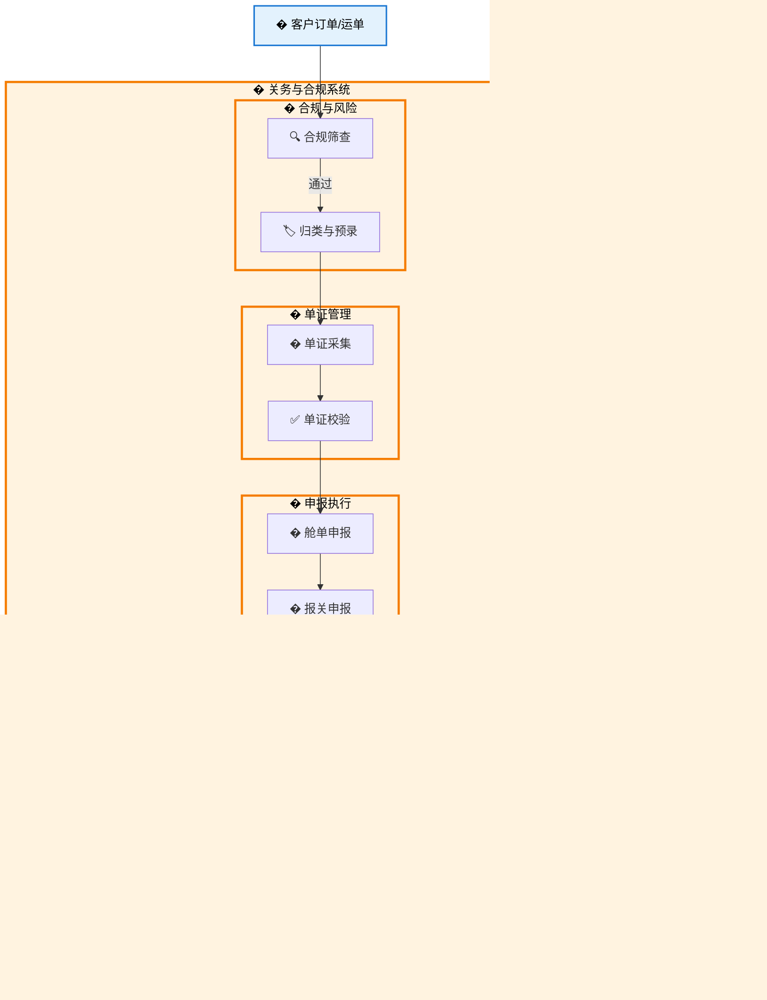

# 关务与合规（Customs & Compliance System）

## 📋 新手程序员阅读指南

**欢迎阅读关务与合规文档！** 本文档专为新手程序员设计，帮助您快速理解关务业务和系统架构。

### 🎯 阅读建议

1.  **先理解核心流程**：重点掌握从 合规筛查 → 舱单申报 → 报关申报 → 查验 → 税费缴纳 → 放行 的完整通关链路。
2.  **关注合规性**：理解海关监管条件、HS编码归类以及风险管控在业务中的重要性。
3.  **区分申报类型**：注意区分舱单申报（物流层面）与报关申报（贸易层面），以及进出口业务的差异。
4.  **参考术语表**：遇到不熟悉的关务术语时，请查阅第 3 章的标准化业务术语表。

### 💡 业务场景举例

想象一个进口清关场景：

*   **接单与筛查**：收到进口委托后，系统自动对收发货人进行黑名单筛查。
*   **单证准备**：收集发票、箱单、合同等随附单证，并进行OCR识别和预录入。
*   **舱单申报**：在船舶到港前24小时，向海关发送原始舱单数据。
*   **报关申报**：货物到港后，正式向海关提交进口报关单。
*   **查验与缴税**：海关下达查验通知，现场配合查验；查验无误后，收到税单并完成支付。
*   **放行与提货**：海关系统返回放行指令，系统自动触发码头提货作业。

## 1. 系统概述

关务与合规系统是货代管理系统的核心模块之一，负责处理进出口货物的通关合规流程。系统覆盖从合规筛查到最终放行的完整链路，确保货物通关的合规性、时效性和成本可控性。

### 1.1 业务范围

*   **合规风险管控**：对收发货人、承运商、货物进行制裁和受限方筛查
*   **商品归类管理**：HS编码归类、申报要素维护、监管条件校验
*   **单证流转管理**：随附单证采集、版本化管理、电子归档
*   **申报流程管理**：舱单申报、安全申报、正式报关申报
*   **查验协调服务**：查验通知处理、现场协调、结果反馈
*   **税费计算缴纳**：税费核算、缴税管理、退税申请
*   **放行联动处理**：放行状态回写、后续流程触发

### 1.2 核心价值

*   **合规保障**：全面的风险筛查和合规检查，确保业务合规性
*   **效率提升**：自动化申报流程，减少人工操作，提高处理效率
*   **成本控制**：精准的税费计算和费用管理，优化通关成本
*   **风险管控**：实时监控和预警机制，及时识别和处理异常情况
*   **数据追溯**：完整的操作记录和审计链，支持合规审查

## 2. 跨系统触发概念说明

### 2.1 触发类型定义

在关务与合规系统中，业务流程涉及多个系统和模块间的协作。为了准确描述不同层级的系统交互，我们定义了以下触发类型：

| 触发类型       | 定义               | 适用场景                                | 示例                     |
| ---------- | ---------------- | ----------------------------------- | ---------------------- |
| **系统内流转**  | 同一关务系统内部模块间的状态流转 | 关务系统内部的筛查 → 预录 → 申报等模块间流转   | 关务作业.筛查完成 → 关务作业.预录归类 |
| **跨系统触发**  | 不同核心域间的真正跨系统交互  | 关务系统与货代操作、TMS、财务等独立系统间的交互 | 关务作业.海关放行 → TMS.派车任务 |
| **外部系统交互** | 与第三方外部系统的集成交互    | 与海关单一窗口、银行、监管仓等外部第三方系统的交互 | 申报管理.提交报关单 → 海关单一窗口 |

### 2.2 区分标准

#### **判断依据 1：系统架构层级**

*   **系统内流转**：同一系统内的状态变化，无需跨越系统边界
*   **跨系统触发**：不同核心域间的集成，需要通过系统间接口
*   **外部系统交互**：与企业外部第三方系统的集成

#### **判断依据 2：描述格式**

*   **系统内流转**：通常描述为状态变化或内部处理
*   **跨系统触发**：格式为"系统名.功能名"（如：TMS.派车任务）
*   **外部系统交互**：明确标注为外部系统名称

#### **判断依据 3：技术实现方式**

*   **系统内流转**：数据库事务、内存状态变更、内部消息队列、服务间调用
*   **跨系统触发**：REST API、消息中间件、数据同步
*   **外部系统交互**：EDI、Web Service、第三方 API

### 2.3 业务价值

这种分层的触发机制设计具有以下优势：

*   **清晰的职责边界**：明确区分系统内部处理和系统间集成
*   **灵活的架构演进**：支持微服务架构下的独立部署和扩展
*   **标准化的集成模式**：为不同类型的系统交互提供统一的描述规范
*   **便于运维管理**：不同触发类型对应不同的监控和故障处理策略

## 3. 标准化业务术语表

| 中文术语 | 英文字段 | 编号规则 | 说明 | 测试数据示例 |
|---------|---------|---------|------|-------------|
| 关务作业单 | customs_job | JOB-COM-YYYYMMDD-NNN | 关务业务的最小管理单元，包含完整的通关流程 | JOB-COM-20231001-001 |
| 合规筛查单 | compliance_screening | SCR-YYYYMMDD-NNN | 对收发货人、承运商、货物进行制裁和受限方筛查 | SCR-20231001-001 |
| 预录单 | pre_declaration | PDC-YYYYMMDD-NNN | 商品归类与要素维护的预申报单据 | PDC-20231001-001 |
| 单证包 | document_package | PKG-YYYYMMDD-NNN | 随附单证的集合包，包含发票、装箱单等 | PKG-20231001-001 |
| 舱单申报 | manifest_filing | MF-YYYYMMDD-TYPE-NNN | 舱单和安全申报，如ENS/AMS/ISF等 | MF-20231001-ENS-001 |
| 报关单 | customs_entry | CUS-YYYYMMDD-NNN | 正式的海关申报单据 | CUS-20231001-001 |
| 查验通知 | inspection_notice | INSP-YYYYMMDD-NNN | 海关查验通知和处理记录 | INSP-20231001-001 |
| 税单 | tax_bill | TAX-YYYYMMDD-NNN | 关税、增值税等税费单据 | TAX-20231001-001 |
| 放行记录 | release_record | REL-YYYYMMDD-NNN | 海关放行和后续联动记录 | REL-20231001-001 |
| 更正单 | amendment_record | AMD-YYYYMMDD-NNN | 报关单或舱单的更正记录 | AMD-20231001-001 |
| 豁免申请 | exemption_request | EXM-YYYYMMDD-NNN | 合规筛查命中后的豁免申请 | EXM-20231001-001 |
| 提货通知 | pickup_notice | PICK-YYYYMMDD-NNN | 放行后生成的提货通知单 | PICK-20231001-001 |

## 4. 标准状态定义与流转规则

| 状态英文 | 状态中文 | 业务模块 | 前置条件 | 触发事件 | 输出关键数据 | 自动操作 | 下一环节触发 |
|---------|---------|---------|---------|---------|-------------|---------|-------------|
| job_created | 作业已创建 | 关务与合规 | 订单/运单已确认 | 手工创建或系统自动生成 | 作业号、业务类型、口岸、SLA时限 | 生成待办任务 | **系统内流转**：分派处理人 |
| job_assigned | 作业已分派 | 关务与合规 | 作业已创建 | 分派给处理人/团队 | 处理人、分派时间、SLA开始计时 | 启动SLA计时器 | **系统内流转**：合规筛查 |
| screening_completed | 筛查已完成 | 关务与合规 | 作业已分派 | 完成合规筛查 | 筛查结果、风险评分、处理动作 | 生成筛查报告 | **系统内流转**：预录归类 |
| predeclaration_completed | 预录已完成 | 关务与合规 | 筛查已完成 | 完成商品归类和要素维护 | 预录单号、HS编码、监管条件 | 生成证书清单 | **系统内流转**：单证管理 |
| documents_ready | 单证已齐备 | 关务与合规 | 预录已完成 | 上传并校验所有随附单证 | 单证包编号、版本号、完整性状态 | 版本化归档 | **系统内流转**：舱单申报 |
| manifest_filed | 舱单已申报 | 关务与合规 | 单证已齐备 | 提交舱单/安全申报 | 申报编号、回执号、申报时间 | 接收回执状态 | **系统内流转**：报关申报 |
| customs_filed | 报关已申报 | 关务与合规 | 舱单已申报 | 提交正式报关单 | 报关单号、税额估算、申报时间 | 税费计算 | **外部系统交互**：等待海关审单 |
| inspection_scheduled | 查验已预约 | 关务与合规 | 报关已申报且收到查验通知 | 预约查验时间和地点 | 查验通知号、预约时间、查验地点 | 生成查验任务 | **外部系统交互**：现场查验 |
| inspection_completed | 查验已完成 | 关务与合规 | 查验已预约 | 完成现场查验 | 查验结果、照片凭证、差异记录 | 上传查验凭证 | **系统内流转**：税费处理 |
| tax_paid | 税费已缴纳 | 关务与合规 | 查验已完成或直接审单通过 | 完成税费缴纳 | 税单编号、支付流水、电子税票 | 回写缴税状态 | **外部系统交互**：等待放行 |
| customs_released | 海关已放行 | 关务与合规 | 税费已缴纳 | 收到海关放行通知 | 放行时间、放行类型、提货条件 | 生成提货通知 | **跨系统触发**：TMS派车任务、费用锁定 |
| job_completed | 作业已完成 | 关务与合规 | 海关已放行 | 所有关务环节完成 | 完成时间、处理结果、审计链 | 停止SLA计时 | **跨系统触发**：通知客户、更新订单状态 |
| job_archived | 作业已归档 | 关务与合规 | 作业已完成 | 生成最终报告并归档 | 归档路径、审计链ID、结案报告 | 数据归档 | **系统内完成**：流程结束 |

## 5. 系统功能架构

### 5.1 一级菜单结构

    关务与合规
    ├── 2.1 关务作业管理
    ├── 2.2 合规筛查管理
    ├── 2.3 预录入与归类管理
    ├── 2.4 随附单证管理
    ├── 2.5 舱单与安全申报
    ├── 2.6 报关申报管理
    ├── 2.7 查验与检验检疫
    ├── 2.8 税费计算与缴纳
    └── 2.9 关务费用管理

### 5.2 关务与合规系统总体业务流程

## 6. 详细功能模块

### 6.1 [关务作业管理](./2.1%20关务作业管理.md)
- **功能概述**：关务作业的统一入口，负责作业单的创建、分派、进度跟踪和SLA监控。
- **核心特性**：智能分派引擎、可视化看板、SLA预警、作业全链路跟踪。
- **主要功能**：作业单中心、智能分派、SLA管理、看板管理。

### 6.2 [合规筛查管理](./2.2%20合规筛查管理.md)
- **功能概述**：对收发货人、承运商、货物进行制裁名单、黑名单和受限商品筛查。
- **核心特性**：实时API对接、模糊匹配算法、多国制裁库更新、豁免流程。
- **主要功能**：筛查任务、黑名单管理、筛查规则配置、豁免申请。

### 6.3 [预录入与归类管理](./2.3%20预录入与归类管理.md)
- **功能概述**：商品的HS编码归类、申报要素维护及监管条件自动校验。
- **核心特性**：AI辅助归类、历史归类库复用、监管条件自动匹配、税率预估。
- **主要功能**：归类任务、商品数据库、申报要素库、税率查询。

### 6.4 [随附单证管理](./2.4%20随附单证管理.md)
- **功能概述**：采集、审核、制作和归档报关所需的合同、发票、箱单等随附文件。
- **核心特性**：OCR智能识别、单证一致性比对、版本控制、电子归档。
- **主要功能**：单证采集、OCR识别、单证制作、单证审核。

### 6.5 [舱单与安全申报](./2.5%20舱单与安全申报.md)
- **功能概述**：处理目的国要求的舱单申报（如AMS/ENS/AFR）和反恐安全申报。
- **核心特性**：多国申报规则、申报时限提醒、回执自动解析、更正重报。
- **主要功能**：舱单申报、安全申报、回执管理、更正申请。

### 6.6 [报关申报管理](./2.6%20报关申报管理.md)
- **功能概述**：生成正式报关单，通过单一窗口向海关申报，并处理回执。
- **核心特性**：单一窗口直连、逻辑检查、自动拆单/并单、申报状态同步。
- **主要功能**：报关单制作、单一窗口申报、状态跟踪、修撤单管理。

### 6.7 [查验与检验检疫](./2.7%20查验与检验检疫.md)
- **功能概述**：处理海关查验通知，协调现场查验，记录查验结果和异常。
- **核心特性**：查验通知解析、现场任务调度、移动端拍照反馈、异常定责。
- **主要功能**：查验通知、查验预约、现场协同、查验记录。

### 6.8 [税费计算与缴纳](./2.8%20税费计算与缴纳.md)
- **功能概述**：接收海关税单，进行税费核算、支付申请及税单归档。
- **核心特性**：税单自动识别、税费分摊计算、银关通支付、税单电子归档。
- **主要功能**：税单管理、支付申请、税费分摊、退税管理。

### 6.9 [关务费用管理](./2.9%20关务费用管理.md)
- **功能概述**：管理报关费、查验费、港杂费等关务相关费用的录入和结算。
- **核心特性**：费用自动生成、对账单自动匹配、费用审批流。
- **主要功能**：费用录入、账单生成、费用审核、利润分析。

## 7. 系统集成与数据流

### 7.1 内部系统集成
- **货代操作 → 关务与合规**：推送订单、运单及货物基础信息，触发关务作业创建。
- **关务与合规 → TMS（运输管理）**：海关放行后，自动触发提货或派送任务指令。
- **关务与合规 → 财务与会计**：
    - 推送应收费用（报关代理费、代垫税款等）至应收模块。
    - 推送应付费用（现场查验费、拖车费等）至应付模块。
    - 同步税单发票信息用于税务抵扣。

### 7.2 外部系统集成
- **海关单一窗口**：通过EDI或API接口提交报关单、舱单数据，接收放行、查验、税单回执。
- **银行系统**：通过银关通或银企直连接口，进行税费的在线支付和支付状态查询。
- **OCR服务商**：集成第三方OCR服务，识别发票、箱单、合同等纸质单证信息。
- **合规数据库（如Descartes/Thomson Reuters）**：实时调用全球制裁名单库进行合规筛查。

## 8. 技术架构说明

### 8.1 架构风格
**域驱动设计 DDD + 微服务 + 事件驱动（Event-Driven） + 前后端分离**

### 8.2 逻辑架构分层

#### 8.2.1 表现层
- **关务工作台**：Web端操作界面，支持大屏数据展示和复杂单证录入。
- **移动端助手**：支持现场查验人员通过手机APP上传照片、查看查验指令。

#### 8.2.2 业务逻辑层
- **合规引擎**：基于规则的筛查引擎，支持模糊匹配和多维度评分。
- **归类助手**：基于历史数据和机器学习模型的HS编码推荐服务。
- **申报适配器**：针对不同国家/地区海关接口（单一窗口、AMS等）的协议转换适配层。

#### 8.2.3 数据层
- **结构化数据**：作业单、报关单、税单等核心业务数据存储（PostgreSQL）。
- **非结构化数据**：随附单证、查验照片、原始EDI报文存储（Object Storage）。

### 8.3 技术栈详情
- **后端**：.NET 9, EF Core, Dapr (Sidecar模式)
- **前端**：React, TypeScript, Ant Design
- **数据库**：PostgreSQL (业务数据), Redis (缓存与会话)
- **消息队列**：RabbitMQ / Kafka (处理高并发申报与回执)
- **AI/OCR**：Azure AI Vision / Tesseract (单证识别)
