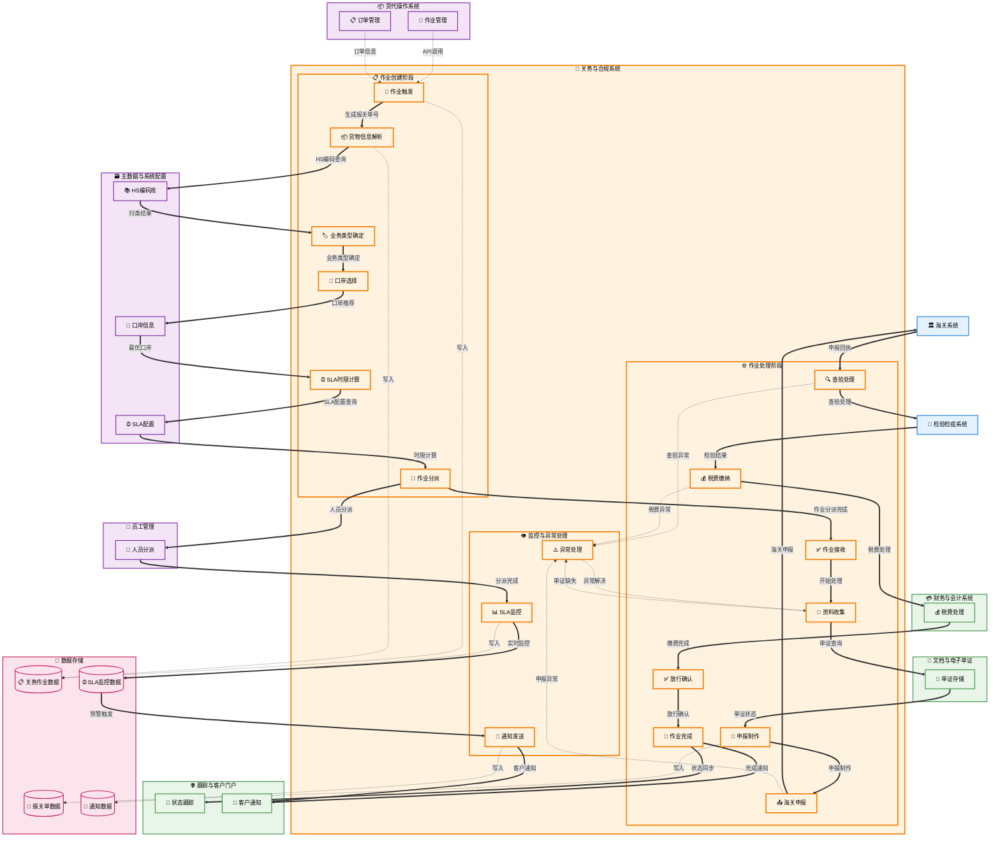

# 关务作业管理 (Customs Job Management)

## 💡 新手提示：关务作业管理核心概念

在开始阅读关务作业管理功能前，请先理解以下关键概念：

*   **关务作业单**：关务业务的最小管理单元，包含完整的通关流程
*   **作业分派**：将关务作业分配给专业处理人员或团队
    > **重要说明**：此处的作业分派是**人员级分派**，负责将已经路由到关务系统的作业分派给具体的关务专员。这是第二级分派，属于专业领域内的人员分配。在此之前，作业已经通过货代操作系统的作业管理模块完成了第一级分派（系统级分派）。
*   **SLA管理**：服务水平协议，确保关务作业在规定时间内完成
*   **看板管理**：可视化的作业状态管理，提供实时的作业进度监控

### 关务作业生命周期
- **已创建**：作业单创建但未分派
- **已分派**：已分配给处理人员，SLA计时开始
- **进行中**：作业正在处理
- **已暂停**：作业暂时停止处理
- **已完成**：作业处理完毕
- **已归档**：作业归档保存

### 关务作业类型
- **进口报关**：进口货物的海关申报作业
- **出口报关**：出口货物的海关申报作业
- **转关作业**：货物在不同海关监管区域间的转移
- **保税作业**：保税区域内的货物处理
- **退运作业**：货物退运的海关手续

## 功能概述

关务作业管理是关务与合规系统的核心模块，负责统一管理所有关务作业单，提供可视化看板、智能分派、SLA监控等功能。系统支持多维度筛选、批量操作、实时状态跟踪，确保关务作业高效有序进行。

**🔍 业务价值说明**：

*   **统一管控**：集中管理所有关务作业，避免遗漏和重复
*   **可视化监控**：实时看板展示作业状态，便于管理决策
*   **智能分派**：根据业务类型、口岸、专业能力自动分派
*   **SLA保障**：严格的时效管理，确保合规时限

**核心功能模块**：

*   **作业单中心**：统一的作业单管理界面
*   **看板管理**：可视化的作业状态监控
*   **智能分派**：自动化的作业分配机制
*   **SLA监控**：服务水平协议管理和预警

## 菜单结构

    关务作业管理
    ├── 作业单中心                  # 所有关务作业单的统一管理
    ├── 作业看板                    # 可视化的作业状态监控
    ├── 新建作业单                  # 创建新的关务作业
    ├── SLA监控                     # 服务水平协议监控和预警
    ├── 批量操作                    # 批量处理作业单
    ├── 作业统计                    # 作业相关统计分析
    └── 作业归档                    # 已完成作业的归档管理

## 关务作业管理数据流转图



## 页面原型设计

### 作业单中心页面

作业单中心是关务作业管理的主界面，提供统一的作业单管理功能。

#### 页面布局

```
┌─────────────────────────────────────────────────────────────────────────────────────┐
│ 关务作业管理 > 作业单中心                                                              │
├─────────────────────────────────────────────────────────────────────────────────────┤
│ 🔍 筛选条件                                                                          │
│ ┌─────────────┬─────────────┬─────────────┬─────────────┬─────────────┬─────────────┐ │
│ │ 作业状态    │ 业务类型    │ 客户名称    │ 处理人员    │ 创建时间    │ 🔍 搜索     │ │
│ │ [全部 ▼]   │ [全部 ▼]   │ [输入框]    │ [全部 ▼]   │ [日期选择]  │ [搜索按钮]  │ │
│ └─────────────┴─────────────┴─────────────┴─────────────┴─────────────┴─────────────┘ │
├─────────────────────────────────────────────────────────────────────────────────────┤
│ 📊 统计概览                                                                          │
│ ┌─────────────┬─────────────┬─────────────┬─────────────┬─────────────┬─────────────┐ │
│ │ 总作业数    │ 待分派      │ 进行中      │ 已完成      │ 超时预警    │ 今日新增    │ │
│ │ 1,234       │ 45          │ 189         │ 987         │ 13          │ 67          │ │
│ └─────────────┴─────────────┴─────────────┴─────────────┴─────────────┴─────────────┘ │
├─────────────────────────────────────────────────────────────────────────────────────┤
│ 📋 作业单列表                                                                        │
│ ┌─────────────────────────────────────────────────────────────────────────────────┐ │
│ │ ☑ 作业单号      │ 业务类型 │ 客户名称 │ 状态   │ 处理人员 │ 创建时间   │ 操作     │ │
│ ├─────────────────────────────────────────────────────────────────────────────────┤ │
│ │ ☑ JOB-COM-001  │ 进口报关 │ ABC公司  │ 已分派 │ 张三     │ 2024-03-15 │ 查看|编辑│ │
│ │ ☑ JOB-COM-002  │ 出口报关 │ XYZ公司  │ 进行中 │ 李四     │ 2024-03-15 │ 查看|编辑│ │
│ │ ☑ JOB-COM-003  │ 转关作业 │ DEF公司  │ 待分派 │ -        │ 2024-03-15 │ 分派|编辑│ │
│ └─────────────────────────────────────────────────────────────────────────────────┘ │
├─────────────────────────────────────────────────────────────────────────────────────┤
│ 🔧 批量操作                                                                          │
│ [批量分派] [批量导出] [批量归档] [批量删除]                                          │
└─────────────────────────────────────────────────────────────────────────────────────┘
```

### 作业看板页面

作业看板提供可视化的作业状态监控，采用看板式布局。

#### 看板布局

```
┌─────────────────────────────────────────────────────────────────────────────────────┐
│ 关务作业管理 > 作业看板                                                              │
├─────────────────────────────────────────────────────────────────────────────────────┤
│ 🎯 快速筛选                                                                          │
│ [全部] [我的作业] [今日到期] [超时预警] [高优先级]                                   │
├─────────────────────────────────────────────────────────────────────────────────────┤
│ 📊 看板视图                                                                          │
│ ┌─────────────┬─────────────┬─────────────┬─────────────┬─────────────┬─────────────┐ │
│ │ 待分派 (45) │ 已分派 (67) │ 进行中 (89) │ 待审核 (23) │ 已完成 (156)│ 已归档 (89) │ │
│ ├─────────────┼─────────────┼─────────────┼─────────────┼─────────────┼─────────────┤ │
│ │ ┌─────────┐ │ ┌─────────┐ │ ┌─────────┐ │ ┌─────────┐ │ ┌─────────┐ │ ┌─────────┐ │ │
│ │ │JOB-001  │ │ │JOB-002  │ │ │JOB-003  │ │ │JOB-004  │ │ │JOB-005  │ │ │JOB-006  │ │ │
│ │ │进口报关 │ │ │出口报关 │ │ │转关作业 │ │ │进口报关 │ │ │出口报关 │ │ │进口报关 │ │ │
│ │ │ABC公司  │ │ │XYZ公司  │ │ │DEF公司  │ │ │GHI公司  │ │ │JKL公司  │ │ │MNO公司  │ │ │
│ │ │高优先级 │ │ │中优先级 │ │ │高优先级 │ │ │中优先级 │ │ │低优先级 │ │ │低优先级 │ │ │
│ │ └─────────┘ │ └─────────┘ │ └─────────┘ │ └─────────┘ │ └─────────┘ │ └─────────┘ │ │
│ │ ┌─────────┐ │ ┌─────────┐ │ ┌─────────┐ │             │             │             │ │
│ │ │JOB-007  │ │ │JOB-008  │ │ │JOB-009  │ │             │             │             │ │
│ │ │...      │ │ │...      │ │ │...      │ │             │             │             │ │
│ │ └─────────┘ │ └─────────┘ │ └─────────┘ │             │             │             │ │
│ └─────────────┴─────────────┴─────────────┴─────────────┴─────────────┴─────────────┘ │
└─────────────────────────────────────────────────────────────────────────────────────┘
```

### SLA监控页面

SLA监控页面提供实时的服务水平协议监控和预警功能。

#### 监控界面

```
┌─────────────────────────────────────────────────────────────────────────────────────┐
│ 关务作业管理 > SLA监控                                                               │
├─────────────────────────────────────────────────────────────────────────────────────┤
│ ⚠️ SLA预警统计                                                                       │
│ ┌─────────────┬─────────────┬─────────────┬─────────────┬─────────────┬─────────────┐ │
│ │ 严重超时    │ 即将超时    │ 正常处理    │ 平均处理时长│ SLA达成率   │ 今日预警    │ │
│ │ 3 (红色)    │ 15 (橙色)   │ 234 (绿色)  │ 18.5小时    │ 94.2%       │ 8           │ │
│ └─────────────┴─────────────┴─────────────┴─────────────┴─────────────┴─────────────┘ │
├─────────────────────────────────────────────────────────────────────────────────────┤
│ 📈 SLA趋势图                                                                         │
│ ┌─────────────────────────────────────────────────────────────────────────────────┐ │
│ │ SLA达成率趋势 (最近30天)                                                        │ │
│ │ 100% ┤                                                                         │ │
│ │  95% ┤ ●─●─●─●─●─●─●                                                          │ │
│ │  90% ┤           ●─●─●─●─●─●─●─●─●                                           │ │
│ │  85% ┤                             ●─●─●─●─●─●─●─●─●                       │ │
│ │  80% └─┬─┬─┬─┬─┬─┬─┬─┬─┬─┬─┬─┬─┬─┬─┬─┬─┬─┬─┬─┬─┬─┬─┬─┬─┬─┬─┬─┬─┬─┬─        │ │
│ │       1 3 5 7 9 11 13 15 17 19 21 23 25 27 29                              │ │
│ └─────────────────────────────────────────────────────────────────────────────────┘ │
├─────────────────────────────────────────────────────────────────────────────────────┤
│ 🚨 预警作业列表                                                                      │
│ ┌─────────────────────────────────────────────────────────────────────────────────┐ │
│ │ 预警级别 │ 作业单号    │ 业务类型 │ 客户名称 │ 处理人员 │ 剩余时间 │ 完成率 │ 操作 │ │
│ ├─────────────────────────────────────────────────────────────────────────────────┤ │
│ │ 🔴 严重  │ JOB-COM-001 │ 进口报关 │ ABC公司  │ 张三     │ -2小时   │ 85%    │ 催办 │ │
│ │ 🟠 警告  │ JOB-COM-002 │ 出口报关 │ XYZ公司  │ 李四     │ 1.5小时  │ 60%    │ 提醒 │ │
│ │ 🟡 注意  │ JOB-COM-003 │ 转关作业 │ DEF公司  │ 王五     │ 4小时    │ 40%    │ 查看 │ │
│ └─────────────────────────────────────────────────────────────────────────────────┘ │
└─────────────────────────────────────────────────────────────────────────────────────┘
```

## 业务流程

### 💡 新手提示：业务流程阅读指南

以下业务流程描述了关务作业从创建到完成的完整生命周期。每个步骤都包含：

*   **业务动作**：具体要执行的操作
*   **系统交互**：涉及的系统间调用和数据传递
*   **决策点**：需要人工判断或系统自动判断的关键节点
*   **异常处理**：可能出现的问题和解决方案

### 📋 关务作业创建流程

1.  **作业触发**：系统接收到需要关务服务的订单或手工创建关务作业
    > **新手说明**：这是关务处理的起点，可以由订单自动触发或业务人员手工创建
    *   **🔗 跨系统触发**：货代操作（作业管理） → 关务与合规 **【写入数据】**
        *   **调用方式**：RESTful API (POST /api/customs/job/create)
        *   **调用时机**：作业管理系统完成作业分派后，向关务系统传递已生成的作业单号和相关信息
        *   **数据操作**：
            *   **数据读取**：从作业管理系统的 jobs (作业主表) 表、job_assignments (作业分派表) 表读取作业信息，从货代操作的 orders (订单主表) 表、order_details (订单详情表) 表读取订单和货物信息
            *   **数据写入**：向关务与合规的 customs_jobs (关务作业主表) 表写入新作业记录
            *   **数据存储**：在关务与合规的 customs_job_details (关务作业详情表) 表中存储作业详细信息
            *   **数据关联**：在关务与合规的 order_customs_mapping (订单关务关联表) 表中建立订单与关务作业的关联关系
        *   **入参**：`{job_id, order_id, customer_id, cargo_info, service_type, port_code, priority}`
            *   `job_id` (作业ID): string，由作业管理系统预先生成的关务作业唯一编号，用于后续跟踪
            *   `order_id` (订单ID): string，关联的订单唯一标识符，用于追溯业务来源
            *   `customer_id` (客户ID): string，客户在系统中的唯一标识符，用于获取客户关务偏好
            *   `cargo_info` (货物信息): object，包含HS编码、货物描述、数量、价值等关务必需信息
            *   `service_type` (服务类型): enum (进口报关/出口报关/转关/保税)，确定关务处理类型
            *   `port_code` (口岸代码): string，**初始/参考口岸**的标准代码，用于报关单号生成和后续口岸选择的参考依据。注意：此口岸可能在后续"口岸选择"步骤中根据货物特性和业务需求进行优化调整
            *   `priority` (优先级): enum (普通/加急/特急)，影响作业分派和处理顺序
        *   **出参**：`{status, customs_declaration_no, sla_deadline, assigned_to, estimated_cost}`
            *   `status` (作业状态): enum (待分派/已分派/处理中/已完成)，作业当前处理状态
            *   `customs_declaration_no` (报关单号): string，系统自动生成的唯一报关单号，格式为{口岸代码}-{业务类型}-{YYYYMMDD}-{序号}
            *   `sla_deadline` (SLA截止时间): datetime，根据服务类型和优先级计算的完成截止时间
            *   `assigned_to` (分派人员): string，如果自动分派成功，返回分派的关务人员ID
            *   `estimated_cost` (预估费用): object，基于服务类型和货物信息计算的关务费用估算

    **🔧 报关单号生成逻辑**：
    - **生成时机**：关务作业创建成功后立即生成
    - **编号规则**：`{口岸代码}-{业务类型}-{YYYYMMDD}-{序号}`
        - 口岸代码：如 SHA（上海）、SZX（深圳）等，**使用作业触发时的初始口岸代码**
        - 业务类型：IMP（进口）、EXP（出口）、TRA（转关）、BON（保税）
        - 日期：作业创建日期，格式YYYYMMDD
        - 序号：当日该口岸该业务类型的流水号，4位数字，从0001开始
    - **示例**：SHA-EXP-20240315-0001（上海口岸出口报关，2024年3月15日第1单）
    - **唯一性保证**：通过口岸代码+业务类型+日期+序号的组合确保全局唯一
    - **数据存储**：生成的报关单号写入customs_job_details表的customs_declaration_no字段
    - **⚠️ 重要说明**：报关单号一旦生成即保持不变，即使在后续"口岸选择"步骤中优化调整了实际处理口岸，报关单号中的口岸代码也不会更改，以确保单号的稳定性和可追溯性

2.  **货物信息解析**：系统自动解析货物信息，确定HS编码和监管条件
    > **新手说明**：系统会自动识别货物的海关编码和相关监管要求，为后续申报做准备
    *   **🔗 跨系统触发**：关务与合规（关务作业管理） → 主数据与系统配置 **【查询数据】**
        *   **调用方式**：RESTful API (POST /api/master-data/hs-code/classify)
        *   **调用时机**：作业创建后立即进行货物信息解析
        *   **数据操作**：
            *   **数据读取**：从主数据与系统配置的 hs_codes (海关编码表) 表、regulatory_conditions (监管条件表) 表读取编码和监管信息
            *   **数据查询**：在主数据与系统配置的 commodity_classification (商品归类表) 表中查询商品归类规则
            *   **数据匹配**：通过主数据与系统配置的 classification_engine (归类引擎表) 执行智能归类算法
            *   **数据更新**：更新关务与合规的 customs_job_details (关务作业详情表) 表中的HS编码和监管条件
        *   **入参**：`{cargo_description, cargo_value, origin_country, classification_hints}`
            *   `cargo_description` (货物描述): string，货物的详细中英文描述，用于智能归类
            *   `cargo_value` (货物价值): decimal，货物的申报价值，影响税费计算和监管要求
            *   `origin_country` (原产国): string，货物原产国代码，影响关税税率和贸易协定适用
            *   `classification_hints` (归类提示): object，客户提供的归类建议或历史归类信息
        *   **出参**：`{hs_code, regulatory_conditions, tax_rate, classification_confidence}`
            *   `hs_code` (海关编码): string，系统确定的10位海关商品编码
            *   `regulatory_conditions` (监管条件): array，适用的监管条件代码和要求说明
            *   `tax_rate` (税率信息): object，适用的关税、增值税等税率信息
            *   `classification_confidence` (归类置信度): decimal，系统归类结果的置信度评分

3.  **业务类型确定**：根据货物信息和客户需求确定具体的关务业务类型
    > **新手说明**：系统会根据货物特性、贸易方式、客户需求等因素确定具体的关务处理流程
    *   **系统内流转**：关务业务类型智能判断
        *   **调用方式**：内部函数调用 (CustomsBusinessTypeClassifier.determine())
        *   **调用时机**：货物信息解析完成后立即进行业务类型判断
        *   **数据操作**：
            *   **数据读取**：从关务与合规的 customs_job_details (关务作业详情表) 表读取货物信息和HS编码
            *   **数据查询**：在关务与合规的 business_type_rules (业务类型规则表) 表中查询业务类型判断规则
            *   **数据匹配**：通过关务与合规的 classification_engine (归类引擎表) 执行业务类型智能判断
            *   **数据更新**：更新关务与合规的 customs_jobs (关务作业表) 表中的业务类型字段
        *   **入参**：`{hs_code, cargo_value, trade_mode, customer_requirements, regulatory_conditions}`
            *   `hs_code` (海关编码): string，已确定的10位海关商品编码
            *   `cargo_value` (货物价值): decimal，货物申报价值，影响业务类型选择
            *   `trade_mode` (贸易方式): string，贸易方式代码（如一般贸易、加工贸易等）
            *   `customer_requirements` (客户需求): object，客户特殊要求和偏好设置
            *   `regulatory_conditions` (监管条件): array，适用的监管条件，影响业务流程选择
        *   **出参**：`{business_type, process_flow, required_documents, estimated_duration}`
            *   `business_type` (业务类型): string，确定的关务业务类型（如进口报关、出口报关、转关等）
            *   `process_flow` (处理流程): array，该业务类型对应的标准处理流程步骤
            *   `required_documents` (所需单证): array，该业务类型需要的单证清单
            *   `estimated_duration` (预估时长): integer，该业务类型的预估处理时长（小时）

4.  **口岸选择**：系统根据货物特性、客户偏好、口岸能力等因素选择最优处理口岸
    > **新手说明**：不同口岸的处理能力、效率、费用可能不同，系统会智能推荐最适合的口岸
    > **口岸优化说明**：此步骤是**最终口岸确认和优化**过程。系统会基于完整的货物信息和业务类型，对作业触发时的初始口岸进行验证和优化，确保选择最适合的处理口岸。如果优化后的口岸与初始口岸不同，系统会更新相关记录但保持报关单号不变。
    *   **🔗 跨系统触发**：关务与合规 → 主数据与系统配置 **【查询数据】**
        *   **调用方式**：RESTful API (POST /api/master-data/port/recommend)
        *   **调用时机**：业务类型确定后进行口岸选择
        *   **数据操作**：
            *   **数据读取**：从主数据与系统配置的 ports (口岸信息表) 表、port_capabilities (口岸能力表) 表读取口岸基础信息和处理能力
            *   **数据查询**：在主数据与系统配置的 port_performance (口岸绩效表) 表中查询各口岸的历史处理效率
            *   **数据分析**：通过主数据与系统配置的 port_recommendation_engine (口岸推荐引擎表) 执行最优口岸选择算法
        *   **入参**：`{cargo_type, business_type, customer_preference, urgency_level}`
            *   `cargo_type` (货物类型): enum (普货/危险品/冷藏货/超限货)，影响口岸选择的重要因素
            *   `business_type` (业务类型): enum (一般贸易/保税/转关/快件)，不同业务类型对口岸要求不同
            *   `customer_preference` (客户偏好): object，客户指定的口岸偏好或限制条件
            *   `urgency_level` (紧急程度): enum (普通/加急/特急)，影响口岸选择的优先级
        *   **出参**：`{recommended_port, alternative_ports, selection_reason, estimated_timeline}`
            *   `recommended_port` (推荐口岸): string，系统推荐的最优口岸代码
            *   `alternative_ports` (备选口岸): array，其他可选口岸及其评分
            *   `selection_reason` (选择原因): object，推荐该口岸的具体原因和优势分析
            *   `estimated_timeline` (预估时间线): object，在该口岸处理的预计时间安排

5.  **SLA时限计算**：系统根据业务类型、优先级、口岸能力等因素计算作业完成时限
    > **新手说明**：SLA时限是关务作业必须完成的时间要求，超时会触发预警和升级机制
    *   **系统内流转**：SLA时限智能计算
        *   **调用方式**：内部函数调用 (SLACalculator.calculateDeadline())
        *   **调用时机**：口岸选择完成后立即进行SLA时限计算
        *   **数据操作**：
            *   **数据读取**：从关务与合规的 customs_jobs (关务作业表) 表读取业务类型、优先级等信息
            *   **数据查询**：在关务与合规的 sla_rules (SLA规则表) 表中查询对应的时限标准
            *   **数据分析**：通过关务与合规的 port_performance (口岸绩效表) 获取口岸处理能力数据
            *   **数据更新**：更新关务与合规的 customs_jobs (关务作业表) 表中的SLA截止时间字段
        *   **入参**：`{business_type, priority, port_code, cargo_complexity, customer_sla}`
            *   `business_type` (业务类型): enum (进口报关/出口报关/转关/保税)，不同业务类型有不同的标准时限
            *   `priority` (优先级): enum (普通/加急/特急)，影响SLA时限的计算系数
            *   `port_code` (口岸代码): string，最终确定的处理口岸，影响处理效率
            *   `cargo_complexity` (货物复杂度): enum (简单/一般/复杂/特殊)，复杂货物需要更多处理时间
            *   `customer_sla` (客户SLA要求): object，客户特殊的时限要求或合同约定
        *   **出参**：`{sla_deadline, warning_time, escalation_time, calculation_basis}`
            *   `sla_deadline` (SLA截止时间): datetime，作业必须完成的最终时间点
            *   `warning_time` (预警时间): datetime，触发预警提醒的时间点（通常为截止时间前2-4小时）
            *   `escalation_time` (升级时间): datetime，触发升级处理的时间点（通常为截止时间前1小时）
            *   `calculation_basis` (计算依据): object，SLA时限的具体计算依据和参数说明

6.  **作业分派**：系统自动分派给合适的关务人员或进入待分派队列
    > **新手说明**：系统会根据人员能力、工作负载、专业领域等因素智能分派作业
    > **分派层级说明**：此步骤执行的是**第二级分派（人员级分派）**。在此之前，该关务作业已经通过货代操作系统的作业管理模块完成了**第一级分派（系统级分派）**，被路由到关务与合规子系统。现在需要在关务系统内部将作业分派给具体的关务专员。
    *   **🔗 跨系统触发**：关务与合规 → 员工管理 **【查询数据】**
        *   **调用方式**：RESTful API (POST /api/employee/assignment/recommend)
        *   **调用时机**：作业创建完成后立即进行分派
        *   **数据操作**：
            *   **数据读取**：从员工管理的 employees (员工信息表) 表、employee_capabilities (员工能力表) 表读取关务人员信息和能力评估
            *   **数据查询**：在关务与合规的 customs_workload_statistics (关务工作负载统计表) 表中查询各关务人员当前工作负载
            *   **数据分析**：通过关务与合规的 customs_assignment_algorithm (关务分派算法表) 执行智能分派算法
            *   **数据写入**：向关务与合规的 customs_job_assignments (关务作业分派表) 表写入分派记录
        *   **入参**：`{job_type, complexity_level, required_skills, preferred_officer}`
            *   `job_type` (作业类型): enum (报关/查验/税费/单证)，不同类型需要不同专业技能
            *   `complexity_level` (复杂程度): enum (简单/中等/复杂)，影响人员选择和时间安排
            *   `required_skills` (所需技能): array，作业处理所需的专业技能和资质要求
            *   `preferred_officer` (首选人员): string，客户指定或系统推荐的首选处理人员
        *   **出参**：`{assigned_officer, assignment_reason, estimated_completion, backup_officers}`
            *   `assigned_officer` (分派人员): string，最终分派的关务人员ID和基本信息
            *   `assignment_reason` (分派原因): object，选择该人员的具体原因和匹配度分析
            *   `estimated_completion` (预计完成时间): datetime，基于人员能力和工作负载的完成时间预估
            *   `backup_officers` (备选人员): array，其他可分派人员及其匹配度评分

7.  **SLA监控启动**：系统启动SLA监控，设置预警节点和升级机制
    > **新手说明**：SLA监控会实时跟踪作业进度，在关键时间点发送预警，确保按时完成
    *   **系统内流转**：关务与合规内部SLA监控机制启动
        *   **调用方式**：内部服务调用 (CustomsSLAMonitoringService.startMonitoring)
        *   **调用时机**：作业分派完成后立即启动SLA监控
        *   **数据操作**：
            *   **数据写入**：向关务与合规的 customs_sla_monitoring (关务SLA监控表) 表写入监控任务
            *   **数据配置**：在关务与合规的 customs_alert_rules (关务预警规则表) 表中设置预警规则
            *   **数据调度**：通过关务与合规的 customs_scheduler_tasks (关务调度任务表) 安排定时检查任务
            *   **数据通知**：向关务与合规的 customs_notifications (关务通知表) 表写入预警通知记录
        *   **入参**：`{job_id, sla_deadline, alert_thresholds, escalation_rules, assigned_officer}`
            *   `job_id` (作业ID): string，需要监控的关务作业唯一标识符
            *   `sla_deadline` (SLA截止时间): datetime，作业必须完成的最终时间
            *   `alert_thresholds` (预警阈值): object，不同级别预警的时间阈值设置（如75%、90%、100%）
            *   `escalation_rules` (升级规则): object，超时后的升级处理规则和责任人层级
            *   `assigned_officer` (分派人员): string，当前负责该作业的关务人员ID
        *   **出参**：`{monitoring_id, alert_schedule, escalation_plan, notification_config}`
            *   `monitoring_id` (监控ID): string，SLA监控任务的唯一标识符
            *   `alert_schedule` (预警计划): array，各级别预警的具体时间安排和触发条件
            *   `escalation_plan` (升级计划): object，超时升级的具体执行计划和责任人分配
            *   `notification_config` (通知配置): object，预警通知的发送方式和接收人配置

8.  **通知发送**：系统向相关人员发送作业创建和分派通知
    > **新手说明**：系统会自动通知客户、处理人员、管理人员等相关方，确保信息及时传达
    *   **🔗 跨系统触发**：关务与合规 → 跟踪与客户门户 **【写入数据】**
        *   **调用方式**：RESTful API (POST /api/customer-portal/notification/send)
        *   **调用时机**：作业创建和分派完成后发送通知
        *   **数据操作**：
            *   **数据读取**：从关务与合规的 customs_jobs (关务作业主表) 表读取作业信息
            *   **数据写入**：向客户跟踪与客户门户的 customer_notifications (客户通知表) 表写入通知记录
            *   **数据更新**：更新客户跟踪与客户门户的 job_status_timeline (作业状态时间线表) 表
        *   **入参**：`{customer_id, job_info, notification_type, urgency_level}`
            *   `customer_id` (客户ID): string，需要接收通知的客户唯一标识符
            *   `job_info` (作业信息): object，关务作业的基本信息和当前状态
            *   `notification_type` (通知类型): enum (作业创建/分派完成/状态更新)，通知的具体类型
            *   `urgency_level` (紧急程度): enum (普通/重要/紧急)，影响通知方式和优先级
        *   **出参**：`{notification_sent, delivery_status, customer_acknowledged}`
            *   `notification_sent` (通知发送状态): boolean，通知是否成功发送
            *   `delivery_status` (送达状态): object，各种通知渠道的送达情况
            *   `customer_acknowledged` (客户确认状态): boolean，客户是否已查看并确认通知

### 📋 关务作业处理流程

1.  **作业接收**：关务人员接收分派的作业，确认处理能力和时间安排
    > **新手说明**：关务人员需要确认能够按时完成作业，如有问题及时反馈调整
    *   **系统内流转**：关务人员确认作业并更新状态
        *   **调用方式**：内部服务调用 (CustomsJobService.acceptJob)
        *   **调用时机**：关务人员登录系统查看分派作业时
        *   **数据操作**：
            *   **数据读取**：从关务与合规的 job_assignments (作业分派表) 表读取分派给当前人员的作业列表
            *   **数据查询**：在关务与合规的 customs_jobs (关务作业表) 表中查询作业详细信息和要求
            *   **数据更新**：更新关务与合规的 customs_jobs (关务作业表) 表中作业状态为"处理中"
            *   **数据写入**：向关务与合规的 customs_job_status_logs (关务作业状态日志表) 表写入状态变更记录
        *   **入参**：`{job_id, officer_id, acceptance_status, estimated_completion_time, notes}`
            *   `job_id` (作业ID): string，需要接收的关务作业唯一标识符
            *   `officer_id` (关务人员ID): string，接收作业的关务人员标识符
            *   `acceptance_status` (接收状态): enum (接收/拒绝/申请调整)，人员对作业分派的响应
            *   `estimated_completion_time` (预计完成时间): datetime，关务人员评估的作业完成时间
            *   `notes` (备注说明): string，关务人员对作业处理的补充说明或特殊要求
        *   **出参**：`{job_status, updated_sla, notification_sent, next_steps}`
            *   `job_status` (作业状态): string，更新后的作业状态信息
            *   `updated_sla` (更新SLA): object，根据人员确认调整后的SLA时间安排
            *   `notification_sent` (通知发送): boolean，是否已向相关人员发送状态更新通知
            *   `next_steps` (下一步骤): array，作业处理的后续步骤和要求清单

2.  **资料收集**：收集和整理报关所需的各类单证和资料
    > **新手说明**：这是关务处理的基础工作，资料的完整性和准确性直接影响通关效率
    *   **🔗 跨系统触发**：关务与合规 → 文档与电子单证 **【查询数据】**
        *   **调用方式**：RESTful API (GET /api/document/customs-required)
        *   **调用时机**：作业处理开始时收集所需单证
        *   **数据操作**：
            *   **数据读取**：从文档与电子单证的 document_templates (单证模板表) 表、required_documents (必需单证表) 表读取单证要求
            *   **数据查询**：在文档与电子单证的 customer_documents (客户单证库) 表中查询客户已有单证
            *   **数据验证**：通过文档与电子单证的 document_validator (单证验证器表) 验证单证完整性和有效性
        *   **入参**：`{job_id, business_type, cargo_info, customer_id}`
            *   `job_id` (作业ID): string，关务作业的唯一标识符
            *   `business_type` (业务类型): enum (一般贸易/保税/转关)，不同业务类型需要不同单证
            *   `cargo_info` (货物信息): object，货物的详细信息，影响单证要求
            *   `customer_id` (客户ID): string，客户标识符，用于查询客户单证库
        *   **出参**：`{required_documents, available_documents, missing_documents, document_status}`
            *   `required_documents` (必需单证): array，该业务类型和货物需要的所有单证清单
            *   `available_documents` (可用单证): array，客户已提供的有效单证列表
            *   `missing_documents` (缺失单证): array，仍需客户补充的单证清单
            *   `document_status` (单证状态): object，各单证的完整性和有效性状态

3.  **申报制作**：制作海关申报单证，填写相关申报信息
    > **新手说明**：这是关务处理的核心环节，需要准确填写各项申报要素
    *   **🔗 跨系统触发**：关务与合规 → 主数据与系统配置 **【查询数据】**
        *   **调用方式**：RESTful API (GET /api/masterdata/hs-codes, GET /api/masterdata/tax-rates)
        *   **调用时机**：资料收集完成并验证通过后开始申报制作
        *   **数据操作**：
            *   **数据读取**：从关务与合规的 customs_jobs (关务作业表) 表、cargo_info (货物信息表) 表读取作业和货物基础信息
            *   **数据查询**：在主数据与系统配置的 hs_code_library (HS编码库表) 表、tax_rate_table (税率表) 表中查询商品归类和税率信息
            *   **数据分析**：通过主数据与系统配置的 declaration_templates (申报模板表) 表匹配适用的申报模板和要素
            *   **数据写入**：向关务与合规的 customs_declarations (海关申报表) 表写入申报单证信息
            *   **数据验证**：通过关务与合规的 declaration_validator (申报验证器表) 验证申报信息的完整性和准确性
        *   **入参**：`{job_id, cargo_details, business_type, port_code, customer_info, document_list}`
            *   `job_id` (作业ID): string，关务作业的唯一标识符
            *   `cargo_details` (货物详情): object，包含货物名称、规格、数量、价值等详细信息
            *   `business_type` (业务类型): enum (一般贸易/保税/转关)，决定申报模板和要素要求
            *   `port_code` (口岸代码): string，申报口岸信息，影响监管要求
            *   `customer_info` (客户信息): object，收发货人信息和资质证书
            *   `document_list` (单证清单): array，已收集的相关单证和附件信息
        *   **出参**：`{declaration_id, declaration_status, validation_result, next_approval_step}`
            *   `declaration_id` (申报ID): string，生成的海关申报单证唯一标识符
            *   `declaration_status` (申报状态): enum (草稿/待审核/已审核/已提交)，当前申报单证状态
            *   `validation_result` (验证结果): object，申报信息验证的详细结果和错误提示
            *   `next_approval_step` (下一审核步骤): string，申报单证的后续审核流程和责任人

4.  **申报提交**：向海关系统提交电子申报数据
    > **新手说明**：通过EDI接口向海关系统发送申报数据，获取海关回执
    *   **🔗 跨系统触发**：关务与合规 → 集成与连接 **【写入数据】**
        *   **调用方式**：EDI接口 (海关EDI标准格式)
        *   **调用时机**：申报单证制作完成并审核通过后提交
        *   **数据操作**：
            *   **数据读取**：从关务与合规的 customs_declarations (海关申报表) 表读取申报数据
            *   **数据转换**：通过集成与连接的 edi_converter (EDI转换器表) 将内部数据转换为海关EDI格式
            *   **数据发送**：向集成与连接的 customs_edi_queue (海关EDI队列表) 写入待发送数据
            *   **数据接收**：从集成与连接的 customs_response_log (海关回执日志表) 接收海关处理结果
        *   **入参**：`{declaration_data, customs_port, declaration_type, priority_level}`
            *   `declaration_data` (申报数据): object，完整的海关申报信息，符合海关EDI标准
            *   `customs_port` (申报口岸): string，向哪个海关口岸提交申报
            *   `declaration_type` (申报类型): enum (进口/出口/转关/撤销)，申报的具体类型
            *   `priority_level` (优先级): enum (普通/加急/特急)，影响处理优先级
        *   **出参**：`{submission_id, customs_receipt, processing_status, estimated_release_time}`
            *   `submission_id` (提交ID): string，海关系统返回的申报提交唯一标识符
            *   `customs_receipt` (海关回执): object，海关系统的接收确认和初步审核结果
            *   `processing_status` (处理状态): enum (已接收/审核中/通过/退单)，海关当前处理状态
            *   `estimated_release_time` (预计放行时间): datetime，基于海关处理效率的预计放行时间

5.  **状态跟踪**：实时跟踪海关处理状态，及时响应海关要求
    > **新手说明**：需要密切关注海关处理进度，如有查验、补税等要求及时处理
    *   **🔗 跨系统触发**：关务与合规 → 集成与连接 **【查询数据】**
        *   **调用方式**：RESTful API (GET /api/integration/customs-status)
        *   **调用时机**：申报提交后定期查询海关处理状态
        *   **数据操作**：
            *   **数据查询**：通过集成与连接的 customs_status_api (海关状态API表) 查询最新处理状态
            *   **数据更新**：更新关务与合规的 customs_job_status (关务作业状态表) 表中的状态信息
            *   **数据同步**：在关务与合规的 status_change_log (状态变更日志表) 表中记录状态变更历史
            *   **数据推送**：向货代操作的 milestone_tracking (里程碑跟踪表) 表推送关务处理状态更新
        *   **入参**：`{submission_id, customs_port, query_type}`
            *   `submission_id` (提交ID): string，海关申报的唯一标识符
            *   `customs_port` (申报口岸): string，申报的海关口岸代码
            *   `query_type` (查询类型): enum (状态查询/详细信息/处理结果)，查询的具体内容类型
        *   **出参**：`{current_status, processing_details, required_actions, next_steps}`
            *   `current_status` (当前状态): enum (审核中/查验/征税/放行/退单)，海关当前处理状态
            *   `processing_details` (处理详情): object，海关处理的详细信息和进度
            *   `required_actions` (需要行动): array，需要企业或代理人采取的后续行动
            *   `next_steps` (下一步骤): object，后续处理步骤和时间要求

6.  **异常处理**：处理海关查验、补税、退单等异常情况
    > **新手说明**：遇到异常情况需要及时响应，按照海关要求完成相应处理
    *   **系统内流转**：异常情况处理和客户沟通
        *   **调用方式**：内部服务调用 (CustomsExceptionService.handleException)
        *   **调用时机**：检测到海关异常状态或收到异常通知时立即触发
        *   **数据操作**：
            *   **数据读取**：从关务与合规的 customs_job_status (关务作业状态表) 表读取异常状态信息
            *   **数据查询**：在关务与合规的 exception_handling_rules (异常处理规则表) 表中查询对应的处理流程
            *   **数据分析**：通过关务与合规的 exception_templates (异常处理模板表) 表匹配处理方案和时限要求
            *   **数据写入**：向关务与合规的 exception_handling_log (异常处理日志表) 表写入处理记录
            *   **数据更新**：更新关务与合规的 customs_jobs (关务作业表) 表中的作业状态和处理进度
            *   **数据通知**：向关务与合规的 customer_notifications (客户通知表) 表写入异常通知信息
        *   **入参**：`{job_id, exception_type, exception_details, urgency_level, customer_id}`
            *   `job_id` (作业ID): string，发生异常的关务作业唯一标识符
            *   `exception_type` (异常类型): enum (查验/补税/退单/补充申报)，海关异常的具体类型
            *   `exception_details` (异常详情): object，海关异常的详细信息和要求
            *   `urgency_level` (紧急程度): enum (低/中/高/紧急)，异常处理的紧急程度等级
            *   `customer_id` (客户ID): string，需要通知的客户标识符
        *   **出参**：`{handling_plan, estimated_resolution_time, customer_notification_sent, required_documents}`
            *   `handling_plan` (处理方案): object，异常处理的具体方案和步骤安排
            *   `estimated_resolution_time` (预计解决时间): datetime，异常处理的预计完成时间
            *   `customer_notification_sent` (客户通知状态): boolean，异常通知是否成功发送给客户
            *   `required_documents` (需要单证): array，处理异常需要客户提供的补充单证清单

7.  **作业完成**：海关放行后，更新作业状态为已完成
    > **新手说明**：作业完成后需要及时通知客户，并进行后续的费用结算和档案归档
    *   **🔗 跨系统触发**：关务与合规 → 跟踪与客户门户 **【写入数据】**
        *   **调用方式**：RESTful API (POST /api/customer-portal/job-completion)
        *   **调用时机**：海关放行且作业完成后立即通知
        *   **数据操作**：
            *   **数据读取**：从关务与合规的 customs_jobs (关务作业主表) 表读取完成的作业信息
            *   **数据写入**：向跟踪与客户门户的 job_completion_log (作业完成日志表) 表写入完成记录
            *   **数据更新**：更新跟踪与客户门户的 customer_notifications (客户通知表) 表
            *   **状态同步**：向货代操作的 order_status (订单状态表) 表推送关务作业完成状态
            *   **里程碑更新**：向货代操作的 milestone_tracking (里程碑跟踪表) 表推送关务完成里程碑
        *   **入参**：`{job_id, completion_time, customs_result, next_actions}`
            *   `job_id` (作业ID): string，已完成的关务作业唯一标识符
            *   `completion_time` (完成时间): datetime，作业实际完成的时间
            *   `customs_result` (通关结果): object，海关处理结果和放行信息
            *   `next_actions` (后续行动): object，客户需要了解的后续操作和注意事项
        *   **出参**：`{notification_sent, customer_feedback, satisfaction_survey}`
            *   `notification_sent` (通知发送状态): boolean，完成通知是否成功发送给客户
            *   `customer_feedback` (客户反馈): object，客户对服务的反馈和评价
            *   `satisfaction_survey` (满意度调查): object，客户满意度调查的结果和建议

## 核心功能扩展

### 智能作业分派

基于历史数据和专员能力，系统可以智能分派关务作业：

*   **能力匹配**：根据专员专业领域和经验自动匹配作业
*   **负载均衡**：考虑专员当前工作负载进行合理分配
*   **优先级处理**：紧急作业优先分派给经验丰富的专员
*   **地域匹配**：根据港口位置和专员所在地进行就近分派

```python
class CustomsJobAssignmentEngine:
    """关务作业智能分派引擎"""
    
    def __init__(self):
        self.workload_analyzer = WorkloadAnalyzer()
        self.capability_matcher = CapabilityMatcher()
        
    def assign_job(self, job_info, available_officers):
        """智能分派作业"""
        # 分析作业复杂度
        job_complexity = self.analyze_job_complexity(job_info)
        
        # 获取专员能力评估
        officer_capabilities = self.capability_matcher.get_capabilities(available_officers)
        
        # 分析当前工作负载
        workload_analysis = self.workload_analyzer.analyze_current_workload(available_officers)
        
        # 计算最优分派
        best_officer = self.calculate_best_assignment(
            job_complexity, officer_capabilities, workload_analysis
        )
        
        return {
            'assigned_officer': best_officer,
            'assignment_score': self.calculate_assignment_score(best_officer, job_info),
            'estimated_completion': self.estimate_completion_time(best_officer, job_info)
        }
```

### 实时SLA监控

全方位的SLA监控和预警机制：

*   **多维度监控**：按作业类型、客户、专员等维度监控SLA达成率
*   **智能预警**：基于历史数据预测可能超时的作业并提前预警
*   **自动升级**：超时作业自动升级给主管处理
*   **性能分析**：分析SLA达成情况，识别流程瓶颈

```python
class CustomsSLAMonitor:
    """关务SLA监控系统"""
    
    def __init__(self):
        self.alert_engine = AlertEngine()
        self.performance_analyzer = PerformanceAnalyzer()
        
    def monitor_sla_status(self, job_id):
        """监控SLA状态"""
        job_info = self.get_job_info(job_id)
        current_time = datetime.now()
        
        # 计算SLA进度
        sla_progress = self.calculate_sla_progress(job_info, current_time)
        
        # 预警检查
        if sla_progress['risk_level'] == 'high':
            self.alert_engine.send_alert({
                'job_id': job_id,
                'alert_type': 'sla_risk',
                'remaining_time': sla_progress['remaining_hours'],
                'completion_rate': sla_progress['completion_rate']
            })
            
        # 自动升级检查
        if sla_progress['overdue']:
            self.escalate_to_supervisor(job_id, job_info)
            
        return sla_progress
```

### 异常处理机制

完善的异常处理和风险管控：

*   **异常识别**：自动识别海关查验、补税、退单等异常情况
*   **处理模板**：预设异常处理流程模板，提高处理效率
*   **客户沟通**：异常发生时自动通知客户并说明处理方案
*   **经验积累**：记录异常处理经验，形成知识库

```python
class CustomsExceptionHandler:
    """关务异常处理系统"""
    
    def __init__(self):
        self.template_engine = ExceptionTemplateEngine()
        self.notification_service = NotificationService()
        
    def handle_exception(self, job_id, exception_type, exception_details):
        """处理异常情况"""
        # 获取处理模板
        template = self.template_engine.get_template(exception_type)
        
        # 生成处理方案
        handling_plan = self.generate_handling_plan(template, exception_details)
        
        # 通知客户
        customer_notification = self.notification_service.notify_customer({
            'job_id': job_id,
            'exception_type': exception_type,
            'handling_plan': handling_plan,
            'estimated_resolution_time': handling_plan['estimated_time']
        })
        
        # 记录异常处理经验
        self.record_exception_experience(job_id, exception_type, handling_plan)
        
        return {
            'handling_plan': handling_plan,
            'customer_notified': customer_notification['success'],
            'next_steps': handling_plan['next_steps']
        }
```

## API接口设计

### 作业创建接口
<!-- 基于业务流程的关务作业创建API，支持自动分派和SLA计算 -->

```json
POST /api/customs/jobs
{
  "order_id": "ORD-20240315-001",           // 订单ID
  "shipment_id": "SHP-20240315-001",       // 运单ID
  "customer_id": "CUST001",                // 客户ID
  "cargo_info": {                          // 货物信息
    "description": "电子产品",             // 货物描述
    "value": 100000,                       // 货值
    "currency": "USD",                     // 币种
    "weight": 5000,                        // 重量(公斤)
    "origin_country": "CN",                // 原产国
    "classification_hints": {              // 归类提示
      "suggested_hs_code": "8543709990",   // 建议HS编码
      "previous_classification": "电子设备" // 历史归类
    }
  },
  "trade_mode": "0110",                    // 贸易方式代码
  "priority": "high",                      // 优先级
  "customer_requirements": {               // 客户需求
    "fast_clearance": true,                // 快速通关
    "preferred_port": "CNSHA",             // 首选口岸
    "special_notes": "需要加急处理"        // 特殊说明
  },
  "auto_assign": true                      // 是否自动分派
}

Response:
{
  "success": true,
  "data": {
    "job_id": "JOB-COM-20240315-001",      // 生成的作业ID
    "customs_declaration_no": "SHPT-IMP-20240315-001", // 自动生成的报关单号
    "business_type": "进口报关",           // 系统确定的业务类型
    "recommended_port": "CNSHA",           // 推荐口岸
    "hs_code": "8543709990",               // 智能归类结果
    "sla_deadline": "2024-03-20T18:00:00Z", // SLA截止时间
    "assigned_officer": "张三",            // 分派的关务人员
    "estimated_completion": "2024-03-19T16:00:00Z", // 预计完成时间
    "required_documents": [                // 所需单证
      "商业发票", "装箱单", "提单", "原产地证"
    ]
  }
}
```

### 作业状态查询接口
<!-- 查询关务作业的详细状态和处理进度 -->

```json
GET /api/customs/jobs/{job_id}
Response:
{
  "job_id": "JOB-COM-20240315-001",       // 作业ID
  "customs_declaration_no": "SHPT-IMP-20240315-001", // 报关单号
  "status": "job_processing",             // 当前状态
  "business_type": "进口报关",            // 业务类型
  "customer_info": {                      // 客户信息
    "customer_id": "CUST001",
    "company_name": "ABC贸易公司"
  },
  "assigned_officer": {                   // 分派人员
    "officer_id": "OFF001",
    "name": "张三",
    "contact": "13800138000"
  },
  "cargo_info": {                         // 货物信息
    "description": "电子产品",
    "hs_code": "8543709990",
    "value": 100000,
    "currency": "USD",
    "classification_confidence": 0.95     // 归类置信度
  },
  "port_info": {                          // 口岸信息
    "port_code": "CNSHA",
    "port_name": "上海港",
    "selection_reason": "处理效率高，客户偏好"
  },
  "sla_info": {                           // SLA信息
    "deadline": "2024-03-20T18:00:00Z",
    "warning_time": "2024-03-20T14:00:00Z",
    "remaining_hours": 28,
    "completion_rate": 65.0,
    "status": "on_track"                  // on_track/warning/overdue
  },
  "process_timeline": [                   // 处理时间线
    {
      "stage": "job_created",
      "timestamp": "2024-03-15T10:00:00Z",
      "description": "作业创建完成",
      "operator": "system"
    },
    {
      "stage": "cargo_classified",
      "timestamp": "2024-03-15T10:05:00Z",
      "description": "货物智能归类完成",
      "details": "HS编码: 8543709990, 置信度: 95%"
    },
    {
      "stage": "job_assigned",
      "timestamp": "2024-03-15T10:10:00Z",
      "description": "作业分派给张三",
      "operator": "system"
    },
    {
      "stage": "documents_collecting",
      "timestamp": "2024-03-15T14:30:00Z",
      "description": "开始收集单证资料",
      "operator": "张三"
    }
  ],
  "document_status": {                    // 单证状态
    "required_count": 8,
    "collected_count": 6,
    "missing_documents": ["原产地证", "质检报告"],
    "completion_rate": 75.0
  }
}
```

### 作业分派接口
<!-- 手动分派或重新分派关务作业给指定人员 -->

```json
POST /api/customs/jobs/{job_id}/assign
{
  "officer_id": "OFF002",                 // 目标关务人员ID
  "assignment_reason": "专业匹配",        // 分派原因
  "priority_adjustment": "urgent",        // 优先级调整
  "notes": "客户要求指定处理人员"         // 备注说明
}

Response:
{
  "success": true,
  "data": {
    "job_id": "JOB-COM-20240315-001",
    "previous_officer": "张三",
    "new_officer": "李四",
    "assignment_time": "2024-03-15T15:30:00Z",
    "updated_sla": "2024-03-20T16:00:00Z", // 调整后的SLA
    "notification_sent": true
  }
}
```

### SLA监控查询接口
<!-- 查询SLA监控状态和预警信息 -->

```json
GET /api/customs/sla/monitor
Parameters:
- status: warning/overdue/normal
- officer_id: 指定关务人员
- date_range: 时间范围

Response:
{
  "summary": {                            // 监控概览
    "total_jobs": 156,
    "on_track": 120,
    "warning": 28,
    "overdue": 8
  },
  "warning_jobs": [                       // 预警作业
    {
      "job_id": "JOB-COM-20240315-001",
      "customer_name": "ABC贸易公司",
      "business_type": "进口报关",
      "assigned_officer": "张三",
      "sla_deadline": "2024-03-20T18:00:00Z",
      "remaining_hours": 4,
      "completion_rate": 75.0,
      "risk_level": "medium"
    }
  ],
  "overdue_jobs": [                       // 超时作业
    {
      "job_id": "JOB-COM-20240314-005",
      "customer_name": "XYZ公司",
      "business_type": "出口报关",
      "assigned_officer": "王五",
      "overdue_hours": 12,
      "escalation_required": true
    }
  ]
}
```

### 异常处理接口
<!-- 处理关务作业中的异常情况 -->

```json
POST /api/customs/jobs/{job_id}/exception
{
  "exception_type": "document_missing",   // 异常类型
  "exception_details": {                  // 异常详情
    "missing_documents": ["原产地证"],
    "impact_assessment": "可能延误2小时",
    "customer_contacted": true
  },
  "urgency_level": "medium",              // 紧急程度
  "handling_plan": "联系客户补充单证"     // 处理计划
}

Response:
{
  "success": true,
  "data": {
    "exception_id": "EXC-20240315-001",
    "handling_plan": "联系客户补充原产地证，预计2小时内解决",
    "estimated_resolution_time": "2024-03-15T18:00:00Z",
    "customer_notification_sent": true,
    "sla_adjustment": {                   // SLA调整
      "original_deadline": "2024-03-20T18:00:00Z",
      "adjusted_deadline": "2024-03-20T20:00:00Z",
      "adjustment_reason": "客户单证补充延误"
    }
  }
}
```

## 测试用例

### 功能测试用例

| 测试场景 | 测试步骤 | 预期结果 |
|---------|---------|---------|
| 作业创建 | 1. 填写完整作业信息<br>2. 提交作业 | 作业创建成功，自动生成作业号和报关单号 |
| 作业分派 | 1. 选择待分派作业<br>2. 指定处理人员 | 分派成功，作业状态更新 |
| SLA监控 | 1. 查看SLA监控页面<br>2. 检查预警信息 | 正确显示超时预警 |

### 异常处理测试

| 异常场景 | 测试方法 | 预期处理 |
|---------|---------|---------|
| 必填字段缺失 | 提交不完整作业 | 显示验证错误信息 |
| 专员负载过重 | 分派给繁忙专员 | 显示负载警告 |
| 报关单号重复 | 生成已存在的报关单号 | 自动递增序号重新生成 |
| 口岸代码无效 | 使用错误口岸代码生成报关单号 | 显示口岸代码验证错误 |
| 系统异常 | 模拟系统故障 | 显示友好错误页面 |

### 性能测试用例

| 测试指标 | 测试条件 | 性能要求 |
|---------|---------|---------|
| 作业创建响应时间 | 并发50用户 | < 2秒 |
| 作业查询响应时间 | 5万作业数据 | < 1秒 |
| SLA监控刷新 | 实时监控 | < 3秒 |

## 数据模型设计
<!-- 关务作业管理模块的数据库表结构设计，包含作业主表、作业详情表等核心数据模型 -->

### 关务作业主表 (customs_jobs)
<!-- 存储关务作业基本信息的主表，包含作业状态、客户信息、SLA等核心字段 -->

```sql
CREATE TABLE customs_jobs (
    job_id VARCHAR(50) PRIMARY KEY,                                                                      -- 作业ID，主键
    order_id VARCHAR(50),                                                                                -- 关联订单ID
    customer_id VARCHAR(50) NOT NULL,                                                                    -- 客户ID，不能为空
    business_type ENUM('进口报关', '出口报关', '进口清关', '出口清关', '转关', '退运') NOT NULL,          -- 业务类型
    status ENUM('job_created', 'job_assigned', 'job_processing', 'job_completed', 'job_cancelled') NOT NULL, -- 作业状态
    priority ENUM('low', 'medium', 'high', 'urgent') DEFAULT 'medium',                                  -- 优先级
    assigned_to VARCHAR(50),                                                                             -- 分派给（专员ID）
    port_code VARCHAR(10),                                                                               -- 港口代码
    deadline TIMESTAMP,                                                                                  -- 截止时间
    sla_hours INT DEFAULT 48,                                                                            -- SLA小时数
    completion_rate DECIMAL(5,2) DEFAULT 0.00,                                                          -- 完成率
    created_at TIMESTAMP DEFAULT CURRENT_TIMESTAMP,                                                      -- 创建时间
    updated_at TIMESTAMP DEFAULT CURRENT_TIMESTAMP ON UPDATE CURRENT_TIMESTAMP,                         -- 更新时间
    created_by VARCHAR(50),                                                                              -- 创建人
    INDEX idx_customer_id (customer_id),                                                                 -- 客户ID索引
    INDEX idx_status (status),                                                                           -- 状态索引
    INDEX idx_assigned_to (assigned_to),                                                                 -- 分派人索引
    INDEX idx_deadline (deadline)                                                                        -- 截止时间索引
);
```

### 作业详情表 (customs_job_details)

```sql
CREATE TABLE customs_job_details (
    detail_id VARCHAR(50) PRIMARY KEY,        -- 详情ID，主键
    job_id VARCHAR(50) NOT NULL,              -- 作业ID，外键
    cargo_description TEXT,                   -- 货物描述
    hs_code VARCHAR(20),                      -- 海关编码
    weight DECIMAL(10,2),                     -- 重量(公斤)
    value DECIMAL(15,2),                      -- 货值
    currency VARCHAR(3) DEFAULT 'USD',        -- 币种
    pieces INT,                               -- 件数
    special_requirements TEXT,                -- 特殊要求
    customs_declaration_no VARCHAR(50),       -- 报关单号
    inspection_required BOOLEAN DEFAULT FALSE, -- 是否需要查验
    risk_level ENUM('low', 'medium', 'high') DEFAULT 'low', -- 风险等级
    FOREIGN KEY (job_id) REFERENCES customs_jobs(job_id)    -- 外键约束
);
```

## 系统集成

### 与订单管理集成
- **作业创建**：订单确认后自动创建关务作业
- **状态同步**：实时同步作业状态到订单系统
- **进度跟踪**：提供作业进度给订单跟踪

### 与财务与会计集成
- **费用计算**：自动计算关务作业相关费用
- **成本核算**：跟踪作业处理成本
- **发票生成**：根据作业完成情况生成发票

### 与客户门户集成
- **状态查询**：客户可实时查询作业处理状态
- **文档下载**：提供报关单等文档的在线下载
- **通知推送**：关键节点自动推送通知给客户

## 总结

关务作业管理模块作为货代业务的重要组成部分，通过标准化的作业流程、智能化的分派系统和完善的SLA监控机制，实现了从作业创建到完成的全生命周期管理。系统不仅提高了关务处理效率，还通过风险评估和智能推荐为业务决策提供了有力支持。

### 核心价值
- **业务流程标准化**：统一的关务作业处理流程确保服务质量
- **智能化决策支持**：基于数据的专员分派和流程推荐
- **全面SLA管控**：多维度的时效监控和预警机制
- **无缝系统集成**：与各业务模块的深度集成

### 技术特色
- **微服务架构**：模块化设计，易于扩展和维护
- **智能分派引擎**：机器学习驱动的作业分派
- **实时监控体系**：全方位的SLA和风险监控
- **完善的数据模型**：支持复杂业务场景的数据结构

---

## 文档版本信息

| 版本 | 日期 | 修改内容 | 修改人 |
|------|------|----------|--------|
| 1.0 | 2024-03-15 | 初始版本创建 | 系统架构师 |
| 1.1 | 2024-03-20 | 增加智能分派功能 | 产品经理 |
| 1.2 | 2024-03-25 | 完善SLA监控机制 | 业务分析师 |

## 相关文档链接

*   [2.2 报关单管理](./2.2%20报关单管理.md)
*   [2.3 查验管理](./2.3%20查验管理.md)
*   [2.4 税费管理](./2.4%20税费管理.md)