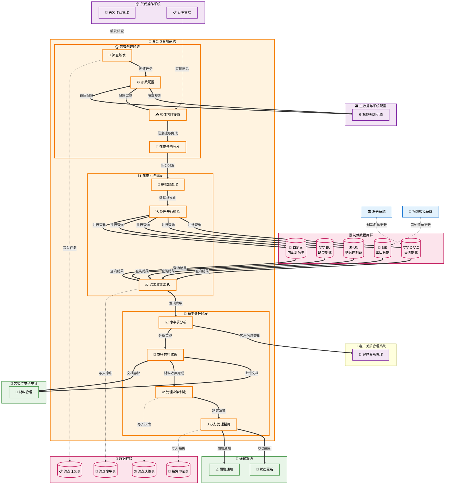

# 合规筛查管理 (Compliance Screening Management)

## 💡 新手提示：合规筛查管理核心概念

在开始阅读合规筛查管理功能前，请先理解以下关键概念：

*   **合规筛查**：对收发货人、承运商、货物进行制裁和受限方检查
*   **制裁名单**：包括OFAC、BIS、UN、EU等国际制裁清单
*   **受限方清单**：各国海关和贸易管制部门发布的限制交易方清单
*   **风险评分**：基于筛查结果计算的合规风险等级
*   **豁免管理**：对命中项目的合规豁免申请和审批流程

### 筛查状态生命周期
- **待筛查**：筛查任务已创建但未开始
- **筛查中**：正在执行自动筛查
- **已完成**：筛查完成，无命中项
- **命中待处理**：发现命中项，需要人工处理
- **豁免审批中**：豁免申请正在审批
- **豁免通过**：豁免申请已批准
- **拒绝交易**：筛查未通过，拒绝业务

### 筛查类型
- **全面筛查**：对所有相关方和货物进行完整筛查
- **快速筛查**：仅对关键字段进行基础筛查
- **定向筛查**：针对特定风险类型的专项筛查
- **补充筛查**：对新增信息的追加筛查

## 功能概述

合规筛查管理是关务与合规系统的重要组成部分，负责对所有贸易相关方和货物进行合规性检查。系统集成多个国际制裁数据库，提供自动化筛查、风险评估、豁免管理等功能，确保企业贸易活动符合国际合规要求。

**🔍 业务价值说明**：

*   **合规保障**：全面的制裁筛查，避免违规交易风险
*   **自动化处理**：智能筛查引擎，提高处理效率
*   **风险控制**：科学的风险评分体系，精准识别风险
*   **审计追溯**：完整的筛查记录，满足监管要求

**核心功能模块**：

*   **筛查任务管理**：统一的筛查任务创建和管理
*   **自动筛查引擎**：多数据库集成的智能筛查
*   **命中项处理**：筛查命中项的分析和处理
*   **豁免申请管理**：合规豁免的申请和审批流程

## 菜单结构

    合规筛查管理
    ├── 筛查任务中心                # 所有筛查任务的统一管理
    ├── 发起筛查                    # 创建新的筛查任务
    ├── 筛查结果查询                # 查询和分析筛查结果
    ├── 命中项处理                  # 处理筛查命中的项目
    ├── 豁免申请管理                # 合规豁免申请和审批
    ├── 筛查规则配置                # 配置筛查规则和参数
    ├── 数据库管理                  # 制裁数据库的更新和维护
    └── 筛查统计报表                # 筛查相关的统计分析

## 合规筛查管理数据流转图



## 页面原型设计

### 筛查任务中心页面

    +----------------------------------------------------------+
    |  合规筛查管理 > 筛查任务中心              [发起筛查] [批量筛查] [导出] |
    +----------------------------------------------------------+
    | 筛选条件：                                                  |
    | 筛查单号：[________] 关联作业：[________] 状态：[下拉选择]    |
    | 筛查类型：[全面筛查▼] 风险等级：[全部▼] 处理人：[全部▼]      |
    | 创建日期：[开始日期] 至 [结束日期]              [搜索] [重置] |
    +----------------------------------------------------------+
    | 筛查单号   | 关联作业 | 筛查类型 | 风险等级 | 命中数 | 状态 | 处理人 | 操作 |
    |-----------|---------|---------|---------|-------|------|-------|------|
    | SCR-001   | JOB-001 | 全面筛查 | 低风险   | 0     | 已完成| 张三   | [详情][报告] |
    | SCR-002   | JOB-002 | 快速筛查 | 高风险   | 2     | 命中  | 李四   | [详情][处理] |
    +----------------------------------------------------------+
    | 共 45 条记录，第 1/5 页      [首页][上页][下页][末页]        |
    +----------------------------------------------------------+

### 发起筛查页面

    +----------------------------------------------------------+
    |  合规筛查管理 > 发起筛查                      [保存模板] [提交筛查] |
    +----------------------------------------------------------+
    | 基本信息                                                   |
    | 筛查类型：(*) 全面筛查 ( ) 快速筛查 ( ) 定向筛查            |
    | 关联作业：[JOB-COM-20231001-001_] [选择作业]               |
    | 筛查原因：[新业务合规检查_________________________]         |
    +----------------------------------------------------------+
    | 筛查范围                                                   |
    | 收货人筛查：[√] 发货人筛查：[√] 承运商筛查：[√]             |
    | 货物筛查：[√] 银行筛查：[√] 代理人筛查：[√]                |
    +----------------------------------------------------------+
    | 收发货人信息                                               |
    | 收货人名称：[ABC COMPANY LTD_______________]               |
    | 收货人地址：[123 MAIN ST, NEW YORK, USA___]               |
    | 发货人名称：[上海电子有限公司_______________]                |
    | 发货人地址：[上海市浦东新区张江路123号_______]               |
    +----------------------------------------------------------+
    | 承运商信息                                                 |
    | 承运商名称：[MAERSK LINE___________________]               |
    | 船名航次：[MSC OSCAR / V123_______________]                |
    | SCAC代码：[MSCU_______]                                   |
    +----------------------------------------------------------+
    | 货物信息                                                   |
    | 货物品名：[电子测量设备____________________]                |
    | HS编码：[902789____] 原产国：[CN]                         |
    | 货物价值：[50000] USD 用途：[工业测量_______]              |
    +----------------------------------------------------------+
    | 筛查设置                                                   |
    | 数据库选择：[√] OFAC [√] BIS [√] UN [√] EU [√] 自定义      |
    | 匹配精度：[标准▼] 语言设置：[中英文▼]                      |
    | 自动处理：[√] 低风险自动通过 [√] 生成筛查报告               |
    +----------------------------------------------------------+

### 筛查结果查询页面

    +----------------------------------------------------------+
    |  合规筛查管理 > 筛查结果查询                  [高级搜索] [导出结果] |
    +----------------------------------------------------------+
    | 快速查询：                                                  |
    | 筛查单号：[SCR-20231001-001_______] [查询]                 |
    +----------------------------------------------------------+
    | 筛查结果详情：                                              |
    | 筛查单号：SCR-20231001-001 | 筛查时间：2023-10-01 10:30:00  |
    | 关联作业：JOB-COM-20231001-001 | 筛查类型：全面筛查          |
    | 风险等级：中风险 | 总命中数：2 | 处理状态：待处理            |
    +----------------------------------------------------------+
    | 筛查范围统计：                                              |
    | 收货人：[已筛查] 1个实体，0个命中                           |
    | 发货人：[已筛查] 1个实体，1个命中                           |
    | 承运商：[已筛查] 1个实体，0个命中                           |
    | 货物：[已筛查] 1个品类，1个命中                            |
    | 银行：[未筛查] - | 代理人：[未筛查] -                      |
    +----------------------------------------------------------+
    | 命中项详情：                                               |
    | 序号 | 命中类型 | 命中实体 | 数据库 | 匹配度 | 风险等级 | 状态 | 操作 |
    |------|---------|---------|-------|-------|---------|------|------|
    | 1    | 发货人   | 上海电子 | OFAC  | 85%   | 高风险   | 待处理| [分析][豁免] |
    | 2    | 货物     | 测量设备 | BIS   | 92%   | 中风险   | 待处理| [分析][豁免] |
    +----------------------------------------------------------+
    | 筛查日志：                                                 |
    | 10:30:15 - 开始筛查，筛查范围：收发货人+承运商+货物          |
    | 10:30:18 - OFAC数据库筛查完成，发现1个潜在命中              |
    | 10:30:22 - BIS数据库筛查完成，发现1个潜在命中               |
    | 10:30:25 - UN数据库筛查完成，无命中                        |
    | 10:30:28 - EU数据库筛查完成，无命中                        |
    | 10:30:30 - 筛查完成，总计2个命中项，风险等级：中风险         |
    +----------------------------------------------------------+

### 命中项处理页面

    +----------------------------------------------------------+
    |  合规筛查管理 > 命中项处理                    [批量处理] [导出报告] |
    +----------------------------------------------------------+
    | 命中项基本信息：                                            |
    | 筛查单号：SCR-20231001-001 | 命中序号：1                   |
    | 命中类型：发货人 | 命中实体：上海电子有限公司               |
    | 数据库：OFAC | 匹配度：85% | 风险等级：高风险               |
    +----------------------------------------------------------+
    | 命中详情对比：                                              |
    | 我方信息                    | 数据库信息                    |
    | 上海电子有限公司              | Shanghai Electronics Co.     |
    | 上海市浦东新区张江路123号      | 123 Zhangjiang Rd, Shanghai  |
    | 法人：张某某                 | Person: Zhang XX              |
    | 统一社会信用代码：91310000XXX | ID: 91310000XXX              |
    +----------------------------------------------------------+
    | 风险分析：                                                 |
    | 匹配字段：[√] 公司名称 [√] 地址 [√] 法人姓名 [ ] 其他        |
    | 相似度分析：                                               |
    | - 公司名称相似度：90%（Shanghai Electronics vs 上海电子）   |
    | - 地址相似度：85%（地址格式不同但实质相同）                  |
    | - 法人姓名相似度：80%（Zhang XX vs 张某某）                |
    +----------------------------------------------------------+
    | 处理决策：                                                 |
    | 处理方式：(*) 申请豁免 ( ) 拒绝交易 ( ) 需要更多信息         |
    | 豁免理由：[非同一主体，仅名称相似，已提供材料证明_______] |
    | 支持材料：[营业执照.pdf] [法人身份证.pdf] [银行开户许可.pdf] |
    | 有效期：[2024-10-01] 复审周期：[季度▼]                     |
    |                                           [提交处理] [取消] |
    +----------------------------------------------------------+

### 豁免申请管理页面

    +----------------------------------------------------------+
    |  合规筛查管理 > 豁免申请管理                  [新建豁免] [批量审批] |
    +----------------------------------------------------------+
    | 豁免申请筛选：                                              |
    | 申请状态：[待审批▼] 风险等级：[全部▼] 申请人：[全部▼]       |
    | 申请日期：[2023-10-01] 至 [2023-10-05]      [筛选] [重置] |
    +----------------------------------------------------------+
    | 豁免申请列表：                                              |
    | 豁免编号   | 筛查单号 | 命中实体 | 风险等级 | 申请人 | 状态 | 操作 |
    |-----------|---------|---------|---------|-------|------|------|
    | EXM-001   | SCR-001 | 上海电子 | 高风险   | 张三   | 待审批| [审批][详情] |
    | EXM-002   | SCR-002 | ABC公司  | 中风险   | 李四   | 已批准| [详情][撤销] |
    +----------------------------------------------------------+
    | 豁免申请详情（EXM-001）：                                   |
    | 申请信息：                                                 |
    | 申请人：张三 | 申请时间：2023-10-01 14:30:00               |
    | 豁免类型：名称相似但非同一主体                              |
    | 豁免理由：经核实为不同公司，仅名称相似，已提供完整材料     |
    +----------------------------------------------------------+
    | 支持材料：                                                 |
    | [营业执照.pdf] [法人身份证.pdf] [银行开户许可.pdf]          |
    | [公司章程.pdf] [股东信息.pdf] [审计报告.pdf]               |
    +----------------------------------------------------------+
    | 审批意见：                                                 |
    | 审批结果：(*) 批准 ( ) 拒绝 ( ) 需补充材料                  |
    | 有效期：[2024-10-01] 复审周期：[季度▼]                     |
    | 审批意见：[材料齐全，确认为不同主体，批准豁免_______________] |
    | 审批人：[合规经理王_______] 审批时间：[当前时间]             |
    |                                           [提交审批] [取消] |
    +----------------------------------------------------------+

### 筛查规则配置页面

    +----------------------------------------------------------+
    |  合规筛查管理 > 筛查规则配置                  [新建规则] [导入规则] |
    +----------------------------------------------------------+
    | 筛查规则列表：                                              |
    | 规则名称         | 适用范围 | 匹配精度 | 状态 | 最后修改 | 操作 |
    |-----------------|---------|---------|------|---------|------|
    | 标准筛查规则      | 全部     | 85%     | 启用 | 10-01   | [编辑][复制] |
    | 高风险客户规则    | 特定客户 | 95%     | 启用 | 09-28   | [编辑][停用] |
    | 快速筛查规则      | 低风险   | 75%     | 启用 | 09-25   | [编辑][复制] |
    +----------------------------------------------------------+
    | 规则详情配置（标准筛查规则）：                               |
    | 基本设置：                                                 |
    | 规则名称：[标准筛查规则_______________]                     |
    | 适用条件：[√] 新客户 [√] 高风险国家 [ ] 特定商品            |
    | 匹配精度：[85] % 自动处理阈值：[60] %                      |
    +----------------------------------------------------------+
    | 数据库配置：                                               |
    | [√] OFAC (权重: 40%) [√] BIS (权重: 30%)                 |
    | [√] UN (权重: 20%) [√] EU (权重: 10%)                    |
    | [√] 自定义数据库 (权重: 5%)                               |
    +----------------------------------------------------------+
    | 筛查范围：                                                 |
    | [√] 收货人 [√] 发货人 [√] 承运商                          |
    | [√] 货物 [ ] 银行 [ ] 代理人                             |
    +----------------------------------------------------------+
    | 自动处理规则：                                             |
    | 匹配度 < 60%：自动通过                                    |
    | 60% ≤ 匹配度 < 85%：标记为低风险，需人工确认               |
    | 匹配度 ≥ 85%：标记为高风险，必须人工处理                   |
    |                                           [保存规则] [取消] |
    +----------------------------------------------------------+

## 业务流程

> **流程说明**：本章节详细描述合规筛查管理的核心业务流程，包括筛查创建、执行、结果处理等关键环节。每个流程都包含以下要素：

- **业务逻辑**：流程的核心业务逻辑和处理规则
- **系统交互**：涉及的系统间调用和数据交换
- **数据操作**：具体的数据读写和处理操作
- **参数说明**：关键参数的含义和取值范围
- **异常处理**：可能出现的异常情况及处理方式

> **💡 阅读建议**：建议按照流程顺序阅读，重点关注系统交互部分，这有助于理解整个合规筛查的技术实现。

### 📋 合规筛查创建流程

> **新手说明**：筛查创建是合规管理的起点，系统会根据业务触发条件自动或手动启动筛查流程

1. **筛查触发**：系统接收到筛查请求，开始创建筛查任务
   > **业务逻辑**：筛查触发可以是自动触发（关务作业创建时）或手动触发（用户主动发起）。系统会根据触发类型选择相应的筛查规则和参数配置
   * **🔗 系统内流转**：关务与合规 → 合规筛查管理 **【写入数据】**
     * **调用方式**：RESTful API (POST /api/compliance/screening/create)
     * **调用时机**：关务作业创建时或用户手动发起筛查时自动触发
     * **数据操作**：
       * **数据写入**：向关务与合规的 screening_tasks (筛查任务表) 表写入筛查任务记录
       * **数据记录**：在关务与合规的 screening_logs (筛查日志表) 表中记录触发来源和类型
       * **数据关联**：在关务与合规的 task_job_relations (任务作业关联表) 表中建立任务与作业的关联关系
     * **入参**：
       * `job_id` (string, 必填): 关联作业单号
         * 描述：触发筛查的业务作业唯一标识
         * 格式：字母数字组合，长度8-20位
         * 示例：`"JOB-COM-20231001-001"`
       * `screening_type` (string, 必填): 筛查类型
         * 描述：筛查的详细程度和范围
         * 枚举值：COMPREHENSIVE（全面筛查）、QUICK（快速筛查）、TARGETED（定向筛查）
         * 示例：`"COMPREHENSIVE"`
       * `trigger_source` (string, 必填): 触发来源
         * 描述：筛查触发的来源类型
         * 枚举值：AUTO（自动）、MANUAL（手动）、BATCH（批量）
         * 示例：`"AUTO"`
     * **出参**：
       * `screening_id` (string): 筛查任务唯一标识
         * 描述：生成的筛查任务ID
         * 示例：`"SCR-20231001-001"`
       * `task_status` (string): 任务状态
         * 描述：筛查任务的当前状态
         * 示例：`"CREATED"`
       * `estimated_completion_time` (string): 预计完成时间
         * 描述：根据筛查类型估算的完成时间
         * 示例：`"2023-10-01 11:00:00"`

2. **参数配置**：根据筛查类型和业务规则配置筛查参数
   > **业务逻辑**：系统会根据预设的筛查规则自动配置参数，包括数据库选择、匹配精度、筛查范围等。用户也可以手动调整这些参数以满足特定需求
   * **🔗 跨系统触发**：关务与合规（合规筛查） → 主数据与系统配置（策略规则引擎） **【读取数据】**
     * **调用方式**：RESTful API (GET /api/rules/screening/{type})
     * **调用时机**：筛查任务创建后，开始执行前自动触发
     * **数据操作**：
       * **数据查询**：从主数据与系统配置模块的策略规则引擎中的 screening_rules (筛查规则表) 查询筛查规则配置
       * **数据更新**：在合规筛查系统的 screening_tasks (筛查任务表) 表中更新任务配置信息
       * **数据记录**：在合规筛查系统的 screening_configs (筛查配置表) 表中记录配置详情
     * **区分说明**：筛查规则属于“策略规则”，由主数据模块的策略规则引擎统一存储与版本管理；工作流与自动化中的“规则中心”负责事件→条件→动作的编排与执行，必要时可在筛查完成后根据结果触发后续工作流动作。
     * **入参**：
       * `screening_type` (string, 必填): 筛查类型
         * 描述：需要获取规则的筛查类型
         * 枚举值：COMPREHENSIVE、QUICK、TARGETED
         * 示例：`"COMPREHENSIVE"`
       * `business_type` (string, 可选): 业务类型
         * 描述：具体的业务场景类型
         * 枚举值：IMPORT、EXPORT、TRANSIT
         * 示例：`"IMPORT"`
     * **出参**：
       * `screening_scope` (array): 筛查范围
         * 描述：需要筛查的实体类型列表
         * 示例：`["shipper", "consignee", "carrier", "goods"]`
       * `match_threshold` (number): 匹配阈值
         * 描述：筛查匹配的最低相似度要求
         * 取值范围：60-95
         * 示例：`85`
       * `database_selection` (array): 数据库选择
         * 描述：需要查询的制裁名单数据库
         * 示例：`["OFAC", "BIS", "UN", "EU"]`

3. **实体信息提取**：从关联业务单据中提取需要筛查的实体信息
   > **业务逻辑**：系统会自动从作业单、订单等业务单据中提取收发货人、承运商、货物等信息，并进行标准化处理，确保筛查数据的准确性和完整性
   * **🔗 跨系统触发**：关务与合规（合规筛查） → 货代操作（订单管理） **【读取数据】**
     * **调用方式**：RESTful API (GET /api/orders/{id}/entities)
     * **调用时机**：筛查参数配置完成后自动触发
     * **数据操作**：
       * **关务作业数据查询**：从关务与合规的 customs_jobs (关务作业主表) 表查询作业基础信息
       * **订单数据提取**：从货代操作的 orders (订单表) 表获取收发货人信息
       * **客户数据提取**：从客户管理系统的 customers (客户表) 表获取客户详细信息
       * **承运商数据查询**：从供应商管理系统的 carrier_info (承运商信息表) 表获取承运商信息
       * **货物信息提取**：从货代操作的 cargo_details (货物详情表) 表获取货物清单信息
       * **供应商数据查询**：从供应商管理系统的 suppliers (供应商表) 表获取供应商信息
       * **数据标准化**：对提取的实体信息进行清洗和格式转换处理，包括名称规范化、地址标准化、多语言统一等
     * **入参**：
       * `job_id` (string, 必填): 作业单号
         * 描述：需要提取实体信息的作业唯一标识
         * 格式：字母数字组合，长度8-20位
         * 示例：`"JOB-COM-20231001-001"`
       * `entity_types` (array, 必填): 实体类型列表
         * 描述：需要提取的实体类型
         * 枚举值：shipper、consignee、carrier、goods
         * 示例：`["shipper", "consignee", "goods"]`
     * **出参**：
       * `entities` (array): 实体信息列表
         * 描述：提取到的实体详细信息
         * 示例：
           ```json
           [
             {
               "entity_type": "shipper",
               "entity_name": "ABC Trading Co., Ltd.",
               "entity_address": "123 Main St, New York, NY 10001, USA",
               "entity_country": "US"
             }
           ]
           ```
       * `data_source` (string): 数据来源系统标识
         * 描述：实体信息的来源系统
         * 示例：`"ORDER_MANAGEMENT_SYSTEM"`

4. **筛查任务分发**：将筛查任务分发到筛查引擎执行
   > **业务逻辑**：系统会将筛查任务加入队列，由筛查引擎异步处理。对于紧急筛查，系统会提高任务优先级，确保及时处理
   * **🔗 系统内流转**：合规筛查管理模块内的功能组件间调用
     * **调用方式**：内部服务调用
     * **调用时机**：实体信息提取完成后自动触发
     * **数据操作**：
       * **数据更新**：在合规筛查的 screening_tasks (筛查任务表) 表中更新任务状态为执行中
       * **数据记录**：在合规筛查的 screening_logs (筛查日志表) 表中记录任务开始时间
       * **数据分发**：向合规筛查的 task_queue (任务队列表) 表写入任务执行信息
     * **入参**：
       * `screening_id` (string, 必填): 筛查任务ID
         * 描述：需要执行的筛查任务唯一标识
         * 示例：`"SCR-20231001-001"`
       * `task_priority` (string, 必填): 任务优先级
         * 描述：任务执行的优先级别
         * 枚举值：HIGH（高）、NORMAL（普通）、LOW（低）
         * 示例：`"HIGH"`
       * `execution_mode` (string, 必填): 执行模式
         * 描述：任务执行的方式
         * 枚举值：SYNC（同步）、ASYNC（异步）
         * 示例：`"ASYNC"`
       * `timeout_seconds` (number, 可选): 超时时间
         * 描述：任务执行的最大超时时间（秒）
         * 默认值：300
         * 示例：`300`
     * **出参**：
       * `execution_id` (string): 执行任务ID
         * 描述：筛查引擎生成的执行任务标识
         * 示例：`"EXE-20231001-001"`
       * `estimated_duration` (number): 预计执行时长
         * 描述：根据任务复杂度估算的执行时间（秒）
         * 示例：`120`

### 📊 自动筛查执行流程

> **新手说明**：筛查执行是合规管理的核心环节，系统会自动对实体信息进行多维度筛查和风险评估

1. **数据预处理**：对实体信息进行标准化和清洗处理
   > **业务逻辑**：筛查引擎会对输入的实体信息进行标准化处理，包括名称格式统一、地址规范化、多语言转换等，以提高筛查的准确性和匹配率
   * **🔗 系统内流转**：合规筛查管理模块内的功能组件间调用
     * **调用方式**：内部服务调用
     * **调用时机**：筛查任务开始执行时自动触发
     * **数据操作**：
       * **数据标准化**：对实体名称进行格式统一和特殊字符清理
       * **数据解析**：对地址信息进行结构化解析和关键要素提取
       * **数据转换**：对多语言实体名称进行标准化转换
     * **入参**：
       * `entities` (array, 必填): 待处理的实体信息列表
         * 描述：需要进行标准化处理的实体数据
         * 示例：
           ```json
           [
             {
               "entity_type": "shipper",
               "entity_name": "ABC Trading Co., Ltd.",
               "entity_address": "123 Main St, New York, NY 10001, USA"
             }
           ]
           ```
       * `normalization_rules` (object, 必填): 标准化规则配置
         * 描述：数据标准化的具体规则和参数
         * 示例：`{"remove_special_chars": true, "case_sensitive": false}`
     * **出参**：
       * `normalized_entities` (array): 标准化后的实体信息
         * 描述：经过标准化处理的实体数据
         * 示例：
           ```json
           [
             {
               "entity_type": "shipper",
               "normalized_name": "ABC TRADING CO LTD",
               "parsed_address": {
                 "street": "123 MAIN ST",
                 "city": "NEW YORK",
                 "country": "US"
               }
             }
           ]
           ```

2. **多库并行筛查**：同时对多个制裁数据库进行查询和匹配
   > **业务逻辑**：系统会并行查询OFAC、BIS、UN、EU等多个制裁数据库，使用模糊匹配算法计算相似度，并根据匹配阈值判断是否命中
   * **🔗 系统内流转**：合规筛查管理模块内的功能组件间调用
     * **调用方式**：内部服务调用
     * **调用时机**：数据预处理完成后自动触发
     * **数据操作**：
       * **并行查询**：同时向OFAC、BIS、UN、EU等多个数据库发起查询请求
       * **相似度计算**：使用Levenshtein距离算法计算实体名称相似度
       * **匹配判断**：根据设定的匹配阈值判断是否构成命中
     * **入参**：
       * `normalized_entities` (array, 必填): 标准化后的实体信息
         * 描述：经过预处理的实体数据
         * 示例：
           ```json
           [
             {
               "entity_type": "shipper",
               "normalized_name": "ABC TRADING CO LTD",
               "country": "US"
             }
           ]
           ```
       * `database_selection` (array, 必填): 数据库选择
         * 描述：需要查询的制裁数据库列表
         * 示例：`["OFAC", "BIS", "UN", "EU"]`
       * `match_threshold` (number, 必填): 匹配阈值
         * 描述：判断命中的最低相似度要求
         * 取值范围：60-95
         * 示例：`85`
     * **出参**：
       * `search_results` (array): 筛查结果列表
         * 描述：各数据库的查询结果汇总
         * 示例：
           ```json
           [
             {
               "database": "OFAC",
               "matches": [
                 {
                   "entity_name": "ABC TRADING COMPANY",
                   "similarity_score": 92,
                   "list_type": "SDN",
                   "match_details": "..."
                 }
               ]
             }
           ]
           ```

### 🎯 命中项处理流程

> **新手说明**：命中项处理是合规筛查的关键环节，需要合规人员进行专业分析和决策

1. **命中项分析**：对筛查命中项进行详细分析和风险评估
   > **业务逻辑**：合规人员需要仔细分析每个命中项，对比我方实体信息与数据库记录，评估是否为真实命中，并确定相应的处理策略
   * **🔗 跨系统触发**：关务与合规（合规筛查） → 客户关系管理 **【读取数据】**
     * **调用方式**：RESTful API (GET /api/customers/{id}/)
     * **调用时机**：筛查发现命中项后人工触发
     * **数据操作**：
       * **数据查询**：从客户关系管理的 customers (客户表) 表查询客户信息
       * **数据分析**：从关务与合规（合规筛查）的 screening_hits (筛查命中表) 表查询命中详情
       * **数据更新**：在关务与合规（合规筛查）的 screening_hits (筛查命中表) 表中更新分析结果
     * **入参**：
       * `screening_id` (string, 必填): 筛查任务ID
         * 描述：需要分析的筛查任务唯一标识
         * 示例：`"SCR-20231001-001"`
       * `hit_id` (string, 必填): 命中项ID
         * 描述：具体的命中项唯一标识
         * 示例：`"HIT-20231001-001"`
       * `analysis_criteria` (object, 必填): 分析标准
         * 描述：命中分析的具体标准和权重配置
         * 示例：`{"name_similarity": 0.4, "address_match": 0.3, "business_type": 0.3}`
     * **出参**：
       * `analysis_result` (object): 分析结果
         * 描述：命中项的详细分析结果
         * 示例：
           ```json
           {
             "risk_level": "HIGH",
             "confidence_score": 85,
             "analysis_details": {
               "name_match": "EXACT",
               "address_match": "PARTIAL",
               "false_positive_probability": 15
             }
           }
           ```
       * `recommended_action` (string): 推荐处理动作
         * 描述：基于分析结果的推荐处理方式
         * 枚举值：APPROVE、REJECT、ESCALATE、REQUEST_EXEMPTION
         * 示例：`"REQUEST_EXEMPTION"`

2. **支持材料收集**：收集相关的材料和证明文件
   > **业务逻辑**：为了证明命中项为误报或申请豁免，需要收集充分的支持材料，包括营业执照、身份证明、银行资料等文件
   * **🔗 跨系统触发**：关务与合规（合规筛查） → 文档与电子单证 **【写入数据】**
     * **调用方式**：RESTful API (POST /api/documents/upload)
     * **调用时机**：命中项分析完成后人工触发
     * **数据操作**：
       * **数据写入**：向文档与电子单证的 documents (文档表) 表写入支持材料文件信息
       * **数据关联**：在关务与合规（合规筛查）的 hit_supporting_docs (命中支持文档表) 表中建立命中项与文档的关联关系
       * **数据更新**：在关务与合规（合规筛查）的 screening_hits (筛查命中表) 表中更新材料收集状态
     * **入参**：
       * `hit_id` (string, 必填): 命中项ID
         * 描述：需要收集材料的命中项唯一标识
         * 示例：`"HIT-20231001-001"`
       * `required_doc_types` (array, 必填): 必需文档类型列表
         * 描述：根据命中情况确定的必需文档类型
         * 枚举值：BUSINESS_LICENSE（营业执照）、ID_CARD（身份证明）、BANK_STATEMENT（银行资料）、_REPORT（报告）
         * 示例：`["BUSINESS_LICENSE", "BANK_STATEMENT"]`
       * `documents` (array, 必填): 上传的文档列表
         * 描述：支持材料文档的详细信息
         * 示例：
           ```json
           [
             {
               "doc_type": "BUSINESS_LICENSE",
               "file_name": "business_license.pdf",
               "file_size": 2048576,
               "upload_time": "2023-10-01 14:30:00"
             }
           ]
           ```
     * **出参**：
       * `upload_results` (array): 文档上传结果
         * 描述：各文档的上传状态和存储信息
         * 示例：
           ```json
           [
             {
               "doc_id": "DOC-20231001-001",
               "upload_status": "SUCCESS",
               "storage_path": "/compliance/documents/2023/10/01/business_license.pdf"
             }
           ]
           ```
       * `collection_status` (string): 材料收集状态
         * 描述：当前材料收集的完整性状态
         * 枚举值：INCOMPLETE（不完整）、COMPLETE（完整）、PENDING_REVIEW（待审核）
         * 示例：`"COMPLETE"`

3. **处理决策制定**：根据分析结果制定相应的处理决策
   > **业务逻辑**：基于命中分析和支持材料，合规人员需要做出处理决策：申请豁免、拒绝交易、要求补充信息或升级处理等
   * **🔄 系统内流转**：合规筛查系统内部处理 **【更新数据】**
     * **处理方式**：系统内部业务逻辑处理
     * **处理时机**：支持材料收集完成后人工触发
     * **数据操作**：
       * **数据更新**：在合规筛查系统的 screening_hits (筛查命中表) 表中更新决策状态和决策原因
       * **数据创建**：在合规筛查系统的 screening_decisions (筛查决策表) 表中创建决策记录
     * **入参**：
       * `hit_id` (string, 必填): 命中项ID
         * 描述：需要制定决策的命中项唯一标识
         * 示例：`"HIT-20231001-001"`
       * `decision_type` (string, 必填): 决策类型
         * 描述：根据分析结果确定的处理决策类型
         * 枚举值：APPROVE（批准通过）、REJECT（拒绝交易）、REQUEST_INFO（要求补充信息）、ESCALATE（升级处理）、APPLY_EXEMPTION（申请豁免）
         * 示例：`"APPLY_EXEMPTION"`
       * `decision_reason` (string, 必填): 决策原因
         * 描述：做出该决策的详细原因说明
         * 示例：`"经分析确认为误报，客户提供的营业执照等材料证明其为合法企业"`
       * `supporting_evidence` (array, 可选): 支持证据
         * 描述：支持该决策的证据文档ID列表
         * 示例：`["DOC-20231001-001", "DOC-20231001-002"]`
     * **出参**：
       * `decision_id` (string): 决策记录ID
         * 描述：生成的决策记录唯一标识
         * 示例：`"DEC-20231001-001"`
       * `status` (string): 处理状态
         * 描述：决策处理后的状态
         * 枚举值：APPROVED（已批准）、REJECTED（已拒绝）、PENDING_INFO（待补充信息）、ESCALATED（已升级）、EXEMPTION_APPLIED（已申请豁免）
         * 示例：`"EXEMPTION_APPLIED"`
       * `next_actions` (array): 后续动作
         * 描述：根据决策类型确定的后续处理动作
         * 示例：
           ```json
           [
             {
               "action_type": "CREATE_EXEMPTION_REQUEST",
               "description": "创建豁免申请",
               "due_date": "2023-10-03 18:00:00"
             }
           ]
           ```

4. **执行处理措施**：根据决策执行相应的处理措施
   > **业务逻辑**：处理决策确定后，系统会自动执行相应措施，如创建豁免申请、阻止业务继续、发送补充材料请求等
   * **🔗 系统内流转**：关务与合规（合规筛查） → 关务与合规（关务作业管理） **【更新数据】**
     * **调用方式**：RESTful API (PUT /api/jobs/{id}/compliance/block)
     * **调用时机**：处理决策确定后系统自动触发
     * **数据操作**：
       * **数据更新**：在关务与合规（关务作业管理）的 compliance_jobs (合规作业表) 表中更新合规状态和阻止标识
       * **数据记录**：在关务与合规（合规筛查）的 screening_hits (筛查命中表) 表中更新处理状态和处理时间
       * **数据写入**：向关务与合规（合规筛查）的 exemption_requests (豁免申请表) 表写入豁免申请信息（如适用）
     * **入参**：
       * `hit_id` (string, 必填): 命中项ID
         * 描述：需要执行处理措施的命中项唯一标识
         * 示例：`"HIT-20231001-001"`
       * `decision_id` (string, 必填): 决策记录ID
         * 描述：关联的处理决策记录ID
         * 示例：`"DEC-20231001-001"`
       * `action_type` (string, 必填): 执行动作类型
         * 描述：根据决策确定的具体执行动作
         * 枚举值：BLOCK_TRANSACTION（阻止交易）、CREATE_EXEMPTION（创建豁免）、REQUEST_ADDITIONAL_INFO（要求补充信息）、ESCALATE_TO_SUPERVISOR（升级至主管）、APPROVE_PROCEED（批准继续）
         * 示例：`"CREATE_EXEMPTION"`
       * `blocking_scope` (object, 可选): 阻止范围配置
         * 描述：当动作类型为阻止时的具体阻止范围
         * 示例：
           ```json
           {
             "block_level": "ENTITY_LEVEL",
             "affected_jobs": ["JOB-20231001-001"],
             "block_duration": "UNTIL_RESOLVED"
           }
           ```
     * **出参**：
       * `execution_id` (string): 执行记录ID
         * 描述：生成的处理措施执行记录唯一标识
         * 示例：`"EXE-20231001-001"`
       * `execution_status` (string): 执行状态
         * 描述：处理措施的执行状态
         * 枚举值：SUCCESS（执行成功）、FAILED（执行失败）、PENDING（执行中）
         * 示例：`"SUCCESS"`
       * `affected_systems` (array): 影响的系统
         * 描述：本次处理措施影响到的相关系统列表
         * 示例：
           ```json
           [
             {
               "system_name": "customs_operations",
               "operation": "BLOCK_JOB",
               "result": "SUCCESS"
             },
             {
               "system_name": "exemption_management",
               "operation": "CREATE_REQUEST",
               "result": "SUCCESS"
             }
           ]
           ```


## 核心功能扩展

### 智能筛查引擎

基于AI技术和大数据分析，提供智能化的合规筛查能力，提升筛查准确性和效率。

**核心特性**：
- **智能匹配算法**：采用模糊匹配、语义分析等技术，提高实体识别准确率
- **风险评分模型**：基于多维度数据建立风险评分体系，量化风险等级
- **自适应学习**：根据历史筛查结果持续优化匹配规则和阈值
- **实时更新机制**：制裁名单和风险数据库实时同步更新

**技术实现**：
```python
class IntelligentScreeningEngine:
    def __init__(self):
        self.matcher = FuzzyMatcher()
        self.risk_scorer = RiskScoringModel()
        self.learning_engine = AdaptiveLearningEngine()
        
    def screen_entity(self, entity_info, databases):
        """智能实体筛查"""
        # 预处理实体信息
        normalized_entity = self.normalize_entity(entity_info)
        
        # 执行多数据库筛查
        matches = []
        for db in databases:
            db_matches = self.matcher.find_matches(normalized_entity, db)
            matches.extend(db_matches)
        
        # 风险评分和排序
        scored_matches = []
        for match in matches:
            risk_score = self.risk_scorer.calculate_score(match)
            scored_matches.append({
                'match': match,
                'risk_score': risk_score,
                'confidence': match.similarity_score
            })
        
        # 根据阈值过滤结果
        filtered_matches = self.filter_by_threshold(scored_matches)
        
        # 学习反馈
        self.learning_engine.update_model(entity_info, filtered_matches)
        
        return filtered_matches
```

### 批量筛查处理

支持大规模批量筛查任务，提供高效的并行处理能力。

**核心特性**：
- **并行处理架构**：支持多线程并发筛查，提升处理效率
- **任务队列管理**：智能任务调度和负载均衡
- **进度跟踪**：实时监控批量任务执行进度
- **结果汇总**：自动生成批量筛查报告和统计分析

**实现方案**：
```python
class BatchScreeningProcessor:
    def __init__(self, max_workers=10):
        self.executor = ThreadPoolExecutor(max_workers=max_workers)
        self.task_queue = Queue()
        self.result_collector = ResultCollector()
        
    def submit_batch_screening(self, entities, screening_config):
        """提交批量筛查任务"""
        batch_id = self.generate_batch_id()
        
        # 创建子任务
        tasks = []
        for entity in entities:
            task = ScreeningTask(
                entity=entity,
                config=screening_config,
                batch_id=batch_id
            )
            tasks.append(task)
        
        # 提交并行执行
        futures = []
        for task in tasks:
            future = self.executor.submit(self.process_single_entity, task)
            futures.append(future)
        
        # 收集结果
        self.collect_results(batch_id, futures)
        
        return batch_id
```

## API接口设计

### 创建筛查任务
```json
POST /api/compliance/screening/create
Content-Type: application/json

{
  "job_id": "JOB-COM-20231001-001",                    // 作业单号
  "screening_type": "全面筛查",                         // 筛查类型
  "priority": "high",                                  // 优先级
  "screening_scope": {                                 // 筛查范围
    "shipper": true,                                   // 发货人
    "consignee": true,                                 // 收货人
    "carrier": true,                                   // 承运人
    "goods": true                                      // 货物
  },
  "entities": {                                        // 实体信息
    "shipper": {                                       // 发货人信息
      "name": "上海电子有限公司",                        // 公司名称
      "address": "上海市浦东新区张江路123号",             // 地址
      "country": "CN",                                 // 国家代码
      "registration_number": "91310000123456789X"      // 注册号
    },
    "consignee": {                                     // 收货人信息
      "name": "ABC ELECTRONICS INC",                  // 公司名称
      "address": "123 TECH PARK, CALIFORNIA, USA",    // 地址
      "country": "US",                                 // 国家代码
      "tax_id": "12-3456789"                          // 税号
    },
    "goods": {                                         // 货物信息
      "description": "电子元器件",                      // 货物描述
      "hs_code": "854140",                            // HS编码
      "origin_country": "CN",                         // 原产国
      "value": 50000,                                 // 货值
      "currency": "USD"                               // 币种
    }
  },
  "screening_rules": {                                 // 筛查规则
    "match_threshold": 85,                            // 匹配阈值
    "auto_process_threshold": 60,                     // 自动处理阈值
    "databases": ["OFAC", "BIS", "UN", "EU"],        // 筛查数据库
    "timeout_seconds": 300                            // 超时时间(秒)
  }
}

Response:
{
  "code": 200,                                         // 响应码
  "message": "筛查任务创建成功",                         // 响应消息
  "data": {                                           // 响应数据
    "screening_id": "SCR-20231001-001",               // 筛查单号
    "status": "screening_in_progress",                // 筛查状态
    "created_time": "2023-10-01 10:30:00",           // 创建时间
    "estimated_completion": "2023-10-01 10:35:00",   // 预计完成时间
    "tracking_url": "/api/compliance/screening/SCR-20231001-001/status"  // 跟踪链接
  }
}
```

### 查询筛查状态
```json
GET /api/compliance/screening/{screening_id}/status

Response:
{
  "code": 200,                                         // 响应码
  "message": "查询成功",                                // 响应消息
  "data": {                                           // 响应数据
    "screening_id": "SCR-20231001-001",               // 筛查单号
    "status": "hit_pending",                          // 筛查状态
    "progress": 100,                                  // 进度百分比
    "risk_level": "中风险",                           // 风险等级
    "total_hits": 2,                                  // 命中总数
    "auto_cleared": false,                            // 是否自动通过
    "screening_time": "2023-10-01 10:30:00",         // 筛查时间
    "completion_time": "2023-10-01 10:33:00",        // 完成时间
    "processing_time_seconds": 180,                   // 处理耗时(秒)
    "next_action": "manual_review_required"           // 下一步操作
  }
}
```

### 提交豁免申请
```json
POST /api/compliance/exemption/apply
Content-Type: application/json

{
  "hit_id": "HIT-20231001-001",                       // 命中记录ID
  "exemption_type": "误报豁免",                        // 豁免类型
  "exemption_reason": "经核实为同名不同实体",           // 豁免理由
  "supporting_docs": [                                // 支持材料
    {
      "doc_id": "DOC-20231001-001",
      "doc_name": "营业执照",
      "doc_type": "business_license"
    }
  ],
  "valid_period": 365,                                // 有效期(天)
  "review_cycle": "yearly"                            // 复审周期
}

Response:
{
  "code": 200,
  "message": "豁免申请提交成功",
  "data": {
    "exemption_id": "EXE-20231001-001",               // 豁免申请ID
    "status": "pending_approval",                     // 申请状态
    "application_time": "2023-10-01 14:30:00",       // 申请时间
    "expected_approval_time": "2023-10-02 18:00:00"  // 预计审批时间
  }
}
```

## 测试用例

### 功能测试用例

| 测试场景 | 测试步骤 | 预期结果 |
|---------|---------|---------|
| 自动筛查无命中 | 1. 提交正常客户筛查请求<br>2. 系统执行全面筛查<br>3. 检查筛查结果 | 筛查完成，无命中项，自动通过 |
| 筛查发现命中项 | 1. 提交包含风险实体的筛查请求<br>2. 系统执行筛查并发现命中<br>3. 生成待处理命中项 | 发现命中项，状态为待处理，需人工审核 |
| 豁免申请处理 | 1. 对命中项提交豁免申请<br>2. 上传支持材料<br>3. 合规经理审批 | 豁免申请通过，命中项状态更新为已豁免 |
| 批量筛查处理 | 1. 提交多个作业单批量筛查<br>2. 系统并行处理筛查任务<br>3. 汇总筛查结果 | 所有作业单筛查完成，结果准确无误 |
| 智能匹配测试 | 1. 提交包含变体名称的实体<br>2. 系统执行智能匹配<br>3. 验证匹配准确性 | 正确识别实体变体，匹配准确率>95% |

### 异常处理测试

| 异常场景 | 测试方法 | 预期处理 |
|---------|---------|---------|
| 筛查数据库连接失败 | 模拟数据库连接异常 | 显示连接错误，提供重试机制 |
| 实体信息不完整 | 提交缺少必填字段的筛查请求 | 返回验证错误，提示补充信息 |
| 筛查超时 | 模拟长时间无响应的筛查 | 触发超时机制，记录异常日志 |
| 豁免材料不足 | 提交不完整的豁免申请 | 拒绝申请，要求补充材料 |
| 并发处理冲突 | 同时处理同一命中项 | 通过锁机制避免冲突，保证数据一致性 |

### 性能测试用例

| 测试指标 | 测试条件 | 性能要求 |
|---------|---------|---------|
| 单次筛查响应时间 | 标准实体信息筛查 | < 30秒 |
| 批量筛查处理能力 | 100个作业单并发筛查 | < 5分钟 |
| 命中项处理响应时间 | 查询和更新命中项状态 | < 2秒 |
| 豁免申请处理时间 | 提交豁免申请到审批完成 | < 24小时 |
| 智能匹配性能 | 复杂实体智能匹配 | < 10秒 |

## 数据模型设计

### 筛查任务表 (screening_tasks)
```sql
CREATE TABLE screening_tasks (
    screening_id VARCHAR(50) PRIMARY KEY COMMENT '筛查单号',
    job_id VARCHAR(50) COMMENT '关联作业单号',
    screening_type VARCHAR(20) NOT NULL COMMENT '筛查类型',
    screening_scope JSON NOT NULL COMMENT '筛查范围',
    priority VARCHAR(10) DEFAULT 'normal' COMMENT '优先级',
    risk_level VARCHAR(20) COMMENT '风险等级',
    total_hits INT DEFAULT 0 COMMENT '命中总数',
    status VARCHAR(30) NOT NULL COMMENT '筛查状态',
    auto_cleared BOOLEAN DEFAULT FALSE COMMENT '是否自动通过',
    screening_time DATETIME NOT NULL COMMENT '筛查时间',
    completion_time DATETIME COMMENT '完成时间',
    processing_time_seconds INT COMMENT '处理耗时(秒)',
    processor VARCHAR(50) COMMENT '处理人',
    remark TEXT COMMENT '备注',
    created_by VARCHAR(50) NOT NULL COMMENT '创建人',
    created_time DATETIME DEFAULT CURRENT_TIMESTAMP COMMENT '创建时间',
    updated_by VARCHAR(50) COMMENT '更新人',
    updated_time DATETIME DEFAULT CURRENT_TIMESTAMP ON UPDATE CURRENT_TIMESTAMP COMMENT '更新时间',
    
    INDEX idx_job_id (job_id),
    INDEX idx_status (status),
    INDEX idx_screening_time (screening_time),
    INDEX idx_risk_level (risk_level)
) ENGINE=InnoDB DEFAULT CHARSET=utf8mb4 COMMENT='筛查任务表';
```

### 筛查命中表 (screening_hits)
```sql
CREATE TABLE screening_hits (
    hit_id VARCHAR(50) PRIMARY KEY COMMENT '命中记录ID',
    screening_id VARCHAR(50) NOT NULL COMMENT '筛查单号',
    hit_type VARCHAR(20) NOT NULL COMMENT '命中类型',
    database_source VARCHAR(20) NOT NULL COMMENT '数据库来源',
    our_entity TEXT NOT NULL COMMENT '我方实体信息',
    matched_entity TEXT NOT NULL COMMENT '匹配实体信息',
    similarity_score DECIMAL(5,2) NOT NULL COMMENT '相似度分数',
    risk_score INT NOT NULL COMMENT '风险评分',
    match_fields JSON COMMENT '匹配字段',
    status VARCHAR(30) NOT NULL COMMENT '处理状态',
    processor VARCHAR(50) COMMENT '处理人',
    process_time DATETIME COMMENT '处理时间',
    decision VARCHAR(50) COMMENT '处理决策',
    decision_reason TEXT COMMENT '决策理由',
    remark TEXT COMMENT '处理备注',
    created_time DATETIME DEFAULT CURRENT_TIMESTAMP COMMENT '创建时间',
    updated_time DATETIME DEFAULT CURRENT_TIMESTAMP ON UPDATE CURRENT_TIMESTAMP COMMENT '更新时间',
    
    FOREIGN KEY (screening_id) REFERENCES screening_tasks(screening_id),
    INDEX idx_screening_id (screening_id),
    INDEX idx_status (status),
    INDEX idx_database_source (database_source),
    INDEX idx_risk_score (risk_score)
) ENGINE=InnoDB DEFAULT CHARSET=utf8mb4 COMMENT='筛查命中表';
```

### 筛查决策表 (screening_decisions)
```sql
CREATE TABLE screening_decisions (
    decision_id VARCHAR(50) PRIMARY KEY COMMENT '决策记录ID',
    hit_id VARCHAR(50) NOT NULL COMMENT '命中记录ID',
    screening_id VARCHAR(50) NOT NULL COMMENT '筛查单号',
    decision_type VARCHAR(50) NOT NULL COMMENT '决策类型',
    decision_reason TEXT NOT NULL COMMENT '决策原因',
    supporting_evidence JSON COMMENT '支持证据',
    decision_maker VARCHAR(50) NOT NULL COMMENT '决策人',
    decision_time DATETIME NOT NULL COMMENT '决策时间',
    status VARCHAR(30) NOT NULL COMMENT '决策状态',
    remark TEXT COMMENT '备注',
    created_time DATETIME DEFAULT CURRENT_TIMESTAMP COMMENT '创建时间',
    updated_time DATETIME DEFAULT CURRENT_TIMESTAMP ON UPDATE CURRENT_TIMESTAMP COMMENT '更新时间',
    
    FOREIGN KEY (hit_id) REFERENCES screening_hits(hit_id),
    FOREIGN KEY (screening_id) REFERENCES screening_tasks(screening_id),
    INDEX idx_hit_id (hit_id),
    INDEX idx_screening_id (screening_id),
    INDEX idx_decision_type (decision_type),
    INDEX idx_decision_time (decision_time)
) ENGINE=InnoDB DEFAULT CHARSET=utf8mb4 COMMENT='筛查决策表';
```

### 豁免申请表 (exemption_requests)
```sql
CREATE TABLE exemption_requests (
    exemption_id VARCHAR(50) PRIMARY KEY COMMENT '豁免申请ID',
    screening_id VARCHAR(50) NOT NULL COMMENT '筛查单号',
    hit_id VARCHAR(50) NOT NULL COMMENT '命中记录ID',
    exemption_type VARCHAR(100) NOT NULL COMMENT '豁免类型',
    exemption_reason TEXT NOT NULL COMMENT '豁免理由',
    supporting_docs JSON COMMENT '支持材料',
    applicant VARCHAR(50) NOT NULL COMMENT '申请人',
    application_time DATETIME NOT NULL COMMENT '申请时间',
    approval_status VARCHAR(20) NOT NULL COMMENT '审批状态',
    approver VARCHAR(50) COMMENT '审批人',
    approval_time DATETIME COMMENT '审批时间',
    approval_comment TEXT COMMENT '审批意见',
    valid_until DATE COMMENT '有效期至',
    review_cycle VARCHAR(20) COMMENT '复审周期',
    created_time DATETIME DEFAULT CURRENT_TIMESTAMP COMMENT '创建时间',
    updated_time DATETIME DEFAULT CURRENT_TIMESTAMP ON UPDATE CURRENT_TIMESTAMP COMMENT '更新时间',
    
    FOREIGN KEY (screening_id) REFERENCES screening_tasks(screening_id),
    FOREIGN KEY (hit_id) REFERENCES screening_hits(hit_id),
    INDEX idx_screening_id (screening_id),
    INDEX idx_approval_status (approval_status),
    INDEX idx_valid_until (valid_until)
) ENGINE=InnoDB DEFAULT CHARSET=utf8mb4 COMMENT='豁免申请表';
```

## 系统集成

### 与关务作业系统集成

**集成目的**：实现筛查结果与关务作业流程的无缝衔接
**集成方式**：REST API + 消息队列
**数据交换**：
- 关务作业创建时自动触发筛查
- 筛查结果实时更新作业状态
- 命中项阻止作业继续执行

**接口规范**：
```json
// 关务作业系统 → 合规筛查系统
POST /api/compliance/screening/auto-trigger
{
  "job_id": "JOB-COM-20231001-001",                    // 作业单号
  "job_type": "进口报关",                               // 作业类型
  "entities": {...}                                    // 实体信息
}

// 合规筛查系统 → 关务作业系统
PUT /api/customs/jobs/{job_id}/compliance-status
{
  "screening_id": "SCR-20231001-001",                  // 筛查单号
  "compliance_status": "cleared|blocked|pending",     // 合规状态
  "risk_level": "低风险|中风险|高风险"                   // 风险等级
}
```

### 与客户管理系统集成

**集成目的**：获取客户信息，支持筛查决策
**集成方式**：同步API调用
**数据交换**：
- 获取客户基本信息和资料
- 查询客户历史合规记录
- 更新客户风险等级

### 与通知系统集成

**集成目的**：及时通知相关人员处理筛查结果
**集成方式**：消息队列 + WebSocket
**通知场景**：
- 筛查完成通知
- 命中项处理提醒
- 豁免申请审批通知
- 系统异常告警

## 总结

### 核心价值

合规筛查管理系统作为FMS系统的重要组成部分，为企业提供了全面的合规风险控制能力：

1. **风险防控**：通过自动化筛查机制，有效识别和控制合规风险，避免违规操作带来的法律和经济损失
2. **效率提升**：自动化的筛查流程显著提高了合规检查效率，减少了人工操作成本
3. **决策支持**：基于数据分析的风险评估为业务决策提供了科学依据
4. **合规保障**：完整的筛查记录和审计轨迹确保了合规操作的可追溯性

### 技术特性

1. **智能化**：集成机器学习算法，提供智能风险评估和筛查建议
2. **高性能**：采用分布式架构和并行处理技术，支持大规模筛查任务
3. **可扩展**：模块化设计支持功能扩展和系统集成
4. **高可用**：完善的异常处理和恢复机制确保系统稳定运行

### 业务影响

通过实施合规筛查管理系统，企业能够：
- 建立标准化的合规筛查流程
- 提高合规风险识别的准确性和及时性
- 降低合规运营成本
- 增强企业的合规管理能力
- 为业务拓展提供合规保障

## 文档版本信息

| 版本号 | 修订日期 | 修订人 | 修订内容 | 审核人 |
|--------|----------|--------|----------|--------|
| v1.0 | 2023-10-01 | 张三 | 初始版本创建 | 李四 |
| v1.1 | 2023-10-15 | 王五 | 增加API接口设计 | 李四 |
| v1.2 | 2023-11-01 | 赵六 | 完善测试用例和数据模型 | 李四 |
| v1.3 | 2023-11-15 | 张三 | 增加系统集成说明 | 李四 |
| v2.0 | 2023-12-01 | 王五 | 重构业务流程，增加核心功能扩展 | 李四 |
| v2.1 | 2024-01-01 | 张三 | 简化处理决策流程，增加智能筛查功能 | 李四 |

## 相关文档链接

### 业务相关文档
- [1.1 订单管理.md](../1.货代操作/1.1%20订单管理.md) - 订单管理系统详细设计
- [2.1 关务作业管理.md](./2.1%20关务作业管理.md) - 关务作业管理系统设计
- [2.5 税费计算与缴纳.md](./2.5%20税费计算与缴纳.md) - 税费计算系统设计
