# 预录入与归类管理 (Pre-entry & Classification Management)

## 💡 新手提示：预录入与归类管理核心概念

在开始阅读预录入与归类管理功能前，请先理解以下关键概念：

*   **预录入**：在货物到港前预先录入报关信息，提高通关效率
*   **商品归类**：根据HS编码对进出口商品进行分类
*   **税则查询**：查询商品对应的税率、监管条件等信息
*   **归类建议**：基于AI和专家知识库提供的归类建议
*   **归类确认**：海关或专业人员对商品归类的最终确认

### 预录入状态生命周期
- **草稿**：预录入信息正在编辑中
- **待归类**：基本信息已录入，等待商品归类
- **归类中**：正在进行商品归类处理
- **待审核**：归类完成，等待专业审核
- **审核通过**：归类审核通过，可用于报关
- **需修正**：发现问题，需要修正信息
- **已提交**：预录入信息已提交给海关系统

### 归类方式
- **自动归类**：基于商品描述自动匹配HS编码
- **智能建议**：AI分析提供归类建议
- **专家归类**：专业归类师人工归类
- **历史匹配**：基于历史归类记录匹配

## 功能概述

预录入与归类管理是关务与合规系统的核心功能，负责在货物到港前完成报关信息的预先录入和商品归类。系统集成智能归类引擎、税则数据库、专家知识库等，提供高效准确的预录入和归类服务，大幅提升通关效率。

**🔍 业务价值说明**：

*   **提前准备**：货物到港前完成信息录入，缩短通关时间
*   **准确归类**：专业的归类服务，降低归类错误风险
*   **智能辅助**：AI归类建议，提高归类效率和准确性
*   **合规保障**：确保归类符合海关要求，避免通关延误

**核心功能模块**：

*   **预录入管理**：报关信息的预先录入和管理
*   **商品归类**：HS编码归类和税则查询
*   **归类审核**：专业人员对归类结果的审核
*   **知识库管理**：归类知识和经验的积累管理

## 菜单结构

    预录入与归类管理
    ├── 预录入工作台                # 预录入任务的统一管理
    ├── 新建预录入                  # 创建新的预录入任务
    ├── 预录入查询                  # 查询和管理预录入记录
    ├── 商品归类中心                # 商品归类任务管理
    ├── 归类建议查询                # 查询AI归类建议
    ├── 税则数据查询                # 查询税则和监管条件
    ├── 归类审核管理                # 归类结果的审核管理
    ├── 归类知识库                  # 归类经验和知识管理
    ├── 历史归类查询                # 查询历史归类记录
    └── 预录入统计报表              # 预录入相关统计分析

## 预录入与归类管理数据流转图

```mermaid
graph TB
    %% 外部系统
    CustomsSystem[🏛️ 海关系统]
    CIQSystem[🔬 检验检疫系统]
    ClassificationExpert[👨‍💼 归类专家]
    Reviewer[👩‍💼 审核人员]
    
    %% 上游系统
    subgraph FreightOps[📦 货代操作系统]
        JobMgmt[📋 作业管理]
        WaybillMgmt[📄 运单管理]
        BookingMgmt[🚢 订舱管理]
    end
    
    subgraph CustomerMgmt[👥 客户关系管理]
        CustomerSystem[🏢 客户信息系统]
    end
    
    subgraph MasterData[🗃️ 主数据与系统配置]
         ClassificationKnowledgeBase[📚 归类知识库]
         RegulationRules[📋 法规规则库]
         ClassificationCases[📖 归类案例库]
         ExpertKnowledge[🧠 专家知识库]
         HSCodeDB[🏷️ HS编码数据库]
         TariffDB[💰 税率数据库]
         SupervisionDB[📋 监管条件库]
     end
    
    %% 核心系统 - 关务与合规
    subgraph CustomsCompliance[🛃 关务与合规系统]
        subgraph PreEntryMgmt[📝 预录入与归类管理]
            PreEntryCreate[📋 预录入创建]
            CustomerVerify[✅ 收发货人验证]
            CarrierInfo[🚛 承运信息录入]
            GoodsInfo[📦 商品信息录入]
            GoodsClassification[🏷️ 商品归类引擎]
            ClassificationReview[🔍 归类审核引擎]
            KnowledgeBase[📚 知识库管理]
            TaxCalculation[💰 税费计算引擎]
        end
        
        subgraph AIService[🤖 AI智能支持]
            ClassificationAI[🧠 AI归类引擎]
            TextAnalysis[📝 文本分析]
            ImageRecognition[🖼️ 图像识别]
            HistoryMatcher[🔍 历史匹配]
        end
    end
    
    %% 下游系统
    subgraph WorkflowAutomation[🔄 工作流与自动化]
        ExpertAssign[👨‍💼 专家任务分配]
        ReviewAssign[👩‍💼 审核任务分配]
    end
    
    subgraph NotificationService[📢 通知服务]
        NotificationSys[📨 通知系统]
    end
    
    %% 数据存储
     subgraph DataStorage[💾 数据存储]
         PreEntryData[(📋 预录入数据)]
         ClassificationData[(🏷️ 归类数据)]
         ReviewData[(🔍 审核数据)]
         KnowledgeData[(📚 知识库数据)]
         TaxData[(💰 税费数据)]
     end
    
    %% 预录入创建流程数据流
    JobMgmt -.->|触发预录入| PreEntryCreate
    PreEntryCreate -.->|验证客户信息| CustomerSystem
    CustomerSystem ==>|客户资质信息| CustomerVerify
    CustomerVerify -->|承运信息录入| CarrierInfo
    
    %% 商品信息录入流程数据流
    CarrierInfo -->|商品信息录入| GoodsInfo
    WaybillMgmt -.->|运单商品信息| GoodsInfo
    BookingMgmt -.->|订舱货物信息| GoodsInfo
    GoodsInfo ==>|商品归类处理| GoodsClassification
    
    %% AI智能归类流程数据流
    GoodsClassification ==>|AI智能分析| ClassificationAI
    ClassificationAI -->|文本特征提取| TextAnalysis
    ClassificationAI -->|图像特征提取| ImageRecognition
    ClassificationAI -->|历史案例匹配| HistoryMatcher
    TextAnalysis -->|文本特征| ClassificationAI
    ImageRecognition -->|图像特征| ClassificationAI
    HistoryMatcher -->|相似案例| ClassificationAI
    ClassificationAI ==>|AI归类建议| GoodsClassification
    
    %% 税则查询流程数据流
     GoodsClassification -.->|查询HS编码| HSCodeDB
     GoodsClassification -.->|查询税率信息| TariffDB
     GoodsClassification -.->|查询监管条件| SupervisionDB
     HSCodeDB ==>|编码信息| GoodsClassification
     TariffDB ==>|税率数据| GoodsClassification
     SupervisionDB ==>|监管条件| GoodsClassification
    
    %% 专家归类流程数据流
    GoodsClassification -->|专家任务分配| ExpertAssign
    ExpertAssign -.->|通知归类专家| ClassificationExpert
    ClassificationExpert ==>|专家归类处理| GoodsClassification
    
    %% 税费计算流程数据流
    GoodsClassification ==>|税费计算| TaxCalculation
    TaxCalculation -.->|查询税率| TariffDB
    TariffDB ==>|税率信息| TaxCalculation
    TaxCalculation -->|税费结果| GoodsClassification
    
    %% 归类审核流程数据流
    GoodsClassification -->|提交审核| ClassificationReview
    ClassificationReview -->|审核任务分配| ReviewAssign
    ReviewAssign -.->|通知审核人员| Reviewer
    Reviewer ==>|专业审核| ClassificationReview
    ClassificationReview -.->|查询法规依据| RegulationRules
    ClassificationReview -.->|查询相似案例| ClassificationCases
    RegulationRules ==>|法规信息| ClassificationReview
    ClassificationCases ==>|案例参考| ClassificationReview
    
    %% 审核决策流程数据流
    ClassificationReview -->|审核决策| NotificationSys
    ClassificationReview ==>|更新知识库| KnowledgeBase
    KnowledgeBase ==>|写入主数据| ClassificationKnowledgeBase
    
    %% 外部系统数据输入
     CustomsSystem -.->|官方编码信息| HSCodeDB
     CIQSystem -.->|检疫监管条件| SupervisionDB
    
    %% 数据存储标识
    PreEntryCreate -.->|写入| PreEntryData
    GoodsClassification -.->|写入| ClassificationData
    ClassificationReview -.->|写入| ReviewData
    KnowledgeBase -.->|写入| KnowledgeData
    TaxCalculation -.->|写入| TaxData
    
    %% 样式定义
    classDef external fill:#e3f2fd,stroke:#1976d2,stroke-width:2px,color:#000
    classDef upstream fill:#f3e5f5,stroke:#7b1fa2,stroke-width:2px,color:#000
    classDef core fill:#fff3e0,stroke:#f57c00,stroke-width:3px,color:#000
    classDef downstream fill:#e8f5e8,stroke:#388e3c,stroke-width:2px,color:#000
    classDef storage fill:#fce4ec,stroke:#c2185b,stroke-width:2px,color:#000
    
    class CustomsSystem,CIQSystem,ClassificationExpert,Reviewer external
     class FreightOps,JobMgmt,WaybillMgmt,BookingMgmt,CustomerMgmt,CustomerSystem,MasterData,HSCodeDB,TariffDB,SupervisionDB upstream
     class CustomsCompliance,PreEntryMgmt,PreEntryCreate,CustomerVerify,CarrierInfo,GoodsInfo,GoodsClassification,ClassificationReview,KnowledgeBase,TaxCalculation,AIService,ClassificationAI,TextAnalysis,ImageRecognition,HistoryMatcher core
     class WorkflowAutomation,ExpertAssign,ReviewAssign,NotificationService,NotificationSys downstream
     class DataStorage,PreEntryData,ClassificationData,ReviewData,KnowledgeData,TaxData,ClassificationKnowledgeBase,RegulationRules,ClassificationCases,ExpertKnowledge storage
```



## 页面原型设计

### 预录入工作台页面

    +----------------------------------------------------------+
    |  预录入与归类管理 > 预录入工作台          [新建预录入] [批量导入] [导出] |
    +----------------------------------------------------------+
    | 任务筛选：                                                  |
    | 预录入单号：[________] 关联作业：[________] 状态：[下拉选择]    |
    | 报关类型：[进口▼] 贸易方式：[一般贸易▼] 处理人：[全部▼]      |
    | 创建日期：[开始日期] 至 [结束日期]              [搜索] [重置] |
    +----------------------------------------------------------+
    | 预录入单号   | 关联作业 | 报关类型 | 商品数量 | 归类状态 | 状态 | 处理人 | 操作 |
    |-------------|---------|---------|---------|---------|------|-------|------|
    | PRE-001     | JOB-001 | 进口     | 5       | 已归类   | 待审核| 张三   | [编辑][归类] |
    | PRE-002     | JOB-002 | 出口     | 3       | 待归类   | 草稿  | 李四   | [编辑][提交] |
    +----------------------------------------------------------+
    | 统计信息：                                                 |
    | 今日新增：15 | 待归类：8 | 归类中：5 | 待审核：12 | 已完成：25 |
    +----------------------------------------------------------+
    | 共 68 条记录，第 1/7 页      [首页][上页][下页][末页]        |
    +----------------------------------------------------------+

### 新建预录入页面

    +----------------------------------------------------------+
    |  预录入与归类管理 > 新建预录入                [保存草稿] [提交归类] |
    +----------------------------------------------------------+
    | 基本信息                                                   |
    | 关联作业：[JOB-COM-20231001-001_] [选择作业]               |
    | 报关类型：(*) 进口 ( ) 出口 ( ) 转关                       |
    | 贸易方式：[一般贸易▼] 征免性质：[一般征税▼]                |
    | 运输方式：[海运▼] 起运港：[上海港▼] 目的港：[洛杉矶港▼]     |
    +----------------------------------------------------------+
    | 收发货人信息                                               |
    | 收货人：[ABC COMPANY LTD_______________] [选择客户]        |
    | 收货人地址：[123 MAIN ST, NEW YORK, USA___]               |
    | 发货人：[上海电子有限公司_______________] [选择客户]        |
    | 发货人地址：[上海市浦东新区张江路123号_______]               |
    +----------------------------------------------------------+
    | 承运信息                                                   |
    | 承运人：[MAERSK LINE___________________]                  |
    | 船名航次：[MSC OSCAR / V123_______________]                |
    | 提单号：[MSCU123456789________________]                   |
    | 集装箱号：[MSCU1234567________________]                   |
    +----------------------------------------------------------+
    | 商品信息                                                   |
    | [添加商品] [批量导入] [从模板选择]                          |
    | 序号 | 商品名称 | 规格型号 | 数量 | 单位 | 单价 | 总价 | HS编码 | 操作 |
    |------|---------|---------|------|------|------|------|-------|------|
    | 1    | 电子测量设备| TM-2000 | 10   | 台   | 5000 | 50000| 待归类 | [归类][删除] |
    | 2    | 配套软件   | V2.0    | 10   | 套   | 500  | 5000 | 待归类 | [归类][删除] |
    +----------------------------------------------------------+
    | 合计金额：USD 55,000.00 | 预估税费：CNY 8,250.00          |
    +----------------------------------------------------------+

### 商品归类中心页面

    +----------------------------------------------------------+
    |  预录入与归类管理 > 商品归类中心              [批量归类] [导出归类] |
    +----------------------------------------------------------+
    | 归类任务筛选：                                              |
    | 商品名称：[________] 预录入单：[________] 归类状态：[下拉选择] |
    | 归类方式：[全部▼] 优先级：[全部▼] 归类师：[全部▼]           |
    | 创建日期：[开始日期] 至 [结束日期]              [搜索] [重置] |
    +----------------------------------------------------------+
    | 预录入单 | 序号 | 商品名称 | 规格型号 | 归类状态 | 建议编码 | 归类师 | 操作 |
    |---------|------|---------|---------|---------|---------|-------|------|
    | PRE-001 | 1    | 电子测量设备| TM-2000 | 待归类   | -       | -     | [归类] |
    | PRE-001 | 2    | 配套软件   | V2.0    | 归类中   | 852351  | 王五   | [查看] |
    | PRE-002 | 1    | 机械零件   | MP-100  | 已归类   | 848180  | 赵六   | [审核] |
    +----------------------------------------------------------+
    | 归类统计：                                                 |
    | 待归类：25 | 归类中：8 | 待审核：15 | 已完成：42 | 需修正：3 |
    +----------------------------------------------------------+

### 商品归类详情页面

    +----------------------------------------------------------+
    |  预录入与归类管理 > 商品归类 > 电子测量设备        [保存] [提交审核] |
    +----------------------------------------------------------+
    | 商品基本信息：                                              |
    | 预录入单：PRE-20231001-001 | 商品序号：1                   |
    | 商品名称：电子测量设备 | 规格型号：TM-2000                |
    | 品牌：TECH MEASURE | 用途：工业测量                      |
    | 材质：金属+塑料 | 重量：5.2KG | 尺寸：30×20×15CM         |
    +----------------------------------------------------------+
    | 商品详细描述：                                              |
    | [数字万用表，用于电压、电流、电阻测量，带数据记录功能，______] |
    | [工作电压：AC/DC 1000V，测量精度：±0.1%，________________] |
    +----------------------------------------------------------+
    | 商品图片：                                                 |
    | [图片1.jpg] [图片2.jpg] [图片3.jpg] [上传图片]             |
    +----------------------------------------------------------+
    | AI归类建议：                                               |
    | 建议HS编码：902830 | 置信度：92% | 匹配理由：电子测量仪器    |
    | 税率信息：进口税率 8%，增值税 13%，消费税 0%               |
    | 监管条件：A（入境货物通关单）                              |
    +----------------------------------------------------------+
    | 历史归类参考：                                              |
    | 相似商品 | HS编码 | 归类时间 | 归类师 | 匹配度 | 操作 |
    |---------|-------|---------|-------|-------|------|
    | 数字万用表| 902830| 2023-09 | 王五   | 95%   | [参考] |
    | 电子测试仪| 902830| 2023-08 | 赵六   | 88%   | [参考] |
    +----------------------------------------------------------+
    | 专家归类：                                                 |
    | 确认HS编码：[902830____] [税则查询] [编码验证]             |
    | 归类依据：[根据商品功能和用途，属于第90章电子测量仪器_____] |
    | 归类师：[王五_______] 归类时间：[当前时间]                 |
    | 审核意见：[商品描述清晰，归类准确___________________]       |
    +----------------------------------------------------------+

### 税则数据查询页面

    +----------------------------------------------------------+
    |  预录入与归类管理 > 税则数据查询              [高级查询] [导出数据] |
    +----------------------------------------------------------+
    | 查询条件：                                                 |
    | HS编码：[902830___] 商品名称：[测量仪器_______]            |
    | 章节：[第90章▼] 税率范围：[0%] 至 [20%]                   |
    |                                           [查询] [重置]   |
    +----------------------------------------------------------+
    | 查询结果：                                                 |
    | HS编码   | 商品名称 | 进口税率 | 增值税率 | 消费税率 | 监管条件 | 操作 |
    |---------|---------|---------|---------|---------|---------|------|
    | 902830  | 电子测量仪器| 8%    | 13%     | 0%      | A       | [详情] |
    | 902890  | 其他测量仪器| 10%   | 13%     | 0%      | A       | [详情] |
    +----------------------------------------------------------+
    | 税则详情（902830）：                                       |
    | 完整编码：9028300000                                      |
    | 商品名称：液体或气体流量、液位、压力或其他变量的检测仪器及装置 |
    | 计量单位：台/千克                                          |
    | 进口税率：                                                 |
    | - 最惠国税率：8% | 普通税率：35% | 暂定税率：-             |
    | 出口税率：0% | 增值税率：13% | 消费税率：0%               |
    | 监管条件：A（入境货物通关单）                              |
    | 检验检疫：M（进口商品检验）                                |
    +----------------------------------------------------------+

### 归类审核管理页面

    +----------------------------------------------------------+
    |  预录入与归类管理 > 归类审核管理              [批量审核] [审核统计] |
    +----------------------------------------------------------+
    | 审核任务筛选：                                              |
    | 预录入单：[________] 归类师：[全部▼] 审核状态：[待审核▼]    |
    | 商品类别：[全部▼] 优先级：[全部▼] 提交日期：[日期范围]      |
    |                                           [搜索] [重置]   |
    +----------------------------------------------------------+
    | 预录入单 | 商品名称 | HS编码 | 归类师 | 提交时间 | 状态 | 操作 |
    |---------|---------|-------|-------|---------|------|------|
    | PRE-001 | 电子测量设备| 902830| 王五   | 10-01 14:30| 待审核| [审核] |
    | PRE-002 | 机械零件   | 848180| 赵六   | 10-01 15:20| 待审核| [审核] |
    +----------------------------------------------------------+
    | 归类审核详情（PRE-001-001）：                              |
    | 商品信息：                                                 |
    | 商品名称：电子测量设备 | 规格型号：TM-2000                |
    | 归类师：王五 | 提交时间：2023-10-01 14:30:00              |
    | 归类编码：902830 | AI建议：902830（置信度92%）             |
    +----------------------------------------------------------+
    | 归类依据：                                                 |
    | [根据商品功能和用途，属于第90章电子测量仪器，具体为液体或气体] |
    | [流量检测仪器，符合HS编码902830的描述___________________] |
    +----------------------------------------------------------+
    | 审核意见：                                                 |
    | 审核结果：(*) 通过 ( ) 退回修正 ( ) 需要补充材料            |
    | 审核意见：[归类准确，商品描述清晰，符合税则要求___________] |
    | 审核人：[高级归类师李_______] 审核时间：[当前时间]          |
    |                                           [提交审核] [取消] |
    +----------------------------------------------------------+

### 归类知识库页面

    +----------------------------------------------------------+
    |  预录入与归类管理 > 归类知识库                [新建知识] [导入知识] |
    +----------------------------------------------------------+
    | 知识检索：                                                 |
    | 关键词：[电子测量_______] 商品类别：[第90章▼]              |
    | 知识类型：[归类案例▼] 创建人：[全部▼]                      |
    |                                           [搜索] [重置]   |
    +----------------------------------------------------------+
    | 知识列表：                                                 |
    | 标题 | 类型 | 适用商品 | HS编码 | 创建人 | 创建时间 | 操作 |
    |------|------|---------|-------|-------|---------|------|
    | 电子测量仪器归类指南| 案例 | 测量设备| 9028xx| 王五   | 10-01   | [查看][编辑] |
    | 机械零件归类要点  | 指南 | 机械类  | 8481xx| 赵六   | 09-28   | [查看][编辑] |
    +----------------------------------------------------------+
    | 知识详情（电子测量仪器归类指南）：                           |
    | 适用范围：各类电子测量仪器的归类                            |
    | 关键要点：                                                 |
    | 1. 按功能分类：流量测量(902830)、压力测量(902810)等        |
    | 2. 注意区分：测量仪器 vs 检测设备 vs 控制设备              |
    | 3. 特殊情况：多功能设备按主要功能归类                       |
    +----------------------------------------------------------+
    | 典型案例：                                                 |
    | 案例1：数字万用表 → 902830                                |
    | 案例2：压力传感器 → 902810                                |
    | 案例3：流量计 → 902830                                    |
    +----------------------------------------------------------+
    | 常见问题：                                                 |
    | Q: 多功能测量仪如何归类？                                  |
    | A: 按主要功能归类，如主要用于流量测量则归入902830          |
    +----------------------------------------------------------+

## 业务流程

### 💡 新手提示：业务流程阅读指南

本章节详细描述了预录入与归类管理的核心业务流程。每个流程都包含：
- **流程步骤**：按顺序执行的具体操作
- **系统交互**：涉及的跨系统调用和数据交换
- **参数说明**：关键参数的含义和取值范围
- **异常处理**：可能出现的异常情况及处理方式

> **💡 阅读建议**：建议按照流程顺序阅读，重点关注系统交互部分，这有助于理解整个预录入和归类的技术实现。

### 预录入创建流程

1. **基础信息录入**：录入预录入的基本信息和贸易参数
   
   > **新手说明**：预录入创建是整个流程的起点，需要录入报关类型、贸易方式、运输方式等基础信息。系统会根据这些信息自动配置后续的处理流程和参数。

   *   **🔗 系统内流转**：关务与合规（关务作业管理） → 关务与合规（预录入与归类管理） **【写入数据】**
       *   **调用方式**：内部服务调用
       *   **调用时机**：关务作业确认需要预录入服务时自动触发
       *   **数据操作**：
           *   **数据读取**：从关务与合规（关务作业管理）的 customs_jobs (关务作业主表) 表、job_details (作业详情表) 表读取作业基础信息
           *   **数据写入**：向关务与合规的 pre_entry_tasks (预录入任务表) 表写入新预录入记录
           *   **数据存储**：在关务与合规的 pre_entry_details (预录入详情表) 表中存储预录入详细信息
           *   **数据关联**：在关务与合规的 job_pre_entry_relation (作业预录入关联表) 表中建立作业与预录入的关联关系
       *   **入参**：`{job_id, entry_type, trade_mode, transport_mode, customer_info}`
           *   `job_id` (作业单号): string，关联的关务作业唯一标识符，用于追溯业务来源
           *   `entry_type` (报关类型): enum (进口/出口)，确定预录入的处理方向和适用规则
           *   `trade_mode` (贸易方式): enum (一般贸易/加工贸易/保税贸易等)，影响税费计算和监管要求
           *   `transport_mode` (运输方式): enum (海运/空运/陆运)，决定运输相关的申报要求
           *   `customer_info` (客户信息): object，包含收发货人的基础信息和资质状态
       *   **出参**：`{pre_entry_id, status, validation_result, next_steps}`
           *   `pre_entry_id` (预录入ID): string，系统生成的唯一预录入编号，用于后续跟踪和管理
           *   `status` (预录入状态): enum (待录入/录入中/待审核)，预录入当前处理状态
           *   `validation_result` (验证结果): object，基础信息完整性和合规性检查结果
           *   `next_steps` (下一步操作): array，系统建议的后续操作步骤和注意事项

2. **收发货人信息录入**：录入或选择收发货人的详细信息
   
   > **新手说明**：系统会自动验证收发货人的备案状态和资质信息，确保符合海关要求。对于新客户，系统会提示完成必要的备案手续。

   *   **🔗 跨系统触发**：关务与合规（预录入与归类管理） → 客户关系管理 **【查询数据】**
       *   **调用方式**：RESTful API (GET /api/customers/{id}/details)
       *   **调用时机**：预录入基础信息录入完成后自动触发客户信息验证
       *   **数据操作**：
           *   **数据读取**：从客户关系管理的 customers (客户主表) 表、customer_registration (客户备案表) 表读取客户详细信息和备案状态
           *   **数据验证**：验证客户的海关备案状态和资质等级
           *   **数据更新**：更新关务与合规的 pre_entry_tasks (预录入任务表) 表中的客户信息字段
           *   **数据存储**：在关务与合规的 customer_verification_logs (客户验证日志表) 表中存储验证记录
       *   **入参**：`{consignee_code, shipper_code, verification_type}`
           *   `consignee_code` (收货人编码): string，收货人在海关系统中的唯一编码标识
           *   `shipper_code` (发货人编码): string，发货人在海关系统中的唯一编码标识
           *   `verification_type` (验证类型): enum (基础验证/深度验证)，验证的详细程度和范围
       *   **出参**：`{registration_status, qualification_level, credit_rating, compliance_status}`
           *   `registration_status` (备案状态): enum (已备案/待备案/已失效)，客户在海关的备案状态
           *   `qualification_level` (资质等级): enum (AA/A/B/C/D)，客户的信用等级和资质评定
           *   `credit_rating` (信用评级): object，客户的信用评分和历史记录
           *   `compliance_status` (合规状态): enum (合规/待整改/风险)，客户的合规检查结果

3. **承运信息录入**：录入运输工具和承运人相关信息
   
   > **新手说明**：承运信息包括船名航次、提单号、集装箱号等，这些信息用于货物跟踪和海关监管。系统会自动验证运输工具的合法性。

   *   **🔗 跨系统触发**：关务与合规（预录入与归类管理） → 货代操作（订舱管理/运单管理） **【查询数据】**
       *   **调用方式**：RESTful API (GET /api/transport/{id}/details)
       *   **调用时机**：收发货人信息验证通过后触发承运信息录入
       *   **数据操作**：
           *   **数据读取**：从货代操作的 booking_master (订舱主表) 表、waybill_master (运单主表) 表、vessels (船舶信息表) 表读取承运商和运输工具信息
           *   **数据验证**：验证船名航次、提单号的真实性和有效性
           *   **数据更新**：更新关务与合规的 pre_entry_tasks (预录入任务表) 表中的承运信息字段
           *   **数据关联**：在关务与合规的 transport_pre_entry_relation (运输预录入关联表) 表中建立运输与预录入的关联
       *   **入参**：`{vessel_name, voyage_no, bill_no, container_info, carrier_code}`
           *   `vessel_name` (船名): string，承运船舶的名称或航班号，用于识别运输工具
           *   `voyage_no` (航次号): string，本次运输的航次编号，确保运输信息的唯一性
           *   `bill_no` (提单号): string，货物运输的提单或运单编号，是货物所有权的凭证
           *   `container_info` (集装箱信息): object，包含集装箱号、封号、尺寸等详细信息
           *   `carrier_code` (承运人代码): string，承运公司在系统中的唯一标识码
       *   **出参**：`{transport_validity, schedule_info, port_details, estimated_arrival}`
           *   `transport_validity` (运输有效性): boolean，运输工具和航次信息的验证结果
           *   `schedule_info` (航班信息): object，包含出发时间、到达时间、途经港口等信息
           *   `port_details` (港口详情): object，起运港和目的港的详细信息和代码
           *   `estimated_arrival` (预计到达): datetime，货物预计到达目的港的时间

4. **商品信息录入**：录入或读取商品的详细信息
   
   > **新手说明**：商品信息是预录入的核心内容，包括商品名称、规格、数量、价格等。系统支持手动录入、批量导入，以及从运单/订舱系统直接读取商品信息。录入完成后系统会自动触发商品归类流程。

   **数据来源选项**：
   - **手动录入**：逐项手动输入商品详细信息
   - **批量导入**：从Excel等文件批量导入商品信息  
   - **从运单读取**：直接读取已有运单中的商品信息
   - **从订舱读取**：直接读取订舱申请中的货物信息
   - **从模板选择**：使用预设模板快速录入

   *   **🔗 跨系统触发**：关务与合规（预录入与归类管理） → 货代操作（运单管理/订舱管理） **【读取数据】**
       *   **调用方式**：RESTful API 调用 (GET /api/waybill/goods, GET /api/booking/cargo)
       *   **调用时机**：用户选择从运单/订舱读取商品信息时触发
       *   **数据操作**：
           *   **数据读取**：从货代操作的 waybill_goods (运单商品表) 表、booking_cargo (订舱货物表) 表读取商品基础信息
           *   **数据转换**：将运输商品信息转换为关务申报所需的详细格式
           *   **数据补充**：自动补充关务申报必需但运输信息中缺失的字段
           *   **数据写入**：向关务与合规的 pre_entry_goods (预录入商品表) 表写入转换后的商品信息
       *   **入参**：`{waybill_no, booking_no, data_source, conversion_rules}`
           *   `waybill_no` (运单号): string，要读取商品信息的运单编号
           *   `booking_no` (订舱号): string，要读取货物信息的订舱编号  
           *   `data_source` (数据源): enum (运单/订舱)，指定读取数据的来源系统
           *   `conversion_rules` (转换规则): object，运输信息转换为关务信息的规则配置
       *   **出参**：`{goods_list, conversion_status, missing_fields, auto_filled_fields}`
           *   `goods_list` (商品列表): array，从运单/订舱读取并转换的商品信息列表
           *   `conversion_status` (转换状态): enum (成功/部分成功/失败)，数据转换的执行状态
           *   `missing_fields` (缺失字段): array，关务申报需要但运输信息中缺失的字段列表
           *   `auto_filled_fields` (自动填充字段): array，系统根据规则自动填充的字段列表

   *   **🔗 系统内流转**：关务与合规（预录入与归类管理） → 关务与合规（预录入与归类管理） **【写入数据】**
       *   **调用方式**：内部 API 调用 (POST /api/classification/create)
       *   **调用时机**：商品信息录入完成后自动触发归类任务创建
       *   **数据操作**：
           *   **数据读取**：从关务与合规的 pre_entry_goods (预录入商品表) 表读取商品详细信息
           *   **数据写入**：向关务与合规的 classification_tasks (商品归类任务表) 表写入新归类任务记录
           *   **数据存储**：在关务与合规的 goods_classification_relation (商品归类关联表) 表中存储商品与归类任务的关联关系
           *   **数据触发**：触发AI智能归类引擎开始分析商品信息
       *   **入参**：`{goods_name, specification, quantity, unit_price, total_value, origin_country}`
           *   `goods_name` (商品名称): string，商品的中英文名称，用于归类识别和海关申报
           *   `specification` (规格型号): string，商品的详细规格、型号、技术参数等信息
           *   `quantity` (数量): decimal，商品的申报数量，需要与计量单位匹配
           *   `unit_price` (单价): decimal，商品的单位价格，用于计算总价值和税费
           *   `total_value` (总价值): decimal，商品的总价值，影响税费计算和风险评估
           *   `origin_country` (原产国): string，商品的原产国代码，影响关税税率的适用
       *   **出参**：`{goods_id, classification_task_id, ai_recommendation, estimated_hscode}`
           *   `goods_id` (商品ID): string，系统生成的商品唯一标识符，用于后续跟踪
           *   `classification_task_id` (归类任务ID): string，创建的归类任务唯一标识符
           *   `ai_recommendation` (AI推荐): object，AI系统初步推荐的HS编码和置信度
           *   `estimated_hscode` (预估HS编码): string，基于商品信息预估的HS编码

### 商品归类流程

1. **AI智能归类**：使用人工智能技术进行初步归类
   
   > **新手说明**：AI归类引擎会分析商品名称、描述、图片等信息，自动匹配最合适的HS编码。系统会给出置信度评分，高置信度的结果可以直接使用。

   *   **🔗 系统内流转**：AI智能归类引擎分析处理
       *   **调用方式**：内部 AI 引擎调用 (POST /api/ai/classification/analyze)
       *   **调用时机**：商品信息录入完成后自动触发AI归类分析
       *   **数据操作**：
           *   **数据读取**：从关务与合规的 pre_entry_goods (预录入商品表) 表读取商品详细信息
           *   **数据分析**：AI引擎分析商品名称、描述、图片等特征信息
           *   **数据匹配**：与HS编码知识库进行智能匹配和相似度计算
           *   **数据写入**：向关务与合规的 ai_classification_results (AI归类结果表) 表写入分析结果
       *   **入参**：`{goods_name, goods_description, specification, images, category_hints}`
           *   `goods_name` (商品名称): string，商品的中英文名称，AI分析的主要依据
           *   `goods_description` (商品描述): string，商品的详细描述和用途说明
           *   `specification` (规格参数): string，商品的技术规格和参数信息
           *   `images` (商品图片): array，商品图片用于视觉识别和特征提取
           *   `category_hints` (分类提示): object，用户提供的分类提示或历史归类信息
       *   **出参**：`{recommended_hscode, confidence_score, alternative_codes, analysis_details}`
           *   `recommended_hscode` (推荐HS编码): string，AI推荐的最佳HS编码
           *   `confidence_score` (置信度评分): decimal，AI推荐结果的置信度（0-100%）
           *   `alternative_codes` (备选编码): array，其他可能的HS编码选项及其置信度
           *   `analysis_details` (分析详情): object，AI分析过程和依据的详细说明

2. **历史匹配查询**：查询相似商品的历史归类记录
   
   > **新手说明**：系统会搜索历史归类记录，找出相似商品的归类结果作为参考。这有助于保持归类的一致性和准确性。

   *   **🔗 系统内流转**：关务与合规（预录入与归类管理） → 关务与合规（预录入与归类管理） **【查询数据】**
       *   **调用方式**：内部 API 调用 (GET /api/history/classification/similar)
       *   **调用时机**：AI智能归类完成后自动触发历史匹配查询
       *   **数据操作**：
           *   **数据读取**：从关务与合规的 classification_history (归类历史表) 表、classification_knowledge (归类知识库表) 表读取历史归类记录
           *   **数据计算**：基于商品特征进行相似度计算和匹配度分析
           *   **数据排序**：按相似度和历史准确性对匹配结果进行排序
           *   **数据缓存**：将查询结果缓存以提高后续查询性能
       *   **入参**：`{goods_description, similarity_threshold, search_scope, time_range}`
           *   `goods_description` (商品描述): string，用于匹配的商品描述文本信息
           *   `similarity_threshold` (相似度阈值): decimal，匹配的最低相似度要求，默认85%
           *   `search_scope` (搜索范围): enum (全部/同类商品/同客户)，限定搜索的数据范围
           *   `time_range` (时间范围): enum (近1年/近3年/全部)，历史数据的时间范围限制
       *   **出参**：`{similar_cases, match_confidence, historical_accuracy, recommended_hscode}`
           *   `similar_cases` (相似案例): array，匹配到的相似商品归类案例列表
           *   `match_confidence` (匹配置信度): decimal，历史匹配结果的置信度评分
           *   `historical_accuracy` (历史准确性): decimal，相似案例的历史准确率统计
           *   `recommended_hscode` (推荐HS编码): string，基于历史数据推荐的HS编码

3. **专家人工归类**：归类专家进行人工审核和确认
   
   > **新手说明**：对于AI置信度较低或复杂商品，需要归类专家进行人工归类。专家会综合考虑商品特性、用途、材质等因素确定最终的HS编码。

   *   **🔗 跨系统触发**：关务与合规（预录入与归类管理） → 工作流与自动化 **【写入数据】**
       *   **调用方式**：RESTful API (POST /api/workflow/expert/assign)
       *   **调用时机**：AI归类置信度低于阈值或商品复杂度较高时触发
       *   **数据操作**：
           *   **数据读取**：从关务与合规的 classification_tasks (商品归类任务表) 表读取待归类商品信息
           *   **数据写入**：向工作流与自动化的 expert_tasks (专家任务表) 表写入专家归类任务
           *   **数据分配**：根据专家专长和工作负载进行任务智能分配
           *   **数据更新**：更新关务与合规的 classification_tasks (商品归类任务表) 表状态为专家审核中
       *   **入参**：`{classification_task_id, complexity_level, priority, deadline, expert_requirements}`
           *   `classification_task_id` (归类任务ID): string，需要专家处理的归类任务唯一标识
           *   `complexity_level` (复杂度等级): enum (简单/中等/复杂)，商品归类的复杂程度评估
           *   `priority` (任务优先级): enum (高/中/低)，任务的紧急程度和重要性
           *   `deadline` (完成期限): datetime，任务要求的完成时间节点
           *   `expert_requirements` (专家要求): object，对专家专业领域和经验的特殊要求
       *   **出参**：`{expert_task_id, assigned_expert_id, estimated_completion, task_status}`
           *   `expert_task_id` (专家任务ID): string，创建的专家任务唯一标识符
           *   `assigned_expert_id` (分配专家ID): string，被分配处理此任务的专家标识
           *   `estimated_completion` (预计完成时间): datetime，基于专家工作负载的预计完成时间
           *   `task_status` (任务状态): enum (已分配/处理中/已完成)，专家任务的当前状态

4. **税费计算**：根据确定的HS编码计算相关税费
   
   > **新手说明**：确定HS编码后，系统会自动查询对应的税率、监管条件等信息，并计算预估的进口税费，为客户提供成本参考。

   *   **🔗 系统内流转**：税费计算引擎自动处理
       *   **调用方式**：内部税费计算引擎调用 (POST /api/tax/calculation/compute)
       *   **调用时机**：HS编码确定后自动触发税费计算
       *   **数据操作**：
           *   **数据读取**：从关务与合规的 goods_classification (商品归类表) 表读取确定的HS编码信息
           *   **税率查询**：查询海关税则数据库获取对应税率、监管条件等信息
           *   **费用计算**：根据商品价值、税率、汇率等计算各项税费
           *   **数据写入**：向关务与合规的 tax_calculation_results (税费计算结果表) 表写入计算结果
       *   **入参**：`{hscode, goods_value, origin_country, trade_mode, currency}`
           *   `hscode` (HS编码): string，确定的商品HS编码，税费计算的核心依据
           *   `goods_value` (商品价值): decimal，商品的申报价值或成交价格
           *   `origin_country` (原产国): string，商品的原产国代码，影响优惠税率适用
           *   `trade_mode` (贸易方式): string，进口贸易方式代码，影响税费计算规则
           *   `currency` (币种): string，价值申报的币种代码，用于汇率换算
       *   **出参**：`{total_tax, tax_breakdown, regulatory_conditions, calculation_details}`
           *   `total_tax` (总税费): decimal，预估的进口税费总额（人民币）
           *   `tax_breakdown` (税费明细): object，关税、增值税、消费税等各项税费明细
           *   `regulatory_conditions` (监管条件): array，适用的监管条件和许可证要求
           *   `calculation_details` (计算详情): object，税费计算过程和依据的详细说明

### 归类审核流程

1. **审核任务分配**：系统自动分配归类审核任务
   
   > **新手说明**：系统会根据商品类别、复杂程度、专家专长等因素自动分配审核任务。紧急任务会优先处理，确保不影响通关时效。

   *   **🔗 跨系统触发**：关务与合规（预录入与归类管理） → 工作流与自动化 **【写入数据】**
       *   **调用方式**：RESTful API (POST /api/workflow/review/assign)
       *   **调用时机**：商品归类完成后自动触发审核任务分配
       *   **数据操作**：
           *   **数据读取**：从关务与合规的 classification_results (归类结果表) 表读取待审核的归类结果
           *   **数据写入**：向工作流与自动化的 review_tasks (审核任务表) 表写入审核任务
           *   **数据分配**：根据审核员专业领域和工作负载进行智能分配
           *   **数据更新**：更新关务与合规的 classification_results (归类结果表) 表状态为待审核
       *   **入参**：`{classification_result_id, product_category, complexity_level, sla_deadline}`
           *   `classification_result_id` (归类结果ID): string，需要审核的归类结果唯一标识
           *   `product_category` (商品类别): string，商品所属的大类别，用于匹配专业审核员
           *   `complexity_level` (复杂度等级): enum (简单/中等/复杂)，归类结果的复杂程度评估
           *   `sla_deadline` (SLA截止时间): datetime，审核任务的服务水平协议要求完成时间
       *   **出参**：`{review_task_id, assigned_reviewer_id, assignment_rule, review_deadline}`
           *   `review_task_id` (审核任务ID): string，创建的审核任务唯一标识符
           *   `assigned_reviewer_id` (分配审核员ID): string，被分配处理此审核的审核员标识
           *   `assignment_rule` (分配规则): enum (轮询/专长匹配/负载均衡)，使用的任务分配策略
           *   `review_deadline` (审核期限): datetime，审核任务的要求完成时间

2. **专业审核**：高级归类师对归类结果进行专业审核
   
   > **新手说明**：审核人员会仔细检查HS编码的准确性、归类依据的合理性、税率和监管条件的正确性，确保归类结果符合海关要求。

   *   **🔗 跨系统触发**：关务与合规（预录入与归类管理） → 知识库与培训 **【读取数据】**
       *   **调用方式**：RESTful API (GET /api/knowledge/regulations/reference)
       *   **调用时机**：审核员进行专业审核时查询法规和案例参考
       *   **数据操作**：
           *   **数据读取**：从知识库与培训的 regulation_rules (法规规则表) 表读取相关法规依据
           *   **数据查询**：查询知识库与培训的 classification_cases (归类案例表) 表中的相似案例
           *   **数据比对**：将当前归类结果与历史成功案例进行比对分析
           *   **数据验证**：验证HS编码的合规性和准确性
       *   **入参**：`{hs_code, product_description, classification_basis, review_criteria}`
           *   `hs_code` (HS编码): string，需要验证的商品HS编码
           *   `product_description` (商品描述): string，商品的详细描述信息
           *   `classification_basis` (归类依据): string，归类的法规依据和理由
           *   `review_criteria` (审核标准): array，审核需要检查的标准项目
       *   **出参**：`{regulation_reference, similar_cases, risk_assessment, compliance_status}`
           *   `regulation_reference` (法规依据): array，相关的法规条文和技术规范
           *   `similar_cases` (相似案例): array，历史上类似商品的归类案例和决定
           *   `risk_assessment` (风险评估): object，归类结果的风险评估和建议
           *   `compliance_status` (合规状态): enum (合规/存疑/不合规)，归类结果的合规性评估

3. **审核决策**：根据审核结果做出相应决策
   
   > **新手说明**：审核人员会根据检查结果做出通过、退回或要求补充材料的决策。退回的归类需要重新处理，补充材料后需要再次审核。

   *   **🔗 系统内流转**：审核决策在归类管理系统内部处理
       *   **调用方式**：内部审核决策引擎调用 (POST /api/classification/audit/decision)
       *   **调用时机**：审核人员完成审核检查后触发决策处理
       *   **数据操作**：
           *   **数据读取**：从关务与合规的 classification_audit_records (归类审核记录表) 表读取审核结果
           *   **决策处理**：根据审核结果和业务规则执行相应的决策逻辑
           *   **状态更新**：更新归类任务状态和审核流程状态
           *   **数据写入**：向关务与合规的 audit_decisions (审核决策表) 表写入决策结果
       *   **入参**：`{audit_id, decision_type, decision_reason, reviewer_id, additional_requirements}`
           *   `audit_id` (审核ID): string，审核记录的唯一标识符
           *   `decision_type` (决策类型): string，审核决策类型（通过/退回/补充材料）
           *   `decision_reason` (决策原因): string，审核决策的详细原因和说明
           *   `reviewer_id` (审核人员ID): string，做出决策的审核人员标识
           *   `additional_requirements` (补充要求): object，需要补充的材料或信息要求
       *   **出参**：`{decision_result, next_action, notification_info, workflow_status}`
           *   `decision_result` (决策结果): string，最终的审核决策结果
           *   `next_action` (下一步操作): string，后续需要执行的操作指引
           *   `notification_info` (通知信息): object，需要发送给相关人员的通知内容
           *   `workflow_status` (工作流状态): string，更新后的审核工作流状态

4. **结果反馈**：将审核结果反馈给相关系统和人员
   
   > **新手说明**：审核完成后，系统会自动更新预录入状态，通知相关人员，并将成功的归类案例加入知识库，为后续归类提供参考。

   *   **🔗 跨系统触发**：关务与合规（预录入与归类管理） → 主数据与系统配置 **【写入数据】**
       *   **调用方式**：RESTful API (POST /api/masterdata/classification-knowledge/add)
       *   **调用时机**：审核通过后将成功案例加入归类知识库
       *   **数据操作**：
           *   **数据读取**：从关务与合规的 review_results (审核结果表) 表读取审核通过的案例
           *   **数据写入**：向主数据与系统配置的 classification_knowledge_base (归类知识库表) 表写入成功归类案例
           *   **数据更新**：更新关务与合规的 pre_entry_tasks (预录入任务表) 表状态为归类已审核
           *   **数据通知**：向相关业务人员发送审核结果通知
       *   **入参**：`{final_hscode, product_info, classification_reasoning, approval_details}`
           *   `final_hscode` (最终HS编码): string，审核确认的最终商品HS编码
           *   `product_info` (商品信息): object，商品的完整描述和技术参数
           *   `classification_reasoning` (归类理由): string，详细的归类依据和推理过程
           *   `approval_details` (审核详情): object，审核过程和决策的详细信息
       *   **出参**：`{case_id, knowledge_status, notification_status, pre_entry_status}`
           *   `case_id` (案例ID): string，创建的归类知识案例唯一标识符
           *   `knowledge_status` (知识库状态): enum (已添加/添加失败/待审核)，案例添加到归类知识库的状态
           *   `notification_status` (通知状态): enum (已通知/通知失败/待通知)，结果通知的发送状态
           *   `pre_entry_status` (预录入状态): enum (归类已审核/审核失败/待处理)，预录入任务的更新状态
       - `knowledge_tags`: 知识标签
       - `case_complexity`: 案例复杂度

## 核心功能扩展

### 预录入信息智能管理系统

基于业务流程优化的预录入信息管理功能，提供全流程的智能化预录入服务。

**核心特性**：
- **多源数据集成**：支持从关务作业、运单管理、订舱管理等系统自动读取基础信息
- **智能信息补全**：基于历史数据和业务规则自动补全缺失的预录入信息
- **实时验证机制**：对收发货人资质、承运信息、商品数据进行实时验证
- **流程状态跟踪**：全程跟踪预录入任务的处理状态和进度

**技术实现**：
```python
class PreEntryIntelligentManager:
    def __init__(self):
        self.data_integrator = DataIntegrator()
        self.info_completer = InfoCompleter()
        self.validator = RealTimeValidator()
        self.status_tracker = StatusTracker()
    
    def create_pre_entry_task(self, job_info):
        """创建预录入任务"""
        # 集成多源数据
        integrated_data = self.data_integrator.integrate_from_sources(
            job_info['job_id']
        )
        
        # 智能信息补全
        completed_info = self.info_completer.complete_missing_fields(
            integrated_data
        )
        
        # 实时验证
        validation_result = self.validator.validate_all_fields(
            completed_info
        )
        
        # 创建任务并跟踪状态
        task_id = self.create_task(completed_info, validation_result)
        self.status_tracker.start_tracking(task_id)
        
        return task_id, validation_result
```

### 智能归类推荐系统

基于机器学习和大数据分析的智能归类推荐功能，提供高精度的HS编码预测和归类建议。

**核心特性**：
- **多模态分析**：结合文本描述、商品图片、技术参数进行综合分析
- **历史学习**：基于历史归类数据不断优化推荐算法
- **置信度评估**：为每个推荐结果提供置信度评分
- **实时更新**：根据最新的税则变化和归类案例实时更新推荐模型

**技术实现**：
```python
class IntelligentClassificationRecommender:
    def __init__(self):
        self.text_analyzer = TextAnalyzer()
        self.image_analyzer = ImageAnalyzer()
        self.history_matcher = HistoryMatcher()
        self.confidence_calculator = ConfidenceCalculator()
    
    def recommend_hscode(self, goods_info):
        """智能推荐HS编码"""
        # 文本特征提取
        text_features = self.text_analyzer.extract_features(
            goods_info['description']
        )
        
        # 图片特征提取
        image_features = self.image_analyzer.extract_features(
            goods_info['images']
        )
        
        # 历史匹配
        history_matches = self.history_matcher.find_similar(
            text_features, image_features
        )
        
        # 综合推荐
        recommendations = self.generate_recommendations(
            text_features, image_features, history_matches
        )
        
        # 置信度计算
        for rec in recommendations:
            rec['confidence'] = self.confidence_calculator.calculate(rec)
        
        return sorted(recommendations, key=lambda x: x['confidence'], reverse=True)
```

### 专家归类工作流系统

基于工作流引擎的专家归类任务分配和处理系统，确保复杂商品的专业归类。

**核心特性**：
- **智能任务分配**：根据商品类别、专家专长、工作负载自动分配归类任务
- **专业知识库集成**：集成法规规则、归类案例、技术规范等专业知识
- **协作审核机制**：支持多级审核和专家协作归类
- **质量控制体系**：建立归类质量评估和持续改进机制

**技术实现**：
```python
class ExpertClassificationWorkflow:
    def __init__(self):
        self.task_allocator = TaskAllocator()
        self.knowledge_engine = KnowledgeEngine()
        self.collaboration_manager = CollaborationManager()
        self.quality_controller = QualityController()
    
    def assign_expert_task(self, classification_task):
        """分配专家归类任务"""
        # 评估任务复杂度
        complexity = self.evaluate_complexity(classification_task)
        
        # 智能分配专家
        assigned_expert = self.task_allocator.assign_expert(
            classification_task, complexity
        )
        
        # 提供知识支持
        knowledge_support = self.knowledge_engine.get_relevant_knowledge(
            classification_task
        )
        
        # 启动协作流程
        workflow_id = self.collaboration_manager.start_workflow(
            classification_task, assigned_expert, knowledge_support
        )
        
        return workflow_id, assigned_expert
```

### 归类审核决策系统

基于业务规则和专家经验的归类审核决策系统，提供智能化的审核支持。

**核心特性**：
- **多维度风险评估**：从合规性、准确性、一致性等维度评估归类结果
- **智能决策支持**：基于历史审核数据和业务规则提供决策建议
- **审核流程优化**：根据商品特性和归类复杂度优化审核流程
- **知识反馈机制**：将审核结果反馈到知识库，持续优化归类质量

**技术实现**：
```python
class ClassificationAuditDecisionSystem:
    def __init__(self):
        self.risk_assessor = RiskAssessor()
        self.decision_engine = DecisionEngine()
        self.process_optimizer = ProcessOptimizer()
        self.knowledge_feedback = KnowledgeFeedback()
    
    def make_audit_decision(self, classification_result):
        """做出审核决策"""
        # 多维度风险评估
        risk_assessment = self.risk_assessor.assess_risks(
            classification_result
        )
        
        # 智能决策支持
        decision_recommendation = self.decision_engine.recommend_decision(
            classification_result, risk_assessment
        )
        
        # 优化审核流程
        optimized_process = self.process_optimizer.optimize_process(
            classification_result, decision_recommendation
        )
        
        # 执行决策并反馈知识
        decision_result = self.execute_decision(
            decision_recommendation, optimized_process
        )
        
        self.knowledge_feedback.update_knowledge_base(
            classification_result, decision_result
        )
        
        return decision_result
```

### 税费计算与监管条件查询系统

基于实时税则数据的税费计算和监管条件查询系统，提供准确的成本预估和合规指导。

**核心特性**：
- **实时税率查询**：连接海关税则数据库，获取最新的税率和监管条件信息
- **多币种税费计算**：支持多种币种的税费计算和汇率换算
- **优惠政策匹配**：自动匹配适用的优惠贸易协定和减免政策
- **合规风险提示**：识别潜在的合规风险并提供预警

**技术实现**：
```python
class TaxCalculationAndComplianceSystem:
    def __init__(self):
        self.tariff_query_engine = TariffQueryEngine()
        self.tax_calculator = TaxCalculator()
        self.policy_matcher = PolicyMatcher()
        self.compliance_checker = ComplianceChecker()
    
    def calculate_taxes_and_check_compliance(self, goods_info, hscode):
        """计算税费并检查合规性"""
        # 查询税率和监管条件
        tariff_info = self.tariff_query_engine.query_tariff_info(
            hscode, goods_info['origin_country']
        )
        
        # 计算各项税费
        tax_calculation = self.tax_calculator.calculate_all_taxes(
            goods_info, tariff_info
        )
        
        # 匹配优惠政策
        preferential_policies = self.policy_matcher.match_policies(
            goods_info, hscode
        )
        
        # 合规性检查
        compliance_result = self.compliance_checker.check_compliance(
            goods_info, hscode, tariff_info
        )
        
        return {
            'tax_calculation': tax_calculation,
            'preferential_policies': preferential_policies,
            'compliance_result': compliance_result
        }
```

### 归类知识库管理系统

基于知识图谱和机器学习的归类知识库管理系统，实现知识的智能化积累和应用。

**核心特性**：
- **知识自动提取**：从归类案例、法规文件、专家经验中自动提取归类知识
- **知识图谱构建**：构建商品-HS编码-法规的知识图谱，支持智能推理
- **知识质量评估**：建立知识质量评估体系，确保知识的准确性和时效性
- **个性化知识推荐**：根据用户角色和业务场景推荐相关知识

**技术实现**：
```python
class ClassificationKnowledgeManagementSystem:
    def __init__(self):
        self.knowledge_extractor = KnowledgeExtractor()
        self.knowledge_graph = KnowledgeGraph()
        self.quality_assessor = QualityAssessor()
        self.recommendation_engine = RecommendationEngine()
    
    def manage_classification_knowledge(self, new_case):
        """管理归类知识"""
        # 自动提取知识
        extracted_knowledge = self.knowledge_extractor.extract_from_case(
            new_case
        )
        
        # 更新知识图谱
        self.knowledge_graph.update_graph(extracted_knowledge)
        
        # 评估知识质量
        quality_score = self.quality_assessor.assess_quality(
            extracted_knowledge
        )
        
        # 生成个性化推荐
        recommendations = self.recommendation_engine.generate_recommendations(
            extracted_knowledge, quality_score
        )
        
        return {
            'knowledge_id': extracted_knowledge['id'],
            'quality_score': quality_score,
            'recommendations': recommendations
        }
```


## API接口设计

### 预录入管理接口

#### 创建预录入任务

**接口地址**：`POST /api/pre-entry/create`

```json
POST /api/pre-entry/create
{
  "job_id": "JOB-2023-001",                    // 作业ID
  "entry_type": "import",                      // 录入类型：进口
  "trade_mode": "general_trade",               // 贸易方式：一般贸易
  "transport_mode": "sea",                     // 运输方式：海运
  "consignee": {                               // 收货人信息
    "name": "上海贸易有限公司",                  // 公司名称
    "customs_code": "3101234567",              // 海关编码
    "address": "上海市浦东新区张江路123号"       // 地址
  },
  "shipper": {                                 // 发货人信息
    "name": "ABC Trading Co., Ltd",            // 公司名称
    "address": "123 Main St, New York, USA"   // 地址
  },
  "carrier": {                                 // 承运人信息
    "vessel_name": "COSCO SHANGHAI",           // 船名
    "voyage_no": "2023001",                    // 航次
    "bill_no": "COSU1234567890"                // 提单号
  },
  "goods_list": [                              // 货物清单
    {
      "goods_name": "数字万用表",               // 货物名称
      "specification": "TM-2000型，测量范围DC 0-1000V",  // 规格
      "quantity": 100,                         // 数量
      "unit": "台",                            // 单位
      "unit_price": 150.00,                    // 单价
      "total_value": 15000.00,                 // 总价
      "origin_country": "CN"                   // 原产国
    }
  ]
}


Response:
{
  "success": true,                             // 请求成功标识
  "message": "预录入任务创建成功",               // 响应消息
  "data": {
    "pre_entry_id": "PRE-2023-001",           // 预录入任务ID
    "status": "created",                      // 任务状态
    "created_time": "2023-10-01T10:30:00Z",  // 创建时间
    "goods_count": 1,                         // 货物数量
    "estimated_completion": "2023-10-01T16:30:00Z"  // 预计完成时间
  }
}
```
### 预录入查询接口
<!-- 用于查询预录入任务状态和进度的API接口 -->

```json
GET /api/pre-entry/{pre_entry_id}/status


Response:
{
  "success": true,                             // 请求成功标识
  "message": "查询成功",                        // 响应消息
  "data": {
    "pre_entry_id": "PRE-2023-001",           // 预录入任务ID
    "status": "classification_completed",      // 任务状态
    "progress": 100,                          // 完成进度
    "goods_list": [                           // 货物清单
      {
        "goods_id": "GOODS-001",              // 货物ID
        "goods_name": "数字万用表",            // 货物名称
        "classification_status": "approved",   // 归类状态
        "hs_code": "902830",                  // HS编码
        "confidence": 95,                     // 置信度
        "classifier": "王五",                  // 归类员
        "classification_time": "2023-10-01T14:30:00Z"  // 归类时间
      }
    ],
    "created_time": "2023-10-01T10:30:00Z",  // 创建时间
    "completed_time": "2023-10-01T15:30:00Z" // 完成时间
  }
}
```
### 商品归类接口

#### 智能归类推荐

```json
POST /api/classification/recommend
{
  "goods_info": {                              // 货物信息
    "name": "数字万用表",                       // 货物名称
    "description": "用于电压、电流、电阻测量的电子仪器，带数据记录功能",  // 货物描述
    "specification": "工作电压AC/DC 1000V，测量精度±0.1%",  // 规格参数
    "images": [                                // 货物图片
      "data:image/jpeg;base64,/9j/4AAQSkZJRgABAQAAAQ...",
      "data:image/jpeg;base64,/9j/4AAQSkZJRgABAQAAAQ..."
    ],
    "technical_params": {                      // 技术参数
      "voltage_range": "AC/DC 1000V",         // 电压范围
      "accuracy": "±0.1%",                    // 精度
      "functions": ["voltage", "current", "resistance", "data_logging"]  // 功能
    }
  }
}
```

**响应结果**：
```json
{
  "success": true,                             // 请求是否成功
  "message": "归类推荐成功",                    // 响应消息
  "data": {                                    // 响应数据
    "recommendations": [                       // 推荐结果列表
      {
        "hs_code": "902830",                   // 推荐的HS编码
        "description": "液体或气体流量、液位、压力或其他变量的检测仪器及装置",  // 编码描述
        "confidence": 92,                      // 置信度（0-100）
        "match_reasons": [                     // 匹配原因
          "商品功能匹配：电子测量仪器",
          "技术参数符合：电压测量功能",
          "历史案例支持：相似商品归类记录"
        ],
        "tariff_info": {                       // 税率信息
          "import_duty": "8%",                 // 进口关税
          "vat_rate": "13%",                   // 增值税率
          "consumption_tax": "0%",             // 消费税率
          "supervision_conditions": ["A"]      // 监管条件
        }
      },
      {
        "hs_code": "902890",                   // 备选HS编码
        "description": "其他测量仪器",          // 编码描述
        "confidence": 78,                      // 置信度
        "match_reasons": [                     // 匹配原因
          "备选分类：通用测量仪器",
          "功能覆盖：多功能测量设备"
        ],
        "tariff_info": {                       // 税率信息
          "import_duty": "10%",                // 进口关税
          "vat_rate": "13%",                   // 增值税率
          "consumption_tax": "0%",             // 消费税率
          "supervision_conditions": ["A"]      // 监管条件
        }
      }
    ],
    "processing_time": 1.2,                    // 处理时间（秒）
    "model_version": "v2.1.0"                 // 模型版本
  }
}
```

#### 提交归类结果

```json
POST /api/classification/submit
{
  "goods_id": "GOODS-001",                     // 货物ID
  "hs_code": "902830",                         // 选定的HS编码
  "classification_basis": "根据商品功能和用途，属于第90章电子测量仪器，具体为液体或气体流量检测仪器",  // 归类依据
  "classifier_id": "USER-001",                 // 归类人员ID
  "supporting_documents": [                    // 支持文件
    {
      "type": "product_manual",                // 文件类型
      "file_name": "TM-2000说明书.pdf",        // 文件名
      "file_url": "/files/documents/TM-2000_manual.pdf"  // 文件路径
    },
    {
      "type": "technical_specs",               // 文件类型
      "file_name": "技术参数表.xlsx",          // 文件名
      "file_url": "/files/documents/tech_specs.xlsx"     // 文件路径
    }
  ]
}
```

**响应结果**：
```json
{
  "success": true,                             // 请求是否成功
  "message": "归类结果提交成功",                // 响应消息
  "data": {                                    // 响应数据
    "classification_id": "CLS-2023-001",       // 归类任务ID
    "status": "submitted",                     // 状态
    "review_required": true,                   // 是否需要审核
    "assigned_reviewer": "高级归类师李",        // 指定审核员
    "estimated_review_time": "2023-10-01T18:00:00Z"  // 预计审核时间
  }
}
```

### 归类审核接口

#### 获取待审核任务

**接口地址**：`GET /api/classification/review/pending`

**请求参数**：
- `reviewer_id`: 审核人员ID（可选）
- `priority`: 优先级过滤（可选）
- `page`: 页码（默认1）
- `size`: 每页数量（默认20）

**响应结果**：
```json
{
  "code": 200,
  "message": "查询成功",
  "data": {
    "total": 15,
    "page": 1,
    "size": 20,
    "tasks": [
      {
        "classification_id": "CLS-2023-001",
        "goods_name": "数字万用表",
        "proposed_hscode": "902830",
        "classifier": "王五",
        "submit_time": "2023-10-01T15:30:00Z",
        "priority": "normal",
        "complexity": "medium",
        "ai_confidence": 92
      }
    ]
  }
}
```

## 测试用例

### 功能测试用例

| 测试场景 | 测试步骤 | 预期结果 |
|---------|---------|---------|
| 预录入任务创建 | 1. 填写完整预录入信息<br>2. 提交创建请求 | 任务创建成功，生成预录入ID |
| 智能归类推荐 | 1. 输入商品信息<br>2. 调用AI归类接口 | 返回准确的HS编码推荐 |
| 归类结果提交 | 1. 选择推荐的HS编码<br>2. 提交归类结果 | 归类状态更新为已完成 |
| 归类任务审核 | 1. 分配审核任务<br>2. 审核人员审核 | 审核通过，状态更新 |
| 批量数据导入 | 1. 上传Excel文件<br>2. 执行批量处理 | 批量任务创建并处理完成 |
| 预录入状态查询 | 1. 输入预录入ID<br>2. 查询任务状态 | 返回详细的任务进度信息 |

### 异常处理测试

| 异常场景 | 测试方法 | 预期处理 |
|---------|---------|---------|
| 必填字段缺失 | 提交不完整预录入数据 | 显示字段验证错误信息 |
| 无效商品信息 | 提交格式错误的商品数据 | 返回数据格式错误提示 |
| 权限不足 | 无权限用户执行操作 | 显示权限拒绝错误 |
| 系统异常 | 模拟数据库连接失败 | 显示友好错误页面 |
| 文件格式错误 | 上传非Excel格式文件 | 提示文件格式不支持 |
| 并发冲突 | 同时修改同一记录 | 显示数据冲突提示 |

### 性能测试用例

| 测试指标 | 测试条件 | 性能要求 |
|---------|---------|---------|
| 预录入创建响应时间 | 并发50用户 | < 3秒 |
| 智能归类推荐响应时间 | 单个商品归类 | < 5秒 |
| 批量处理性能 | 1000条商品数据 | < 10分钟 |
| 数据查询响应时间 | 10万条预录入记录 | < 2秒 |
| 系统并发处理能力 | 100个并发请求 | 成功率 > 95% |
| 文件上传处理时间 | 10MB Excel文件 | < 30秒 |


## 数据模型设计

### 预录入任务表 (pre_entry_tasks)

```sql
CREATE TABLE pre_entry_tasks (
    id BIGINT PRIMARY KEY AUTO_INCREMENT COMMENT '主键ID',
    pre_entry_id VARCHAR(50) NOT NULL UNIQUE COMMENT '预录入任务ID',
    job_id VARCHAR(50) NOT NULL COMMENT '关联作业单号',
    entry_type ENUM('import', 'export') NOT NULL COMMENT '报关类型',
    trade_mode VARCHAR(20) NOT NULL COMMENT '贸易方式',
    transport_mode VARCHAR(20) NOT NULL COMMENT '运输方式',
    
    -- 收发货人信息
    consignee_name VARCHAR(200) COMMENT '收货人名称',
    consignee_code VARCHAR(50) COMMENT '收货人海关编码',
    consignee_address TEXT COMMENT '收货人地址',
    shipper_name VARCHAR(200) COMMENT '发货人名称',
    shipper_code VARCHAR(50) COMMENT '发货人海关编码',
    shipper_address TEXT COMMENT '发货人地址',
    
    -- 承运信息
    vessel_name VARCHAR(100) COMMENT '船名/航班号',
    voyage_no VARCHAR(50) COMMENT '航次号',
    bill_no VARCHAR(100) COMMENT '提单号/运单号',
    container_info JSON COMMENT '集装箱信息',
    
    -- 状态信息
    status ENUM('created', 'goods_entry', 'classification_pending', 
                'classification_completed', 'review_pending', 
                'completed', 'cancelled') DEFAULT 'created' COMMENT '任务状态',
    progress TINYINT DEFAULT 0 COMMENT '完成进度(0-100)',
    
    -- 时间信息
    created_time TIMESTAMP DEFAULT CURRENT_TIMESTAMP COMMENT '创建时间',
    updated_time TIMESTAMP DEFAULT CURRENT_TIMESTAMP ON UPDATE CURRENT_TIMESTAMP COMMENT '更新时间',
    completed_time TIMESTAMP NULL COMMENT '完成时间',
    
    -- 操作人信息
    creator_id BIGINT COMMENT '创建人ID',
    creator_name VARCHAR(50) COMMENT '创建人姓名',
    
    -- 扩展信息
    remarks TEXT COMMENT '备注信息',
    extra_data JSON COMMENT '扩展数据',
    
    INDEX idx_job_id (job_id),
    INDEX idx_status (status),
    INDEX idx_created_time (created_time),
    INDEX idx_creator_id (creator_id)
) ENGINE=InnoDB DEFAULT CHARSET=utf8mb4 COMMENT='预录入任务表';
```

### 归类知识库表 (classification_knowledge)

```sql
CREATE TABLE classification_knowledge (
    id BIGINT PRIMARY KEY AUTO_INCREMENT COMMENT '主键ID',
    knowledge_id VARCHAR(50) NOT NULL UNIQUE COMMENT '知识ID',
    
    -- 知识基本信息
    title VARCHAR(200) NOT NULL COMMENT '知识标题',
    knowledge_type ENUM('case', 'rule', 'guide', 'faq', 'regulation') NOT NULL COMMENT '知识类型',
    category VARCHAR(50) COMMENT '知识分类',
    tags JSON COMMENT '标签列表',
    
    -- 适用范围
    applicable_hscodes JSON COMMENT '适用HS编码列表',
    applicable_goods_types JSON COMMENT '适用商品类型',
    applicable_scenarios TEXT COMMENT '适用场景',
    
    -- 知识内容
    content TEXT NOT NULL COMMENT '知识内容',
    key_points JSON COMMENT '关键要点',
    examples JSON COMMENT '典型案例',
    common_issues JSON COMMENT '常见问题',
    
    -- 法规依据
    regulation_references JSON COMMENT '法规依据',
    policy_updates JSON COMMENT '政策更新',
    effective_date DATE COMMENT '生效日期',
    expiry_date DATE COMMENT '失效日期',
    
    -- 质量信息
    accuracy_rate DECIMAL(5,2) COMMENT '准确率',
    usage_count INT DEFAULT 0 COMMENT '使用次数',
    feedback_score DECIMAL(3,2) COMMENT '反馈评分',
    
    -- 状态信息
    status ENUM('draft', 'published', 'archived', 'deprecated') DEFAULT 'draft' COMMENT '状态',
    
    -- 创建和维护信息
    creator_id BIGINT NOT NULL COMMENT '创建人ID',
    creator_name VARCHAR(50) NOT NULL COMMENT '创建人姓名',
    maintainer_id BIGINT COMMENT '维护人ID',
    maintainer_name VARCHAR(50) COMMENT '维护人姓名',
    
    -- 时间信息
    created_time TIMESTAMP DEFAULT CURRENT_TIMESTAMP COMMENT '创建时间',
    updated_time TIMESTAMP DEFAULT CURRENT_TIMESTAMP ON UPDATE CURRENT_TIMESTAMP COMMENT '更新时间',
    last_used_time TIMESTAMP NULL COMMENT '最后使用时间',
    
    INDEX idx_knowledge_type (knowledge_type),
    INDEX idx_category (category),
    INDEX idx_status (status),
    INDEX idx_creator_id (creator_id),
    INDEX idx_created_time (created_time),
    FULLTEXT idx_content (title, content)
) ENGINE=InnoDB DEFAULT CHARSET=utf8mb4 COMMENT='归类知识库表';
```

## 系统集成

### 与作业管理系统集成

**集成方式：** 基于消息队列的异步集成

**数据流向：**
- 作业管理系统 → 预录入系统：作业单创建通知、基础信息同步
- 预录入系统 → 作业管理系统：预录入完成状态、商品归类结果

### 与报关系统集成

**集成方式：** RESTful API + 数据库视图

**主要功能：**
1. **预录入数据推送**
   - 将完成归类的商品信息推送至报关系统
   - 支持批量推送和增量同步
   - 提供数据校验和错误回滚机制

2. **归类结果同步**
   - 实时同步HS编码和税率信息
   - 支持归类变更通知
   - 维护归类历史记录

## 总结

预录入与归类管理系统作为FMS货代管理系统的重要组成部分，为企业提供了完整的报关前准备和商品归类解决方案。

### 核心价值

**业务价值：**
- **提升效率**：通过智能化预录入和AI辅助归类，显著提高报关准备效率
- **降低成本**：减少人工归类错误，避免因归类不当导致的额外费用和延误
- **合规保障**：确保商品归类符合海关法规要求，降低合规风险
- **知识沉淀**：建立企业归类知识库，积累专业经验和最佳实践

**技术价值：**
- **智能化程度高**：集成AI算法和机器学习技术，提供智能归类建议
- **系统集成度强**：与作业管理、报关、税则等系统深度集成，形成完整业务闭环
- **扩展性良好**：采用微服务架构，支持功能模块的独立扩展和升级
- **用户体验优秀**：提供直观易用的操作界面和完善的交互体验

### 技术特色

**架构设计：**
- 采用前后端分离架构，支持多端访问
- 基于微服务的模块化设计，便于维护和扩展
- 使用消息队列实现系统间异步通信
- 集成缓存机制提升系统性能

**核心技术：**
- **AI智能归类**：基于深度学习的商品归类推荐算法
- **知识图谱**：构建商品归类知识图谱，提供精准匹配
- **批量处理**：支持大规模商品数据的批量导入和处理
- **实时同步**：与外部系统实现数据的实时同步和更新

**质量保障：**
- 完善的测试体系，包含单元测试、集成测试、性能测试
- 多级审核机制，确保归类结果的准确性
- 全面的监控和日志系统，保障系统稳定运行
- 灵活的权限控制，确保数据安全

### 应用场景

**适用企业：**
- 进出口贸易企业
- 货代物流企业
- 跨境电商企业
- 制造业企业

**典型应用：**
- 大批量商品的快速预录入和归类
- 复杂商品的专业归类咨询和审核
- 历史归类数据的查询和复用
- 归类知识的积累和传承

## 文档版本信息

| 版本号 | 更新日期 | 更新内容 | 更新人 |
|--------|----------|----------|--------|
| v1.0.0 | 2024-01-15 | 初始版本，包含基础功能设计 | 系统架构师 |
| v1.1.0 | 2024-01-20 | 新增AI智能归类功能 | 产品经理 |
| v1.2.0 | 2024-01-25 | 完善业务流程和页面设计 | UI设计师 |
| v1.3.0 | 2024-01-30 | 新增批量处理和系统集成 | 技术负责人 |
| v2.0.0 | 2024-02-01 | 重构文档结构，新增核心功能扩展、API设计、测试用例、数据模型、系统集成等章节 | 系统分析师 |


## 相关文档链接

### 系统设计文档
- [1.1 订单管理.md](./1.1%20订单管理.md) - 订单管理系统详细设计
- [2.1 报关管理.md](./2.1%20报关管理.md) - 报关管理系统功能规范
- [2.2 税费计算.md](./2.2%20税费计算.md) - 税费计算引擎设计文档

