# 随附单证管理 (Supporting Documents Management)

## 💡 新手提示：随附单证管理核心概念

在开始阅读随附单证管理功能前，请先理解以下关键概念：

*   **随附单证**：报关时需要提供的各类证明文件和单据
*   **单证模板**：根据商品类型和贸易方式预设的单证清单
*   **单证收集**：从各方收集所需的单证文件
*   **单证审核**：对收集的单证进行完整性和合规性检查
*   **电子化管理**：将纸质单证转换为电子文档进行管理

### 单证状态生命周期
- **待收集**：单证清单已生成，等待收集文件
- **收集中**：部分单证已收集，仍有缺失
- **待审核**：所有单证已收集，等待审核
- **审核中**：正在进行单证审核
- **审核通过**：单证审核通过，可用于报关
- **需补充**：发现问题，需要补充或更正单证
- **已归档**：单证已完成使用并归档保存

### 单证类型
- **基础单证**：发票、装箱单、合同等基本贸易单据
- **许可证件**：进出口许可证、配额证明等
- **检验检疫**：CIQ证书、卫生证书、植检证书等
- **原产地证**：一般原产地证、优惠原产地证等
- **特殊单证**：3C证书、能效标识、危险品证书等

### 单证清单

#### 📋 进口业务必需单证

**基础贸易单证**
- **商业发票 (Commercial Invoice)**：记录货物价值、数量、规格等基本信息
- **装箱单 (Packing List)**：详细列明货物包装情况、件数、重量等
- **贸易合同 (Sales Contract)**：买卖双方签署的贸易协议
- **海运提单 (Bill of Lading)**：承运人签发的货物收据和运输合同
- **保险单 (Insurance Policy)**：货物运输保险凭证

**许可证件**
- **进口许可证 (Import License)**：国家对限制进口商品的许可文件
- **配额证明 (Quota Certificate)**：配额管理商品的进口配额证明
- **机电产品进口许可证**：机电产品进口的专项许可证
- **自动进口许可证**：自动许可管理商品的进口证明

**检验检疫单证**
- **入境货物通关单 (CIQ Certificate)**：检验检疫部门签发的通关凭证
- **进口商品检验证书**：商品质量检验合格证明
- **卫生证书 (Health Certificate)**：食品、化妆品等的卫生检验证明
- **植物检疫证书 (Phytosanitary Certificate)**：植物及其产品的检疫证明
- **动物检疫证书 (Veterinary Certificate)**：动物及其产品的检疫证明

**原产地证明**
- **一般原产地证 (Certificate of Origin)**：证明货物原产国的通用证书
- **优惠原产地证**：享受关税优惠的原产地证明
  - 中国-东盟自贸区原产地证 (Form E)
  - 中国-智利自贸区原产地证 (Form F)
  - 中国-巴基斯坦自贸区原产地证 (Form P)
  - 中国-新西兰自贸区原产地证 (Form N)
  - 中国-新加坡自贸区原产地证 (Form X)
  - 亚太贸易协定原产地证 (Form B)
  - 《曼谷协定》原产地证 (Form BX)

**特殊监管单证**
- **3C认证证书 (CCC Certificate)**：强制性产品认证证书
- **能效标识证书**：家电等产品的能源效率标识
- **危险品分类鉴定报告**：危险化学品的安全分类证明
- **药品注册证**：进口药品的注册许可证
- **医疗器械注册证**：医疗器械产品注册证明
- **食品安全证书**：进口食品的安全检验证明

#### 📋 出口业务必需单证

**基础贸易单证**
- **商业发票 (Commercial Invoice)**：出口货物的价值凭证
- **装箱单 (Packing List)**：出口货物的包装明细
- **出口合同 (Export Contract)**：出口贸易合同
- **托运单 (Shipping Order)**：向承运人托运货物的凭证
- **出口货物报关单**：向海关申报出口的正式文件

**许可证件**
- **出口许可证 (Export License)**：限制出口商品的许可文件
- **出口配额证**：配额管理商品的出口配额证明
- **两用物项出口许可证**：军民两用物项的出口许可
- **文物出口许可证**：文物艺术品出口的专项许可

**检验检疫单证**
- **出境货物通关单**：检验检疫部门签发的出境凭证
- **出口商品检验证书**：出口商品质量检验证明
- **卫生证书**：出口食品等的卫生检验证明
- **植物检疫证书**：出口植物产品的检疫证明
- **动物检疫证书**：出口动物产品的检疫证明
- **熏蒸证书 (Fumigation Certificate)**：木质包装的熏蒸处理证明

**原产地证明**
- **一般原产地证 (Certificate of Origin)**：出口货物原产地证明
- **优惠原产地证**：享受进口国关税优惠的证明
- **加工装配证书**：来料加工、进料加工的证明文件

#### 📋 特殊商品类别单证

**食品类商品**
- **食品生产许可证**：食品生产企业的许可证明
- **食品安全管理体系认证**：HACCP、ISO22000等认证
- **营养成分检测报告**：食品营养成分分析报告
- **微生物检测报告**：食品微生物安全检测
- **重金属检测报告**：食品重金属含量检测
- **农药残留检测报告**：农产品农药残留检测

**化工产品**
- **化学品安全数据表 (MSDS)**：化学品安全信息说明
- **危险品分类鉴定报告**：危险化学品分类证明
- **化学品登记证**：新化学物质环境管理登记证
- **易制毒化学品购买许可证**：易制毒化学品管理证明
- **易制爆化学品购买许可证**：易制爆化学品管理证明

**机电产品**
- **3C认证证书**：强制性产品认证
- **CE认证证书**：欧盟安全认证标志
- **FCC认证证书**：美国联邦通信委员会认证
- **能效标识**：电器产品能源效率标识
- **环保认证**：RoHS、WEEE等环保认证
- **型式试验报告**：产品型式检验报告

**纺织服装**
- **纺织品安全技术规范检测**：GB18401安全技术规范
- **甲醛含量检测报告**：纺织品甲醛含量检测
- **pH值检测报告**：纺织品pH值检测
- **色牢度检测报告**：纺织品染色牢度检测
- **纤维成分检测报告**：纺织品纤维成分分析

**医疗器械**
- **医疗器械注册证**：医疗器械产品注册证明
- **医疗器械生产许可证**：生产企业许可证
- **ISO13485认证**：医疗器械质量管理体系认证
- **临床试验报告**：医疗器械临床评价报告
- **生物相容性检测报告**：医疗器械生物安全评价

#### 📋 不同贸易方式单证要求

**一般贸易**
- 基础贸易单证（发票、装箱单、合同、提单）
- 相应的许可证件和检验检疫单证
- 原产地证明（如需享受优惠税率）

**加工贸易**
- **加工贸易手册**：海关核发的加工贸易管理手册
- **加工贸易合同**：委托加工或来料加工合同
- **料件清单**：进口料件的详细清单
- **成品清单**：加工成品的详细清单
- **单耗标准**：料件消耗定额标准

**保税贸易**
- **保税仓库货物进出库单**：保税仓库管理凭证
- **保税区企业批准证书**：保税区内企业资格证明
- **保税货物流转单**：保税货物在区内流转凭证

**转关运输**
- **转关运输货物申报单**：转关运输申报文件
- **转关运输载货清单**：转关货物载运清单
- **转关运输车辆/船舶证明**：运输工具证明文件

**暂时进出口**
- **ATA单证册**：国际通用的海关通关文件
- **暂时进出口货物申请表**：暂时进出口申请文件
- **担保函**：暂时进出口货物的担保证明

## 功能概述

随附单证管理是关务与合规系统的重要组成部分，负责管理报关过程中所需的各类单证文件。系统提供智能单证清单生成、电子化收集、自动审核、版本控制等功能，确保单证的完整性、准确性和合规性，提高通关效率。

**🔍 业务价值说明**：

*   **智能管理**：自动生成单证清单，避免遗漏重要文件
*   **电子化流程**：无纸化单证管理，提高处理效率
*   **合规保障**：严格的单证审核，确保符合监管要求
*   **追溯管理**：完整的单证版本控制和操作记录

**核心功能模块**：

*   **单证清单管理**：根据业务需求生成单证清单
*   **单证收集**：多渠道收集和上传单证文件
*   **单证审核**：专业的单证完整性和合规性审核
*   **单证归档**：单证的版本管理和长期保存

## 菜单结构

    随附单证管理
    ├── 单证工作台                  # 单证任务的统一管理
    ├── 单证清单生成                # 根据业务生成单证清单
    ├── 单证收集管理                # 单证文件的收集和上传
    ├── 单证审核中心                # 单证的审核和验证
    ├── 单证查询检索                # 查询和检索单证信息
    ├── 单证模板管理                # 单证模板的配置和维护
    ├── 单证归档管理                # 单证的归档和保存
    ├── 单证提醒设置                # 单证收集和审核提醒
    └── 单证统计报表                # 单证相关统计分析

## 随附单证管理数据流转图

```mermaid
graph TB
    %% 外部系统
    subgraph ExternalSystems[🌐 外部系统]
        CustomsSystem[🏛️ 海关系统]
    end
    
    
    %% 上游系统
    subgraph FreightOps[📦 货代操作系统]
        OrderMgmt[📋 订单管理]
        DocumentMgmt[📄 单证管理]
    end
    
    subgraph MasterData[🗃️ 主数据与系统配置]
        SystemConfig[⚙️ 系统配置]
        ComplianceRules[📋 合规规则]
        DocumentTemplates[📄 单证模板]
    end
    
    %% 核心系统
    subgraph CoreSystems[🎯 核心系统]
        subgraph CustomsCompliance[🏛️ 关务与合规模块]
            PreEntrySystem[📋 预录入与归类管理]
        end
        
        subgraph DocumentEngine[📑 随附单证引擎]
            ChecklistGen[📝 单证清单生成]
            DocumentCollection[📥 单证收集]
            DocumentReview[🔍 单证审核]
            DocumentArchive[📦 单证归档]
        end
        
        subgraph IntelligentSupport[🤖 智能化支持]
            AutoValidation[🔍 自动验证]
            RiskAssessment[⚠️ 风险评估]
            ComplianceCheck[✅ 合规检查]
        end
    end
    
    %% 下游系统
    subgraph DownstreamSystems[⬇️ 下游系统]
        WorkflowAutomation[🔄 工作流与自动化]
        IntegrationConnection[🔗 集成与连接]
        SecurityAudit[📊 安全与审计]
        NotificationService[📢 通知服务]
    end
    
    %% 数据存储
    subgraph DataStorage[💾 数据存储]
        FileStorage[📁 文件存储]
        VersionControl[🔄 版本控制]
        BackupSystem[💾 备份系统]
        ChecklistData[(📋 清单数据)]
        DocumentData[(📄 单证数据)]
        ReviewData[(🔍 审核数据)]
        ArchiveData[(📦 归档数据)]
    end
    
    %% 单证清单生成流程数据流
    PreEntrySystem ==>|1️⃣ 触发单证需求| ChecklistGen
    ChecklistGen -->|查询模板| DocumentTemplates
    ChecklistGen -->|应用规则| SystemConfig
    ChecklistGen -->|合规检查| ComplianceRules
    ChecklistGen ==>|生成清单| DocumentCollection
    ChecklistGen -.->|存储清单| ChecklistData
    
    %% 单证收集流程数据流
    OrderMgmt ==>|订单单证| DocumentCollection
    DocumentMgmt ==>|2️⃣ 货代单证| DocumentCollection
    DocumentCollection -->|存储文件| FileStorage
    DocumentCollection -->|版本管理| VersionControl
    DocumentCollection -->|自动验证| AutoValidation
    DocumentCollection -.->|存储数据| DocumentData
    
    %% 单证审核流程数据流
    DocumentCollection ==>|3️⃣ 提交审核| DocumentReview
    DocumentReview -->|启动流程| WorkflowAutomation
    DocumentReview -->|风险评估| RiskAssessment
    DocumentReview -->|合规检查| ComplianceCheck
    DocumentReview -.->|记录审核| ReviewData
    
    %% 单证归档流程数据流
    DocumentReview ==>|4️⃣ 审核通过| DocumentArchive
    DocumentArchive -->|长期保存| FileStorage
    DocumentArchive -->|提交海关| CustomsSystem
    DocumentArchive -->|备份文件| BackupSystem
    DocumentArchive -.->|归档记录| ArchiveData
    
    %% 系统协同处理
    DocumentCollection -->|发送提醒| IntegrationConnection
    DocumentReview -->|记录日志| SecurityAudit
    DocumentArchive -->|状态通知| NotificationService
    
    %% 状态反馈
    CustomsSystem -.->|验证结果| DocumentArchive
    WorkflowAutomation -.->|审核结果| DocumentReview
    IntegrationConnection -.->|提醒状态| DocumentCollection
    
    %% 样式定义
    classDef external fill:#ffecb3,stroke:#f57f17,stroke-width:2px,color:#000
    classDef tracking fill:#e1f5fe,stroke:#0277bd,stroke-width:2px,color:#000
    classDef upstream fill:#f3e5f5,stroke:#7b1fa2,stroke-width:2px,color:#000
    classDef core fill:#e8f5e8,stroke:#388e3c,stroke-width:2px,color:#000
    classDef downstream fill:#fff3e0,stroke:#f57c00,stroke-width:2px,color:#000
    classDef storage fill:#fce4ec,stroke:#c2185b,stroke-width:2px,color:#000
    
    class ExternalSystems,CustomsSystem external
    class TrackingPortal,CustomerPortal,StatusTracking,CustomerNotification tracking
    class FreightOps,OrderMgmt,DocumentMgmt,BookingMgmt,MasterData,SystemConfig,ComplianceRules,DocumentTemplates upstream
    class CoreSystems,CustomsCompliance,PreEntrySystem,DocumentEngine,IntelligentSupport,ChecklistGen,DocumentCollection,DocumentReview,DocumentArchive,AutoValidation,RiskAssessment,ComplianceCheck core
    class DownstreamSystems,WorkflowAutomation,IntegrationConnection,SecurityAudit,NotificationService downstream
    class DataStorage,FileStorage,VersionControl,BackupSystem,ChecklistData,DocumentData,ReviewData,ArchiveData storage
```



## 页面原型设计

### 单证工作台页面

    +----------------------------------------------------------+
    |  随附单证管理 > 单证工作台                [生成清单] [批量收集] [导出] |
    +----------------------------------------------------------+
    | 任务筛选：                                                  |
    | 预录入单号：[________] 单证类型：[全部▼] 状态：[下拉选择]    |
    | 业务类型：[进口▼] 紧急程度：[全部▼] 负责人：[全部▼]         |
    | 创建日期：[开始日期] 至 [结束日期]              [搜索] [重置] |
    +----------------------------------------------------------+
    | 预录入单号   | 业务类型 | 单证总数 | 已收集 | 待审核 | 状态 | 负责人 | 操作 |
    |-------------|---------|---------|-------|-------|------|-------|------|
    | PRE-001     | 进口     | 8       | 6     | 2     | 收集中| 张三   | [管理][催办] |
    | PRE-002     | 出口     | 5       | 5     | 0     | 待审核| 李四   | [审核][查看] |
    +----------------------------------------------------------+
    | 统计概览：                                                 |
    | 今日新增：12 | 收集中：25 | 待审核：18 | 已完成：45 | 超期：3 |
    +----------------------------------------------------------+
    | 紧急提醒：                                                 |
    | • PRE-003 原产地证即将过期，请及时更新                      |
    | • PRE-005 3C证书缺失，影响通关进度                        |
    | • PRE-007 发票金额与合同不符，需要确认                      |
    +----------------------------------------------------------+
    | 共 78 条记录，第 1/8 页      [首页][上页][下页][末页]        |
    +----------------------------------------------------------+

### 单证清单生成页面

    +----------------------------------------------------------+
    |  随附单证管理 > 单证清单生成                  [保存模板] [生成清单] |
    +----------------------------------------------------------+
    | 基本信息：                                                 |
    | 预录入单号：[PRE-20231001-001_] [选择预录入]               |
    | 业务类型：(*) 进口 ( ) 出口 ( ) 转关                       |
    | 贸易方式：[一般贸易▼] 征免性质：[一般征税▼]                |
    | 运输方式：[海运▼] 起运国：[美国▼] 目的国：[中国▼]          |
    +----------------------------------------------------------+
    | 商品信息：                                                 |
    | 商品名称：电子测量设备 | HS编码：902830                    |
    | 监管条件：A（入境货物通关单）| 检验检疫：M（进口商品检验）    |
    | 特殊要求：[√] 3C认证 [ ] 能效标识 [ ] 危险品证书           |
    +----------------------------------------------------------+
    | 智能推荐单证清单：                                          |
    | 基础单证：                                                 |
    | [√] 商业发票 [√] 装箱单 [√] 合同 [√] 提单                 |
    | [√] 保险单 [ ] 重量单 [ ] 尺码单                          |
    +----------------------------------------------------------+
    | 许可证件：                                                 |
    | [√] 进口许可证 [ ] 配额证 [ ] 机电证 [ ] 自动许可证        |
    +----------------------------------------------------------+
    | 检验检疫：                                                 |
    | [√] 入境货物通关单 [√] 进口商品检验 [ ] 卫生证书           |
    | [ ] 植检证书 [ ] 兽医证书                                 |
    +----------------------------------------------------------+
    | 原产地证：                                                 |
    | [√] 一般原产地证 [ ] 中美原产地证 [ ] 中欧原产地证         |
    +----------------------------------------------------------+
    | 特殊单证：                                                 |
    | [√] 3C认证证书 [ ] 能效标识 [ ] 危险品证书                |
    | [ ] 药品注册证 [ ] 医疗器械证                             |
    +----------------------------------------------------------+
    | 清单汇总：共需要 9 类单证，预计收集时间：3-5个工作日         |
    +----------------------------------------------------------+

### 单证收集管理页面

    +----------------------------------------------------------+
    |  随附单证管理 > 单证收集管理 > PRE-001        [批量上传] [发送催办] |
    +----------------------------------------------------------+
    | 预录入信息：                                               |
    | 预录入单号：PRE-20231001-001 | 业务类型：进口              |
    | 收货人：上海进口贸易公司 | 发货人：ABC ELECTRONICS LTD     |
    | 商品：电子测量设备 | 总价值：USD 50,000                  |
    +----------------------------------------------------------+
    | 单证收集进度：已收集 6/9，完成度 67%                        |
    | ████████████████████████████████████████████████████████ |
    +----------------------------------------------------------+
    | 单证类型      | 状态   | 文件名           | 上传时间    | 操作     |
    |-------------|-------|-----------------|-----------|----------|
    | 商业发票      | ✓已收集| invoice_001.pdf | 2023-10-01| [查看][替换] |
    | 装箱单       | ✓已收集| packing_001.pdf | 2023-10-01| [查看][替换] |
    | 合同         | ✓已收集| contract_001.pdf| 2023-10-01| [查看][替换] |
    | 提单         | ✓已收集| bl_001.pdf      | 2023-10-02| [查看][替换] |
    | 保险单       | ✓已收集| insurance_001.pdf| 2023-10-02| [查看][替换] |
    | 进口许可证    | ✓已收集| license_001.pdf | 2023-10-02| [查看][替换] |
    | 入境货物通关单 | ⚠待收集| -              | -         | [上传][催办] |
    | 进口商品检验  | ⚠待收集| -              | -         | [上传][催办] |
    | 3C认证证书   | ⚠待收集| -              | -         | [上传][催办] |
    +----------------------------------------------------------+
    | 收集说明：                                                 |
    | • 入境货物通关单需要在货物到港前提供                        |
    | • 进口商品检验证书可在货物到港后补充                        |
    | • 3C认证证书为强制性要求，必须在报关前提供                  |
    +----------------------------------------------------------+

### 单证审核中心页面

    +----------------------------------------------------------+
    |  随附单证管理 > 单证审核中心                    [批量审核] [导出报告] |
    +----------------------------------------------------------+
    | 审核筛选：                                                 |
    | 预录入单号：[________] 审核状态：[待审核▼] 审核员：[全部▼]  |
    | 提交日期：[开始日期] 至 [结束日期]              [搜索] [重置] |
    +----------------------------------------------------------+
    | 预录入单号   | 业务类型 | 单证数量 | 提交时间   | 审核员 | 状态   | 操作 |
    |-------------|---------|---------|-----------|-------|-------|------|
    | PRE-001     | 进口     | 9       | 2023-10-03| 王五   | 审核中 | [审核] |
    | PRE-002     | 出口     | 5       | 2023-10-03| 赵六   | 待审核 | [审核] |
    +----------------------------------------------------------+
    | 审核详情 - PRE-001：                                       |
    | 单证类型      | 文件名           | 审核状态 | 问题描述      | 操作     |
    |-------------|-----------------|---------|-------------|----------|
    | 商业发票      | invoice_001.pdf | ✓通过    | -          | [查看]   |
    | 装箱单       | packing_001.pdf | ✓通过    | -          | [查看]   |
    | 合同         | contract_001.pdf| ✓通过    | -          | [查看]   |
    | 提单         | bl_001.pdf      | ⚠问题    | 收货人信息不符| [查看][备注] |
    | 保险单       | insurance_001.pdf| ✓通过   | -          | [查看]   |
    +----------------------------------------------------------+
    | 审核意见：                                                 |
    | [提单中的收货人名称与预录入信息不一致，请核实并更正_______] |
    | 审核结果：(*) 需要补充 ( ) 审核通过 ( ) 审核拒绝           |
    |                                          [提交审核结果]   |
    +----------------------------------------------------------+

## 业务流程

### 💡 新手提示：业务流程阅读指南

本章节详细描述了随附单证管理的核心业务流程。每个流程都包含：
- **流程步骤**：按顺序执行的具体操作
- **系统交互**：涉及的跨系统调用和数据交换
- **参数说明**：关键参数的含义和取值范围
- **异常处理**：可能出现的异常情况及处理方式

> **💡 阅读建议**：建议按照流程顺序阅读，重点关注系统交互部分，这有助于理解整个单证管理的技术实现。

### 📋 单证清单生成流程

1.  **业务信息收集**：收集预录入信息和商品特性数据
    > **新手说明**：单证清单生成是整个流程的起点，系统会根据预录入信息、HS编码、贸易方式等自动匹配所需的单证模板。不同的商品和贸易方式需要不同的单证组合。
    *   **🔗 系统内触发**：关务与合规（预录入与归类管理） → 关务与合规（随附单证管理） **【查询数据】**
        *   **调用方式**：RESTful API (GET /api/pre-entry/details)
        *   **调用时机**：单证清单生成任务启动时立即触发
        *   **数据操作**：
            *   **数据读取**：从预录入与归类管理的 pre_entry_tasks (预录入任务表) 表、goods_classification (商品归类表) 表读取预录入信息和商品分类数据
            *   **数据查询**：从预录入与归类管理的 supervision_conditions (监管条件表) 表查询商品监管要求
            *   **数据获取**：从预录入与归类管理的 trade_mode_config (贸易方式配置表) 表获取贸易方式相关信息
        *   **入参**：`{pre_entry_no, business_type, query_scope}`
            *   `pre_entry_no` (预录入单号): string，预录入任务的唯一标识符，用于查询相关业务信息
            *   `business_type` (业务类型): enum (进口/出口/转口)，确定查询的业务范围和适用规则
            *   `query_scope` (查询范围): object，指定需要获取的信息类型，如商品信息、监管条件、贸易方式等
        *   **出参**：`{entry_info, goods_details, supervision_requirements, trade_conditions}`
            *   `entry_info` (预录入信息): object，包含申报要素、贸易方式、运输方式等基础信息
            *   `goods_details` (商品详情): object，商品HS编码、规格型号、数量重量等详细信息
            *   `supervision_requirements` (监管要求): object，商品涉及的监管条件和特殊要求
            *   `trade_conditions` (贸易条件): object，贸易方式、成交方式、结算币种等贸易条件

2.  **智能模板匹配**：根据业务特征自动匹配单证模板
    > **新手说明**：系统内置了各种贸易场景的单证模板，会根据商品类别、贸易方式、监管条件等自动推荐所需单证。特殊商品会自动添加相应的认证要求。
    *   **🔗 跨系统触发**：随附单证管理 → 主数据与系统配置 **【查询数据】**
        *   **调用方式**：RESTful API (POST /api/templates/intelligent-match)
        *   **调用时机**：业务信息收集完成后自动触发模板匹配
        *   **数据操作**：
            *   **数据读取**：从主数据与系统配置的 document_templates (单证模板表) 表、template_rules (模板规则表) 表读取单证模板和匹配规则
            *   **数据查询**：从主数据与系统配置的 supervision_doc_mapping (监管单证映射表) 表查询监管条件对应的单证要求
            *   **数据计算**：在主数据与系统配置的 template_matching_engine (模板匹配引擎表) 中执行智能匹配算法
        *   **入参**：`{business_characteristics, goods_category, trade_mode, supervision_conditions}`
            *   `business_characteristics` (业务特征): object，包含进出口类型、贸易性质、运输方式等业务特征信息
            *   `goods_category` (商品类别): string，商品的分类代码和类别属性，用于确定适用的单证类型
            *   `trade_mode` (贸易方式): enum (一般贸易/加工贸易/保税贸易等)，影响单证要求的贸易方式
            *   `supervision_conditions` (监管条件): array，商品涉及的各项监管条件代码和要求
        *   **出参**：`{matched_templates, required_documents, optional_documents, special_requirements}`
            *   `matched_templates` (匹配模板): array，系统推荐的单证模板列表，包含模板ID和匹配度评分
            *   `required_documents` (必需单证): array，根据业务特征确定的必须提供的单证清单
            *   `optional_documents` (可选单证): array，可根据实际情况选择提供的单证清单
            *   `special_requirements` (特殊要求): object，特殊商品或业务场景下的额外单证要求和注意事项

3.  **清单确认调整**：用户确认或调整推荐的单证清单
    > **新手说明**：系统推荐的单证清单可以根据实际情况进行调整，用户可以添加或删除特定单证，也可以设置单证的优先级和截止时间。
    *   **🔗 跨系统触发**：随附单证管理 → 工作流与自动化 **【写入数据】**
        *   **调用方式**：RESTful API (POST /api/workflow/checklist/create)
        *   **调用时机**：用户确认单证清单调整后立即触发工作流创建
        *   **数据操作**：
            *   **数据写入**：向随附单证管理的 document_checklists (单证清单表) 表写入确认后的单证清单
            *   **数据创建**：在随附单证管理的 document_items (单证项目表) 表中创建具体的单证项目记录
            *   **数据生成**：在工作流与自动化的 workflow_tasks (工作流任务表) 表中生成单证收集工作流
            *   **数据关联**：在工作流与自动化的 task_assignments (任务分配表) 表中建立任务分配关系
        *   **入参**：`{template_adjustments, priority_settings, deadline_config, assignee_info}`
            *   `template_adjustments` (模板调整): object，用户对推荐模板的调整内容，包括添加、删除、修改的单证项目
            *   `priority_settings` (优先级设置): object，各单证项目的优先级配置，影响收集顺序和提醒频率
            *   `deadline_config` (截止时间配置): object，各单证的收集截止时间和关键时间节点设置
            *   `assignee_info` (分配信息): object，负责人分配信息，包括内部负责人和外部提供方
        *   **出参**：`{checklist_no, workflow_id, task_assignments, notification_plan}`
            *   `checklist_no` (清单编号): string，生成的单证清单唯一编号，用于后续跟踪管理
            *   `workflow_id` (工作流ID): string，创建的工作流实例标识符
            *   `task_assignments` (任务分配): array，具体的任务分配结果，包含负责人和截止时间
            *   `notification_plan` (通知计划): object，自动通知和提醒的计划安排

4.  **任务分配通知**：生成收集任务并通知相关人员
    > **新手说明**：清单确认后，系统会自动生成单证收集任务，并通过邮件、短信等方式通知客户、供应商等相关方上传所需单证。
    *   **🔗 跨系统触发**：随附单证管理 → 客户关系管理 **【写入数据】**
        *   **调用方式**：RESTful API (POST /api/customer/notification/send-batch)
        *   **调用时机**：单证清单确认并生成工作流后立即触发通知
        *   **数据操作**：
            *   **数据读取**：从随附单证管理的 document_checklists (单证清单表) 表、task_assignments (任务分配表) 表读取任务分配信息
            *   **数据写入**：向客户关系管理的 customer_notifications (客户通知表) 表写入通知记录
            *   **数据创建**：在客户关系管理的 notification_logs (通知日志表) 表中创建发送日志
            *   **数据更新**：更新客户关系管理的 customer_portal_tasks (客户门户任务表) 表中的任务状态
        *   **入参**：`{task_list, recipient_mapping, notification_config, reminder_schedule}`
            *   `task_list` (任务清单): array，需要通知的单证收集任务列表，包含任务详情和要求
            *   `recipient_mapping` (接收人映射): object，任务与接收人的对应关系，包括客户、供应商等相关方
            *   `notification_config` (通知配置): object，通知方式配置，如邮件、短信、系统消息等
            *   `reminder_schedule` (提醒计划): object，自动提醒的时间安排和频率设置
        *   **出参**：`{notification_results, portal_task_ids, delivery_status, follow_up_plan}`
            *   `notification_results` (通知结果): array，各通知的发送结果，包括成功、失败和待重试状态
            *   `portal_task_ids` (门户任务ID): array，在客户门户中创建的任务标识符列表
            *   `delivery_status` (投递状态): object，各种通知渠道的投递状态统计
            *   `follow_up_plan` (跟进计划): object，后续跟进和提醒的执行计划

### 📤 单证收集流程

1.  **多渠道上传**：支持客户门户、邮件附件、API接口等多种上传方式
> **新手说明**：客户可以通过多种渠道上传单证，包括客户门户、邮件附件、API接口等。系统会自动识别文件类型并进行初步验证。
    *   **🔗 跨系统触发**：跟踪与客户门户 → 随附单证管理 **【写入数据】**
        *   **调用方式**：RESTful API (POST /api/documents/multi-channel-upload)
        *   **调用时机**：客户通过各种渠道上传单证文件时立即触发
        *   **数据操作**：
            *   **数据写入**：向随附单证管理的 document_files (单证文件表) 表写入文件基础信息
            *   **数据存储**：在随附单证管理的 upload_channels (上传渠道表) 表中记录上传渠道信息
            *   **数据创建**：在随附单证管理的 file_metadata (文件元数据表) 表中创建文件元数据记录
            *   **数据更新**：更新随附单证管理的 document_items (单证项目表) 表中的收集状态
        *   **入参**：`{file_data, upload_channel, document_type, uploader_info}`
            *   `file_data` (文件数据): object，包含文件内容、文件名、文件大小等基础文件信息
            *   `upload_channel` (上传渠道): enum (客户门户/邮件/API)，文件上传的具体渠道
            *   `document_type` (单证类型): string，上传文件对应的单证类型标识符
            *   `uploader_info` (上传者信息): object，上传人的身份信息和权限验证数据
        *   **出参**：`{file_id, upload_status, validation_result, next_steps}`
            *   `file_id` (文件ID): string，系统生成的文件唯一标识符，用于后续处理和跟踪
            *   `upload_status` (上传状态): enum (成功/失败/部分成功)，文件上传的处理结果
            *   `validation_result` (验证结果): object，文件格式、大小、类型等初步验证结果
            *   `next_steps` (后续步骤): array，文件上传后需要执行的后续处理步骤

2.  **自动验证处理**：系统自动验证文件格式和完整性
    > **新手说明**：上传的文件会经过自动验证，包括格式检查、病毒扫描、OCR识别等。系统会提取关键信息并与预录入数据进行比对。
    *   **🔗 跨系统触发**：随附单证管理 → 文档与电子单证 **【查询数据】**
        *   **调用方式**：RESTful API (POST /api/document-processing/auto-validate)
        *   **调用时机**：文件上传完成后立即触发自动验证处理
        *   **数据操作**：
            *   **数据读取**：从随附单证管理的 document_files (单证文件表) 表读取待验证文件信息
            *   **数据写入**：向文档与电子单证的 file_validations (文件验证表) 表写入验证结果
            *   **数据创建**：在文档与电子单证的 ocr_results (OCR结果表) 表中创建文字识别结果
            *   **数据更新**：更新随附单证管理的 document_items (单证项目表) 表中的验证状态
        *   **入参**：`{file_id, validation_rules, ocr_config, comparison_data}`
            *   `file_id` (文件ID): string，需要验证的文件唯一标识符
            *   `validation_rules` (验证规则): object，文件格式、大小、内容等验证规则配置
            *   `ocr_config` (OCR配置): object，文字识别的参数配置和识别区域设置
            *   `comparison_data` (比对数据): object，用于与OCR结果比对的预录入数据
        *   **出参**：`{validation_status, extracted_data, confidence_scores, error_details}`
            *   `validation_status` (验证状态): enum (通过/失败/需人工审核)，文件验证的最终结果
            *   `extracted_data` (提取数据): object，通过OCR等技术提取的关键信息
            *   `confidence_scores` (置信度评分): object，各项识别结果的置信度评分
            *   `error_details` (错误详情): array，验证失败时的具体错误信息和建议

3.  **进度跟踪管理**：实时跟踪单证收集进度
    > **新手说明**：系统会实时显示单证收集进度，包括已收集、待收集、有问题的单证。对于逾期未收集的单证会自动发送催办通知。
    *   **🔗 跨系统触发**：随附单证管理 → 报表与分析 **【查询数据】**
        *   **调用方式**：RESTful API (GET /api/analytics/collection-progress)
        *   **调用时机**：定时任务每小时执行一次，或用户主动查询时触发
        *   **数据操作**：
            *   **数据统计**：从随附单证管理的 document_items (单证项目表) 表统计各状态单证数量
            *   **数据查询**：从随附单证管理的 collection_tasks (收集任务表) 表查询任务进度信息
            *   **数据计算**：在报表与分析的 progress_analytics (进度分析表) 中计算完成率和预警指标
            *   **数据生成**：在报表与分析的 reminder_schedules (提醒计划表) 表中生成催办计划
        *   **入参**：`{checklist_id, progress_scope, alert_thresholds, reminder_config}`
            *   `checklist_id` (清单ID): string，需要跟踪进度的单证清单标识符
            *   `progress_scope` (进度范围): enum (全部/逾期/待收集)，进度统计的范围设置
            *   `alert_thresholds` (预警阈值): object，触发预警和催办的时间和比例阈值
            *   `reminder_config` (提醒配置): object，自动提醒的频率和方式配置
        *   **出参**：`{progress_summary, overdue_items, reminder_actions, trend_analysis}`
            *   `progress_summary` (进度摘要): object，收集进度的整体统计信息，包括完成率和剩余时间
            *   `overdue_items` (逾期项目): array，已逾期或即将逾期的单证项目清单
            *   `reminder_actions` (提醒动作): array，系统执行的催办提醒动作记录
            *   `trend_analysis` (趋势分析): object，收集进度的趋势分析和预测

4.  **版本控制管理**：支持文件版本控制和替换
    > **新手说明**：如果需要更新已上传的单证，系统支持版本控制，会保留历史版本并标记最新版本。所有版本变更都会记录操作日志。
    *   **🔗 跨系统触发**：随附单证管理 → 安全与审计 **【写入数据】**
        *   **调用方式**：RESTful API (PUT /api/documents/version-control)
        *   **调用时机**：用户上传新版本文件替换现有文件时触发
        *   **数据操作**：
            *   **数据更新**：更新随附单证管理的 document_files (单证文件表) 表中的版本信息
            *   **数据写入**：向随附单证管理的 file_versions (文件版本表) 表写入版本历史记录
            *   **数据创建**：在安全与审计的 audit_logs (审计日志表) 表中创建版本变更日志
            *   **数据备份**：在随附单证管理的 file_backups (文件备份表) 表中备份历史版本
        *   **入参**：`{file_id, new_version_data, change_reason, operator_info}`
            *   `file_id` (文件ID): string，需要更新版本的文件唯一标识符
            *   `new_version_data` (新版本数据): object，新版本文件的内容和元数据信息
            *   `change_reason` (变更原因): string，文件版本更新的具体原因和说明
            *   `operator_info` (操作者信息): object，执行版本更新操作的用户身份和权限信息
        *   **出参**：`{new_version_id, version_number, backup_status, audit_record}`
            *   `new_version_id` (新版本ID): string，新版本文件的唯一标识符
            *   `version_number` (版本号): string，系统分配的版本编号，如v1.0、v1.1等
            *   `backup_status` (备份状态): enum (成功/失败/进行中)，历史版本备份的执行状态
            *   `audit_record` (审计记录): object，版本变更的完整审计记录信息

### 🔍 单证审核流程

1.  **任务自动分配**：系统自动分配审核任务给专业审核员
    > **新手说明**：单证收集完成后，系统会根据审核员的专业领域、工作负载等因素自动分配审核任务。紧急任务会优先分配给经验丰富的审核员。
    *   **🔗 跨系统触发**：随附单证管理 → 人力资源管理 **【读取数据】**
        *   **调用方式**：RESTful API (POST /api/review/task-assignment)
        *   **调用时机**：单证收集流程完成后自动触发任务分配
        *   **数据操作**：
            *   **数据读取**：从人力资源管理的 staff_profiles (员工档案表) 表读取审核员专业信息
            *   **数据查询**：查询人力资源管理的 workload_stats (工作负载统计表) 表获取当前工作量
            *   **数据创建**：在随附单证管理的 review_tasks (审核任务表) 表中创建新的审核任务
            *   **数据更新**：更新随附单证管理的 document_checklists (单证清单表) 表的审核状态
        *   **入参**：`{checklist_id, document_types, priority_level, deadline_requirements}`
            *   `checklist_id` (清单ID): string，需要审核的单证清单唯一标识符
            *   `document_types` (单证类型): array，包含的单证类型列表，用于匹配专业审核员
            *   `priority_level` (优先级): enum (高/中/低)，任务优先级，影响分配策略
            *   `deadline_requirements` (期限要求): object，审核截止时间和紧急程度要求
        *   **出参**：`{task_id, assigned_reviewer, assignment_reason, estimated_completion}`
            *   `task_id` (任务ID): string，系统生成的审核任务唯一标识符
            *   `assigned_reviewer` (分配审核员): object，被分配的审核员信息和专业领域
            *   `assignment_reason` (分配原因): string，系统选择该审核员的具体原因说明
            *   `estimated_completion` (预计完成时间): datetime，基于工作负载计算的预计完成时间

2.  **专业审核检查**：审核员对单证进行完整性和合规性检查
    > **新手说明**：审核员会逐一检查每个单证的完整性、准确性、有效期等。重点验证单证信息与预录入信息的一致性，确保符合海关和相关部门的要求。
    *   **🔗 跨系统触发**：随附单证管理 → 关务与合规 **【读取数据】**
        *   **调用方式**：RESTful API (POST /api/review/compliance-check)
        *   **调用时机**：审核员接受任务并开始执行审核检查时触发
        *   **数据操作**：
            *   **数据读取**：从关务与合规的 regulations_library (法规库表) 表读取最新合规要求
            *   **数据对比**：与关务与合规的 pre_entry_data (预录入数据表) 表进行一致性比对
            *   **数据写入**：向随附单证管理的 review_results (审核结果表) 表写入检查结果
            *   **数据更新**：更新随附单证管理的 document_items (单证项目表) 表的审核状态
        *   **入参**：`{task_id, document_list, review_criteria, reference_data}`
            *   `task_id` (任务ID): string，当前执行的审核任务唯一标识符
            *   `document_list` (单证列表): array，需要审核的单证文件列表和基本信息
            *   `review_criteria` (审核标准): object，适用的审核标准和合规要求配置
            *   `reference_data` (参考数据): object，预录入数据和相关业务信息用于对比
        *   **出参**：`{review_summary, compliance_status, issue_list, consistency_report}`
            *   `review_summary` (审核摘要): object，整体审核结果概览和统计信息
            *   `compliance_status` (合规状态): enum (完全合规/部分合规/不合规)，总体合规评估结果
            *   `issue_list` (问题清单): array，发现的所有问题详细列表和严重程度
            *   `consistency_report` (一致性报告): object，与预录入数据的一致性检查详细报告

3.  **问题标记处理**：标记有问题的单证并提出修改建议
    > **新手说明**：对于不符合要求的单证，审核员会详细标记问题点并提出具体的修改建议。系统会自动通知相关方进行补充或修正。
    *   **🔗 跨系统触发**：随附单证管理 → 客户跟踪与客户门户 **【写入数据】**
        *   **调用方式**：RESTful API (POST /api/review/issue-handling)
        *   **调用时机**：审核员发现问题单证并需要标记处理时触发
        *   **数据操作**：
            *   **数据创建**：在随附单证管理的 review_issues (审核问题表) 表中创建问题记录
            *   **数据写入**：向随附单证管理的 correction_suggestions (修改建议表) 表写入建议内容
            *   **数据推送**：向客户跟踪与客户门户的 customer_notifications (客户通知表) 表推送问题通知
            *   **数据更新**：更新随附单证管理的 document_items (单证项目表) 表的问题状态
        *   **入参**：`{document_id, issue_details, correction_suggestions, notification_config}`
            *   `document_id` (单证ID): string，存在问题的单证文件唯一标识符
            *   `issue_details` (问题详情): object，发现的具体问题描述和分类信息
            *   `correction_suggestions` (修改建议): array，针对每个问题的具体修改建议和指导
            *   `notification_config` (通知配置): object，通知相关方的方式和紧急程度设置
        *   **出参**：`{issue_id, notification_status, correction_plan, follow_up_schedule}`
            *   `issue_id` (问题ID): string，系统生成的问题记录唯一标识符
            *   `notification_status` (通知状态): enum (已发送/发送中/发送失败)，通知发送的执行状态
            *   `correction_plan` (修正计划): object，问题修正的具体计划和时间安排
            *   `follow_up_schedule` (跟进计划): object，后续跟进检查的时间安排和责任人

4.  **审核结果确认**：提交最终审核结果和处理建议
    > **新手说明**：审核完成后，审核员会提交总体审核结果，包括通过、需补充、需修正等。系统会根据结果自动流转到下一环节或返回收集阶段。
    *   **🔗 跨系统触发**：随附单证管理 → 关务与合规 **【写入数据】**
        *   **调用方式**：RESTful API (PUT /api/review/result-confirmation)
        *   **调用时机**：审核员完成所有检查并准备提交最终结果时触发
        *   **数据操作**：
            *   **数据更新**：更新随附单证管理的 review_tasks (审核任务表) 表的完成状态
            *   **数据写入**：向随附单证管理的 document_checklists (单证清单表) 表写入最终审核结果
            *   **数据推送**：向关务与合规的 customs_ready_queue (报关就绪队列表) 表推送通过的单证信息
            *   **数据创建**：在随附单证管理的 workflow_transitions (流程流转表) 表中创建流转记录
        *   **入参**：`{task_id, overall_result, approved_documents, rejected_documents}`
            *   `task_id` (任务ID): string，完成审核的任务唯一标识符
            *   `overall_result` (总体结果): enum (全部通过/部分通过/全部拒绝)，整体审核结论
            *   `approved_documents` (通过单证): array，审核通过的单证列表和详细信息
            *   `rejected_documents` (拒绝单证): array，审核未通过的单证列表和拒绝原因
        *   **出参**：`{confirmation_id, workflow_status, next_actions, completion_summary}`
            *   `confirmation_id` (确认ID): string，审核结果确认的唯一标识符
            *   `workflow_status` (流程状态): enum (流转成功/需要重审/等待补充)，后续流程状态
            *   `next_actions` (下一步操作): array，系统建议的后续操作步骤和责任人
            *   `completion_summary` (完成摘要): object，审核任务的完整统计和结果摘要

### 📁 单证归档流程

1.  **自动归档处理**：审核通过的单证自动进入归档流程
    > **新手说明**：审核通过的单证会自动归档保存，系统会生成唯一的档案编号，建立完整的索引体系，确保后续能够快速检索和调用。
    *   **🔗 跨系统触发**：随附单证管理 → 档案管理 **【写入数据】**
        *   **调用方式**：RESTful API (POST /api/archive/document-storage)
        *   **调用时机**：单证审核流程完成并确认通过后自动触发
        *   **数据操作**：
            *   **数据创建**：在档案管理的 document_archives (单证档案表) 表中创建档案记录
            *   **数据写入**：向档案管理的 archive_indexes (档案索引表) 表写入索引信息
            *   **数据更新**：更新随附单证管理的 document_checklists (单证清单表) 表的归档状态
            *   **数据备份**：在档案管理的 archive_backups (档案备份表) 表中创建备份记录
        *   **入参**：`{approved_documents, archive_config, retention_policy, access_settings}`
            *   `approved_documents` (通过单证): array，审核通过需要归档的单证列表和详细信息
            *   `archive_config` (归档配置): object，归档分类、编号规则和存储位置配置
            *   `retention_policy` (保留策略): object，文档保存期限和处理规则设置
            *   `access_settings` (访问设置): object，档案访问权限和安全级别配置
        *   **出参**：`{archive_numbers, storage_locations, index_records, backup_status}`
            *   `archive_numbers` (档案编号): array，系统生成的唯一档案编号列表
            *   `storage_locations` (存储位置): array，各文档的物理和逻辑存储位置信息
            *   `index_records` (索引记录): array，建立的多维度检索索引记录详情
            *   `backup_status` (备份状态): enum (成功/失败/进行中)，档案备份的执行状态

2.  **索引标签生成**：建立多维度的检索标签体系
    > **新手说明**：系统会为每个归档单证生成多个检索标签，包括时间、客户、商品、单证类型等维度，方便后续快速查找和统计分析。
    *   **🔗 跨系统触发**：随附单证管理 → 数据分析与报表 **【写入数据】**
        *   **调用方式**：RESTful API (POST /api/archive/index-generation)
        *   **调用时机**：单证归档处理完成后立即触发索引标签生成
        *   **数据操作**：
            *   **数据创建**：在随附单证管理的 document_tags (单证标签表) 表中创建标签记录
            *   **数据写入**：向数据分析与报表的 search_indexes (搜索索引表) 表写入检索索引
            *   **数据更新**：更新随附单证管理的 archive_metadata (档案元数据表) 表的标签信息
            *   **数据关联**：在随附单证管理的 tag_relationships (标签关系表) 表中建立关联关系
        *   **入参**：`{archive_records, tagging_rules, search_config, analytics_requirements}`
            *   `archive_records` (档案记录): array，已归档的单证记录和基础信息
            *   `tagging_rules` (标签规则): object，自动标签生成的规则和分类体系
            *   `search_config` (搜索配置): object，搜索引擎的索引配置和优先级设置
            *   `analytics_requirements` (分析需求): object，数据分析和报表的标签需求配置
        *   **出参**：`{generated_tags, search_indexes, tag_statistics, indexing_status}`
            *   `generated_tags` (生成标签): array，为各单证生成的多维度标签列表
            *   `search_indexes` (搜索索引): array，建立的搜索引擎索引记录详情
            *   `tag_statistics` (标签统计): object，标签生成的统计信息和分布情况
            *   `indexing_status` (索引状态): enum (完成/进行中/失败)，索引建立的执行状态

3.  **权限控制设置**：设置文档访问权限和安全级别
    > **新手说明**：归档文档会根据敏感程度设置不同的访问权限，确保只有授权人员才能查看。系统会记录所有访问日志，满足合规审计要求。
    *   **🔗 跨系统触发**：随附单证管理 → 安全与审计 **【写入数据】**
        *   **调用方式**：RESTful API (POST /api/archive/permission-control)
        *   **调用时机**：档案索引标签生成完成后立即触发权限设置
        *   **数据操作**：
            *   **数据创建**：在随附单证管理的 document_permissions (单证权限表) 表中创建权限记录
            *   **数据写入**：向安全与审计的 access_control_logs (访问控制日志表) 表写入权限设置日志
            *   **数据关联**：在随附单证管理的 user_permissions (用户权限表) 表中建立用户权限关联
            *   **数据配置**：在安全与审计的 security_policies (安全策略表) 表中配置安全策略
        *   **入参**：`{archive_documents, security_classification, authorized_roles, audit_requirements}`
            *   `archive_documents` (档案文档): array，需要设置权限的档案文档列表
            *   `security_classification` (安全分级): object，文档安全级别和敏感程度分类
            *   `authorized_roles` (授权角色): array，有权访问的用户角色和权限范围
            *   `audit_requirements` (审计要求): object，访问日志记录和合规审计配置
        *   **出参**：`{permission_records, access_policies, audit_config, security_status}`
            *   `permission_records` (权限记录): array，建立的文档访问权限记录详情
            *   `access_policies` (访问策略): object，配置的访问控制策略和限制规则
            *   `audit_config` (审计配置): object，访问日志记录和审计跟踪配置信息
            *   `security_status` (安全状态): enum (已保护/配置中/需要更新)，文档安全保护状态

4.  **备份迁移管理**：定期备份和数据迁移处理
    > **新手说明**：系统会定期对归档文档进行备份，并根据保存期限进行数据迁移。过期文档会按照法规要求进行安全销毁或长期保存。
    *   **🔗 跨系统触发**：随附单证管理 → 档案管理 **【读取/写入数据】**
        *   **调用方式**：RESTful API (POST /api/archive/backup-migration)
        *   **调用时机**：根据预设的备份计划和保留策略定期自动触发
        *   **数据操作**：
            *   **数据读取**：从随附单证管理的 document_archives (单证档案表) 表读取需要处理的档案
            *   **数据创建**：在档案管理的 backup_tasks (备份任务表) 表中创建备份任务记录
            *   **数据迁移**：执行档案管理的 archive_storage (档案存储表) 表的数据迁移操作
            *   **数据更新**：更新随附单证管理的 retention_status (保留状态表) 表的处理状态
        *   **入参**：`{archive_selection, backup_schedule, migration_rules, retention_policies}`
            *   `archive_selection` (档案选择): array，需要备份和迁移的档案选择条件和范围
            *   `backup_schedule` (备份计划): object，备份频率、时间窗口和优先级配置
            *   `migration_rules` (迁移规则): object，数据迁移的条件、目标位置和处理方式
            *   `retention_policies` (保留策略): object，文档保留期限、销毁规则和合规要求
        *   **出参**：`{backup_results, migration_status, retention_actions, compliance_report}`
            *   `backup_results` (备份结果): array，各档案备份操作的执行结果和存储位置
            *   `migration_status` (迁移状态): enum (完成/进行中/失败/跳过)，数据迁移的执行状态
            *   `retention_actions` (保留操作): array，执行的保留策略操作和处理记录
            *   `compliance_report` (合规报告): object，备份迁移操作的合规性检查和审计报告


## 核心功能扩展

### 智能单证识别与分类

> **业务价值**：通过AI技术自动识别和分类上传的单证，提高处理效率，减少人工错误。

**功能特性**：
- **OCR文字识别**：自动提取单证中的关键信息
- **图像分类**：智能识别单证类型（发票、合同、许可证等）
- **信息验证**：自动比对提取信息与预录入数据的一致性
- **质量评估**：评估单证图像质量和完整性

**技术实现**：
```python
class DocumentAIProcessor:
    def __init__(self):
        self.ocr_engine = OCREngine()
        self.classifier = DocumentClassifier()
        self.validator = DataValidator()
    
    def process_document(self, file_path, expected_type=None):
        """处理上传的单证文件"""
        # OCR文字识别
        extracted_text = self.ocr_engine.extract_text(file_path)
        
        # 智能分类
        document_type = self.classifier.classify(file_path, extracted_text)
        
        # 信息提取
        key_info = self.extract_key_information(extracted_text, document_type)
        
        # 数据验证
        validation_result = self.validator.validate(key_info, expected_type)
        
        return {
            'document_type': document_type,
            'extracted_info': key_info,
            'validation_result': validation_result,
            'confidence_score': self.classifier.get_confidence()
        }
    
    def extract_key_information(self, text, doc_type):
        """根据单证类型提取关键信息"""
        extractors = {
            'commercial_invoice': self.extract_invoice_info,
            'bill_of_lading': self.extract_bl_info,
            'packing_list': self.extract_packing_info
        }
        
        extractor = extractors.get(doc_type, self.extract_general_info)
        return extractor(text)
```

### 批量处理与自动化

> **业务价值**：支持大批量单证的批量上传、批量审核和批量归档，显著提升处理效率。

**功能特性**：
- **批量上传**：支持ZIP包批量上传，自动解压和分类
- **批量审核**：基于规则引擎的自动审核，减少人工干预
- **批量归档**：定时任务自动归档已审核通过的单证
- **进度监控**：实时显示批量处理进度和结果统计

**技术实现**：
```python
class BatchProcessor:
    def __init__(self):
        self.task_queue = TaskQueue()
        self.rule_engine = RuleEngine()
        self.progress_tracker = ProgressTracker()
    
    def batch_upload(self, zip_file_path, checklist_id):
        """批量上传处理"""
        # 解压文件
        extracted_files = self.extract_zip(zip_file_path)
        
        # 创建批量任务
        batch_task = {
            'task_id': generate_task_id(),
            'checklist_id': checklist_id,
            'total_files': len(extracted_files),
            'processed_files': 0,
            'status': 'processing'
        }
        
        # 异步处理每个文件
        for file_path in extracted_files:
            self.task_queue.add_task(
                self.process_single_file,
                args=(file_path, checklist_id, batch_task['task_id'])
            )
        
        return batch_task['task_id']
    
    def auto_review(self, checklist_id):
        """自动审核处理"""
        documents = self.get_documents_for_review(checklist_id)
        
        for doc in documents:
            # 应用审核规则
            review_result = self.rule_engine.evaluate(doc)
            
            if review_result['auto_approve']:
                self.approve_document(doc['id'], 'system', review_result['reason'])
            elif review_result['auto_reject']:
                self.reject_document(doc['id'], 'system', review_result['reason'])
            else:
                # 需要人工审核
                self.assign_manual_review(doc['id'])
```

### 协作与沟通功能

> **业务价值**：加强内部团队和外部客户的协作，提高沟通效率，减少信息不对称。

**功能特性**：
- **内部协作**：支持团队成员之间的内部备注和讨论
- **客户沟通**：直接与客户就单证问题进行在线沟通
- **消息通知**：多渠道消息推送（邮件、短信、系统通知）
- **文档共享**：安全的文档分享和权限控制

**技术实现**：
```python
class CollaborationManager:
    def __init__(self):
        self.message_service = MessageService()
        self.notification_service = NotificationService()
        self.permission_manager = PermissionManager()
    
    def add_internal_note(self, document_id, user_id, note_content):
        """添加内部备注"""
        note = {
            'id': generate_note_id(),
            'document_id': document_id,
            'user_id': user_id,
            'content': note_content,
            'type': 'internal',
            'created_time': datetime.now()
        }
        
        # 保存备注
        self.save_note(note)
        
        # 通知相关人员
        self.notify_team_members(document_id, note)
        
        return note['id']
    
    def send_customer_message(self, checklist_id, message_content, attachments=None):
        """发送客户消息"""
        customer_info = self.get_customer_info(checklist_id)
        
        message = {
            'recipient': customer_info['email'],
            'subject': f'单证收集通知 - {checklist_id}',
            'content': message_content,
            'attachments': attachments or []
        }
        
        # 发送邮件
        self.message_service.send_email(message)
        
        # 记录沟通历史
        self.log_communication(checklist_id, message)
```

### 性能优化与监控

> **业务价值**：确保系统在高并发场景下的稳定性和响应速度，提供全面的性能监控。

**功能特性**：
- **缓存优化**：Redis缓存热点数据，提升查询性能
- **数据库优化**：索引优化、分库分表、读写分离
- **文件存储优化**：CDN加速、分布式存储
- **性能监控**：实时监控系统性能指标

**技术实现**：
```python
class PerformanceOptimizer:
    def __init__(self):
        self.cache_manager = CacheManager()
        self.db_optimizer = DatabaseOptimizer()
        self.monitor = PerformanceMonitor()
    
    def optimize_query_performance(self):
        """查询性能优化"""
        # 缓存热点数据
        hot_data_keys = [
            'document_templates',
            'supervision_requirements',
            'user_permissions'
        ]
        
        for key in hot_data_keys:
            if not self.cache_manager.exists(key):
                data = self.load_data_from_db(key)
                self.cache_manager.set(key, data, ttl=3600)
    
    def monitor_system_performance(self):
        """系统性能监控"""
        metrics = {
            'response_time': self.monitor.get_avg_response_time(),
            'throughput': self.monitor.get_throughput(),
            'error_rate': self.monitor.get_error_rate(),
            'cpu_usage': self.monitor.get_cpu_usage(),
            'memory_usage': self.monitor.get_memory_usage()
        }
        
        # 性能告警
        if metrics['response_time'] > 2000:  # 响应时间超过2秒
            self.send_alert('响应时间过长', metrics)
        
        if metrics['error_rate'] > 0.05:  # 错误率超过5%
            self.send_alert('错误率过高', metrics)
        
        return metrics
```

## API接口设计
<!-- 随附单证管理模块的API接口设计，包含单证清单生成、文件上传、审核等核心功能接口 -->

### 单证清单生成接口
<!-- 用于生成单证清单的API接口，根据预录入信息自动匹配所需单证类型 -->
**接口路径**：`POST /api/documents/checklist/generate`

**请求参数**：
```json
{
  "pre_entry_no": "PRE-20231001-001",    // 预录入编号
  "business_type": "import",             // 业务类型：进口/出口
  "trade_mode": "general_trade",         // 贸易方式：一般贸易
  "goods_info": {                        // 货物信息
    "hs_code": "902830",                 // 海关编码
    "supervision_condition": "A",        // 监管条件
    "special_requirements": ["3C"]       // 特殊要求
  }
}
```

**响应结果**：
```json
{
  "code": 200,                           // 响应码
  "message": "清单生成成功",              // 响应消息
  "data": {                              // 响应数据
    "checklist_id": "DCL-20231001-001",  // 清单ID
    "checklist_no": "DCL-20231001-001",  // 清单编号
    "total_documents": 9,                // 单证总数
    "documents": [                       // 单证列表
      {
        "type": "commercial_invoice",    // 单证类型
        "name": "商业发票",              // 单证名称
        "required": true,                // 是否必需
        "category": "basic"              // 单证分类
      }
    ]
  }
}
```

### 单证文件上传接口
<!-- 用于上传单证文件的API接口，支持多种文件格式和上传渠道 -->
**接口路径**：`POST /api/documents/upload`

**请求参数**：
```json
{
  "checklist_id": "DCL-20231001-001",     // 清单ID
  "document_type": "commercial_invoice",  // 单证类型
  "file": "文件流",                       // 文件内容
  "uploader": "customer_portal"           // 上传渠道：客户门户
}
```

**响应结果**：
```json
{
  "code": 200,                            // 响应码
  "message": "文件上传成功",               // 响应消息
  "data": {                               // 响应数据
    "file_id": "FILE-20231001-001",       // 文件ID
    "file_name": "invoice_001.pdf",       // 文件名称
    "file_size": 1024000,                 // 文件大小(字节)
    "upload_time": "2023-10-01 10:30:00"  // 上传时间
  }
}
```

### 单证审核提交接口
<!-- 用于提交单证审核结果的API接口，支持批量审核和详细审核意见 -->
**接口路径**：`POST /api/documents/review/submit`

**请求参数**：
```json
{
  "checklist_id": "DCL-20231001-001",     // 清单ID
  "reviewer": "王五",                     // 审核人员
  "review_items": [                       // 审核项目列表
    {
      "document_type": "commercial_invoice", // 单证类型
      "result": "approved",               // 审核结果：通过/拒绝
      "comments": ""                      // 审核意见
    }
  ],
  "overall_result": "approved"            // 整体审核结果
}
```

**响应结果**：
```json
{
  "code": 200,                            // 响应码
  "message": "审核提交成功",               // 响应消息
  "data": {                               // 响应数据
    "review_id": "REV-20231003-001",      // 审核ID
    "review_status": "completed",         // 审核状态
    "next_step": "archive"                // 下一步操作
  }
}
```

## 数据模型设计
<!-- 随附单证管理模块的数据库表结构设计，包含单证清单、单证项目等核心数据模型 -->

### 核心数据表结构
<!-- 存储单证管理相关信息的核心数据表，包含清单管理、文件存储、审核记录等功能表 -->

#### 单证清单表 (document_checklists)
<!-- 存储单证清单基本信息的主表，包含清单状态、业务类型、完成进度等核心字段 -->
```sql
CREATE TABLE `document_checklists` (
  `id` varchar(32) NOT NULL COMMENT '主键ID',
  `checklist_no` varchar(50) NOT NULL COMMENT '清单编号',
  `pre_entry_no` varchar(50) NOT NULL COMMENT '预录入单号',
  `business_type` varchar(20) NOT NULL COMMENT '业务类型(import/export)',
  `trade_mode` varchar(50) DEFAULT NULL COMMENT '贸易方式',
  `transport_mode` varchar(20) DEFAULT NULL COMMENT '运输方式',
  `origin_country` varchar(10) DEFAULT NULL COMMENT '起运国',
  `destination_country` varchar(10) DEFAULT NULL COMMENT '目的国',
  `total_documents` int NOT NULL DEFAULT '0' COMMENT '单证总数',
  `collected_documents` int NOT NULL DEFAULT '0' COMMENT '已收集数量',
  `approved_documents` int NOT NULL DEFAULT '0' COMMENT '已审核通过数量',
  `status` varchar(20) NOT NULL DEFAULT 'pending' COMMENT '状态(pending/collecting/reviewing/completed/archived)',
  `priority_level` varchar(10) DEFAULT 'medium' COMMENT '优先级(high/medium/low)',
  `assignee` varchar(50) DEFAULT NULL COMMENT '负责人',
  `due_date` datetime DEFAULT NULL COMMENT '完成期限',
  `created_by` varchar(50) NOT NULL COMMENT '创建人',
  `created_time` datetime NOT NULL DEFAULT CURRENT_TIMESTAMP COMMENT '创建时间',
  `updated_by` varchar(50) DEFAULT NULL COMMENT '更新人',
  `updated_time` datetime NOT NULL DEFAULT CURRENT_TIMESTAMP ON UPDATE CURRENT_TIMESTAMP COMMENT '更新时间',
  PRIMARY KEY (`id`),
  UNIQUE KEY `uk_checklist_no` (`checklist_no`),
  KEY `idx_pre_entry_no` (`pre_entry_no`),
  KEY `idx_status` (`status`),
  KEY `idx_created_time` (`created_time`)
) ENGINE=InnoDB DEFAULT CHARSET=utf8mb4 COMMENT='单证清单表';
```

#### 单证项目表 (document_items)
<!-- 存储单证项目详细信息的表，包含文件信息、收集状态、验证结果等字段 -->
```sql
CREATE TABLE `document_items` (
  `id` varchar(32) NOT NULL COMMENT '主键ID',
  `checklist_id` varchar(32) NOT NULL COMMENT '清单ID',
  `document_type` varchar(50) NOT NULL COMMENT '单证类型',
  `document_name` varchar(100) NOT NULL COMMENT '单证名称',
  `document_category` varchar(30) NOT NULL COMMENT '单证分类(basic/license/inspection/special)',
  `is_required` tinyint(1) NOT NULL DEFAULT '1' COMMENT '是否必需(0:否,1:是)',
  `status` varchar(20) NOT NULL DEFAULT 'pending' COMMENT '收集状态(pending/collected/approved/rejected)',
  `file_name` varchar(200) DEFAULT NULL COMMENT '文件名',
  `file_path` varchar(500) DEFAULT NULL COMMENT '文件路径',
  `file_size` bigint DEFAULT NULL COMMENT '文件大小(字节)',
  `file_type` varchar(20) DEFAULT NULL COMMENT '文件类型',
  `upload_time` datetime DEFAULT NULL COMMENT '上传时间',
  `uploader` varchar(50) DEFAULT NULL COMMENT '上传人',
  `upload_channel` varchar(30) DEFAULT NULL COMMENT '上传渠道(portal/email/api)',
  `version` int NOT NULL DEFAULT '1' COMMENT '版本号',
  `ocr_extracted` text DEFAULT NULL COMMENT 'OCR提取的文本内容',
  `validation_result` json DEFAULT NULL COMMENT '验证结果',
  `due_date` datetime DEFAULT NULL COMMENT '收集期限',
  `reminder_count` int NOT NULL DEFAULT '0' COMMENT '提醒次数',
  `last_reminder_time` datetime DEFAULT NULL COMMENT '最后提醒时间',
  `created_time` datetime NOT NULL DEFAULT CURRENT_TIMESTAMP COMMENT '创建时间',
  `updated_time` datetime NOT NULL DEFAULT CURRENT_TIMESTAMP ON UPDATE CURRENT_TIMESTAMP COMMENT '更新时间',
  PRIMARY KEY (`id`),
  KEY `idx_checklist_id` (`checklist_id`),
  KEY `idx_document_type` (`document_type`),
  KEY `idx_status` (`status`),
  KEY `idx_upload_time` (`upload_time`),
  CONSTRAINT `fk_document_items_checklist` FOREIGN KEY (`checklist_id`) REFERENCES `document_checklists` (`id`) ON DELETE CASCADE
) ENGINE=InnoDB DEFAULT CHARSET=utf8mb4 COMMENT='单证项目表';
```

#### 单证审核表 (document_reviews)
<!-- 存储单证审核记录的表，包含审核结果、问题描述、修改建议等审核信息 -->
```sql
CREATE TABLE `document_reviews` (
  `id` varchar(32) NOT NULL COMMENT '主键ID',
  `review_no` varchar(50) NOT NULL COMMENT '审核编号',
  `checklist_id` varchar(32) NOT NULL COMMENT '清单ID',
  `document_item_id` varchar(32) DEFAULT NULL COMMENT '单证项目ID(为空表示整体审核)',
  `reviewer` varchar(50) NOT NULL COMMENT '审核员',
  `review_type` varchar(20) NOT NULL DEFAULT 'manual' COMMENT '审核类型(auto/manual)',
  `review_status` varchar(20) NOT NULL DEFAULT 'pending' COMMENT '审核状态(pending/in_progress/completed)',
  `review_result` varchar(20) DEFAULT NULL COMMENT '审核结果(approved/rejected/needs_correction)',
  `review_score` decimal(3,2) DEFAULT NULL COMMENT '审核评分(0-1)',
  `issue_type` varchar(50) DEFAULT NULL COMMENT '问题类型',
  `issue_description` text DEFAULT NULL COMMENT '问题描述',
  `correction_suggestion` text DEFAULT NULL COMMENT '修改建议',
  `review_comments` text DEFAULT NULL COMMENT '审核意见',
  `review_criteria` json DEFAULT NULL COMMENT '审核标准',
  `review_time` datetime DEFAULT NULL COMMENT '审核时间',
  `review_duration` int DEFAULT NULL COMMENT '审核耗时(秒)',
  `created_time` datetime NOT NULL DEFAULT CURRENT_TIMESTAMP COMMENT '创建时间',
  `updated_time` datetime NOT NULL DEFAULT CURRENT_TIMESTAMP ON UPDATE CURRENT_TIMESTAMP COMMENT '更新时间',
  PRIMARY KEY (`id`),
  UNIQUE KEY `uk_review_no` (`review_no`),
  KEY `idx_checklist_id` (`checklist_id`),
  KEY `idx_document_item_id` (`document_item_id`),
  KEY `idx_reviewer` (`reviewer`),
  KEY `idx_review_status` (`review_status`),
  KEY `idx_review_time` (`review_time`),
  CONSTRAINT `fk_document_reviews_checklist` FOREIGN KEY (`checklist_id`) REFERENCES `document_checklists` (`id`) ON DELETE CASCADE,
  CONSTRAINT `fk_document_reviews_item` FOREIGN KEY (`document_item_id`) REFERENCES `document_items` (`id`) ON DELETE CASCADE
) ENGINE=InnoDB DEFAULT CHARSET=utf8mb4 COMMENT='单证审核表';
```

#### 单证模板表 (document_templates)
<!-- 存储单证模板配置的表，包含适用条件、必需单证列表、特殊要求等模板信息 -->
```sql
CREATE TABLE `document_templates` (
  `id` varchar(32) NOT NULL COMMENT '主键ID',
  `template_name` varchar(100) NOT NULL COMMENT '模板名称',
  `template_code` varchar(50) NOT NULL COMMENT '模板编码',
  `business_type` varchar(20) NOT NULL COMMENT '业务类型',
  `trade_mode` varchar(50) DEFAULT NULL COMMENT '贸易方式',
  `transport_mode` varchar(20) DEFAULT NULL COMMENT '运输方式',
  `applicable_conditions` json DEFAULT NULL COMMENT '适用条件',
  `required_documents` json NOT NULL COMMENT '必需单证列表',
  `optional_documents` json DEFAULT NULL COMMENT '可选单证列表',
  `special_requirements` json DEFAULT NULL COMMENT '特殊要求',
  `template_version` varchar(20) NOT NULL DEFAULT '1.0' COMMENT '模板版本',
  `is_active` tinyint(1) NOT NULL DEFAULT '1' COMMENT '是否启用',
  `created_by` varchar(50) NOT NULL COMMENT '创建人',
  `created_time` datetime NOT NULL DEFAULT CURRENT_TIMESTAMP COMMENT '创建时间',
  `updated_by` varchar(50) DEFAULT NULL COMMENT '更新人',
  `updated_time` datetime NOT NULL DEFAULT CURRENT_TIMESTAMP ON UPDATE CURRENT_TIMESTAMP COMMENT '更新时间',
  PRIMARY KEY (`id`),
  UNIQUE KEY `uk_template_code` (`template_code`),
  KEY `idx_business_type` (`business_type`),
  KEY `idx_trade_mode` (`trade_mode`),
  KEY `idx_is_active` (`is_active`)
) ENGINE=InnoDB DEFAULT CHARSET=utf8mb4 COMMENT='单证模板表';
```

#### 单证归档表 (document_archives)
<!-- 存储单证归档信息的表，包含归档状态、存储位置、权限控制等归档管理字段 -->
```sql
CREATE TABLE `document_archives` (
  `id` varchar(32) NOT NULL COMMENT '主键ID',
  `archive_no` varchar(50) NOT NULL COMMENT '档案编号',
  `checklist_id` varchar(32) NOT NULL COMMENT '清单ID',
  `archive_category` varchar(30) NOT NULL COMMENT '归档类别',
  `archive_path` varchar(500) NOT NULL COMMENT '归档路径',
  `total_files` int NOT NULL DEFAULT '0' COMMENT '文件总数',
  `total_size` bigint NOT NULL DEFAULT '0' COMMENT '总大小(字节)',
  `retention_period` int NOT NULL COMMENT '保存期限(年)',
  `destruction_date` date DEFAULT NULL COMMENT '销毁日期',
  `access_level` varchar(20) NOT NULL DEFAULT 'normal' COMMENT '访问级别(public/normal/confidential/secret)',
  `encryption_status` tinyint(1) NOT NULL DEFAULT '0' COMMENT '是否加密',
  `backup_status` varchar(20) NOT NULL DEFAULT 'pending' COMMENT '备份状态',
  `last_access_time` datetime DEFAULT NULL COMMENT '最后访问时间',
  `access_count` int NOT NULL DEFAULT '0' COMMENT '访问次数',
  `archived_by` varchar(50) NOT NULL COMMENT '归档人',
  `archived_time` datetime NOT NULL DEFAULT CURRENT_TIMESTAMP COMMENT '归档时间',
  PRIMARY KEY (`id`),
  UNIQUE KEY `uk_archive_no` (`archive_no`),
  KEY `idx_checklist_id` (`checklist_id`),
  KEY `idx_archive_category` (`archive_category`),
  KEY `idx_archived_time` (`archived_time`),
  KEY `idx_destruction_date` (`destruction_date`),
  CONSTRAINT `fk_document_archives_checklist` FOREIGN KEY (`checklist_id`) REFERENCES `document_checklists` (`id`)
) ENGINE=InnoDB DEFAULT CHARSET=utf8mb4 COMMENT='单证归档表';
```


## 系统集成

### 与预录入系统集成

> **集成目标**：获取预录入单据信息，作为单证清单生成的数据源

**集成方式**：REST API + 消息队列

### 与客户门户系统集成

> **集成目标**：为客户提供单证上传和进度查询功能

**集成方式**：单点登录(SSO) + 嵌入式组件

**主要功能**：
- 客户登录后自动同步权限
- 嵌入式单证上传组件
- 实时进度展示
- 消息通知推送


### 与通知系统集成

> **集成目标**：实现多渠道消息通知和提醒功能

**集成方式**：消息队列 + Webhook

**通知类型**：
- 邮件通知：单证收集提醒、审核结果通知
- 短信通知：紧急事项提醒
- 系统消息：实时状态更新
- 微信通知：移动端推送


### 与报关系统集成

> **集成目标**：单证审核完成后自动推送到报关系统

**集成方式**：API调用 + 文件传输

**数据传输**：
- 单证清单信息推送
- 审核通过的文件批量传输
- 报关状态反馈接收


## 总结

### 模块核心价值

随附单证管理模块作为货代业务流程中的关键环节，为企业提供了全面的单证生命周期管理解决方案。通过智能化的单证清单生成、多渠道收集、专业审核和安全归档，显著提升了单证处理效率和合规性保障。

**直接价值**：
- **效率提升**：自动化单证清单生成，减少90%的人工配置时间
- **质量保障**：OCR智能识别和专业审核，确保单证准确性达到99%以上
- **合规保证**：全程留痕的审核流程，满足海关和监管部门要求
- **成本降低**：批量处理和自动化流程，降低60%的人工成本

**间接价值**：
- **客户满意度**：透明的进度跟踪和及时的状态通知，提升客户体验
- **风险控制**：完善的权限管理和安全归档，降低合规风险
- **数据资产**：结构化的单证数据，为业务分析提供基础
- **协作效率**：内外部协作功能，提升团队工作效率

### 技术特色

**智能化处理**：
- AI驱动的单证识别和分类
- 基于规则引擎的自动审核
- 智能模板匹配和推荐

**高可用架构**：
- 微服务架构设计，支持水平扩展
- 分布式文件存储，确保数据安全
- 多级缓存机制，提升系统性能

**安全可靠**：
- 多层次权限控制
- 文件加密存储
- 完整的审计日志

**集成友好**：
- 标准化API接口
- 消息队列异步处理
- 多系统无缝集成

### 业务影响

随附单证管理模块的实施将对货代企业产生深远影响：

1. **业务流程优化**：从传统的人工收集整理转向智能化自动处理
2. **服务质量提升**：更快的响应速度和更高的准确率
3. **合规能力增强**：标准化的审核流程和完整的记录追溯
4. **竞争优势构建**：通过技术创新提升服务差异化

### 未来发展方向

**技术演进**：
- 引入更先进的AI技术，提升识别准确率
- 区块链技术应用，增强单证可信度
- 移动端原生应用，提升用户体验

**功能扩展**：
- 多语言单证处理能力
- 跨境电商单证标准化
- 供应链金融单证服务

**生态建设**：
- 与更多第三方系统集成
- 建立行业单证标准
- 构建单证服务生态圈

通过持续的技术创新和功能完善，随附单证管理模块将成为货代企业数字化转型的重要支撑，为行业发展贡献力量。

---

## 文档版本信息

| 版本号 | 更新日期 | 更新人 | 更新内容 | 审核人 |
|--------|----------|--------|----------|--------|
| v1.0 | 2023-10-01 | 张三 | 初始版本创建，包含基础功能设计 | 李四 |
| v1.1 | 2023-10-15 | 王五 | 添加智能识别功能和批量处理 | 张三 |
| v1.2 | 2023-11-01 | 赵六 | 完善API接口设计和测试用例 | 李四 |
| v1.3 | 2023-11-20 | 张三 | 增加系统集成方案和性能优化 | 王五 |
| v2.0 | 2023-12-01 | 李四 | 重构数据模型，添加核心功能扩展 | 赵六 |

---

## 相关文档链接

### 业务需求文档
- [货代业务流程规范 v2.1](../docs/business/freight_forwarding_process.md)
- [单证管理业务需求书 v1.5](../docs/requirements/document_management_requirements.md)
- [海关监管要求说明 v3.0](../docs/compliance/customs_supervision_requirements.md)
