# 舱单与安全申报管理 (Manifest & Security Filing Management)

## 💡 新手提示：舱单与安全申报核心概念

在开始阅读舱单与安全申报功能前，请先理解以下关键概念：

*   **舱单申报**：向海关提前申报货物运输信息的法定程序
*   **安全申报**：各国海关要求的货物安全预申报，如ENS、AMS、ISF等
*   **申报时限**：不同国家和运输方式有不同的申报时间要求
*   **EDI接口**：与海关系统进行数据交换的电子数据接口

### 申报生命周期
- **草稿**：申报数据准备中
- **待申报**：数据校验通过，等待提交
- **已提交**：向海关提交申报
- **处理中**：海关审核处理
- **已接受**：海关接受申报
- **被拒绝**：海关拒绝申报，需要更正

### 主要申报类型
- **舱单申报**：基础的货物运输信息申报
- **ENS申报**：欧盟入境摘要申报
- **AMS申报**：美国舱单系统申报
- **ISF申报**：美国进口商安全申报
- **ACI申报**：加拿大预报舱单

## 功能概述

舱单与安全申报是关务业务流程中的重要环节，位于预录入完成后、正式报关申报前。主要负责向目的港海关提前申报货物信息，满足各国安全监管要求，为后续报关申报做好准备。

**🔍 业务价值说明**：

*   **合规保障**：确保符合各国海关安全申报要求
*   **风险防控**：提前识别和处理潜在的合规风险
*   **流程优化**：自动化申报流程，提高操作效率
*   **时效管理**：精确控制申报时限，避免延误

**核心功能模块**：

*   **舱单申报管理**：支持多种运输方式的舱单申报
*   **安全申报管理**：ENS/AMS/ISF/ACI等安全申报
*   **申报状态跟踪**：实时跟踪申报处理状态
*   **差错更正处理**：快速处理申报错误和更正
*   **回执管理**：统一管理海关回执信息

## 菜单结构

    舱单与安全申报管理
    ├── 舱单申报列表                # 显示所有舱单申报的汇总信息
    ├── 新建舱单申报                # 创建新的舱单申报
    ├── 安全申报管理                # ENS/AMS/ISF/ACI等安全申报
    ├── 申报状态查询                # 查询申报处理状态和结果
    ├── 差错更正处理                # 处理申报错误和更正申请
    ├── 回执管理                    # 管理海关回执信息
    ├── 申报规则配置                # 配置申报业务规则和参数
    └── 申报统计报表                # 申报相关的统计分析报表

## 舱单与安全申报数据流转图

```mermaid
graph TB
    %% 外部系统
    CustomsEDI[🏛️ 海关EDI系统]
    CustomsPortal[🌐 海关门户]
    ENSSystem[🇪🇺 ENS系统]
    AMSSystem[🇺🇸 AMS系统]
    ISFSystem[🛡️ ISF系统]
    
    %% 上游系统
    subgraph FreightOps[📦 货代操作系统]
        BookingSystem[📋 订舱管理]
        DocumentMgmt[📄 单证管理]
    end
    
    subgraph MasterData[🗃️ 主数据系统]
        ScheduleMgmt[🚢 航线与班期]
        SystemConfig[⚙️ 系统配置]
        ComplianceRules[📋 合规规则]
    end
    
    %% 核心系统 - 舱单与安全申报
    subgraph CustomsCompliance[🛃 关务与合规系统]
        %% 合规筛查模块
        ComplianceCheck[🔍 合规筛查管理]
        
        subgraph ManifestSecurity[📋 舱单与安全申报管理]
            %% 数据处理引擎
            DataCollection[📥 数据收集引擎]
            RouteAnalysis[🗺️ 路线分析引擎]
            RequirementMapping[🎯 申报需求识别引擎]
            DataValidation[✔️ 数据验证引擎]
            
            %% 舱单申报流程
            ManifestGeneration[📋 舱单生成引擎]
            ManifestSubmission[📤 舱单提交引擎]
            
            %% 安全申报流程
            ENSSubmission[🇪🇺 ENS申报引擎]
            AMSSubmission[🇺🇸 AMS申报引擎]
            ISFSubmission[🛡️ ISF申报引擎]
            
            %% 状态管理
            StatusTracking[👁️ 状态跟踪引擎]
            ResultProcessing[⚙️ 结果处理引擎]
        end
    end
    
    %% 下游系统
    subgraph NotificationSys[🔔 通知系统]
        StatusNotification[📤 状态通知推送]
        AlertNotification[⚠️ 异常预警通知]
    end
    
    subgraph CustomerPortal[🌐 跟踪与客户门户]
        StatusTracking[📍 状态跟踪]
        CustomerNotification[📧 客户通知]
    end
    
    subgraph DataStorage[💾 数据存储]
        ManifestDB[(📋 舱单数据)]
        SecurityFilingDB[(🛡️ 安全申报数据)]
        SubmissionLogDB[(📝 提交日志)]
        StatusHistoryDB[(📊 状态历史)]
        CustomsReceiptDB[(🏛️ 海关回执)]
    end
    
    %% 数据收集流程
    BookingSystem -.->|订舱信息| DataCollection
    DocumentMgmt -.->|提单信息| DataCollection
    ScheduleMgmt -.->|船期信息| DataCollection
    SystemConfig -.->|基础配置| DataCollection
    ComplianceCheck -.->|合规信息| DataCollection
    
    %% 核心处理流程
    DataCollection -->|数据收集完成| RouteAnalysis
    RouteAnalysis -->|路线分析完成| RequirementMapping
    RequirementMapping -->|需求识别完成| DataValidation
    
    ComplianceRules ==>|合规规则| DataValidation
    
    %% 申报分支流程
    DataValidation -->|舱单申报需求| ManifestGeneration
    DataValidation -->|ENS申报需求| ENSSubmission
    DataValidation -->|AMS申报需求| AMSSubmission
    DataValidation -->|ISF申报需求| ISFSubmission
    
    ManifestGeneration -->|舱单生成完成| ManifestSubmission
    
    %% 海关系统交互流程
    ManifestSubmission -->|EDI EDIFACT| CustomsEDI
    ManifestSubmission -->|在线申报| CustomsPortal
    ENSSubmission -->|EDI EDIFACT| ENSSystem
    AMSSubmission -->|EDI X12| AMSSystem
    ISFSubmission -->|ABI接口| ISFSystem
    
    %% 状态跟踪流程
    CustomsEDI -.->|回执信息| StatusTracking
    CustomsPortal -.->|处理结果| StatusTracking
    ENSSystem -.->|MRN回执| StatusTracking
    AMSSystem -.->|确认回执| StatusTracking
    ISFSystem -.->|ISF号码| StatusTracking
    
    %% 结果处理和通知流程
    StatusTracking -->|状态汇总| ResultProcessing
    ResultProcessing -->|处理完成| StatusNotification
    StatusNotification -.->|状态更新| StatusTracking
    
    %% 异常处理流程
    ResultProcessing -->|异常检测| AlertNotification
    AlertNotification -.->|异常通知| CustomerNotification
    
    %% 反馈循环
    ResultProcessing -->|拒绝/修正| DataValidation
    
    %% 数据存储流程
    DataCollection -.->|存储收集数据| ManifestDB
    ManifestSubmission -.->|存储提交记录| SubmissionLogDB
    ENSSubmission -.->|存储ENS数据| SecurityFilingDB
    AMSSubmission -.->|存储AMS数据| SecurityFilingDB
    ISFSubmission -.->|存储ISF数据| SecurityFilingDB
    StatusTracking -.->|存储状态历史| StatusHistoryDB
    StatusTracking -.->|存储海关回执| CustomsReceiptDB
    
    %% 样式定义
    classDef external fill:#e3f2fd,stroke:#1976d2,stroke-width:2px,color:#000
    classDef upstream fill:#f3e5f5,stroke:#7b1fa2,stroke-width:2px,color:#000
    classDef core fill:#fff3e0,stroke:#f57c00,stroke-width:3px,color:#000
    classDef downstream fill:#e8f5e8,stroke:#388e3c,stroke-width:2px,color:#000
    classDef storage fill:#fce4ec,stroke:#c2185b,stroke-width:2px,color:#000
    
    class CustomsEDI,CustomsPortal,ENSSystem,AMSSystem,ISFSystem external
    class FreightOps,BookingSystem,DocumentMgmt,MasterData,ScheduleMgmt,SystemConfig,ComplianceRules upstream
    class CustomsCompliance,ComplianceCheck,ManifestSecurity,DataCollection,RouteAnalysis,RequirementMapping,DataValidation,ManifestGeneration,ManifestSubmission,ENSSubmission,AMSSubmission,ISFSubmission,StatusTracking,ResultProcessing core
    class NotificationSys,StatusNotification,AlertNotification,CustomerPortal,StatusTracking,CustomerNotification downstream
    class DataStorage,ManifestDB,SecurityFilingDB,SubmissionLogDB,StatusHistoryDB,CustomsReceiptDB storage
```



## 页面原型设计

### 舱单申报列表页面

    +----------------------------------------------------------+
    |  舱单与安全申报管理 > 舱单申报列表            [新建申报] [导出] |
    +----------------------------------------------------------+
    | 搜索条件：                                                  |
    | 申报号：[________] 船名：[________] 状态：[下拉选择]          |
    | 申报类型：[下拉选择] 日期范围：[开始日期] 至 [结束日期]       |
    | 目的港：[________]                          [搜索] [重置] |
    +----------------------------------------------------------+
    | 申报号     | 船名航次 | 申报类型 | 目的港 | 状态 | 申报时间 | 操作 |
    |-----------|---------|---------|-------|------|---------|------|
    | MF001     | COSCO001E| 进口舱单 | 上海港 | 已接受| 01-15 10:30| [详情][更正][查询] |
    | ENS002    | MSC002W | ENS申报  | 鹿特丹港| 处理中| 01-15 11:00| [详情][状态][取消] |
    +----------------------------------------------------------+
    | 共 89 条记录，第 1/9 页      [首页][上页][下页][末页]        |
    +----------------------------------------------------------+

### 新建舱单申报页面

    +----------------------------------------------------------+
    |  舱单与安全申报管理 > 新建舱单申报            [保存草稿] [提交] |
    +----------------------------------------------------------+
    | 基本信息                                                   |
    | 申报类型：(*) 进口舱单 ( ) 出口舱单 ( ) ENS ( ) AMS ( ) ISF |
    | 船名：[COSCO SHIPPING UNIVERSE_______] 航次：[2024001E]   |
    | 起运港：[上海港_____________] 目的港：[洛杉矶港____________] |
    | 预计到港：[2024-01-25] 申报海关：[USLAX]                  |
    +----------------------------------------------------------+
    | 货物信息                                                   |
    | 提单号：[COSU1234567890_____] 箱号：[COSU1234567_______]  |
    | 封号：[SL123456] 包装：[纸箱] 件数：[100]                 |
    | 毛重：[15000.50] KG 体积：[45.60] CBM                    |
    | 货物描述：[电子元器件_________________________]            |
    | HS编码：[8542.32.0000] 货值：[100000] USD                |
    +----------------------------------------------------------+
    | 收发货人信息                                               |
    | 发货人：[ABC ELECTRONICS CO LTD_______________]           |
    | 发货人地址：[123 INDUSTRIAL ROAD, SHENZHEN, CHINA_____]   |
    | 收货人：[XYZ TRADING INC______________________]           |
    | 收货人地址：[456 BUSINESS BLVD, LOS ANGELES, USA______]   |
    +----------------------------------------------------------+

### 申报状态查询页面

    +----------------------------------------------------------+
    |  舱单与安全申报管理 > 申报状态查询            [刷新状态] [导出] |
    +----------------------------------------------------------+
    | 查询条件：                                                  |
    | 申报号：[MF202401150001____] 海关回执号：[SHA240115001___] |
    | 提单号：[COSU1234567890____]              [查询] [重置]   |
    +----------------------------------------------------------+
    | 申报基本信息                                               |
    | 申报号：MF202401150001    申报类型：进口舱单               |
    | 船名航次：COSCO SHIPPING UNIVERSE / 2024001E              |
    | 申报时间：2024-01-15 10:30:00                            |
    | 当前状态：已接受          海关回执号：SHA240115001          |
    +----------------------------------------------------------+
    | 状态变更历史                                               |
    | 时间              | 状态     | 操作人   | 备注            |
    |------------------|---------|---------|-----------------|
    | 2024-01-15 10:30 | 已提交   | 张三     | 向海关提交申报    |
    | 2024-01-15 10:35 | 处理中   | 系统     | 海关开始处理     |
    | 2024-01-15 11:00 | 已接受   | 系统     | 海关接受申报     |
    +----------------------------------------------------------+

## 业务流程

### 💡 新手提示：业务流程阅读指南

以下业务流程描述了舱单与安全申报从数据收集到申报完成的完整生命周期。每个步骤都包含：

*   **业务动作**：具体要执行的操作
*   **系统交互**：涉及的系统间调用和数据传递
*   **决策点**：需要人工判断或系统自动判断的关键节点
*   **异常处理**：可能出现的问题和解决方案

### 📋 舱单申报流程

1.  **数据收集**：系统自动从各相关系统收集舱单申报所需数据
    > **新手说明**：这是申报的起点，系统会从预录入、运单、船期等系统获取基础数据
    *   **🔗 系统内流转**：关务与合规（预录入与归类管理） → 关务与合规（舱单与安全申报） **【读取数据】**
        *   **调用方式**：RESTful API (GET /api/pre-entry/manifest-data)
        *   **调用时机**：预录入完成后自动触发数据收集
        *   **数据操作**：
            *   **数据读取**：从关务与合规（预录入与归类管理）的 pre_entry_records (预录入记录表) 表、commodity_classification (商品归类表) 表读取商品信息
            *   **数据写入**：向关务与合规（舱单与安全申报）的 manifest_data_collection (舱单数据收集表) 表写入收集的数据
            *   **数据关联**：在关务与合规（舱单与安全申报）的 data_source_mapping (数据源映射表) 表中建立数据来源关联
        *   **入参**：`{pre_entry_id, commodity_info, classification_result}`
            *   `pre_entry_id` (预录入ID): string，预录入记录的唯一标识符
            *   `commodity_info` (商品信息): object，包含商品名称、规格、数量等详细信息
            *   `classification_result` (归类结果): object，HS编码、税则号等归类信息
        *   **出参**：`{collection_id, data_completeness, validation_status}`
            *   `collection_id` (收集ID): string，数据收集任务的唯一标识符
            *   `data_completeness` (数据完整性): object，各项数据的完整性检查结果
            *   `validation_status` (验证状态): enum (通过/待补充/有误)，数据验证状态

2.  **数据校验**：系统自动校验收集的数据完整性和准确性
    > **新手说明**：确保申报数据符合海关要求，避免因数据错误导致申报失败
    *   **系统内流转**：舱单数据完整性和格式校验
        *   **调用方式**：内部服务调用 (数据校验引擎)
        *   **调用时机**：数据收集完成后自动触发校验
        *   **数据操作**：
            *   **数据读取**：从关务与合规（舱单与安全申报）的 manifest_data_collection (舱单数据收集表) 表读取待校验数据
            *   **数据写入**：向关务与合规（舱单与安全申报）的 validation_results (校验结果表) 表写入校验结果
            *   **数据更新**：更新关务与合规（舱单与安全申报）的 manifest_data_collection (舱单数据收集表) 表中的校验状态
        *   **入参**：`{collection_id, validation_rules, customs_requirements}`
            *   `collection_id` (收集ID): string，数据收集任务的唯一标识符
            *   `validation_rules` (校验规则): object，数据完整性和格式校验规则
            *   `customs_requirements` (海关要求): object，目标海关的申报要求和标准
        *   **出参**：`{validation_id, validation_result, error_details}`
            *   `validation_id` (校验ID): string，校验任务的唯一标识符
            *   `validation_result` (校验结果): enum (通过/失败/警告)，整体校验状态
            *   `error_details` (错误详情): array，具体的错误和警告信息列表

3.  **舱单生成**：根据校验通过的数据生成标准格式的舱单文件
    > **新手说明**：将各系统的数据整合为符合海关EDI格式要求的舱单文件
    *   **系统内流转**：数据格式转换和舱单文件生成
        *   **调用方式**：内部服务调用 (舱单生成引擎)
        *   **调用时机**：数据校验通过后自动触发生成
        *   **数据操作**：
            *   **数据读取**：从关务与合规（舱单与安全申报）的 validation_results (校验结果表) 表读取校验通过的数据
            *   **数据写入**：向关务与合规（舱单与安全申报）的 manifest_records (舱单记录表) 表写入生成的舱单
            *   **数据更新**：更新关务与合规（舱单与安全申报）的 manifest_status (舱单状态表) 表中的生成状态
        *   **入参**：`{validation_id, format_template, customs_port, vessel_info}`
            *   `validation_id` (校验ID): string，校验任务的唯一标识符
            *   `format_template` (格式模板): string，目标海关的EDI格式模板
            *   `customs_port` (申报海关): string，目标海关代码
            *   `vessel_info` (船舶信息): object，船舶和航次相关信息
        *   **出参**：`{manifest_id, manifest_file, generation_time}`
            *   `manifest_id` (舱单ID): string，生成舱单的唯一标识符
            *   `manifest_file` (舱单文件): object，标准格式的舱单数据和文件路径
            *   `generation_time` (生成时间): datetime，舱单生成的时间戳

4.  **申报提交**：向目标海关系统提交舱单申报
    > **新手说明**：通过EDI接口向海关提交申报，开始正式的申报流程
    *   **🔗 跨系统触发**：关务与合规（舱单与安全申报） → （集成与连接）海关EDI系统 **【写入数据】**
        *   **调用方式**：EDI接口 (EDIFACT/XML格式)
        *   **调用时机**：舱单生成完成后立即提交
        *   **数据操作**：
            *   **数据读取**：从关务与合规（舱单与安全申报）的 manifest_records (舱单记录表) 表读取完整舱单信息
            *   **数据写入**：向关务与合规（舱单与安全申报）的 submission_logs (申报日志表) 表写入提交记录
            *   **数据更新**：更新关务与合规（舱单与安全申报）的 manifest_status (舱单状态表) 表中的申报状态
        *   **入参**：`{manifest_id, customs_port, declaration_type, manifest_data}`
            *   `manifest_id` (舱单ID): string，舱单的唯一标识符
            *   `customs_port` (申报海关): string，目标海关代码
            *   `declaration_type` (申报类型): enum (进口/出口/转运)，申报类别
            *   `manifest_data` (舱单数据): object，完整的舱单申报数据
        *   **出参**：`{submission_id, customs_receipt, submission_time}`
            *   `submission_id` (提交ID): string，申报提交的唯一标识符
            *   `customs_receipt` (海关回执): string，海关系统返回的回执号
            *   `submission_time` (提交时间): datetime，申报提交的时间戳
        *   **EDI 格式示例（EDIFACT）**
            ```
            UNB+UNOA:3+SENDER+RECEIVER+240101:1200+000000001'
            UNH+1+IFTMAN:D:95B:UN:1.0'
            BGM+85+MANIFEST123+9'
            DTM+137:20250101:102'
            TDT+20+VOY123+1++Carrier:172'
            LOC+5+CNSHG'
            LOC+9+USLAX'
            NAD+CZ+SHIPPER LLC'
            NAD+CN+CONSIGNEE INC'
            GID+1+1'
            FTX+AAA+++Description of goods'
            MEA+WT+G+KGM:1200'
            MEA+VOL+G+MTQ:15.5'
            PCI+33E'
            GIN+BJ+CONTAINER123456789'
            SGP+CNSHG+5'
            UNT+15+1'
            UNZ+1+000000001'
            ```
            
            **EDIFACT 数据结构说明**：
            - `UNB`: 交换头段，包含发送方、接收方、日期时间和控制参考号
            - `UNH`: 消息头段，定义消息类型（IFTMAN-货运舱单）和版本
            - `BGM`: 开始消息段，指定文档类型（85-舱单）和文档编号
            - `DTM`: 日期时间段，137表示文档日期
            - `TDT`: 运输详情段，20表示主要运输，包含航次号和承运人信息
            - `LOC`: 地点段，5表示装货港，9表示卸货港
            - `NAD`: 名称和地址段，CZ表示托运人，CN表示收货人
            - `GID`: 货物项目详情段，标识货物项目编号
            - `FTX`: 自由文本段，AAA表示货物描述
            - `MEA`: 测量段，WT表示重量，VOL表示体积
            - `PCI`: 包装信息段，33E表示包装类型
            - `GIN`: 货物标识号段，BJ表示集装箱号
            - `SGP`: 拆分货物放置段，指定货物在港口的位置
            - `UNT`: 消息尾段，包含段数和消息参考号
            - `UNZ`: 交换尾段，包含消息数和交换控制参考号
        *   **XML 格式示例**
            ```xml
            <Manifest xmlns="http://customs.gov.cn/manifest" version="1.0">
              <Header>
                <MessageType>IFTMAN</MessageType>
                <MessageId>MANIFEST123</MessageId>
                <Sender>SENDER</Sender>
                <Receiver>RECEIVER</Receiver>
                <Date>2025-01-01T12:00:00Z</Date>
                <ControlReference>000000001</ControlReference>
              </Header>
              <Transport>
                <Mode>Sea</Mode>
                <VesselName>Example Vessel</VesselName>
                <VoyageNumber>VOY123</VoyageNumber>
                <IMONumber>1234567</IMONumber>
                <CallSign>ABCD123</CallSign>
                <DeparturePort>CNSHG</DeparturePort>
                <ArrivalPort>USLAX</ArrivalPort>
                <ETD>2025-01-01T14:00:00Z</ETD>
                <ETA>2025-01-10T08:00:00Z</ETA>
                <Carrier>
                  <Name>Carrier Company</Name>
                  <Code>172</Code>
                  <SCAC>CARR</SCAC>
                </Carrier>
              </Transport>
              <Consignment>
                <ConsignmentId>CONS001</ConsignmentId>
                <Shipper>
                  <Name>SHIPPER LLC</Name>
                  <Address>123 Export St, Shanghai, China</Address>
                  <TaxId>91310000123456789X</TaxId>
                </Shipper>
                <Consignee>
                  <Name>CONSIGNEE INC</Name>
                  <Address>456 Import Ave, Los Angeles, USA</Address>
                  <TaxId>12-3456789</TaxId>
                </Consignee>
                <NotifyParty>
                  <Name>NOTIFY PARTY</Name>
                  <Address>789 Notify Blvd, Los Angeles, USA</Address>
                </NotifyParty>
                <GoodsItem>
                  <ItemNumber>1</ItemNumber>
                  <Description>Electronic Components</Description>
                  <HSCode>854140</HSCode>
                  <Weight unit="KGM">1200</Weight>
                  <Volume unit="MTQ">15.5</Volume>
                  <Packages>
                    <Type>CTN</Type>
                    <Quantity>50</Quantity>
                  </Packages>
                  <Container>
                    <Number>CONTAINER123456789</Number>
                    <Type>20GP</Type>
                    <SealNumber>SEAL123456</SealNumber>
                  </Container>
                  <Value>
                    <Amount>50000</Amount>
                    <Currency>USD</Currency>
                  </Value>
                  <CountryOfOrigin>CN</CountryOfOrigin>
                </GoodsItem>
              </Consignment>
              <CustomsDeclaration>
                <DeclarationType>Import</DeclarationType>
                <CustomsOffice>USLAX01</CustomsOffice>
                <DeclarationDate>2025-01-01T12:00:00Z</DeclarationDate>
                <ReferenceNumber>REF123456</ReferenceNumber>
              </CustomsDeclaration>
            </Manifest>
            ```
            
            **XML 数据结构说明**：
            - `Header`: 消息头部信息
              - `MessageType`: 消息类型（IFTMAN表示货运舱单）
              - `MessageId`: 消息唯一标识符
              - `Sender/Receiver`: 发送方和接收方标识
              - `Date`: 消息创建日期时间
              - `ControlReference`: 控制参考号
            - `Transport`: 运输信息
              - `Mode`: 运输方式（Sea/Air/Road/Rail）
              - `VesselName`: 船舶名称
              - `VoyageNumber`: 航次号
              - `IMONumber`: 国际海事组织编号
              - `CallSign`: 呼号
              - `DeparturePort/ArrivalPort`: 起运港/目的港
              - `ETD/ETA`: 预计离港/到港时间
              - `Carrier`: 承运人信息，包含名称、代码和SCAC码
            - `Consignment`: 货物托运信息
              - `ConsignmentId`: 托运单号
              - `Shipper`: 托运人信息（名称、地址、税号）
              - `Consignee`: 收货人信息
              - `NotifyParty`: 通知方信息
              - `GoodsItem`: 货物项目详情
                - `ItemNumber`: 项目编号
                - `Description`: 货物描述
                - `HSCode`: 海关编码
                - `Weight/Volume`: 重量和体积
                - `Packages`: 包装信息（类型和数量）
                - `Container`: 集装箱信息
                - `Value`: 货值信息
                - `CountryOfOrigin`: 原产国
            - `CustomsDeclaration`: 海关申报信息
              - `DeclarationType`: 申报类型
              - `CustomsOffice`: 申报海关
              - `DeclarationDate`: 申报日期
              - `ReferenceNumber`: 参考编号
        *   说明：以上示例仅用于结构参考，具体字段与编码需按目标海关规范调整。
        
        *   **格式规范与标准**：
            - **EDIFACT 标准**：
              - 遵循 UN/EDIFACT D.95B 版本规范
              - 消息类型：IFTMAN（International Forwarding and Transport Message - Manifest）
              - 字符集：UNOA（ASCII字符集）或UNOC（ISO 8859-1字符集）
              - 分隔符：段分隔符（'）、元素分隔符（+）、子元素分隔符（:）
              - 最大段长度：不超过 9999 个字符
              - 控制编号：确保唯一性，用于消息跟踪和确认
            
            - **XML 标准**：
              - 遵循 XML 1.0 规范
              - 字符编码：UTF-8 或 UTF-16
              - 命名空间：使用标准海关命名空间
              - 架构验证：支持 XSD（XML Schema Definition）验证
              - 数据类型：严格遵循定义的数据类型（string、integer、decimal、dateTime等）
              - 必填字段：标记为 required 的字段必须提供
            
            - **数据验证规则**：
              - 日期格式：ISO 8601 标准（YYYY-MM-DDTHH:MM:SSZ）
              - 港口代码：UN/LOCODE 5位标准代码
              - 货币代码：ISO 4217 3位标准代码
              - 国家代码：ISO 3166-1 alpha-2 2位标准代码
              - 重量单位：KGM（千克）、TNE（吨）
              - 体积单位：MTQ（立方米）、LTR（升）
              - HS编码：6-10位海关商品编码
              - 集装箱号：ISO 6346 标准11位编码

5.  **状态跟踪**：实时跟踪申报处理状态和结果
    > **新手说明**：监控海关处理进度，及时获取处理结果和异常信息
    *   **🔗 跨系统触发**：工作流与自动化（海关EDI任务） → 关务与合规（舱单与安全申报） **【读取数据】**
        *   **调用方式**：EDI回执接收 (异步推送)，定时任务不断去海关EDI系统获取处理结果
        *   **调用时机**：海关处理完成后推送回执
        *   **数据操作**：
            *   **数据写入**：向关务与合规（舱单与安全申报）的 customs_receipts (海关回执表) 表写入回执信息
            *   **数据更新**：更新关务与合规（舱单与安全申报）的 manifest_status (舱单状态表) 表中的处理状态
            *   **数据关联**：在关务与合规（舱单与安全申报）的 status_history (状态历史表) 表中记录状态变更历史
        *   **入参**：`{submission_id, processing_result, customs_message}`
            *   `submission_id` (提交ID): string，对应的申报提交标识符
            *   `processing_result` (处理结果): enum (接受/拒绝/待补充)，海关处理结果
            *   `customs_message` (海关消息): string，海关返回的处理消息或错误信息
        *   **出参**：`{status_updated, notification_sent, next_action}`
            *   `status_updated` (状态更新): boolean，状态是否成功更新
            *   `notification_sent` (通知发送): boolean，是否已通知相关人员
            *   `next_action` (下一步操作): string，建议的后续处理动作

### 📋 安全申报流程

1.  **申报类型识别**：根据货物目的地和运输方式确定所需的安全申报类型
    > **新手说明**：不同国家和地区有不同的安全申报要求，如ENS、AMS、ISF、ACI等
    *   **系统内流转**：根据目的港和运输方式自动识别申报类型
        *   **调用方式**：内部服务调用 (申报类型识别引擎)
        *   **调用时机**：运输计划确定后自动触发识别
        *   **数据操作**：
            *   **数据读取**：从航线与班期的 route_info (航线信息表) 表和主数据与系统配置的 transport_mode (运输方式表) 表读取路线数据
            *   **数据写入**：向关务与合规（合规筛查管理）的 declaration_requirements (申报要求表) 表写入识别结果
            *   **数据关联**：在关务与合规（合规筛查管理）的 compliance_mapping (合规映射表) 表中建立申报类型关联
        *   **入参**：`{destination_port, transport_mode, cargo_type, route_details}`
            *   `destination_port` (目的港): string，货物最终目的港代码
            *   `transport_mode` (运输方式): enum (海运/空运/陆运/多式联运)，主要运输方式
            *   `cargo_type` (货物类型): string，货物分类和特殊属性
            *   `route_details` (路线详情): object，完整的运输路线和中转信息
        *   **出参**：`{declaration_types, time_requirements, compliance_rules}`
            *   `declaration_types` (申报类型): array，需要进行的安全申报类型列表
            *   `time_requirements` (时限要求): object，各申报类型的时限要求
            *   `compliance_rules` (合规规则): object，相关的合规要求和规则

2.  **ENS申报流程**：欧盟入境摘要申报
    > **新手说明**：所有进入欧盟的货物都需要在到港前进行ENS申报
    *   **申报时限检查**：海运24小时前，空运4小时前
        *   **调用方式**：内部服务调用 (时限检查引擎)
        *   **调用时机**：货物装船/装机前自动检查
        *   **数据操作**：
            *   **数据读取**：从航线与班期的 vessel_schedule (船期表) 表和 flight_schedule (航班表) 表读取时间信息
            *   **数据写入**：向关务与合规（舱单与安全申报）的 time_compliance_check (时限合规检查表) 表写入检查结果
        *   **入参**：`{transport_mode, departure_time, arrival_time}`
        *   **出参**：`{compliance_status, remaining_time, deadline}`
    *   **数据准备**：收集ENS申报所需的10项基本要素
        *   **调用方式**：内部服务调用 (ENS数据收集引擎)
        *   **调用时机**：时限检查通过后自动触发
        *   **数据操作**：
            *   **数据读取**：从多个系统收集ENS申报的10项基本要素
            *   **数据写入**：向关务与合规（舱单与安全申报）的 ens_data_collection (ENS数据收集表) 表写入收集的数据
        *   **入参**：`{shipment_id, consignor_info, consignee_info, commodity_details}`
        *   **出参**：`{ens_elements, data_completeness, validation_status}`
    *   **申报提交**：向欧盟海关系统提交ENS申报
        *   **调用方式**：EDI接口 (EDIFACT格式)
        *   **调用时机**：数据准备完成后立即提交
        *   **数据操作**：
            *   **数据读取**：从关务与合规（舱单与安全申报）的 ens_data_collection (ENS数据收集表) 表读取完整ENS数据
            *   **数据写入**：向关务与合规（舱单与安全申报）的 ens_submission_logs (ENS提交日志表) 表写入提交记录
        *   **入参**：`{ens_data, customs_office, declaration_type}`
        *   **出参**：`{submission_id, mrn_number, submission_time}`

3.  **AMS申报流程**：美国舱单系统申报
    > **新手说明**：所有进入美国的货物都需要进行AMS申报
    *   **申报时限检查**：海运24小时前，空运4小时前
        *   **调用方式**：内部服务调用 (时限检查引擎)
        *   **调用时机**：货物装船/装机前自动检查
        *   **数据操作**：
            *   **数据读取**：从航线与班期的 vessel_schedule (船期表) 表和 flight_schedule (航班表) 表读取时间信息
            *   **数据写入**：向关务与合规（舱单与安全申报）的 time_compliance_check (时限合规检查表) 表写入检查结果
        *   **入参**：`{transport_mode, departure_time, arrival_time, destination_port}`
        *   **出参**：`{compliance_status, remaining_time, deadline}`
    *   **数据准备**：收集AMS申报所需的船舶和货物信息
        *   **调用方式**：内部服务调用 (AMS数据收集引擎)
        *   **调用时机**：时限检查通过后自动触发
        *   **数据操作**：
            *   **数据读取**：从多个系统收集AMS申报所需的船舶和货物信息
            *   **数据写入**：向关务与合规（舱单与安全申报）的 ams_data_collection (AMS数据收集表) 表写入收集的数据
        *   **入参**：`{vessel_info, cargo_manifest, shipper_info, consignee_info}`
        *   **出参**：`{ams_elements, data_completeness, validation_status}`
    *   **申报提交**：向美国海关系统提交AMS申报
        *   **调用方式**：EDI接口 (X12格式)
        *   **调用时机**：数据准备完成后立即提交
        *   **数据操作**：
            *   **数据读取**：从关务与合规（舱单与安全申报）的 ams_data_collection (AMS数据收集表) 表读取完整AMS数据
            *   **数据写入**：向关务与合规（舱单与安全申报）的 ams_submission_logs (AMS提交日志表) 表写入提交记录
        *   **入参**：`{ams_data, cbp_port, vessel_voyage, manifest_number}`
        *   **出参**：`{submission_id, confirmation_number, submission_time}`

4.  **ISF申报流程**：美国进口商安全申报
    > **新手说明**：由美国进口商负责的安全申报，需要在装船前24小时完成
    *   **申报主体确认**：确认美国进口商信息
        *   **调用方式**：内部服务调用 (进口商信息验证引擎)
        *   **调用时机**：ISF申报启动时首先执行
        *   **数据操作**：
            *   **数据读取**：从关务与合规（舱单与安全申报）的 importer_registry (进口商注册表) 表读取进口商信息
            *   **数据写入**：向关务与合规（舱单与安全申报）的 isf_importer_verification (ISF进口商验证表) 表写入验证结果
        *   **入参**：`{importer_ein, importer_name, bond_number, contact_info}`
        *   **出参**：`{verification_status, importer_id, bond_validity}`
    *   **十项要素收集**：收集ISF申报的10项必需要素
        *   **调用方式**：内部服务调用 (ISF要素收集引擎)
        *   **调用时机**：进口商确认后自动触发
        *   **数据操作**：
            *   **数据读取**：从多个系统收集ISF申报的10项必需要素
            *   **数据写入**：向关务与合规（舱单与安全申报）的 isf_elements_collection (ISF要素收集表) 表写入收集的数据
        *   **入参**：`{shipment_id, importer_id, supplier_info, manufacturer_info}`
        *   **出参**：`{isf_ten_elements, data_completeness, validation_status}`
    *   **申报提交**：通过ABI系统提交ISF申报
        *   **调用方式**：ABI接口 (CBP自动化商业接口)
        *   **调用时机**：十项要素收集完成后立即提交
        *   **数据操作**：
            *   **数据读取**：从关务与合规（舱单与安全申报）的 isf_elements_collection (ISF要素收集表) 表读取完整ISF数据
            *   **数据写入**：向关务与合规（舱单与安全申报）的 isf_submission_logs (ISF提交日志表) 表写入提交记录
        *   **入参**：`{isf_data, importer_bond, vessel_info, eta_info}`
        *   **出参**：`{submission_id, isf_number, submission_time}`

5.  **申报结果处理**：处理各类安全申报的结果和异常
    > **新手说明**：及时处理申报结果，确保货物顺利通关
    *   **🔗 系统内流转**：关务与合规（舱单与安全申报） → 关务与合规（报关申报管理） **【写入数据】**
        *   **调用方式**：RESTful API (POST /api/declaration/security-filing-complete)
        *   **调用时机**：安全申报完成后自动触发
        *   **数据操作**：
            *   **数据读取**：从关务与合规（舱单与安全申报）的 security_filings (安全申报表) 表读取申报结果
            *   **数据写入**：向关务与合规（报关申报管理）的 pre_declaration_data (预申报数据表) 表写入基础数据
            *   **数据更新**：更新关务与合规（报关申报管理）的 declaration_readiness (申报就绪表) 表中的就绪状态
        *   **入参**：`{filing_id, filing_type, approval_status, reference_number}`
            *   `filing_id` (申报ID): string，安全申报的唯一标识符
            *   `filing_type` (申报类型): enum (ENS/AMS/ISF/ACI)，安全申报类别
            *   `approval_status` (批准状态): enum (已批准/待补充/被拒绝)，申报审批结果
            *   `reference_number` (参考号): string，海关系统返回的参考编号
        *   **出参**：`{declaration_ready, estimated_timeline, required_documents}`
            *   `declaration_ready` (申报就绪): boolean，是否可以进行正式报关申报
            *   `estimated_timeline` (预估时间): object，后续报关申报的时间安排
            *   `required_documents` (所需单证): array，正式申报所需的单证清单

## 核心功能扩展

### 智能申报推荐引擎

```python
class ManifestRecommendationEngine:
    """智能申报推荐引擎"""
    
    def __init__(self):
        self.ml_model = None
        self.regulation_engine = None
        
    def get_filing_recommendations(self, cargo_info, destination_info):
        """获取申报类型推荐"""
        # 基于目的地和货物信息推荐所需申报类型
        required_filings = []
        
        # 检查欧盟ENS申报要求
        if self.is_eu_destination(destination_info):
            ens_requirement = self.check_ens_requirement(cargo_info, destination_info)
            if ens_requirement['required']:
                required_filings.append({
                    'type': 'ENS',
                    'deadline': ens_requirement['deadline'],
                    'priority': 'HIGH',
                    'estimated_processing_time': '2-4小时'
                })
        
        # 检查美国AMS/ISF申报要求
        if self.is_us_destination(destination_info):
            ams_requirement = self.check_ams_requirement(cargo_info, destination_info)
            isf_requirement = self.check_isf_requirement(cargo_info, destination_info)
            
            if ams_requirement['required']:
                required_filings.append({
                    'type': 'AMS',
                    'deadline': ams_requirement['deadline'],
                    'priority': 'HIGH',
                    'estimated_processing_time': '1-2小时'
                })
                
            if isf_requirement['required']:
                required_filings.append({
                    'type': 'ISF',
                    'deadline': isf_requirement['deadline'],
                    'priority': 'CRITICAL',
                    'estimated_processing_time': '4-6小时'
                })
        
        return self.prioritize_filings(required_filings)
    
    def get_timing_recommendations(self, filing_type, vessel_schedule):
        """获取申报时机推荐"""
        # 根据申报类型和船期推荐最佳申报时间
        deadlines = {
            'ENS': {'sea': 24, 'air': 4},  # 小时
            'AMS': {'sea': 24, 'air': 4},
            'ISF': {'sea': 24, 'air': 0},
            'ACI': {'sea': 24, 'air': 4}
        }
        
        transport_mode = vessel_schedule.get('transport_mode', 'sea')
        deadline_hours = deadlines.get(filing_type, {}).get(transport_mode, 24)
        
        eta = vessel_schedule.get('eta')
        recommended_filing_time = eta - timedelta(hours=deadline_hours + 2)  # 提前2小时缓冲
        
        return {
            'recommended_time': recommended_filing_time,
            'deadline': eta - timedelta(hours=deadline_hours),
            'buffer_time': '2小时',
            'risk_level': self.assess_timing_risk(recommended_filing_time, eta)
        }
```

### 批量申报处理器

```python
class BatchFilingProcessor:
    """批量申报处理器"""
    
    def __init__(self):
        self.max_batch_size = 50
        self.processing_queue = []
        
    def process_batch_manifest(self, manifest_list):
        """批量处理舱单申报"""
        results = []
        
        # 按目的港分组
        grouped_manifests = self.group_by_destination(manifest_list)
        
        for destination, manifests in grouped_manifests.items():
            batch_result = self.process_destination_batch(destination, manifests)
            results.extend(batch_result)
            
        return results
    
    def process_batch_security_filing(self, filing_list):
        """批量处理安全申报"""
        # 按申报类型分组处理
        grouped_filings = self.group_by_filing_type(filing_list)
        
        results = []
        for filing_type, filings in grouped_filings.items():
            if filing_type == 'ENS':
                batch_result = self.process_ens_batch(filings)
            elif filing_type == 'AMS':
                batch_result = self.process_ams_batch(filings)
            elif filing_type == 'ISF':
                batch_result = self.process_isf_batch(filings)
            else:
                batch_result = self.process_generic_batch(filing_type, filings)
                
            results.extend(batch_result)
            
        return results
```

## API接口设计

### 舱单申报接口

```json
POST /api/manifest/submit
{
  "manifest_type": "export",           // 申报类型：出口舱单
  "customs_port": "CNSHA",            // 申报海关代码
  "vessel_info": {                    // 船舶信息
    "vessel_name": "COSCO SHIPPING",   // 船名
    "voyage_number": "001E",           // 航次号
    "imo_number": "9234567",           // IMO号
    "call_sign": "VRPN8"              // 呼号
  },
  "cargo_list": [                     // 货物清单
    {
      "bl_number": "COSU1234567890",   // 提单号
      "shipper": {                     // 发货人信息
        "name": "上海ABC贸易公司",      // 公司名称
        "address": "上海市浦东新区...", // 地址
        "contact": "张先生"            // 联系人
      },
      "consignee": {                   // 收货人信息
        "name": "Los Angeles XYZ Inc", // 公司名称
        "address": "123 Main St, LA",  // 地址
        "contact": "John Smith"        // 联系人
      },
      "cargo_info": {                  // 货物信息
        "description": "电子产品",      // 货物描述
        "hs_code": "8543709990",       // HS编码
        "packages": 100,               // 件数
        "weight": 5000,                // 重量(公斤)
        "volume": 20                   // 体积(立方米)
      }
    }
  ]
}
```

### 安全申报接口

```json
POST /api/security-filing/submit
{
  "filing_type": "ENS",               // 申报类型：ENS/AMS/ISF/ACI
  "destination_country": "DE",        // 目的国代码
  "vessel_schedule": {                // 船期信息
    "vessel_name": "COSCO SHIPPING",  // 船名
    "voyage_number": "001E",          // 航次号
    "eta": "2024-04-15T08:00:00Z",   // 预计到港时间
    "port_of_loading": "CNSHA",       // 装货港
    "port_of_discharge": "DEHAM"      // 卸货港
  },
  "cargo_details": [                  // 货物详情
    {
      "container_number": "COSU1234567", // 集装箱号
      "seal_number": "SL123456",       // 封条号
      "cargo_description": "电子产品",  // 货物描述
      "hs_code": "8543709990",        // HS编码
      "shipper_info": {               // 发货人信息
        "name": "上海ABC贸易公司",     // 公司名称
        "eori_number": "CN123456789"  // EORI号码
      },
      "consignee_info": {             // 收货人信息
        "name": "Hamburg XYZ GmbH",   // 公司名称
        "eori_number": "DE987654321"  // EORI号码
      }
    }
  ]
}
```

### 申报状态查询接口

```json
GET /api/filing-status/{filing_id}
Response:
{
  "filing_id": "ENS-20240315-001",      // 申报ID
  "filing_type": "ENS",                 // 申报类型
  "status": "approved",                 // 申报状态
  "submission_time": "2024-03-15T10:00:00Z", // 提交时间
  "processing_time": "2024-03-15T12:30:00Z", // 处理时间
  "customs_reference": "24DE123456789", // 海关参考号
  "customs_response": {                 // 海关回执
    "message": "申报已接受",            // 处理消息
    "risk_assessment": "GREEN",         // 风险评估
    "additional_requirements": []       // 额外要求
  },
  "timeline": [                         // 处理时间线
    {
      "stage": "submitted",             // 阶段
      "timestamp": "2024-03-15T10:00:00Z", // 时间戳
      "description": "申报已提交"       // 描述
    },
    {
      "stage": "under_review",          // 阶段
      "timestamp": "2024-03-15T10:15:00Z", // 时间戳
      "description": "海关审核中"       // 描述
    },
    {
      "stage": "approved",              // 阶段
      "timestamp": "2024-03-15T12:30:00Z", // 时间戳
      "description": "申报已批准"       // 描述
    }
  ]
}
```

### 批量申报接口

```json
POST /api/batch-filing/submit
{
  "batch_type": "manifest",            // 批量类型：manifest/security
  "filings": [                        // 申报列表
    {
      "reference_id": "REF001",        // 参考ID
      "filing_data": {...}             // 申报数据
    },
    {
      "reference_id": "REF002",        // 参考ID
      "filing_data": {...}             // 申报数据
    }
  ]
}

Response:
{
  "batch_id": "BATCH-20240315-001",    // 批次ID
  "total_count": 2,                    // 总数量
  "success_count": 2,                  // 成功数量
  "failed_count": 0,                   // 失败数量
  "results": [                         // 处理结果
    {
      "reference_id": "REF001",        // 参考ID
      "filing_id": "ENS-20240315-001", // 申报ID
      "status": "success"              // 处理状态
    },
    {
      "reference_id": "REF002",        // 参考ID
      "filing_id": "ENS-20240315-002", // 申报ID
      "status": "success"              // 处理状态
    }
  ]
}
```

## 测试用例

### 功能测试用例

| 测试场景 | 测试步骤 | 预期结果 |
|---------|---------|---------|
| 舱单申报 | 1. 收集完整货物信息<br>2. 生成舱单数据<br>3. 提交海关申报 | 申报成功，获得海关回执号 |
| ENS安全申报 | 1. 识别欧盟目的地<br>2. 收集ENS申报要素<br>3. 在截止时间前提交 | ENS申报接受，获得MRN号 |
| AMS安全申报 | 1. 识别美国目的地<br>2. 收集AMS申报数据<br>3. 24小时前提交 | AMS申报接受，无Hold指令 |
| ISF安全申报 | 1. 确认美国进口商信息<br>2. 收集10项ISF要素<br>3. 装船前24小时提交 | ISF申报成功，无CBP处罚 |
| 申报状态查询 | 1. 输入申报ID<br>2. 查询处理状态 | 显示详细状态和时间线 |
| 批量申报处理 | 1. 准备多个申报数据<br>2. 执行批量提交<br>3. 查看处理结果 | 所有申报成功处理 |

### 异常处理测试

| 异常场景 | 测试方法 | 预期处理 |
|---------|---------|---------|
| 必填字段缺失 | 提交不完整申报数据 | 显示数据验证错误信息 |
| 申报时限超期 | 在截止时间后提交申报 | 显示时限警告，建议处理方案 |
| 海关系统故障 | 模拟EDI系统不可用 | 启用重试机制，记录失败日志 |
| 数据格式错误 | 提交格式不符的数据 | 显示格式验证错误，提供修正建议 |
| 网络连接中断 | 模拟网络故障 | 保存申报数据，支持断点续传 |
| 重复申报 | 提交已存在的申报 | 检测重复，提示用户确认或更新 |

### 性能测试用例

| 测试指标 | 测试条件 | 性能要求 |
|---------|---------|---------|
| 申报提交响应时间 | 并发50用户 | < 3秒 |
| 批量申报处理时间 | 100个申报批量处理 | < 30秒 |
| 状态查询响应时间 | 并发100用户查询 | < 1秒 |
| 数据库查询性能 | 10万条申报记录查询 | < 2秒 |
| 系统并发处理能力 | 200个并发申报请求 | 成功率 > 99% |

### 安全测试用例

| 测试场景 | 测试方法 | 安全要求 |
|---------|---------|---------|
| 数据传输加密 | 检查HTTPS/TLS加密 | 所有数据传输必须加密 |
| 用户权限验证 | 测试未授权访问 | 拒绝无权限用户操作 |
| 数据脱敏处理 | 检查敏感信息显示 | 敏感数据必须脱敏显示 |
| SQL注入防护 | 输入恶意SQL语句 | 系统能够防御SQL注入攻击 |
| 接口访问控制 | 测试API访问权限 | 需要有效token才能访问 |

### 兼容性测试用例

| 测试维度 | 测试范围 | 兼容要求 |
|---------|---------|---------|
| 浏览器兼容性 | Chrome, Firefox, Safari, Edge | 主流浏览器正常运行 |
| 操作系统兼容性 | Windows, macOS, Linux | 跨平台正常运行 |
| 移动设备兼容性 | iOS, Android | 移动端响应式设计 |
| EDI格式兼容性 | EDIFACT, XML, JSON | 支持多种数据格式 |
| 海关系统兼容性 | 各国海关EDI系统 | 符合各国接口规范 |

## 数据模型设计
<!-- 舱单与安全申报模块的数据库表结构设计，包含舱单主表、申报详情表等核心数据模型 -->

### 舱单主表 (manifests)
<!-- 存储舱单基本信息的主表，包含舱单状态、船舶信息、申报时间等核心字段 -->

```sql
CREATE TABLE manifests (
    manifest_id VARCHAR(50) PRIMARY KEY,                                                                -- 舱单ID，主键
    vessel_name VARCHAR(100) NOT NULL,                                                                  -- 船舶名称，不能为空
    voyage_number VARCHAR(50) NOT NULL,                                                                 -- 航次号，不能为空
    manifest_type ENUM('import', 'export', 'transit') NOT NULL,                                        -- 舱单类型：进口/出口/转运
    status ENUM('draft', 'submitted', 'accepted', 'rejected', 'amended') NOT NULL,                     -- 申报状态：草稿/已提交/已接收/被拒绝/已修改
    port_of_loading VARCHAR(10),                                                                        -- 装货港代码
    port_of_discharge VARCHAR(10),                                                                      -- 卸货港代码
    etd DATETIME,                                                                                        -- 预计离港时间
    eta DATETIME,                                                                                        -- 预计到港时间
    customs_reference VARCHAR(50),                                                                      -- 海关回执号
    submission_time TIMESTAMP,                                                                          -- 提交时间
    created_at TIMESTAMP DEFAULT CURRENT_TIMESTAMP,                                                     -- 创建时间
    updated_at TIMESTAMP DEFAULT CURRENT_TIMESTAMP ON UPDATE CURRENT_TIMESTAMP,                        -- 更新时间
    created_by VARCHAR(50),                                                                             -- 创建人
    INDEX idx_vessel_voyage (vessel_name, voyage_number),                                               -- 船舶航次索引
    INDEX idx_status (status),                                                                          -- 状态索引
    INDEX idx_submission_time (submission_time)                                                         -- 提交时间索引
);
```

### 舱单货物详情表 (manifest_cargo_details)

```sql
CREATE TABLE manifest_cargo_details (
    detail_id VARCHAR(50) PRIMARY KEY,        -- 详情ID，主键
    manifest_id VARCHAR(50) NOT NULL,         -- 舱单ID，外键
    bl_number VARCHAR(50),                     -- 提单号
    container_number VARCHAR(20),             -- 集装箱号
    seal_number VARCHAR(20),                  -- 封条号
    cargo_description TEXT,                   -- 货物描述
    hs_code VARCHAR(20),                      -- 海关编码
    gross_weight DECIMAL(12,3),               -- 毛重(公斤)
    net_weight DECIMAL(12,3),                 -- 净重(公斤)
    measurement DECIMAL(10,3),                -- 尺码(立方米)
    pieces INT,                               -- 件数
    package_type VARCHAR(50),                 -- 包装类型
    shipper_name VARCHAR(200),                -- 发货人名称
    shipper_address TEXT,                     -- 发货人地址
    consignee_name VARCHAR(200),              -- 收货人名称
    consignee_address TEXT,                   -- 收货人地址
    notify_party VARCHAR(200),                -- 通知方
    marks_numbers TEXT,                       -- 唛头
    cargo_value DECIMAL(15,2),                -- 货值
    currency VARCHAR(3) DEFAULT 'USD',        -- 币种
    FOREIGN KEY (manifest_id) REFERENCES manifests(manifest_id)  -- 外键约束
);
```

### 安全申报主表 (security_filings)

```sql
CREATE TABLE security_filings (
    filing_id VARCHAR(50) PRIMARY KEY,                                                                  -- 申报ID，主键
    filing_type ENUM('ISF', 'AMS', 'ENS', 'ICS') NOT NULL,                                            -- 申报类型：ISF/AMS/ENS/ICS
    bl_number VARCHAR(50) NOT NULL,                                                                     -- 提单号，不能为空
    vessel_name VARCHAR(100),                                                                           -- 船舶名称
    voyage_number VARCHAR(50),                                                                          -- 航次号
    status ENUM('draft', 'submitted', 'accepted', 'rejected', 'amended') NOT NULL,                     -- 申报状态
    port_of_loading VARCHAR(10),                                                                        -- 装货港代码
    port_of_discharge VARCHAR(10),                                                                      -- 卸货港代码
    etd DATETIME,                                                                                        -- 预计离港时间
    eta DATETIME,                                                                                        -- 预计到港时间
    customs_reference VARCHAR(50),                                                                      -- 海关确认号
    submission_time TIMESTAMP,                                                                          -- 提交时间
    deadline_time TIMESTAMP,                                                                            -- 申报截止时间
    created_at TIMESTAMP DEFAULT CURRENT_TIMESTAMP,                                                     -- 创建时间
    updated_at TIMESTAMP DEFAULT CURRENT_TIMESTAMP ON UPDATE CURRENT_TIMESTAMP,                        -- 更新时间
    created_by VARCHAR(50),                                                                             -- 创建人
    INDEX idx_bl_number (bl_number),                                                                    -- 提单号索引
    INDEX idx_filing_type (filing_type),                                                               -- 申报类型索引
    INDEX idx_status (status),                                                                          -- 状态索引
    INDEX idx_deadline (deadline_time)                                                                  -- 截止时间索引
);
```

### ISF申报详情表 (isf_filing_details)

```sql
CREATE TABLE isf_filing_details (
    detail_id VARCHAR(50) PRIMARY KEY,        -- 详情ID，主键
    filing_id VARCHAR(50) NOT NULL,           -- 申报ID，外键
    importer_name VARCHAR(200),               -- 进口商名称
    importer_address TEXT,                    -- 进口商地址
    importer_number VARCHAR(50),              -- 进口商编号
    consignee_name VARCHAR(200),              -- 收货人名称
    consignee_address TEXT,                   -- 收货人地址
    manufacturer_name VARCHAR(200),           -- 制造商名称
    manufacturer_address TEXT,                -- 制造商地址
    seller_name VARCHAR(200),                 -- 卖方名称
    seller_address TEXT,                      -- 卖方地址
    buyer_name VARCHAR(200),                  -- 买方名称
    buyer_address TEXT,                       -- 买方地址
    ship_to_party VARCHAR(200),               -- 交货方
    container_stuffing_location TEXT,         -- 装箱地点
    consolidator_name VARCHAR(200),           -- 拼箱商名称
    consolidator_address TEXT,                -- 拼箱商地址
    country_of_origin VARCHAR(3),             -- 原产国代码
    commodity_hs_code VARCHAR(20),            -- 商品海关编码
    FOREIGN KEY (filing_id) REFERENCES security_filings(filing_id)  -- 外键约束
);
```

## 系统集成

### 与航线班期集成
- **船期信息同步**：自动获取船舶航次信息和预计到港时间
- **航线数据共享**：从航线班期系统获取航线和港口信息
- **状态实时更新**：申报状态变化实时同步到航线班期系统

### 与单证管理集成
- **提单信息获取**：自动从货代操作（单证管理）获取提单详细信息
- **申报文件生成**：基于单证信息自动生成申报文件
- **文档归档管理**：申报相关文档统一归档到单证系统

### 与客户门户集成
- **申报状态推送**：实时推送申报进度给客户
- **异常通知服务**：申报异常时自动通知相关客户
- **自助查询功能**：客户可自助查询申报状态和历史记录

### 与财务系统集成
- **申报费用计算**：自动计算各类申报相关费用
- **成本分摊处理**：将申报费用分摊到相应订单
- **发票生成支持**：为申报服务生成相应发票

## 总结

舱单与安全申报模块作为关务合规的核心组件，通过自动化的申报流程、智能化的风险预警和完善的合规管控机制，确保了货物运输过程中的海关合规性。系统不仅提高了申报效率，还通过数据分析和智能推荐为合规决策提供了有力支持。

### 核心价值
- **合规风险控制**：全面的合规检查确保申报准确性
- **申报流程自动化**：减少人工操作，提高申报效率
- **多国海关对接**：支持全球主要海关系统的EDI对接
- **实时状态跟踪**：全程跟踪申报状态，及时处理异常

### 技术特色
- **智能申报引擎**：基于规则引擎的智能申报推荐
- **多格式数据支持**：支持EDIFACT、XML、JSON等多种数据格式
- **高可用架构设计**：确保关键申报业务的系统稳定性
- **完善的监控体系**：全方位的申报流程监控和告警

### 业务效益
- **合规成本降低**：减少因申报错误导致的罚款和延误
- **操作效率提升**：自动化申报流程提高30%的操作效率
- **客户满意度提高**：及时准确的申报服务提升客户体验
- **风险管控加强**：全面的合规检查降低业务风险

---

## 文档版本信息

| 版本 | 日期 | 修改内容 | 修改人 |
|------|------|----------|--------|
| 1.0 | 2024-03-15 | 初始版本创建 | 系统架构师 |
| 1.1 | 2024-03-20 | 增加智能申报功能 | 产品经理 |
| 1.2 | 2024-03-25 | 完善业务流程描述 | 业务分析师 |
| 1.3 | 2024-03-30 | 添加数据模型设计 | 数据库设计师 |

## 相关文档链接

*   [2.1 海关申报](./2.1%20海关申报.md)
*   [2.2 税务管理](./2.2%20税务管理.md)
*   [2.3 合规检查](./2.3%20合规检查.md)
*   [2.4 原产地证明](./2.4%20原产地证明.md)