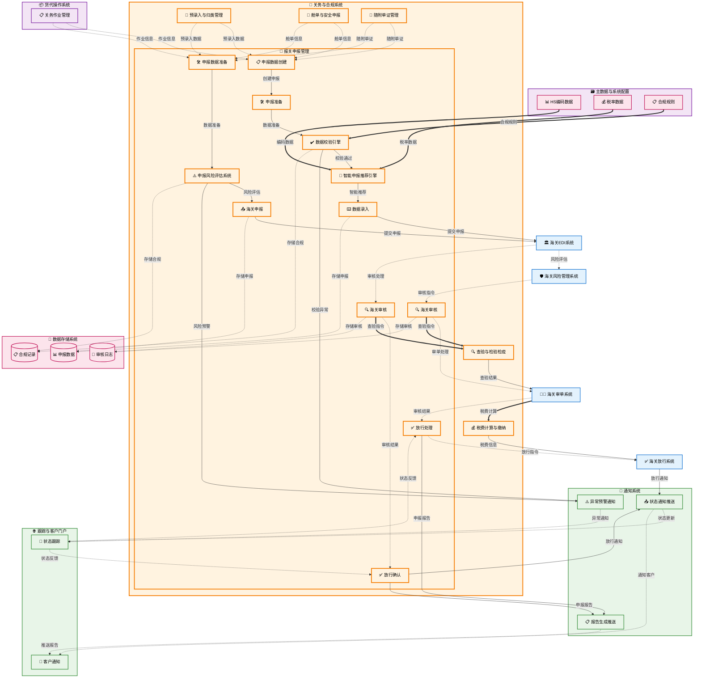

# 报关申报管理 (Customs Declaration Management)

## 💡 新手提示：报关申报管理核心概念

在开始阅读报关申报管理功能前，请先理解以下关键概念：

*   **报关申报**：向海关正式申报进出口货物信息的法定程序
*   **报关单**：海关监管货物进出境的法定单证
*   **申报要素**：海关要求申报的商品详细信息
*   **HS编码**：《商品名称及编码协调制度》的商品分类编码
*   **海关审单**：海关对申报信息的审核处理过程

### 申报生命周期
- **草稿**：申报数据准备中
- **校验中**：数据校验处理
- **待申报**：数据校验通过，准备提交
- **已申报**：向海关提交申报
- **审核中**：海关审核处理
- **已放行**：海关审核通过并放行
- **被退单**：海关拒绝申报

### 申报类型
- **进口报关**：进境货物的海关申报
- **出口报关**：出境货物的海关申报
- **转关申报**：货物在不同海关间转移的申报
- **保税申报**：保税区货物的申报
- **暂时进出境**：展览品、样品等暂时进出境申报
- **修理物品**：出境修理物品的申报
- **退运货物**：因各种原因退运货物的申报

## 功能概述

报关申报管理是关务业务流程的核心环节，负责向海关正式申报进出口货物信息，获取海关审核通过和放行许可。该模块承接舱单申报的基础数据，结合预录入的商品归类和随附单证，形成完整的报关申报数据包。

**🔍 业务价值说明**：

*   **合规申报**：确保申报信息符合海关法规要求，避免违规风险
*   **高效通关**：优化申报流程，提高通关效率和成功率
*   **数据整合**：集成多系统数据，形成完整准确的申报信息
*   **智能校验**：自动校验申报数据，减少人工错误和退单风险

**核心功能模块**：

*   **进口报关申报**：进境货物的完整申报流程
*   **出口报关申报**：出境货物的完整申报流程
*   **申报数据管理**：申报数据的校验、转换和管理
*   **海关审单处理**：海关审核结果的接收和处理
*   **申报状态跟踪**：实时跟踪申报进度和状态变化
*   **更正与撤销**：申报信息的更正和撤销处理

## 菜单结构

    报关申报管理
    ├── 进口申报列表                # 显示所有进口申报的汇总信息
    ├── 出口申报列表                # 显示所有出口申报的汇总信息
    ├── 新建进口申报                # 创建新的进口报关申报
    ├── 新建出口申报                # 创建新的出口报关申报
    ├── 申报查询                    # 多条件搜索和筛选申报记录
    ├── 申报状态跟踪                # 实时跟踪申报进度和海关处理状态
    ├── 更正申报                    # 对已申报信息进行更正
    ├── 撤销申报                    # 撤销尚未处理的申报
    ├── 数据校验规则配置            # 配置申报数据的校验规则
    └── 申报统计报表                # 申报相关的统计分析报表

## 报关申报管理数据流转图



## 页面原型设计

### 进口申报列表页面

**页面功能**：展示所有进口报关申报的汇总信息，支持多条件筛选和批量操作。

**页面布局**：
```
┌─────────────────────────────────────────────────────────────────┐
│ 报关申报管理 > 进口申报列表                                        │
├─────────────────────────────────────────────────────────────────┤
│ 🔍 筛选条件                                                      │
│ 申报编号: [_________] 提运单号: [_________] 申报状态: [下拉选择]    │
│ 申报日期: [日期选择器] 至 [日期选择器] [搜索] [重置]               │
├─────────────────────────────────────────────────────────────────┤
│ [+ 新建进口申报] [批量申报] [导出Excel] [刷新]                    │
├─────────────────────────────────────────────────────────────────┤
│ ☐ 申报编号    │提运单号   │申报状态│申报日期    │货物名称│操作      │
│ ☐ IMP2024001 │MSKU123456 │已申报  │2024-01-15  │电子产品│查看 编辑  │
│ ☐ IMP2024002 │COSCO78901 │审核中  │2024-01-16  │纺织品  │查看 编辑  │
│ ☐ IMP2024003 │OOLU234567 │已放行  │2024-01-17  │机械设备│查看 编辑  │
├─────────────────────────────────────────────────────────────────┤
│ 共 156 条记录，第 1/16 页 [上一页] [1][2][3]...[16] [下一页]      │
└─────────────────────────────────────────────────────────────────┘
```

**关键字段说明**：
- **申报编号**：系统自动生成的唯一申报标识
- **提运单号**：关联的舱单提运单号
- **申报状态**：草稿、校验中、待申报、已申报、审核中、已放行、被退单
- **申报日期**：向海关提交申报的日期
- **货物名称**：主要货物的商品名称

### 新建进口申报页面

**页面功能**：创建新的进口报关申报，包含完整的申报信息录入和校验。

**页面布局**：
```
┌─────────────────────────────────────────────────────────────────┐
│ 报关申报管理 > 新建进口申报                                        │
├─────────────────────────────────────────────────────────────────┤
│ 📋 基本信息                                                      │
│ 提运单号: [MSKU123456_____] [选择舱单] 申报类型: [进口报关▼]      │
│ 贸易方式: [一般贸易▼] 运输方式: [海运▼] 征免性质: [一般征税▼]      │
│ 启运港: [上海港_______] 入境口岸: [深圳港_______]                 │
├─────────────────────────────────────────────────────────────────┤
│ 🏢 收发货人信息                                                  │
│ 收货人: [ABC贸易有限公司___] 统一信用代码: [91440300_______]       │
│ 发货人: [XYZ TRADING CO.___] 境外企业代码: [US123456_____]        │
├─────────────────────────────────────────────────────────────────┤
│ 📦 货物信息                                                      │
│ [+ 添加货物] [从预录入导入] [批量导入]                            │
│ 序号│商品名称    │HS编码     │数量│单位│单价  │总价    │操作      │
│ 1   │笔记本电脑  │8471300000 │100 │台  │5000  │500000  │编辑 删除 │
│ 2   │手机       │8517120000 │200 │部  │3000  │600000  │编辑 删除 │
├─────────────────────────────────────────────────────────────────┤
│ 💰 费用信息                                                      │
│ 货物总价: ¥1,100,000 运费: ¥50,000 保险费: ¥10,000              │
│ 关税: ¥165,000 增值税: ¥221,000 总计: ¥1,546,000                │
├─────────────────────────────────────────────────────────────────┤
│ 📄 随附单证                                                      │
│ [+ 添加单证] 发票: ✓已上传 装箱单: ✓已上传 合同: ✓已上传          │
├─────────────────────────────────────────────────────────────────┤
│ [保存草稿] [数据校验] [提交申报] [取消]                           │
└─────────────────────────────────────────────────────────────────┘
```

### 申报查询页面

**页面功能**：提供多维度的申报记录查询和统计分析功能。

**页面布局**：
```
┌─────────────────────────────────────────────────────────────────┐
│ 报关申报管理 > 申报查询                                           │
├─────────────────────────────────────────────────────────────────┤
│ 🔍 高级查询条件                                                  │
│ 申报类型: [全部▼] 申报状态: [全部▼] 贸易方式: [全部▼]            │
│ 申报编号: [_________] 提运单号: [_________]                       │
│ 收发货人: [_________] HS编码: [_________]                         │
│ 申报日期: [2024-01-01] 至 [2024-01-31]                          │
│ 放行日期: [2024-01-01] 至 [2024-01-31]                          │
│ [查询] [重置] [保存查询条件]                                      │
├─────────────────────────────────────────────────────────────────┤
│ 📊 统计概览                                                      │
│ 总申报数: 1,256 │ 已放行: 1,089 │ 审核中: 89 │ 被退单: 78        │
│ 申报金额: ¥125,600,000 │ 税费总额: ¥18,840,000                  │
├─────────────────────────────────────────────────────────────────┤
│ 📋 查询结果                                                      │
│ [导出Excel] [导出PDF] [批量操作▼]                                │
│ 申报编号    │类型│状态  │申报日期  │放行日期  │申报金额│操作        │
│ IMP2024001 │进口│已放行│2024-01-15│2024-01-16│500,000 │查看 打印   │
│ EXP2024002 │出口│审核中│2024-01-16│-        │800,000 │查看 跟踪   │
├─────────────────────────────────────────────────────────────────┤
│ 共 156 条记录，第 1/16 页 [上一页] [1][2][3]...[16] [下一页]      │
└─────────────────────────────────────────────────────────────────┘
```

### 申报状态跟踪页面

**页面功能**：实时跟踪申报进度，展示海关处理状态和关键节点信息。

**页面布局**：
```
┌─────────────────────────────────────────────────────────────────┐
│ 报关申报管理 > 申报状态跟踪 > IMP2024001                          │
├─────────────────────────────────────────────────────────────────┤
│ 📋 申报基本信息                                                  │
│ 申报编号: IMP2024001 │ 提运单号: MSKU123456 │ 申报类型: 进口报关  │
│ 申报状态: 审核中 │ 申报日期: 2024-01-15 14:30 │ 预计放行: 1-2工作日│
├─────────────────────────────────────────────────────────────────┤
│ 🔄 处理进度                                                      │
│ ●─────●─────●─────○─────○                                      │
│ 数据校验  申报提交  海关接收  审单处理  放行完成                    │
│ ✓完成    ✓完成    ✓完成    🔄进行中   ⏳等待                      │
├─────────────────────────────────────────────────────────────────┤
│ 📝 处理记录                                                      │
│ 时间              │状态变更    │处理人员│备注                      │
│ 2024-01-15 14:30 │提交申报    │张三    │申报数据校验通过          │
│ 2024-01-15 14:35 │海关接收    │系统    │EDI报文发送成功           │
│ 2024-01-15 15:20 │开始审单    │海关    │进入人工审单环节          │
│ 2024-01-16 09:15 │补充资料要求│海关    │需补充原产地证明          │
├─────────────────────────────────────────────────────────────────┤
│ ⚠️ 待处理事项                                                    │
│ • 需补充原产地证明文件 [上传文件] [查看要求]                      │
│ • 海关查验通知 [查看详情] [预约查验]                              │
├─────────────────────────────────────────────────────────────────┤
│ [刷新状态] [打印申报单] [联系客服] [返回列表]                      │
└─────────────────────────────────────────────────────────────────┘
```

## 业务流程

### 💡 新手提示：业务流程阅读指南

以下业务流程描述了报关申报从准备到完成的完整生命周期。每个步骤都包含：

*   **业务动作**：具体要执行的操作
*   **系统交互**：涉及的系统间调用和数据传递
*   **决策点**：需要人工判断或系统自动判断的关键节点
*   **异常处理**：可能出现的问题和解决方案

### 📋 进口报关申报流程

1.  **申报数据创建**：创建进口申报记录并整合多系统数据
    > **新手说明**：这是申报流程的起点，系统会从预录入、舱单、单证等多个系统收集数据，创建完整的申报记录
    *   **🔗 系统内流转**：关务与合规（报关申报管理） → 关务与合规（预录入与归类管理/舱单与安全申报/随附单证管理） **【写入数据】**
        *   **调用方式**：RESTful API (POST /api/v1/customs/import-declarations)
        *   **调用时机**：用户点击"新建进口申报"或从关务作业自动触发申报创建时
        *   **数据操作**：
            *   **数据读取**：从关务与合规的 pre_entry_goods (预录入商品表) 表、manifest_records (舱单记录表) 表、document_checklist (单证清单表) 表读取基础数据
            *   **数据整合**：将预录入的商品归类、舱单的货物信息、单证的附件信息进行整合和校验
            *   **数据写入**：向关务与合规的 import_declarations (进口申报表) 表写入新创建的申报记录
            *   **关联建立**：在关务与合规的 declaration_relations (申报关联表) 表中建立与预录入、舱单、单证的关联关系
        *   **入参**：`{job_id, pre_entry_id, manifest_id, document_package_id, declaration_type, trade_mode}`
            *   `job_id` (作业ID): string，关联的关务作业唯一标识符
            *   `pre_entry_id` (预录入ID): string，关联的预录入记录标识符
            *   `manifest_id` (舱单ID): string，关联的舱单记录标识符
            *   `document_package_id` (单证包ID): string，关联的单证包标识符
            *   `declaration_type` (申报类型): enum (进口/出口)，申报的类型
            *   `trade_mode` (贸易方式): enum (一般贸易/保税贸易等)，贸易方式
        *   **出参**：`{declaration_id, declaration_no, data_completeness, validation_status, missing_items}`
            *   `declaration_id` (申报ID): string，系统生成的申报记录唯一标识符
            *   `declaration_no` (申报单号): string，系统生成的申报单号
            *   `data_completeness` (数据完整性): object，各项数据的完整性检查结果
            *   `validation_status` (验证状态): enum (通过/待补充/有误)，数据验证状态
            *   `missing_items` (缺失项目): array，仍需补充的数据项目清单

2.  **申报准备**：系统自动整理和校验申报所需的各项数据
    > **新手说明**：系统会自动从各个模块收集数据，确保申报信息的完整性和准确性
    *   **系统内流转**：数据整合、校验和格式化处理
    *   **数据整合流程**：
        *   **预录入数据读取**：从 `pre_entry_details` 表读取商品基础信息
            *   商品编码 (HS Code)、商品名称、规格型号
            *   数量、单位、单价、总价值
            *   原产国、制造商信息
        *   **舱单数据读取**：从 `goods_manifest` 表读取运输信息
            *   运输工具信息、航次/车次
            *   装货港/卸货港、提单号
            *   货物包装信息、毛重净重
        *   **单证数据读取**：从 `document_items` 表读取必要单证
            *   发票 (Invoice)、装箱单 (Packing List)
            *   提单 (Bill of Lading)、原产地证明
            *   质检报告、其他监管证件
        *   **贸易商数据读取**：从 `customs_jobs` 表读取委托信息
            *   进口商/出口商信息、代理报关企业
            *   贸易方式、监管方式、征免性质
        *   **数据校验规则**：
            *   商品信息完整性校验 (HS编码、价格合理性)
            *   单证齐全性校验 (必要单证是否齐备)
            *   数据一致性校验 (各系统数据是否匹配)
            *   合规性校验 (是否符合海关监管要求)
    *   **数据准备状态**：
        *   `PREPARING` - 数据整合中
        *   `VALIDATION_FAILED` - 校验失败，需要补充或修正
        *   `READY_FOR_DECLARATION` - 数据准备完成，可以申报

3.  **数据录入**：在海关系统中录入货物申报信息
    > **新手说明**：需要准确填写商品编码、价格、数量等关键信息，任何错误都可能导致申报失败
    *   **🔗 跨系统触发**：关务与合规（报关申报） → 集成与连接（海关系统） **【写入数据】**
        *   **调用方式**：EDI接口 (POST /customs/import-declaration)
        *   **调用时机**：申报数据准备完成后自动提交
        *   **数据操作**：
            *   **数据读取**：从关务与合规的 import_declarations (进口申报表) 表、goods_manifest (货物清单表) 表读取申报信息
            *   **数据写入**：向海关系统写入申报数据
            *   **数据验证**：在主数据与系统配置的 validation_rules (验证规则表) 表中执行数据验证
            *   **状态更新**：更新关务与合规的 declaration_status (申报状态表) 表中的申报状态
        *   **入参**：`{declaration_no, trader_info, goods_list, transport_info, value_info}`
            *   `declaration_no` (申报单号): string，申报单的唯一标识符
            *   `trader_info` (贸易商信息): object，进口商和代理人的详细信息
            *   `goods_list` (货物清单): array，货物的详细信息列表
            *   `transport_info` (运输信息): object，运输工具和路线信息
            *   `value_info` (价值信息): object，货物价值和税费计算信息
        *   **出参**：`{submission_id, validation_result, estimated_processing_time}`
            *   `submission_id` (提交ID): string，海关系统生成的提交标识
            *   `validation_result` (验证结果): object，数据验证的详细结果
            *   `estimated_processing_time` (预计处理时间): string，海关预计的处理时长

4.  **海关审核**：海关对申报信息进行审核和风险评估
    > **新手说明**：海关会根据风险管理要求对申报进行分类处理，可能需要查验或直接放行
    *   **🔗 外部系统交互**：关务与合规（报关申报） → 集成与连接（海关风险管理系统） **【查询数据】**
        *   **调用方式**：API接口 (GET /customs/risk-assessment)
        *   **调用时机**：申报提交后海关系统自动触发风险评估
        *   **数据操作**：
            *   **数据读取**：从关务与合规的 import_declarations (进口申报表) 表、risk_profile (风险档案表) 表读取申报和风险信息
            *   **数据查询**：向海关风险管理系统查询风险评估结果
            *   **数据写入**：向关务与合规的 risk_assessment_results (风险评估结果表) 表写入评估结果
            *   **状态更新**：更新关务与合规的 declaration_status (申报状态表) 表中的审核状态
        *   **入参**：`{submission_id, declaration_data, trader_profile, goods_classification}`
            *   `submission_id` (提交ID): string，海关系统的申报提交标识
            *   `declaration_data` (申报数据): object，完整的申报信息数据
            *   `trader_profile` (贸易商档案): object，进出口商的历史记录和信用档案
            *   `goods_classification` (货物分类): array，货物的HS编码和风险分类信息
        *   **出参**：`{risk_level, processing_channel, inspection_required, estimated_clearance_time}`
            *   `risk_level` (风险等级): enum (低风险/中风险/高风险)，海关评估的风险等级
            *   `processing_channel` (处理通道): enum (绿色通道/黄色通道/红色通道)，海关分配的处理通道
            *   `inspection_required` (是否需要查验): boolean，是否需要进行实货查验
            *   `estimated_clearance_time` (预计通关时间): string，根据风险等级预估的通关时长

5.  **放行处理**：海关审核通过后办理放行手续
    > **新手说明**：获得海关放行许可后，货物才能正式入境并提取
    *   **🔗 跨系统触发**：集成与连接（海关系统） → 关务与合规（报关申报） **【状态更新】**
        *   **调用方式**：回调接口 (POST /customs/release-notification)
        *   **调用时机**：海关完成审核并决定放行时自动回调，定时任务不断请求海关系统获取放行结果
        *   **数据操作**：
            *   **数据读取**：从海关系统接收放行通知和相关信息
            *   **数据写入**：向关务与合规的 release_records (放行记录表) 表写入放行信息
            *   **数据更新**：更新关务与合规的 declaration_status (申报状态表) 表中的放行状态
            *   **数据关联**：在关务与合规的 clearance_history (通关历史表) 表中记录完整通关过程
        *   **入参**：`{submission_id, release_decision, release_time, customs_officer, conditions}`
            *   `submission_id` (提交ID): string，对应的申报提交标识符
            *   `release_decision` (放行决定): enum (无条件放行/有条件放行/不予放行)，海关的放行决定
            *   `release_time` (放行时间): datetime，海关作出放行决定的时间
            *   `customs_officer` (海关关员): string，负责审核的海关关员信息
            *   `conditions` (放行条件): array，如有条件放行时的具体条件要求
        *   **出参**：`{status_updated, notification_sent, next_steps, clearance_complete}`
            *   `status_updated` (状态更新): boolean，申报状态是否成功更新
            *   `notification_sent` (通知发送): boolean，是否已通知相关人员和客户
            *   `next_steps` (后续步骤): array，货物提取或其他后续操作指引
            *   `clearance_complete` (通关完成): boolean，整个通关流程是否完全结束

### 📋 出口报关申报流程

1.  **申报数据准备**：整理出口货物的详细信息
    > **新手说明**：需要准确填写货物信息、价值、目的地等关键数据
    *   **🔗 系统内流转**：关务与合规（报关申报） → 关务与合规（预录入与归类管理/舱单与安全申报/随附单证管理） **【读取数据】**
        *   **调用方式**：RESTful API (GET /api/v1/customs/export-data-preparation)
        *   **调用时机**：用户点击"新建出口申报"或从关务作业自动触发申报创建时
        *   **数据操作**：
            *   **数据读取**：从关务与合规的 pre_entry_goods (预录入商品表) 表、manifest_records (舱单记录表) 表、document_checklist (单证清单表) 表读取基础数据
            *   **数据整合**：将预录入的商品归类、舱单的货物信息、单证的附件信息进行整合和校验
            *   **数据写入**：向关务与合规的 export_declarations (出口申报表) 表写入新创建的申报记录
            *   **关联建立**：在关务与合规的 declaration_relations (申报关联表) 表中建立与预录入、舱单、单证的关联关系
        *   **入参**：`{job_id, pre_entry_id, manifest_id, document_package_id, destination_country, trade_mode}`
            *   `job_id` (作业ID): string，关联的关务作业唯一标识符
            *   `pre_entry_id` (预录入ID): string，关联的预录入记录标识符
            *   `manifest_id` (舱单ID): string，关联的舱单记录标识符
            *   `document_package_id` (单证包ID): string，关联的单证包标识符
            *   `destination_country` (目的国): string，货物出口的目的国家代码
            *   `trade_mode` (贸易方式): enum (一般贸易/加工贸易等)，出口贸易方式
        *   **出参**：`{declaration_id, declaration_no, data_completeness, validation_status, missing_items}`
            *   `declaration_id` (申报ID): string，系统生成的出口申报记录唯一标识符
            *   `declaration_no` (申报单号): string，系统生成的出口申报单号
            *   `data_completeness` (数据完整性): object，各项数据的完整性检查结果
            *   `validation_status` (验证状态): enum (通过/待补充/有误)，数据验证状态
            *   `missing_items` (缺失项目): array，仍需补充的数据项目清单

2.  **海关申报**：向海关提交出口申报信息
    > **新手说明**：通过EDI系统向海关发送标准格式的申报数据
    *   **🔗 跨系统触发**：关务与合规（报关申报） → 集成与连接（海关系统） **【写入数据】**
        *   **调用方式**：EDI接口 (POST /customs/export-declaration)
        *   **调用时机**：出口申报数据准备完成后自动提交
        *   **数据操作**：
            *   **数据读取**：从关务与合规的 export_declarations (出口申报表) 表、goods_manifest (货物清单表) 表读取申报信息
            *   **数据写入**：向海关系统写入出口申报数据
            *   **数据验证**：在主数据与系统配置的 validation_rules (验证规则表) 表中执行数据验证
            *   **状态更新**：更新关务与合规的 declaration_status (申报状态表) 表中的申报状态
        *   **入参**：`{declaration_no, exporter_info, goods_list, transport_info, destination_info}`
            *   `declaration_no` (申报单号): string，出口申报单的唯一标识符
            *   `exporter_info` (出口商信息): object，出口商和代理人的详细信息
            *   `goods_list` (货物清单): array，出口货物的详细信息列表
            *   `transport_info` (运输信息): object，运输工具和路线信息
            *   `destination_info` (目的地信息): object，目的国和收货人信息
        *   **出参**：`{submission_id, validation_result, estimated_processing_time}`
            *   `submission_id` (提交ID): string，海关系统生成的提交标识
            *   `validation_result` (验证结果): object，数据验证的详细结果
            *   `estimated_processing_time` (预计处理时间): string，海关预计的处理时长

3.  **海关审核**：海关对出口申报进行审核
    > **新手说明**：海关会检查出口货物是否符合出口管制要求
    *   **🔗 外部系统交互**：关务与合规（报关申报） → 集成与连接（海关风险管理系统） **【查询数据】**
        *   **调用方式**：API接口 (GET /customs/export-risk-assessment)
        *   **调用时机**：出口申报提交后海关系统自动触发风险评估
        *   **数据操作**：
            *   **数据读取**：从关务与合规的 export_declarations (出口申报表) 表、export_control_list (出口管制清单表) 表读取申报和管制信息
            *   **数据查询**：向海关风险管理系统查询出口管制和风险评估结果
            *   **数据写入**：向关务与合规的 export_risk_assessment (出口风险评估表) 表写入评估结果
            *   **状态更新**：更新关务与合规的 declaration_status (申报状态表) 表中的审核状态
        *   **入参**：`{submission_id, export_data, destination_country, goods_classification}`
            *   `submission_id` (提交ID): string，海关系统的申报提交标识
            *   `export_data` (出口数据): object，完整的出口申报信息数据
            *   `destination_country` (目的国): string，货物出口的目的国家代码
            *   `goods_classification` (货物分类): array，货物的HS编码和出口管制分类信息
        *   **出参**：`{risk_level, control_required, license_needed, estimated_clearance_time}`
            *   `risk_level` (风险等级): enum (低风险/中风险/高风险)，海关评估的风险等级
            *   `control_required` (是否需要管制): boolean，是否涉及出口管制商品
            *   `license_needed` (是否需要许可证): boolean，是否需要出口许可证
            *   `estimated_clearance_time` (预计通关时间): string，根据风险等级预估的通关时长

4.  **放行确认**：海关审核通过并确认放行
    > **新手说明**：获得出口放行许可后，货物可以正式出境
    *   **🔗 跨系统触发**：集成与连接（海关系统） → 关务与合规（报关申报） **【状态更新】**
        *   **调用方式**：回调接口 (POST /customs/export-release)
        *   **调用时机**：海关完成出口审核并放行时自动回调
        *   **数据操作**：
            *   **数据读取**：从海关系统接收出口放行通知和相关信息
            *   **数据写入**：向关务与合规的 export_release_records (出口放行记录表) 表写入放行信息
            *   **数据更新**：更新关务与合规的 declaration_status (申报状态表) 表中的放行状态
            *   **数据关联**：在关务与合规的 export_clearance_history (出口通关历史表) 表中记录完整通关过程
        *   **入参**：`{submission_id, release_decision, release_time, customs_officer, export_conditions}`
            *   `submission_id` (提交ID): string，对应的出口申报提交标识符
            *   `release_decision` (放行决定): enum (无条件放行/有条件放行/不予放行)，海关的出口放行决定
            *   `release_time` (放行时间): datetime，海关作出放行决定的时间
            *   `customs_officer` (海关关员): string，负责审核的海关关员信息
            *   `export_conditions` (出口条件): array，如有条件放行时的具体条件要求
        *   **出参**：`{status_updated, notification_sent, export_clearance_complete, shipping_authorized}`
            *   `status_updated` (状态更新): boolean，申报状态是否成功更新
            *   `notification_sent` (通知发送): boolean，是否已通知相关人员和客户
            *   `export_clearance_complete` (出口通关完成): boolean，整个出口通关流程是否完全结束
            *   `shipping_authorized` (装运授权): boolean，货物是否已获得装运出境授权

## 核心功能扩展

### 智能申报推荐引擎

**功能描述**：基于历史申报数据和机器学习算法，为用户提供智能化的申报建议和优化方案。

**核心特性**：
- **商品归类推荐**：根据商品描述自动推荐最适合的HS编码
- **申报要素补全**：智能补全申报要素，减少人工录入工作量
- **风险预警**：提前识别可能的申报风险点，降低退单概率
- **最优路径推荐**：推荐最优的通关路径和申报策略

**技术实现**：
```python
class DeclarationRecommendationEngine:
    def __init__(self):
        self.ml_model = load_trained_model()
        self.hs_classifier = HSCodeClassifier()
        
    def recommend_hs_code(self, commodity_description):
        """基于商品描述推荐HS编码"""
        features = self.extract_features(commodity_description)
        predicted_codes = self.hs_classifier.predict(features)
        return self.rank_recommendations(predicted_codes)
        
    def predict_risk_level(self, declaration_data):
        """预测申报风险等级"""
        risk_score = self.ml_model.predict_risk(declaration_data)
        return self.categorize_risk(risk_score)
```

### 申报风险评估系统

**功能描述**：实时评估申报数据的合规性和风险等级，提供预警和建议。

**风险评估维度**：
- **价格风险**：检测申报价格是否异常
- **归类风险**：验证商品归类的准确性
- **单证风险**：检查随附单证的完整性和一致性
- **贸易商风险**：评估贸易商的信用等级和历史记录

**实现架构**：
```python
class RiskAssessmentSystem:
    def __init__(self):
        self.price_validator = PriceValidator()
        self.classification_validator = ClassificationValidator()
        self.document_validator = DocumentValidator()
        
    def assess_declaration_risk(self, declaration):
        """综合评估申报风险"""
        risks = []
        
        # 价格风险评估
        price_risk = self.price_validator.validate(declaration.goods)
        risks.append(price_risk)
        
        # 归类风险评估
        classification_risk = self.classification_validator.validate(declaration.goods)
        risks.append(classification_risk)
        
        # 单证风险评估
        document_risk = self.document_validator.validate(declaration.documents)
        risks.append(document_risk)
        
        return self.calculate_overall_risk(risks)
```

## API接口设计
<!-- 报关申报管理模块的API接口设计，包含申报的创建、查询、更新等核心功能接口 -->

### 创建进口申报接口
<!-- 用于创建新的进口申报记录的API接口，整合预录入、舱单、单证等多系统数据 -->

```json
POST /api/customs/import-declarations
{
  "job_id": "JOB-COM-20240115-001",        // 关务作业ID
  "pre_entry_id": "PRE-20240115-001",      // 预录入ID
  "manifest_id": "MSKU123456",             // 舱单ID
  "document_package_id": "PKG-20240115-001", // 单证包ID
  "declaration_type": "IMPORT",            // 申报类型：进口
  "trade_mode": "GENERAL_TRADE",           // 贸易方式：一般贸易
  "customs_port": "SHENZHEN",              // 申报海关
  "importer": {                            // 进口商信息
    "name": "ABC贸易有限公司",
    "code": "91440300123456789X",
    "address": "深圳市南山区科技园"
  },
  "exporter": {                            // 出口商信息
    "name": "XYZ TRADING CO.",
    "code": "US123456789",
    "address": "123 Main St, New York, USA"
  },
  "goods": [                               // 货物信息
    {
      "sequence": 1,
      "hs_code": "8471300000",
      "commodity": "笔记本电脑",
      "specification": "联想ThinkPad E14",
      "quantity": 100,
      "unit": "台",
      "unit_price": 5000.00,
      "total_value": 500000.00,
      "origin_country": "CN"
    }
  ],
  "transport": {                           // 运输信息
    "mode": "SEA",
    "vessel": "COSCO SHIPPING",
    "voyage": "001E",
    "port_of_loading": "SHANGHAI",
    "port_of_discharge": "SHENZHEN",
    "bl_no": "COSU123456789"
  }
}
```

### 查询申报状态接口

```json
GET /api/customs/declarations/{declaration_id}
Response:
{
  "declaration_id": "DECL-20240115-001",    // 申报ID
  "declaration_no": "DECL202401150001",     // 申报单号
  "status": "SUBMITTED",                    // 申报状态
  "customs_status": "UNDER_REVIEW",         // 海关审核状态
  "declaration_type": "IMPORT",             // 申报类型
  "importer_info": {                        // 进口商信息
    "name": "ABC贸易有限公司",
    "code": "91440300123456789X"
  },
  "goods_summary": {                        // 货物汇总
    "total_items": 3,
    "total_value": 1500000.00,
    "currency": "USD"
  },
  "timeline": [                             // 申报时间线
    {
      "stage": "declaration_created",
      "timestamp": "2024-01-15T10:00:00Z",
      "description": "申报单创建"
    },
    {
      "stage": "submitted_to_customs",
      "timestamp": "2024-01-15T14:30:00Z",
      "description": "提交海关审核"
    }
  ],
  "estimated_clearance_time": "2024-01-17T16:00:00Z", // 预计通关时间
  "risk_assessment": {                      // 风险评估结果
    "risk_level": "LOW",
    "inspection_required": false
  }
}
```

### 提交申报接口

```json
POST /api/customs/declarations/{declaration_id}/submit
{
  "submit_type": "FORMAL",                  // 提交类型：正式申报
  "declaration_channel": "EDI",             // 申报渠道
  "customs_officer": "张三",                // 申报关员
  "remarks": "正常申报，无特殊情况"          // 备注信息
}
```

### 批量申报查询接口

```json
GET /api/customs/declarations?page=1&size=20&status=SUBMITTED&date_from=2024-01-01&date_to=2024-01-31
Response:
{
  "total": 150,                             // 总记录数
  "page": 1,                                // 当前页码
  "size": 20,                               // 每页大小
  "data": [
    {
      "declaration_id": "DECL-20240115-001",
      "declaration_no": "DECL202401150001",
      "status": "SUBMITTED",
      "importer_name": "ABC贸易有限公司",
      "total_value": 500000.00,
      "created_at": "2024-01-15T10:00:00Z"
    }
  ]
}
```

## 测试用例

### 功能测试用例

| 测试场景 | 测试步骤 | 预期结果 |
|---------|---------|---------|
| 进口申报创建 | 1. 填写完整申报信息<br>2. 提交申报创建请求 | 申报创建成功，生成申报单号 |
| 申报数据验证 | 1. 提交不完整申报数据<br>2. 系统执行数据验证 | 返回验证错误信息，提示缺失字段 |
| 申报提交海关 | 1. 完成申报数据录入<br>2. 提交到海关系统 | 申报成功提交，状态更新为已提交 |
| 申报状态查询 | 1. 输入申报单号<br>2. 查询申报状态 | 返回详细申报状态和处理进度 |
| 批量申报处理 | 1. 选择多个申报单<br>2. 执行批量操作 | 批量操作成功，状态批量更新 |

### 异常处理测试

| 异常场景 | 测试方法 | 预期处理 |
|---------|---------|---------|
| 必填字段缺失 | 提交不完整申报数据 | 显示详细验证错误信息 |
| HS编码错误 | 输入无效HS编码 | 提示HS编码格式错误 |
| 海关系统异常 | 模拟海关系统不可用 | 显示系统维护提示，支持离线保存 |
| 网络超时 | 模拟网络连接超时 | 自动重试机制，超时友好提示 |
| 数据冲突 | 同时修改同一申报单 | 乐观锁机制，提示数据已被修改 |

### 性能测试用例

| 测试指标 | 测试条件 | 性能要求 |
|---------|---------|---------|
| 申报创建响应时间 | 并发50用户 | < 3秒 |
| 申报查询响应时间 | 50万申报记录 | < 2秒 |
| 批量申报处理 | 500条申报记录 | < 60秒 |
| 海关数据同步 | 1000条状态更新 | < 30秒 |
| 系统并发处理 | 100并发用户 | 系统稳定运行，无错误 |


## 系统集成

### 与舱单系统集成

**集成目的**：获取货物的基础申报信息，避免重复录入

**集成方式**：
- **数据同步**：定时同步舱单数据到申报系统
- **实时查询**：申报时实时查询舱单信息
- **状态回写**：申报状态变更时回写到舱单系统

### 与预录入系统集成

**集成目的**：获取商品归类和申报要素信息

**集成方式**：
- **数据导入**：从预录入系统导入商品信息
- **归类验证**：验证商品归类的准确性
- **要素补全**：自动补全申报要素

### 与单证系统集成

**集成目的**：获取随附单证信息，确保单证齐全

**集成方式**：
- **单证关联**：建立申报与单证的关联关系
- **完整性检查**：检查必需单证是否齐全
- **一致性验证**：验证单证信息与申报信息的一致性

### 与税费系统集成

**集成目的**：计算和管理申报相关的税费

**集成方式**：
- **税费计算**：根据申报信息计算应缴税费
- **缴费状态同步**：同步税费缴纳状态
- **放行条件检查**：检查税费缴纳是否满足放行条件

## 总结

报关申报管理模块作为关务业务的核心环节，承担着向海关正式申报进出口货物信息的重要职责。通过本模块的实施，企业能够：

### 核心价值

1. **合规保障**：确保申报信息符合海关法规要求，降低违规风险
2. **效率提升**：自动化申报流程，减少人工操作，提高通关效率
3. **数据整合**：集成多系统数据，形成完整准确的申报信息
4. **智能优化**：通过AI技术提供智能申报建议，优化申报策略

### 技术特色

1. **智能推荐**：基于机器学习的商品归类和申报要素推荐
2. **风险预警**：实时评估申报风险，提前预警潜在问题
3. **状态跟踪**：全程跟踪申报进度，实时掌握处理状态
4. **批量处理**：支持大批量申报的高效处理

### 业务价值

1. **降本增效**：减少人工成本，提高申报效率
2. **风险控制**：降低申报错误率和退单风险
3. **合规管理**：确保申报流程符合法规要求
4. **数据驱动**：基于数据分析优化申报策略

通过报关申报管理模块的建设，企业能够建立起标准化、智能化的申报体系，为货物的顺利通关提供有力保障。

## 文档版本信息

| 版本号 | 修订日期 | 修订人 | 修订内容 |
|--------|----------|--------|----------|
| v1.0 | 2024-01-15 | 张三 | 初始版本创建 |
| v1.1 | 2024-01-20 | 李四 | 增加智能推荐功能 |
| v1.2 | 2024-01-25 | 王五 | 完善API接口设计 |
| v1.3 | 2024-01-30 | 赵六 | 优化数据模型设计 |

## 相关文档链接

- [舱单与安全申报管理](./2.5%20舱单与安全申报.md)
- [预录入与归类管理](./2.3%20预录入与归类管理.md)
- [随附单证管理](./2.4%20随附单证管理.md)
- [查验与检验检疫](./2.7%20查验与检验检疫.md)
- [税费计算与缴纳](./2.8%20税费计算与缴纳.md)
- [关务作业管理](./2.1%20关务作业管理.md)
- [合规筛查管理](./2.2%20合规筛查管理.md)
- [关务费用管理](./2.9%20关务费用管理.md)