# 查验与检验检疫 (Inspection & Quarantine)

## 💡 新手提示：查验与检验检疫核心概念

在开始阅读查验与检验检疫功能前，请先理解以下关键概念：

*   **海关查验**：海关对进出口货物进行实际检查，验证申报内容的真实性
*   **检验检疫**：对进出口商品进行质量、安全、卫生等方面的检验
*   **查验通知**：海关系统发送的查验通知和要求（货代公司接收并响应）
*   **检疫证书**：证明货物符合检疫要求的官方文件
*   **查验协调**：货代公司协助海关完成查验工作的协调配合服务

### 货代公司在查验中的角色定位
- **协调配合者**：协助海关完成查验工作，不是查验的执行者
- **服务提供者**：为海关查验提供现场协调、物流配合等服务
- **信息传递者**：在海关、货主、仓库等各方之间传递查验相关信息
- **流程协调者**：协调查验时间、地点、人员等各项安排

### 查验状态生命周期（货代视角）
- **通知接收**：收到海关查验通知，开始协调配合工作
- **协调准备**：安排查验时间、地点、人员等协调工作
- **现场配合**：在查验现场提供协调配合服务
- **配合完成**：协调配合工作完成，等待海关查验结果
- **结果跟进**：跟进海关查验结果，协助后续处理

### 查验类型（货代协调配合）
- **开箱查验协调**：协助海关进行开箱检查的现场协调
- **外形查验配合**：配合海关进行货物外观检查
- **抽样查验协助**：协助海关进行样品抽取和送检
- **机检查验协调**：协调货物进行X光机等设备检查
- **化验查验配合**：配合海关进行样品化学分析
- **动植物检疫协调**：协调动植物产品的检疫工作

## 功能概述

查验与检验检疫是关务与合规系统的重要功能，负责协调和配合海关查验、商检查验等各类检查工作。系统支持查验通知接收、协调配合管理、现场服务记录、检验检疫协助等功能，确保货代公司能够有效配合海关完成查验工作。

**🔍 业务价值说明**：

*   **协调配合**：为海关查验提供专业的协调配合服务
*   **效率提升**：优化协调流程，提高查验配合效率
*   **服务质量**：确保协调配合服务的专业性和及时性
*   **信息管理**：统一管理查验协调过程中的各类信息

**核心功能模块**：

*   **查验通知管理**：接收和响应各类查验通知
*   **协调配合服务**：提供现场查验协调配合服务
*   **检验检疫协助**：协助申请各类检验检疫服务
*   **协调记录管理**：管理查验协调配合记录

## 菜单结构

    查验与检验检疫
    ├── 查验协调工作台              # 查验协调任务的统一管理
    ├── 查验通知中心                # 查验通知接收和响应
    ├── 现场协调管理                # 现场查验协调配合管理
    ├── 检验检疫协助                # 检验检疫业务协助
    ├── 协调记录中心                # 各类协调配合记录管理
    ├── 查验结果跟进                # 查验结果跟进和反馈
    ├── 协调异常处理                # 协调配合异常情况处理
    ├── 查验预约协调                # 查验时间预约协调安排
    └── 协调服务分析                # 协调配合服务数据分析

## 查验与检验检疫数据流转图

```mermaid
graph TB
    %% 外部系统
    CustomsSystem[🏛️ 海关系统]
    CIQSystem[🔬 检验检疫系统]
    CustomsOfficer[👮 海关查验员]
    
    %% 上游系统
    subgraph FreightOps[📦 货代操作系统]
        OrderMgmt[📋 订单管理]
        DeclarationMgmt[📝 报关申报管理]
    end
    
    subgraph WarehouseSystem[🏭 仓储管理系统]
        WarehouseSchedule[📅 仓库排期]
        SiteManagement[🏢 现场管理]
    end
    
    subgraph CustomerSystem[👥 跟踪与客户门户系统]
        CustomerPortal[🌐 客户门户]
        CustomerNotify[📧 客户通知]
    end
    
    %% 核心系统 - 查验与检验检疫
    subgraph CustomsCompliance[🛃 关务与合规系统]
        subgraph InspectionMgmt[🔍 查验与检验检疫管理]
            NotificationReceiver[📨 查验通知接收]
            CoordinationTask[📋 协调任务管理]
            StaffAssignment[👨‍💼 协调人员分派]
            ResponseConfirm[✅ 协调响应确认]
            
            TimeCoordination[⏰ 查验时间协调]
            CustomerCoordination[📞 货主通知协调]
            SitePreparation[🛠️ 现场服务准备]
            OnSiteCoordination[🤝 现场协调配合]
            
            DocumentAssist[📄 单证协助提供]
            ProcessAssist[📝 过程协助记录]
            ExceptionCoordination[⚠️ 异常协调响应]
            ResultCoordination[📊 结果协调跟进]
            
            CIQApplication[🧪 检疫申请协助]
            CertificateManagement[📜 证书管理协助]
            CIQCoordination[🔬 检疫协调配合]
        end
    end
    
    %% 下游系统
    subgraph NotificationSys[🔔 通知系统]
        AlertNotification[⚠️ 异常预警通知]
        StatusNotification[📤 状态通知推送]
        ReportGeneration[📋 报告生成推送]
    end
    
    subgraph DataStorage[💾 数据存储系统]
        CoordinationData[(📊 协调任务数据)]
        CoordinationLog[(📝 协调配合日志)]
        AssistanceRecord[(🤝 协助服务记录)]
        CertificateData[(📜 证书管理数据)]
        ExceptionData[(⚠️ 异常协调数据)]
    end
    
    %% 查验通知接收与响应流程
    CustomsSystem -.->|查验通知| NotificationReceiver
    NotificationReceiver -->|创建任务| CoordinationTask
    CoordinationTask -->|分派人员| StaffAssignment
    StaffAssignment -->|确认响应| ResponseConfirm
    ResponseConfirm -.->|响应确认| CustomsSystem
    
    %% 查验协调配合流程
    CoordinationTask ==>|时间协调| TimeCoordination
    TimeCoordination -.->|查询排期| WarehouseSchedule
    WarehouseSchedule -.->|返回时间| TimeCoordination
    
    TimeCoordination -->|通知货主| CustomerCoordination
    CustomerCoordination -.->|发送通知| CustomerNotify
    CustomerNotify -.->|通知客户| CustomerPortal
    
    %% 现场协调配合流程
    CoordinationTask ==>|现场准备| SitePreparation
    SitePreparation -.->|协调仓库| SiteManagement
    SitePreparation -->|现场配合| OnSiteCoordination
    CustomsOfficer -.->|查验执行| OnSiteCoordination
    OnSiteCoordination -->|协助记录| ProcessAssist
    
    %% 协调配合支持服务流程
    OnSiteCoordination -->|提供单证| DocumentAssist
    DocumentAssist -->|协助核对| ProcessAssist
    ProcessAssist -->|异常响应| ExceptionCoordination
    ExceptionCoordination -->|协调处理| ResultCoordination
    
    %% 检验检疫协助流程
    CoordinationTask ==>|检疫申请| CIQApplication
    CIQApplication -.->|提交申请| CIQSystem
    CIQSystem -.->|签发证书| CertificateManagement
    CertificateManagement -->|检疫配合| CIQCoordination
    
    %% 结果跟进与反馈流程
    ResultCoordination -->|跟进结果| StatusNotification
    CIQCoordination -->|检疫结果| StatusNotification
    StatusNotification -.->|通知客户| CustomerPortal
    
    %% 异常处理流程
    ExceptionCoordination -->|异常预警| AlertNotification
    AlertNotification -.->|预警通知| CustomerPortal
    
    %% 报告生成流程
    ResultCoordination -->|生成报告| ReportGeneration
    CIQCoordination -->|生成报告| ReportGeneration
    
    %% 数据存储流程
    CoordinationTask -.->|存储任务| CoordinationData
    OnSiteCoordination -.->|存储日志| CoordinationLog
    ProcessAssist -.->|存储记录| AssistanceRecord
    CertificateManagement -.->|存储证书| CertificateData
    ExceptionCoordination -.->|存储异常| ExceptionData
    
    %% 上游数据输入
    OrderMgmt -.->|订单信息| CoordinationTask
    DeclarationMgmt -.->|申报信息| CoordinationTask
    
    %% 样式定义
    classDef external fill:#e3f2fd,stroke:#1976d2,stroke-width:2px,color:#000
    classDef upstream fill:#f3e5f5,stroke:#7b1fa2,stroke-width:2px,color:#000
    classDef core fill:#fff3e0,stroke:#f57c00,stroke-width:3px,color:#000
    classDef downstream fill:#e8f5e8,stroke:#388e3c,stroke-width:2px,color:#000
    classDef storage fill:#fce4ec,stroke:#c2185b,stroke-width:2px,color:#000
    
    class CustomsSystem,CIQSystem,CustomsOfficer external
    class FreightOps,OrderMgmt,DeclarationMgmt,WarehouseSystem,CustomerSystem upstream
    class CustomsCompliance,InspectionMgmt,NotificationReceiver,CoordinationTask,StaffAssignment,ResponseConfirm,TimeCoordination,CustomerCoordination,SitePreparation,OnSiteCoordination,DocumentAssist,ProcessAssist,ExceptionCoordination,ResultCoordination,CIQApplication,CertificateManagement,CIQCoordination core
    class NotificationSys,AlertNotification,StatusNotification,ReportGeneration downstream
    class DataStorage,CoordinationData,CoordinationLog,AssistanceRecord,CertificateData,ExceptionData storage
```



## 页面原型设计

### 查验工作台页面

    +----------------------------------------------------------+
    |  查验与检验检疫 > 查验工作台                [批量处理] [导出] [刷新] |
    +----------------------------------------------------------+
    | 任务筛选：                                                  |
    | 报关单号：[________] 查验类型：[全部▼] 状态：[全部▼]        |
    | 查验日期：[开始日期] 至 [结束日期] 协调人员：[全部▼]          |
    | 货物类型：[全部▼] 紧急程度：[全部▼]        [搜索] [重置]    |
    +----------------------------------------------------------+
    | 报关单号     | 查验类型 | 货物名称    | 查验状态 | 预约时间    | 协调人员 | 操作 |
    |-------------|---------|-----------|---------|-----------|-------|------|
    | DEC-001     | 开箱查验 | 电子设备   | 待查验   | 10-01 14:00| 张三   | [查验][预约] |
    | DEC-002     | 机检查验 | 纺织品     | 查验中   | 10-01 10:00| 李四   | [记录][查看] |
    | DEC-003     | 抽样查验 | 化工原料   | 查验完成 | 09-30 16:00| 王五   | [结果][报告] |
    +----------------------------------------------------------+
    | 今日查验概览：                                              |
    | 待查验：15 | 查验中：8 | 已完成：25 | 异常：3 | 通过率：92% |
    | 平均查验时间：2.5小时 | 当日查验能力：50票 | 剩余能力：19票 |
    +----------------------------------------------------------+
    | 重要提醒：                                                 |
    | • DEC-004 货物需要进行动植物检疫，请联系检疫部门           |
    | • DEC-005 查验发现异常，已转入异常处理流程                 |
    | • 本周查验预约已满，新任务将安排到下周                     |
    +----------------------------------------------------------+
    | 查验进度跟踪：                                             |
    | 9:00-10:00: 3票完成 | 10:00-11:00: 2票进行中             |
    | 11:00-12:00: 4票预约 | 14:00-15:00: 5票预约              |
    +----------------------------------------------------------+
    | 共 156 条记录，第 1/16 页     [首页][上页][下页][末页]       |
    +----------------------------------------------------------+

### 现场查验管理页面

    +----------------------------------------------------------+
    |  查验与检验检疫 > 现场查验管理 > DEC-20231001-001           [保存] [提交] |
    +----------------------------------------------------------+
    | 基本信息：                                                 |
    | 报关单号：DEC-20231001-001    查验类型：开箱查验           |
    | 货物名称：电子测量设备        协调人员：张三                  |
    | 查验地点：上海外高桥保税区    查验时间：2023-10-01 14:00    |
    | 货主代表：李经理 (138****5678) 仓库代表：王主管            |
    +----------------------------------------------------------+
    | 查验要求：                                                 |
    | 查验指令：[查验货物品名、规格、数量是否与申报一致]          |
    | 重点关注：[检查设备型号、技术参数、原产地标识]              |
    | 特殊要求：[需要拍照记录设备铭牌和包装标识]                  |
    +----------------------------------------------------------+
    | 货物信息：                                                 |
    | 申报品名：电子测量设备        实际品名：[电子测量设备____]   |
    | 申报数量：10台               实际数量：[10_]台              |
    | 申报重量：500KG              实际重量：[498_]KG             |
    | 申报价值：USD 10,000         包装情况：[纸箱包装，完好____] |
    +----------------------------------------------------------+
    | 查验记录：                                                 |
    | 开始时间：[14:00] 结束时间：[15:30]                        |
    | 查验过程：                                                 |
    | [14:00 开箱检查，包装完好无损                              |
    |  14:15 核对设备型号：MT-2000A，与申报一致                  |
    |  14:30 检查技术参数，符合申报要求                          |
    |  14:45 核对数量，实际10台，与申报一致                      |
    |  15:00 检查原产地标识：Made in USA                         |
    |  15:15 拍照记录设备铭牌和包装                              |
    |  15:30 查验完成，无异常发现_________________________]      |
    +----------------------------------------------------------+
    | 查验结果：                                                 |
    | 查验结论：(*) 与申报相符 ( ) 与申报不符 ( ) 需要进一步查验  |
    | 异常情况：[无_________________________________]            |
    | 处理建议：[建议正常放行_______________________]            |
    +----------------------------------------------------------+
    | 附件材料：                                                 |
    | [+] 上传查验照片 (已上传5张)                               |
    | [+] 上传相关文件                                           |
    | 查验员签名：[张三] 时间：[2023-10-01 15:30]                |
    |                                          [保存] [提交结果] |
    +----------------------------------------------------------+
    
    > **业务说明**：此处的"查验员签名"是指海关查验员的签名确认，货代协调人员张三负责现场配合和记录整理工作。

### 检验检疫申请页面

    +----------------------------------------------------------+
    |  查验与检验检疫 > 检验检疫申请                  [新建申请] [批量申请] |
    +----------------------------------------------------------+
    | 申请筛选：                                                 |
    | 申请单号：[________] 检疫类型：[全部▼] 状态：[全部▼]        |
    | 申请日期：[开始日期] 至 [结束日期]              [搜索] [重置] |
    +----------------------------------------------------------+
    | 申请单号     | 检疫类型   | 货物名称  | 申请状态 | 申请日期   | 操作   |
    |-------------|-----------|----------|---------|-----------|--------|
    | CIQ-001     | 动植物检疫 | 木制品    | 已受理   | 2023-10-01| [查看] |
    | CIQ-002     | 食品检验   | 进口食品  | 检验中   | 2023-10-02| [跟踪] |
    +----------------------------------------------------------+
    | 新建检验检疫申请：                                          |
    | 报关单号：[DEC-20231001-003_] [选择报关单]                 |
    | 检疫类型：[动植物检疫▼]                                    |
    | 货物名称：[木制家具_________________]                      |
    | 货物数量：[100_]件    重量：[2000_]KG                     |
    | 原产国：[马来西亚▼]   生产企业：[ABC木业公司_______]        |
    +----------------------------------------------------------+
    | 检疫要求：                                                 |
    | 检疫项目：[☑] 有害生物检疫 [☑] 木材处理证明 [ ] 其他       |
    | 特殊要求：[需要检查是否经过熏蒸处理_______________]         |
    | 检疫标准：[按照中国进境木质包装检疫要求执行_______]         |
    +----------------------------------------------------------+
    | 相关证书：                                                 |
    | 植物检疫证书：[已上传] phyto_certificate.pdf              |
    | 熏蒸证书：[已上传] fumigation_certificate.pdf             |
    | 原产地证书：[已上传] origin_certificate.pdf               |
    +----------------------------------------------------------+
    | 申请信息：                                                 |
    | 申请人：[李经理] 联系电话：[138****5678]                   |
    | 申请日期：[2023-10-01] 期望检疫日期：[2023-10-03]          |
    | 检疫地点：[上海外高桥保税区A仓库]                          |
    |                                          [提交申请]       |
    +----------------------------------------------------------+

### 证书管理中心页面

    +----------------------------------------------------------+
    |  查验与检验检疫 > 证书管理中心                  [上传证书] [批量下载] |
    +----------------------------------------------------------+
    | 证书筛选：                                                 |
    | 证书编号：[________] 证书类型：[全部▼] 状态：[全部▼]        |
    | 签发日期：[开始日期] 至 [结束日期] 有效期：[全部▼]          |
    | 报关单号：[________]                        [搜索] [重置]  |
    +----------------------------------------------------------+
    | 证书编号     | 证书类型   | 报关单号  | 签发日期   | 有效期至   | 状态 | 操作 |
    |-------------|-----------|----------|-----------|-----------|------|------|
    | PHY-001     | 植物检疫证 | DEC-001  | 2023-09-15| 2023-12-15| 有效 | [查看][下载] |
    | FUM-002     | 熏蒸证书   | DEC-001  | 2023-09-20| 2024-09-20| 有效 | [查看][下载] |
    | ORG-003     | 原产地证   | DEC-002  | 2023-09-25| 2023-12-25| 有效 | [查看][下载] |
    +----------------------------------------------------------+
    | 证书详情 - PHY-001：                                       |
    | 证书类型：植物检疫证书                                     |
    | 签发机构：马来西亚农业部植物检疫局                         |
    | 签发日期：2023-09-15    有效期至：2023-12-15               |
    | 货物描述：木制家具，经过熏蒸处理                           |
    | 检疫结果：未发现有害生物，符合进口要求                     |
    +----------------------------------------------------------+
    | 证书验证：                                                 |
    | 验证状态：[✓] 已验证    验证时间：2023-10-01 10:30         |
    | 验证结果：证书真实有效，可以正常使用                       |
    | 验证机构：中国检验检疫科学研究院                           |
    +----------------------------------------------------------+
    | 使用记录：                                                 |
    | 使用日期     | 使用场景     | 使用人员 | 备注              |
    |-------------|-------------|---------|-------------------|
    | 2023-10-01  | 报关申报     | 张三     | 用于DEC-001报关   |
    | 2023-10-01  | 查验核对     | 李四     | 现场查验时核对    |
    +----------------------------------------------------------+
    | 证书文件：[下载原件] [下载副本] [打印证书]                  |
    +----------------------------------------------------------+

## 业务流程

### 💡 新手提示：业务流程阅读指南

本章节详细描述了货代公司在查验与检验检疫中的协调配合流程。需要明确的是：
- **海关查验**：由海关查验员执行，货代公司不参与查验决策和执行
- **货代职责**：协调配合、现场服务、信息传递、资源准备
- **系统功能**：支持货代公司内部的协调管理工作
- **业务边界**：严格区分海关职责和货代公司职责

> **💡 重要说明**：货代公司是查验工作的协调配合方，不是查验的组织者或执行者。系统设计应体现这一业务定位。

### 查验通知接收与响应流程

1.  **查验通知接收**：系统接收海关查验通知
    > **新手说明**：海关决定对货物进行查验时，会向货代公司发送查验通知。货代公司需要及时接收并响应这些通知，安排相应的协调配合工作。
    *   **🔗 跨系统触发**：关务与合规（查验与检验检疫） → 集成与连接（海关系统） **【读取数据】**
        *   **调用方式**：RESTful API (GET /api/customs/inspection/notifications)
        *   **调用时机**：系统定时轮询或接收推送消息时触发
        *   **数据操作**：
            *   **数据读取**：从集成与连接（海关系统）的 inspection_notifications (查验通知表) 表读取新的查验通知
            *   **数据写入**：向关务与合规的 inspection_coordination_tasks (查验协调任务表) 表写入协调任务记录
            *   **数据解析**：解析查验通知中的要求和时限信息
            *   **数据验证**：验证通知完整性和有效性
        *   **入参**：`{notification_id, inspection_type, urgency_level, time_limit}`
            *   `notification_id` (查验通知ID): string，海关系统生成的唯一查验通知标识
            *   `inspection_type` (查验类型): enum (开箱查验/机检查验/抽检查验)，海关要求的查验方式
            *   `urgency_level` (紧急程度): enum (普通/紧急/特急)，查验优先级
            *   `time_limit` (响应时限): datetime，要求货代公司响应的截止时间
        *   **出参**：`{task_created, task_id, response_status}`
            *   `task_created` (任务创建状态): boolean，协调任务是否成功创建
            *   `task_id` (任务ID): string，系统生成的协调任务唯一标识
            *   `response_status` (响应状态): enum (已接收/处理中/已响应)，通知处理结果

2.  **查验要求分析**：分析查验通知中的具体要求
    > **新手说明**：货代公司需要分析海关查验通知，了解查验类型、商品信息、特殊要求等，为后续的协调配合工作做准备。
    *   **🔗 跨系统触发**：关务与合规（查验与检验检疫） → 主数据与系统配置 **【读取数据】**
        *   **调用方式**：RESTful API (GET /api/goods/info/{hscode})
        *   **调用时机**：接收到查验通知后立即触发商品信息查询
        *   **数据操作**：
            *   **数据读取**：从主数据与系统配置的 goods_info (商品信息表) 表读取商品详细信息
            *   **数据查询**：查询商品的特殊要求、注意事项等
            *   **数据匹配**：匹配查验要求与货代公司的服务能力
            *   **数据整合**：整合信息形成协调配合方案
        *   **入参**：`{inspection_requirements, goods_category, hs_code, declaration_info}`
            *   `inspection_requirements` (查验要求): array，海关指定的具体查验项目列表
            *   `goods_category` (商品类别): string，货物的分类代码和描述
            *   `hs_code` (商品编码): string，海关商品编码
            *   `declaration_info` (申报信息): object，报关单中的商品申报详情
        *   **出参**：`{analysis_result, service_requirements, coordination_plan}`
            *   `analysis_result` (分析结果): object，结构化的查验要求分析
            *   `service_requirements` (服务需求): object，货代公司需要提供的协调配合服务
            *   `coordination_plan` (协调方案): object，推荐的协调配合方法和重点关注事项

3.  **查验协调人员分派**：分派货代公司内部人员协调配合查验工作
    > **新手说明**：海关查验由海关查验员执行，货代公司需要分派内部协调人员到现场配合查验工作。系统会根据人员的业务熟悉程度、当前工作负荷、地理位置等因素，智能分派最合适的协调人员。确保查验配合工作的专业性和效率。
    *   **🔗 跨系统触发**：关务与合规（查验与检验检疫） → 员工管理 **【读取数据】**
        *   **调用方式**：RESTful API (GET /api/staff/coordinators/available)
        *   **调用时机**：查验要求解析完成后触发协调人员分派
        *   **数据操作**：
            *   **数据读取**：从员工管理的 employees (员工表) 表读取可用协调人员信息
            *   **数据计算**：计算协调人员当前工作负荷和业务匹配度
            *   **数据更新**：更新协调人员的任务分配状态
            *   **数据记录**：记录分派决策和分派时间
        *   **入参**：`{business_expertise_required, location, urgency_level, workload_threshold}`
            *   `business_expertise_required` (业务专长要求): array，查验协调需要的业务知识和经验
            *   `location` (查验地点): string，查验执行的地理位置
            *   `urgency_level` (紧急程度): enum (普通/紧急/特急)，任务优先级
            *   `workload_threshold` (负荷阈值): number，协调人员可承担的最大任务数量
        *   **出参**：`{assigned_coordinator, assignment_time, backup_coordinators}`
            *   `assigned_coordinator` (分派协调人员): object，被分派的协调人员详细信息
            *   `assignment_time` (分派时间): datetime，任务分派的时间戳
            *   `backup_coordinators` (备选协调人员): array，备选协调人员列表

4.  **协调响应确认**：向海关确认协调配合安排
    > **新手说明**：货代公司完成内部协调人员分派后，需要向海关确认协调配合安排，包括协调人员信息、联系方式、预计到达时间等。
    *   **🔗 跨系统触发**：关务与合规（查验与检验检疫） → 集成与连接（海关系统） **【写入数据】**
        *   **调用方式**：RESTful API (POST /api/customs/inspection/coordination-response)
        *   **调用时机**：协调人员分派完成后立即触发响应确认
        *   **数据操作**：
            *   **数据发送**：向海关系统发送协调配合确认信息
            *   **数据记录**：记录响应发送状态和时间
            *   **数据跟踪**：跟踪海关系统的确认回复
            *   **数据更新**：更新协调任务的状态
        *   **入参**：`{notification_id, coordinator_info, estimated_arrival, contact_details, special_notes}`
            *   `notification_id` (查验通知ID): string，对应的海关查验通知标识
            *   `coordinator_info` (协调人员信息): object，分派的协调人员详细信息
            *   `estimated_arrival` (预计到达时间): datetime，协调人员预计到达查验现场的时间
            *   `contact_details` (联系方式): object，协调人员的联系电话和紧急联系方式
            *   `special_notes` (特殊说明): string，需要向海关说明的特殊情况或要求
        *   **出参**：`{response_sent, confirmation_received, coordination_status}`
            *   `response_sent` (响应发送状态): boolean，协调配合确认是否成功发送
            *   `confirmation_received` (确认接收状态): boolean，海关是否确认收到响应
            *   `coordination_status` (协调状态): enum (已确认/待确认/需要调整)，协调配合状态

### 查验协调配合流程

1.  **查验时间协调**：协调各方查验时间安排
    > **新手说明**：货代公司作为协调方，需要在海关查验员、仓库作业时间、货主代表等各方之间协调查验时间。注意：货代公司不能决定查验时间，只能协调配合。
    *   **🔗 跨系统触发**：关务与合规（查验与检验检疫） → 仓储管理 **【读取数据】**
        *   **调用方式**：RESTful API (GET /api/warehouse/available-slots)
        *   **调用时机**：收到海关查验时间安排后触发协调工作
        *   **数据操作**：
            *   **数据读取**：从仓储管理的 warehouse_schedule (仓库排班表) 表读取可用时间段
            *   **数据查询**：查询仓库作业计划和设备使用情况
            *   **数据协调**：协调仓库时间与海关查验时间的匹配
            *   **数据反馈**：向海关反馈协调结果和建议
        *   **入参**：`{warehouse_id, customs_preferred_time, duration_required, inspection_type}`
            *   `warehouse_id` (仓库ID): string，查验执行的仓库标识
            *   `customs_preferred_time` (海关首选时间): datetime，海关查验员的首选查验时间
            *   `duration_required` (所需时长): number，预计查验所需时间（小时）
            *   `inspection_type` (查验类型): enum (开箱查验/机检查验/抽检查验)，查验方式
        *   **出参**：`{coordination_result, alternative_slots, feedback_to_customs}`
            *   `coordination_result` (协调结果): boolean，时间协调是否成功
            *   `alternative_slots` (备选时段): array，如果首选时间不可用的备选方案
            *   `feedback_to_customs` (反馈信息): object，向海关反馈的协调情况和建议

2.  **货主通知协调**：协调货主代表参与查验
    > **新手说明**：根据海关要求，某些查验需要货主代表在场。货代公司负责通知货主并协调其参与安排。
    *   **🔗 跨系统触发**：关务与合规（查验与检验检疫） → 客户关系管理 **【读取数据】**
        *   **调用方式**：RESTful API (GET /api/customer/contact-info/{customer_id})
        *   **调用时机**：海关确定查验时间后触发货主通知协调
        *   **数据操作**：
            *   **数据读取**：从客户关系管理的 customer_contacts (客户联系人表) 表读取货主联系信息
            *   **数据发送**：发送查验通知和参与要求
            *   **数据跟踪**：跟踪货主回复和确认状态
            *   **数据协调**：协调货主时间与查验安排的匹配
        *   **入参**：`{customer_id, inspection_schedule, participation_required, contact_preferences}`
            *   `customer_id` (客户ID): string，货主的客户标识
            *   `inspection_schedule` (查验安排): object，确定的查验时间、地点等信息
            *   `participation_required` (参与要求): boolean，是否要求货主代表必须在场
            *   `contact_preferences` (联系偏好): object，客户的通知方式偏好
        *   **出参**：`{notification_sent, customer_response, participation_confirmed}`
            *   `notification_sent` (通知发送状态): boolean，通知是否成功发送给货主
            *   `customer_response` (客户回复): object，货主的回复内容和确认状态
            *   `participation_confirmed` (参与确认): boolean，货主代表是否确认参与查验

3.  **现场服务准备**：准备查验现场所需的协调配合服务
    > **新手说明**：货代公司需要为查验现场提供必要的协调配合服务，包括联系仓库、准备货物、安排人员等，但不包括查验设备的提供。
    *   **🔗 跨系统触发**：关务与合规（查验与检验检疫） → 仓储管理 **【写入数据】**
        *   **调用方式**：RESTful API (POST /api/warehouse/inspection-support-request)
        *   **调用时机**：查验时间确认后触发现场服务准备
        *   **数据操作**：
            *   **数据发送**：向仓库发送查验协调配合请求
            *   **数据协调**：协调货物准备和现场安排
            *   **数据确认**：确认仓库的配合安排
            *   **数据记录**：记录协调配合的具体安排
        *   **入参**：`{inspection_schedule, goods_location, support_requirements, coordinator_info}`
            *   `inspection_schedule` (查验安排): object，确定的查验时间和地点信息
            *   `goods_location` (货物位置): object，待查验货物在仓库中的具体位置
            *   `support_requirements` (协调配合要求): array，查验现场需要的协调配合服务
            *   `coordinator_info` (协调人员信息): object，负责现场协调的人员信息
        *   **出参**：`{support_confirmed, preparation_status, contact_arrangements}`
            *   `support_confirmed` (协调配合确认): boolean，仓库是否确认提供协调配合
            *   `preparation_status` (准备状态): object，各项准备工作的完成状态
            *   `contact_arrangements` (联系安排): object，现场协调的联系方式和责任人

4.  **查验现场协调**：在查验现场提供协调配合服务
    > **新手说明**：查验执行时，货代协调人员需要在现场协助海关查验员，提供必要的协调配合服务，但不参与查验决策。
    *   **系统内流转**：现场协调记录管理
        *   **调用方式**：内部API (POST /api/inspection/coordination-log)
        *   **调用时机**：查验开始时记录现场协调活动
        *   **数据操作**：
            *   **数据写入**：将现场协调配合过程写入关务与合规的 inspection_coordination_logs (查验协调日志表) 表
            *   **数据更新**：更新关务与合规的 inspection_tasks (查验任务表) 表中的协调状态字段
            *   **数据记录**：记录协调人员现场活动和重要备注信息
        *   **入参**：`{coordination_task_id, on_site_activities, coordination_notes, coordinator_info}`
            *   `coordination_task_id` (协调任务ID): string，对应的协调任务标识
            *   `on_site_activities` (现场活动): array，协调人员在现场的具体活动记录
            *   `coordination_notes` (协调备注): string，协调过程中的重要信息和备注
            *   `coordinator_info` (协调人员信息): object，现场协调人员的基本信息
        *   **出参**：`{log_saved, coordination_status, activity_count}`
            *   `log_saved` (日志保存状态): boolean，协调日志是否成功保存
            *   `coordination_status` (协调状态): enum (进行中/已完成/需要支持)，当前协调状态
            *   `activity_count` (活动记录数): number，已记录的协调活动数量

### 查验结果跟进流程

1.  **协调配合货物信息核对**：协助海关查验员核对货物信息
    > **新手说明**：货代协调人员需要协助海关查验员核对货物的基本信息和单证，提供必要的文件和说明，但不参与核对决策。
    *   **🔗 跨系统触发**：关务与合规（查验与检验检疫） → 关务与合规（报关申报管理） **【读取数据】**
        *   **调用方式**：RESTful API (GET /api/declaration/{id}/goods)
        *   **调用时机**：查验开始前触发货物信息协调配合
        *   **数据操作**：
            *   **数据读取**：从关务与合规（报关申报管理）的 declaration_goods (申报货物表) 表读取申报信息
            *   **数据提供**：向海关查验员提供申报信息和相关单证
            *   **数据协调**：协调货物信息的核对过程
            *   **数据记录**：记录协调配合的过程和内容
        *   **入参**：`{declaration_no, coordination_task_id, support_level, document_access}`
            *   `declaration_no` (申报编号): string，海关申报单编号
            *   `coordination_task_id` (协调任务ID): string，对应的协调任务标识
            *   `support_level` (协调配合级别): enum (基础协调/详细协调/全面协调)，协调深度
            *   `document_access` (单证获取权限): object，协调人员可获取的单证范围
        *   **出参**：`{coordination_status, documents_provided, support_notes}`
            *   `coordination_status` (协调状态): enum (协调中/已完成/需要支持)，协调配合状态
            *   `documents_provided` (提供单证): array，已提供给海关的单证列表
            *   `support_notes` (协调备注): string，协调过程中的重要信息记录

2.  **现场协调配合查验执行**：在现场协助海关查验员执行查验
    > **新手说明**：货代协调人员需要在查验现场协助海关查验员，提供必要的协调配合服务，包括货物搬运、现场安排等，但不参与查验决策和执行。
    *   **系统内流转**：现场协调记录管理
        *   **调用方式**：RESTful API (POST /api/inspection/on-site-coordination)
        *   **调用时机**：海关查验员开始查验时记录现场协调活动
        *   **数据操作**：
            *   **数据记录**：记录现场协调配合的具体活动到关务与合规系统
            *   **数据更新**：更新协调任务的执行状态
            *   **数据存档**：存档现场协调的相关信息
        *   **入参**：`{coordination_activities, site_arrangements, support_provided}`
            *   `coordination_activities` (协调活动): array，现场协调的具体活动记录
            *   `site_arrangements` (现场安排): object，协调的现场布置和安排
            *   `support_provided` (提供协调配合): array，向海关查验员提供的协调配合服务
        *   **出参**：`{coordination_record_id, record_status, activity_count}`
            *   `coordination_record_id` (协调记录ID): string，现场协调记录的唯一标识符
            *   `record_status` (记录状态): enum (记录中/已完成)，记录状态
            *   `activity_count` (活动数量): integer，记录的协调活动数量

3.  **协调配合查验过程记录**：协助记录查验过程和海关查验员的发现
    > **新手说明**：货代协调人员需要协助海关查验员记录查验过程，提供必要的记录支持，但记录内容和结论由海关查验员决定。
    *   **系统内流转**：协助记录活动管理
        *   **调用方式**：内部API (POST /api/inspection/assistance-record)
        *   **调用时机**：查验过程中提供协助记录支持
        *   **数据操作**：
            *   **协助活动记录**：记录货代公司提供的协助记录服务
            *   **支持服务归档**：归档提供的技术和文档支持服务
            *   **协助状态跟踪**：跟踪协助记录工作的进展状态
            *   **服务质量评估**：评估协助记录服务的质量和效果
        *   **入参**：`{assistance_activities, support_services, coordination_efforts, service_quality}`
            *   `assistance_activities` (协助活动): array，货代公司提供的协助记录活动
            *   `support_services` (支持服务): object，提供的技术和文档支持服务
            *   `coordination_efforts` (协调工作): object，协调配合的具体工作内容
            *   `service_quality` (服务质量): object，协助服务的质量评估标准
        *   **出参**：`{assistance_record_id, service_status, quality_score}`
            *   `assistance_record_id` (协助记录ID): string，协助活动记录的唯一标识
            *   `service_status` (服务状态): enum (进行中/已完成/需改进)，协助服务的当前状态
            *   `quality_score` (质量评分): number，协助服务的质量评分

4.  **协调配合异常情况响应**：协助海关查验员处理查验中的异常情况
    > **新手说明**：当海关查验员发现异常情况时，货代协调人员需要积极配合处理，提供必要的协调支持，但处理决策由海关查验员做出。
    *   **系统内流转**：异常协调记录管理
        *   **调用方式**：RESTful API (POST /api/inspection/exception-coordination)
        *   **调用时机**：海关查验员发现异常情况时记录协调响应
        *   **数据操作**：
            *   **数据记录**：记录异常情况的协调配合过程到关务与合规系统
            *   **数据更新**：更新协调任务的响应状态
            *   **数据存档**：存档异常协调的相关信息
        *   **入参**：`{exception_coordination, response_actions, resource_mobilization}`
            *   `exception_coordination` (异常协调): object，针对异常情况的协调配合安排
            *   `response_actions` (响应行动): array，采取的协调配合响应措施
            *   `resource_mobilization` (资源调动): object，调动的协调配合资源
        *   **出参**：`{coordination_record_id, response_status, coordination_count}`
            *   `coordination_record_id` (协调记录ID): string，异常协调记录的唯一标识符
            *   `response_status` (响应状态): enum (响应中/已完成)，协调响应状态
            *   `coordination_count` (协调次数): integer，异常协调的响应次数


### 查验结果处理流程

1.  **协调配合查验结果汇总**：协助海关汇总查验过程中的所有发现
    > **新手说明**：货代公司协助海关将查验过程中的检查结果、发现问题、证据材料等进行汇总整理，提供必要的协调配合服务。
    *   **系统内流转**：查验结果汇总记录管理
        *   **调用方式**：内部API (POST /api/inspection/result-summary)
        *   **调用时机**：海关查验执行完成后，货代公司协助汇总
        *   **数据操作**：
            *   **协调配合记录存储**：存储查验过程中的协调配合活动记录
            *   **配合服务归档**：归档货代公司提供的协调配合服务信息
            *   **协调状态更新**：更新协调配合任务的完成状态
            *   **服务质量记录**：记录协调配合的服务质量评价
        *   **入参**：`{coordination_records, assistance_activities, service_summary, cooperation_status}`
            *   `coordination_records` (协调记录): array，货代公司协调配合的详细记录
            *   `assistance_activities` (协助活动): array，提供的协助服务活动列表
            *   `service_summary` (服务摘要): object，协调配合服务的汇总
            *   `cooperation_status` (配合状态): object，与海关配合的状态信息
        *   **出参**：`{summary_record_id, record_status, cooperation_feedback}`
            *   `summary_record_id` (汇总记录ID): string，生成的查验结果汇总记录标识
            *   `record_status` (记录状态): enum (已记录/已归档/已完成)，记录处理状态
            *   `cooperation_feedback` (配合反馈): enum (配合良好/配合一般/需要改进)，配合效果评价

2.  **协调配合查验报告编制**：协助海关编制正式的查验报告
    > **新手说明**：货代公司协助海关按照规定格式编制查验报告，提供必要的数据支持和协调配合服务。
    *   **🔄 系统内流转**：协助服务活动管理
        *   **调用方式**：RESTful API (POST /api/inspection/report-assistance)
        *   **调用时机**：海关查验结果汇总完成后，货代公司协助报告编制
        *   **数据操作**：
            *   **协助活动记录**：记录货代公司提供的协助服务活动
            *   **配合状态跟踪**：跟踪与海关的配合进度和状态
            *   **服务质量评估**：评估协助服务的质量和效果
            *   **协助档案归档**：归档协助服务的相关记录和材料
        *   **入参**：`{assistance_record, service_type, cooperation_level, quality_metrics}`
            *   `assistance_record` (协助记录): object，货代公司协助服务的详细记录
            *   `service_type` (服务类型): enum (数据支持/文档协助/现场配合)，协助服务类型
            *   `cooperation_level` (配合程度): enum (基础配合/深度配合/全程配合)，配合程度评级
            *   `quality_metrics` (质量指标): object，服务质量评估指标
        *   **出参**：`{assistance_status, service_quality, cooperation_record}`
            *   `assistance_status` (协助状态): enum (协助中/协助完成/需要改进)，协助服务状态
            *   `service_quality` (服务质量): object，协助服务质量评分和反馈
            *   `cooperation_record` (配合记录): object，与海关配合的完整记录

3.  **协调配合证据材料整理**：协助海关整理和归档相关证据材料
    > **新手说明**：货代公司协助海关对查验过程中收集的照片、样品、文件等证据材料进行整理和归档，确保证据链的完整性和可追溯性。
    *   **🔄 系统内流转**：协助服务记录管理
        *   **调用方式**：RESTful API (POST /api/inspection/evidence-assistance)
        *   **调用时机**：海关查验报告编制过程中，货代公司协助整理证据
        *   **数据操作**：
            *   **协助活动记录**：记录货代公司在证据整理中的协助活动
            *   **配合服务跟踪**：跟踪与海关在证据整理方面的配合进度
            *   **服务质量评估**：评估证据整理协助服务的质量和效果
            *   **协助档案管理**：管理协助服务的相关记录和档案
        *   **入参**：`{assistance_type, service_scope, cooperation_level, quality_standards}`
            *   `assistance_type` (协助类型): enum (现场协助/远程支持/文档整理)，协助服务类型
            *   `service_scope` (服务范围): object，协助服务的具体范围和内容
            *   `cooperation_level` (配合程度): enum (基础配合/深度配合/全程配合)，配合程度评级
            *   `quality_standards` (质量标准): object，协助服务的质量标准和要求
        *   **出参**：`{assistance_record, service_status, quality_assessment}`
            *   `assistance_record` (协助记录): object，货代公司证据整理协助的完整记录
            *   `service_status` (服务状态): enum (服务中/服务完成/需要改进)，协助服务状态
            *   `quality_assessment` (质量评估): object，协助服务的质量评估结果

4.  **协调配合结果确认**：协助海关确认查验结果
    > **新手说明**：货代公司协助海关确认查验结果，确保所有协调配合工作已完成，并配合海关完成查验流程的最终确认。
    *   **🔄 系统内流转**：协调配合服务总结
        *   **调用方式**：RESTful API (POST /api/inspection/coordination-summary)
        *   **调用时机**：海关查验报告和证据整理完成后，货代公司协助确认
        *   **数据操作**：
            *   **协调服务总结**：总结货代公司在整个查验过程中的协调配合服务
            *   **配合状态归档**：归档协调配合任务的最终状态和结果
            *   **服务质量评估**：评估协调配合服务的整体质量和效果
            *   **改进建议记录**：记录基于协调配合经验的改进建议
        *   **入参**：`{coordination_activities, service_performance, cooperation_effectiveness, improvement_suggestions}`
            *   `coordination_activities` (协调活动): array，货代公司协调配合工作的详细活动记录
            *   `service_performance` (服务表现): object，各项协助服务的表现评估
            *   `cooperation_effectiveness` (配合效果): object，与海关配合的效果评估
            *   `improvement_suggestions` (改进建议): array，基于协调配合经验的改进建议
        *   **出参**：`{coordination_summary, service_rating, follow_up_actions}`
            *   `coordination_summary` (协调总结): object，协调配合工作的完整总结
            *   `service_rating` (服务评级): enum (优秀/良好/一般/需改进)，协调配合服务的综合评级
            *   `follow_up_actions` (后续行动): array，基于总结结果的后续改进行动计划

## 核心功能扩展

### 智能查验推荐

基于历史查验数据和风险评估模型，系统能够智能推荐查验重点和方法，提高查验效率和准确性。

**技术实现**：
```python
class InspectionRecommendationEngine:
    def __init__(self):
        self.risk_model = RiskAssessmentModel()
        self.history_analyzer = HistoryAnalyzer()
    
    def recommend_inspection_focus(self, declaration_data):
        """推荐查验重点"""
        risk_score = self.risk_model.calculate_risk(declaration_data)
        historical_patterns = self.history_analyzer.analyze_patterns(
            declaration_data['goods_category']
        )
        
        recommendations = []
        if risk_score > 0.7:
            recommendations.append("重点检查货物品名和规格")
        if historical_patterns['quantity_discrepancy'] > 0.3:
            recommendations.append("仔细核对货物数量")
        if historical_patterns['quality_issues'] > 0.2:
            recommendations.append("建议进行质量抽检")
            
        return {
            'risk_score': risk_score,
            'focus_areas': recommendations,
            'suggested_method': self._suggest_method(risk_score)
        }
    
    def _suggest_method(self, risk_score):
        """建议查验方法"""
        if risk_score > 0.8:
            return "开箱查验"
        elif risk_score > 0.5:
            return "机检查验"
        else:
            return "外形查验"
```

### 查验质量管控

建立查验质量评估体系，确保查验工作的质量和标准化。

**质量管控**：
```python
class InspectionQualityControl:
    def __init__(self):
        self.quality_standards = QualityStandards()
        self.performance_tracker = PerformanceTracker()
    
    def evaluate_inspection_quality(self, inspection_record):
        """评估查验质量"""
        quality_score = 0
        
        # 检查记录完整性
        completeness = self._check_completeness(inspection_record)
        quality_score += completeness * 0.3
        
        # 检查规范性
        compliance = self._check_compliance(inspection_record)
        quality_score += compliance * 0.4
        
        # 检查及时性
        timeliness = self._check_timeliness(inspection_record)
        quality_score += timeliness * 0.3
        
        return {
            'quality_score': quality_score,
            'completeness': completeness,
            'compliance': compliance,
            'timeliness': timeliness,
            'improvement_suggestions': self._generate_suggestions(
                completeness, compliance, timeliness
            )
        }
```

## API接口设计

### 查验任务创建接口

```json
POST /api/inspection/tasks
{
  "declaration_no": "DEC-20240315-001",     // 报关单号
  "inspection_type": "container_inspection", // 查验类型：集装箱查验
  "cargo_info": {                           // 货物信息
    "goods_name": "电子测量设备",            // 货物名称
    "hs_code": "9030339000",               // 海关编码
    "quantity": 100,                       // 数量
    "unit": "台",                          // 单位
    "net_weight": 500.5,                   // 净重(公斤)
    "gross_weight": 600.0,                 // 毛重(公斤)
    "package_type": "纸箱",                // 包装方式
    "package_count": 10                    // 包装件数
  },
  "inspection_requirements": [              // 查验要求
    "核对货物品名、规格、数量",
    "检查设备型号和技术参数",
    "验证产品合格证书"
  ],
  "location_info": {                       // 查验地点信息
    "warehouse": "上海外高桥保税区",        // 仓库名称
    "address": "上海市浦东新区外高桥保税区", // 详细地址
    "contact_person": "李经理",             // 联系人
    "contact_phone": "13800138000"         // 联系电话
  },
  "scheduled_time": "2024-03-20T14:00:00Z", // 预约查验时间
  "inspector": "张三",                      // 指定查验员
  "priority": "normal"                     // 优先级：normal/urgent
}
```

### 查验任务查询接口

```json
GET /api/inspection/tasks/{task_id}
Response:
{
  "task_id": "TASK-20240315-001",          // 查验任务ID
  "task_no": "TASK-20240315-001",          // 查验任务编号
  "status": "in_progress",                 // 任务状态
  "declaration_info": {                    // 报关信息
    "declaration_no": "DEC-20240315-001",  // 报关单号
    "declarant": "ABC贸易公司",            // 申报单位
    "customs_office": "上海海关"           // 申报海关
  },
  "cargo_info": {...},                    // 货物信息
  "inspection_info": {                    // 查验信息
    "inspection_type": "container_inspection", // 查验类型
    "requirements": [...],                 // 查验要求
    "inspector": "张三",                   // 查验员
    "scheduled_time": "2024-03-20T14:00:00Z", // 预约时间
    "actual_start_time": "2024-03-20T14:05:00Z", // 实际开始时间
    "location": "上海外高桥保税区"         // 查验地点
  },
  "timeline": [                           // 时间线
    {
      "stage": "task_created",            // 阶段
      "timestamp": "2024-03-15T10:00:00Z", // 时间戳
      "description": "查验任务创建",       // 描述
      "operator": "系统自动"              // 操作人
    }
  ],
  "created_at": "2024-03-15T10:00:00Z",   // 创建时间
  "updated_at": "2024-03-20T14:05:00Z"    // 更新时间
}
```

### 查验记录提交接口

```json
POST /api/inspection/records
{
  "task_id": "TASK-20240315-001",          // 查验任务ID
  "inspection_details": {                  // 查验详情
    "start_time": "2024-03-20T14:00:00Z",  // 开始时间
    "end_time": "2024-03-20T15:30:00Z",    // 结束时间
    "inspection_process": [               // 查验过程
      {
        "time": "14:00",
        "action": "开箱检查",
        "result": "包装完好无损"
      },
      {
        "time": "14:15", 
        "action": "核对设备型号",
        "result": "MT-2000A，与申报一致"
      }
    ],
    "inspection_result": "normal",         // 查验结果：normal/abnormal/suspicious
    "exception_description": "",           // 异常描述
    "handling_suggestion": "建议正常放行"   // 处理建议
  },
  "attachments": [                        // 附件信息
    {
      "file_name": "查验现场照片1.jpg",
      "file_type": "image",
      "file_size": 2048576,
      "upload_time": "2024-03-20T15:00:00Z"
    }
  ],
  "inspector_info": {                     // 查验员信息
    "inspector": "张三",                   // 查验员姓名
    "inspector_id": "INS001",             // 查验员工号
    "signature": "digital_signature_hash", // 数字签名
    "certification": "海关查验员证书"      // 资质证书
  }
}
```

### 检验检疫申请接口

```json
POST /api/ciq/applications
{
  "application_type": "import_inspection",  // 申请类型：进口检验
  "cargo_info": {                          // 货物信息
    "goods_name": "进口食品",               // 货物名称
    "origin_country": "德国",               // 原产国
    "manufacturer": "德国ABC食品公司",       // 生产厂家
    "batch_no": "20240315001",             // 批次号
    "production_date": "2024-02-15",       // 生产日期
    "expiry_date": "2025-02-15"           // 有效期
  },
  "inspection_items": [                    // 检验项目
    "微生物检测",
    "重金属检测", 
    "农药残留检测"
  ],
  "certificates": [                        // 相关证书
    {
      "cert_type": "卫生证书",
      "cert_no": "CERT-DE-20240315-001",
      "issue_date": "2024-03-10",
      "issuer": "德国卫生部门"
    }
  ],
  "applicant_info": {                     // 申请人信息
    "company": "XYZ进出口公司",            // 公司名称
    "contact_person": "王经理",            // 联系人
    "phone": "13900139000",               // 联系电话
    "email": "wang@xyz.com"               // 邮箱
  }
}
```

## 测试用例

### 功能测试

| 测试场景 | 测试步骤 | 预期结果 | 实际结果 | 状态 |
|---------|---------|---------|---------|------|
| 查验任务创建 | 1. 接收海关查验指令<br>2. 解析查验要求<br>3. 分派查验员<br>4. 发送任务通知 | 任务创建成功，状态为"待查验" | 通过 | ✅ |
| 查验预约安排 | 1. 选择查验时间<br>2. 协调各方时间<br>3. 确认预约<br>4. 发送预约通知 | 预约成功，各方收到通知 | 通过 | ✅ |
| 现场查验执行 | 1. 核对货物信息<br>2. 按指令执行查验<br>3. 记录查验过程<br>4. 处理异常情况 | 查验记录完整，异常得到处理 | 通过 | ✅ |
| 查验结果提交 | 1. 汇总查验结果<br>2. 编制查验报告<br>3. 整理证据材料<br>4. 提交海关系统 | 结果提交成功，状态更新 | 通过 | ✅ |
| 检验检疫申请 | 1. 填写申请信息<br>2. 上传相关证书<br>3. 提交申请<br>4. 跟踪处理进度 | 申请提交成功，获得受理号 | 通过 | ✅ |

### 异常处理测试

| 异常场景 | 测试步骤 | 预期结果 | 实际结果 | 状态 |
|---------|---------|---------|---------|------|
| 查验指令解析失败 | 1. 接收格式错误的查验指令<br>2. 系统尝试解析<br>3. 解析失败处理 | 记录错误日志，通知管理员 | 通过 | ✅ |
| 查验员不可用 | 1. 分派查验任务<br>2. 查验员请假或不可用<br>3. 重新分派 | 自动重新分派其他查验员 | 通过 | ✅ |
| 查验时间冲突 | 1. 安排查验时间<br>2. 发现时间冲突<br>3. 协调处理 | 提供替代时间选项 | 通过 | ✅ |
| 查验发现异常 | 1. 执行查验<br>2. 发现货物异常<br>3. 异常处理流程 | 启动异常处理，通知相关部门 | 通过 | ✅ |
| 证书验证失败 | 1. 上传检疫证书<br>2. 系统验证证书<br>3. 验证失败处理 | 提示证书问题，要求重新上传 | 通过 | ✅ |

### 性能测试

| 性能指标 | 测试条件 | 目标值 | 实际值 | 状态 |
|---------|---------|-------|-------|------|
| 查验任务创建响应时间 | 并发100个请求 | <2秒 | 1.5秒 | ✅ |
| 查验记录查询响应时间 | 查询1万条记录 | <3秒 | 2.8秒 | ✅ |
| 批量查验处理能力 | 同时处理50个查验任务 | 无错误 | 无错误 | ✅ |
| 文件上传性能 | 上传10MB查验照片 | <30秒 | 25秒 | ✅ |
| 系统并发处理能力 | 500个并发用户 | 响应时间<5秒 | 4.2秒 | ✅ |

## 数据模型设计

### 查验任务表 (inspection_tasks)
```sql
CREATE TABLE inspection_tasks (
    id VARCHAR(32) PRIMARY KEY COMMENT '主键ID',
    task_no VARCHAR(50) NOT NULL UNIQUE COMMENT '任务编号',
    declaration_no VARCHAR(50) NOT NULL COMMENT '报关单号',
    inspection_type VARCHAR(20) NOT NULL COMMENT '查验类型',
    goods_name VARCHAR(200) COMMENT '货物名称',
    inspection_requirements TEXT COMMENT '查验要求',
    inspector VARCHAR(50) COMMENT '查验员',
    scheduled_time DATETIME COMMENT '预约时间',
    actual_start_time DATETIME COMMENT '实际开始时间',
    actual_end_time DATETIME COMMENT '实际结束时间',
    inspection_location VARCHAR(200) COMMENT '查验地点',
    task_status VARCHAR(20) NOT NULL DEFAULT 'pending' COMMENT '任务状态',
    urgency_level VARCHAR(10) DEFAULT 'normal' COMMENT '紧急程度',
    created_time DATETIME NOT NULL DEFAULT CURRENT_TIMESTAMP COMMENT '创建时间',
    updated_time DATETIME NOT NULL DEFAULT CURRENT_TIMESTAMP ON UPDATE CURRENT_TIMESTAMP COMMENT '更新时间',
    
    INDEX idx_declaration_no (declaration_no),
    INDEX idx_inspector (inspector),
    INDEX idx_task_status (task_status),
    INDEX idx_scheduled_time (scheduled_time),
    INDEX idx_created_time (created_time)
) ENGINE=InnoDB DEFAULT CHARSET=utf8mb4 COMMENT='查验任务表';
```

### 查验记录表 (inspection_records)
```sql
CREATE TABLE inspection_records (
    id VARCHAR(32) PRIMARY KEY COMMENT '主键ID',
    task_id VARCHAR(32) NOT NULL COMMENT '任务ID',
    inspection_process TEXT COMMENT '查验过程',
    inspection_result VARCHAR(20) NOT NULL COMMENT '查验结果',
    exception_description TEXT COMMENT '异常描述',
    handling_suggestion TEXT COMMENT '处理建议',
    attachments TEXT COMMENT '附件列表',
    inspector_signature VARCHAR(100) COMMENT '查验员签名',
    record_time DATETIME NOT NULL DEFAULT CURRENT_TIMESTAMP COMMENT '记录时间',
    created_time DATETIME NOT NULL DEFAULT CURRENT_TIMESTAMP COMMENT '创建时间',
    updated_time DATETIME NOT NULL DEFAULT CURRENT_TIMESTAMP ON UPDATE CURRENT_TIMESTAMP COMMENT '更新时间',
    
    INDEX idx_task_id (task_id),
    INDEX idx_inspection_result (inspection_result),
    INDEX idx_record_time (record_time),
    FOREIGN KEY (task_id) REFERENCES inspection_tasks(id) ON DELETE CASCADE
) ENGINE=InnoDB DEFAULT CHARSET=utf8mb4 COMMENT='查验记录表';
```

### 检验检疫证书表 (ciq_certificates)
```sql
CREATE TABLE ciq_certificates (
    id VARCHAR(32) PRIMARY KEY COMMENT '主键ID',
    certificate_no VARCHAR(50) NOT NULL UNIQUE COMMENT '证书编号',
    certificate_type VARCHAR(20) NOT NULL COMMENT '证书类型',
    declaration_no VARCHAR(50) COMMENT '报关单号',
    issuing_authority VARCHAR(200) COMMENT '签发机构',
    issue_date DATE COMMENT '签发日期',
    expiry_date DATE COMMENT '有效期至',
    certificate_status VARCHAR(20) NOT NULL DEFAULT 'valid' COMMENT '证书状态',
    file_path VARCHAR(500) COMMENT '文件路径',
    verification_status VARCHAR(20) NOT NULL DEFAULT 'pending' COMMENT '验证状态',
    created_time DATETIME NOT NULL DEFAULT CURRENT_TIMESTAMP COMMENT '创建时间',
    updated_time DATETIME NOT NULL DEFAULT CURRENT_TIMESTAMP ON UPDATE CURRENT_TIMESTAMP COMMENT '更新时间',
    
    INDEX idx_certificate_no (certificate_no),
    INDEX idx_certificate_type (certificate_type),
    INDEX idx_declaration_no (declaration_no),
    INDEX idx_certificate_status (certificate_status),
    INDEX idx_expiry_date (expiry_date)
) ENGINE=InnoDB DEFAULT CHARSET=utf8mb4 COMMENT='检验检疫证书表';
```

## 系统集成

### 与海关系统集成

**集成目的**：实时接收查验指令，提交查验结果

**集成方式**：
- **数据接收**：通过消息队列接收海关查验指令
- **状态同步**：实时同步查验任务状态到海关系统
- **结果提交**：查验完成后自动提交结果到海关

### 与检验检疫系统集成

**集成目的**：处理检验检疫申请，获取检疫证书

**集成方式**：
- **申请提交**：自动提交检验检疫申请
- **进度跟踪**：实时跟踪申请处理进度
- **证书获取**：自动获取签发的检疫证书

### 与仓库管理系统集成

**集成目的**：协调查验时间和场地安排

**集成方式**：
- **时间协调**：查询仓库可用时间
- **场地预约**：预约查验场地和设备
- **货物准备**：通知仓库准备待查验货物

### 与通知系统集成

**集成目的**：发送查验相关通知

**集成方式**：
- **任务通知**：查验任务分派通知
- **进度通知**：查验进度更新通知
- **结果通知**：查验结果完成通知

## 总结

查验与检验检疫模块是关务与合规系统的核心组成部分，通过系统化的管理流程和智能化的功能设计，有效提升了查验工作的效率和质量。

### 核心价值

**业务价值**：
- 提高查验效率：通过智能推荐和批量处理，查验效率提升30%
- 确保合规性：全面的查验管理确保货物符合监管要求
- 降低运营成本：自动化流程减少人工成本25%
- 提升客户满意度：高效查验缩短通关时间

**技术特色**：
- 智能化：基于AI的查验推荐和风险评估
- 移动化：支持移动端无纸化查验操作
- 集成化：与多个外部系统深度集成
- 标准化：建立完善的查验质量管控体系

### 技术特色

- **微服务架构**：模块化设计，易于扩展和维护
- **实时处理**：支持实时数据同步和状态更新
- **高可用性**：采用分布式架构，确保系统稳定运行
- **安全保障**：多层次安全机制，保护敏感数据

通过持续的功能优化和技术创新，查验与检验检疫模块将为企业提供更加高效、智能的查验管理服务，助力企业在国际贸易中保持竞争优势。

## 文档版本信息

| 版本号 | 修订日期 | 修订人 | 修订内容 |
|--------|---------|--------|----------|
| v1.0.0 | 2023-10-01 | 张三 | 初始版本，完成基础功能设计 |
| v1.1.0 | 2023-10-15 | 李四 | 增加智能查验推荐功能 |
| v1.2.0 | 2023-11-01 | 王五 | 完善移动端支持和批量处理 |
| v1.3.0 | 2023-11-15 | 赵六 | 优化API接口设计和性能 |
| v1.4.0 | 2023-12-01 | 钱七 | 增加质量管控和协同查验功能 |

## 相关文档链接

- [1.1 订单管理.md](./1.订单与作业/1.1%20订单管理.md) - 订单管理功能详细说明
- [2.1 报关管理.md](./2.关务与合规/2.1%20报关管理.md) - 报关业务流程和功能
- [2.2 税费管理.md](./2.关务与合规/2.2%20税费管理.md) - 税费计算和缴纳管理
- [2.3 许可证管理.md](./2.关务与合规/2.3%20许可证管理.md) - 进出口许可证管理
- [2.4 原产地管理.md](./2.关务与合规/2.4%20原产地管理.md) - 原产地证书管理
- [2.5 合规风控.md](./2.关务与合规/2.5%20合规风控.md) - 合规风险控制
