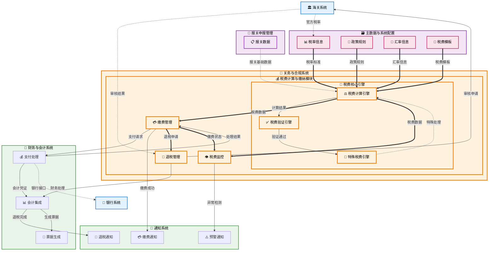

# 税费计算与缴纳 (Tax and Duty Calculation & Payment)

## 💡 新手提示：税费计算与缴纳核心概念

在开始阅读税费计算与缴纳功能前，请先理解以下关键概念：

*   **关税**：对进出口货物征收的税收，根据税率和完税价格计算
*   **增值税**：对进口货物征收的增值税，基于完税价格和关税
*   **消费税**：对特定消费品征收的税收
*   **完税价格**：海关确定的用于计算税费的价格基础
*   **税率**：根据HS编码和原产地确定的税收比例

### 税费状态生命周期
- **待计算**：税费信息待计算
- **计算中**：系统正在进行税费计算
- **计算完成**：税费计算完成，等待确认
- **待缴费**：税费已确认，等待缴纳
- **缴费中**：正在进行缴费处理
- **已缴费**：税费已成功缴纳
- **缴费失败**：缴费处理失败，需要重新处理
- **已退税**：税费已办理退税

### 税费类型
- **关税**：基本关税、暂定关税、反倾销税、反补贴税
- **增值税**：一般增值税、简易征收增值税
- **消费税**：从价消费税、从量消费税
- **其他费用**：滞报金、滞纳金、海关监管费

## 功能概述

税费计算与缴纳是关务与合规系统的核心功能，负责准确计算进出口货物的各项税费，并提供便捷的缴费渠道。系统支持多种税率查询、自动计算、在线缴费、退税申请等功能，确保税费处理的准确性和及时性。

### 💡 核心辨析：与关务费用管理的区别

虽然都涉及"钱"，但本模块与 **[2.9 关务费用管理](2.9%20关务费用管理.md)** 有明确分工：

| 维度 | 2.8 税费计算与缴纳 (本模块) | 2.9 关务费用管理 |
| :--- | :--- | :--- |
| **定位** | **法定义务执行者** | **企业经营管理者** |
| **核心对象** | **税**（关税/增值税/消费税） | **费**（全口径成本，含税费、运费、杂费） |
| **关注点** | **合规与准确**（按税则算税，按时缴纳） | **预估与利润**（事前估算成本，事后分析利润） |
| **数据流向** | → 海关系统 (支付) <br>→ 财务系统 (应付AP) | → 商务报价 (给客户) <br>→ 经营报表 (给老板) |

**🔍 业务价值说明**：

*   **精准计算**：基于最新税率和政策，确保税费计算准确
*   **便捷缴费**：多种缴费方式，提高缴费效率
*   **合规管理**：严格遵循海关税收政策和法规
*   **成本控制**：帮助企业合理规划和控制税费成本

**核心功能模块**：

*   **税率查询**：实时查询最新的税率信息
*   **税费计算**：自动计算各项税费金额
*   **缴费管理**：在线缴费和缴费状态跟踪
*   **退税申请**：办理各类退税业务

## 菜单结构

    税费计算与缴纳
    ├── 税费工作台                  # 税费任务的统一管理
    ├── 税率查询中心                # 查询各类税率信息
    ├── 税费计算器                  # 税费自动计算工具
    ├── 缴费管理中心                # 缴费处理和状态管理
    ├── 退税申请管理                # 退税业务处理
    ├── 税费查询统计                # 税费信息查询和统计
    └── 税费报表分析                # 税费相关报表分析

## 税费计算与缴纳数据流转图



## 页面原型设计

### 税费工作台页面

    +----------------------------------------------------------+
    |  税费计算与缴纳 > 税费工作台                [批量计算] [批量缴费] [导出] |
    +----------------------------------------------------------+
    | 任务筛选：                                                  |
    | 报关单号：[________] 业务类型：[进口▼] 状态：[下拉选择]      |
    | 申报日期：[开始日期] 至 [结束日期] 负责人：[全部▼]          |
    | 税费类型：[全部▼] 金额范围：[最小] 至 [最大]    [搜索] [重置] |
    +----------------------------------------------------------+
    | 报关单号     | 业务类型 | 完税价格  | 关税    | 增值税  | 总税费  | 状态   | 操作 |
    |-------------|---------|----------|--------|--------|--------|-------|------|
    | DEC-001     | 进口     | ¥100,000 | ¥8,000 | ¥14,040| ¥22,040| 待缴费 | [缴费][查看] |
    | DEC-002     | 进口     | ¥50,000  | ¥4,000 | ¥7,020 | ¥11,020| 已缴费 | [查看][退税] |
    +----------------------------------------------------------+
    | 统计概览：                                                 |
    | 今日新增：8 | 待计算：12 | 待缴费：15 | 已缴费：35 | 逾期：2  |
    | 本月税费总额：¥2,580,000 | 已缴纳：¥2,100,000 | 待缴纳：¥480,000 |
    +----------------------------------------------------------+
    | 重要提醒：                                                 |
    | • DEC-003 税费将于明日到期，请及时缴纳                      |
    | • DEC-005 退税申请已批准，预计3个工作日到账                 |
    | • 本月关税优惠政策更新，建议重新计算相关税费                 |
    +----------------------------------------------------------+
    | 共 156 条记录，第 1/16 页     [首页][上页][下页][末页]       |
    +----------------------------------------------------------+

### 税费计算器页面

    +----------------------------------------------------------+
    |  税费计算与缴纳 > 税费计算器                    [保存模板] [批量计算] |
    +----------------------------------------------------------+
    | 基本信息：                                                 |
    | 报关单号：[DEC-20231001-001_] [选择报关单]                 |
    | 业务类型：(*) 进口 ( ) 出口 ( ) 转关                       |
    | 贸易方式：[一般贸易▼] 征免性质：[一般征税▼]                |
    | 申报日期：[2023-10-01] 汇率：[USD/CNY 7.3156]             |
    +----------------------------------------------------------+
    | 商品信息：                                                 |
    | 序号 | 商品名称      | HS编码    | 数量  | 单价(USD) | 总价(USD) | 操作 |
    |-----|-------------|----------|-------|----------|----------|------|
    | 1   | 电子测量设备   | 90283000 | 10    | 1,000    | 10,000   | [编辑] |
    | 2   | 配套软件      | 85234900 | 1     | 5,000    | 5,000    | [编辑] |
    +----------------------------------------------------------+
    | 税率信息：                                                 |
    | 商品序号 | 最惠国税率 | 普通税率 | 增值税率 | 消费税率 | 原产地    |
    |---------|----------|---------|---------|---------|----------|
    | 1       | 8%       | 20%     | 13%     | 0%      | 美国      |
    | 2       | 0%       | 10%     | 13%     | 0%      | 美国      |
    +----------------------------------------------------------+
    | 税费计算结果：                                             |
    | 项目         | 计算基础      | 税率  | 税额(CNY)  | 备注        |
    |-------------|-------------|-------|-----------|-------------|
    | 完税价格     | USD 15,000   | -     | ¥109,734  | 含运保费     |
    | 关税        | ¥109,734     | 6.4%  | ¥7,023    | 加权平均税率 |
    | 增值税      | ¥116,757     | 13%   | ¥15,178   | 含关税基础   |
    | 消费税      | -           | 0%    | ¥0        | 不适用      |
    | 滞报金      | -           | -     | ¥0        | 无滞报      |
    +----------------------------------------------------------+
    | 税费汇总：                                                 |
    | 关税：¥7,023 | 增值税：¥15,178 | 消费税：¥0 | 其他：¥0     |
    | 税费总计：¥22,201                              [确认计算]   |
    +----------------------------------------------------------+

### 缴费管理中心页面

    +----------------------------------------------------------+
    |  税费计算与缴纳 > 缴费管理中心                  [批量缴费] [导出凭证] |
    +----------------------------------------------------------+
    | 缴费筛选：                                                 |
    | 报关单号：[________] 缴费状态：[待缴费▼] 缴费方式：[全部▼]  |
    | 缴费日期：[开始日期] 至 [结束日期]              [搜索] [重置] |
    +----------------------------------------------------------+
    | 报关单号     | 税费总额  | 缴费方式 | 缴费状态 | 缴费时间    | 操作     |
    |-------------|----------|---------|---------|-----------|----------|
    | DEC-001     | ¥22,201  | 在线支付 | 待缴费   | -         | [缴费]   |
    | DEC-002     | ¥11,020  | 银行转账 | 已缴费   | 2023-10-01| [查看凭证] |
    +----------------------------------------------------------+
    | 缴费详情 - DEC-001：                                       |
    | 税费明细：                                                 |
    | 关税：¥7,023 | 增值税：¥15,178 | 消费税：¥0 | 其他费用：¥0 |
    | 缴费总额：¥22,201                                         |
    +----------------------------------------------------------+
    | 缴费方式选择：                                             |
    | (*) 在线支付 - 支持银行卡、支付宝、微信支付                 |
    | ( ) 银行转账 - 企业网银转账到海关指定账户                   |
    | ( ) 现金缴费 - 到海关现场缴费（限额¥10,000以下）           |
    +----------------------------------------------------------+
    | 在线支付信息：                                             |
    | 收款单位：中华人民共和国XX海关                             |
    | 缴费金额：¥22,201.00                                      |
    | 报关单号：DEC-20231001-001                                |
    | 支付方式：[银行卡▼] [选择银行卡]                           |
    |                                          [确认缴费]       |
    +----------------------------------------------------------+

### 退税申请管理页面

    +----------------------------------------------------------+
    |  税费计算与缴纳 > 退税申请管理                  [新建申请] [批量处理] |
    +----------------------------------------------------------+
    | 申请筛选：                                                 |
    | 申请单号：[________] 退税类型：[全部▼] 状态：[全部▼]        |
    | 申请日期：[开始日期] 至 [结束日期]              [搜索] [重置] |
    +----------------------------------------------------------+
    | 申请单号     | 退税类型 | 报关单号  | 退税金额  | 申请日期   | 状态   | 操作 |
    |-------------|---------|----------|----------|-----------|-------|------|
    | REF-001     | 溢缴退税 | DEC-001  | ¥1,500   | 2023-10-01| 审核中 | [查看] |
    | REF-002     | 出口退税 | DEC-002  | ¥8,000   | 2023-10-02| 已批准 | [查看] |
    +----------------------------------------------------------+
    | 新建退税申请：                                             |
    | 退税类型：[溢缴退税▼]                                      |
    | 报关单号：[DEC-20231001-003_] [选择报关单]                 |
    | 退税原因：[税率调整导致多缴税费___________________]         |
    | 退税金额：¥[2,000.00]                                     |
    | 申请说明：[详细说明退税原因和依据_________________]         |
    +----------------------------------------------------------+
    | 附件材料：                                                 |
    | [+] 上传退税申请书                                         |
    | [+] 上传相关证明文件                                       |
    | [+] 上传原缴费凭证                                         |
    +----------------------------------------------------------+
    | 退税流程：                                                 |
    | 1. 提交申请 → 2. 海关审核 → 3. 财务审批 → 4. 退税到账      |
    | 当前状态：[1] 预计处理时间：5-10个工作日                    |
    |                                          [提交申请]       |
    +----------------------------------------------------------+

## 业务流程

### 💡 新手提示：业务流程阅读指南

本章节详细描述了税费计算与缴纳的核心业务流程。每个流程都包含：
- **流程步骤**：按顺序执行的具体操作
- **系统交互**：涉及的跨系统调用和数据交换
- **参数说明**：关键参数的含义和取值范围
- **异常处理**：可能出现的异常情况及处理方式

> **💡 阅读建议**：建议按照流程顺序阅读，重点关注系统交互部分，这有助于理解整个税费管理的技术实现。

### 📋 税率查询获取流程

1. **商品信息收集**：收集HS编码、原产地等关键信息
   
   > **新手说明**：税率查询是税费计算的基础，需要准确的HS编码和原产地信息。系统会根据这些信息查询最新的税率数据库，确保使用正确的税率。

   *   **🔗 跨系统触发**：关务与合规（税费计算与缴纳） → 关务与合规（预录入与归类管理） + 主数据与系统配置 **【查询数据】**
       *   **调用方式**：RESTful API (GET /api/pre-entry/goods-info, GET /api/master-data/goods-master)
       *   **调用时机**：用户发起税费计算时自动触发
       *   **数据操作**：
           *   **业务数据读取**：从关务与合规（预录入与归类管理）的 pre_entry_goods (预录入商品表) 表、goods_classification_results (商品归类结果表) 表读取具体业务的商品信息和归类结果
           *   **基础数据读取**：从主数据与系统配置的 master_goods (主商品库) 表、master_hs_codes (主HS编码库) 表、master_tariff_rates (主税率表) 表读取标准化基础信息
           *   **数据验证**：在主数据与系统配置的 master_hs_codes (主HS编码库) 表中验证编码有效性和最新税率信息
           *   **数据关联**：通过业务表的外键关联主数据表，获取完整的商品信息和归类关系
       *   **入参**：`{declaration_no, goods_id, verification_level}`
           *   `declaration_no` (报关单号): string，报关单的唯一标识符
           *   `goods_id` (商品ID): string，商品在系统中的唯一标识
           *   `verification_level` (验证级别): enum (基础/标准/严格)，信息验证的严格程度
       *   **出参**：`{hs_code, origin_country, trade_mode, goods_details, classification_status, master_data_info}`
           *   `hs_code` (HS编码): string，商品的海关商品编码（来源：主数据库）
           *   `origin_country` (原产地): string，商品原产地国家代码（来源：业务数据）
           *   `trade_mode` (贸易方式): string，进出口贸易方式代码（来源：业务数据）
           *   `goods_details` (商品详情): object，商品的详细描述和规格信息（来源：主数据库+业务数据关联）
           *   `classification_status` (归类状态): enum (已确认/待审核/有争议)，归类确认状态（来源：业务数据）
           *   `master_data_info` (主数据信息): object，包含标准化的商品基础信息、HS编码详情和基础税率信息（来源：主数据库）

2. **税率数据库查询**：查询最新的税率和政策信息
   
   > **新手说明**：系统从主数据模块查询已同步的海关税率数据，获取关税、增值税、消费税等各项税率。主数据模块通过定时同步机制确保税率数据的时效性和准确性。

   *   **🔗 跨系统触发**：关务与合规（税费计算与缴纳） → 主数据与系统配置 **【查询数据】**
       *   **调用方式**：RESTful API (GET /api/master-data/tariff-rates/query)
       *   **调用时机**：获取商品信息后立即查询对应税率
       *   **数据操作**：
           *   **基础税率读取**：从主数据与系统配置的 master_tariff_rates (主税率表) 表读取已同步的标准税率信息
           *   **优惠政策查询**：在主数据与系统配置的 master_preferential_policies (主优惠政策表) 表中查询适用的优惠政策
           *   **查询日志记录**：更新关务与合规（税费计算与缴纳）的 rate_query_logs (税率查询日志表) 表记录查询历史
           *   **数据关联**：通过HS编码关联主数据表，获取完整的税率和政策信息
           *   **数据时效性验证**：检查税率数据的最后同步时间，确保使用最新有效的税率信息
       *   **入参**：`{hs_code, origin_country, trade_mode, effective_date}`
           *   `hs_code` (HS编码): string，需要查询税率的商品编码
           *   `origin_country` (原产地国家): string，商品原产地国家代码
           *   `trade_mode` (贸易方式): string，进出口贸易方式
           *   `effective_date` (生效日期): date，税率查询的基准日期
       *   **出参**：`{mfn_rate, general_rate, preferential_rate, vat_rate, consumption_tax_rate, policy_list, sync_info}`
           *   `mfn_rate` (最惠国税率): decimal，最惠国关税税率（来源：主数据库同步）
           *   `general_rate` (普通税率): decimal，普通关税税率（来源：主数据库同步）
           *   `preferential_rate` (优惠税率): decimal，适用的优惠关税税率（来源：主数据库同步）
           *   `vat_rate` (增值税税率): decimal，进口增值税税率（来源：主数据库同步）
           *   `consumption_tax_rate` (消费税税率): decimal，消费税税率（如适用）（来源：主数据库同步）
           *   `policy_list` (政策清单): array，适用的优惠政策列表（来源：主数据库同步）
           *   `sync_info` (同步信息): object，包含数据最后同步时间、版本号等信息，确保数据时效性

3. **优惠政策验证**：验证是否适用特殊优惠政策
   
   > **新手说明**：系统会检查是否适用自贸协定、RCEP等优惠政策，以及是否需要原产地证书。优惠政策的适用需要满足特定条件，例如商品价值、原产地国家等。

   *   **🔗 系统内流转**：关务与合规（税费计算与缴纳） → 关务与合规（随附单证管理） **【查询数据】**
       *   **调用方式**：RESTful API (GET /api/documents/origin-certificate/verify)
       *   **调用时机**：发现适用优惠政策时触发证书验证
       *   **数据操作**：
           *   **数据读取**：从关务与合规（随附单证管理）的 document_items (单证项目表) 表读取原产地证书等单证信息
           *   **数据验证**：在关务与合规（随附单证管理）的 document_reviews (单证审核表) 表中验证单证有效性和审核状态
           *   **数据记录**：向关务与合规（税费计算与缴纳）的 policy_verification_logs (政策验证日志表) 表写入验证记录
       *   **入参**：`{certificate_no, origin_country, agreement_type, goods_value}`
           *   `certificate_no` (证书编号): string，原产地证书编号
           *   `origin_country` (原产地国家): string，证书标注的原产地国家
           *   `agreement_type` (协定类型): enum (FTA/RCEP/GSP/其他)，适用的贸易协定类型
           *   `goods_value` (货物价值): decimal，用于验证是否满足价值门槛
       *   **出参**：`{verification_result, applicable_rate, certificate_status, policy_details}`
           *   `verification_result` (验证结果): boolean，优惠政策是否适用
           *   `applicable_rate` (适用税率): decimal，验证通过后的实际适用税率
           *   `certificate_status` (证书状态): enum (有效/过期/无效)，原产地证书状态
           *   `policy_details` (政策详情): object，适用政策的具体条款和要求
4. **税率确认锁定**：确认最终适用的税率
   
   > **新手说明**：经过查询和验证后，系统会确定最终适用的税率组合。这个税率将用于后续的税费计算，确保计算结果的准确性。

   *   **内部处理**：税费计算与缴纳模块内部完成税率确认和锁定
       *   **处理逻辑**：系统内部函数调用 (confirmAndLockRates)
       *   **处理时机**：税率查询和政策验证完成后立即执行
       *   **数据操作**：
           *   **数据记录**：向税费计算与缴纳的 rate_selections (税率选择记录表) 表写入最终税率选择
           *   **数据锁定**：更新税费计算与缴纳的 rate_locks (税率锁定表) 表锁定当前税率版本
           *   **数据日志**：向税费计算与缴纳的 rate_selection_logs (税率选择日志表) 表记录选择过程
       *   **入参**：`{declaration_no, selected_rates, verification_results, lock_duration}`
           *   `declaration_no` (报关单号): string，报关单的唯一标识符
           *   `selected_rates` (选定税率): object，最终确定的各项税率组合
           *   `verification_results` (验证结果): array，政策验证的详细结果
           *   `lock_duration` (锁定时长): integer，税率锁定的有效时长（小时）
       *   **出参**：`{confirmation_id, final_duty_rate, final_vat_rate, rate_source, lock_expiry}`
           *   `confirmation_id` (确认ID): string，税率确认的唯一标识
           *   `final_duty_rate` (最终关税税率): decimal，确认的关税税率
           *   `final_vat_rate` (最终增值税税率): decimal，确认的增值税税率
           *   `rate_source` (税率来源): string，税率的数据来源标识
           *   `lock_expiry` (锁定到期时间): datetime，税率锁定的到期时间

### 📋 税费计算流程

1. **完税价格确定**：计算CIF价格作为完税价格基础
   
   > **新手说明**：完税价格是税费计算的基础，通常为CIF价格（货价+运费+保险费）。系统会自动进行汇率转换，确保价格计算的准确性。

   *   **🔗 跨系统触发**：税费计算与缴纳 → 主数据与系统配置 **【查询数据】**
       *   **调用方式**：RESTful API (GET /api/masterdata/exchange/rate/query)
       *   **调用时机**：开始税费计算时自动获取当日汇率
       *   **数据操作**：
           *   **数据读取**：从主数据与系统配置的 exchange_rates (汇率表) 表读取实时汇率信息
           *   **数据计算**：在税费计算与缴纳的 cif_calculations (CIF计算表) 表中执行价格计算
           *   **数据记录**：向税费计算与缴纳的 price_calculation_logs (价格计算日志表) 表记录计算过程
       *   **入参**：`{currency_from, currency_to, calculation_date, goods_value, freight_cost, insurance_cost}`
           *   `currency_from` (源币种): string，原始货币代码
           *   `currency_to` (目标币种): string，目标货币代码（通常为人民币CNY）
           *   `calculation_date` (计算日期): date，汇率查询的基准日期
           *   `goods_value` (货物价值): decimal，商品的FOB价值
           *   `freight_cost` (运费): decimal，国际运输费用
           *   `insurance_cost` (保险费): decimal，货物运输保险费用
       *   **出参**：`{exchange_rate, cif_value_original, cif_value_cny, calculation_details}`
           *   `exchange_rate` (汇率): decimal，适用的汇率
           *   `cif_value_original` (原币种CIF价值): decimal，原币种的CIF总价值
           *   `cif_value_cny` (人民币CIF价值): decimal，转换为人民币的CIF价值
           *   `calculation_details` (计算详情): object，详细的价格计算分解

2. **关税计算**：基于完税价格和关税税率计算关税
   
   > **新手说明**：关税计算公式为：关税 = 完税价格 × 关税税率。系统会根据商品特性选择从价计征或从量计征方式。

   *   **🔗 跨系统触发**：关务与合规（税费计算与缴纳） → 主数据与系统配置（税费计算引擎） **【执行计算】**
       *   **调用方式**：RESTful API (POST /api/calculation/duty/compute)
       *   **调用时机**：完税价格确定后立即执行关税计算
       *   **数据操作**：
           *   **数据计算**：由主数据与系统配置（税费计算引擎）执行关税计算逻辑
           *   **数据存储**：计算结果存储到关务与合规（税费计算与缴纳）的 duty_calculations (关税计算表) 表
           *   **数据验证**：通过关务与合规（税费计算与缴纳）的 calculation_validations (计算验证表) 表验证计算结果
           *   **数据记录**：向关务与合规（税费计算与缴纳）的 duty_calculation_logs (关税计算日志表) 表记录计算过程
       *   **入参**：`{dutiable_value, duty_rate, calculation_method, goods_quantity, unit_price}`
           *   `dutiable_value` (完税价格): decimal，用于计税的商品价值
           *   `duty_rate` (关税税率): decimal，适用的关税税率
           *   `calculation_method` (计算方法): enum (从价征税/从量征税)，税收征税方式
           *   `goods_quantity` (商品数量): decimal，商品的数量（从量征税时使用）
           *   `unit_price` (单位税额): decimal，从量征税的单位税额
       *   **出参**：`{duty_amount, calculation_base, effective_rate, calculation_breakdown}`
           *   `duty_amount` (关税金额): decimal，计算得出的关税总额
           *   `calculation_base` (计税基础): decimal，实际用于计税的基数
           *   `effective_rate` (有效税率): decimal，实际适用的税率
           *   `calculation_breakdown` (计算明细): object，详细的计算过程分解

3. **增值税计算**：基于完税价格加关税计算增值税
   
   > **新手说明**：增值税计算公式为：增值税 = (完税价格 + 关税) × 增值税税率。增值税的计税基础包含了关税金额。

   *   **🔗 跨系统触发**：关务与合规（税费计算与缴纳） → 主数据与系统配置（税费计算引擎） **【执行计算】**
       *   **调用方式**：RESTful API (POST /api/calculation/vat/compute)
       *   **调用时机**：关税计算完成后立即执行增值税计算
       *   **数据操作**：
           *   **数据计算**：由主数据与系统配置（税费计算引擎）执行增值税计算逻辑
           *   **数据存储**：计算结果存储到税费计算与缴纳的 vat_calculations (增值税计算表) 表
           *   **数据查询**：从税费计算与缴纳的 tax_categories (税收分类表) 表查询商品税收分类
           *   **数据记录**：向税费计算与缴纳的 vat_calculation_logs (增值税计算日志表) 表记录计算过程
       *   **入参**：`{dutiable_value, duty_amount, vat_rate, tax_category, exemption_status}`
           *   `dutiable_value` (完税价格): decimal，商品的完税价格
           *   `duty_amount` (关税金额): decimal，已计算的关税金额
           *   `vat_rate` (增值税税率): decimal，适用的增值税税率
           *   `tax_category` (税收分类): string，商品的税收分类代码
           *   `exemption_status` (免税状态): boolean，是否享受增值税免税政策
       *   **出参**：`{vat_base, vat_amount, effective_vat_rate, exemption_details}`
           *   `vat_base` (增值税计税基础): decimal，增值税的计税基数
           *   `vat_amount` (增值税金额): decimal，计算得出的增值税总额
           *   `effective_vat_rate` (有效增值税税率): decimal，实际适用的增值税税率
           *   `exemption_details` (免税详情): object，免税政策的适用详情

4. **其他税费计算**：计算消费税和其他相关费用 
    
    > **新手说明**：根据商品类别，可能需要缴纳消费税、反倾销税等其他税费。系统会根据商品特性自动判断并计算相应税费。 
 
    *   **🔗 跨系统触发**：关务与合规（税费计算与缴纳） → 主数据与系统配置（税费计算引擎） **【执行计算】** 
        *   **调用方式**：RESTful API (POST /api/masterdata/special-tax/calculate) 
        *   **调用时机**：增值税计算完成后检查是否需要计算特殊税费 
        *   **数据操作**： 
            *   **数据查询**：从主数据与系统配置的 consumption_tax_rates (消费税税率表) 表查询消费税税率 
            *   **数据计算**：由主数据与系统配置（税费计算引擎）执行特殊税费计算逻辑 
            *   **数据存储**：将计算结果存储到关务与合规（税费计算与缴纳）的 special_tax_calculations (特殊税费计算表) 表中
            *   **数据记录**：向关务与合规（税费计算与缴纳）的 special_tax_logs (特殊税费计算日志表) 表记录计算过程 
       *   **入参**：`{hs_code, goods_category, dutiable_value, origin_country, trade_disputes}`
           *   `hs_code` (HS编码): string，商品的海关商品编码
           *   `goods_category` (商品类别): string，商品的分类代码
           *   `dutiable_value` (完税价格): decimal，用于计税的商品价值
           *   `origin_country` (原产地国家): string，商品原产地国家代码
           *   `trade_disputes` (贸易争端): array，相关的贸易争端信息
       *   **出参**：`{consumption_tax, anti_dumping_duty, countervailing_duty, total_special_tax, applicable_measures}`
           *   `consumption_tax` (消费税): decimal，应缴纳的消费税金额
           *   `anti_dumping_duty` (反倾销税): decimal，反倾销税金额
           *   `countervailing_duty` (反补贴税): decimal，反补贴税金额
           *   `total_special_tax` (特殊税费总计): decimal，所有特殊税费的总和
           *   `applicable_measures` (适用措施): array，适用的贸易救济措施详情

### 📋 缴费申请流程

1. **缴费申请生成**：生成税费缴纳申请单
   
   > **新手说明**：税费计算完成后，系统会自动生成缴费申请单并流转至 **[5.1 费用管理](../5.财务与会计/5.1%20费用管理.md)** 模块：
   > *   **应付 (AP)**：生成支付给海关的税费成本。
   > *   **应收 (AR)**：若为代垫税金，同时生成向委托客户收取的税费账单（可包含垫资费）。

   *   **🔗 跨系统触发**：税费计算与缴纳 → 财务与会计系统 **【提交申请】**
       *   **调用方式**：RESTful API (POST /api/finance/payment-request/create)
       *   **调用时机**：税费计算完成且用户确认缴费时
       *   **数据操作**：
           *   **数据创建**：在税费计算与缴纳的 payment_requests (缴费申请表) 表中创建申请记录
           *   **数据提交**：向财务与会计系统提交缴费申请数据
           *   **数据跟踪**：在税费计算与缴纳的 payment_request_logs (申请日志表) 表中记录申请状态
       *   **入参**：`{declaration_no, tax_breakdown, payer_info, urgency_level, business_type}`
           *   `declaration_no` (报关单号): string，相关报关单号
           *   `tax_breakdown` (税费明细): array，详细的税费计算明细
           *   `payer_info` (缴费人信息): object，缴费人的基本信息和资质
           *   `urgency_level` (紧急程度): enum (普通/紧急/特急)，缴费紧急程度
           *   `business_type` (业务类型): enum (进口/出口/转关)，业务类型
       *   **出参**：`{request_id, request_status, estimated_processing_time, required_documents}`
           *   `request_id` (申请ID): string，缴费申请的唯一标识
           *   `request_status` (申请状态): enum (已提交/审核中/已批准/已拒绝)，当前申请状态
           *   `estimated_processing_time` (预计处理时间): datetime，预计财务系统处理完成时间
           *   `required_documents` (所需文件): array，需要补充的相关文件

2. **缴费状态跟踪**：跟踪财务系统的支付处理进度
   
   > **新手说明**：缴费申请提交后，系统会实时跟踪财务系统的处理进度，包括审核状态、支付状态等，并及时更新关务系统中的相关状态。

   *   **🔗 跨系统触发**：财务与会计系统 → 税费计算与缴纳 **【状态回调】**
       *   **调用方式**：RESTful API (POST /api/customs/payment-status/update)
       *   **调用时机**：财务系统支付状态变更时自动回调
       *   **数据操作**：
           *   **数据更新**：更新税费计算与缴纳的 tax_payments (税费支付表) 表的支付状态
           *   **数据同步**：同步财务系统的支付结果到关务系统
           *   **数据通知**：向税费计算与缴纳的 payment_notifications (支付通知表) 表记录状态变更
       *   **入参**：`{request_id, payment_status, transaction_details, failure_reason}`
           *   `request_id` (申请ID): string，对应的缴费申请标识
           *   `payment_status` (支付状态): enum (处理中/成功/失败/已退款)，最新的支付状态
           *   `transaction_details` (交易详情): object，详细的交易信息（如成功）
           *   `failure_reason` (失败原因): string，支付失败的具体原因（如失败）
       *   **出参**：`{update_result, customs_status, next_actions}`
           *   `update_result` (更新结果): boolean，状态更新是否成功
           *   `customs_status` (关务状态): enum (待缴费/缴费中/已缴费/缴费失败)，更新后的关务状态
           *   `next_actions` (后续操作): array，需要执行的后续操作

3. **缴费凭证获取**：从财务系统获取缴费凭证
   
   > **新手说明**：缴费成功后，系统会从财务系统获取正式的缴费凭证和相关单据，这些凭证将用于后续的通关和审计流程。

   *   **🔗 跨系统触发**：税费计算与缴纳 → 财务与会计系统 **【获取凭证】**
       *   **调用方式**：RESTful API (GET /api/finance/payment-receipt/{transaction_id})
       *   **调用时机**：收到支付成功通知后获取正式凭证
       *   **数据操作**：
           *   **数据获取**：从财务与会计系统获取正式的缴费凭证
           *   **数据存储**：将凭证信息存储到税费计算与缴纳的 payment_receipts (缴费凭证表) 表中
           *   **数据更新**：更新税费计算与缴纳的 customs_declarations (报关单表) 表的缴费凭证状态
       *   **入参**：`{transaction_id, receipt_type, format_preference}`
           *   `transaction_id` (交易ID): string，成功的支付交易标识
           *   `receipt_type` (凭证类型): enum (电子凭证/纸质凭证/税务凭证)，需要的凭证类型
           *   `format_preference` (格式偏好): enum (PDF/XML/图片)，凭证文件格式偏好
       *   **出参**：`{receipt_no, receipt_url, digital_signature, validity_period}`
           *   `receipt_no` (凭证编号): string，正式的缴费凭证编号
           *   `receipt_url` (凭证链接): string，凭证文件的下载链接
           *   `digital_signature` (数字签名): string，凭证的数字签名验证码
           *   `validity_period` (有效期): datetime，凭证的有效期限

4. **通关状态更新**：更新报关单的通关状态
   
   > **新手说明**：缴费完成并获得凭证后，系统会自动更新相关报关单的通关状态，触发后续的放行流程。

   *   **数据操作**：
       *   **数据更新**：更新税费计算与缴纳的 customs_declarations (报关单表) 表的通关状态
       *   **数据通知**：向相关业务系统发送缴费完成通知
       *   **数据归档**：将缴费相关文档进行归档处理

### 📋 退税申请流程

1. **退税申请提交**：提交退税申请和相关材料
   
   > **新手说明**：退税申请需要提供完整的申请材料，包括退税申请书、原缴费凭证、相关证明文件等。系统会对申请材料进行初步审核。

   *   **🔗 跨系统触发**：税费计算与缴纳 → 单证管理系统 **【提交申请】**
       *   **调用方式**：RESTful API (POST /api/documents/refund/submit)
       *   **调用时机**：用户发起退税申请时提交申请材料
       *   **数据操作**：
           *   **数据创建**：在税费计算与缴纳的 tax_refunds (退税申请表) 表中创建退税申请记录
           *   **数据上传**：向单证管理系统的 refund_documents (退税文档表) 表上传申请材料
           *   **数据验证**：通过税费计算与缴纳的 refund_validations (退税验证表) 表进行初步验证
       *   **入参**：`{refund_type, refund_amount, refund_reason, original_payment, supporting_docs}`
           *   `refund_type` (退税类型): enum (多缴退税/错缴退税/政策调整退税)，退税申请类型
           *   `refund_amount` (退税金额): decimal，申请退税的金额
           *   `refund_reason` (退税原因): string，详细的退税原因说明
           *   `original_payment` (原缴费信息): object，原始缴费的详细信息
           *   `supporting_docs` (支持文档): array，退税申请的支持文档列表
       *   **出参**：`{refund_application_id, submission_status, required_documents, estimated_processing_time}`
           *   `refund_application_id` (退税申请ID): string，退税申请的唯一标识
           *   `submission_status` (提交状态): enum (已提交/待补充/提交失败)，申请提交状态
           *   `required_documents` (必需文档): array，需要提供的文档清单
           *   `estimated_processing_time` (预计处理时间): integer，预计审核处理时间（工作日）

2. **海关审核处理**：海关对退税申请进行审核
   
   > **新手说明**：海关会对退税申请进行详细审核，包括退税资格、退税金额、申请材料的真实性等。审核过程中可能需要补充材料或说明。

   *   **🔗 跨系统触发**：税费计算与缴纳 → 海关审核系统 **【审核处理】**
       *   **调用方式**：RESTful API (POST /api/customs/refund/review)
       *   **调用时机**：退税申请提交后自动分配给审核员进行审核
       *   **数据操作**：
           *   **数据分配**：在海关审核系统的 refund_assignments (退税分配表) 表中分配审核员
           *   **数据审核**：通过海关审核系统的 refund_reviews (退税审核表) 表记录审核过程
           *   **数据更新**：更新税费计算与缴纳的 tax_refunds (退税申请表) 表的审核状态
       *   **入参**：`{refund_application_id, reviewer_assignment, review_priority, audit_requirements}`
           *   `refund_application_id` (退税申请ID): string，需要审核的退税申请标识
           *   `reviewer_assignment` (审核员分配): object，分配的审核员信息
           *   `review_priority` (审核优先级): enum (高/中/低)，审核优先级别
           *   `audit_requirements` (审计要求): array，特殊的审计要求
       *   **出参**：`{review_id, reviewer_info, review_status, feedback_requirements}`
           *   `review_id` (审核ID): string，审核过程的唯一标识
           *   `reviewer_info` (审核员信息): object，负责审核的审核员详细信息
           *   `review_status` (审核状态): enum (审核中/需补充材料/审核通过/审核拒绝)，当前审核状态
           *   `feedback_requirements` (反馈要求): array，需要申请人提供的额外信息或材料

3. **财务审批确认**：财务与会计系统对退税进行最终审批
   
   > **新手说明**：海关审核通过后，需要财务与会计系统进行最终审批。财务系统会核实退税资金来源、预算可用性和退税合规性，确保退税的合法性。

   *   **🔗 跨系统触发**：税费计算与缴纳 → 财务与会计系统 **【审批确认】**
       *   **调用方式**：RESTful API (POST /api/finance/refund/approve)
       *   **调用时机**：海关审核通过后自动提交财务审批
       *   **数据操作**：
           *   **数据提交**：向财务与会计系统的 charge_approvals (费用审核表) 表提交退税审批申请
           *   **数据核实**：在财务与会计系统的 cash_flow_forecast (现金流预测表) 表中核实资金可用性
           *   **数据记录**：向税费计算与缴纳的 refund_approval_logs (退税审批日志表) 表记录审批过程
       *   **入参**：`{review_id, refund_details, fund_verification, approval_workflow}`
           *   `review_id` (审核ID): string，海关审核通过的审核标识
           *   `refund_details` (退税详情): object，详细的退税信息和金额
           *   `fund_verification` (资金验证): object，资金来源和可用性验证信息
           *   `approval_workflow` (审批流程): object，相关的审批级别和流程配置
       *   **出参**：`{approval_id, approval_status, approval_date, fund_allocation}`
           *   `approval_id` (审批ID): string，财务审批的唯一标识
           *   `approval_status` (审批状态): enum (审批中/审批通过/审批拒绝/需补充信息)，财务审批状态
           *   `approval_date` (审批日期): date，财务审批的日期
           *   `fund_allocation` (资金分配): object，批准的资金分配详情

4. **退税款项发放**：通过财务与会计系统执行退税款项的实际发放
   
   > **新手说明**：财务审批通过后，由财务与会计系统执行退税款项的发放。退税款会通过财务系统的付款流程转入申请人指定的银行账户，并生成退税凭证。

   *   **🔗 跨系统触发**：税费计算与缴纳 → 财务与会计系统 **【执行发放】**
       *   **调用方式**：RESTful API (POST /api/finance/payment/refund)
       *   **调用时机**：财务审批通过后立即执行退税发放
       *   **数据操作**：
           *   **数据发放**：通过财务与会计系统的 payments (付款表) 表执行退税付款
           *   **数据更新**：更新税费计算与缴纳的 tax_refunds (退税申请表) 表的发放状态
           *   **数据通知**：向税费计算与缴纳的 refund_notifications (退税通知表) 表记录通知信息
       *   **入参**：`{approval_id, beneficiary_account, refund_amount, payment_reference}`
           *   `approval_id` (审批ID): string，财务审批通过的审批标识
           *   `beneficiary_account` (受益人账户): object，退税款接收的银行账户信息
           *   `refund_amount` (退税金额): decimal，实际发放的退税金额
           *   `payment_reference` (付款参考): string，财务系统付款的参考号码
       *   **出参**：`{payment_id, payment_status, completion_time, refund_receipt}`
           *   `payment_id` (付款ID): string，财务系统付款的唯一标识
           *   `payment_status` (付款状态): enum (处理中/成功/失败)，付款执行状态
           *   `completion_time` (完成时间): datetime，退税发放完成时间
           *   `refund_receipt` (退税凭证): object，生成的退税凭证信息

## 核心功能扩展

### 智能税费计算引擎

```python
class TaxCalculationEngine:
    """智能税费计算引擎"""
    
    def __init__(self):
        self.tax_rate_service = TaxRateService()
        self.policy_engine = PolicyEngine()
        
    def calculate_comprehensive_tax(self, declaration_data):
        """综合税费计算"""
        # 获取基础税率信息
        base_rates = self.tax_rate_service.get_base_rates(
            declaration_data['hs_code'],
            declaration_data['origin_country']
        )
        
        # 检查优惠政策适用性
        preferential_policies = self.policy_engine.check_applicable_policies(
            declaration_data
        )
        
        # 计算完税价格
        dutiable_value = self.calculate_dutiable_value(declaration_data)
        
        # 计算各项税费
        customs_duty = self.calculate_customs_duty(dutiable_value, base_rates)
        vat_amount = self.calculate_vat(dutiable_value + customs_duty, base_rates)
        consumption_tax = self.calculate_consumption_tax(dutiable_value, base_rates)
        
        # 应用优惠政策
        if preferential_policies:
            customs_duty = self.apply_preferential_rates(
                customs_duty, preferential_policies
            )
        
        return {
            'dutiable_value': dutiable_value,
            'customs_duty': customs_duty,
            'vat_amount': vat_amount,
            'consumption_tax': consumption_tax,
            'total_tax': customs_duty + vat_amount + consumption_tax,
            'applied_policies': preferential_policies,
            'calculation_details': self.get_calculation_breakdown()
        }
    
    def calculate_dutiable_value(self, declaration_data):
        """计算完税价格"""
        goods_value = declaration_data['goods_value']
        freight = declaration_data.get('freight', 0)
        insurance = declaration_data.get('insurance', 0)
        exchange_rate = declaration_data['exchange_rate']
        
        cif_value = goods_value + freight + insurance
        return cif_value * exchange_rate
```

### 税费风险评估系统

```python
class TaxRiskAssessment:
    """税费风险评估系统"""
    
    def __init__(self):
        self.risk_rules = self.load_risk_rules()
        self.ml_model = self.load_risk_model()
        
    def assess_tax_risk(self, tax_data):
        """评估税费风险"""
        risk_factors = []
        risk_score = 0
        
        # 税率风险评估
        rate_risk = self.assess_rate_risk(tax_data['tax_rates'])
        risk_factors.append(rate_risk)
        risk_score += rate_risk['score']
        
        # 金额风险评估
        amount_risk = self.assess_amount_risk(tax_data['tax_amount'])
        risk_factors.append(amount_risk)
        risk_score += amount_risk['score']
        
        # 政策风险评估
        policy_risk = self.assess_policy_risk(tax_data['applied_policies'])
        risk_factors.append(policy_risk)
        risk_score += policy_risk['score']
        
        # 时效风险评估
        timing_risk = self.assess_timing_risk(tax_data['payment_deadline'])
        risk_factors.append(timing_risk)
        risk_score += timing_risk['score']
        
        # 综合风险等级
        risk_level = self.calculate_risk_level(risk_score)
        
        return {
            'overall_risk_score': risk_score,
            'risk_level': risk_level,
            'risk_factors': risk_factors,
            'recommendations': self.generate_risk_recommendations(risk_factors),
            'review_required': risk_level in ['high', 'critical']
        }
    
    def assess_rate_risk(self, tax_rates):
        """评估税率风险"""
        # 检查税率异常情况
        risk_score = 0
        factors = {}
        
        # 检查税率是否异常高
        if tax_rates.get('customs_duty_rate', 0) > 0.3:
            risk_score += 20
            factors['high_duty_rate'] = True
            
        # 检查是否使用了临时税率
        if tax_rates.get('temporary_rate', False):
            risk_score += 15
            factors['temporary_rate'] = True
            
        return {
            'type': 'rate_risk',
            'score': min(risk_score, 100),
            'factors': factors
        }
```

## API接口设计

### 税费计算接口

```json
POST /api/tax/calculate
{
  "declaration_no": "DEC-20231001-001",    // 报关单号
  "goods": [                               // 货物信息
    {
      "hs_code": "90283000",               // HS编码
      "origin_country": "US",              // 原产地
      "dutiable_value": 77515.00,          // 完税价格
      "quantity": 10,                      // 数量
      "unit": "台"                         // 单位
    }
  ],
  "exchange_rate": 7.3156,                 // 汇率
  "trade_mode": "general_trade",           // 贸易方式
  "preferential_origin": true              // 是否享受优惠原产地
}
```

**响应结果**：
```json
{
  "code": 200,
  "message": "税费计算成功",
  "data": {
    "calculation_id": "CALC-20231001-001",
    "declaration_no": "DEC-20231001-001",
    "dutiable_value": 77515.00,
    "tax_breakdown": {
      "customs_duty": {
        "rate": 0.08,
        "amount": 6201.20,
        "base_amount": 77515.00
      },
      "vat": {
        "rate": 0.13,
        "amount": 10883.09,
        "base_amount": 83716.20
      },
      "consumption_tax": {
        "rate": 0.00,
        "amount": 0.00,
        "base_amount": 0.00
      }
    },
    "total_tax": 17084.29,
    "applied_policies": [
      {
        "policy_name": "最惠国税率",
        "policy_code": "MFN",
        "discount_rate": 0.08
      }
    ],
    "calculation_time": "2023-10-01T10:30:00Z"
  }
}
```

### 缴费发起接口

```json
POST /api/tax/payment/initiate
{
  "declaration_no": "DEC-20231001-001",    // 报关单号
  "payment_amount": 17084.29,              // 缴费金额
  "payment_method": "online_payment",      // 缴费方式
  "payment_info": {                        // 缴费信息
    "bank_code": "ICBC",                   // 银行代码
    "account_number": "6222****1234",      // 账户号码
    "account_name": "上海进口贸易公司"       // 账户名称
  },
  "payer_info": {                          // 缴费人信息
    "company_name": "上海进口贸易公司",      // 公司名称
    "tax_number": "91310000123456789X",    // 税号
    "contact_person": "张三",               // 联系人
    "contact_phone": "13800138000"         // 联系电话
  }
}
```

**响应结果**：
```json
{
  "code": 200,
  "message": "缴费发起成功",
  "data": {
    "payment_id": "PAY-20231001-001",
    "payment_no": "PAY-20231001-001",
    "payment_url": "https://payment.customs.gov.cn/pay/xxx",
    "payment_status": "pending",
    "qr_code": "data:image/png;base64,iVBORw0KGgoAAAANSUhEUgAA...",
    "expire_time": "2023-10-01T18:00:00Z",
    "payment_instructions": "请在2小时内完成缴费"
  }
}
```

### 退税申请接口

```json
POST /api/tax/refund/apply
{
  "declaration_no": "DEC-20231001-002",    // 报关单号
  "refund_type": "overpayment_refund",     // 退税类型
  "refund_amount": 1500.00,                // 退税金额
  "refund_reason": "税率调整导致多缴税费",   // 退税原因
  "supporting_documents": [                // 支持文档
    {
      "document_type": "refund_application",
      "document_name": "退税申请书.pdf",
      "document_url": "/documents/refund_app_001.pdf"
    },
    {
      "document_type": "payment_receipt",
      "document_name": "原缴费凭证.pdf", 
      "document_url": "/documents/payment_receipt_001.pdf"
    }
  ],
  "applicant_info": {                      // 申请人信息
    "applicant_name": "财务部",
    "contact_person": "李四",
    "contact_phone": "13900139000",
    "email": "finance@company.com"
  },
  "refund_account": {                      // 退税账户
    "bank_name": "中国工商银行",
    "account_number": "6222021234567890",
    "account_name": "上海进口贸易公司"
  }
}
```

**响应结果**：
```json
{
  "code": 200,
  "message": "退税申请提交成功",
  "data": {
    "refund_id": "REF-20231005-001",
    "refund_no": "REF-20231005-001",
    "refund_status": "pending_review",
    "estimated_process_days": 10,
    "review_process": [
      {
        "step": 1,
        "step_name": "材料审核",
        "status": "pending",
        "estimated_days": 3
      },
      {
        "step": 2,
        "step_name": "海关审批",
        "status": "waiting",
        "estimated_days": 5
      },
      {
        "step": 3,
        "step_name": "财务审批",
        "status": "waiting",
        "estimated_days": 2
      }
    ],
    "tracking_url": "/refund/track/REF-20231005-001"
  }
}
```

### 税费查询接口

```json
GET /api/tax/query/{declaration_no}
Response:
{
  "code": 200,
  "message": "查询成功",
  "data": {
    "declaration_no": "DEC-20231001-001",
    "tax_status": "paid",                   // 税费状态
    "calculation_info": {                   // 计算信息
      "dutiable_value": 77515.00,
      "total_tax": 17084.29,
      "calculation_date": "2023-10-01T10:30:00Z"
    },
    "payment_info": {                       // 缴费信息
      "payment_amount": 17084.29,
      "payment_method": "online_payment",
      "payment_date": "2023-10-01T14:20:00Z",
      "payment_status": "completed",
      "receipt_no": "RCP-20231001-001"
    },
    "tax_breakdown": {                      // 税费明细
      "customs_duty": 6201.20,
      "vat": 10883.09,
      "consumption_tax": 0.00,
      "other_fees": 0.00
    },
    "refund_info": {                        // 退税信息
      "refund_applications": [],
      "total_refunded": 0.00
    }
  }
}
```

## 测试用例

### 功能测试用例

| 测试场景 | 测试步骤 | 预期结果 |
|---------|---------|---------|
| 税费计算 | 1. 输入报关单信息<br>2. 执行税费计算 | 准确计算关税、增值税等各项税费 |
| 在线缴费 | 1. 选择缴费方式<br>2. 确认缴费信息<br>3. 执行支付 | 缴费成功，生成缴费凭证 |
| 退税申请 | 1. 提交退税申请<br>2. 上传支持文档 | 申请提交成功，进入审核流程 |

### 异常处理测试

| 异常场景 | 测试方法 | 预期处理 |
|---------|---------|---------|
| 税率数据缺失 | 输入无效HS编码 | 显示税率查询失败提示 |
| 支付网关异常 | 模拟支付接口故障 | 显示支付失败，提供重试选项 |
| 退税材料不全 | 提交不完整申请 | 显示必需材料清单 |

### 性能测试用例

| 测试指标 | 测试条件 | 性能要求 |
|---------|---------|---------|
| 税费计算响应时间 | 并发50用户 | < 3秒 |
| 批量缴费处理 | 100笔缴费记录 | < 10秒 |
| 退税查询响应时间 | 1万条退税记录 | < 2秒 |

## 数据模型设计

### 税费计算表 (tax_calculations)

```sql
CREATE TABLE tax_calculations (
    id VARCHAR(32) PRIMARY KEY,                                                                          -- 主键ID
    calculation_no VARCHAR(50) NOT NULL UNIQUE,                                                         -- 计算编号，唯一
    declaration_no VARCHAR(50) NOT NULL,                                                                -- 报关单号，不能为空
    business_type ENUM('import', 'export') NOT NULL,                                                    -- 业务类型：进口/出口
    dutiable_value DECIMAL(15,2) NOT NULL DEFAULT 0.00,                                                 -- 完税价格
    customs_duty DECIMAL(15,2) NOT NULL DEFAULT 0.00,                                                   -- 关税
    vat_amount DECIMAL(15,2) NOT NULL DEFAULT 0.00,                                                     -- 增值税
    consumption_tax DECIMAL(15,2) NOT NULL DEFAULT 0.00,                                                -- 消费税
    anti_dumping_duty DECIMAL(15,2) NOT NULL DEFAULT 0.00,                                              -- 反倾销税
    countervailing_duty DECIMAL(15,2) NOT NULL DEFAULT 0.00,                                            -- 反补贴税
    other_fees DECIMAL(15,2) NOT NULL DEFAULT 0.00,                                                     -- 其他费用
    total_tax DECIMAL(15,2) NOT NULL DEFAULT 0.00,                                                      -- 税费总计
    calculation_status ENUM('pending', 'calculating', 'completed', 'failed') NOT NULL DEFAULT 'pending', -- 计算状态
    exchange_rate DECIMAL(10,6),                                                                        -- 汇率
    currency VARCHAR(3) DEFAULT 'CNY',                                                                   -- 币种，默认人民币
    calculator VARCHAR(50),                                                                              -- 计算人
    calculation_time DATETIME,                                                                           -- 计算时间
    created_time DATETIME NOT NULL DEFAULT CURRENT_TIMESTAMP,                                           -- 创建时间
    updated_time DATETIME NOT NULL DEFAULT CURRENT_TIMESTAMP ON UPDATE CURRENT_TIMESTAMP,              -- 更新时间
    INDEX idx_declaration_no (declaration_no),                                                          -- 报关单号索引
    INDEX idx_calculation_status (calculation_status),                                                  -- 计算状态索引
    INDEX idx_created_time (created_time)                                                               -- 创建时间索引
);
```

### 税费缴费表 (tax_payments)

```sql
CREATE TABLE tax_payments (
    id VARCHAR(32) PRIMARY KEY,                                                                         -- 主键ID
    payment_no VARCHAR(50) NOT NULL UNIQUE,                                                            -- 缴费编号，唯一
    declaration_no VARCHAR(50) NOT NULL,                                                               -- 报关单号，不能为空
    calculation_id VARCHAR(32),                                                                        -- 税费计算ID，外键
    payment_amount DECIMAL(15,2) NOT NULL DEFAULT 0.00,                                                -- 缴费金额
    payment_method ENUM('online_payment', 'bank_transfer', 'cash', 'check') NOT NULL,                 -- 缴费方式
    payment_channel VARCHAR(50),                                                                       -- 支付渠道
    payment_status ENUM('pending', 'processing', 'completed', 'failed', 'cancelled') NOT NULL DEFAULT 'pending', -- 缴费状态
    transaction_no VARCHAR(100),                                                                       -- 交易流水号
    bank_code VARCHAR(20),                                                                             -- 银行代码
    account_number VARCHAR(50),                                                                        -- 账户号码
    account_name VARCHAR(100),                                                                         -- 账户名称
    receipt_no VARCHAR(50),                                                                            -- 缴费凭证号
    receipt_url VARCHAR(500),                                                                          -- 凭证下载链接
    payer VARCHAR(100),                                                                                -- 缴费人
    payer_phone VARCHAR(20),                                                                           -- 缴费人电话
    payment_time DATETIME,                                                                             -- 缴费时间
    expire_time DATETIME,                                                                              -- 过期时间
    created_time DATETIME NOT NULL DEFAULT CURRENT_TIMESTAMP,                                          -- 创建时间
    updated_time DATETIME NOT NULL DEFAULT CURRENT_TIMESTAMP ON UPDATE CURRENT_TIMESTAMP,             -- 更新时间
    FOREIGN KEY (calculation_id) REFERENCES tax_calculations(id),                                      -- 外键约束
    INDEX idx_declaration_no (declaration_no),                                                         -- 报关单号索引
    INDEX idx_payment_status (payment_status),                                                         -- 缴费状态索引
    INDEX idx_payment_time (payment_time)                                                              -- 缴费时间索引
);
```

### 税费退税表 (tax_refunds)

```sql
CREATE TABLE tax_refunds (
    id VARCHAR(32) PRIMARY KEY,                                                                        -- 主键ID
    refund_no VARCHAR(50) NOT NULL UNIQUE,                                                             -- 退税编号，唯一
    declaration_no VARCHAR(50) NOT NULL,                                                              -- 报关单号，不能为空
    payment_id VARCHAR(32),                                                                           -- 原缴费记录ID，外键
    refund_type ENUM('overpayment_refund', 'policy_refund', 'error_refund', 'export_refund') NOT NULL, -- 退税类型
    refund_amount DECIMAL(15,2) NOT NULL DEFAULT 0.00,                                                -- 退税金额
    refund_reason TEXT,                                                                               -- 退税原因
    refund_status ENUM('pending_review', 'under_review', 'approved', 'rejected', 'completed') NOT NULL DEFAULT 'pending_review', -- 退税状态
    applicant VARCHAR(50),                                                                            -- 申请人
    applicant_phone VARCHAR(20),                                                                      -- 申请人电话
    applicant_email VARCHAR(100),                                                                     -- 申请人邮箱
    application_date DATE,                                                                            -- 申请日期
    review_comments TEXT,                                                                             -- 审核意见
    reviewer VARCHAR(50),                                                                             -- 审核人
    review_date DATE,                                                                                 -- 审核日期
    approval_date DATE,                                                                               -- 批准日期
    refund_account_bank VARCHAR(100),                                                                 -- 退税银行
    refund_account_number VARCHAR(50),                                                                -- 退税账号
    refund_account_name VARCHAR(100),                                                                 -- 退税账户名
    refund_date DATE,                                                                                 -- 退税日期
    refund_transaction_no VARCHAR(100),                                                               -- 退税交易号
    created_time DATETIME NOT NULL DEFAULT CURRENT_TIMESTAMP,                                         -- 创建时间
    updated_time DATETIME NOT NULL DEFAULT CURRENT_TIMESTAMP ON UPDATE CURRENT_TIMESTAMP,            -- 更新时间
    FOREIGN KEY (payment_id) REFERENCES tax_payments(id),                                             -- 外键约束
    INDEX idx_declaration_no (declaration_no),                                                        -- 报关单号索引
    INDEX idx_refund_status (refund_status),                                                          -- 退税状态索引
    INDEX idx_application_date (application_date)                                                     -- 申请日期索引
);
```

### 税率信息表 (tax_rates)

```sql
CREATE TABLE tax_rates (
    id VARCHAR(32) PRIMARY KEY,                                                                       -- 主键ID
    hs_code VARCHAR(20) NOT NULL,                                                                     -- HS编码，不能为空
    origin_country VARCHAR(3),                                                                       -- 原产地国家代码
    mfn_rate DECIMAL(8,4),                                                                           -- 最惠国税率
    general_rate DECIMAL(8,4),                                                                       -- 普通税率
    preferential_rate DECIMAL(8,4),                                                                  -- 优惠税率
    temporary_rate DECIMAL(8,4),                                                                     -- 临时税率
    vat_rate DECIMAL(8,4),                                                                           -- 增值税税率
    consumption_tax_rate DECIMAL(8,4),                                                               -- 消费税税率
    rate_type ENUM('ad_valorem', 'specific', 'compound') NOT NULL DEFAULT 'ad_valorem',             -- 税率类型：从价/从量/复合
    effective_date DATE NOT NULL,                                                                    -- 生效日期
    expiry_date DATE,                                                                                -- 失效日期
    policy_source VARCHAR(100),                                                                      -- 政策来源
    remarks TEXT,                                                                                    -- 备注
    status ENUM('active', 'inactive', 'suspended') NOT NULL DEFAULT 'active',                       -- 状态
    created_time DATETIME NOT NULL DEFAULT CURRENT_TIMESTAMP,                                        -- 创建时间
    updated_time DATETIME NOT NULL DEFAULT CURRENT_TIMESTAMP ON UPDATE CURRENT_TIMESTAMP,           -- 更新时间
    INDEX idx_hs_code (hs_code),                                                                     -- HS编码索引
    INDEX idx_origin_country (origin_country),                                                       -- 原产地索引
    INDEX idx_effective_date (effective_date),                                                       -- 生效日期索引
    INDEX idx_status (status)                                                                        -- 状态索引
);
```

## 系统集成

### 与关务作业系统集成
- **报关数据同步**：实时获取报关单信息用于税费计算
- **状态更新推送**：税费缴纳状态实时推送到作业系统
- **单证流转**：税费相关单证的自动流转和归档

### 与财务与会计系统集成
- **缴费申请提交**：向财务系统提交税费缴纳申请，包含详细的税费明细和缴费信息
- **支付状态同步**：实时接收财务系统的支付处理状态更新和结果通知
- **缴费凭证获取**：从财务系统获取正式的缴费凭证和相关单据
- **费用核算同步**：税费数据自动同步到财务系统进行会计核算和成本分析
- **发票管理协同**：与财务系统协同处理税费相关的发票生成和管理

### 与主数据与系统配置集成
- **税率数据获取**：从主数据系统获取最新的税率信息和政策条款
- **特殊税费计算**：调用主数据系统的税费计算引擎处理消费税、反倾销税等特殊税费
- **政策规则同步**：实时同步优惠政策、贸易协定等税费相关规则

### 与海关系统集成
- **税率政策同步**：实时同步海关最新税率和政策变更信息
- **缴费状态推送**：向海关系统推送缴费完成状态和相关凭证信息
- **退税审批对接**：与海关退税审批系统对接，实现自动化审批流程

## 总结

税费计算与缴纳模块作为关务与合规系统的核心组成部分，通过智能化的税费计算、便捷的缴费渠道和完善的退税机制，实现了从税费计算到缴纳完成的全流程管理。系统不仅提高了税费处理效率，还通过精准的计算和风险控制为企业合规经营提供了有力保障。

### 数据架构优化说明

本模块采用分层数据架构设计，明确区分基础数据和业务数据：

#### 基础数据层（来源：主数据与系统配置模块）
- **master_goods (主商品库)**：标准化的商品基础信息
- **master_hs_codes (主HS编码库)**：官方HS编码体系和分类规则
- **master_tariff_rates (主税率表)**：标准税率信息和政策条款
- **master_preferential_policies (主优惠政策表)**：各类贸易协定和优惠政策

#### 业务数据层（来源：预录入与归类管理模块）
- **pre_entry_goods (预录入商品表)**：具体业务中的商品信息
- **goods_classification_results (商品归类结果表)**：归类审核结果和状态

#### 数据关联机制
- 业务数据表通过外键关联主数据表
- 税费计算时同时读取基础数据和业务数据
- 确保数据一致性和业务灵活性

#### 海关数据同步机制
- **定时同步**：主数据模块通过定时任务（每日凌晨2点）从海关税率数据库同步最新税率信息
- **增量更新**：支持增量同步，仅更新变化的税率和政策数据，提高同步效率
- **版本管理**：维护税率数据的版本历史，支持特定日期的税率查询
- **异常处理**：同步失败时自动重试，并发送告警通知相关人员
- **数据校验**：同步后进行数据完整性和一致性校验，确保数据质量
- **缓存机制**：常用税率数据缓存到内存，提高查询响应速度

#### 数据安全与合规
- **访问控制**：严格的权限管理，确保只有授权用户可以访问敏感税率数据
- **审计日志**：记录所有税率查询和使用情况，满足合规审计要求
- **数据加密**：敏感数据传输和存储采用加密技术保护

### 核心价值
- **精准计算**：基于最新税率和政策的精确税费计算
- **便捷缴费**：多渠道、多方式的便捷缴费体验
- **合规保障**：严格遵循海关税收政策和法规要求
- **成本控制**：帮助企业合理规划和控制税费成本

### 技术特色
- **智能计算引擎**：机器学习驱动的税费计算和推荐
- **多渠道支付**：支持多种支付方式和渠道
- **实时数据同步**：与海关、银行等外部系统的实时数据交换
- **完善的风险控制**：多维度的税费风险评估和预警

### 业务优势
- **提升效率**：自动化处理减少人工操作，提高处理效率
- **降低风险**：智能风险评估和预警机制降低合规风险
- **优化成本**：通过政策推荐和成本分析优化税费支出
- **增强体验**：便捷的操作界面和流程提升用户体验

---

## 文档版本信息

| 版本 | 日期 | 修改内容 | 修改人 |
|------|------|----------|--------|
| 1.0 | 2023-10-01 | 初始版本创建 | 系统架构师 |
| 1.1 | 2023-10-15 | 增加智能推荐功能 | 产品经理 |
| 1.2 | 2023-11-01 | 完善业务流程描述 | 业务分析师 |
| 1.3 | 2023-11-15 | 增加系统集成说明 | 技术负责人 |
| 2.0 | 2023-12-01 | 重构业务流程，增加核心功能扩展、API设计、测试用例、数据模型、系统集成等章节 | 系统分析师 |

## 相关文档链接

*   [2.1 关务作业管理](./2.1%20关务作业管理.md)
*   [2.2 合规筛查管理](./2.2%20合规筛查管理.md)
*   [2.3 预录入与归类管理](./2.3%20预录入与归类管理.md)
*   [2.4 随附单证管理](./2.4%20随附单证管理.md)
*   [2.6 查验与检验检疫](./2.6%20查验与检验检疫.md)
*   [2.7 关务费用管理](./2.7%20关务费用管理.md)