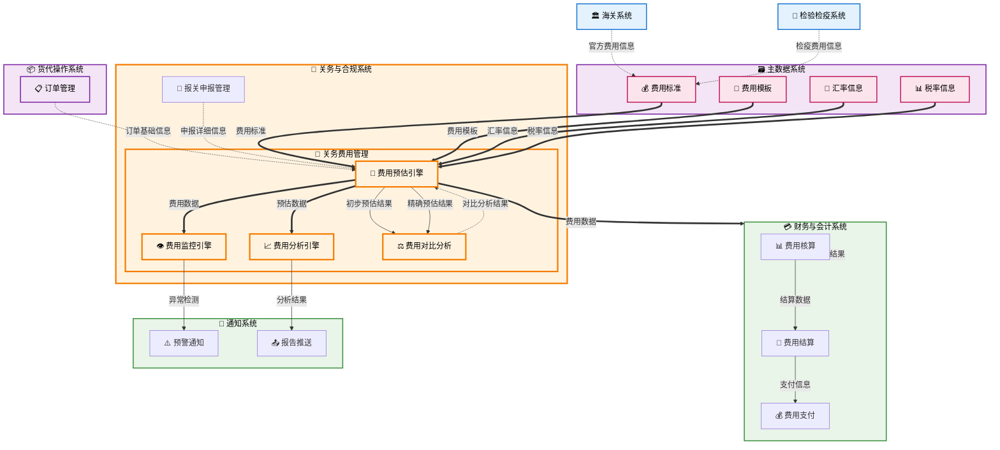

# 关务费用管理 (Customs Fee Management)

## 💡 新手提示：关务费用管理核心概念

在开始阅读关务费用管理功能前，请先理解以下关键概念：

*   **关务费用**：在进出口贸易过程中产生的各类费用，包括官方费用和服务费用
*   **官方费用**：海关、商检等政府部门收取的法定费用
*   **服务费用**：报关行、货代公司等提供服务收取的费用
*   **费用预估**：根据关务业务情况预估可能产生的各类费用
*   **费用分析**：对关务费用进行统计分析和趋势预测

### 关务费用管理范围
- **费用预估**：根据业务情况预估可能产生的关务费用
- **费用标准维护**：维护各类关务费用的标准和模板
- **费用分析**：提供关务费用的统计分析和报表
- **费用监控**：监控关务费用的异常和风险
- **数据接口**：向财务系统提供费用数据接口

**注意**：费用的实际核算、结算、支付等财务处理功能由财务与会计系统负责

### 费用类型
- **税费类**：关税、增值税、消费税等 (由 **[2.8 税费计算与缴纳](2.8%20税费计算与缴纳.md)** 模块计算并同步)
- **规费类**：报关费、查验费、检疫费等
- **服务费类**：代理费、仓储费、运输费等
- **杂费类**：加急费、改单费、滞期费等

## 功能概述

关务费用管理是关务与合规系统的重要组成部分，专注于关务相关费用的预估、标准维护和分析功能。系统主要负责关务费用的前期预估和后期分析，为企业提供关务成本控制的决策支持。

### 💡 核心辨析：与税费计算与缴纳的区别

本模块侧重于商业视角的成本管理，而 **[2.8 税费计算与缴纳](2.8%20税费计算与缴纳.md)** 侧重于法定视角的税收执行：

*   **2.8 负责"算税与交税"**：解决的是"要交给海关多少钱"的法定问题，强调合规性。
*   **2.9 负责"估费与控本"**：解决的是"这一单总共要花多少钱"的经营问题，强调盈利性。
*   **关系**：2.8 计算出的实际税费，是 2.9 进行最终成本分析的重要数据输入之一。

**🔍 业务价值说明**：

*   **费用预估**：准确预估各类关务费用，为业务决策提供依据
*   **标准管理**：维护费用标准和模板，确保预估准确性
*   **成本分析**：提供费用分析报表，支持成本控制决策
*   **风险监控**：监控费用异常，及时预警成本风险
*   **数据集成**：与财务系统无缝对接，确保数据一致性

**核心功能模块**：

*   **费用预估**：根据业务情况预估各类关务费用
*   **费用标准维护**：维护各类费用的标准和计算模板
*   **费用分析**：提供各类费用分析报表和趋势分析
*   **费用监控**：监控费用异常和风险预警

**与财务系统的分工**：
- **关务费用管理**：负责费用预估、标准维护、分析监控
- **财务与会计系统**：负责费用核算、结算、支付、核销等财务处理

## 菜单结构

    关务费用管理
    ├── 费用工作台                  # 费用管理的统一工作台
    ├── 费用预估管理                # 费用预估和报价
    ├── 费用分析报表                # 费用相关分析报表
    ├── 费用标准维护                # 费用标准和价格维护
    ├── 费用模板管理                # 费用计算模板管理
    ├── 费用监控预警                # 费用异常监控和风险预警
    └── 数据接口管理                # 与财务系统的数据接口

## 关务费用管理数据流转图



## 页面原型设计

### 费用工作台页面

    +----------------------------------------------------------+
    |  关务费用管理 > 费用工作台                  [批量预估] [导出] [刷新] |
    +----------------------------------------------------------+
    | 费用筛选：                                                 |
    | 报关单号：[________] 费用类型：[全部▼] 状态：[全部▼]        |
    | 业务日期：[开始日期] 至 [结束日期] 客户：[全部▼]            |
    | 金额范围：[最小] 至 [最大] 币种：[全部▼]    [搜索] [重置]   |
    +----------------------------------------------------------+
    | 报关单号     | 客户名称   | 费用类型 | 预估金额 | 预估状态 | 操作      |
    |-------------|-----------|---------|---------|---------|----------|
    | DEC-001     | ABC贸易   | 进口费用 | ¥15,000 | 已预估   | [查看][修改] |
    | DEC-002     | XYZ公司   | 出口费用 | ¥8,000  | 待预估   | [预估][模板] |
    | DEC-003     | 123企业   | 查验费用 | ¥2,000  | 已预估   | [查看][分析] |
    +----------------------------------------------------------+
    | 费用概览：                                                 |
    | 今日新增：25票 | 待预估：18票 | 已预估：156票 | 异常预警：3票 |
    | 本月预估总额：¥2,580,000 | 平均费用：¥8,600 | 费用增长：+5.2% |
    | 费用类型分布：关税 45% | 增值税 30% | 服务费 20% | 其他 5%    |
    +----------------------------------------------------------+
    | 重要提醒：                                                 |
    | • DEC-004 费用预估异常，超出标准范围20%，请检查            |
    | • DEC-005 查验费用异常，实际费用超出预估50%                |
    | • 本月汇率波动较大，建议及时调整费用标准                   |
    +----------------------------------------------------------+
    | 费用趋势分析：                                             |
    | 本周平均费用：¥12,500/票 | 上周：¥11,800/票 | 增长：5.9%  |
    | 费用构成：税费45% | 规费25% | 服务费20% | 其他10%        |
    +----------------------------------------------------------+
    | 共 256 条记录，第 1/26 页     [首页][上页][下页][末页]       |
    +----------------------------------------------------------+

### 费用预估管理页面

    +----------------------------------------------------------+
    |  关务费用管理 > 费用预估管理 > DEC-20231001-001             [保存] [提交] |
    +----------------------------------------------------------+
    | 基本信息：                                                 |
    | 报关单号：DEC-20231001-001    业务类型：进口               |
    | 客户名称：ABC贸易公司         业务日期：2023-10-01         |
    | 货物名称：电子测量设备        货值：USD 10,000             |
    | 预估人员：张三               预估日期：2023-10-01          |
    +----------------------------------------------------------+
    | 费用预估：                                                 |
    | 费用类型     | 费用项目   | 预估金额 | 计算基础 | 币种 | 备注     | 操作 |
    |-------------|-----------|---------|---------|------|---------|------|
    | 税费        | 关税       | ¥6,000  | 税率8%   | CNY  | 按标准   | [编辑] |
    | 税费        | 增值税     | ¥10,500 | 税率13%  | CNY  | 按标准   | [编辑] |
    | 规费        | 报关费     | ¥300    | 固定费用 | CNY  | 标准收费 | [编辑] |
    | 规费        | 查验费     | ¥500    | 预估     | CNY  | 可能查验 | [编辑] |
    | 服务费      | 代理费     | ¥1,000  | 按票收费 | CNY  | 标准     | [编辑] |
    | 服务费      | 仓储费     | ¥200    | 按天计算 | CNY  | 预计2天  | [编辑] |
    +----------------------------------------------------------+
    | 费用汇总：                                                 |
    | 税费小计：¥16,500 | 规费小计：¥800 | 服务费小计：¥1,200   |
    | 预估总计：¥18,500 | 风险系数：5% | 建议报价：¥19,425    |
    +----------------------------------------------------------+
    | 预估模板：                                                 |
    | 使用模板：[电子产品进口标准模板▼] [应用模板] [保存为模板]   |
    | 模板说明：适用于一般贸易进口电子产品的费用预估              |
    +----------------------------------------------------------+
    | 汇率信息：                                                 |
    | USD/CNY：7.3156 (2023-10-01) | EUR/CNY：7.7892           |
    | 汇率来源：中国银行          | 更新时间：2023-10-01 09:00  |
    +----------------------------------------------------------+
    | 预估说明：                                                 |
    | [电子测量设备，按8%关税和13%增值税预估，可能产生查验费用___] |
    |                                          [保存] [提交预估] |
    +----------------------------------------------------------+

### 费用分析报表页面

    +----------------------------------------------------------+
    |  关务费用管理 > 费用分析报表                [导出报表] [定制报表] |
    +----------------------------------------------------------+
    | 分析条件：                                                 |
    | 统计期间：[2023-10-01] 至 [2023-10-31]                    |
    | 客户范围：[全部客户▼] 费用类型：[全部类型▼]                |
    | 业务类型：[全部▼] 币种：[人民币▼]          [分析] [重置]   |
    +----------------------------------------------------------+
    | 费用趋势图：                                               |
    |    ¥                                                      |
    | 50000 |     ●                                             |
    |       |   ●   ●                                           |
    | 40000 | ●       ●                                         |
    |       |           ●                                       |
    | 30000 |             ●                                     |
    |       +---+---+---+---+---+---+---+---+---+---+         |
    |       1   5   10  15  20  25  30  (日期)                |
    +----------------------------------------------------------+
    | 费用构成分析：                                             |
    | 费用类型     | 金额      | 占比   | 同比增长 | 环比增长      |
    |-------------|----------|-------|---------|--------------|
    | 税费        | ¥580,000 | 65.2% | +8.5%   | +2.3%        |
    | 规费        | ¥180,000 | 20.2% | +12.1%  | +5.8%        |
    | 服务费      | ¥130,000 | 14.6% | +3.2%   | -1.2%        |
    | 合计        | ¥890,000 | 100%  | +7.8%   | +2.8%        |
    +----------------------------------------------------------+
    | 客户费用排行：                                             |
    | 排名 | 客户名称     | 费用金额  | 票数 | 平均费用 | 占比   |
    |------|-------------|----------|------|---------|-------|
    | 1    | ABC贸易     | ¥280,000 | 45   | ¥6,222  | 31.5% |
    | 2    | XYZ公司     | ¥180,000 | 32   | ¥5,625  | 20.2% |
    | 3    | 123企业     | ¥150,000 | 28   | ¥5,357  | 16.9% |
    +----------------------------------------------------------+
    | 异常分析：                                                 |
    | • 本月查验费用较上月增长25%，主要集中在电子产品类别        |
    | • ABC贸易客户平均费用较标准高出15%，建议优化报关流程       |
    | • 汇率波动导致美元计价商品费用增加约3%                     |
    +----------------------------------------------------------+

### 费用监控预警页面

    +----------------------------------------------------------+
    |  关务费用管理 > 费用监控预警                [设置预警] [处理预警] |
    +----------------------------------------------------------+
    | 预警概览：                                                 |
    | 今日预警：8条 | 本周预警：25条 | 本月预警：89条 | 已处理：156条 |
    +----------------------------------------------------------+
    | 预警列表：                                                 |
    | 预警时间     | 预警类型   | 报关单号    | 预警内容        | 状态   | 操作 |
    |-------------|-----------|------------|----------------|-------|------|
    | 10-02 09:30 | 费用异常   | DEC-001    | 查验费超标50%   | 待处理 | [处理] |
    | 10-02 10:15 | 汇率风险   | DEC-002    | 美元汇率波动5%  | 待处理 | [处理] |
    | 10-02 11:20 | 标准偏差   | DEC-003    | 费用超出标准20% | 已处理 | [查看] |
    +----------------------------------------------------------+
    | 预警规则设置：                                             |
    | 费用异常预警：                                             |
    | • 单票费用超出标准 [30%▼] 时触发预警                       |
    | • 客户月度费用增长超过 [25%▼] 时触发预警                   |
    | 汇率风险预警：                                             |
    | • 主要币种汇率波动超过 [3%▼] 时触发预警                    |
    | • 大额外币业务汇率风险敞口超过 [100000▼] 时预警            |
    +----------------------------------------------------------+
    | 风险监控仪表板：                                           |
    | 费用风险指数：[████████░░] 80/100 (较高)                  |
    | 汇率风险指数：[██████░░░░] 60/100 (中等)                  |
    | 合规风险指数：[███░░░░░░░] 30/100 (较低)                  |
    +----------------------------------------------------------+
    | 申请人：张三 | 申请时间：2023-10-02 10:30                   |
    | 审批状态：待财务审核                                       |
    | 审批意见：[金额核对无误，同意支付_______________]           |
    |                                          [提交申请]       |
    +----------------------------------------------------------+

## 业务流程

### 💡 新手提示：业务流程阅读指南

关务费用管理是外贸业务的重要环节，涉及费用预估、核算、结算和支付四个关键阶段。每个步骤都包含：

*   **业务动作**：具体要执行的操作
*   **系统交互**：涉及的系统间调用和数据传递
*   **决策点**：需要人工判断或系统自动判断的关键节点
*   **异常处理**：可能出现的问题和解决方案

新手需要特别注意税率查询的准确性、汇率的时效性，以及各类费用的分类管理。建议先熟悉海关税费政策和公司收费标准。

### 📊 费用预估流程

1.  **初步费用预估（订单阶段）**：基于订单信息进行初步费用预估
    > **新手说明**：这是费用预估的第一阶段，基于订单基础信息快速给出初步费用估算，帮助客户了解大概成本
    *   **🔗 跨系统触发**：关务与合规（关务费用管理） → 货代操作（订单管理） **【查询数据】**
        *   **调用方式**：RESTful API (GET /api/order/declaration-info)
        *   **调用时机**：订单创建完成后自动触发初步费用预估
        *   **数据操作**：
            *   **数据读取**：从货代操作（订单管理）的 orders (订单主表) 表、order_items (订单明细表) 表读取订单基础信息
            *   **数据查询**：在货代操作（订单管理）的 declaration_info (报关信息表) 表中查询报关相关信息
            *   **数据返回**：向关务费用管理返回完整的报关单基础数据
        *   **入参**：`{order_id, declaration_type, estimation_level}`
            *   `order_id` (订单ID): string，订单在系统中的唯一标识符，用于获取订单基础信息
            *   `declaration_type` (报关类型): enum (IMPORT/EXPORT)，进口或出口报关类型
            *   `estimation_level` (预估级别): enum (PRELIMINARY)，标识为初步预估
        *   **出参**：`{declaration_info, cargo_value, estimation_accuracy, preliminary_fees}`
            *   `declaration_info` (报关单基础信息): object，包含商品信息、贸易方式、原产地等基础数据
            *   `cargo_value` (货物价值): decimal，用于税费计算的货物价值
            *   `estimation_accuracy` (预估准确度): string，标识当前预估的准确度级别为"PRELIMINARY"
            *   `preliminary_fees` (初步费用): object，基于订单信息计算的初步费用估算

2.  **精确费用预估（申报阶段）**：基于完整申报信息进行精确费用预估
    > **新手说明**：这是费用预估的第二阶段，利用完整的申报信息和补充资料，提供更准确的费用预估
    *   **🔗 系统内流转**：关务与合规（关务费用管理） → 关务与合规（报关申报管理） **【查询数据】**
        *   **调用方式**：RESTful API (GET /api/declaration/supplementary-details)
        *   **调用时机**：报关申报完成后自动触发精确费用预估
        *   **数据操作**：
            *   **数据读取**：从报关申报管理的 declarations (报关单主表) 表读取申报基础信息
            *   **数据查询**：在报关申报管理的 declaration_items (报关单明细表) 表中查询商品详细信息
            *   **补充信息获取**：获取优惠政策信息、特殊监管条件、价格审核信息、检验检疫要求、减免税申请信息
        *   **入参**：`{declaration_id, supplementary_info_required, precision_level}`
            *   `declaration_id` (申报单ID): string，报关申报单的唯一标识符
            *   `supplementary_info_required` (需要补充信息): array，需要获取的补充信息类型列表
            *   `precision_level` (精确度级别): enum (PRECISE)，标识为精确预估
        *   **出参**：`{complete_declaration_info, supplementary_details, precise_fees, confidence_level}`
            *   `complete_declaration_info` (完整申报信息): object，包含所有申报相关的详细信息
            *   `supplementary_details` (补充详情): object，优惠政策、特殊条件等补充信息
            *   `precise_fees` (精确费用): object，基于完整信息计算的精确费用预估
            *   `confidence_level` (置信度): decimal，预估结果的置信度百分比

3.  **费用对比分析**：对比初步预估和精确预估的差异，优化预估模型
    > **新手说明**：通过对比两个阶段的预估结果，分析差异原因，持续优化预估算法的准确性
    *   **🔄 系统内流转**：关务费用管理内部分析 **【分析数据】**
        *   **调用方式**：内部函数调用 (performComparisonAnalysis)
        *   **调用时机**：精确预估完成后自动执行对比分析
        *   **数据操作**：
            *   **数据对比**：对比初步预估和精确预估的费用差异
            *   **差异分析**：分析造成差异的具体原因和影响因素
            *   **模型优化**：根据分析结果调整预估算法参数
        *   **入参**：`{preliminary_estimation_id, precise_estimation_id, analysis_scope}`
            *   `preliminary_estimation_id` (初步预估ID): string，初步预估记录的唯一标识
            *   `precise_estimation_id` (精确预估ID): string，精确预估记录的唯一标识
            *   `analysis_scope` (分析范围): object，指定分析的维度和深度
        *   **出参**：`{comparison_result, variance_analysis, optimization_suggestions, model_updates}`
            *   `comparison_result` (对比结果): object，两次预估的详细对比数据
            *   `variance_analysis` (差异分析): object，差异原因和影响因素分析
            *   `optimization_suggestions` (优化建议): array，针对预估模型的改进建议
            *   `model_updates` (模型更新): object，应用于预估算法的参数调整


### 📊 费用分析流程

1.  **收集费用预估数据**：收集历史费用预估数据，为分析提供数据基础
    > **新手说明**：这是费用分析的第一步，系统会自动收集指定期间内的费用预估记录，并进行数据清洗和分组
    *   **🔄 系统内流转**：关务费用管理内部查询 **【汇总数据】**
        *   **调用方式**：内部函数调用 (collectEstimationData)
        *   **调用时机**：定期执行费用分析时收集数据
        *   **数据操作**：
            *   **数据汇总**：汇总指定期间内的费用预估记录
            *   **数据分组**：按时间、客户、商品类别等维度分组
            *   **数据清洗**：清理异常数据，确保分析准确性
        *   **入参**：`{analysis_period, analysis_dimensions, data_quality_requirements}`
            *   `analysis_period` (分析周期): object，分析的时间范围，包含开始和结束日期
            *   `analysis_dimensions` (分析维度): array，分析的维度类别，如客户、商品、贸易方式等
            *   `data_quality_requirements` (数据质量要求): object，数据清洗和验证的标准
        *   **出参**：`{estimation_summary, data_quality_report, analysis_ready_data}`
            *   `estimation_summary` (预估数据汇总): array，按维度汇总的费用预估数据
            *   `data_quality_report` (数据质量报告): object，数据完整性和准确性评估结果
            *   `analysis_ready_data` (可用于分析的数据集): object，经过清洗和格式化的分析数据

2.  **执行费用趋势分析**：分析费用变化趋势，识别成本波动规律
    > **新手说明**：系统使用统计方法和机器学习算法分析费用趋势，生成预测模型和可视化图表
    *   **🔄 系统内流转**：关务费用管理内部分析 **【分析数据】**
        *   **调用方式**：内部函数调用 (analyzeFeesTrend)
        *   **调用时机**：收集数据后执行趋势分析
        *   **数据操作**：
            *   **数据分析**：使用统计方法分析费用趋势
            *   **数据建模**：建立费用预测模型
            *   **数据可视化**：生成趋势图表和报告
        *   **入参**：`{analysis_data, trend_indicators, analysis_methods}`
            *   `analysis_data` (分析数据): object，经过预处理的费用数据
            *   `trend_indicators` (趋势指标): array，需要分析的趋势指标，如平均费用、费用方差、季节性模式等
            *   `analysis_methods` (分析方法): array，使用的分析算法和统计方法
        *   **出参**：`{trend_analysis, forecast_data, insights, visualization_data}`
            *   `trend_analysis` (趋势分析结果): object，费用变化趋势的详细分析结果
            *   `forecast_data` (费用预测数据): object，基于历史数据的费用预测
            *   `insights` (分析洞察和建议): array，系统生成的业务洞察和优化建议
            *   `visualization_data` (可视化数据): object，用于生成图表的数据

3.  **生成费用分析报告**：生成标准化的费用分析报告
    > **新手说明**：系统自动整理分析结果，生成标准格式的费用分析报告，包含图表、数据表格和分析结论
    *   **🔄 系统内流转**：关务费用管理内部生成 **【创建数据】**
        *   **调用方式**：内部函数调用 (generateAnalysisReport)
        *   **调用时机**：完成趋势分析后生成报告
        *   **数据操作**：
            *   **数据整理**：整理分析结果生成报告
            *   **数据格式化**：格式化报告内容和图表
            *   **数据存储**：保存报告到系统中
        *   **入参**：`{analysis_results, report_template, report_recipients, customization_options}`
            *   `analysis_results` (分析结果): object，完整的费用分析结果数据
            *   `report_template` (报告模板): string，使用的报告模板类型
            *   `report_recipients` (报告接收人): array，报告的目标接收人列表
            *   `customization_options` (定制选项): object，报告的个性化设置
        *   **出参**：`{report_id, report_url, generation_status, report_metadata}`
            *   `report_id` (报告ID): string，生成报告的唯一标识符
            *   `report_url` (报告访问链接): string，报告的在线访问地址
            *   `generation_status` (生成状态): enum (SUCCESS/FAILED/PROCESSING)，报告生成状态
            *   `report_metadata` (报告元数据): object，报告的基本信息和统计数据

4.  **推送分析结果给相关人员**：将费用分析结果推送给管理层和相关业务人员
    > **新手说明**：系统通过多种渠道（邮件、系统消息、移动推送等）将分析报告推送给相关人员，并跟踪查看状态
    *   **🔗 跨系统触发**：关务与合规（关务费用管理） → 通知系统 **【推送数据】**
        *   **调用方式**：RESTful API (POST /api/notification/send-analysis-report)
        *   **调用时机**：生成分析报告后推送
        *   **数据操作**：
            *   **数据推送**：通过邮件、系统消息等方式推送报告
            *   **数据跟踪**：跟踪报告查看状态
            *   **数据反馈**：收集用户对报告的反馈
        *   **入参**：`{report_id, recipients, notification_channels, delivery_options}`
            *   `report_id` (报告ID): string，要推送的报告唯一标识符
            *   `recipients` (接收人列表): array，报告接收人的详细信息
            *   `notification_channels` (通知渠道): array，推送渠道类型，如邮件、短信、系统消息等
            *   `delivery_options` (推送选项): object，推送的时间安排和优先级设置
        *   **出参**：`{notification_id, delivery_status, delivery_time, tracking_info}`
            *   `notification_id` (通知ID): string，推送任务的唯一标识符
            *   `delivery_status` (推送状态): enum (SENT/DELIVERED/FAILED)，推送执行状态
            *   `delivery_time` (推送时间): datetime，实际推送完成的时间
            *   `tracking_info` (跟踪信息): object，推送结果的详细跟踪数据

### 📋 费用监控流程

1.  **设置监控规则和阈值**：设置费用监控的规则和预警阈值
    > **新手说明**：这是费用监控的基础配置步骤，需要根据业务特点设置合理的监控规则和预警阈值
    *   **🔄 系统内流转**：关务费用管理内部配置 **【配置数据】**
        *   **调用方式**：内部函数调用 (configureMonitoringRules)
        *   **调用时机**：系统初始化或规则更新时配置
        *   **数据操作**：
            *   **数据配置**：设置监控规则和阈值参数
            *   **数据验证**：验证规则的有效性和合理性
            *   **数据存储**：保存监控配置到系统中
        *   **入参**：`{monitoring_rules, alert_levels, monitoring_scope}`
            *   `monitoring_rules` (监控规则): array，费用监控的具体规则配置
            *   `alert_levels` (预警级别): array，不同程度的预警级别设置
            *   `monitoring_scope` (监控范围): object，监控的业务范围和数据范围
        *   **出参**：`{configuration_id, active_rules, validation_result, effective_time}`
            *   `configuration_id` (配置ID): string，监控配置的唯一标识符
            *   `active_rules` (生效的监控规则): array，当前生效的所有监控规则
            *   `validation_result` (配置验证结果): object，规则配置的验证结果和建议
            *   `effective_time` (生效时间): datetime，配置开始生效的时间

2.  **实时监控费用数据**：实时监控费用数据，检测异常情况
    > **新手说明**：系统会定期检查费用数据的变化，通过与历史数据和设定阈值的对比来识别异常情况
    *   **🔄 系统内流转**：关务费用管理内部监控 **【监控数据】**
        *   **调用方式**：定时任务调用 (monitorFeesRealtime)
        *   **调用时机**：定期执行实时监控检查
        *   **数据操作**：
            *   **数据检查**：检查最新的费用数据
            *   **数据对比**：与历史数据和阈值进行对比
            *   **数据标记**：标记异常数据和风险点
        *   **入参**：`{monitoring_scope, check_interval, analysis_depth}`
            *   `monitoring_scope` (监控范围): object，需要监控的业务范围和数据类型
            *   `check_interval` (检查间隔): integer，监控检查的时间间隔（分钟）
            *   `analysis_depth` (分析深度): enum (BASIC/DETAILED/COMPREHENSIVE)，数据分析的深度级别
        *   **出参**：`{monitoring_status, detected_anomalies, risk_indicators, trend_analysis}`
            *   `monitoring_status` (监控状态): enum (NORMAL/WARNING/CRITICAL)，当前监控状态
            *   `detected_anomalies` (检测到的异常): array，发现的异常数据和异常类型
            *   `risk_indicators` (风险指标): array，当前的风险指标和风险等级
            *   `trend_analysis` (趋势分析): object，费用数据的变化趋势分析

3.  **触发预警通知**：当检测到异常时，触发相应级别的预警通知
    > **新手说明**：系统会根据异常的严重程度自动发送不同级别的预警通知，确保相关人员及时了解并处理异常情况
    *   **🔗 跨系统触发**：关务费用管理 → 通知系统 **【发送预警】**
        *   **调用方式**：RESTful API (POST /api/alert/send-fee-warning)
        *   **调用时机**：检测到异常时立即触发
        *   **数据操作**：
            *   **数据分析**：分析异常的严重程度和影响范围
            *   **数据通知**：发送预警通知给相关人员
            *   **数据记录**：记录预警事件和处理过程
        *   **入参**：`{anomaly_data, alert_level, affected_scope, notification_preferences}`
            *   `anomaly_data` (异常数据): object，检测到的异常数据详情和分析结果
            *   `alert_level` (预警级别): enum (WARNING/CRITICAL/EMERGENCY)，预警的严重程度级别
            *   `affected_scope` (影响范围): object，异常影响的业务范围和相关订单
            *   `notification_preferences` (通知偏好): object，接收人的通知方式偏好设置
        *   **出参**：`{alert_id, notification_status, escalation_plan, response_tracking}`
            *   `alert_id` (预警ID): string，预警事件的唯一标识符
            *   `notification_status` (通知状态): enum (SENT/DELIVERED/FAILED)，通知发送状态
            *   `escalation_plan` (升级处理计划): object，预警升级和处理的计划安排
            *   `response_tracking` (响应跟踪): object，预警响应和处理进度的跟踪信息

## 核心功能扩展

### 智能费用预估引擎

```python
class IntelligentFeeEstimation:
    """智能费用预估引擎 - 支持多阶段预估"""
    
    def __init__(self):
        self.ml_model = self.load_fee_prediction_model()
        self.historical_data = self.load_historical_fee_data()
        
    def estimate_customs_fees(self, declaration_info, estimation_stage='preliminary'):
        """智能预估关务费用 - 支持初步预估和精确预估"""
        
        if estimation_stage == 'preliminary':
            return self.preliminary_estimation(declaration_info)
        elif estimation_stage == 'precise':
            return self.precise_estimation(declaration_info)
        else:
            raise ValueError("Invalid estimation stage")
    
    def preliminary_estimation(self, declaration_info):
        """初步费用预估（基于订单信息）"""
        # 基础费用计算（使用标准税率）
        base_fees = self.calculate_base_fees(declaration_info)
        
        # 历史数据分析（相似商品的费用模式）
        historical_pattern = self.analyze_historical_pattern(declaration_info)
        
        # 机器学习预测（基于基础信息）
        ml_prediction = self.ml_model.predict_preliminary(declaration_info)
        
        # 综合预估结果（保守估算）
        estimated_fees = self.combine_preliminary_estimations(
            base_fees, historical_pattern, ml_prediction
        )
        
        return {
            'estimation_stage': 'preliminary',
            'total_estimated_amount': estimated_fees['total'],
            'fee_breakdown': estimated_fees['breakdown'],
            'confidence_level': estimated_fees['confidence'],  # 通常为60-75%
            'accuracy_range': '±15-25%',  # 预估误差范围
            'risk_factors': estimated_fees['risks'],
            'recommendations': self.generate_preliminary_recommendations(estimated_fees),
            'next_steps': ['完成报关申报后可获得更精确预估']
        }
    
    def precise_estimation(self, declaration_info):
        """精确费用预估（基于完整申报信息）"""
        # 获取申报补充信息
        supplementary_info = declaration_info.get('supplementary_details', {})
        
        # 精确费用计算（考虑优惠政策、特殊监管等）
        precise_fees = self.calculate_precise_fees(declaration_info, supplementary_info)
        
        # 深度历史分析（完全匹配的案例）
        detailed_pattern = self.analyze_detailed_historical_pattern(declaration_info)
        
        # 高精度机器学习预测
        precise_ml_prediction = self.ml_model.predict_precise(declaration_info)
        
        # 综合精确预估结果
        estimated_fees = self.combine_precise_estimations(
            precise_fees, detailed_pattern, precise_ml_prediction
        )
        
        return {
            'estimation_stage': 'precise',
            'total_estimated_amount': estimated_fees['total'],
            'fee_breakdown': estimated_fees['breakdown'],
            'confidence_level': estimated_fees['confidence'],  # 通常为85-95%
            'accuracy_range': '±3-8%',  # 预估误差范围
            'risk_factors': estimated_fees['risks'],
            'applied_preferences': supplementary_info.get('preferential_policies', []),
            'special_conditions': supplementary_info.get('special_supervision', []),
            'recommendations': self.generate_precise_recommendations(estimated_fees)
        }
    
    def calculate_base_fees(self, declaration_info):
        """计算基础费用（初步预估用）"""
        fees = {}
        
        # 使用标准税率进行税费计算
        customs_duty = self.calculate_customs_duty(declaration_info)
        vat = self.calculate_vat(declaration_info)
        consumption_tax = self.calculate_consumption_tax(declaration_info)
        
        fees['taxes'] = {
            'customs_duty': customs_duty,
            'vat': vat,
            'consumption_tax': consumption_tax
        }
        
        return fees
    
    def calculate_precise_fees(self, declaration_info, supplementary_info):
        """计算精确费用（考虑申报补充信息）"""
        fees = {}
        
        # 考虑优惠政策的税费计算
        preferential_origin = supplementary_info.get('preferential_origin')
        duty_exemption = supplementary_info.get('duty_exemption')
        
        customs_duty = self.calculate_preferential_customs_duty(
            declaration_info, preferential_origin, duty_exemption
        )
        vat = self.calculate_adjusted_vat(declaration_info, supplementary_info)
        consumption_tax = self.calculate_adjusted_consumption_tax(
            declaration_info, supplementary_info
        )
        
        # 考虑特殊监管条件的额外费用
        special_fees = self.calculate_special_supervision_fees(
            supplementary_info.get('special_supervision', [])
        )
        
        # 考虑检验检疫要求的费用
        inspection_fees = self.calculate_inspection_fees(
            supplementary_info.get('inspection_required', False)
        )
        
        fees['taxes'] = {
            'customs_duty': customs_duty,
            'vat': vat,
            'consumption_tax': consumption_tax
        }
        
        fees['special_fees'] = special_fees
        fees['inspection_fees'] = inspection_fees
        
        return fees
        
        # 规费计算
        declaration_fee = self.calculate_declaration_fee(declaration_info)
        inspection_fee = self.calculate_inspection_fee(declaration_info)
        
        fees['regulatory_fees'] = {
            'declaration_fee': declaration_fee,
            'inspection_fee': inspection_fee
        }
        
        # 服务费计算
        agency_fee = self.calculate_agency_fee(declaration_info)
        storage_fee = self.calculate_storage_fee(declaration_info)
        
        fees['service_fees'] = {
            'agency_fee': agency_fee,
            'storage_fee': storage_fee
        }
        
        return fees
    
    def analyze_historical_pattern(self, declaration_info):
        """分析历史费用模式"""
        similar_cases = self.find_similar_historical_cases(declaration_info)
        
        if not similar_cases:
            return None
            
        # 计算历史平均费用
        avg_fees = self.calculate_average_fees(similar_cases)
        
        # 分析费用趋势
        fee_trend = self.analyze_fee_trend(similar_cases)
        
        # 识别异常情况
        anomalies = self.identify_fee_anomalies(similar_cases)
        
        return {
            'average_fees': avg_fees,
            'trend': fee_trend,
            'anomalies': anomalies,
            'sample_size': len(similar_cases)
        }
```

### 费用差异分析引擎

```python
class FeeVarianceAnalysis:
    """费用差异分析引擎"""
    
    def __init__(self):
        self.variance_threshold = 0.1  # 10%差异阈值
        self.analysis_rules = self.load_variance_rules()
        
    def analyze_fee_variance(self, estimated_fees, actual_fees):
        """分析费用差异"""
        variance_analysis = {}
        
        # 计算总体差异
        total_variance = self.calculate_total_variance(estimated_fees, actual_fees)
        variance_analysis['total_variance'] = total_variance
        
        # 分类差异分析
        category_variances = self.analyze_category_variances(estimated_fees, actual_fees)
        variance_analysis['category_variances'] = category_variances
        
        # 差异原因分析
        variance_reasons = self.identify_variance_reasons(estimated_fees, actual_fees)
        variance_analysis['variance_reasons'] = variance_reasons
        
        # 改进建议
        improvement_suggestions = self.generate_improvement_suggestions(variance_analysis)
        variance_analysis['improvement_suggestions'] = improvement_suggestions
        
        return variance_analysis
    
    def calculate_total_variance(self, estimated, actual):
        """计算总体差异"""
        estimated_total = sum(estimated.values())
        actual_total = sum(actual.values())
        
        if estimated_total == 0:
            return 0
            
        variance_amount = actual_total - estimated_total
        variance_rate = variance_amount / estimated_total
        
        return {
            'variance_amount': variance_amount,
            'variance_rate': variance_rate,
            'variance_level': self.classify_variance_level(abs(variance_rate))
        }
    
    def identify_variance_reasons(self, estimated, actual):
        """识别差异原因"""
        reasons = []
        
        # 检查汇率变动
        if self.check_exchange_rate_impact(estimated, actual):
            reasons.append({
                'reason': 'exchange_rate_fluctuation',
                'description': '汇率波动导致费用差异',
                'impact': 'medium'
            })
        
        # 检查税率调整
        if self.check_tax_rate_changes(estimated, actual):
            reasons.append({
                'reason': 'tax_rate_adjustment',
                'description': '税率调整导致费用变化',
                'impact': 'high'
            })
        
        # 检查查验费用
        if self.check_inspection_fees(estimated, actual):
            reasons.append({
                'reason': 'additional_inspection',
                'description': '额外查验产生费用',
                'impact': 'low'
            })
        
        return reasons
```

### 费用风险预警引擎

```python
class FeeRiskWarning:
    """费用风险预警引擎"""
    
    def __init__(self):
        self.risk_rules = self.load_risk_rules()
        self.warning_thresholds = self.load_warning_thresholds()
        
    def monitor_fee_risks(self):
        """监控费用风险"""
        risk_alerts = []
        
        # 费用异常监控
        fee_anomalies = self.detect_fee_anomalies()
        if fee_anomalies:
            risk_alerts.extend(self.create_anomaly_alerts(fee_anomalies))
        
        # 汇率风险监控
        exchange_risks = self.monitor_exchange_rate_risks()
        if exchange_risks:
            risk_alerts.extend(self.create_exchange_rate_alerts(exchange_risks))
        
        # 逾期风险监控
        overdue_risks = self.monitor_overdue_payments()
        if overdue_risks:
            risk_alerts.extend(self.create_overdue_alerts(overdue_risks))
        
        # 发送风险预警
        if risk_alerts:
            self.send_risk_notifications(risk_alerts)
        
        return risk_alerts
    
    def detect_fee_anomalies(self):
        """检测费用异常"""
        anomalies = []
        
        # 检查费用差异过大的情况
        large_variances = self.query_large_fee_variances()
        for variance in large_variances:
            if variance['variance_rate'] > self.warning_thresholds['variance_rate']:
                anomalies.append({
                    'type': 'large_variance',
                    'declaration_no': variance['declaration_no'],
                    'variance_rate': variance['variance_rate'],
                    'risk_level': 'high'
                })
        
        # 检查费用金额异常
        unusual_amounts = self.query_unusual_fee_amounts()
        for amount in unusual_amounts:
            anomalies.append({
                'type': 'unusual_amount',
                'declaration_no': amount['declaration_no'],
                'amount': amount['amount'],
                'risk_level': 'medium'
            })
        
        return anomalies
```

## API接口设计

### 费用预估接口

#### 1. 初步费用预估（基于订单信息）

```json
POST /api/customs/fee-estimation/preliminary
{
  "order_no": "ORD202312150001",          // 订单号
  "trade_mode": "general_trade",           // 贸易方式
  "commodity_info": [                      // 商品信息列表（基础信息）
    {
      "hs_code": "8471301000",            // HS编码（可能不够精确）
      "quantity": 100,                    // 数量
      "unit_price": 500.00,               // 单价
      "total_value": 50000.00,            // 总价值
      "origin_country": "US"              // 原产国
    }
  ],
  "estimation_type": "import",             // 预估类型：进口/出口
  "currency": "USD",                       // 申报币种
  "exchange_rate_date": "2023-12-15"      // 汇率日期
}

Response:
{
  "estimation_id": "EST202312150001",      // 预估单号
  "estimation_stage": "preliminary",       // 预估阶段
  "order_no": "ORD202312150001",          // 订单号
  "estimated_fees": [                      // 预估费用列表
    {
      "fee_type": "customs_duty",          // 费用类型：关税
      "fee_name": "进口关税",              // 费用名称
      "calculation_base": 50000.00,        // 计算基数
      "rate": 0.10,                       // 费率（标准税率）
      "amount": 5000.00,                  // 费用金额
      "currency": "CNY"                   // 币种
    },
    {
      "fee_type": "vat",                  // 费用类型：增值税
      "fee_name": "进口增值税",            // 费用名称
      "calculation_base": 55000.00,        // 计算基数
      "rate": 0.13,                       // 费率
      "amount": 7150.00,                  // 费用金额
      "currency": "CNY"                   // 币种
    }
  ],
  "total_amount": 12150.00,               // 总金额
  "currency": "CNY",                      // 币种
  "exchange_rate": 7.2000,                // 汇率
  "confidence_level": 0.65,               // 置信度（65%）
  "accuracy_range": "±20%",               // 预估误差范围
  "estimation_date": "2023-12-15T10:30:00Z",  // 预估日期
  "status": "preliminary_completed",       // 状态
  "next_steps": [                         // 后续步骤
    "完成报关申报后可获得更精确预估"
  ],
  "risk_factors": [                       // 风险因素
    "HS编码可能需要进一步细化",
    "优惠政策适用性待确认"
  ]
}
```

#### 2. 精确费用预估（基于完整申报信息）

```json
POST /api/customs/fee-estimation/precise
{
  "declaration_no": "DECL202312150001",    // 报关单号
  "order_no": "ORD202312150001",          // 关联订单号
  "trade_mode": "general_trade",           // 贸易方式
  "commodity_info": [                      // 商品信息列表（完整信息）
    {
      "hs_code": "8471301000",            // 精确HS编码
      "quantity": 100,                    // 数量
      "unit_price": 500.00,               // 单价
      "total_value": 50000.00,            // 总价值
      "origin_country": "US",             // 原产国
      "brand": "DELL",                    // 品牌
      "model": "OptiPlex 7090"            // 型号
    }
  ],
  "supplementary_details": {              // 申报补充信息
    "preferential_policies": [            // 优惠政策
      {
        "policy_type": "fta_agreement",   // 政策类型：自贸协定
        "agreement_name": "RCEP",         // 协定名称
        "certificate_no": "CERT001"       // 证书编号
      }
    ],
    "special_supervision": [              // 特殊监管条件
      {
        "condition_code": "A",            // 监管条件代码
        "condition_name": "入境货物通关单", // 监管条件名称
        "certificate_required": true      // 是否需要证书
      }
    ],
    "inspection_required": true,          // 是否需要检验检疫
    "duty_exemption": {                   // 减免税信息
      "exemption_type": "processing_trade", // 减免税类型
      "exemption_rate": 0.5               // 减免比例
    },
    "price_assessment": {                 // 价格审核信息
      "assessment_method": "transaction_value", // 估价方法
      "related_party": false,             // 是否关联方交易
      "price_influences": []              // 价格影响因素
    }
  },
  "estimation_type": "import",             // 预估类型：进口/出口
  "currency": "USD",                       // 申报币种
  "exchange_rate_date": "2023-12-15"      // 汇率日期
}

Response:
{
  "estimation_id": "EST202312150002",      // 预估单号
  "estimation_stage": "precise",          // 预估阶段
  "declaration_no": "DECL202312150001",    // 报关单号
  "order_no": "ORD202312150001",          // 关联订单号
  "estimated_fees": [                      // 预估费用列表
    {
      "fee_type": "customs_duty",          // 费用类型：关税
      "fee_name": "进口关税",              // 费用名称
      "calculation_base": 50000.00,        // 计算基数
      "standard_rate": 0.10,              // 标准税率
      "preferential_rate": 0.05,          // 优惠税率
      "applied_rate": 0.05,               // 实际适用税率
      "amount": 2500.00,                  // 费用金额
      "currency": "CNY",                  // 币种
      "preferential_policy": "RCEP协定"    // 适用优惠政策
    },
    {
      "fee_type": "vat",                  // 费用类型：增值税
      "fee_name": "进口增值税",            // 费用名称
      "calculation_base": 52500.00,        // 计算基数
      "rate": 0.13,                       // 费率
      "amount": 6825.00,                  // 费用金额
      "currency": "CNY"                   // 币种
    },
    {
      "fee_type": "inspection_fee",        // 费用类型：检验检疫费
      "fee_name": "检验检疫费",            // 费用名称
      "calculation_base": 50000.00,        // 计算基数
      "rate": 0.001,                      // 费率
      "amount": 50.00,                    // 费用金额
      "currency": "CNY"                   // 币种
    }
  ],
  "total_amount": 9375.00,                // 总金额
  "currency": "CNY",                      // 币种
  "exchange_rate": 7.2000,                // 汇率
  "confidence_level": 0.92,               // 置信度（92%）
  "accuracy_range": "±5%",                // 预估误差范围
  "applied_preferences": [                // 适用的优惠政策
    {
      "policy_name": "RCEP协定",
      "savings_amount": 2500.00,          // 节省金额
      "savings_rate": 0.21                // 节省比例
    }
  ],
  "special_conditions": [                 // 特殊条件
    "需要提供入境货物通关单",
    "需要进行检验检疫"
  ],
  "estimation_date": "2023-12-15T14:30:00Z",  // 预估日期
  "status": "precise_completed"           // 状态
}
```

### 费用分析接口

```json
POST /api/customs/fee-analysis
{
  "analysis_type": "trend_analysis",       // 分析类型：趋势分析
  "analysis_period": {                     // 分析周期
    "start_date": "2023-01-01",           // 开始日期
    "end_date": "2023-12-31"              // 结束日期
  },
  "analysis_dimensions": [                 // 分析维度
    "customer",                           // 客户维度
    "commodity",                          // 商品维度
    "trade_mode"                          // 贸易方式维度
  ],
  "filters": {                            // 过滤条件
    "customer_ids": ["CUST001", "CUST002"], // 客户ID列表
    "hs_codes": ["8471301000"],           // HS编码列表
    "min_amount": 1000.00                 // 最小金额
  }
}

Response:
{
  "analysis_id": "ANA202312150001",        // 分析ID
  "analysis_type": "trend_analysis",       // 分析类型
  "analysis_results": {                    // 分析结果
    "trend_data": [                        // 趋势数据
      {
        "period": "2023-01",               // 时间周期
        "total_amount": 125000.00,         // 总金额
        "average_amount": 2500.00,         // 平均金额
        "transaction_count": 50            // 交易笔数
      }
    ],
    "insights": [                          // 分析洞察
      {
        "type": "cost_increase",           // 洞察类型
        "description": "关税成本较上月增长15%", // 描述
        "impact_level": "medium"           // 影响程度
      }
    ]
  },
  "generated_at": "2023-12-15T14:20:00Z"  // 生成时间
}
```

### 费用监控接口

```json
POST /api/customs/fee-monitoring/configure
{
  "monitoring_rules": [                    // 监控规则
    {
      "rule_type": "variance_threshold",   // 规则类型：差异阈值
      "threshold": 0.15,                  // 阈值：15%
      "comparison_period": "last_month",   // 对比周期
      "alert_level": "warning"            // 预警级别
    },
    {
      "rule_type": "amount_threshold",     // 规则类型：金额阈值
      "threshold": 50000.00,              // 阈值金额
      "alert_level": "critical"           // 预警级别
    }
  ],
  "notification_settings": {              // 通知设置
    "channels": ["email", "sms"],         // 通知渠道
    "recipients": ["admin@company.com"]   // 接收人
  }
}

Response:
{
  "configuration_id": "MON202312150001",   // 配置ID
  "active_rules": 2,                      // 生效规则数
  "status": "active",                     // 状态
  "created_at": "2023-12-15T16:00:00Z"   // 创建时间
}
```

### 费用标准维护接口

```json
POST /api/customs/fee-standards
{
  "standard_type": "tax_rate",            // 标准类型：税率标准
  "hs_code": "8471301000",               // HS编码
  "country_code": "US",                   // 国家代码
  "rate_info": {                         // 费率信息
    "customs_duty_rate": 0.10,           // 关税税率
    "vat_rate": 0.13,                    // 增值税税率
    "consumption_tax_rate": 0.00         // 消费税税率
  },
  "effective_date": "2024-01-01",        // 生效日期
  "expiry_date": "2024-12-31"            // 失效日期
}

Response:
{
  "standard_id": "STD202312150001",       // 标准ID
  "status": "active",                     // 状态
  "created_at": "2023-12-15T17:00:00Z"   // 创建时间
}
```
## 测试用例

### 功能测试用例

| 测试场景 | 测试步骤 | 预期结果 |
|---------|---------|---------|
| 费用预估 | 1. 输入报关单信息<br>2. 选择费用类型<br>3. 执行预估计算 | 生成准确的费用预估清单 |
| 费用核算 | 1. 选择待核算报关单<br>2. 确认费用项目<br>3. 执行核算 | 核算完成，生成费用明细 |
| 费用结算 | 1. 选择已核算费用<br>2. 确认结算金额<br>3. 生成结算单 | 结算单生成成功，状态更新 |
| 费用支付 | 1. 选择待支付费用<br>2. 选择支付方式<br>3. 执行支付 | 支付成功，更新支付状态 |

### 异常处理测试

| 异常场景 | 测试方法 | 预期处理 |
|---------|---------|---------|
| 费用计算错误 | 输入异常数据 | 显示错误提示，阻止提交 |
| 支付失败 | 模拟支付接口异常 | 回滚操作，记录失败日志 |
| 汇率获取失败 | 断开汇率服务 | 使用默认汇率，发出警告 |
| 权限不足 | 无权限用户操作 | 拒绝访问，返回权限错误 |

### 性能测试用例

| 测试指标 | 测试条件 | 性能要求 |
|---------|---------|---------|
| 费用预估响应时间 | 并发50用户 | < 3秒 |
| 费用核算处理时间 | 1000条费用明细 | < 5秒 |
| 批量结算性能 | 500个结算单 | < 10秒 |
| 费用查询响应时间 | 10万费用记录 | < 2秒 |

### 集成测试用例

| 集成场景 | 测试内容 | 验证要点 |
|---------|---------|---------|
| 与报关系统集成 | 费用数据同步 | 数据一致性，实时性 |
| 与财务系统集成 | 费用凭证生成 | 凭证格式，科目映射 |
| 与银行系统集成 | 支付接口调用 | 支付成功率，异常处理 |
| 与客户系统集成 | 费用通知推送 | 通知及时性，内容准确性 |

## 数据模型设计

### 费用预估表 (fee_estimations)

```sql
CREATE TABLE fee_estimations (
    id BIGINT PRIMARY KEY AUTO_INCREMENT COMMENT '主键ID',
    estimation_id VARCHAR(50) NOT NULL UNIQUE COMMENT '预估单号',
    order_no VARCHAR(50) COMMENT '关联订单号',
    declaration_no VARCHAR(50) COMMENT '报关单号',
    customer_id VARCHAR(50) NOT NULL COMMENT '客户ID',
    estimation_stage ENUM('preliminary', 'precise') NOT NULL COMMENT '预估阶段',
    estimation_type ENUM('import', 'export') NOT NULL COMMENT '预估类型',
    trade_mode VARCHAR(50) NOT NULL COMMENT '贸易方式',
    total_amount DECIMAL(15,2) NOT NULL COMMENT '预估总金额',
    currency VARCHAR(3) NOT NULL DEFAULT 'CNY' COMMENT '币种',
    exchange_rate DECIMAL(10,6) NOT NULL DEFAULT 1.000000 COMMENT '汇率',
    confidence_level DECIMAL(3,2) COMMENT '置信度',
    accuracy_range VARCHAR(20) COMMENT '预估误差范围',
    supplementary_info JSON COMMENT '申报补充信息',
    applied_preferences JSON COMMENT '适用优惠政策',
    special_conditions JSON COMMENT '特殊条件',
    risk_factors JSON COMMENT '风险因素',
    estimation_date DATETIME NOT NULL COMMENT '预估日期',
    status ENUM('pending', 'preliminary_completed', 'precise_completed', 'cancelled') NOT NULL DEFAULT 'pending' COMMENT '状态',
    created_by VARCHAR(50) NOT NULL COMMENT '创建人',
    created_at TIMESTAMP DEFAULT CURRENT_TIMESTAMP COMMENT '创建时间',
    updated_at TIMESTAMP DEFAULT CURRENT_TIMESTAMP ON UPDATE CURRENT_TIMESTAMP COMMENT '更新时间',
    
    INDEX idx_order_no (order_no),
    INDEX idx_declaration_no (declaration_no),
    INDEX idx_customer_id (customer_id),
    INDEX idx_estimation_stage (estimation_stage),
    INDEX idx_estimation_date (estimation_date),
    INDEX idx_status (status)
) ENGINE=InnoDB DEFAULT CHARSET=utf8mb4 COMMENT='费用预估表';
```

### 费用预估明细表 (fee_estimation_items)

```sql
CREATE TABLE fee_estimation_items (
    id BIGINT PRIMARY KEY AUTO_INCREMENT COMMENT '主键ID',
    estimation_id VARCHAR(50) NOT NULL COMMENT '预估单号',
    fee_type VARCHAR(50) NOT NULL COMMENT '费用类型',
    fee_name VARCHAR(100) NOT NULL COMMENT '费用名称',
    hs_code VARCHAR(20) COMMENT 'HS编码',
    calculation_base DECIMAL(15,2) NOT NULL COMMENT '计算基数',
    standard_rate DECIMAL(8,6) COMMENT '标准费率',
    preferential_rate DECIMAL(8,6) COMMENT '优惠费率',
    applied_rate DECIMAL(8,6) NOT NULL COMMENT '实际适用费率',
    amount DECIMAL(15,2) NOT NULL COMMENT '费用金额',
    currency VARCHAR(3) NOT NULL DEFAULT 'CNY' COMMENT '币种',
    preferential_policy VARCHAR(100) COMMENT '适用优惠政策',
    calculation_method VARCHAR(50) COMMENT '计算方法',
    remarks TEXT COMMENT '备注',
    created_at TIMESTAMP DEFAULT CURRENT_TIMESTAMP COMMENT '创建时间',
    
    INDEX idx_estimation_id (estimation_id),
    INDEX idx_fee_type (fee_type),
    INDEX idx_hs_code (hs_code),
    FOREIGN KEY (estimation_id) REFERENCES fee_estimations(estimation_id) ON DELETE CASCADE
) ENGINE=InnoDB DEFAULT CHARSET=utf8mb4 COMMENT='费用预估明细表';
```

### 费用分析报表 (fee_analysis_reports)

```sql
CREATE TABLE fee_analysis_reports (
    id BIGINT PRIMARY KEY AUTO_INCREMENT COMMENT '主键ID',
    analysis_id VARCHAR(50) NOT NULL UNIQUE COMMENT '分析ID',
    analysis_type VARCHAR(50) NOT NULL COMMENT '分析类型',
    analysis_period_start DATE NOT NULL COMMENT '分析周期开始',
    analysis_period_end DATE NOT NULL COMMENT '分析周期结束',
    analysis_dimensions JSON COMMENT '分析维度',
    analysis_filters JSON COMMENT '过滤条件',
    analysis_results JSON COMMENT '分析结果',
    insights JSON COMMENT '分析洞察',
    generated_by VARCHAR(50) NOT NULL COMMENT '生成人',
    generated_at TIMESTAMP DEFAULT CURRENT_TIMESTAMP COMMENT '生成时间',
    
    INDEX idx_analysis_type (analysis_type),
    INDEX idx_analysis_period (analysis_period_start, analysis_period_end),
    INDEX idx_generated_at (generated_at)
) ENGINE=InnoDB DEFAULT CHARSET=utf8mb4 COMMENT='费用分析报表';
```

### 费用监控规则表 (fee_monitoring_rules)

```sql
CREATE TABLE fee_monitoring_rules (
    id BIGINT PRIMARY KEY AUTO_INCREMENT COMMENT '主键ID',
    rule_id VARCHAR(50) NOT NULL UNIQUE COMMENT '规则ID',
    rule_name VARCHAR(100) NOT NULL COMMENT '规则名称',
    rule_type VARCHAR(50) NOT NULL COMMENT '规则类型',
    threshold_value DECIMAL(15,2) COMMENT '阈值',
    comparison_period VARCHAR(50) COMMENT '对比周期',
    alert_level ENUM('info', 'warning', 'critical') NOT NULL COMMENT '预警级别',
    notification_channels JSON COMMENT '通知渠道',
    recipients JSON COMMENT '接收人列表',
    is_active BOOLEAN DEFAULT TRUE COMMENT '是否启用',
    created_by VARCHAR(50) NOT NULL COMMENT '创建人',
    created_at TIMESTAMP DEFAULT CURRENT_TIMESTAMP COMMENT '创建时间',
    updated_at TIMESTAMP DEFAULT CURRENT_TIMESTAMP ON UPDATE CURRENT_TIMESTAMP COMMENT '更新时间',
    
    INDEX idx_rule_type (rule_type),
    INDEX idx_alert_level (alert_level),
    INDEX idx_is_active (is_active)
) ENGINE=InnoDB DEFAULT CHARSET=utf8mb4 COMMENT='费用监控规则表';
```

### 费用预警记录表 (fee_alerts)

```sql
CREATE TABLE fee_alerts (
    id BIGINT PRIMARY KEY AUTO_INCREMENT COMMENT '主键ID',
    alert_id VARCHAR(50) NOT NULL UNIQUE COMMENT '预警ID',
    rule_id VARCHAR(50) NOT NULL COMMENT '规则ID',
    alert_type VARCHAR(50) NOT NULL COMMENT '预警类型',
    alert_level ENUM('info', 'warning', 'critical') NOT NULL COMMENT '预警级别',
    alert_message TEXT NOT NULL COMMENT '预警消息',
    alert_data JSON COMMENT '预警数据',
    triggered_at TIMESTAMP DEFAULT CURRENT_TIMESTAMP COMMENT '触发时间',
    status ENUM('pending', 'acknowledged', 'resolved') DEFAULT 'pending' COMMENT '处理状态',
    handled_by VARCHAR(50) COMMENT '处理人',
    handled_at TIMESTAMP NULL COMMENT '处理时间',
    
    INDEX idx_rule_id (rule_id),
    INDEX idx_alert_level (alert_level),
    INDEX idx_triggered_at (triggered_at),
    INDEX idx_status (status),
    FOREIGN KEY (rule_id) REFERENCES fee_monitoring_rules(rule_id) ON DELETE CASCADE
) ENGINE=InnoDB DEFAULT CHARSET=utf8mb4 COMMENT='费用预警记录表';
```

### 费用标准表 (fee_standards)

```sql
CREATE TABLE fee_standards (
    id BIGINT PRIMARY KEY AUTO_INCREMENT COMMENT '主键ID',
    standard_id VARCHAR(50) NOT NULL UNIQUE COMMENT '标准ID',
    standard_type VARCHAR(50) NOT NULL COMMENT '标准类型',
    hs_code VARCHAR(20) COMMENT 'HS编码',
    country_code VARCHAR(10) COMMENT '国家代码',
    customs_duty_rate DECIMAL(8,6) COMMENT '关税税率',
    vat_rate DECIMAL(8,6) COMMENT '增值税税率',
    consumption_tax_rate DECIMAL(8,6) COMMENT '消费税税率',
    effective_date DATE NOT NULL COMMENT '生效日期',
    expiry_date DATE COMMENT '失效日期',
    is_active BOOLEAN DEFAULT TRUE COMMENT '是否有效',
    created_by VARCHAR(50) NOT NULL COMMENT '创建人',
    created_at TIMESTAMP DEFAULT CURRENT_TIMESTAMP COMMENT '创建时间',
    updated_at TIMESTAMP DEFAULT CURRENT_TIMESTAMP ON UPDATE CURRENT_TIMESTAMP COMMENT '更新时间',
    
    INDEX idx_hs_code (hs_code),
    INDEX idx_country_code (country_code),
    INDEX idx_effective_date (effective_date),
    INDEX idx_is_active (is_active)
) ENGINE=InnoDB DEFAULT CHARSET=utf8mb4 COMMENT='费用标准表';
```

## 系统集成

### 与报关管理系统集成

关务费用管理系统与报关管理系统深度集成，实现费用数据的自动同步和处理：

**集成要点：**
- 报关单状态变更时自动触发费用预估
- 实时获取报关单基础信息用于费用计算
- 支持费用预估数据回写到报关系统
- 提供统一的费用查询接口

**数据流转：**
```
报关单创建 → 费用预估 → 费用分析 → 费用监控 → 数据同步
```

### 与财务系统集成

实现费用预估数据与财务系统的数据对接，支持财务决策和成本控制：

**集成功能：**
- 费用预估数据推送到财务系统
- 支持多币种费用的汇率转换
- 提供费用分析报表供财务参考
- 实现费用预算和实际费用的对比分析

### 与客户管理系统集成

建立与客户管理系统的数据连接，实现客户信息的统一管理：

**集成内容：**
- 客户基础信息同步
- 客户费用历史分析
- 客户费用预估报告推送
- 客户费用趋势分析

### 与主数据集成

对接主数据系统，获取实时的费用标准和汇率信息：


## 总结

### 核心价值

关务费用管理系统作为货代管理系统的重要组成部分，为企业提供了专业的费用预估和分析解决方案：

1. **费用透明化**：通过详细的费用预估和分析，让客户清楚了解每项费用的构成和趋势
2. **决策支持化**：提供全面的费用分析报表，为业务决策提供数据支持
3. **风险预警化**：建立完善的费用监控预警机制，及时发现异常情况
4. **标准规范化**：统一的费用标准管理，确保费用计算的准确性和一致性

### 技术特色

1. **智能预估**：基于历史数据和机器学习算法的智能费用预估
2. **实时监控**：支持实时费用监控和动态预警
3. **多维分析**：完善的多维度费用分析和趋势预测
4. **灵活配置**：支持多种费用类型和计算规则的灵活配置

### 业务价值

1. **提升效率**：自动化的费用预估流程显著提升工作效率
2. **降低风险**：实时监控和预警机制有效降低费用风险
3. **增强竞争力**：准确的费用预估增强客户信任和满意度
4. **支持决策**：丰富的费用分析报表为业务决策提供数据支持

---

## 文档版本信息

| 版本号 | 修订日期 | 修订人 | 修订内容 |
|--------|----------|--------|----------|
| v1.0 | 2023-12-15 | 系统分析师 | 初始版本创建 |
| v1.1 | 2023-12-20 | 产品经理 | 增加核心功能扩展章节 |
| v1.2 | 2023-12-25 | 技术架构师 | 完善API接口设计和数据模型 |
| v1.3 | 2024-01-05 | 业务专家 | 优化业务流程和系统集成方案 |

## 相关文档链接

- [1.1 订单管理.md](../1.订单与客户管理/1.1%20订单管理.md) - 订单管理系统详细设计
- [2.1 报关管理.md](./2.1%20报关管理.md) - 报关管理系统设计文档
- [2.2 商检管理.md](./2.2%20商检管理.md) - 商检管理系统设计文档
- [3.1 财务会计.md](../3.财务与结算/3.1%20财务会计.md) - 财务会计系统集成文档
- [4.1 客户管理.md](../4.客户与供应商管理/4.1%20客户管理.md) - 客户管理系统文档
- [系统架构设计.md](../系统架构设计.md) - 整体系统架构文档
- [数据库设计规范.md](../数据库设计规范.md) - 数据库设计标准
- [API接口规范.md](../API接口规范.md) - 接口设计标准
